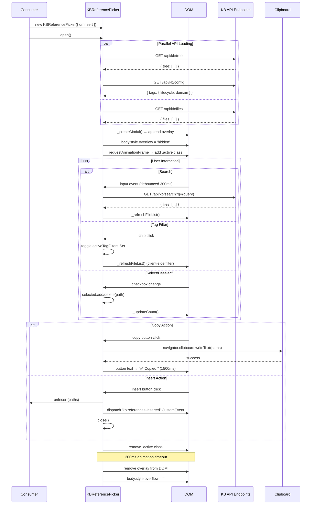

# Technical Design: KB Reference Picker

> Feature ID: FEATURE-049-G | Version: v1.0 | Last Updated: 07-19-2025

> program_type: frontend
> tech_stack: ["JavaScript (ES6+)", "CSS3", "Clipboard API", "Vitest"]

---

## Part 1: Agent-Facing Summary

### Key Components Implemented

| Component | Responsibility | Scope/Impact | Tags |
|-----------|---------------|--------------|------|
| `KBReferencePicker` class | Main entry point — manages modal lifecycle, state, API loading, rendering, and user interactions | Self-contained; no framework deps; any UI surface can instantiate | `modal`, `picker`, `reference`, `kb`, `cross-workflow` |
| `open()` / `close()` | Modal lifecycle — parallel API load, DOM mount/unmount, scroll lock, CSS transitions | Document body overlay; locks scroll | `lifecycle`, `modal`, `animation` |
| `_loadTree()` / `_loadConfig()` / `_loadFiles()` | Data layer — fetches from three KB API endpoints with graceful degradation | Network I/O; called in parallel via `Promise.all` | `api`, `fetch`, `data-loading`, `graceful-degradation` |
| `_createModal()` / `_renderTreePanel()` / `_renderFileList()` / `_renderFilterChips()` | DOM rendering — builds two-panel layout, folder tree, file list, tag chips | innerHTML-based; XSS-safe via `_escapeHtml` / `_escapeAttr` | `rendering`, `dom`, `xss-prevention` |
| `_bindEvents()` | Event wiring — close, backdrop click, search debounce, chip toggle, checkbox change, copy, insert | Delegated events on overlay; debounce timer management | `events`, `debounce`, `interaction` |
| `_copyToClipboard` (inline in `_bindEvents`) | Clipboard write with `execCommand` fallback | Clipboard API + textarea fallback for non-HTTPS | `clipboard`, `copy`, `fallback` |
| `_refreshFileList()` / `_updateCount()` | Incremental DOM updates — re-renders file list or count label without full modal rebuild | Targeted panel innerHTML swap | `rendering`, `incremental-update` |
| `_escapeHtml()` / `_escapeAttr()` | Security utilities — prevent XSS in rendered content and attribute values | Used by all render methods | `security`, `xss`, `escaping` |
| CSS stylesheet (`kb-reference-picker.css`) | Visual layer — dark theme, two-panel layout, chip styles, transitions, responsive constraints | Scoped via `.kb-ref-*` class namespace; CSS custom property theming | `css`, `theming`, `layout`, `animation` |

### Scope & Boundaries

**In scope:**
- Standalone modal for browsing, searching, filtering, selecting, copying, and inserting KB references
- Two-panel layout (folder tree + file list) with tag filter chips
- Multi-select via checkboxes for both files and folders
- Clipboard copy (Clipboard API + `execCommand` fallback) and insert via callback + CustomEvent
- Graceful degradation when APIs are unavailable
- XSS prevention for all user-generated content

**Out of scope:**
- File content preview / markdown rendering inside the picker
- Drag-and-drop reordering of selections
- Persistence of selections across open/close cycles
- Folder expand/collapse toggle (all folders render expanded)
- Keyboard navigation beyond native browser behavior
- Server-side tag filtering (tag filtering is client-side on loaded data; search endpoint handles server-side)

**Boundaries:**
- The picker does NOT transform reference paths — consumers decide format
- The picker does NOT prevent double-open — consumers must guard modal state
- The picker is framework-agnostic; it uses only vanilla JS and DOM APIs

### Dependencies

| Dependency | Source | Design Link | Usage Description |
|-----------|--------|-------------|-------------------|
| `/api/kb/tree` | FEATURE-049-A (KB Storage & Config) | `x-ipe-docs/requirements/EPIC-049/FEATURE-049-A/technical-design.md` | Returns folder tree structure for the left panel |
| `/api/kb/config` | FEATURE-049-A (KB Storage & Config) | `x-ipe-docs/requirements/EPIC-049/FEATURE-049-A/technical-design.md` | Returns lifecycle and domain tag arrays for filter chips |
| `/api/kb/files` | FEATURE-049-A (KB Storage & Config) | `x-ipe-docs/requirements/EPIC-049/FEATURE-049-A/technical-design.md` | Returns full file list with frontmatter metadata |
| `/api/kb/search` | FEATURE-049-C (KB Search & Tags) | `x-ipe-docs/requirements/EPIC-049/FEATURE-049-C/technical-design.md` | Returns search results filtered by query string |
| EPIC-039 Folder Browser Modal | Pattern reference | — | Reuses the 80vw two-panel modal shell pattern (design pattern, not code import) |
| Clipboard API | Browser | — | Primary method for `writeText`; fallback to `document.execCommand('copy')` |

### Major Flow

1. **Instantiation** — Consumer creates `new KBReferencePicker({ onInsert })` with optional callback
2. **Open** — `open()` fires three parallel fetches (`Promise.all`), builds modal DOM, appends to body, locks scroll, triggers CSS enter animation
3. **Browse** — User navigates folder tree (left panel) and file list (right panel), checking items to select
4. **Search** — Typing in search input triggers 300ms debounced fetch to `/api/kb/search?q=...`, replaces file list
5. **Filter** — Clicking tag chips toggles client-side OR filter on the loaded file set
6. **Select** — Checkbox changes add/remove paths from `Set`; footer count updates in real-time
7. **Copy** — "📋 Copy" button joins selected paths with `\n`, writes to clipboard, shows "✅ Copied!" feedback for 1500ms
8. **Insert** — "Insert" button calls `onInsert(paths)`, dispatches `kb:references-inserted` CustomEvent on `document`, closes modal
9. **Close** — `close()` removes `active` class, waits 300ms animation, removes overlay from DOM, restores body scroll

### Usage Example

```javascript
// Instantiate with an insert callback
const picker = new KBReferencePicker({
    onInsert: (paths) => {
        console.log('Selected KB references:', paths);
        // e.g., ["knowledge-base/guides/setup.md", "knowledge-base/api-docs.md"]
    }
});

// Open the modal (fetches data, renders, animates in)
await picker.open();

// Or listen for the CustomEvent instead of using callback
document.addEventListener('kb:references-inserted', (e) => {
    const { paths } = e.detail;
    // Handle inserted references
});
```

---

## Part 2: Implementation Guide

### Workflow Diagram



### Component Architecture

```
KBReferencePicker (class)
├── Static Constants
│   ├── DEBOUNCE_MS = 300
│   ├── ANIMATION_MS = 300
│   ├── COPY_FEEDBACK_MS = 1500
│   └── API = { TREE, CONFIG, FILES, SEARCH } (frozen)
│
├── State (instance)
│   ├── onInsert: Function|null        — consumer callback
│   ├── overlay: HTMLElement|null       — modal overlay DOM node
│   ├── tree: Array                     — folder tree from API
│   ├── files: Array                    — file list from API
│   ├── config: { lifecycle, domain }   — tag config from API
│   ├── selected: Set<string>           — checked paths
│   ├── searchQuery: string             — current search text
│   ├── activeTagFilters: Set<string>   — active chip tags
│   └── _debounceTimer: number|null     — search debounce ID
│
├── Lifecycle
│   ├── open()          — Promise.all load → _createModal → scroll lock → animate in
│   └── close()         — clear debounce → animate out → remove overlay → restore scroll
│
├── Data Loading
│   ├── _loadTree()     — GET /api/kb/tree → this.tree
│   ├── _loadConfig()   — GET /api/kb/config → this.config
│   └── _loadFiles()    — GET /api/kb/files or /api/kb/search → this.files
│
├── Rendering
│   ├── _createModal()       — builds full modal HTML, appends to body, calls _bindEvents
│   ├── _renderFilterChips() — lifecycle (amber) + domain (blue) chip spans
│   ├── _renderTreePanel()   — recursive folder tree with checkboxes
│   ├── _renderTreeNodes()   — recursive helper for nested folders
│   ├── _renderFileList()    — file items with checkboxes and tag pills (applies activeTagFilters)
│   ├── _refreshFileList()   — targeted re-render of .kb-ref-list-panel innerHTML
│   └── _updateCount()       — updates .kb-ref-count text
│
├── Events (_bindEvents)
│   ├── Close button click   → close()
│   ├── Overlay backdrop click → close()
│   ├── Search input         → debounced _loadFiles + _refreshFileList
│   ├── Chip click           → toggle activeTagFilters + _refreshFileList
│   ├── Checkbox change      → selected.add/delete + _updateCount
│   ├── Copy button click    → clipboard.writeText with execCommand fallback
│   └── Insert button click  → onInsert callback + CustomEvent + close()
│
└── Security Utilities
    ├── _escapeHtml(str)  — DOM textContent-based escaping
    └── _escapeAttr(str)  — regex character replacement (&, ", ', <, >)
```

### API Contracts

#### Input: Constructor Options

```javascript
{
    onInsert?: (paths: string[]) => void  // Called when user clicks "Insert"
}
```

#### API Endpoints Consumed

**GET `/api/kb/tree`**
```json
{
    "tree": [
        {
            "name": "guides",
            "type": "folder",
            "children": [
                { "name": "setup", "type": "folder", "children": [] }
            ]
        }
    ]
}
```

**GET `/api/kb/config`**
```json
{
    "tags": {
        "lifecycle": ["Requirement", "Technical Design"],
        "domain": ["Onboarding", "Architecture"]
    }
}
```

**GET `/api/kb/files`**
```json
{
    "files": [
        {
            "name": "getting-started.md",
            "path": "knowledge-base/getting-started.md",
            "frontmatter": {
                "title": "Getting Started",
                "tags": { "lifecycle": ["Requirement"], "domain": ["Onboarding"] }
            }
        }
    ]
}
```

**GET `/api/kb/search?q={query}`**
```json
{
    "files": [ /* same shape as /api/kb/files */ ]
}
```

#### Output: Events

| Event | Target | Detail |
|-------|--------|--------|
| `kb:references-inserted` | `document` | `{ paths: string[] }` — array of selected project-root-relative paths |

### Implementation Steps

> **Note:** These steps document the already-implemented design for reference, not future work.

1. **Define class skeleton with static constants** — `DEBOUNCE_MS`, `ANIMATION_MS`, `COPY_FEEDBACK_MS`, `API` endpoints as `Object.freeze`
2. **Constructor** — Accept options, initialize empty state (`tree`, `files`, `config`, `selected` Set, `activeTagFilters` Set, `searchQuery`, `_debounceTimer`)
3. **Data loading methods** — Three async methods (`_loadTree`, `_loadConfig`, `_loadFiles`) with try/catch for graceful degradation; `_loadFiles` switches URL based on `searchQuery`
4. **`open()`** — `Promise.all` the three loaders → `_createModal()` → lock scroll → `requestAnimationFrame` to add `.active` class
5. **`_createModal()`** — Build modal HTML via template literal (header, toolbar/search, filter chips, two-panel body, footer) → append to body → `_bindEvents()`
6. **Tree rendering** — `_renderTreePanel()` checks for empty state; `_renderTreeNodes()` recurses, building path prefixes, rendering checkboxes with `data-type="folder"`
7. **File list rendering** — `_renderFileList()` applies client-side tag filter (OR logic), maps files to label+checkbox+info+tags HTML
8. **Filter chips** — `_renderFilterChips()` maps lifecycle (amber) and domain (blue) tags to chip spans with `data-tag` attribute
9. **Event binding** — Close button, backdrop click, debounced search input, chip toggle, delegated checkbox change, copy button, insert button
10. **Copy action** — Join selected paths with `\n`, try `navigator.clipboard.writeText`, catch → textarea fallback; show "✅ Copied!" feedback for 1500ms
11. **Insert action** — Call `onInsert(paths)`, dispatch `kb:references-inserted` CustomEvent, close modal
12. **`close()`** — Clear debounce timer, remove `.active` class, wait `ANIMATION_MS`, remove overlay, restore scroll
13. **Security** — `_escapeHtml` (textContent-based) and `_escapeAttr` (regex replacement) used in all render paths

### Edge Cases & Error Handling

| Edge Case | Handling | Reference |
|-----------|----------|-----------|
| All APIs fail on open | Each loader has independent try/catch; modal renders with "No folders" / "No files found" placeholders | EC-049-G-01 |
| Empty Knowledge Base | Empty-state divs shown in both panels; Copy/Insert operate on empty selection | EC-049-G-02 |
| Clipboard API unavailable | Fallback creates temporary textarea, selects content, calls `document.execCommand('copy')`, removes textarea | EC-049-G-03 |
| XSS in file/folder names | `_escapeHtml()` uses DOM textContent assignment; `_escapeAttr()` replaces `&`, `"`, `'`, `<`, `>` | EC-049-G-04 |
| Rapid search typing | 300ms debounce resets on each keystroke; `clearTimeout` prevents stale callbacks; timer cleared on close | EC-049-G-05 |
| Double open | Not guarded — second overlay appends alongside first; consumers should track modal state externally | EC-049-G-06 |
| Close during animation | `close()` checks `this.overlay` existence; `removeChild` guarded by `overlay?.parentNode` null check | Defensive coding |
| Non-OK API response | Checked via `res.ok` before parsing JSON; non-OK silently leaves state empty | `_loadTree`, `_loadConfig`, `_loadFiles` |

---

## Design Change Log

| Version | Date | Author | Description |
|---------|------|--------|-------------|
| v1.0 | 07-19-2025 | Echo 📡 | Initial technical design (retroactive from implemented code) |
