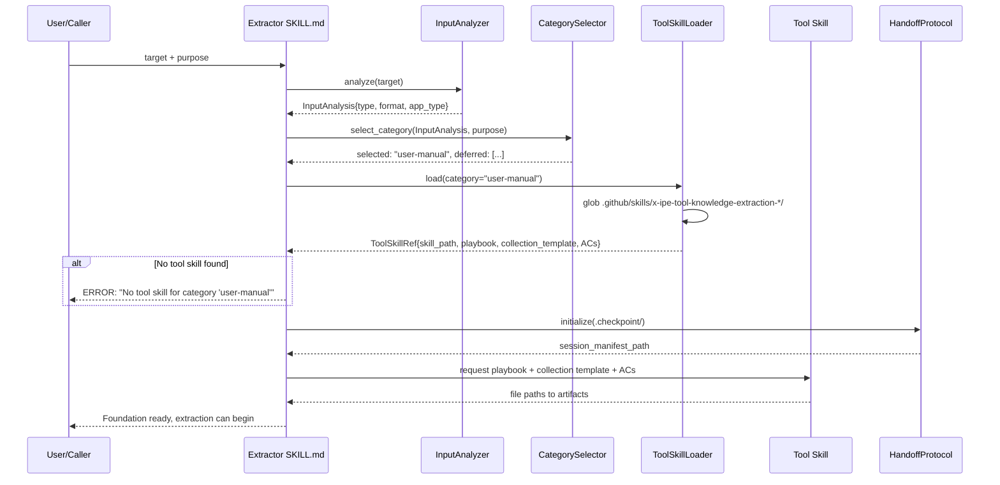
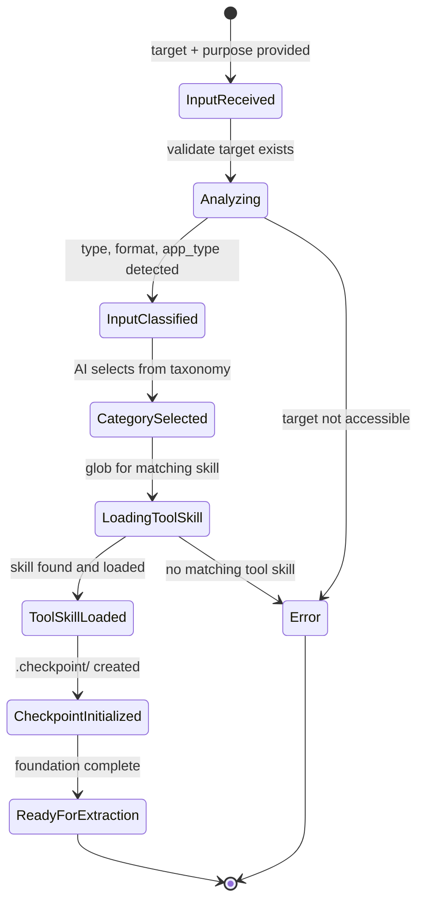

# Technical Design: Extractor Skill Foundation & Input Detection

> Feature ID: FEATURE-050-A | Version: v1.0 | Last Updated: 03-17-2026

---

## Part 1: Agent-Facing Summary

> **Purpose:** Quick reference for AI agents navigating the extractor skill.
> **📌 AI Coders:** Focus on this section for implementation context.

### Key Components Implemented

| Component | Responsibility | Scope/Impact | Tags |
|-----------|----------------|--------------|------|
| `SKILL.md` | Skill entry point with input/output YAML, execution procedure, DoR/DoD | Core skill definition | #skill #extractor #foundation |
| `InputAnalyzer` (procedure step) | Auto-detect input type, format, and app-type from user-provided target | Input classification pipeline | #input #detection #classification |
| `ToolSkillLoader` (procedure step) | Discover and load `x-ipe-tool-knowledge-extraction-*` skills via glob | Tool skill orchestration | #tool-skill #loading #discovery |
| `HandoffProtocol` (convention) | File-based knowledge exchange via `.checkpoint/` folder | Extractor ↔ tool skill communication | #handoff #checkpoint #protocol |
| `CategorySelector` (procedure step) | Select extraction category from fixed taxonomy based on input analysis | Category routing | #category #taxonomy #selection |
| `references/input-detection-heuristics.md` | Heuristic rules for input type and app-type classification | Reference documentation | #heuristics #reference |
| `references/handoff-protocol.md` | File-based handoff protocol specification | Reference documentation | #protocol #reference |
| `templates/checkpoint-manifest.md` | Template for checkpoint manifest file structure | Template | #checkpoint #template |

### Dependencies

| Dependency | Source | Design Link | Usage Description |
|------------|--------|-------------|-------------------|
| X-IPE skill framework | Foundation | `.github/skills/` conventions | SKILL.md format, input/output YAML, references/templates folder structure |
| `x-ipe-tool-knowledge-extraction-*` | External (separate EPIC) | N/A — not yet built | Tool skills providing playbook, collection template, acceptance criteria |
| `x-ipe-docs/config/tools.json` | EPIC-048 | `x-ipe-docs/config/tools.json` | Web search gating via `stages.feature.implementation` config |

### Major Flow

1. User provides `target` (path/URL) + `purpose` (extraction category) → Skill validates inputs exist/are reachable
2. `InputAnalyzer` classifies: input_type (source_code_repo, documentation_folder, running_web_app, public_url, single_file), format (markdown, code, html, etc.), app_type (web, cli, mobile, unknown)
3. `CategorySelector` evaluates input against fixed taxonomy → selects applicable category (v1: user-manual only)
4. `ToolSkillLoader` globs `.github/skills/x-ipe-tool-knowledge-extraction-*/SKILL.md` → filters by category → loads matching skill
5. Loaded tool skill returns: playbook_template_path, collection_template_path, acceptance_criteria_path
6. `HandoffProtocol` initializes `.checkpoint/` folder with session manifest → ready for extraction (FEATURE-050-B)

### Usage Example

```yaml
# Invoking the extractor skill
input:
  task_id: "TASK-999"
  task_based_skill: "x-ipe-task-based-application-knowledge-extractor"
  execution_mode: "workflow-mode"
  workflow:
    name: "Knowledge-Extraction"
  target: "/path/to/my-web-app"
  purpose: "user-manual"
  config_overrides:
    max_retries: 3
    web_search_enabled: true

# Expected output after foundation phase
output:
  status: "ready_for_extraction"
  input_analysis:
    input_type: "source_code_repo"
    format: "mixed (python, html, markdown)"
    app_type: "web"
    source_metadata:
      primary_language: "python"
      framework: "flask"
      file_count: 142
  selected_category: "user-manual"
  deferred_categories: ["API-reference", "architecture"]
  loaded_tool_skill: "x-ipe-tool-knowledge-extraction-user-manual"
  tool_skill_artifacts:
    playbook_template: ".github/skills/x-ipe-tool-knowledge-extraction-user-manual/templates/playbook-web.md"
    collection_template: ".github/skills/x-ipe-tool-knowledge-extraction-user-manual/templates/collection-template.md"
    acceptance_criteria: ".github/skills/x-ipe-tool-knowledge-extraction-user-manual/references/acceptance-criteria.md"
  checkpoint_path: ".checkpoint/session-20260317-143022/"
```

---

## Part 2: Implementation Guide

> **Purpose:** Detailed guide for implementing the extractor skill.
> **📌 Emphasis on visual diagrams for comprehension.**

### Workflow Diagram



### State Diagram



### Skill Folder Structure

```
.github/skills/x-ipe-task-based-application-knowledge-extractor/
├── SKILL.md                           # Main skill definition
├── references/
│   ├── input-detection-heuristics.md  # Input type & app-type detection rules
│   ├── handoff-protocol.md            # File-based handoff specification
│   ├── category-taxonomy.md           # Fixed extraction category definitions
│   └── examples.md                    # Execution examples
└── templates/
    ├── checkpoint-manifest.md         # Session manifest template
    └── input-analysis-output.md       # InputAnalysis structure template
```

### Data Models

#### InputAnalysis

```yaml
InputAnalysis:
  input_type: "source_code_repo | documentation_folder | running_web_app | public_url | single_file"
  format: "markdown | python | javascript | html | mixed | yaml | json | unknown"
  app_type: "web | cli | mobile | unknown"
  source_metadata:
    primary_language: "string | null"
    framework: "string | null"         # e.g., flask, react, click
    file_count: int
    total_size_bytes: int
    entry_points: ["string"]           # detected entry points
    has_docs: bool                     # whether docs/ or README exists
```

#### Input Type Detection Heuristics

| Signal | Input Type | Confidence |
|--------|-----------|------------|
| Directory with package.json, Cargo.toml, pyproject.toml, etc. | source_code_repo | High |
| Directory with only .md/.rst/.txt files | documentation_folder | High |
| URL matching `localhost:*` or `127.0.0.1:*` | running_web_app | High |
| URL matching `https?://*` (not localhost) | public_url | High |
| Single file path (not directory) | single_file | High |
| Directory with mix of code + docs | source_code_repo | Medium (primary by file count) |
| Path does not exist | Error | — |

#### App-Type Detection Heuristics

| Signal | App Type | Priority |
|--------|----------|----------|
| package.json with `"start"` script + HTML/JSX files | web | 1 |
| Flask/Django/Express/Rails markers | web | 1 |
| argparse, click, commander.js, clap in dependencies | cli | 2 |
| React Native, Flutter, Swift/Kotlin mobile markers | mobile | 3 |
| No framework markers detected | unknown | 4 |

#### Category Taxonomy & Selection Logic

```yaml
extraction_categories:
  - id: "user-manual"
    description: "End-user documentation: installation, usage, configuration, troubleshooting"
    priority: 1
    v1_supported: true
  - id: "API-reference"
    description: "API endpoints, request/response schemas, authentication, rate limits"
    priority: 2
    v1_supported: false
  - id: "architecture"
    description: "System design, module structure, data flow, deployment topology"
    priority: 3
    v1_supported: false
  - id: "runbook"
    description: "Operations: monitoring, alerts, incident response, maintenance"
    priority: 4
    v1_supported: false
  - id: "configuration"
    description: "Configuration options, environment variables, feature flags"
    priority: 5
    v1_supported: false
```

**CategorySelector v1 Behavior:** In v1, the selector is a **hardcoded filter** — it validates that `purpose` matches a `v1_supported: true` category. If the user provides `purpose: "user-manual"`, it passes. Any other purpose returns an error listing v1-supported categories. Future versions will use AI-driven category suggestion from input analysis (analyzing file patterns, README content, etc.), but v1 does NOT require LLM inference for category selection.

**Multiple Tool Skills Resolution:** If glob returns multiple tool skills for the same category, select the **first match by alphabetical glob order**. Version-based selection is deferred to future work.

#### Checkpoint Location & Manifest

**Location Rule:** `.checkpoint/` is created in the **current working directory** (project root where the agent runs). For URL-only targets (no local path), CWD is used. The checkpoint folder is always local to the extraction session, never inside the target directory.

```yaml
# ${CWD}/.checkpoint/session-{timestamp}/manifest.yaml
schema_version: "1.0"
session_id: "session-20260317-143022"
created_at: "2026-03-17T14:30:22Z"
target: "/path/to/my-web-app"
purpose: "user-manual"
input_analysis:
  input_type: "source_code_repo"
  format: "mixed"
  app_type: "web"
selected_category: "user-manual"
loaded_tool_skill: "x-ipe-tool-knowledge-extraction-user-manual"
status: "initialized"  # initialized | extracting | validating | complete | paused | error
sections: []           # populated by FEATURE-050-B/C during extraction
```

#### Tool Skill Interface Contract

The extractor expects loaded tool skills to expose these artifacts:

```yaml
ToolSkillArtifacts:
  playbook_template: "path"     # Defines extraction structure (sections, order, depth)
  collection_template: "path"   # Per-section prompts guiding what to extract
  acceptance_criteria: "path"   # Validation rules for each section
  app_type_mixins:              # Optional app-type specific overrides
    web: "path | null"
    cli: "path | null"
    mobile: "path | null"
```

### Implementation Steps

1. **Create skill folder structure:**
   - `.github/skills/x-ipe-task-based-application-knowledge-extractor/`
   - Subfolders: `references/`, `templates/`

2. **Write SKILL.md:**
   - Frontmatter (name, description, triggers)
   - Input Parameters with `target`, `purpose`, `config_overrides`
   - Execution Flow table (Phase 1: Input Analysis → Phase 2: Tool Skill Loading → Phase 3: Foundation Setup → later phases for FEATURE-050-B/C/D/E)
   - Execution Procedure with steps for InputAnalyzer, CategorySelector, ToolSkillLoader, HandoffProtocol
   - Output Result YAML
   - Definition of Ready / Definition of Done

3. **Write reference documents:**
   - `references/input-detection-heuristics.md` — detection rules from data models above
   - `references/handoff-protocol.md` — file naming, folder structure, message format
   - `references/category-taxonomy.md` — category definitions with v1 support flags
   - `references/examples.md` — 2-3 execution scenarios

4. **Write templates:**
   - `templates/checkpoint-manifest.md` — manifest YAML structure
   - `templates/input-analysis-output.md` — InputAnalysis output structure

### Edge Cases & Error Handling

| Scenario | Expected Behavior |
|----------|-------------------|
| Target path is symlink | Resolve to real path, then analyze |
| Target directory is empty | Return error: "Input directory is empty" |
| Target directory has only binary files | Detect as "binary_only", return error with suggestion |
| URL returns non-200 status | Return error with HTTP status code |
| URL requires auth | Return error: "URL requires authentication" |
| Multiple tool skills match glob | Filter by selected category, take first match |
| No tool skills installed | Return error listing expected skill name |
| Tool skill SKILL.md parse failure | Return error identifying parse location |
| `.checkpoint/` already exists (no resume flag) | Create timestamped subfolder to avoid conflicts |
| Mixed-content directory | Classify by file-count majority, log secondary types |
| No applicable category for `purpose` | Return error: "Category '{purpose}' is not supported in v1. Supported: user-manual" |
| Multi-framework directory (e.g. Flask + Click) | Use highest-priority app_type from heuristic table (web > cli > mobile > unknown) |
| Symlink pointing outside target directory | Do NOT follow; log warning and skip symlinked path |

---

## Design Change Log

| Date | Phase | Change Summary |
|------|-------|----------------|
| 03-17-2026 | Initial Design | Initial technical design for extractor skill foundation. Defines skill folder structure, input analysis pipeline, tool skill loading via glob, category taxonomy, file-based handoff protocol, and checkpoint manifest schema. |
