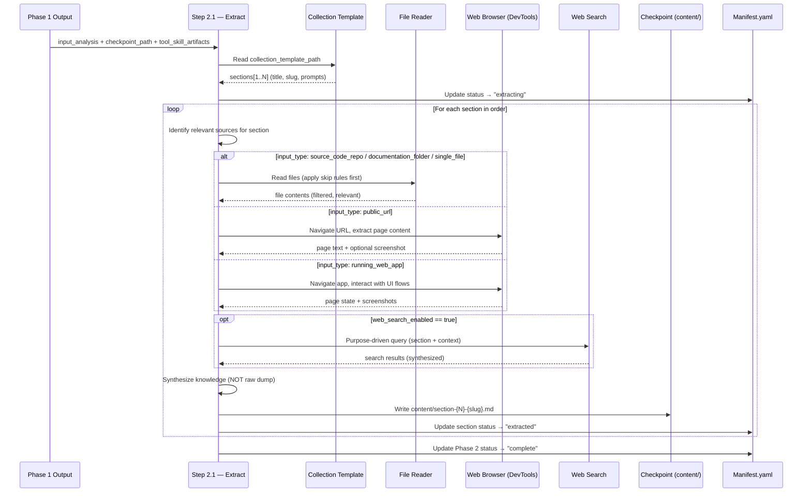
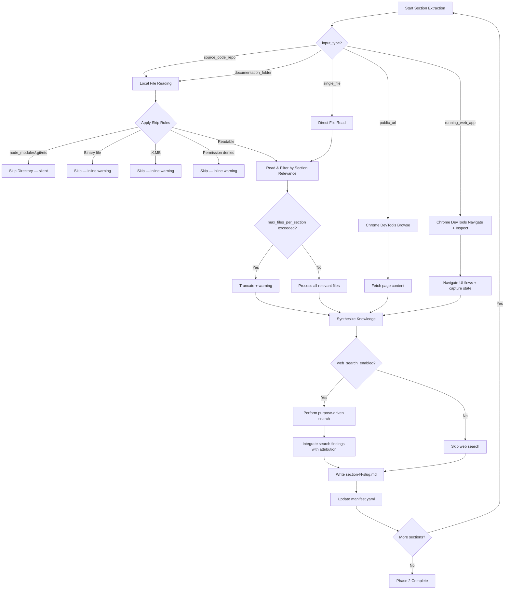

# Technical Design: Source Extraction Engine

> Feature ID: FEATURE-050-B | Version: v1.0 | Last Updated: 2026-03-17
> Program Type: skills | Tech Stack: SKILL.md/Prompt Engineering

---

## Part 1: Agent-Facing Summary

> **Purpose:** Quick reference for AI agents implementing the extraction engine.
> **📌 AI Coders:** Focus on this section for implementation context.

### What This Feature Does

Implements Phase 2 (审问之 — Inquire Thoroughly) of the application knowledge extractor — the engine that reads files, browses web pages, inspects running apps, and performs web search to extract knowledge section-by-section following a tool skill's collection template. Outputs one synthesized `section-{N}-{slug}.md` file per template section into the `.checkpoint/` directory.

### Key Components Implemented

| Component | Responsibility | Scope/Impact | Tags |
|-----------|----------------|--------------|------|
| `Step 2.1` (SKILL.md procedure step) | Single extraction step with input_type DECISION branches | Phase 2 of SKILL.md execution procedure | #extraction #phase2 #step |
| `CollectionTemplateParser` (procedure logic) | Read and iterate collection template sections in order | Drives the section-by-section extraction loop | #template #parsing #sections |
| `LocalFileReader` (DECISION branch) | Read source_code_repo, documentation_folder, single_file inputs | File-based extraction capability | #file-reading #local #source |
| `WebBrowser` (DECISION branch) | Browse public_url and running_web_app via Chrome DevTools MCP | Web-based extraction capability | #web #browsing #chrome-devtools |
| `WebSearchAugmenter` (supplementary action) | Purpose-driven web search when enabled via config_overrides | Supplementary knowledge enrichment | #web-search #supplementary |
| `ScreenshotHandler` (supplementary action) | User-provided priority → Chrome DevTools fallback → graceful skip | Visual evidence collection | #screenshots #visual #capture |
| `SkipRuleEngine` (guard logic) | Binary, vendor dirs, >1MB, permission denied → skip with warnings | I/O protection and error resilience | #skip-rules #warnings #guard |
| `ManifestUpdater` (progress tracking) | Update manifest.yaml per-section with status, paths, timestamps | Checkpoint progress tracking | #manifest #checkpoint #progress |
| `references/extraction-engine-heuristics.md` | Detailed extraction logic, skip rules, file relevance heuristics | Reference document (keeps SKILL.md concise) | #reference #heuristics #extraction |

### Usage Example

```yaml
# Phase 1 output (FEATURE-050-A) feeds into Phase 2
phase_1_output:
  status: "ready_for_extraction"
  input_analysis:
    input_type: "source_code_repo"
    format: "mixed (python, html, markdown)"
    app_type: "web"
    source_metadata:
      primary_language: "python"
      framework: "flask"
      file_count: 142
  selected_category: "user-manual"
  loaded_tool_skill: "x-ipe-tool-knowledge-extraction-user-manual"
  tool_skill_artifacts:
    collection_template: ".github/skills/x-ipe-tool-knowledge-extraction-user-manual/templates/collection-template.md"
  checkpoint_path: ".checkpoint/session-20260317-143022/"

# Phase 2 reads collection template → iterates sections → extracts per section
# Collection template example (3 sections):
#   Section 1: "Overview" — What does the app do?
#   Section 2: "Installation" — How to install and set up?
#   Section 3: "Usage" — How to use key features?

# Phase 2 output: content files in checkpoint
phase_2_output:
  checkpoint_path: ".checkpoint/session-20260317-143022/"
  content_files:
    - "content/section-01-overview.md"        # synthesized from README, main.py, about page
    - "content/section-02-installation.md"    # synthesized from setup.py, requirements.txt, docs/install.md
    - "content/section-03-usage.md"           # synthesized from docs/, CLI help output, UI screenshots
  manifest_status: "phase_2_complete"
  sections_extracted: 3
  sections_skipped: 0
  total_warnings: 2
```

### Dependencies

| Dependency | Source | Usage |
|------------|--------|-------|
| FEATURE-050-A Phase 1 output | Internal | InputAnalysis, checkpoint_path, tool_skill_artifacts, selected_category |
| Tool skill collection template | `x-ipe-tool-knowledge-extraction-user-manual` | Section definitions driving extraction loop |
| Chrome DevTools MCP | Built-in agent tool | Web page browsing, app navigation, screenshot capture |
| Web Search tool | Built-in agent tool | Supplementary web search (gated by `config_overrides.web_search_enabled`) |
| Handoff protocol | FEATURE-050-A `references/handoff-protocol.md` | File-based content exchange via `.checkpoint/` |

---

## Part 2: Implementation Guide

> **Purpose:** Detailed guide for implementing Phase 2 in the SKILL.md.
> **📌 Emphasis on SKILL.md prompt engineering, not runtime code.**

### Extraction Flow Diagram



### Input Type Decision Tree



### Phase 2 Step Structure for SKILL.md

This defines the exact content to add to `SKILL.md` replacing the Phase 2 stub (lines 327–334).

#### Step 2.1 — Extract Source Content

The step follows the existing CONTEXT/DECISION/ACTION/VERIFY pattern established by Phase 1.

**CONTEXT block** — What inputs from Phase 1:
- `tool_skill_artifacts.collection_template` — path to the collection template file
- `input_analysis` — input_type, format, app_type, source_metadata from Step 1.1
- `checkpoint_path` — path to `.checkpoint/session-{timestamp}/` from Step 1.4
- `config_overrides` — web_search_enabled, max_files_per_section (default 50)
- `tool_skill_artifacts.app_type_mixins` — optional per-app-type extraction guidance

Actions in CONTEXT:
1. Read the collection template file and parse into ordered section list
2. Each section provides: title, slug, extraction prompts, scope guidance
3. Create `{checkpoint_path}/content/` directory if not exists
4. Update manifest.yaml status from "initialized" to "extracting"

**DECISION block** — Branches per input_type:
- The DECISION is evaluated **per section** within the extraction loop
- Primary capability determined by `input_analysis.input_type`:
  - `source_code_repo` OR `documentation_folder` → **local file reading**
  - `single_file` → **direct file reading** (map to relevant sections)
  - `public_url` → **Chrome DevTools web browsing** (`navigate_page`, `take_snapshot`)
  - `running_web_app` → **Chrome DevTools navigation + interaction** (`navigate_page`, `click`, `take_snapshot`, `take_screenshot`)
- Supplementary capability (any branch): web search IF `config_overrides.web_search_enabled == true`

**ACTION block** — Per-section extraction:
For EACH section in collection template order:
1. Identify relevant source materials matching the section's extraction prompts
2. Apply skip rules before reading (see `references/extraction-engine-heuristics.md`)
3. Read/browse/inspect using the appropriate capability
4. Synthesize knowledge into coherent content (NOT raw file copies)
5. Handle screenshots per priority chain
6. If web search enabled: augment with purpose-driven search results
7. Write to `{checkpoint_path}/content/section-{N}-{slug}.md`
8. Update manifest.yaml with section result

**VERIFY block** — What to check after extraction:
- ✅ All collection template sections processed (each has status: extracted | skipped | empty | error)
- ✅ Content files exist in `{checkpoint_path}/content/` for each extracted section
- ✅ manifest.yaml updated with per-section: status, content_file, files_read, warnings count, timestamps
- ✅ Phase 2 overall status in manifest is "complete"
- ✅ No inline content passed — all content via file paths in checkpoint

### Extraction Strategy per Input Type

#### source_code_repo / documentation_folder

```
Strategy: Directory traversal → relevance filtering → knowledge synthesis

1. ENUMERATE: List all files in target directory (recursive)
2. EXCLUDE (before read — no I/O wasted):
   - Directories: node_modules/, .git/, __pycache__/, .venv/, dist/, build/, .tox/
   - Binary files: detected by extension (.pyc, .whl, .exe, .dll, .so, .png, .jpg, .gif, .ico, .woff, .ttf, .zip, .tar, .gz)
   - Oversized: files > 1MB
   - Permission denied: OS-level access failure
3. FILTER by section relevance:
   - Match file paths/names against section extraction prompts
   - Use source_metadata (framework, language) to prioritize files
   - Example: "Installation" section → setup.py, requirements.txt, Dockerfile, docs/install*
4. APPLY circuit breaker: if matched files > max_files_per_section → take top 50 by relevance, warn
5. READ: Read file contents
6. SYNTHESIZE: Produce coherent knowledge (summarize, organize, contextualize) — NOT raw file dumps
```

#### public_url

```
Strategy: Page fetch → content extraction → optional link following

1. NAVIGATE: Use Chrome DevTools MCP navigate_page to target URL
2. SNAPSHOT: Use take_snapshot to get page content (a11y tree / text)
3. EXTRACT: Parse relevant content matching section extraction prompts
4. FOLLOW LINKS (if section requires deeper content):
   - Identify navigation links within same domain
   - Navigate to relevant sub-pages (max 5 per section for v1)
   - Extract sub-page content
5. SCREENSHOT: If section is UI-relevant, use take_screenshot
6. SYNTHESIZE: Combine page content into section knowledge
7. ERROR: If page unresponsive or error → warning comment, continue
```

#### running_web_app

```
Strategy: Navigate → interact → capture state → synthesize

1. NAVIGATE: Use Chrome DevTools MCP navigate_page to app URL
2. INTERACT: Follow UI flows relevant to section:
   - Click navigation elements to explore pages
   - Fill forms if needed to demonstrate functionality
   - Use take_snapshot after each significant interaction
3. CAPTURE: Use take_screenshot for visual evidence of UI states
4. EXTRACT: Combine snapshots, screenshots, and observed behavior
5. SYNTHESIZE: Describe application behavior in section context
6. ERROR: If app becomes unresponsive → warning, mark section "partial"
```

#### single_file

```
Strategy: Read → map to sections → synthesize per section

1. READ: Read the single file content
2. MAP: For each collection template section, identify relevant portions of the file
3. SYNTHESIZE: Extract section-relevant knowledge
4. NOTE: Same file content may inform multiple section files — this is expected
```

### Collection Template Integration

#### Reading the Template

```
Input: tool_skill_artifacts.collection_template (file path from Phase 1)
Action: Read file, parse section structure

Expected template structure (markdown):
  ## Section 1: Overview
  <!-- extraction_prompt: What does the application do? What problem does it solve? -->
  <!-- scope: README, main entry point, about page -->

  ## Section 2: Installation
  <!-- extraction_prompt: How to install? Dependencies? System requirements? -->
  <!-- scope: setup files, requirements, Dockerfiles, install docs -->

  ...

Parsing rules:
  - Each H2 (##) heading = one section
  - Section index (N) = sequential from 1
  - Section slug = heading text → lowercase, alphanumeric + hyphens only
  - Extraction prompts in HTML comments guide what to look for
  - Scope hints in HTML comments suggest which files/pages are relevant
```

#### Section-to-File Mapping

```
For each section:
  N = section index (1-based), zero-padded to 2 digits
  slug = sanitized section title (lowercase, alphanumeric, hyphens)
  output_file = {checkpoint_path}/content/section-{N}-{slug}.md

Examples:
  Section 1: "Overview"      → content/section-01-overview.md
  Section 2: "Installation"  → content/section-02-installation.md
  Section 3: "Usage Guide"   → content/section-03-usage-guide.md
```

#### Content File Format

```markdown
# {Section Title}

<!-- Generated by: x-ipe-task-based-application-knowledge-extractor Phase 2 -->
<!-- Section: {N} | Source: {input_type} | Files read: {count} -->

{Synthesized knowledge content — organized, coherent, contextual}

<!-- EXTRACTION_WARNING: Skipped src/vendor/large.min.js — file exceeds 1MB limit -->
<!-- EXTRACTION_WARNING: Skipped dist/bundle.wasm — binary file -->
```

Warnings are collected at the END of the content file in a block (per AC-050B-07c).

### Web Search Integration

```
Gate:     config_overrides.web_search_enabled == true
Timing:   AFTER primary extraction per section (supplementary, not primary)
Purpose:  Enrich extracted knowledge with external context

Query Construction:
  - Base: section extraction prompt keywords
  - Context: input_analysis.source_metadata.framework + primary_language
  - Scope: purpose-driven (e.g., "Flask installation best practices" not "Flask")

Example queries per section:
  Section "Installation" + framework=Flask → "Flask application deployment requirements"
  Section "Configuration" + framework=React → "React environment variables configuration"

Integration:
  - Synthesize findings INTO the section content (not a separate block)
  - Attribute sources: "According to [Flask docs](url), ..."
  - Web search results supplement — they do NOT replace local extraction
  - If search returns no useful results → silently omit (no warning needed)
```

### Screenshot Handling

```
Priority chain (per section):
  1. User-provided screenshots:
     - Check for image files in target directory or user-specified paths
     - Reference in section content: 
  2. Auto-capture (Chrome DevTools MCP):
     - Available when input_type is "running_web_app" or "public_url"
     - Use take_screenshot tool to capture UI states
     - Save to {checkpoint_path}/content/screenshots/section-{N}-{description}.png
     - Reference in section content with relative path
  3. Graceful skip:
     - For input_type "source_code_repo", "documentation_folder", "single_file"
     - No screenshots expected — skip silently (no warning)

Screenshot naming:
  {checkpoint_path}/content/screenshots/section-{N}-{descriptive-slug}.png
```

### Skip Rules & Error Handling

#### Skip Rule Evaluation Order

```
Order matters — evaluated top-to-bottom to minimize I/O:

1. DIRECTORY EXCLUSION (skip entire directory tree — silent, no warning):
   - node_modules/
   - .git/
   - __pycache__/
   - .venv/
   - dist/
   - build/
   - .tox/

2. BINARY FILE DETECTION (skip with inline warning):
   Extensions: .pyc, .pyo, .whl, .egg, .exe, .dll, .so, .dylib, .a, .o,
               .png, .jpg, .jpeg, .gif, .bmp, .ico, .svg, .webp,
               .woff, .woff2, .ttf, .eot, .otf,
               .zip, .tar, .gz, .bz2, .7z, .rar,
               .pdf, .doc, .docx, .xls, .xlsx,
               .mp3, .mp4, .avi, .mov, .wav,
               .db, .sqlite, .lock
   Warning: <!-- EXTRACTION_WARNING: Skipped {path} — binary file -->

3. SIZE CHECK (skip with inline warning):
   Threshold: 1MB (1,048,576 bytes)
   Warning: <!-- EXTRACTION_WARNING: Skipped {path} — file exceeds 1MB limit -->

4. PERMISSION CHECK (skip with inline warning):
   Trigger: OS returns permission denied on read
   Warning: <!-- EXTRACTION_WARNING: Skipped {path} — permission denied -->

5. CIRCUIT BREAKER (truncate with inline warning):
   Trigger: matched files per section > config_overrides.max_files_per_section (default 50)
   Warning: <!-- EXTRACTION_WARNING: Section truncated — {total} files matched, limit is {max} -->
```

#### Non-Fatal Section Errors

```
If an unexpected error occurs during extraction of a section:
  - Log the error in manifest.yaml for that section
  - Mark section status as "error" in manifest
  - Continue to the next section — do NOT halt the session
  - Section content file may be partial or absent
```

### Manifest Update Schema

```yaml
# Updated manifest.yaml during Phase 2
schema_version: "1.0"
session_id: "session-20260317-143022"
created_at: "2026-03-17T14:30:22Z"
target: "/path/to/my-web-app"
purpose: "user-manual"
input_analysis:
  input_type: "source_code_repo"
  format: "mixed"
  app_type: "web"
selected_category: "user-manual"
loaded_tool_skill: "x-ipe-tool-knowledge-extraction-user-manual"
status: "phase_2_complete"  # updated from "initialized" → "extracting" → "phase_2_complete"

# Phase 2 additions:
extraction_started_at: "2026-03-17T14:31:00Z"
extraction_completed_at: "2026-03-17T14:35:22Z"
sections:
  - id: 1
    title: "Overview"
    slug: "overview"
    status: "extracted"         # extracted | skipped | empty | error | partial
    content_file: "content/section-01-overview.md"
    started_at: "2026-03-17T14:31:00Z"
    completed_at: "2026-03-17T14:32:10Z"
    files_read: 12
    warnings: 0
    screenshots: []
  - id: 2
    title: "Installation"
    slug: "installation"
    status: "extracted"
    content_file: "content/section-02-installation.md"
    started_at: "2026-03-17T14:32:10Z"
    completed_at: "2026-03-17T14:33:45Z"
    files_read: 8
    warnings: 2
    screenshots: []
  - id: 3
    title: "Usage Guide"
    slug: "usage-guide"
    status: "extracted"
    content_file: "content/section-03-usage-guide.md"
    started_at: "2026-03-17T14:33:45Z"
    completed_at: "2026-03-17T14:35:22Z"
    files_read: 24
    warnings: 1
    screenshots:
      - "content/screenshots/section-03-main-dashboard.png"

total_sections: 3
sections_extracted: 3
sections_skipped: 0
sections_empty: 0
sections_error: 0
total_warnings: 3
web_search_used: true
```

### Data Models

#### ExtractionContext (input to Phase 2)

```yaml
ExtractionContext:
  # From Phase 1 output
  input_analysis:
    input_type: "source_code_repo | documentation_folder | running_web_app | public_url | single_file"
    format: "string"
    app_type: "web | cli | mobile | unknown"
    source_metadata:
      primary_language: "string | null"
      framework: "string | null"
      file_count: int
      total_size_bytes: int
      entry_points: ["string"]
      has_docs: bool
  checkpoint_path: "string"
  config_overrides:
    web_search_enabled: bool        # default true
    max_files_per_section: int      # default 50
    max_retries: int                # default 3
    timeout_seconds: int            # default 15

  # Parsed from collection template
  collection_template:
    source_path: "string"
    sections:
      - index: int
        title: "string"
        slug: "string"
        extraction_prompts: "string"
        scope_guidance: "string"
```

#### SectionExtraction (per-section output)

```yaml
SectionExtraction:
  section_id: int
  title: "string"
  slug: "string"
  status: "extracted | skipped | empty | error | partial"
  content_file: "string"           # relative path from checkpoint
  started_at: "ISO 8601 timestamp"
  completed_at: "ISO 8601 timestamp"
  files_read: int
  warnings: int
  warning_details: ["string"]      # list of warning messages
  screenshots: ["string"]          # list of screenshot file paths
  web_search_performed: bool
  error_message: "string | null"   # populated only if status == "error"
```

#### ManifestUpdate (progress tracking delta)

```yaml
ManifestUpdate:
  # Applied after each section completes
  section_result: SectionExtraction
  # Applied after all sections complete
  overall:
    status: "phase_2_complete"
    extraction_started_at: "ISO 8601"
    extraction_completed_at: "ISO 8601"
    total_sections: int
    sections_extracted: int
    sections_skipped: int
    sections_empty: int
    sections_error: int
    total_warnings: int
    web_search_used: bool
```

### Line Budget Analysis

```
Current SKILL.md state:
  Total lines:           500 (at the 500-line limit)
  Phase 2-4 stub:        lines 327–334 (8 lines for Phase 2 + Phase 3 + Phase 4 combined)

Phase 2 Step 2.1 estimated size:
  Phase 2 header:        3 lines
  Step 2.1 header:       1 line
  CONTEXT block:         8 lines
  DECISION block:        8 lines
  ACTION block:          12 lines
  VERIFY block:          7 lines
  REFERENCE block:       3 lines
  Separator:             1 line
  Subtotal:              ~43 lines

Phase 3-4 replacement stubs:
  Phase 3 stub:          3 lines
  Phase 4 stub:          3 lines
  Subtotal:              ~6 lines

Total new content:       ~49 lines
Replaced stub:           8 lines
Net addition:            ~41 lines
Projected total:         ~541 lines ⚠️ OVER BUDGET by ~41 lines

Resolution strategy:
  1. COMPRESS Phase 2 in SKILL.md — keep it to ~35 lines max
     - CONTEXT: 6 lines (remove redundant details)
     - DECISION: 6 lines (one-line-per-branch)
     - ACTION: 10 lines (numbered list, concise)
     - VERIFY: 5 lines
     - REFERENCE: 2 lines
  2. MOVE detailed heuristics to NEW reference file:
     → .github/skills/x-ipe-task-based-application-knowledge-extractor/references/extraction-engine-heuristics.md
     - Skip rule details (file extensions, directory names)
     - Per-input-type extraction strategies
     - Collection template parsing rules
     - Screenshot handling priority chain
     - Web search query construction patterns
  3. RECLAIM lines from Phase 1 (optional, only if needed):
     - Remove duplicate verify items
     - Shorten REFERENCE sections to single lines
     Estimated savings: 5-10 lines

Target: SKILL.md stays at or under 500 lines
  Phase 2 in SKILL.md:  ~35 lines
  Phase 3-4 stubs:      ~6 lines
  Total new content:     ~41 lines
  Replaced stub:         8 lines
  Net addition:          ~33 lines
  Projected total:       ~533 lines → still needs ~33 lines reclaimed from Phase 1

Recommended approach:
  - Write Phase 2 at ~35 lines (ultra-concise, reference-heavy)
  - Trim Phase 1 REFERENCE sections (4 steps × 2 lines each = 8 lines saved)
  - Trim redundant VERIFY items (est. 10 lines saved)
  - Trim Step 5.2 (completion) boilerplate where possible (est. 5 lines)
  - Net: 35 + 6 - 8 = 33 new lines, reclaim ~25-30 lines → target ≤ 503 lines (acceptable)
```

### New Reference File

A new reference file is required to offload extraction details from SKILL.md:

```
.github/skills/x-ipe-task-based-application-knowledge-extractor/
├── SKILL.md
├── references/
│   ├── input-detection-heuristics.md       # existing (FEATURE-050-A)
│   ├── handoff-protocol.md                 # existing (FEATURE-050-A)
│   ├── category-taxonomy.md                # existing (FEATURE-050-A)
│   ├── examples.md                         # existing (FEATURE-050-A)
│   └── extraction-engine-heuristics.md     # NEW (FEATURE-050-B)
└── templates/
    ├── checkpoint-manifest.md              # existing (FEATURE-050-A)
    └── input-analysis-output.md            # existing (FEATURE-050-A)
```

**`references/extraction-engine-heuristics.md`** contains:
- Skip rule evaluation order with full file extension lists
- Per-input-type extraction strategies (detailed)
- Collection template parsing rules
- Section relevance matching heuristics
- Screenshot handling priority chain
- Web search query construction patterns
- Content synthesis guidelines (what "synthesize, not dump" means concretely)
- Warning format reference and placement rules

### Edge Cases & Error Handling

| Edge Case | Expected Behavior | AC Reference |
|-----------|-------------------|--------------|
| Empty repo (no readable files after skip rules) | Write `<!-- EXTRACTION_NOTE: No readable source files found after applying skip rules -->` in all section files. Mark sections "empty" in manifest. | AC-050B-01d |
| Public URL behind authentication | Warning: `<!-- EXTRACTION_WARNING: Skipped {url} — authentication required -->`. Continue with other sources. | AC-050B-03d |
| Running app unresponsive mid-extraction | Warning for current section. Mark "partial" in manifest. Continue to next section. | AC-050B-07d |
| Collection template has zero sections | Mark Phase 2 "complete" with zero content files. Log warning in manifest. | AC-050B-01a |
| Single file mapped to multiple sections | Extract relevant portions for each section. Same file may inform multiple output files. | AC-050B-02c |
| All files in a section exceed 1MB | Write warning-only content file. Mark section "skipped" in manifest. | AC-050B-02f |
| Web search returns nothing useful | Silently omit web search content. No warning (search is supplementary). | AC-050B-05a |
| Source repo with >1000 files | Circuit breaker: process top 50 per section by relevance, warn about truncation. | AC-050B-07b |
| Section slug has special characters | Sanitize: lowercase, alphanumeric + hyphens only. E.g., "API & Auth" → "api-auth" | spec technical considerations |

### Acceptance Criteria Traceability

| Design Component | ACs Covered |
|-----------------|-------------|
| Step 2.1 CONTEXT (template parsing) | AC-050B-01a, AC-050B-01b |
| Step 2.1 ACTION (synthesis, not dumps) | AC-050B-01c, AC-050B-01d |
| LocalFileReader branch | AC-050B-02a, AC-050B-02b, AC-050B-02c, AC-050B-02d, AC-050B-02e, AC-050B-02f |
| WebBrowser branch | AC-050B-03a, AC-050B-03b, AC-050B-03c, AC-050B-03d |
| ScreenshotHandler | AC-050B-04a, AC-050B-04b, AC-050B-04c |
| WebSearchAugmenter | AC-050B-05a, AC-050B-05b, AC-050B-05c, AC-050B-05d |
| ManifestUpdater | AC-050B-06a, AC-050B-06b, AC-050B-06c, AC-050B-06d |
| SkipRuleEngine | AC-050B-07a, AC-050B-07b, AC-050B-07c, AC-050B-07d |

---

## Design Change Log

| Date | Phase | Change Summary |
|------|-------|----------------|
| 2026-03-17 | Initial Design | Technical design for Source Extraction Engine (Phase 2). Defines Step 2.1 structure with CONTEXT/DECISION/ACTION/VERIFY pattern, extraction strategies per input type, collection template integration, web search gating, screenshot handling priority chain, skip rules with evaluation order, manifest update schema, data models, line budget analysis, and new reference file for extraction heuristics. Key design decision: one generic step with DECISION branches per input_type (from DAO-109). |
