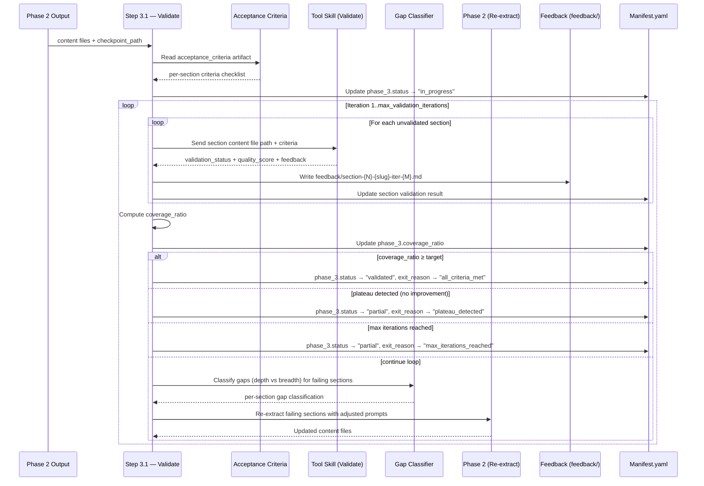
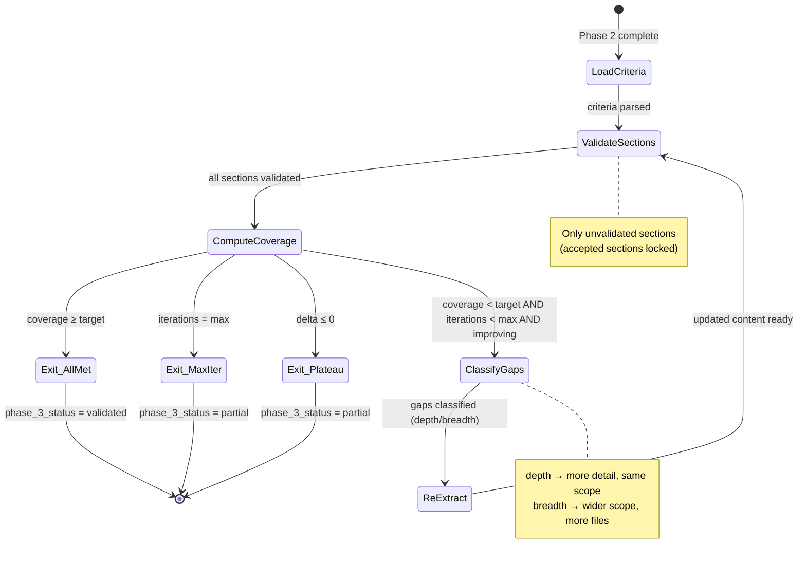

# Technical Design: Extract-Validate Loop & Coverage Control

> Feature ID: FEATURE-050-C | Version: v1.0 | Last Updated: 2026-03-17
> Program Type: skills | Tech Stack: SKILL.md/Prompt Engineering

---

## Part 1: Agent-Facing Summary

> **Purpose:** Quick reference for AI agents implementing the validation loop.
> **📌 AI Coders:** Focus on this section for implementation context.

### What This Feature Does

Implements Phase 3 (慎思之 — Think Carefully) of the application knowledge extractor — the iterative validation loop that reads tool skill acceptance criteria, validates each extracted section against them, classifies gaps as depth or breadth, coordinates targeted re-extraction, and iterates until coverage thresholds are met or exit conditions trigger.

### Key Components Implemented

| Component | Responsibility | Scope/Impact | Tags |
|-----------|----------------|--------------|------|
| `Step 3.1` (SKILL.md procedure step) | Single validation step with iterative loop | Phase 3 of SKILL.md execution procedure | #validation #phase3 #step |
| `AcceptanceCriteriaLoader` (procedure logic) | Read and parse tool skill acceptance_criteria into per-section checklist | Drives validation against tool skill standards | #criteria #parsing #checklist |
| `SectionValidator` (dispatch logic) | Send each section to tool skill for validation via file-based handoff | Per-section validation with structured feedback | #validation #handoff #tool-skill |
| `CoverageComputer` (computation logic) | Compute coverage_ratio = criteria_met / total_criteria | Quantitative completeness measure | #coverage #ratio #metrics |
| `GapClassifier` (analysis logic) | Classify failing criteria as "depth" or "breadth" gaps | Targeted re-extraction decisions | #gap #depth #breadth #classification |
| `ReExtractionCoordinator` (loop logic) | Re-invoke Phase 2 extraction for failing sections with adjusted prompts | Iterative quality improvement | #re-extraction #loop #targeted |
| `IterationController` (lifecycle logic) | Manage iteration count, exit conditions, plateau detection | Loop termination control | #iteration #exit #plateau |
| `FeedbackPersister` (I/O logic) | Write feedback files to `.checkpoint/feedback/` per section per iteration | Traceability and feedback-driven improvement | #feedback #checkpoint #persistence |
| `ManifestUpdater` (progress tracking) | Update manifest.yaml with Phase 3 fields per iteration | Checkpoint progress tracking | #manifest #checkpoint #progress |
| `references/validation-loop-heuristics.md` | Detailed validation logic, gap classification rules, feedback format | Reference document (keeps SKILL.md concise) | #reference #heuristics #validation |

### Usage Example

```yaml
# Phase 2 output (FEATURE-050-B) feeds into Phase 3
phase_2_output:
  checkpoint_path: ".checkpoint/session-20260317-143022/"
  content_files:
    - "content/section-01-overview.md"
    - "content/section-02-installation.md"
    - "content/section-03-usage.md"
  manifest_status: "phase_2_complete"
  sections_extracted: 3

# Phase 3 reads acceptance_criteria, validates each section, iterates
# Iteration 1: 2 of 3 sections pass → coverage_ratio = 0.67
# Iteration 2: re-extract section-03 (depth gap) → coverage_ratio = 0.87
# Exit: coverage_ratio ≥ 0.8 → "all_criteria_met"

phase_3_output:
  phase_3_status: "validated"
  exit_reason: "all_criteria_met"
  final_coverage_ratio: 0.87
  iterations_completed: 2
  sections:
    - slug: "overview"
      validation_status: "accepted"
      validated_in_iteration: 1
    - slug: "installation"
      validation_status: "accepted"
      validated_in_iteration: 1
    - slug: "usage"
      validation_status: "accepted"
      validated_in_iteration: 2
      feedback_file: "feedback/section-03-usage-iter-1.md"
  unresolved_gaps: []
```

### Dependencies

| Dependency | Source | Usage |
|------------|--------|-------|
| FEATURE-050-A Phase 1 output | Internal | `tool_skill_artifacts.acceptance_criteria` path, checkpoint_path |
| FEATURE-050-B Phase 2 output | Internal | Content files in `.checkpoint/content/`, extraction logic for re-invocation |
| Tool skill acceptance_criteria | `x-ipe-tool-knowledge-extraction-user-manual` | Per-section criteria defining "good" content |
| Tool skill validation interface | `x-ipe-tool-knowledge-extraction-user-manual` | "Operation 2: Validate & Pack" for section validation |
| Handoff protocol | FEATURE-050-A `references/handoff-protocol.md` | File-based feedback exchange via `.checkpoint/feedback/` |
| `config_overrides` | Skill input parameters | `max_validation_iterations` (default 3), `coverage_target` (default 0.8) |

---

## Part 2: Implementation Guide

> **Purpose:** Detailed guide for implementing Phase 3 in the SKILL.md.
> **📌 Emphasis on SKILL.md prompt engineering, not runtime code.**

### Validation Flow Diagram



### Iteration State Machine



### Phase 3 Step Structure for SKILL.md

This defines the exact content to add to `SKILL.md` replacing the Phase 3 stub (lines 323–326 in current SKILL.md).

#### Step 3.1 — Validate & Iterate

The step follows the existing CONTEXT/DECISION/ACTION/VERIFY pattern established by Phase 1 and Phase 2.

**CONTEXT block** — What inputs from Phase 1 + Phase 2:
- `tool_skill_artifacts.acceptance_criteria` — path to acceptance criteria file from Phase 1 output
- `checkpoint_path` — path to `.checkpoint/session-{timestamp}/` with Phase 2 content files
- `manifest.yaml` — current manifest with Phase 2 section statuses
- `config_overrides.max_validation_iterations` — max loop iterations (default 3, clamped to [1, 10])
- `config_overrides.coverage_target` — minimum acceptable coverage ratio (default 0.8, range [0.0, 1.0])

Actions in CONTEXT:
1. Read the acceptance_criteria artifact and parse into per-section criteria checklist
2. Each criterion has: ID, description, section mapping, type indicator (depth/breadth)
3. Load Phase 2 section results from manifest (identify sections with status "extracted")
4. Update manifest: `phase_3.status → "in_progress"`, `phase_3.iteration_count → 1`, `phase_3.started_at`
5. Initialize accepted_sections list (empty) and coverage_history list (empty)

**DECISION block** — Exit condition evaluation (checked after each iteration):
- IF all sections have `validation_status: "accepted"` → EXIT with `exit_reason: "all_criteria_met"`
- IF iteration_count ≥ max_validation_iterations → EXIT with `exit_reason: "max_iterations_reached"`
- IF coverage_ratio delta ≤ 0 compared to previous iteration (and iteration > 1) → EXIT with `exit_reason: "plateau_detected"`
- IF no content files exist (Phase 2 produced zero sections) → EXIT with `phase_3_status: "skipped"`, `exit_reason: "no_content_to_validate"`
- ELSE → CONTINUE to next iteration with gap classification

**ACTION block** — Validation iteration loop:
For EACH iteration (1 to max_validation_iterations):
1. **Validate:** For each section NOT in accepted_sections, send content file path to tool skill for validation via file-based handoff (see `references/validation-loop-heuristics.md` for dispatch format)
2. **Record feedback:** Write tool skill response to `feedback/section-{N}-{slug}-iter-{M}.md`; update manifest per-section
3. **Lock accepted:** Sections returning `validation_status: "accepted"` are added to accepted_sections and NOT re-validated
4. **Compute coverage:** `coverage_ratio = criteria_met / total_criteria` across all sections; append to coverage_history
5. **Check exit:** Evaluate DECISION block exit conditions
6. **Classify gaps:** For failing sections, classify each gap as "depth" or "breadth" using feedback keywords (see `references/validation-loop-heuristics.md`)
7. **Re-extract:** Invoke Phase 2 Step 2.1 extraction for failing sections only with adjusted prompts — depth gaps get detail-augmented prompts; breadth gaps get scope-expanded prompts
8. **Update manifest:** Increment `phase_3.iteration_count`, update `phase_3.coverage_ratio`

**VERIFY block** — What to check after Phase 3:
- ✅ All sections have final `validation_status` (accepted | needs-more-info | error)
- ✅ Feedback files exist in `{checkpoint_path}/feedback/` for each validation iteration
- ✅ Manifest updated with `phase_3.status`, `phase_3.exit_reason`, `phase_3.final_coverage_ratio`
- ✅ `phase_3.coverage_history` contains one entry per iteration
- ✅ `phase_3.completed_at` timestamp recorded
- ✅ All feedback via file paths — no inline content in manifest

**REFERENCE:**
- Validation heuristics: `.github/skills/x-ipe-task-based-application-knowledge-extractor/references/validation-loop-heuristics.md`
- Handoff protocol: `.github/skills/x-ipe-task-based-application-knowledge-extractor/references/handoff-protocol.md`

### Validation Strategy

#### Acceptance Criteria Loading

```
Input: tool_skill_artifacts.acceptance_criteria (file path from Phase 1)
Action: Read file, parse per-section criteria structure

Expected format (markdown with structured sections):
  ## Section: Overview
  - [AC-UM-01] Describes what the application does and its purpose
  - [AC-UM-02] Identifies target users and use cases
  - [AC-UM-03] Includes version and compatibility information

  ## Section: Installation
  - [AC-UM-04] Lists all prerequisites and system requirements
  - [AC-UM-05] Provides step-by-step installation instructions
  ...

Parsing rules:
  - Each H2 (##) heading maps to a collection template section (by slug match)
  - Each list item = one criterion with an ID prefix [AC-XXX]
  - Criteria without section mapping → apply to all sections (global criteria)
  - If no criteria found for a section → section is implicitly "accepted" (warn)
```

#### Section Validation Dispatch

```
For each section requiring validation:
  1. Construct validation request:
     - section_id: section index + slug
     - content_file: {checkpoint_path}/content/section-{N}-{slug}.md
     - criteria: list of acceptance criteria for this section
     - iteration: current iteration number
  2. Send to tool skill via file-based handoff:
     - Tool skill reads content file
     - Tool skill evaluates content against each criterion
     - Tool skill writes response as structured feedback
  3. Receive validation response:
     - validation_status: "accepted" | "needs-more-info"
     - quality_score: { ac_pass_rate: float, clarity_score: float }
     - feedback: { failing_criteria: [...], missing_topics: [...], suggestions: [...] }
```

#### Coverage Ratio Computation

```
After all sections validated in an iteration:
  criteria_met = 0
  total_criteria = 0

  for each section:
    section_criteria = criteria mapped to this section
    total_criteria += len(section_criteria)
    if section.validation_status == "accepted":
      criteria_met += len(section_criteria)
    else:
      criteria_met += count of passing criteria within this section

  coverage_ratio = criteria_met / total_criteria  (0.0 if total_criteria == 0)
```

### Feedback Generation

#### Per-Section Feedback Format

Feedback files are written to `.checkpoint/session-{ts}/feedback/section-{N}-{slug}-iter-{M}.md`:

```markdown
# Validation Feedback: {Section Title}

<!-- Iteration: {M} | Section: {N} | Timestamp: {ISO 8601} -->
<!-- Validation Status: needs-more-info -->

## Failing Criteria

- [AC-UM-05] Installation instructions — **Gap: depth** — "Steps are listed but lack detail on environment-specific variations (Windows vs macOS vs Linux)"
- [AC-UM-06] Troubleshooting — **Gap: breadth** — "No troubleshooting content found; missing common installation errors"

## Missing Topics

- Environment-specific installation paths
- Common error messages and their resolutions
- Dependency version compatibility matrix

## Suggested Actions

- **Depth:** Re-extract installation section focusing on platform-specific details from README and docs/install*
- **Breadth:** Expand file scope to include TROUBLESHOOTING.md, FAQ.md, and GitHub issues
```

#### Gap Classification Rules

```
Keyword-based classification on tool skill feedback text:

DEPTH indicators (content exists but is insufficient):
  - "insufficient detail"
  - "too shallow"
  - "needs more depth"
  - "lacks specifics"
  - "needs examples"
  - "expand on"
  - "more detail on"
  → gap_type = "depth"

BREADTH indicators (content is missing entirely):
  - "not covered"
  - "missing topic"
  - "no content found"
  - "not mentioned"
  - "absent"
  - "no sources found"
  → gap_type = "breadth"

AMBIGUOUS (no clear keyword match):
  → DEFAULT to "depth" (BR-050C-06: safer to over-detail than under-discover)
```

### Re-extraction Loop

#### Targeted Re-extraction Coordinator

```
For each failing section with classified gap:

IF gap_type == "depth":
  - Read most recent feedback file for the section
  - Augment extraction prompts with: "Provide more detailed content on: {failing_topics}"
  - Keep same source scope (same files/pages as original extraction)
  - Re-invoke Phase 2 Step 2.1 for this section only

IF gap_type == "breadth":
  - Read most recent feedback file for the section
  - Expand source scope: add additional directories, sub-pages, or file patterns
  - Add search queries for missing topics: "{missing_topic} {framework} {app_context}"
  - Re-invoke Phase 2 Step 2.1 for this section only

Re-extraction rules:
  - Only the most recent feedback is read (not cumulative) — AC-050C-04d
  - Updated content overwrites the existing section file in content/
  - Accepted sections are NEVER re-extracted — BR-050C-02
  - Phase 3 delegates content writing to Phase 2 — BR-050C-01
```

#### Prompt Augmentation Examples

```yaml
# Original extraction prompt (from collection template):
original_prompt: "How to install? Dependencies? System requirements?"

# Depth-augmented prompt (iteration 2, depth gap):
augmented_prompt: |
  How to install? Dependencies? System requirements?
  ADDITIONAL GUIDANCE (from validation feedback iteration 1):
  - Provide platform-specific installation steps (Windows, macOS, Linux)
  - Include exact version numbers for all dependencies
  - Add example terminal commands for each step

# Breadth-augmented prompt (iteration 2, breadth gap):
augmented_prompt: |
  How to install? Dependencies? System requirements?
  ADDITIONAL SOURCES TO CHECK:
  - TROUBLESHOOTING.md, FAQ.md, CONTRIBUTING.md
  - GitHub issues tagged "installation" or "setup"
  - CI/CD configuration files (for dependency hints)
  MISSING TOPICS TO COVER:
  - Troubleshooting common installation errors
  - Docker-based installation alternative
```

### Exit Conditions

| Condition | Check | Result | Manifest Update |
|-----------|-------|--------|-----------------|
| All criteria met | All sections `validation_status: "accepted"` | `phase_3_status: "validated"` | `exit_reason: "all_criteria_met"` |
| Max iterations reached | `iteration_count >= max_validation_iterations` | `phase_3_status: "partial"` | `exit_reason: "max_iterations_reached"`, log remaining gaps |
| Plateau detected | `coverage_ratio[N] - coverage_ratio[N-1] <= 0` (N > 1) | `phase_3_status: "partial"` | `exit_reason: "plateau_detected"`, log "no improvement between iterations {N-1} and {N}" |
| No content to validate | Phase 2 produced zero content files | `phase_3_status: "skipped"` | `exit_reason: "no_content_to_validate"`, `coverage_ratio: 0.0` |

Exit evaluation order (first match wins):
1. No content → skip
2. All criteria met → validated
3. Max iterations → partial
4. Plateau → partial
5. Else → continue

### Manifest Update Schema

```yaml
# Additions to manifest.yaml during Phase 3
# (additive — Phase 1 and Phase 2 fields are NOT modified)

status: "phase_3_complete"  # updated from "phase_2_complete"

# Phase 3 fields (all new — added under phase_3 key)
phase_3:
  status: "validated | partial | skipped"
  exit_reason: "all_criteria_met | max_iterations_reached | plateau_detected | no_content_to_validate"
  started_at: "2026-03-17T14:36:00Z"
  completed_at: "2026-03-17T14:42:15Z"
  iteration_count: 2
  final_coverage_ratio: 0.87
  coverage_history: [0.67, 0.87]       # one entry per iteration
  coverage_target: 0.8                   # from config_overrides
  max_validation_iterations: 3           # from config_overrides

# Per-section updates (extend existing sections array entries)
sections:
  - id: 1
    slug: "overview"
    # ... existing Phase 2 fields preserved ...
    # Phase 3 additions:
    validation_status: "accepted"         # accepted | needs-more-info | error
    quality_score:
      ac_pass_rate: 1.0
      clarity_score: 0.9
    validated_in_iteration: 1
    feedback_file: null                   # null for accepted sections (no feedback needed)
  - id: 2
    slug: "installation"
    validation_status: "accepted"
    quality_score:
      ac_pass_rate: 1.0
      clarity_score: 0.85
    validated_in_iteration: 1
    feedback_file: null
  - id: 3
    slug: "usage"
    validation_status: "accepted"
    quality_score:
      ac_pass_rate: 0.83
      clarity_score: 0.8
    validated_in_iteration: 2
    feedback_file: "feedback/section-03-usage-iter-1.md"

# Unresolved gaps (populated when exit_reason != "all_criteria_met")
unresolved_gaps: []
# Example when partial:
# unresolved_gaps:
#   - section_slug: "usage"
#     gap_type: "depth"
#     failing_criteria: ["AC-UM-12", "AC-UM-13"]
#     last_feedback: "feedback/section-03-usage-iter-3.md"
```

### Data Models

#### ValidationResult (per-section, per-iteration)

```yaml
ValidationResult:
  section_id: int
  section_slug: "string"
  iteration: int
  validation_status: "accepted | needs-more-info | error"
  quality_score:
    ac_pass_rate: float              # 0.0-1.0 — fraction of criteria passing
    clarity_score: float             # 0.0-1.0 — tool skill's clarity assessment
  criteria_results:
    - criterion_id: "AC-UM-XX"
      status: "met | not-met"
      feedback: "string | null"      # tool skill comment if not-met
  feedback_file: "string | null"     # path to feedback file (null if accepted)
  validated_at: "ISO 8601 timestamp"
```

#### CoverageAssessment (overall + per-section)

```yaml
CoverageAssessment:
  iteration: int
  coverage_ratio: float              # 0.0-1.0 — criteria_met / total_criteria
  total_criteria: int
  criteria_met: int
  per_section:
    - section_slug: "string"
      section_criteria_count: int
      section_criteria_met: int
      section_coverage: float        # per-section ratio (informational)
      validation_status: "accepted | needs-more-info | error"
  delta: float                       # change from previous iteration (null for iteration 1)
  meets_target: bool                 # coverage_ratio >= config coverage_target
```

#### FeedbackEntry (gap type, details, suggested action)

```yaml
FeedbackEntry:
  section_id: int
  section_slug: "string"
  iteration: int
  gap_type: "depth | breadth"
  failing_criteria:
    - criterion_id: "AC-UM-XX"
      description: "string"
      gap_detail: "string"           # tool skill's explanation of what's missing
  missing_topics: ["string"]         # topics not covered at all
  suggested_actions:
    - type: "depth | breadth"
      description: "string"          # e.g., "Re-extract with focus on platform-specific details"
      target_files: ["string"]       # additional files to read (breadth) or re-read (depth)
  feedback_file_path: "string"       # relative path in checkpoint
```

### Line Budget Analysis

```
Current SKILL.md state:
  Total lines:           496 (current file)
  Phase 3 stub:          lines 323-326 (4 lines: header + 2 content lines + blank)

Phase 3 Step 3.1 estimated size (in SKILL.md):
  Phase 3 header:        3 lines (### Phase 3 + status + blank)
  Step 3.1 header:       2 lines (#### Step 3.1 + blank)
  CONTEXT block:         7 lines (inputs + actions summary)
  DECISION block:        5 lines (exit conditions, one-line-per-condition)
  ACTION block:          10 lines (numbered list, concise, reference-heavy)
  VERIFY block:          6 lines (checkpoints)
  REFERENCE block:       3 lines
  Subtotal:              ~36 lines

Phase 4 replacement stub:
  Stub:                  3 lines
  Subtotal:              ~3 lines

Total new content:       ~39 lines
Replaced stub:           4 lines (Phase 3-4 combined stub)
Net addition:            ~35 lines
Projected total:         ~531 lines ⚠️ OVER BUDGET by ~31 lines

Resolution strategy:
  1. COMPRESS Phase 3 in SKILL.md — keep to ~30 lines max
     - CONTEXT: 5 lines (essentials only, reference-heavy)
     - DECISION: 4 lines (exit conditions, ultra-concise)
     - ACTION: 8 lines (numbered list, delegate details to reference)
     - VERIFY: 5 lines
     - REFERENCE: 2 lines
  2. MOVE all detailed logic to NEW reference file:
     → references/validation-loop-heuristics.md
     - Acceptance criteria parsing rules
     - Gap classification keyword lists
     - Feedback file format
     - Re-extraction prompt augmentation patterns
     - Coverage computation formula
     - Plateau detection logic
  3. RECLAIM lines from Phase 1/2 (if needed):
     - Compress VERIFY sections (remove duplicates)
     - Shorten REFERENCE blocks to single lines
     Estimated savings: 5-10 lines

Target: SKILL.md stays at or under 500 lines
  Phase 3 in SKILL.md:  ~30 lines
  Phase 4 stub:          ~3 lines
  Total new content:     ~33 lines
  Replaced stub:         4 lines
  Net addition:          ~29 lines
  Projected total:       ~525 lines → needs ~25 lines reclaimed from existing content

Recommended approach:
  - Write Phase 3 at ~30 lines (ultra-concise, reference-heavy)
  - Trim Phase 1 VERIFY redundancies (est. 8 lines saved)
  - Trim Phase 2 REFERENCE sections to single lines (est. 4 lines saved)
  - Compress Step 5.2 boilerplate (est. 8 lines saved)
  - Net: ~20-25 lines reclaimed → target ≤ 504 lines (acceptable)
```

### New Reference File

A new reference file is required to offload validation details from SKILL.md:

```
.github/skills/x-ipe-task-based-application-knowledge-extractor/
├── SKILL.md
├── references/
│   ├── input-detection-heuristics.md       # existing (FEATURE-050-A)
│   ├── handoff-protocol.md                 # existing (FEATURE-050-A)
│   ├── category-taxonomy.md                # existing (FEATURE-050-A)
│   ├── examples.md                         # existing (FEATURE-050-A)
│   ├── extraction-engine-heuristics.md     # existing (FEATURE-050-B)
│   └── validation-loop-heuristics.md       # NEW (FEATURE-050-C)
└── templates/
    ├── checkpoint-manifest.md              # existing (FEATURE-050-A)
    └── input-analysis-output.md            # existing (FEATURE-050-A)
```

**`references/validation-loop-heuristics.md`** contains:
- Acceptance criteria parsing rules (file format, section mapping, global criteria)
- Validation dispatch protocol (request/response format for tool skill)
- Coverage ratio computation formula with edge cases
- Gap classification keyword lists (depth vs breadth indicators)
- Feedback file format (markdown template with failing criteria, missing topics, suggested actions)
- Re-extraction prompt augmentation patterns (depth vs breadth examples)
- Plateau detection algorithm (delta computation, per-section stagnation)
- Section locking rules (accepted sections excluded from re-validation)
- Config validation (max_iterations clamping to [1, 10], coverage_target range [0.0, 1.0])

### Edge Cases & Error Handling

| Edge Case | Expected Behavior | AC Reference |
|-----------|-------------------|--------------|
| Phase 2 produced zero content files | Skip validation entirely; exit `phase_3_status: "skipped"`, `exit_reason: "no_content_to_validate"`, `coverage_ratio: 0.0` | spec edge case |
| Tool skill has no criteria for a section | Treat section as implicitly "accepted"; log warning "No acceptance criteria for section {slug}" | spec edge case |
| Tool skill returns unexpected format | Log error, mark section "error" in manifest, continue validating other sections; counts as "not met" in coverage | AC-050C-01d, NFR-050C-04 |
| All sections fail in every iteration | Plateau detection triggers after iteration 2 (0.0 → 0.0 = no improvement); exit `plateau_detected` | spec edge case |
| Single section keeps failing while others improve | Re-extraction targets only failing section; if overall ratio improves, loop continues; if ratio plateaus, exit | spec edge case |
| Re-extraction produces identical content | Detect no change for section, exclude from further re-extraction targets; if all failing sections excluded, trigger plateau exit | NFR-050C-04 |
| `max_validation_iterations` set to 1 | One validation pass only; no re-extraction; report whatever coverage initial content achieved | spec edge case |
| `coverage_target` set to 0.0 | Any non-negative coverage meets target; exit "all_criteria_met" after first pass | spec edge case |
| `coverage_target` set to 1.0 | Every criterion must pass; strict mode — any failure triggers loop | spec edge case |
| Tool skill accepts section with low quality_score | Section locked as "accepted"; quality scores recorded but do NOT influence validation loop (quality scoring is FEATURE-050-E) | spec edge case |
| `max_validation_iterations` outside [1, 10] | Clamp to nearest bound with warning (BR-050C-08) | NFR-050C-02 |

### Acceptance Criteria Traceability

| Design Component | ACs Covered |
|-----------------|-------------|
| AcceptanceCriteriaLoader (CONTEXT) | AC-050C-01a |
| SectionValidator (dispatch + handoff) | AC-050C-01b, AC-050C-01c, AC-050C-01d |
| CoverageComputer (ratio calculation) | AC-050C-02a, AC-050C-02b, AC-050C-02c |
| GapClassifier (depth vs breadth) | AC-050C-02d, AC-050C-02e |
| ReExtractionCoordinator (depth re-extract) | AC-050C-03a |
| ReExtractionCoordinator (breadth re-extract) | AC-050C-03b |
| Section locking (accepted sections skip) | AC-050C-03c |
| IterationController (loop continuation) | AC-050C-03d |
| FeedbackPersister (file writing) | AC-050C-04a |
| Feedback-driven re-extraction | AC-050C-04b, AC-050C-04c |
| Most-recent feedback only | AC-050C-04d |
| Exit: all criteria met | AC-050C-05a |
| Exit: max iterations reached | AC-050C-05b |
| Exit: plateau detected | AC-050C-05c |
| Exit metadata (all paths) | AC-050C-05d |
| Manifest: Phase 3 start | AC-050C-06a |
| Manifest: per-section validation | AC-050C-06b |
| Manifest: iteration update | AC-050C-06c |
| Manifest: Phase 3 finalization | AC-050C-06d |

---

## Design Change Log

| Date | Phase | Change Summary |
|------|-------|----------------|
| 2026-03-17 | Initial Design | Technical design for Extract-Validate Loop & Coverage Control (Phase 3). Defines Step 3.1 structure with CONTEXT/DECISION/ACTION/VERIFY pattern, validation strategy with tool-skill-guided criteria, coverage ratio computation, gap classification engine (depth vs breadth), targeted re-extraction coordinator with prompt augmentation, three exit conditions (all_criteria_met, max_iterations_reached, plateau_detected), feedback persistence to `.checkpoint/feedback/`, manifest Phase 3 schema additions, data models (ValidationResult, CoverageAssessment, FeedbackEntry), line budget analysis targeting ≤500 lines via reference offloading, and new reference file `validation-loop-heuristics.md`. Key design decisions: tool skill is sole validation authority (BR-050C-03), accepted sections are locked (BR-050C-02), ambiguous gaps default to depth (BR-050C-06), flat criteria counting without weighting (BR-050C-05). |
