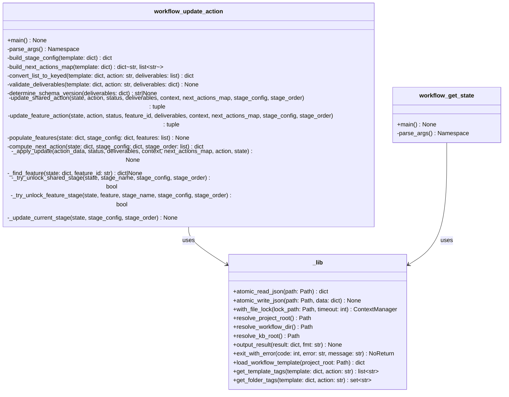
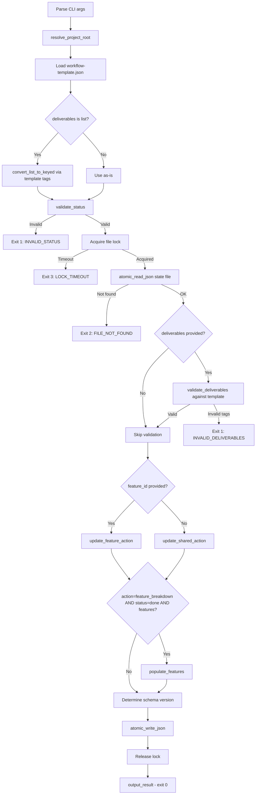
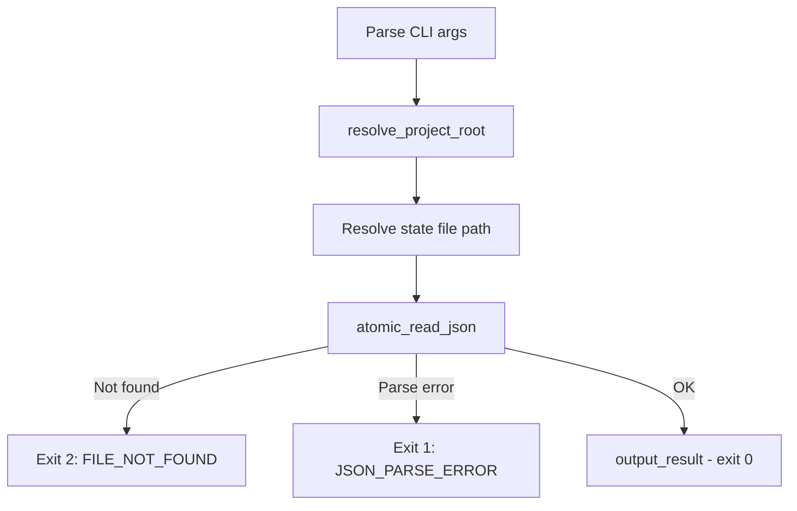

# Technical Design: Shared Utility & Workflow Scripts

> Feature ID: FEATURE-052-A | Version: v1.0 | Last Updated: 03-30-2026

## Version History

| Version | Date | Description |
|---------|------|-------------|
| v1.0 | 03-30-2026 | Initial design |

---

## Part 1: Agent-Facing Summary

> **Purpose:** Quick reference for AI agents navigating large projects.
> **📌 AI Coders:** Focus on this section for implementation context.

### Key Components Implemented

| Component | Responsibility | Scope/Impact | Tags |
|-----------|----------------|--------------|------|
| `_lib.py` | Shared utilities: atomic I/O, file locking, path resolution, output formatting | Foundation for all EPIC-052 scripts | #shared #atomic-io #file-lock #stdlib |
| `workflow_update_action.py` | CLI to update workflow action status, deliverables, context, features | Replaces MCP `update_workflow_action` tool (13 skills) | #workflow #update #cli #action-status |
| `workflow_get_state.py` | CLI to read full workflow state | Replaces MCP `get_workflow_state` tool (1 skill) | #workflow #read #cli #state |

### Dependencies

| Dependency | Source | Design Link | Usage Description |
|------------|--------|-------------|-------------------|
| `workflow-template.json` | Project config | [workflow-template.json](x-ipe-docs/config/workflow-template.json) | Deliverable tag definitions, stage/action structure, action_context schemas |
| `workflow-{name}.json` | Runtime data | `x-ipe-docs/engineering-workflow/workflow-{name}.json` | Workflow state files read/written by scripts |

### Major Flow

1. Agent invokes script → argparse parses flags → `resolve_project_root()` walks CWD upward to find `x-ipe-docs/`
2. **Update:** acquire `fcntl.flock(LOCK_EX)` on `.lock` file → `atomic_read_json()` → validate + mutate state → `atomic_write_json()` → release lock → `output_result()`
3. **Get state:** `atomic_read_json()` → `output_result()` (no locking needed for read-only)

### Usage Example

```bash
# Update a workflow action
python3 .github/skills/x-ipe-tool-x-ipe-app-interactor/scripts/workflow_update_action.py \
  --workflow my-project \
  --action compose_idea \
  --status done \
  --deliverables '{"raw-ideas": "x-ipe-docs/ideas/001/idea.md"}' \
  --format json

# Read workflow state
python3 .github/skills/x-ipe-tool-x-ipe-app-interactor/scripts/workflow_get_state.py \
  --workflow my-project \
  --format json
```

```python
# Programmatic usage of _lib.py (from other EPIC-052 scripts)
from _lib import atomic_read_json, atomic_write_json, with_file_lock, resolve_project_root

root = resolve_project_root()
state_path = root / "x-ipe-docs" / "engineering-workflow" / "workflow-demo.json"
lock_path = state_path.with_suffix(".lock")

with with_file_lock(lock_path, timeout=10):
    state = atomic_read_json(state_path)
    state["last_activity"] = "2026-03-30T12:00:00"
    atomic_write_json(state_path, state)
```

---

## Part 2: Implementation Guide

> **Purpose:** Human-readable details for developers.
> **📌 Emphasis on visual diagrams for comprehension.**

### File Layout

```
.github/skills/x-ipe-tool-x-ipe-app-interactor/
├── SKILL.md                        # (FEATURE-052-D, not this feature)
└── scripts/
    ├── _lib.py                     # Shared utility module (~180 LOC)
    ├── workflow_update_action.py    # Update action script (~350 LOC)
    └── workflow_get_state.py        # Get state script (~60 LOC)
```

### Class Diagram



### Workflow Diagram — `workflow_update_action.py`



### Workflow Diagram — `workflow_get_state.py`



### Module Design: `_lib.py`

#### Function Signatures

```python
"""Shared utilities for x-ipe-tool-x-ipe-app-interactor scripts."""
from __future__ import annotations
import fcntl, json, os, sys, tempfile
from contextlib import contextmanager
from pathlib import Path

# Exit codes
EXIT_SUCCESS = 0
EXIT_VALIDATION_ERROR = 1
EXIT_FILE_NOT_FOUND = 2
EXIT_LOCK_TIMEOUT = 3

PROJECT_ROOT_MARKER = "x-ipe-docs"


def resolve_project_root() -> Path:
    """Walk up from CWD until a directory containing x-ipe-docs/ is found."""

def resolve_workflow_dir(project_root: Path | None = None) -> Path:
    """Return {project_root}/x-ipe-docs/engineering-workflow/."""

def resolve_kb_root(project_root: Path | None = None) -> Path:
    """Return {project_root}/x-ipe-docs/knowledge-base/."""

def load_workflow_template(project_root: Path) -> dict:
    """Load workflow-template.json from x-ipe-docs/config/."""

def get_template_tags(template: dict, action: str) -> list[str]:
    """Extract ordered deliverable tag names for an action from template.
    '$output:raw-ideas' -> 'raw-ideas'
    """

def get_folder_tags(template: dict, action: str) -> set[str]:
    """Return set of tag names that use $output-folder prefix."""

def atomic_read_json(path: Path) -> dict:
    """Read and parse JSON file. Returns error dict on failure."""

def atomic_write_json(path: Path, data: dict) -> None:
    """Atomic write: tempfile in same dir -> fsync -> os.replace."""

@contextmanager
def with_file_lock(lock_path: Path, timeout: int = 10):
    """Acquire exclusive flock with timeout. Yields on success, exit(3) on timeout."""

def output_result(result: dict, fmt: str = "json") -> None:
    """Print result to stdout in json or text format."""

def exit_with_error(code: int, error: str, message: str) -> None:
    """Print error JSON to stdout and sys.exit(code)."""
```

#### Key Implementation Details

**`atomic_write_json`** — mirrors existing `_write_state()` from `workflow_manager_service.py` (line 960):
```python
def atomic_write_json(path: Path, data: dict) -> None:
    path.parent.mkdir(parents=True, exist_ok=True)
    fd, tmp_path = tempfile.mkstemp(dir=str(path.parent), suffix=".tmp")
    try:
        with os.fdopen(fd, "w", encoding="utf-8") as f:
            json.dump(data, f, indent=2, ensure_ascii=False)
            f.flush()
            os.fsync(f.fileno())     # NFR-052-A.01: explicit fsync
        os.replace(tmp_path, str(path))
    except Exception:
        if os.path.exists(tmp_path):
            os.unlink(tmp_path)
        raise
```

**`with_file_lock`** — mirrors existing locking from `update_action_status()` (line 334), adds timeout via non-blocking retry:
```python
@contextmanager
def with_file_lock(lock_path: Path, timeout: int = 10):
    lock_path.parent.mkdir(parents=True, exist_ok=True)
    fd = os.open(str(lock_path), os.O_CREAT | os.O_RDWR)
    deadline = time.monotonic() + timeout
    acquired = False
    try:
        while time.monotonic() < deadline:
            try:
                fcntl.flock(fd, fcntl.LOCK_EX | fcntl.LOCK_NB)
                acquired = True
                break
            except BlockingIOError:
                time.sleep(0.1)
        if not acquired:
            os.close(fd)
            exit_with_error(EXIT_LOCK_TIMEOUT, "LOCK_TIMEOUT",
                            f"Could not acquire lock {lock_path} within {timeout}s")
        yield
    finally:
        if acquired:
            fcntl.flock(fd, fcntl.LOCK_UN)
            os.close(fd)
```

**`resolve_project_root`** — walk upward pattern:
```python
def resolve_project_root() -> Path:
    current = Path.cwd()
    for parent in [current, *current.parents]:
        if (parent / PROJECT_ROOT_MARKER).is_dir():
            return parent
    exit_with_error(EXIT_FILE_NOT_FOUND, "PROJECT_ROOT_NOT_FOUND",
                    f"No '{PROJECT_ROOT_MARKER}/' found in any parent of {current}")
```

### Module Design: `workflow_update_action.py`

#### CLI Interface

```
usage: workflow_update_action.py [--help]
  --workflow NAME         Workflow name (required)
  --action ACTION         Action identifier (required)
  --status STATUS         New status: pending|in_progress|done|skipped|failed (required)
  --feature-id ID         Feature ID for per-feature actions (optional)
  --deliverables JSON     Deliverables as JSON string: dict or list (optional)
  --context JSON          Context dict as JSON string (optional)
  --features JSON         Feature objects list for feature_breakdown (optional)
  --format {json,text}    Output format (default: json)
  --lock-timeout SECS     Lock timeout in seconds (default: 10)
```

#### Core Logic Steps

**Step 1: Parse & Validate Arguments**
```python
def main():
    args = parse_args()
    if args.status not in {"pending", "in_progress", "done", "skipped", "failed"}:
        exit_with_error(EXIT_VALIDATION_ERROR, "INVALID_STATUS", ...)
```

**Step 2: Resolve Paths & Load Template**
```python
    root = resolve_project_root()
    template = load_workflow_template(root)
    stage_config = build_stage_config(template)
    stage_order = template.get("stage_order", list(template.get("stages", {}).keys()))
    next_actions_map = build_next_actions_map(template)
    wf_dir = resolve_workflow_dir(root)
    state_path = wf_dir / f"workflow-{args.workflow}.json"
    lock_path = state_path.with_suffix(".lock")
```

**Step 3: Convert Legacy Deliverables**
```python
    deliverables = json.loads(args.deliverables) if args.deliverables else None
    if isinstance(deliverables, list):
        deliverables = convert_list_to_keyed(template, args.action, deliverables)
```

**Step 4: Validate Deliverables Against Template**
```python
    if isinstance(deliverables, dict) and deliverables:
        validate_deliverables(template, args.action, deliverables)
        # Exits with code 1 on unexpected tags or invalid array elements
```

**Step 5: Acquire Lock → Read → Mutate → Write → Release**
```python
    with with_file_lock(lock_path, timeout=args.lock_timeout):
        state = atomic_read_json(state_path)
        if state.get("success") is False:
            exit_with_error(
                EXIT_VALIDATION_ERROR if state["error"] == "JSON_PARSE_ERROR" else 2,
                state["error"], state["message"],
            )

        if args.feature_id:
            ok, err = update_feature_action(
                state, args.action, args.status, args.feature_id,
                deliverables, context, next_actions_map, stage_config, stage_order,
            )
        else:
            ok, err = update_shared_action(
                state, args.action, args.status,
                deliverables, context, next_actions_map, stage_config, stage_order,
            )
        if not ok:
            exit_with_error(EXIT_VALIDATION_ERROR, err["error"], err["message"])

        # Feature breakdown special case
        if (args.action == "feature_breakdown" and args.status == "done" and features):
            populate_features(state, stage_config, features)
            # Store features_created and next_actions_suggested on the action
            req_actions = state["shared"]["requirement"]["actions"]
            req_actions["feature_breakdown"]["features_created"] = [...]
            req_actions["feature_breakdown"]["next_actions_suggested"] = no_dep_ids

        state["last_activity"] = datetime.now(timezone.utc).isoformat()
        atomic_write_json(state_path, state)

        next_action = compute_next_action(state, stage_config, stage_order)
```

> **Note:** JSON parsing of `--deliverables`, `--context`, and `--features` args, list-to-keyed
> conversion, and deliverable validation all happen *before* the lock is acquired to minimize
> time spent under lock. Schema versioning is handled inside `_apply_update()` during the
> status mutation, not as a separate post-update step.
```

**Step 6: Output Result**
```python
    output_result({
        "success": True,
        "data": {
            "action_updated": args.action,
            "new_status": args.status,
            "current_stage": state.get("current_stage", "unknown"),
            "next_action": next_action,  # dict: {action, stage, feature_id, reason}
        }
    }, fmt=args.fmt)
```

#### Helper Functions

**`convert_list_to_keyed(template, action, deliverables_list)`** — Positional mapping:
```python
def convert_list_to_keyed(template, action, deliverables_list):
    tags = get_template_tags(template, action)
    return {tags[i]: path for i, path in enumerate(deliverables_list) if i < len(tags)}
```

**`validate_deliverables(template, action, deliverables)`** — Strict validation:
```python
def validate_deliverables(template, action, deliverables):
    expected = set(get_template_tags(template, action))
    actual = set(deliverables.keys())
    unexpected = actual - expected
    if unexpected:
        exit_with_error(EXIT_VALIDATION_ERROR, "INVALID_DELIVERABLES",
                        f"Unexpected tags for '{action}': {unexpected}")
    folder_tags = get_folder_tags(template, action)
    for tag, val in deliverables.items():
        if tag in folder_tags and isinstance(val, list):
            exit_with_error(EXIT_VALIDATION_ERROR, "INVALID_DELIVERABLES",
                            f"Folder tag '{tag}' must be scalar, not array")
        if isinstance(val, list):
            for i, elem in enumerate(val):
                if not isinstance(elem, str) or not elem.strip():
                    exit_with_error(EXIT_VALIDATION_ERROR, "INVALID_DELIVERABLES",
                                    f"Tag '{tag}' array[{i}] must be non-empty string")
```

**`update_shared_action(state, action, status, deliverables, context, next_actions_map, stage_config, stage_order)`** — mirrors service lines 973-1004:
- Searches `state["shared"]` stages (ideation, requirement) for the action
- If stage locked, attempts unlock via `_try_unlock_shared_stage()`
- Delegates status/deliverables/context/next_actions update to `_apply_update()`
- Returns `(True, None)` or `(False, error_dict)`

**`update_feature_action(state, action, status, feature_id, deliverables, context, next_actions_map, stage_config, stage_order)`** — mirrors service lines 1006-1040:
- Finds feature in `state["features"]` by feature_id
- Searches implement/validation/feedback stages for the action
- Same update logic as shared action
- Returns `(True, None)` or `(False, error_dict)`

**`populate_features(state, stage_config, features)`** — mirrors service lines 856-875:
- For each feature object `{"id", "name", "depends_on"}`:
  - Creates per-feature entry with implement/validation/feedback stages
  - Mandatory actions start as `"pending"`, optional as `"skipped"`
- Sets `next_actions_suggested` to features with empty `depends_on`

**`build_stage_config(template)`** — derives stage config from template:
- Reads `template["stages"]` to determine per-feature stage types and their actions
- Classifies actions as mandatory (optional=false) or optional (optional=true)
- Returns same structure as service's `_stage_config`

### Module Design: `workflow_get_state.py`

#### CLI Interface

```
usage: workflow_get_state.py [--help]
  --workflow NAME         Workflow name (required)
  --format {json,text}    Output format (default: json)
```

#### Core Logic

```python
def main():
    args = parse_args()
    root = resolve_project_root()
    wf_dir = resolve_workflow_dir(root)
    state_path = wf_dir / f"workflow-{args.workflow}.json"
    state = atomic_read_json(state_path)
    if not state.get("success", True):
        exit_with_error(EXIT_FILE_NOT_FOUND if state["error"] == "FILE_NOT_FOUND"
                        else EXIT_VALIDATION_ERROR, state["error"], state["message"])
    output_result(state, fmt=args.format)
```

### Edge Cases & Error Handling

| Scenario | Handler | Exit Code |
|----------|---------|-----------|
| Invalid `--status` value | `args.status not in VALID_STATUSES` check before lock | 1 |
| Workflow state file missing | `atomic_read_json()` returns error dict | 2 |
| `workflow-template.json` missing | `load_workflow_template()` raises | 2 |
| Corrupted JSON in state file | `atomic_read_json()` catches JSONDecodeError | 1 |
| Lock held by concurrent process | `with_file_lock()` retry loop expires | 3 |
| Unexpected deliverable tags | `validate_deliverables()` strict check | 1 |
| `$output-folder` tag with array | `validate_deliverables()` folder check | 1 |
| Array element is empty string | `validate_deliverables()` element check | 1 |
| `--feature-id` but feature not in state | `update_feature_action()` lookup fails | 1 |
| Action not found in any stage | `update_shared_action()` search fails | 1 |
| Project root not discoverable | `resolve_project_root()` exhausts parents | 2 |
| Write fails mid-operation | `atomic_write_json()` cleans up temp file | Exception (original file intact) |

### Implementation Steps

1. **`_lib.py` — Shared Utility Module (~180 LOC)**
   - Implement `resolve_project_root()`, `resolve_workflow_dir()`, `resolve_kb_root()`
   - Implement `atomic_read_json()`, `atomic_write_json()` with explicit fsync
   - Implement `with_file_lock()` context manager with non-blocking retry loop
   - Implement `output_result()` and `exit_with_error()`
   - Implement `load_workflow_template()`, `get_template_tags()`, `get_folder_tags()`
   - Add exit code constants

2. **`workflow_get_state.py` — Read State Script (~60 LOC)**
   - Implement argparse with `--workflow` and `--format`
   - Call `resolve_project_root()` → resolve state path → `atomic_read_json()` → `output_result()`
   - Handle error cases (missing file, corrupted JSON)

3. **`workflow_update_action.py` — Update Action Script (~350 LOC)**
   - Implement argparse with all flags
   - Implement `convert_list_to_keyed()`, `validate_deliverables()`
   - Implement `build_stage_config()`, `build_next_actions_map()`, `compute_next_action()`
   - Implement `update_shared_action()` (search ideation+requirement stages, update status/deliverables/context)
   - Implement `update_feature_action()` (find feature, search implement/validation/feedback stages)
   - Implement `populate_features()` (create per-feature stage structures)
   - Implement `build_stage_config()` (derive mandatory/optional from template)
   - Implement `determine_schema_version()` and upward-only upgrade logic
   - Wire main flow: parse → validate → lock → read → mutate → write → unlock → output

4. **Tests**
   - Unit tests for `_lib.py` functions (atomic I/O, locking, path resolution, output formatting)
   - Integration tests for both scripts (end-to-end with temp workflow files)
   - Edge case tests (concurrent access, invalid inputs, missing files)

---

## Design Change Log

| Date | Phase | Change Summary |
|------|-------|----------------|
| 03-30-2026 | Initial Design | Initial technical design for FEATURE-052-A: _lib.py shared utility, workflow_update_action.py, workflow_get_state.py. CLI-based scripts replacing MCP tools with zero dependencies. |
