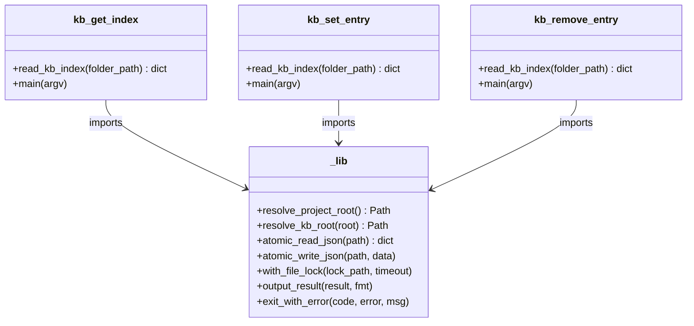
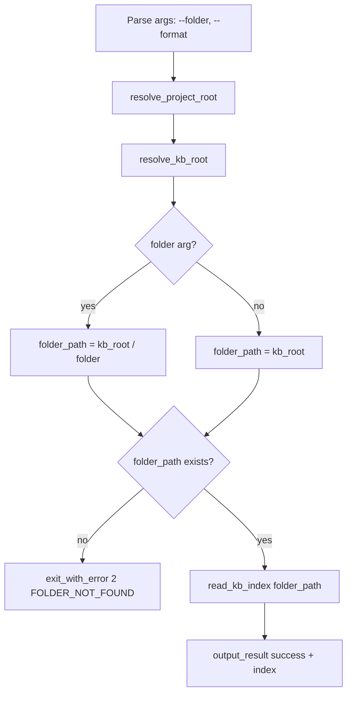
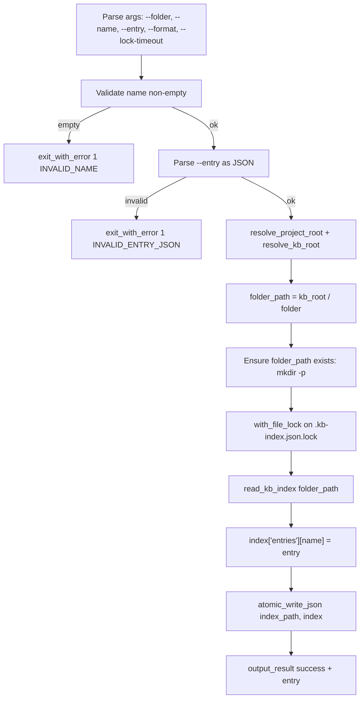
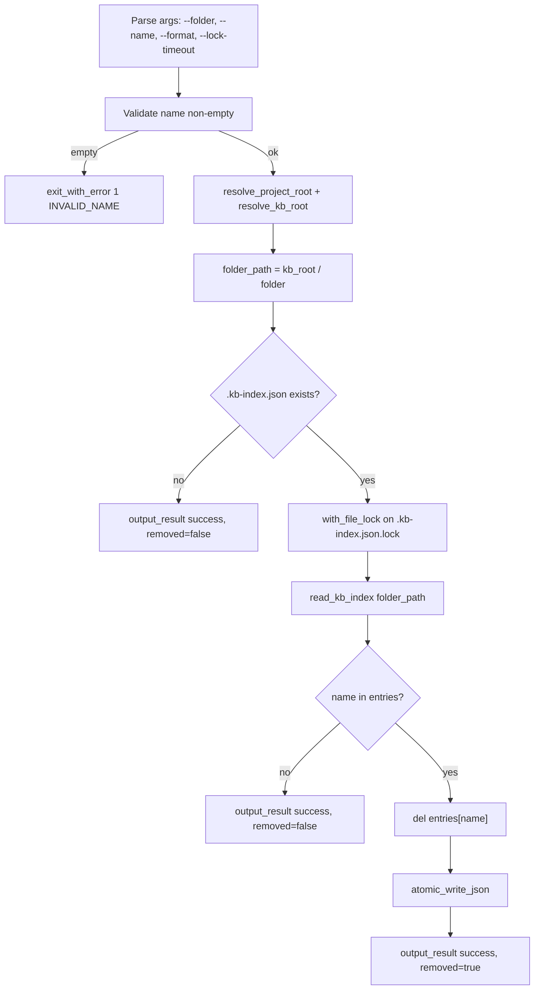

# Technical Design: KB Index Scripts

> Feature ID: FEATURE-052-B
> Version: v1.0
> Status: Designed
> Last Updated: 03-30-2026

## Version History

| Version | Date | Description |
|---------|------|-------------|
| v1.0 | 03-30-2026 | Initial design |

---

## Part 1: Agent-Facing Summary

### What This Feature Does

Three standalone Python CLI scripts that replace the KB index MCP tools (`get_kb_index`, `set_kb_index_entry`, `remove_kb_index_entry`) with direct `.kb-index.json` file I/O. Each script reuses `_lib.py` from FEATURE-052-A.

### Key Components Implemented

| Component | File | Tags | Description |
|-----------|------|------|-------------|
| KB Get Index | `.github/skills/x-ipe-tool-x-ipe-app-interactor/scripts/kb_get_index.py` | `kb, index, read, get, metadata` | Read all entries from a folder's `.kb-index.json` |
| KB Set Entry | `.github/skills/x-ipe-tool-x-ipe-app-interactor/scripts/kb_set_entry.py` | `kb, index, write, set, entry, metadata` | Create or update a metadata entry |
| KB Remove Entry | `.github/skills/x-ipe-tool-x-ipe-app-interactor/scripts/kb_remove_entry.py` | `kb, index, delete, remove, entry, metadata` | Remove a metadata entry |

### Dependencies

| Dependency | Type | Purpose |
|------------|------|---------|
| [_lib.py](.github/skills/x-ipe-tool-x-ipe-app-interactor/scripts/_lib.py) | Internal (FEATURE-052-A) | Shared utilities: atomic I/O, locking, root discovery, output formatting |
| [kb_service.py](src/x_ipe/services/kb_service.py) | Reference | Business logic reference for format detection, read/write patterns |
| Python 3.10+ stdlib | External | json, argparse, sys, os, pathlib |

### Usage Example

```bash
# Read KB index for a folder
python3 kb_get_index.py --folder "guides"
# Output: {"success": true, "folder": "guides", "index": {"version": "1.0", "entries": {...}}}

# Set an entry
python3 kb_set_entry.py --name "api-doc.md" --entry '{"title": "API Docs", "description": "REST API reference", "tags": {"domain": ["API"]}, "type": "markdown"}' --folder "guides"
# Output: {"success": true, "folder": "guides", "name": "api-doc.md", "entry": {...}}

# Remove an entry
python3 kb_remove_entry.py --name "old-file.md" --folder "guides"
# Output: {"success": true, "folder": "guides", "name": "old-file.md", "removed": true}

# Text format
python3 kb_get_index.py --folder "guides" --format text
```

### Design Decisions

| Decision | Choice | Rationale |
|----------|--------|-----------|
| Read-only = no lock | `kb_get_index.py` skips file locking | Read-only ops don't need locking; avoids unnecessary contention |
| Lock file per folder | `.kb-index.json.lock` in same dir | Each folder has independent lock scope |
| Format detection on read | Auto-detect canonical vs flat | Backward compat with legacy `.kb-index.json` files |
| Always write canonical | Writes always use `{"version": ..., "entries": ...}` format | Gradual migration to canonical format |
| Graceful degradation | Missing/corrupted files return empty entries | Matches existing service behavior — never crash on read |

### Program Type & Tech Stack

- **program_type:** `cli`
- **tech_stack:** `["Python/stdlib"]`

---

## Part 2: Implementation Guide

### Class Diagram



### Shared Helper: `read_kb_index(folder_path)`

All three scripts need the same index-reading logic with format detection. Rather than duplicating, define a shared function (can be in each script since it's ~15 lines, or added to `_lib.py`):

```python
KB_INDEX_FILE = ".kb-index.json"
KB_INDEX_VERSION = "1.0"

def read_kb_index(folder_path: Path) -> dict:
    """Read .kb-index.json with format detection.
    
    Returns canonical format: {"version": "1.0", "entries": {...}}
    Handles: missing file, corrupted JSON, legacy flat format.
    """
    index_path = folder_path / KB_INDEX_FILE
    if not index_path.exists():
        return {"version": KB_INDEX_VERSION, "entries": {}}
    
    data = atomic_read_json(index_path)
    
    # atomic_read_json returns error dict on failure
    if data.get("success") is False:
        print(f"WARNING: {data.get('message', 'corrupted index')}", file=sys.stderr)
        return {"version": KB_INDEX_VERSION, "entries": {}}
    
    if not isinstance(data, dict):
        return {"version": KB_INDEX_VERSION, "entries": {}}
    
    # Canonical format
    if "entries" in data:
        return data
    
    # Legacy flat format: all keys except "version" are entries
    entries = {k: v for k, v in data.items() if k != "version" and isinstance(v, dict)}
    return {"version": data.get("version", KB_INDEX_VERSION), "entries": entries}
```

**Decision:** Put `read_kb_index` in each script (duplicated ~15 lines) rather than extending `_lib.py`. Rationale: `_lib.py` is shared across ALL scripts (workflow + KB + UIUX); KB-specific logic doesn't belong there. The duplication is minimal and contained.

**Update:** Actually, since all 3 KB scripts need it identically, extract to a `_kb_lib.py` helper alongside `_lib.py`. This follows DRY without polluting the generic `_lib.py`.

### Flowchart: kb_get_index.py



### Flowchart: kb_set_entry.py



### Flowchart: kb_remove_entry.py



### CLI Interface Specifications

#### kb_get_index.py

| Argument | Required | Default | Description |
|----------|----------|---------|-------------|
| `--folder` | No | `""` (KB root) | Relative folder path within KB |
| `--format` | No | `json` | Output format: `json` or `text` |

#### kb_set_entry.py

| Argument | Required | Default | Description |
|----------|----------|---------|-------------|
| `--name` | Yes | — | Filename or foldername/ for the entry |
| `--entry` | Yes | — | JSON string of metadata dict |
| `--folder` | No | `""` (KB root) | Relative folder path within KB |
| `--format` | No | `json` | Output format: `json` or `text` |
| `--lock-timeout` | No | `10` | Lock timeout in seconds |

#### kb_remove_entry.py

| Argument | Required | Default | Description |
|----------|----------|---------|-------------|
| `--name` | Yes | — | Filename or foldername/ to remove |
| `--folder` | No | `""` (KB root) | Relative folder path within KB |
| `--format` | No | `json` | Output format: `json` or `text` |
| `--lock-timeout` | No | `10` | Lock timeout in seconds |

### Edge Case Table

| Edge Case | Script | Behavior |
|-----------|--------|----------|
| Missing `.kb-index.json` | get | Return empty entries |
| Missing `.kb-index.json` | set | Create new file |
| Missing `.kb-index.json` | remove | Return removed=false, no file created |
| Corrupted JSON | get | Return empty entries, warn stderr |
| Corrupted JSON | set | Overwrite with new canonical |
| Corrupted JSON | remove | Return removed=false |
| Legacy flat format | all | Auto-wrap to canonical on read |
| Non-existent folder | get | Exit code 2, FOLDER_NOT_FOUND |
| Non-existent folder | set | Create folder (mkdir -p) + create file |
| Empty name | set/remove | Exit code 1, INVALID_NAME |
| Invalid entry JSON | set | Exit code 1, INVALID_ENTRY_JSON |
| Name with trailing `/` | set | Store as folder entry |
| Concurrent writes | set/remove | File lock prevents corruption |

### Implementation Steps

1. **Create `_kb_lib.py`** (~20 LOC) — `read_kb_index()` + constants (`KB_INDEX_FILE`, `KB_INDEX_VERSION`)
2. **Create `kb_get_index.py`** (~40 LOC) — argparse + folder resolution + read + output
3. **Create `kb_set_entry.py`** (~55 LOC) — argparse + validation + lock + read-modify-write + output
4. **Create `kb_remove_entry.py`** (~50 LOC) — argparse + validation + lock + read-modify-delete + output

Total estimated: ~165 LOC new code (excluding `_lib.py` reuse).

### Design Change Log

| Date | Change | Reason |
|------|--------|--------|
| 03-30-2026 | Initial design | v1.0 |
