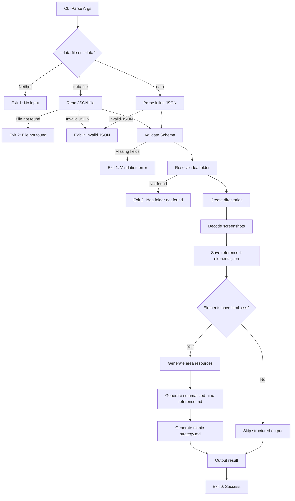

# Technical Design: UIUX Reference Script

> Feature ID: FEATURE-052-C  
> Version: v1.0  
> Status: Designed  
> Last Updated: 03-30-2026

## Version History

| Version | Date | Description |
|---------|------|-------------|
| v1.0 | 03-30-2026 | Initial design |

---

# Part 1 — Agent-Facing Summary

## What This Feature Does

Implements `uiux_save_reference.py`, a standalone CLI script that replaces the `save_uiux_reference` MCP tool. The script accepts UIUX reference data (via JSON file or inline string), validates it, decodes base64 screenshots to PNG files, merges element data into `referenced-elements.json`, generates per-element HTML/CSS resource files, and produces `summarized-uiux-reference.md` and `mimic-strategy.md`.

## Key Components Implemented

| Component | Location | Tags | Purpose |
|-----------|----------|------|---------|
| `uiux_save_reference.py` | `.github/skills/x-ipe-tool-x-ipe-app-interactor/scripts/` | `uiux, save-reference, script, cli` | Main CLI script — full UIUX pipeline |

## Usage Example

```bash
# From JSON file
python3 .github/skills/x-ipe-tool-x-ipe-app-interactor/scripts/uiux_save_reference.py \
  --data-file /tmp/uiux-data.json --format json

# From inline JSON
python3 .github/skills/x-ipe-tool-x-ipe-app-interactor/scripts/uiux_save_reference.py \
  --data '{"version":"3.0","source_url":"https://example.com","timestamp":"2026-03-30T07:00:00Z","idea_folder":"036. My Idea","colors":[{"hex":"#1a1a2e","role":"primary"}]}' \
  --format json
```

**Output (success):**
```json
{"success": true, "referenced_elements_file": "page-element-references/referenced-elements.json", "screenshots_saved": 2, "resource_files_saved": 4}
```

## Dependencies

| Dependency | Type | Purpose |
|------------|------|---------|
| `_lib.py` | Internal (FEATURE-052-A) | `resolve_project_root`, `atomic_write_json`, `output_result`, `exit_with_error`, exit codes |
| Python stdlib | External | `base64`, `copy`, `json`, `os`, `tempfile`, `argparse`, `pathlib`, `datetime` |

---

# Part 2 — Implementation Guide

## CLI Interface

| Argument | Type | Required | Default | Description |
|----------|------|----------|---------|-------------|
| `--data-file` | string | No* | — | Path to JSON file containing UIUX reference data |
| `--data` | string | No* | — | Inline JSON string containing UIUX reference data |
| `--format` | choice | No | `json` | Output format: `json` or `text` |

\* At least one of `--data-file` or `--data` is required. `--data-file` takes precedence.

## Architecture: Single-File Design

Unlike FEATURE-052-B which split into `_kb_lib.py` + 3 scripts, FEATURE-052-C uses a **single script** (`uiux_save_reference.py`) because:
- Only one MCP tool is being replaced (no shared helper needed)
- The pipeline is sequential and self-contained
- All 7 stages are tightly coupled (each stage feeds the next)

## Pipeline Flowchart



## Module Structure

```python
# uiux_save_reference.py — single file, ~400 lines

# --- Imports ---
import _lib (resolve_project_root, atomic_write_json, output_result, exit_with_error, EXIT_*)
import argparse, base64, copy, json, os, tempfile
from datetime import datetime, timezone
from pathlib import Path

# --- Constants ---
IDEAS_PATH = "x-ipe-docs/ideas"
REQUIRED_FIELDS = ["version", "source_url", "timestamp", "idea_folder"]
DATA_SECTIONS = ["colors", "elements", "design_tokens"]

# --- Functions ---
def validate_schema(data: dict) -> list[str]
def resolve_idea_path(project_root: Path, idea_folder: str) -> Path | None
def decode_screenshots(data: dict, screenshots_dir: Path) -> tuple[dict, int]
def save_referenced_elements(data: dict, refs_dir: Path) -> None
def save_area_resources(elements: list, resources_dir: Path) -> int
def generate_summarized_reference(data: dict, refs_dir: Path) -> None
def generate_mimic_strategy(data: dict, uiux_dir: Path) -> None
def main() -> None
```

## Function Specifications

### `validate_schema(data) -> list[str]`
1. Check each REQUIRED_FIELD is present and non-empty
2. If all required fields present, check at least one DATA_SECTION is non-empty (not None, not {}, not [])
3. Return list of error messages (empty = valid)

### `resolve_idea_path(project_root, idea_folder) -> Path | None`
1. Build path: `project_root / IDEAS_PATH / idea_folder`
2. Return Path if `.is_dir()`, else None

### `decode_screenshots(data, screenshots_dir) -> (processed_data, count)`
1. Deep-copy data to avoid mutating input
2. For each element → for each screenshot key:
   - If value starts with `"base64:"`: decode, write PNG, replace with relative path
   - If decode fails: set value to None, continue
3. Return (processed_data, screenshots_decoded_count)

### `save_referenced_elements(data, refs_dir) -> None`
1. Load existing `referenced-elements.json` (or empty dict on missing/corrupt)
2. Build areas dict from existing (keyed by `area_id`)
3. For each incoming element:
   - Build area entry with `area_id`, `selected_area_bounding_box`, `instruction`
   - Convert `discovered_elements` to enriched format (element_name, purpose, relationships, element_details)
   - Merge into areas dict (overwrites same area_id)
4. Build final structure: version, source_url, timestamp, areas, static_resources, colors
5. Atomic write via `_lib.atomic_write_json()`

### `save_area_resources(elements, resources_dir) -> int`
1. For each element with `html_css`:
   - If `outer_html`: write `{id}-structure.html`
   - If `computed_styles` (non-empty dict): format as CSS block, write `{id}-styles.css`
2. Return count of files written

### `generate_summarized_reference(data, refs_dir) -> None`
Build markdown with:
- Header + Source section (URL, timestamp)
- Colors table (or "_No colors captured._")
- Per-element sections:
  - Enriched: element name/tag/purpose/content/styles/resources + relationships table + reconstruction strategy
  - Legacy: computed_styles typography table
- Static resources table
- Write to `refs_dir / "summarized-uiux-reference.md"`

### `generate_mimic_strategy(data, uiux_dir) -> None`
Build markdown with:
- Target section (source URL + per-element component/dimensions/instruction)
- 6-dimension validation rubric (Layout, Typography, Color Palette, Spacing, Visual Effects, Static Resources)
- Validation criteria section
- Write to `uiux_dir / "mimic-strategy.md"`

### `main()`
1. Parse args (--data-file, --data, --format)
2. Load input data (file or inline)
3. Validate schema → exit 1 on error
4. Resolve idea folder → exit 2 on not found
5. Create directory tree
6. Decode screenshots
7. Save referenced-elements.json
8. Generate structured output (if html_css data present)
9. Output result → exit 0

## Output Directory Structure

```
x-ipe-docs/ideas/{idea_folder}/
└── uiux-references/
    ├── screenshots/
    │   ├── {area_id}-full_page.png
    │   └── {area_id}-element_crop.png
    ├── mimic-strategy.md
    └── page-element-references/
        ├── referenced-elements.json
        ├── summarized-uiux-reference.md
        └── resources/
            ├── {area_id}-structure.html
            └── {area_id}-styles.css
```

## Exit Codes

| Code | Constant | Condition |
|------|----------|-----------|
| 0 | EXIT_SUCCESS | Pipeline completed |
| 1 | EXIT_VALIDATION_ERROR | Missing fields, invalid JSON, no input |
| 2 | EXIT_FILE_NOT_FOUND | Data file or idea folder not found |

Note: EXIT_LOCK_TIMEOUT (3) is not used — no file locking in this script.

## Edge Case Handling

| Edge Case | Strategy |
|-----------|----------|
| Corrupted existing `referenced-elements.json` | `json.loads` fails → treat as empty dict |
| Element without `html_css` | Skip resource generation for that element |
| Screenshot decode failure | Set value to None, continue pipeline |
| No `selector` on element | Fall back to `.{element_id}` for CSS |
| Empty elements but colors present | Save colors in referenced-elements.json, skip resource generation |
| Element with empty `computed_styles` dict | Skip CSS file generation |

## Design Change Log

| Date | Change | Rationale |
|------|--------|-----------|
| 03-30-2026 | Initial design | — |
