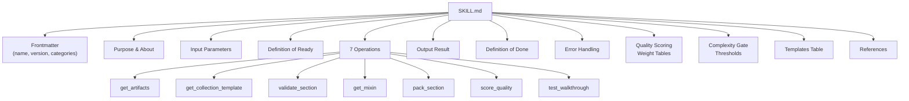
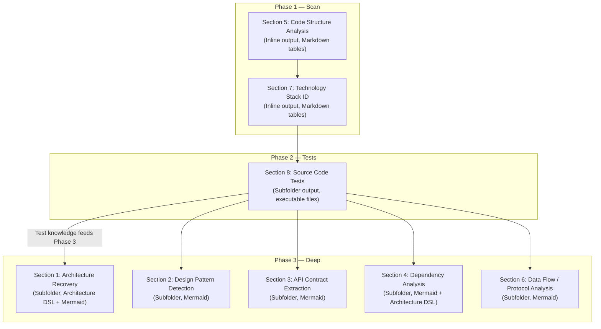
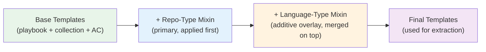
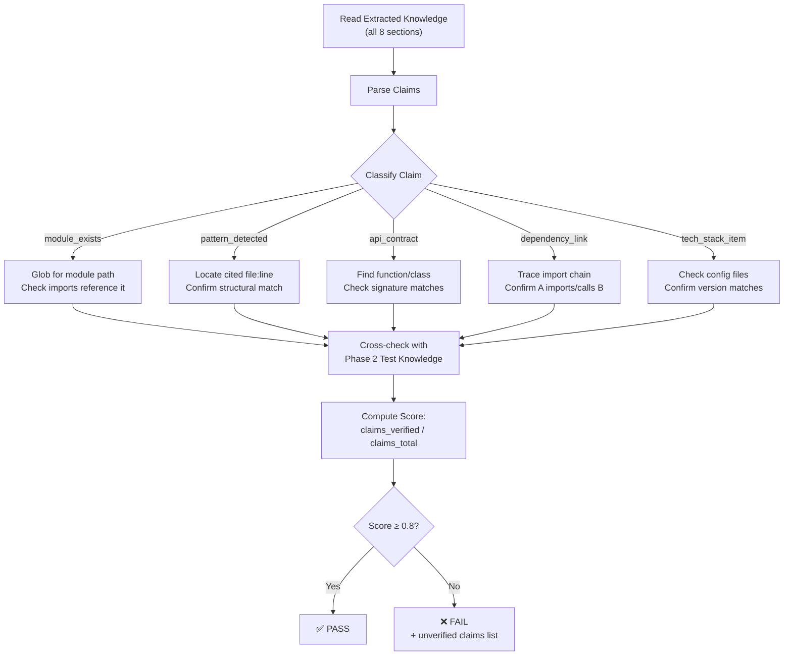

# Technical Design: Application Reverse Engineering Tool Skill

> Feature ID: FEATURE-053-A | Version: v1.0 | Last Updated: 03-31-2026

---

## Part 1: Agent-Facing Summary

> **Purpose:** Quick reference for AI agents navigating large projects.
> **📌 AI Coders:** Focus on this section for implementation context.

### Key Components Implemented

| Component | Responsibility | Scope/Impact | Tags |
|-----------|----------------|--------------|------|
| `SKILL.md` | Skill entry point — frontmatter, 7 operations, quality scoring weight tables, complexity gate, mixin documentation | Entire skill; discovered by extractor | #skill #knowledge-extraction #reverse-engineering #operations |
| `templates/playbook-template.md` | 8-section phased playbook defining extraction scope and output structure | Drives extractor section ordering + output format | #playbook #template #phased-extraction |
| `templates/collection-template.md` | Per-section extraction prompts with source priority guidance | Drives extractor's source analysis per section | #collection #extraction-prompts #source-priority |
| `templates/acceptance-criteria.md` | Per-section validation rules with `[REQ]`/`[OPT]` markers | Used by `validate_section` and `score_quality` operations | #acceptance-criteria #validation |
| `templates/mixin-monorepo.md` | Repo-type mixin — cross-package dependency prompts | Applied when monorepo structure detected | #mixin #repo-type #monorepo |
| `templates/mixin-multi-module.md` | Repo-type mixin — module boundary prompts | Applied when multi-module structure detected | #mixin #repo-type #multi-module |
| `templates/mixin-single-module.md` | Repo-type mixin — internal layering prompts | Applied when single-module structure detected | #mixin #repo-type #single-module |
| `templates/mixin-microservices.md` | Repo-type mixin — service boundary prompts | Applied when microservices structure detected | #mixin #repo-type #microservices |
| `templates/mixin-python.md` | Language-type mixin — Python-specific extraction prompts | Additive overlay for Python codebases | #mixin #language-type #python |
| `templates/mixin-java.md` | Language-type mixin — Java-specific extraction prompts | Additive overlay for Java codebases | #mixin #language-type #java |
| `templates/mixin-javascript.md` | Language-type mixin — JavaScript-specific extraction prompts | Additive overlay for JavaScript codebases | #mixin #language-type #javascript |
| `templates/mixin-typescript.md` | Language-type mixin — TypeScript-specific extraction prompts | Additive overlay for TypeScript codebases | #mixin #language-type #typescript |
| `templates/mixin-go.md` | Language-type mixin — Go-specific extraction prompts | Additive overlay for Go codebases | #mixin #language-type #go |
| `references/examples.md` | Usage examples for extractor-to-skill interaction | Reference documentation | #examples #reference |
| `test-cases.yaml` | AC-to-file mapping for acceptance testing | Verification artifact | #testing #acceptance |

### Dependencies

| Dependency | Source | Design Link | Usage Description |
|------------|--------|-------------|-------------------|
| `x-ipe-tool-knowledge-extraction-user-manual` | Structural reference | [SKILL.md](.github/skills/x-ipe-tool-knowledge-extraction-user-manual/SKILL.md) | Mirror 7-operation contract, folder layout, template naming |
| `x-ipe-task-based-application-knowledge-extractor` | Consumer | [SKILL.md](.github/skills/x-ipe-task-based-application-knowledge-extractor/SKILL.md) | Discovers this skill via glob; needs category list update |
| `x-ipe-tool-architecture-dsl` | Delegation | [SKILL.md](.github/skills/x-ipe-tool-architecture-dsl/SKILL.md) | Architecture DSL rendering for conceptual/logical levels |

### Major Flow

1. Extractor receives `purpose: "application-reverse-engineering"` → globs `.github/skills/x-ipe-tool-knowledge-extraction-*/SKILL.md` → matches `categories: ["application-reverse-engineering"]`
2. Extractor calls `get_artifacts()` → receives paths to playbook, collection template, acceptance criteria, and mixin map
3. Extractor detects repo-type + language-type → calls `get_mixin()` for each → merges overlays onto base templates
4. Extractor iterates playbook sections in phased order: Phase 1 (5, 7) → Phase 2 (8) → Phase 3 (1, 2, 3, 4, 6)
5. Per section: reads `get_collection_template(section_id)` prompts → extracts from codebase → calls `validate_section()` → calls `pack_section()` → calls `score_quality()`
6. After all sections complete: calls `test_walkthrough()` to verify extracted claims against source code + test knowledge

### Usage Example

```yaml
# Extractor loads this skill
Extractor: get_artifacts()
→ {
    playbook_template: "templates/playbook-template.md",
    collection_template: "templates/collection-template.md",
    acceptance_criteria: "templates/acceptance-criteria.md",
    repo_type_mixins: {
      monorepo: "templates/mixin-monorepo.md",
      multi_module: "templates/mixin-multi-module.md",
      single_module: "templates/mixin-single-module.md",
      microservices: "templates/mixin-microservices.md"
    },
    language_type_mixins: {
      python: "templates/mixin-python.md",
      java: "templates/mixin-java.md",
      javascript: "templates/mixin-javascript.md",
      typescript: "templates/mixin-typescript.md",
      go: "templates/mixin-go.md"
    },
    config_defaults: {
      max_files_per_section: 30,
      complexity_gate: { min_files: 10, min_loc: 500, min_dirs: 3 }
    }
  }

# Extractor applies mixin for detected repo-type
Extractor: get_mixin(mixin_key="monorepo")
→ { overlay content with cross-package analysis prompts }

# Extractor applies mixin for detected language
Extractor: get_mixin(mixin_key="python")
→ { overlay content with Python-specific prompts }

# Per-section extraction cycle
Extractor: get_collection_template(section_id="5-code-structure-analysis")
→ { extraction prompts for Code Structure section }

Extractor: validate_section(section_id="5-code-structure-analysis", content_path="...")
→ { passed: true, criteria: [...] }

Extractor: score_quality(section_id="5-code-structure-analysis", content_path="...")
→ { section_quality_score: 0.85, dimensions: {...}, improvement_hints: [] }
```

---

## Part 2: Implementation Guide

> **Purpose:** Detailed guide for developers implementing the skill artifacts.
> **📌 Emphasis on file structure, template content specifications, and content design.**

### Skill File Structure

```
.github/skills/x-ipe-tool-knowledge-extraction-application-reverse-engineering/
├── SKILL.md                              # Skill entry point (≈500 lines)
├── templates/
│   ├── playbook-template.md              # 8-section phased playbook
│   ├── collection-template.md            # Per-section extraction prompts
│   ├── acceptance-criteria.md            # Per-section validation rules
│   ├── mixin-monorepo.md                 # Repo-type: monorepo overlay
│   ├── mixin-multi-module.md             # Repo-type: multi-module overlay
│   ├── mixin-single-module.md            # Repo-type: single-module overlay
│   ├── mixin-microservices.md            # Repo-type: microservices overlay
│   ├── mixin-python.md                   # Language-type: Python overlay
│   ├── mixin-java.md                     # Language-type: Java overlay
│   ├── mixin-javascript.md               # Language-type: JavaScript overlay
│   ├── mixin-typescript.md               # Language-type: TypeScript overlay
│   └── mixin-go.md                       # Language-type: Go overlay
├── references/
│   └── examples.md                       # Usage examples
└── test-cases.yaml                       # AC-to-file mapping
```

This mirrors the user-manual skill structure: `SKILL.md` + flat `templates/` + `references/` + `test-cases.yaml`.

### SKILL.md Architecture

The SKILL.md is the skill entry point. It follows the same structure as the user-manual skill with adaptations for reverse engineering.

#### SKILL.md Section Layout



#### Frontmatter Specification

```yaml
---
name: x-ipe-tool-knowledge-extraction-application-reverse-engineering
version: "1.0"
description: >
  Provides playbook, collection template, acceptance criteria, and two-dimension mixins
  (repo-type × language-type) for application reverse engineering knowledge extraction.
  Loaded by x-ipe-task-based-application-knowledge-extractor during Phase 1.
  Triggers on category "application-reverse-engineering".
categories:
  - "application-reverse-engineering"
---
```

#### Input Parameters Specification

```yaml
input:
  operation: "get_artifacts | get_collection_template | validate_section | get_mixin | pack_section | score_quality | test_walkthrough"
  category: "application-reverse-engineering"
  section_id: "string | null"          # e.g., "1-architecture-recovery", "5-code-structure-analysis"
  content_path: "string | null"        # Path to extracted content file
  mixin_key: "string | null"           # e.g., "monorepo", "python" — used by get_mixin
  repo_path: "string | null"           # Path to target repo — used by test_walkthrough
  config:
    max_files_per_section: 30
    complexity_gate:
      min_files: 10
      min_loc: 500
      min_dirs: 3
```

Key difference from user-manual: `app_type` is replaced by `mixin_key` (supports both repo-type and language-type), and `app_url` is replaced by `repo_path` (source code path for walkthrough verification).

#### Quality Scoring Weight Tables (embedded in SKILL.md)

These tables are embedded in the `score_quality` operation section so the extractor can parse them programmatically:

**Architecture Sections** (sections 1, 2, 6 — Architecture Recovery, Design Pattern Detection, Data Flow):

| Dimension | Weight | Description |
|-----------|--------|-------------|
| Completeness | 0.20 | Ratio of `[REQ]` criteria satisfied |
| Structure | 0.10 | Proper heading hierarchy, diagrams, tables |
| Clarity | 0.15 | Clear explanations, concrete examples |
| **Accuracy** | **0.35** | Evidence-backed claims, verified against code |
| Freshness | 0.10 | References current versions, no stale info |
| Coverage | 0.10 | Breadth of code-evidence across modules |

**Tests Section** (section 8 — Source Code Tests):

| Dimension | Weight | Description |
|-----------|--------|-------------|
| Completeness | 0.10 | Test suite assembled with AAA structure |
| Structure | 0.05 | Proper test organization, naming conventions |
| Clarity | 0.10 | Test intent clear from names and assertions |
| Accuracy | 0.15 | Tests match actual code behavior |
| Freshness | 0.10 | Tests run against current code version |
| **Coverage** | **0.50** | Line coverage ≥ 80% target |

**Other Sections** (sections 3, 4, 5, 7 — API Contracts, Dependencies, Code Structure, Tech Stack):

| Dimension | Weight | Description |
|-----------|--------|-------------|
| **Completeness** | **0.30** | Ratio of `[REQ]` criteria satisfied |
| Structure | 0.20 | Proper heading hierarchy, diagrams, tables |
| Clarity | 0.20 | Clear explanations, concrete examples |
| Accuracy | 0.15 | Evidence-backed claims, verified against code |
| Freshness | 0.10 | References current versions |
| Coverage | 0.05 | Breadth of code-evidence |

### Playbook Template Design

The playbook defines the 8 sections with phase annotations. Structure mirrors the user-manual playbook: H2 per section, subsection definitions, output type annotations.



#### Playbook Section Specifications

| # | Section | Phase | Output Type | Visualization | Subsections |
|---|---------|-------|-------------|---------------|-------------|
| 1 | Architecture Recovery | 3-Deep | Subfolder | Architecture DSL + Mermaid | Conceptual (landscape), Logical (module), Physical (class), Data flow (sequence) |
| 2 | Design Pattern Detection | 3-Deep | Subfolder | Mermaid | Pattern inventory table, per-pattern evidence, confidence scoring |
| 3 | API Contract Extraction | 3-Deep | Subfolder | Mermaid | Internal APIs, external APIs, per-API-group files, request/response schemas |
| 4 | Dependency Analysis | 3-Deep | Subfolder | Mermaid + Architecture DSL | Inter-module deps, external library deps, per-module dependency files |
| 5 | Code Structure Analysis | 1-Scan | Inline | Markdown tables | Project layout, directory tree, naming conventions, module boundaries |
| 6 | Data Flow / Protocol Analysis | 3-Deep | Subfolder | Mermaid | Request flows, event propagation, data transformation chains |
| 7 | Technology Stack Identification | 1-Scan | Inline | Markdown tables | Languages, frameworks, build tools, runtime versions |
| 8 | Source Code Tests | 2-Tests | Subfolder | Executable files | Test collection, AAA generation, execution, coverage, knowledge extraction |

#### Subfolder Output Structure

For sections with subfolder output (1, 2, 3, 4, 6, 8), each follows this pattern:

```
section-{nn}-{section-slug}/
├── _index.md              # Section overview with summary table
├── screenshots/           # Diagrams, visualizations
└── {per-item-files}.md    # One file per logical unit
```

Section 8 (Source Code Tests) has a unique structure:

```
section-08-source-code-tests/
├── _index.md              # Test suite overview, framework, summary
├── screenshots/           # Coverage report screenshots
├── tests/                 # Executable test files
│   ├── test_module_a.py
│   ├── test_module_b.py
│   └── ...
└── coverage-report.md     # Per-module coverage breakdown
```

### Collection Template Design

Each section in the collection template contains HTML comments with extraction prompts and source priority instructions, matching the user-manual pattern.

#### Prompt Structure Per Section

```markdown
## {N}. {Section Name}

<!-- EXTRACTION PROMPTS:
- {What to look for} (look for {specific files, patterns, configs})
- {What to analyze} (look for {specific patterns})
- ...

SOURCE PRIORITY:
1. {Primary source}
2. {Secondary source}
3. {Tertiary source}

PHASE CONTEXT:
- Phase: {1-Scan | 2-Tests | 3-Deep}
- Depends on: {prior sections/phases}
- Output type: {inline | subfolder}

{Section-specific instructions, e.g., confidence scoring for patterns}
-->
```

#### Key Section Prompt Content

**Section 5 (Code Structure — Phase 1 Scan):**
- Source priority: directory tree → README → build configs → entry points
- Prompts: project layout, naming conventions, layering patterns, module boundary markers
- Output: Markdown tables (directory → purpose, naming convention → examples)

**Section 7 (Tech Stack — Phase 1 Scan):**
- Source priority: package managers (`package.json`, `pyproject.toml`, `pom.xml`, `go.mod`) → config files → imports
- Prompts: languages with versions, frameworks, build tools, test frameworks, CI/CD tools
- Output: Markdown tables (tech → version → purpose → evidence file)

**Section 8 (Source Code Tests — Phase 2):**
- Source priority: existing test files → test configs → README testing section
- Prompts: scan for tests, detect framework, collect AAA tests, generate missing tests, run, measure coverage
- Special instructions: copy-first strategy, framework matching, ground truth rule, knowledge extraction mapping
- Output: Subfolder with executable files + coverage report

**Section 1 (Architecture Recovery — Phase 3 Deep):**
- Source priority: source code structure → imports/dependencies → config files → test-derived knowledge
- Prompts: 4-level analysis (conceptual, logical, physical, data flow), Architecture DSL for levels 1-2, Mermaid for levels 3-4
- Special instruction: Use test-derived knowledge to verify module responsibilities and boundaries

**Section 2 (Design Pattern Detection — Phase 3 Deep):**
- Source priority: source code structure → class hierarchies → factory functions → test mocks
- Prompts: pattern catalog scan, confidence scoring (🟢/🟡/🔴), evidence citations (file:line)
- Special instruction: Test mock setups reveal which components are isolated (integration boundaries = pattern indicators)

### Acceptance Criteria Template Design

Structure mirrors user-manual: H3 per section, checklist items with `[REQ]`/`[OPT]` markers.

#### Section-Specific Validation Rules

**Section 1 (Architecture Recovery):**
- `[REQ]` Module diagram present (Architecture DSL or Mermaid)
- `[REQ]` At least 2 architecture levels documented (conceptual + logical minimum)
- `[REQ]` Architecture DSL used for conceptual and/or logical levels
- `[REQ]` Each module lists its responsibility (1-2 sentences)
- `[OPT]` Physical level class diagrams for key hierarchies
- `[OPT]` Data flow sequence diagrams for critical paths

**Section 2 (Design Pattern Detection):**
- `[REQ]` Pattern inventory table present
- `[REQ]` Each pattern has confidence level (🟢/🟡/🔴)
- `[REQ]` Each pattern has file:line evidence citation
- `[REQ]` At least 3 patterns analyzed (or documented "no canonical patterns found")
- `[OPT]` Pattern interaction map showing how patterns compose

**Section 8 (Source Code Tests):**
- `[REQ]` All tests follow AAA structure (Arrange/Act/Assert)
- `[REQ]` All tests pass
- `[REQ]` Coverage ≥ 80% line coverage
- `[REQ]` Test framework matches project's framework
- `[REQ]` Source code was never modified to fix failing tests
- `[REQ]` Test knowledge extraction mapping documented
- `[OPT]` Edge case tests for error handling paths

### Mixin Design

#### Mixin Structure Pattern

All mixins follow the same template structure as user-manual mixins:

```markdown
# Application RE — {Mixin Name} Mixin

> {Description of when this mixin applies}
> Merge these into the base playbook and collection templates when mixin_key: {key}.

---

## Detection Signals

{How the extractor identifies this mixin should be applied}

| Signal | File/Pattern | Confidence |
|--------|-------------|------------|
| ... | ... | high/medium |

---

## Additional Sections

{New sections or subsections added by this mixin}

---

## Section Overlay Prompts

{Additional extraction prompts per base section}

### For Section {N} ({Section Name})
<!-- ADDITIONAL PROMPTS:
- ...
-->
```

#### Mixin Composition Rules (documented in SKILL.md)



- **Repo-type is primary:** Applied first because it defines structural analysis patterns (how modules/services relate)
- **Language-type is additive:** Merged on top without replacing repo-type content; adds language-specific detection patterns and analysis prompts
- **Only one repo-type** mixin is applied (the best match)
- **Multiple language-type** mixins may be applied (if codebase uses multiple languages)

#### Repo-Type Mixin Content Summaries

**mixin-monorepo.md:**
- Detection: `lerna.json`, `pnpm-workspace.yaml`, `nx.json`, `turbo.json`, multiple `package.json`
- Additional prompts: cross-package dependency graph, shared module identification, build order analysis, workspace boundary enforcement
- Overlay: Section 4 (Dependency) gets cross-package dep map; Section 1 (Architecture) gets per-package module view

**mixin-multi-module.md:**
- Detection: `pom.xml` with `<modules>`, `settings.gradle` with `include`, workspace `Cargo.toml` with `[workspace]`
- Additional prompts: module boundary analysis, inter-module API contracts, build dependency tree
- Overlay: Section 3 (API) gets inter-module contract analysis; Section 4 (Dependency) gets module-level dep graph

**mixin-single-module.md:**
- Detection: single `package.json` (no workspaces), single `pyproject.toml`, single `build.gradle`
- Additional prompts: internal layering analysis, package structure decomposition, entry point tracing
- Overlay: Section 1 (Architecture) gets internal layer decomposition; Section 5 (Code Structure) gets deeper naming convention analysis

**mixin-microservices.md:**
- Detection: `docker-compose.yml` with multiple services, multiple Dockerfiles, k8s manifests (`deployment.yaml`, `service.yaml`), API gateway configs
- Additional prompts: service boundary identification, inter-service communication protocols (REST, gRPC, message queues), shared data stores, service mesh config
- Overlay: Section 1 (Architecture) gets service landscape view; Section 6 (Data Flow) gets inter-service sequence diagrams

#### Language-Type Mixin Content Summaries

**mixin-python.md:**
- Detection: `*.py`, `pyproject.toml`, `requirements.txt`, `setup.py`, `Pipfile`
- Additional prompts: module/package patterns (`__init__.py` analysis), decorator patterns, metaclass detection, type hint analysis, Django/Flask/FastAPI patterns
- Overlay: Section 2 (Patterns) gets Python-specific pattern catalog; Section 7 (Tech Stack) gets Python ecosystem tools

**mixin-java.md:**
- Detection: `*.java`, `pom.xml`, `build.gradle`, `*.kt` (Kotlin)
- Additional prompts: Spring Boot patterns (annotations, beans, profiles), interface hierarchies, generics usage, Maven/Gradle project structure
- Overlay: Section 2 (Patterns) gets GoF pattern detection in Java idioms; Section 3 (API) gets Spring endpoint scanning

**mixin-javascript.md:**
- Detection: `*.js`, `*.jsx`, `package.json`, `webpack.config.*`, `vite.config.*`
- Additional prompts: module system detection (CJS/ESM), React component patterns, event-driven architecture, callback/Promise/async patterns, npm dependency analysis
- Overlay: Section 2 (Patterns) gets JS-specific patterns (Observer, Module, Revealing Module); Section 7 (Tech Stack) gets bundler/transpiler analysis

**mixin-typescript.md:**
- Detection: `*.ts`, `*.tsx`, `tsconfig.json`
- Additional prompts: type hierarchy analysis, generic pattern detection, decorator metadata (reflect-metadata), interface-driven design, discriminated unions
- Overlay: Section 2 (Patterns) gets type-level pattern detection; Section 3 (API) gets TypeScript type export analysis

**mixin-go.md:**
- Detection: `*.go`, `go.mod`, `go.sum`
- Additional prompts: interface satisfaction analysis (implicit interfaces), goroutine patterns, channel usage, package layout conventions (`cmd/`, `internal/`, `pkg/`), error handling patterns
- Overlay: Section 2 (Patterns) gets Go-idiomatic pattern detection; Section 5 (Code Structure) gets Go package convention analysis

### Test Walkthrough Design

The `test_walkthrough` operation validates extracted knowledge against the actual codebase. Unlike the user-manual skill (which validates UI walkthroughs), this operates in **offline source-code verification mode**.



Claim verification methods:

| Claim Type | Verification Method | Test Knowledge Cross-Check |
|------------|--------------------|-----------------------------|
| `module_exists` | `glob` for path; check `import`/`from`/`require` references | Test imports confirm module is used |
| `pattern_detected` | Read cited `file:line`; match against pattern template | Test mocks/stubs reveal isolation boundaries |
| `api_contract` | Find function/class; compare signature + params | Test assertions confirm behavior |
| `dependency_link` | Trace import chain from A to B | Test fixtures show data flow direction |
| `tech_stack_item` | Check config files for version strings | Test framework matches detected stack |

### Extractor Category Registration

One additional change required outside this skill: update the extractor's SKILL.md to accept `application-reverse-engineering` as a valid purpose.

**File:** `.github/skills/x-ipe-task-based-application-knowledge-extractor/SKILL.md`

**Change:** In the Important Notes section (or wherever v1 category restriction is documented), add `application-reverse-engineering` to the supported categories list. This enables:
- `purpose: "application-reverse-engineering"` to pass validation
- Glob discovery to find this skill via `categories: ["application-reverse-engineering"]`

### Implementation Steps

1. **SKILL.md** — Create the entry point with frontmatter, purpose, about, input parameters, 7 operation definitions, output result, DoD, error handling, quality scoring weight tables, complexity gate, templates table
2. **templates/playbook-template.md** — Create 8-section playbook with phase annotations, output type markers, subsection definitions, content splitting guidelines
3. **templates/collection-template.md** — Create per-section extraction prompts with HTML comments, source priority instructions, phase context annotations
4. **templates/acceptance-criteria.md** — Create per-section validation rules with `[REQ]`/`[OPT]` markers, validation scoring table
5. **templates/mixin-monorepo.md** — Create repo-type mixin with detection signals, additional sections, section overlay prompts
6. **templates/mixin-multi-module.md** — Same structure as monorepo, multi-module content
7. **templates/mixin-single-module.md** — Same structure, single-module content
8. **templates/mixin-microservices.md** — Same structure, microservices content
9. **templates/mixin-python.md** — Create language-type mixin with detection signals, language-specific prompts
10. **templates/mixin-java.md** — Same structure, Java content
11. **templates/mixin-javascript.md** — Same structure, JavaScript content
12. **templates/mixin-typescript.md** — Same structure, TypeScript content
13. **templates/mixin-go.md** — Same structure, Go content
14. **references/examples.md** — Create usage examples showing extractor-to-skill interaction
15. **test-cases.yaml** — Create AC-to-file mapping for acceptance testing
16. **Extractor Update** — Add `application-reverse-engineering` to extractor's supported categories

### Edge Cases & Error Handling

| Scenario | Expected Behavior |
|----------|-------------------|
| Invalid `mixin_key` (e.g., "ruby") | `get_mixin` returns error with list of valid keys (4 repo-type + 5 language-type) |
| Invalid `section_id` | `get_collection_template` / `validate_section` returns error listing valid section IDs |
| Missing `content_path` for validate/pack/score | Return `MISSING_CONTENT_PATH` error |
| Codebase below complexity gate | `get_artifacts` returns gate thresholds; extractor decides to skip |
| No design patterns found | Pattern Detection section documents "no canonical patterns found"; validation still passes |
| Multiple languages detected | Multiple language-type mixins applied additively |
| Test coverage below 80% after iteration | Section 8 validation returns INCOMPLETE with coverage gap details |

---

## Design Change Log

| Date | Phase | Change Summary |
|------|-------|----------------|
| 03-31-2026 | Initial Design | Initial technical design for FEATURE-053-A. Skills-type deliverable: 15 template/reference files + 1 extractor category update. No executable code — all artifacts are markdown templates read by the extractor agent. |
