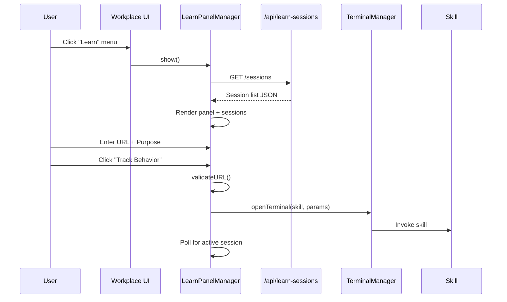

# Technical Design: Workplace Learn Module GUI

> Feature ID: FEATURE-054-A | Version: v1.0 | Last Updated: 04-02-2026

---

## Part 1: Agent-Facing Summary

> **📌 AI Coders:** Focus on this section for implementation context.

### Key Components Implemented

| Component | Responsibility | Scope/Impact | Tags |
|-----------|----------------|--------------|------|
| `LearnPanelManager` | Learn panel lifecycle, URL validation, session list rendering | New JS feature module in workplace | #frontend #workplace #learn |
| `learn-panel route` | Serve session data API (list sessions, session details) | New Flask route | #backend #api #sessions |
| `workplace.html` changes | Add "Learn" menu item + learn panel container | Template modification | #frontend #template #nav |

### Dependencies

| Dependency | Source | Design Link | Usage Description |
|------------|--------|-------------|-------------------|
| `WorkplaceManager` | FEATURE-008 | Existing | Extend workplace initialization to include Learn panel |
| `TerminalManager` | Existing | Existing | Invoke skill via terminal session |
| `ContentViewer` | EPIC-002 | Existing | Open behavior-recording.json for completed sessions |

### Major Flow

1. User clicks "Learn" in Workplace sidebar → `LearnPanelManager.show()` renders panel
2. User enters URL + optional tracking purpose → client-side URL validation
3. User clicks "Track Behavior" → `TerminalManager` opens terminal, invokes `x-ipe-learning-behavior-tracker-for-web` skill with params
4. Session list polls/watches project folder for `behavior-recording-*.json` files → renders session cards
5. Active session card shows pulsing indicator; completed cards link to content viewer

### Usage Example

```javascript
// In workplace.js initialization
const learnPanel = new LearnPanelManager({
  container: document.getElementById('learn-panel-container'),
  terminal: this.terminalManager,
  contentViewer: this.contentViewer
});

// Start tracking
learnPanel.startTracking({
  url: 'https://example.com/checkout',
  purpose: 'Checkout flow for AI agent training'
});
```

---

## Part 2: Implementation Guide

### Workflow Diagram



### Component Architecture

```
src/x_ipe/static/js/features/learn-panel.js   (~400 lines)
├── LearnPanelManager class
│   ├── constructor(config)       — container, terminal, viewer refs
│   ├── show() / hide()           — panel visibility toggle
│   ├── renderPanel()             — URL input, purpose field, CTA, session list
│   ├── validateURL(url)          — client-side format check (protocol+domain)
│   ├── startTracking(url, purpose) — invoke skill via terminal
│   ├── loadSessions()            — fetch from API, render cards
│   ├── renderSessionCard(session) — status badge, metrics, click handler
│   └── setupDividerDrag()        — draggable panel divider (280-600px, default 480px)

src/x_ipe/routes/learn.py                      (~80 lines)
├── GET /api/learn-sessions       — list behavior-recording-*.json in project folder
└── GET /api/learn-sessions/<id>  — session detail from file content

src/x_ipe/templates/workplace.html              (modifications)
├── Add "Learn" to sidebar nav menu
└── Add learn-panel-container div
```

### Data Models

```javascript
// Session card data (derived from behavior-recording-{id}.json)
{
  sessionId: "uuid-v4",
  domain: "example.com",
  purpose: "Checkout flow",
  status: "recording" | "paused" | "completed",
  startedAt: "2026-04-02T10:00:00Z",
  stoppedAt: null | "2026-04-02T10:30:00Z",
  eventCount: 142,
  pageCount: 5,
  elapsedTime: "30m 12s"
}
```

### Implementation Steps

1. **Backend:** Create `src/x_ipe/routes/learn.py` — Flask routes for session listing
2. **Template:** Add "Learn" sidebar item + container in `workplace.html`
3. **Frontend:** Create `learn-panel.js` with `LearnPanelManager` class
4. **Integration:** Wire LearnPanelManager into WorkplaceManager initialization
5. **Styling:** Add learn panel CSS to `workplace.css` (or new `learn-panel.css`)

### Edge Cases & Error Handling

| Scenario | Handling |
|----------|---------|
| No sessions (first use) | Show empty state with "Start your first session" guidance |
| Malformed recording JSON | Show "Error" status on card, tooltip with parse error |
| Terminal fails to open | Show error toast, log to console |
| URL validation edge cases | Accept any string with protocol + domain; reject empty/whitespace-only |

---

## Design Change Log

| Date | Phase | Change Summary |
|------|-------|----------------|
| 04-02-2026 | Initial Design | Initial technical design for Learn panel GUI |
