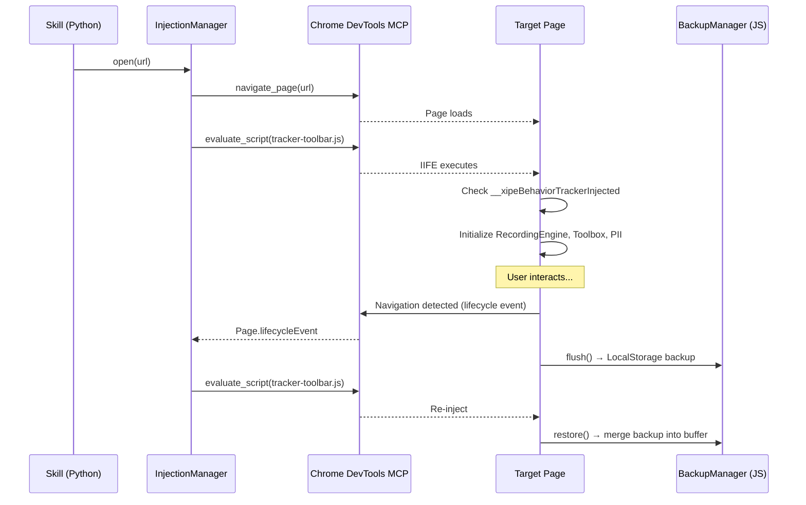

# Technical Design: Chrome DevTools Injection & Page Lifecycle

> Feature ID: FEATURE-054-B | Version: v1.0 | Last Updated: 04-02-2026

---

## Part 1: Agent-Facing Summary

> **📌 AI Coders:** Focus on this section for implementation context.

### Key Components Implemented

| Component | Responsibility | Scope/Impact | Tags |
|-----------|----------------|--------------|------|
| `BehaviorTrackerSkill` | Skill orchestrator — open browser, inject, manage lifecycle, stop | New Python skill entry point | #backend #skill #orchestrator |
| `InjectionManager` | Script injection + re-injection after navigation | Python class using Chrome DevTools MCP | #backend #injection #devtools |
| `tracker-toolbar.js` (bootstrap) | IIFE entry point — initializes recording engine, toolbox, PII | Injected JavaScript | #frontend #injection #iife |
| `BackupManager` | LocalStorage event backup during re-injection gaps | JS class inside IIFE | #frontend #persistence #localstorage |

### Dependencies

| Dependency | Source | Design Link | Usage Description |
|------------|--------|-------------|-------------------|
| Chrome DevTools MCP | External | N/A | `navigate_page` + `evaluate_script` tools |
| EPIC-030-B CR (shared utility) | FEATURE-030-B | Pending | Shared injection wrappers — inline fallback if unavailable |
| `tracker-toolbar.js` | FEATURE-054-C,D,E | Internal | Script bootstraps all recording components |

### Major Flow

1. Skill receives URL + purpose → `InjectionManager.open(url)` calls `navigate_page`
2. Page loads → `InjectionManager.inject()` calls `evaluate_script` with `tracker-toolbar.js` IIFE
3. IIFE checks `window.__xipeBehaviorTrackerInjected` → if false, initializes all components
4. User navigates → DevTools `Page.lifecycleEvent` detected → `InjectionManager.reinject()`
5. Before re-injection: `BackupManager.flush()` saves events to LocalStorage
6. After re-injection: `BackupManager.restore()` merges backed-up events into buffer

### Usage Example

```python
# Skill entry point
from x_ipe_learning_tracker.injection import InjectionManager

manager = InjectionManager(session_id="uuid-v4")
await manager.open("https://example.com/checkout")
await manager.inject()  # Injects tracker-toolbar.js IIFE

# Lifecycle loop (runs until user stops)
async for event in manager.lifecycle_events():
    if event.type == "navigation":
        await manager.reinject()
    elif event.type == "stop":
        break

data = await manager.collect()  # Retrieve event buffer from page
```

---

## Part 2: Implementation Guide

### Workflow Diagram



### Component Architecture

```
.github/skills/x-ipe-learning-behavior-tracker-for-web/
├── SKILL.md                                    (~200 lines)
├── scripts/
│   ├── track_behavior.py                       (~250 lines)
│   │   ├── BehaviorTrackerSkill class
│   │   │   ├── start(url, purpose)             — orchestrate full session
│   │   │   ├── stop()                          — collect data, trigger post-processing
│   │   │   └── _lifecycle_loop()               — monitor page events
│   │   └── InjectionManager class
│   │       ├── open(url)                       — navigate_page
│   │       ├── inject()                        — evaluate_script with IIFE
│   │       ├── reinject()                      — re-inject after navigation
│   │       ├── collect()                       — retrieve event buffer from page
│   │       └── _build_iife(session_id)         — construct IIFE with session config
│   └── post_processor.py                       (FEATURE-054-F)
└── references/
    └── tracker-toolbar.js                      (~600 lines total, all features)
        ├── BackupManager                       (~60 lines)
        │   ├── flush()                         — save buffer to LocalStorage
        │   ├── restore()                       — merge from LocalStorage
        │   └── clear()                         — remove backup key
        └── (RecordingEngine, Toolbox, PII — see C, D, E designs)

tracker-toolbar.js IIFE structure:
(function(config) {
  if (window.__xipeBehaviorTrackerInjected) return;
  window.__xipeBehaviorTrackerInjected = true;
  
  // config: { sessionId, purpose, piiWhitelist: [] }
  const backup = new BackupManager(config.sessionId);
  const engine = new RecordingEngine(config, backup);
  const pii = new PIIMasker(config);
  const toolbox = new TrackerToolbox(config, engine, pii);
  
  backup.restore(engine);  // Merge any backed-up events
  engine.start();
  toolbox.render();
})(CONFIG_PLACEHOLDER);
```

### Data Models

```python
# Session config passed to IIFE
session_config = {
    "sessionId": "uuid-v4",
    "purpose": "Checkout flow for AI agent training",
    "piiWhitelist": [],  # CSS selectors for revealed fields
    "bufferCapacity": 10000
}
```

```javascript
// LocalStorage backup format
// Key: __xipe_behavior_backup_{sessionId}
{
  "events": [...],  // Array of event objects
  "lastFlushTime": "2026-04-02T10:15:00Z",
  "pageUrl": "https://example.com/checkout"
}
```

### Implementation Steps

1. **Skill Definition:** Create `.github/skills/x-ipe-learning-behavior-tracker-for-web/SKILL.md`
2. **Python Backend:** Create `track_behavior.py` with `BehaviorTrackerSkill` and `InjectionManager`
3. **IIFE Bootstrap:** Create `tracker-toolbar.js` entry point with config injection and guard
4. **BackupManager:** Implement LocalStorage flush/restore/clear within IIFE
5. **Lifecycle Loop:** Implement page lifecycle monitoring via DevTools events
6. **Inline Fallback:** Direct Chrome DevTools MCP calls if shared utility unavailable

### Edge Cases & Error Handling

| Scenario | Handling |
|----------|---------|
| LocalStorage disabled on target site | Catch exception, log warning, continue without backup |
| Rapid sequential navigations | Queue re-injection; skip if another navigation occurs before injection completes |
| Target page overrides `__xipeBehaviorTrackerInjected` | Use `Symbol` or `__xipe_bhv_trk_v1_init` namespaced key |
| `evaluate_script` fails (CSP edge case) | Retry once; if still fails, report error to user |

---

## Design Change Log

| Date | Phase | Change Summary |
|------|-------|----------------|
| 04-02-2026 | Initial Design | Initial technical design for injection & lifecycle |
