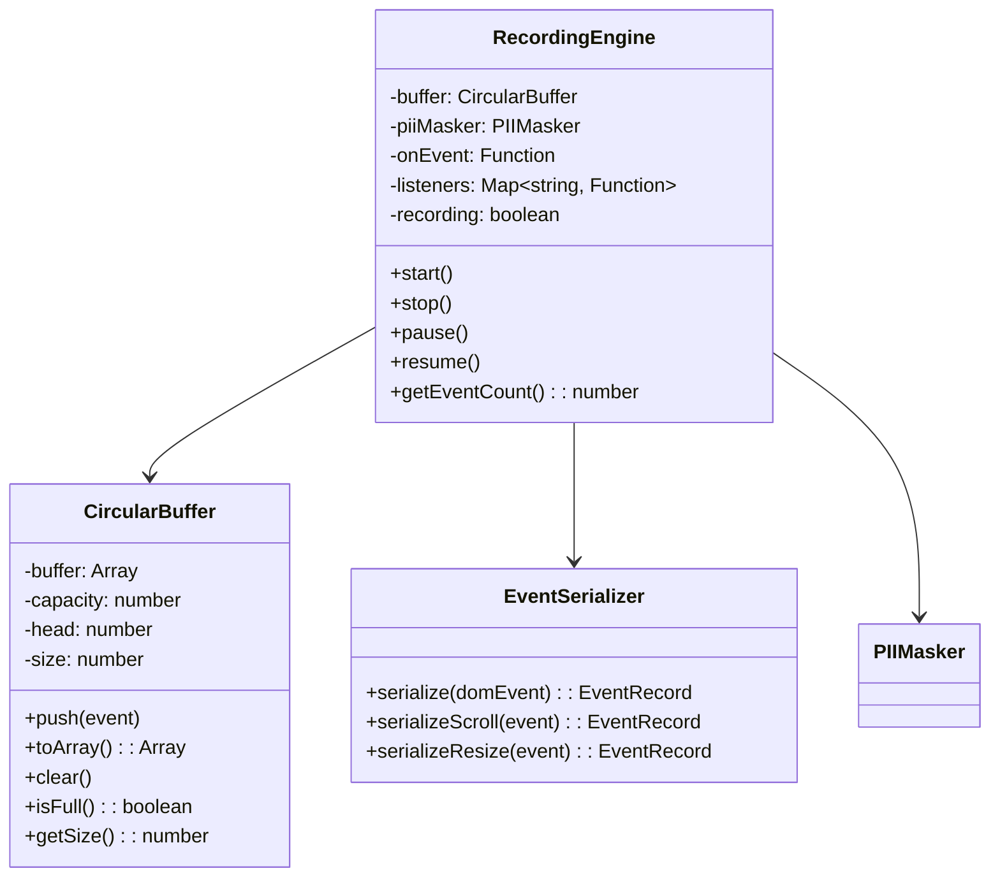

# Technical Design: Event Recording Engine

> Feature ID: FEATURE-054-C | Version: v1.0 | Last Updated: 04-02-2026

---

## Part 1: Agent-Facing Summary

> **📌 AI Coders:** Focus on this section for implementation context.

### Key Components Implemented

| Component | Responsibility | Scope/Impact | Tags |
|-----------|----------------|--------------|------|
| `RecordingEngine` | Capture DOM events, maintain circular buffer, emit to toolbox | Core JS class inside `tracker-toolbar.js` IIFE | #frontend #events #recording |
| `CircularBuffer` | Fixed-size event storage with silent oldest-prune on overflow | JS class inside IIFE | #frontend #buffer #data-structure |
| `EventSerializer` | Normalize DOM events to schema-compliant objects with metadata | JS utility inside IIFE | #frontend #serialization #schema |

### Dependencies

| Dependency | Source | Design Link | Usage Description |
|------------|--------|-------------|-------------------|
| `BackupManager` | FEATURE-054-B | [technical-design.md](x-ipe-docs/requirements/EPIC-054/FEATURE-054-B/technical-design.md) | Flush buffer to LocalStorage on navigation |
| `PIIMasker` | FEATURE-054-E | [technical-design.md](x-ipe-docs/requirements/EPIC-054/FEATURE-054-E/technical-design.md) | Mask event targets before buffer insertion |
| `TrackerToolbox` | FEATURE-054-D | [technical-design.md](x-ipe-docs/requirements/EPIC-054/FEATURE-054-D/technical-design.md) | Push real-time event feed to toolbox UI |

### Major Flow

1. `RecordingEngine.start()` → attach capture-phase listeners for all 7 event types
2. DOM event fires → `EventSerializer.serialize(event)` → produces schema object with timestamp + metadata
3. `PIIMasker.mask(serializedEvent)` → scrub PII from target text/values
4. Masked event → `CircularBuffer.push(event)` → if buffer full, silently prune oldest
5. Emit event to `TrackerToolbox` via callback for real-time display
6. On `stop()` → detach all listeners, return `CircularBuffer.toArray()`

### Usage Example

```javascript
// Inside tracker-toolbar.js IIFE
const buffer = new CircularBuffer(10000);
const engine = new RecordingEngine({
  buffer,
  onEvent: (e) => toolbox.appendEvent(e),
  piiMasker: pii
});

engine.start();
// ... user interacts ...
engine.stop();
const events = buffer.toArray();  // All captured events in order
```

---

## Part 2: Implementation Guide

### Class Diagram



### Event Schema

```javascript
// EventRecord — single captured event
{
  type: "click" | "input" | "scroll" | "navigation" | "resize" | "focus" | "drag",
  timestamp: 1712044800000,        // Date.now()
  relativeTime: 12345,             // ms since session start
  target: {
    tagName: "BUTTON",
    id: "checkout-btn",
    classList: ["btn", "btn-primary"],
    cssSelector: "button#checkout-btn.btn.btn-primary",
    textContent: "***",            // masked by default
    value: "***"                   // masked by default
  },
  metadata: {
    pageUrl: "https://example.com/cart",
    pageTitle: "Shopping Cart",
    viewportWidth: 1920,
    viewportHeight: 1080
  },
  // Event-type-specific fields
  details: {
    // click: { x, y, button }
    // input: { inputType }  (value is masked in target)
    // scroll: { scrollX, scrollY, direction }
    // navigation: { fromUrl, toUrl }
    // resize: { oldWidth, oldHeight, newWidth, newHeight }
    // focus: { gained: true/false }
    // drag: { startX, startY, endX, endY }  (start/end only, no intermediate)
  }
}
```

### 7 Event Types & Listeners

| Type | DOM Event(s) | Capture Phase | Details Captured |
|------|-------------|---------------|-----------------|
| `click` | `click` | Yes | x, y, button |
| `input` | `input` | Yes | inputType (value masked) |
| `scroll` | `scroll` (debounced 200ms) | Yes | scrollX, scrollY, direction |
| `navigation` | `popstate`, `hashchange` | Yes | fromUrl, toUrl |
| `resize` | `resize` (debounced 300ms) | Yes | old/new dimensions |
| `focus` | `focusin`, `focusout` | Yes | gained: true/false |
| `drag` | `dragstart`, `dragend` | Yes | start/end coordinates only |

### Implementation Steps

1. **CircularBuffer:** Implement fixed-size array with head pointer, push/toArray/clear
2. **EventSerializer:** Normalize each of 7 event types to schema, extract CSS selector
3. **RecordingEngine:** Attach capture-phase listeners, wire serializer → PII → buffer → callback
4. **Debouncing:** Implement scroll (200ms) and resize (300ms) debounce
5. **Integration:** Export from IIFE for BackupManager and collect() access

### Edge Cases & Error Handling

| Scenario | Handling |
|----------|---------|
| Buffer overflow (>10,000 events) | Silent prune — drop oldest, no user notification |
| Exception in event handler | try/catch per handler, log to console, continue recording |
| Shadow DOM targets | Walk up to host element for selector generation |
| Iframes | Capture only top-frame events (v1 — no cross-origin iframe access) |
| Rapid fire events (e.g., scroll) | Debounce ensures manageable volume |

---

## Design Change Log

| Date | Phase | Change Summary |
|------|-------|----------------|
| 04-02-2026 | Initial Design | Initial technical design for recording engine |
