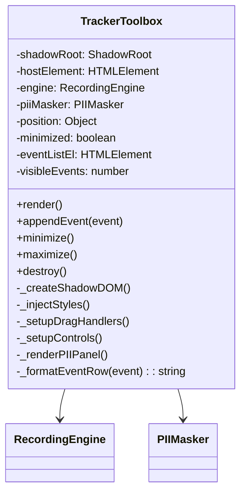

# Technical Design: Injected Tracker Toolbox (Shadow DOM)

> Feature ID: FEATURE-054-D | Version: v1.0 | Last Updated: 04-02-2026

---

## Part 1: Agent-Facing Summary

> **📌 AI Coders:** Focus on this section for implementation context.

### Key Components Implemented

| Component | Responsibility | Scope/Impact | Tags |
|-----------|----------------|--------------|------|
| `TrackerToolbox` | Shadow DOM overlay — real-time event feed, recording controls, PII whitelist UI | JS class inside `tracker-toolbar.js` IIFE | #frontend #shadow-dom #toolbox #ui |

### Dependencies

| Dependency | Source | Design Link | Usage Description |
|------------|--------|-------------|-------------------|
| `RecordingEngine` | FEATURE-054-C | [technical-design.md](x-ipe-docs/requirements/EPIC-054/FEATURE-054-C/technical-design.md) | Subscribe to event stream, display controls |
| `PIIMasker` | FEATURE-054-E | [technical-design.md](x-ipe-docs/requirements/EPIC-054/FEATURE-054-E/technical-design.md) | Whitelist CRUD via toolbox UI |
| Chrome DevTools MCP | FEATURE-054-B | [technical-design.md](x-ipe-docs/requirements/EPIC-054/FEATURE-054-B/technical-design.md) | Injection context |
| EPIC-030-B Toolbar | External | Existing | z-index coexistence (toolbox uses lower z-index) |
| Mockup | IDEA-038 | [tracker-toolbox-v1.html](x-ipe-docs/requirements/EPIC-054/FEATURE-054-D/mockups/tracker-toolbox-v1.html) | Visual design reference |

### Major Flow

1. `tracker-toolbar.js` IIFE initializes → `TrackerToolbox.render()` creates Shadow DOM host
2. Attach shadow root (`mode: 'closed'`) → inject CSS + HTML into shadow
3. Default position: bottom-right corner, lower z-index than EPIC-030-B toolbar
4. Event feed: `RecordingEngine` callback pushes events → toolbox appends to scrollable list
5. Controls: Record/Pause/Stop buttons toggle `RecordingEngine` state
6. PII panel: Add/remove CSS selectors to whitelist via `PIIMasker` API
7. Drag: Mousedown on header → track mouse → clamp to viewport → update position
8. Minimize: Toggle to compact pill showing event count

### Usage Example

```javascript
// Inside tracker-toolbar.js IIFE
const toolbox = new TrackerToolbox({
  engine: recordingEngine,
  piiMasker: pii,
  position: { bottom: 20, right: 20 },
  zIndex: 2147483640  // Lower than EPIC-030-B's 2147483647
});

toolbox.render();       // Create Shadow DOM, show toolbox
toolbox.appendEvent(e); // Called by engine's onEvent callback
toolbox.minimize();     // Toggle to pill mode
toolbox.destroy();      // Clean up Shadow DOM host
```

---

## Part 2: Implementation Guide

### UI Layout (from Mockup)

```
┌─────────────────────────────────────────┐
│ ⊕ Behavior Tracker            _ ☰ ✕   │ ← Header (draggable, glass-morphism)
├─────────────────────────────────────────┤
│ Session: abc-123     ● Recording  00:15 │ ← Status bar
├─────────────────────────────────────────┤
│ [Record] [Pause] [Stop]                 │ ← Controls
├─────────────────────────────────────────┤
│ Event List (scrollable, max 50 visible) │
│ ┌─────────────────────────────────────┐ │
│ │ 🖱 click  button#checkout  00:12    │ │
│ │ ⌨ input  input#email      00:14    │ │
│ │ 📜 scroll  page           00:15    │ │
│ └─────────────────────────────────────┘ │
├─────────────────────────────────────────┤
│ PII Whitelist: [.product-title] [+ Add] │ ← PII controls
└─────────────────────────────────────────┘

Minimized pill:
┌──────────────────┐
│ ⊕ 142 events  ▲  │
└──────────────────┘
```

### Class Design



### Component Architecture

```
tracker-toolbar.js IIFE — TrackerToolbox section (~250 lines)
├── TrackerToolbox class
│   ├── constructor(config)
│   │   ├── engine, piiMasker, position, zIndex refs
│   │   └── state: minimized, eventCount
│   ├── render()
│   │   ├── Create host div in document.body
│   │   ├── attachShadow({ mode: 'closed' })
│   │   ├── Inject scoped CSS (glass-morphism, dark theme)
│   │   └── Build HTML: header, status, controls, event list, PII panel
│   ├── appendEvent(event)
│   │   ├── Prepend formatted row to event list
│   │   ├── Cap visible rows at 50 (remove oldest DOM nodes)
│   │   └── Update event counter
│   ├── minimize() / maximize()
│   │   ├── Toggle between full panel and compact pill
│   │   └── Pill shows: icon + event count + expand button
│   ├── destroy()
│   │   ├── Remove host element from document.body
│   │   └── Clean up event listeners
│   ├── _setupDragHandlers()
│   │   ├── mousedown on header → track startX/startY
│   │   ├── mousemove → update position (clamped to viewport)
│   │   └── mouseup → commit position
│   ├── _setupControls()
│   │   ├── Record → engine.start() or engine.resume()
│   │   ├── Pause → engine.pause()
│   │   └── Stop → engine.stop() (triggers post-processing)
│   └── _renderPIIPanel()
│       ├── Show current whitelist as tags
│       ├── Add button → prompt for CSS selector → piiMasker.addToWhitelist()
│       └── Remove (x) button → piiMasker.removeFromWhitelist()
```

### Styling (Glass-Morphism in Shadow DOM)

```css
/* Scoped inside Shadow DOM — no leakage */
:host {
  position: fixed;
  z-index: 2147483640;  /* Lower than EPIC-030-B's 2147483647 */
  font-family: -apple-system, BlinkMacSystemFont, 'Segoe UI', sans-serif;
  font-size: 13px;
}
.toolbox {
  width: 380px;
  max-height: 480px;
  background: rgba(15, 23, 42, 0.85);
  backdrop-filter: blur(20px);
  border: 1px solid rgba(255, 255, 255, 0.1);
  border-radius: 12px;
  color: #e2e8f0;
  box-shadow: 0 25px 50px rgba(0, 0, 0, 0.4);
  overflow: hidden;
}
.header {
  cursor: grab;
  padding: 10px 14px;
  border-bottom: 1px solid rgba(255, 255, 255, 0.1);
  display: flex;
  justify-content: space-between;
  align-items: center;
}
.event-list {
  max-height: 280px;
  overflow-y: auto;
}
```

### Implementation Steps

1. **Shadow DOM Setup:** Create host element, attach closed shadow root, inject scoped CSS
2. **HTML Structure:** Build header (draggable), status bar, controls, event list, PII panel
3. **Event Feed:** Implement `appendEvent()` with 50-row DOM cap (remove oldest)
4. **Controls:** Wire Record/Pause/Stop to `RecordingEngine` API
5. **Drag:** Implement mousedown/mousemove/mouseup on header, clamp to viewport
6. **Minimize/Maximize:** Toggle between full panel and compact pill
7. **PII Panel:** CRUD for whitelist, delegate to `PIIMasker`
8. **z-index Coexistence:** Ensure lower z-index than EPIC-030-B toolbar

### Edge Cases & Error Handling

| Scenario | Handling |
|----------|---------|
| EPIC-030-B toolbar also visible | Lower z-index (2147483640 vs 2147483647) ensures no overlap conflict |
| Toolbox dragged off viewport | Clamp position so at least 50px remains visible |
| Very rapid events (>10/s) | Batch DOM updates with requestAnimationFrame |
| Host page resizes | Recalculate clamp on next drag; pill repositions on resize |
| Target page removes host element | Re-render if needed (detected by MutationObserver on document.body) |

---

## Design Change Log

| Date | Phase | Change Summary |
|------|-------|----------------|
| 04-02-2026 | Initial Design | Initial technical design for tracker toolbox |
