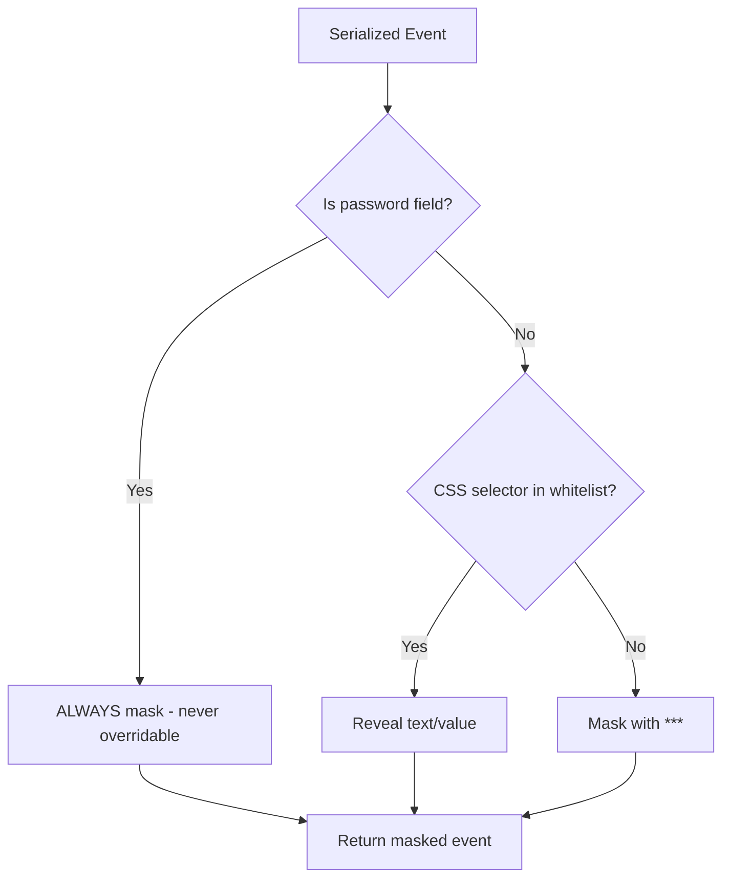

# Technical Design: PII Protection & Masking

> Feature ID: FEATURE-054-E | Version: v1.0 | Last Updated: 04-02-2026

---

## Part 1: Agent-Facing Summary

> **📌 AI Coders:** Focus on this section for implementation context.

### Key Components Implemented

| Component | Responsibility | Scope/Impact | Tags |
|-----------|----------------|--------------|------|
| `PIIMasker` | Apply masking rules to serialized events before buffer insertion | JS class inside `tracker-toolbar.js` IIFE | #frontend #pii #security |

### Dependencies

| Dependency | Source | Design Link | Usage Description |
|------------|--------|-------------|-------------------|
| `RecordingEngine` | FEATURE-054-C | [technical-design.md](x-ipe-docs/requirements/EPIC-054/FEATURE-054-C/technical-design.md) | Engine calls `PIIMasker.mask()` on each serialized event |
| `TrackerToolbox` | FEATURE-054-D | [technical-design.md](x-ipe-docs/requirements/EPIC-054/FEATURE-054-D/technical-design.md) | Toolbox provides UI for whitelist management |

### Major Flow

1. `RecordingEngine` captures and serializes DOM event
2. Before buffer insertion: `PIIMasker.mask(eventRecord)` runs
3. Check `target.tagName` + `target.type` — if password field → **ALWAYS** mask (never overridable)
4. Check `target.cssSelector` against whitelist — if match → reveal text/value
5. Default: replace `target.textContent` and `target.value` with `"***"`
6. Return masked event record to engine

### Usage Example

```javascript
const pii = new PIIMasker({
  whitelist: ['.product-title', '#search-input'],  // CSS selectors to reveal
  maskChar: '***'
});

// In recording engine pipeline
const serialized = EventSerializer.serialize(domEvent);
const masked = pii.mask(serialized);  // textContent/value masked unless whitelisted
buffer.push(masked);
```

---

## Part 2: Implementation Guide

### Decision Flow



### Class Design

```javascript
// Inside tracker-toolbar.js IIFE (~60 lines)
class PIIMasker {
  constructor(config) {
    this._whitelist = new Set(config.whitelist || []);
    this._maskChar = config.maskChar || '***';
  }

  mask(eventRecord) {
    if (!eventRecord.target) return eventRecord;
    const t = eventRecord.target;

    // Password fields — NEVER reveal, even if whitelisted
    if (this._isPasswordField(t)) {
      t.textContent = this._maskChar;
      t.value = this._maskChar;
      return eventRecord;
    }

    // Whitelist check
    if (this._isWhitelisted(t.cssSelector)) {
      return eventRecord;  // Reveal — no masking
    }

    // Default: mask everything
    if (t.textContent) t.textContent = this._maskChar;
    if (t.value) t.value = this._maskChar;
    return eventRecord;
  }

  addToWhitelist(cssSelector) {
    this._whitelist.add(cssSelector);
  }

  removeFromWhitelist(cssSelector) {
    this._whitelist.delete(cssSelector);
  }

  getWhitelist() {
    return [...this._whitelist];
  }

  _isPasswordField(target) {
    return target.tagName === 'INPUT' &&
      (target.type === 'password' || target.autocomplete === 'current-password' ||
       target.autocomplete === 'new-password');
  }

  _isWhitelisted(cssSelector) {
    if (!cssSelector) return false;
    for (const pattern of this._whitelist) {
      if (cssSelector.includes(pattern) || cssSelector === pattern) return true;
    }
    return false;
  }
}
```

### Implementation Steps

1. **PIIMasker class:** Implement constructor, mask(), whitelist management
2. **Password detection:** Check tagName=INPUT + type=password + autocomplete variants
3. **Whitelist matching:** CSS selector substring match against whitelist set
4. **Integration:** Wire into RecordingEngine pipeline between serialize and buffer.push
5. **Toolbox UI:** Expose `addToWhitelist`/`removeFromWhitelist` for toolbox controls (FEATURE-054-D)

### Edge Cases & Error Handling

| Scenario | Handling |
|----------|---------|
| Password field whitelisted by user | IGNORE whitelist — always mask (security invariant) |
| Empty textContent/value | Skip masking for that field (no-op) |
| `contenteditable` divs | Treat textContent as maskable; CSS selector decides |
| Input events on non-input elements | Mask textContent by default |
| Whitelist with broad selectors (e.g., `*`) | Allowed — user's choice (logged in session config) |

---

## Design Change Log

| Date | Phase | Change Summary |
|------|-------|----------------|
| 04-02-2026 | Initial Design | Initial technical design for PII masking |
