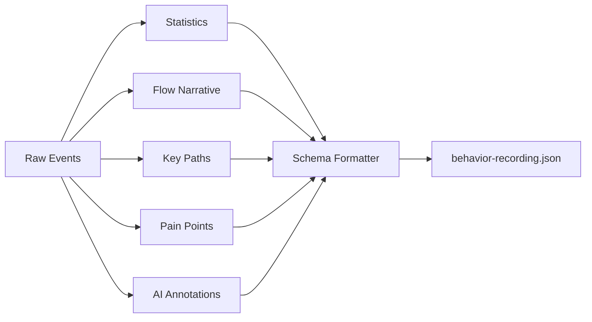

# Technical Design: behavior-recording.json Output & Post-Processing

> Feature ID: FEATURE-054-F | Version: v1.0 | Last Updated: 04-02-2026

---

## Part 1: Agent-Facing Summary

> **📌 AI Coders:** Focus on this section for implementation context.

### Key Components Implemented

| Component | Responsibility | Scope/Impact | Tags |
|-----------|----------------|--------------|------|
| `PostProcessor` | Transform raw event buffer into structured behavior-recording JSON | Python class in skill scripts | #backend #processing #output |
| `FlowNarrativeGenerator` | Generate human-readable flow description from events | Python function | #backend #narrative #ai |
| `SchemaFormatter` | Format output to v1.0 schema with all required sections | Python utility | #backend #schema #json |

### Dependencies

| Dependency | Source | Design Link | Usage Description |
|------------|--------|-------------|-------------------|
| `RecordingEngine` (output) | FEATURE-054-C | [technical-design.md](x-ipe-docs/requirements/EPIC-054/FEATURE-054-C/technical-design.md) | Raw event buffer as input |
| `PIIMasker` (config) | FEATURE-054-E | [technical-design.md](x-ipe-docs/requirements/EPIC-054/FEATURE-054-E/technical-design.md) | PII whitelist for metadata section |
| `BehaviorTrackerSkill` | FEATURE-054-B | [technical-design.md](x-ipe-docs/requirements/EPIC-054/FEATURE-054-B/technical-design.md) | Invokes post-processing on session stop |

### Major Flow

1. Session stops → `BehaviorTrackerSkill.stop()` calls `collect()` → raw events array
2. `PostProcessor.process(events, session_config)` runs automatically
3. Compute statistics: event counts by type, page transitions, session duration
4. Generate `flow_narrative` — describe user journey in natural language
5. Extract `key_paths` — most-traversed page sequences
6. Identify `pain_points` — repeated actions, long pauses, back-navigation
7. Add `ai_annotations` — per-event importance markers
8. Format to v1.0 schema → write `behavior-recording-{sessionId}.json`
9. On failure: retry once, then save raw events with `"postProcessingStatus": "failed"`

### Usage Example

```python
from x_ipe_learning_tracker.post_processor import PostProcessor

processor = PostProcessor()
output = processor.process(
    events=raw_events,  # List[dict] from CircularBuffer
    session_config={
        "sessionId": "uuid-v4",
        "purpose": "Checkout flow",
        "domain": "example.com",
        "piiWhitelist": [".product-title"]
    }
)
# Writes behavior-recording-{sessionId}.json to project folder
```

---

## Part 2: Implementation Guide

### Processing Pipeline



### Output Schema v1.0

```json
{
  "schema_version": "1.0",
  "session": {
    "id": "uuid-v4",
    "domain": "example.com",
    "purpose": "Checkout flow for AI agent training",
    "startedAt": "2026-04-02T10:00:00Z",
    "stoppedAt": "2026-04-02T10:30:00Z",
    "duration_ms": 1800000,
    "piiWhitelist": [".product-title"],
    "bufferCapacity": 10000,
    "postProcessingStatus": "completed"
  },
  "statistics": {
    "totalEvents": 142,
    "byType": { "click": 45, "input": 23, "scroll": 52, "navigation": 8, "resize": 2, "focus": 10, "drag": 2 },
    "pageCount": 5,
    "uniquePages": ["https://example.com/", "https://example.com/cart", "..."]
  },
  "events": [
    { "type": "click", "timestamp": 1712044800000, "relativeTime": 0, "target": {}, "metadata": {}, "details": {}, "annotation": null }
  ],
  "analysis": {
    "flow_narrative": "User started on homepage, browsed 3 products, added 2 to cart, proceeded to checkout but abandoned at payment step.",
    "key_paths": [
      { "path": ["/ ", "/products/123", "/cart", "/checkout"], "frequency": 1, "description": "Browse-to-checkout flow" }
    ],
    "pain_points": [
      { "type": "repeated_action", "description": "User clicked 'Add to Cart' 3 times on same product", "eventIndices": [12, 15, 18] },
      { "type": "long_pause", "description": "45s pause at payment form", "eventIndex": 98, "duration_ms": 45000 }
    ],
    "ai_annotations": [
      { "eventIndex": 98, "importance": "high", "note": "Hesitation at payment — possible UX friction" }
    ]
  }
}
```

### Component Architecture

```
.github/skills/x-ipe-learning-behavior-tracker-for-web/scripts/
└── post_processor.py                           (~300 lines)
    ├── PostProcessor class
    │   ├── process(events, session_config)     — orchestrate full pipeline
    │   ├── _compute_statistics(events)         — counts, page list, duration
    │   ├── _generate_flow_narrative(events)    — LLM call for natural language summary
    │   ├── _extract_key_paths(events)          — page sequence analysis
    │   ├── _identify_pain_points(events)       — heuristic detection
    │   ├── _annotate_events(events)            — per-event importance markers
    │   └── _format_output(all_sections)        — assemble v1.0 schema JSON
    └── SchemaFormatter
        ├── format_v1(session, stats, events, analysis) — build final JSON
        └── validate(output)                     — verify required fields present
```

### Pain Point Heuristics

| Heuristic | Detection Logic | Importance |
|-----------|----------------|------------|
| Repeated action | Same target + same action ≥3 times within 30s | medium |
| Long pause | Gap >30s between events (not scroll/resize) | medium |
| Back-navigation | `navigation` event where toUrl was previously visited | high |
| Form abandonment | `focus` on form field → navigation away without submit | high |
| Rage clicks | ≥5 clicks on same target within 3s | high |

### Implementation Steps

1. **PostProcessor class:** Implement process() orchestrator with try/catch + retry
2. **Statistics:** Simple aggregation — event counts, page URLs, duration
3. **Flow Narrative:** Use LLM (via skill context) to generate natural language summary
4. **Key Paths:** Extract page URL sequences, group by frequency
5. **Pain Points:** Implement 5 heuristic detectors
6. **AI Annotations:** Mark events matching pain point heuristics
7. **Schema Formatter:** Assemble v1.0 JSON, validate required fields
8. **File Output:** Write to project folder as `behavior-recording-{sessionId}.json`

### Edge Cases & Error Handling

| Scenario | Handling |
|----------|---------|
| LLM unavailable for narrative | Fallback: generate template-based narrative from event types/counts |
| Post-processing fails | Retry once; on second failure, save raw events with `postProcessingStatus: "failed"` |
| Empty events array | Write valid JSON with empty events, narrative = "No events recorded" |
| Very large event buffer (10K) | Process in chunks of 1000 for statistics; truncate LLM input to last 500 events |

---

## Design Change Log

| Date | Phase | Change Summary |
|------|-------|----------------|
| 04-02-2026 | Initial Design | Initial technical design for output & post-processing |
