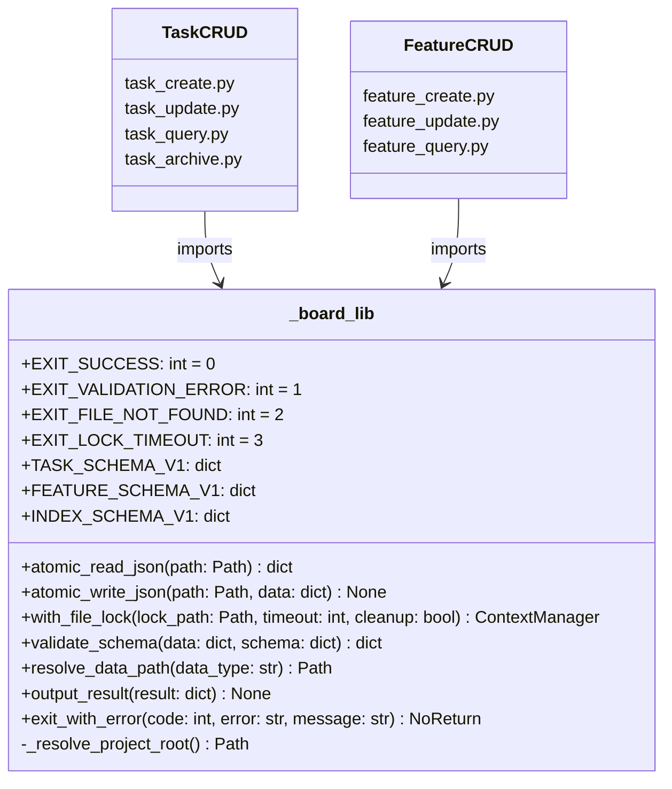
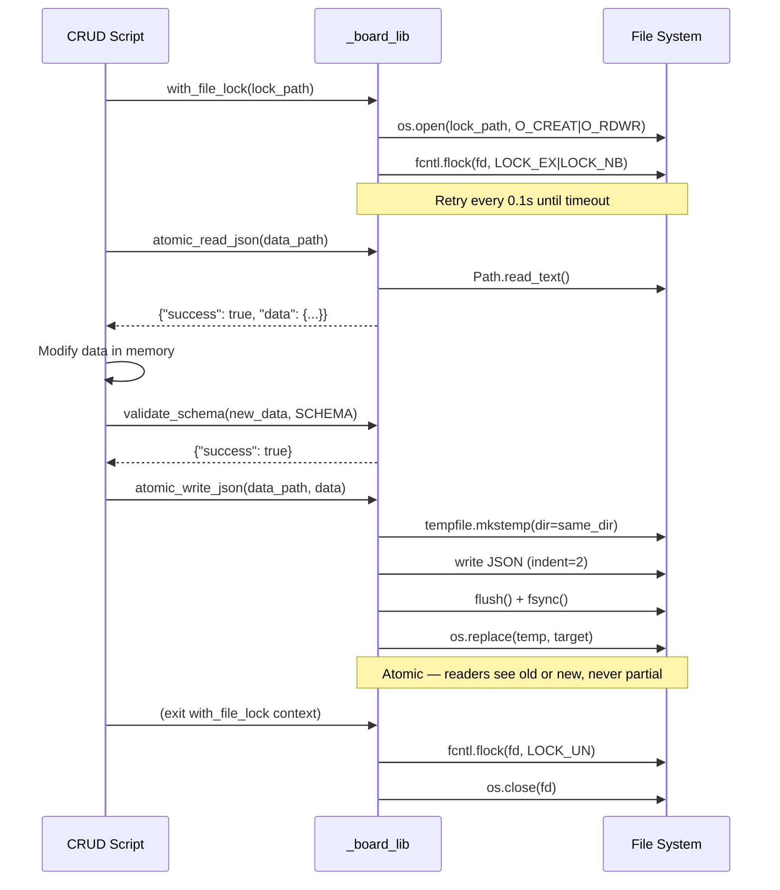
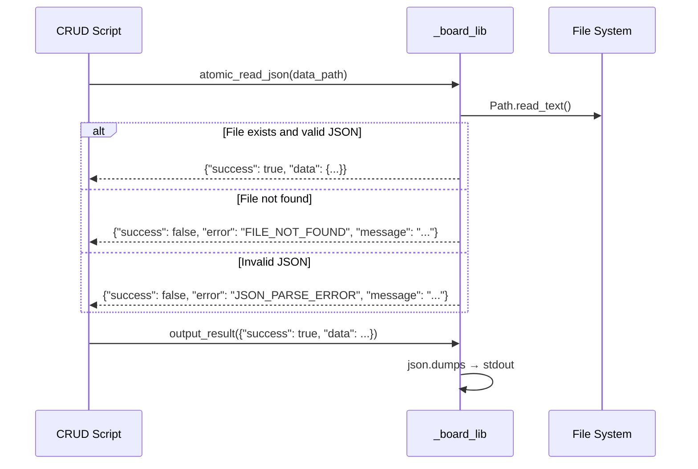

# Technical Design: Board Shared Library

> Feature ID: FEATURE-055-A | Version: v1.0 | Last Updated: 04-03-2026

> Specification: [specification.md](x-ipe-docs/requirements/EPIC-055/FEATURE-055-A/specification.md)

---

## Part 1: Agent-Facing Summary

> **Purpose:** Quick reference for AI agents navigating large projects.
> **📌 AI Coders:** Focus on this section for implementation context.

### Key Components Implemented

| Component | Responsibility | Scope/Impact | Tags |
|-----------|----------------|--------------|------|
| `_board_lib.py` | Shared library entry point | Foundation for EPIC-055 + EPIC-056 | #board #library #foundation |
| `atomic_read_json()` | Safe JSON file read with error handling | All board JSON files | #io #json #read |
| `atomic_write_json()` | Atomic JSON write (tempfile→fsync→replace) | All board JSON writes | #io #json #write #atomic |
| `with_file_lock()` | POSIX exclusive file lock context manager | Concurrent agent access | #lock #concurrency #fcntl |
| `validate_schema()` | Strict schema validation (reject unknown fields) | All create/update operations | #schema #validation #strict |
| `TASK_SCHEMA_V1` | Task data schema definition | Task CRUD scripts | #schema #task |
| `FEATURE_SCHEMA_V1` | Feature data schema definition | Feature CRUD scripts | #schema #feature |
| `INDEX_SCHEMA_V1` | Task index schema definition | Task index management | #schema #index |
| `resolve_data_path()` | Path resolution for tasks/features dirs | All board scripts | #path #resolution |
| `output_result()` | Structured JSON success output to stdout | All board scripts | #output #json |
| `exit_with_error()` | Structured JSON error output + sys.exit | All board scripts | #output #error #exit |

### Dependencies

| Dependency | Source | Design Link | Usage Description |
|------------|--------|-------------|-------------------|
| `_lib.py` patterns | x-ipe-tool-x-ipe-app-interactor | N/A (reference only) | Follow established patterns for atomic I/O, locking, output formatting. Do NOT import from `_lib.py` — replicate patterns in `_board_lib.py`. |

### Major Flow

1. Board CRUD scripts import `_board_lib` via `sys.path.insert(0, ...)` from the task board manager skill scripts folder
2. Scripts call `resolve_data_path("tasks"|"features")` to locate data directories
3. For reads: `atomic_read_json(path)` → returns parsed data or error dict
4. For writes: `with_file_lock(path.with_suffix(".json.lock"))` → `atomic_read_json` → modify → `validate_schema(data, SCHEMA)` → `atomic_write_json(path, data)`
5. All scripts format output via `output_result()` or `exit_with_error()` with standardized exit codes

### Usage Example

```python
import sys
from pathlib import Path
sys.path.insert(0, str(Path(__file__).resolve().parent))  # noqa: E402
from _board_lib import (
    atomic_read_json, atomic_write_json, with_file_lock,
    validate_schema, TASK_SCHEMA_V1, resolve_data_path,
    output_result, exit_with_error,
    EXIT_SUCCESS, EXIT_VALIDATION_ERROR, EXIT_FILE_NOT_FOUND, EXIT_LOCK_TIMEOUT,
)

# Resolve data directory
tasks_dir = resolve_data_path("tasks")
daily_file = tasks_dir / "tasks-2026-04-03.json"
lock_file = daily_file.with_suffix(".json.lock")

# Read-modify-write with locking
with with_file_lock(lock_file):
    result = atomic_read_json(daily_file)
    if not result["success"]:
        exit_with_error(EXIT_FILE_NOT_FOUND, "FILE_NOT_FOUND", result["error"])

    tasks = result["data"]
    new_task = {"task_id": "TASK-1060", "task_type": "Technical Design", ...}

    # Validate before writing
    validation = validate_schema(new_task, TASK_SCHEMA_V1)
    if not validation["success"]:
        exit_with_error(EXIT_VALIDATION_ERROR, "VALIDATION_ERROR", validation["error"])

    tasks["tasks"].append(new_task)
    atomic_write_json(daily_file, tasks)

output_result({"success": True, "data": {"task_id": "TASK-1060"}})
```

---

## Part 2: Implementation Guide

> **Purpose:** Detailed guide for developers implementing this feature.
> **📌 Emphasis on visual diagrams for comprehension.**

### Module Architecture



### Workflow Diagram — Write Path



### Workflow Diagram — Read Path



### File Location

```
.github/skills/x-ipe-tool-task-board-manager/
└── scripts/
    ├── _board_lib.py          ← THIS FEATURE
    ├── task_create.py         ← FEATURE-055-B (imports _board_lib)
    ├── task_update.py         ← FEATURE-055-B
    ├── task_query.py          ← FEATURE-055-B
    └── task_archive.py        ← FEATURE-055-B

.github/skills/x-ipe-tool-feature-board-manager/
└── scripts/
    ├── feature_create.py      ← FEATURE-056-A (imports _board_lib via sys.path)
    ├── feature_update.py      ← FEATURE-056-A
    └── feature_query.py       ← FEATURE-056-A
```

Feature board scripts import `_board_lib.py` from the task board manager skill folder:
```python
# In feature_create.py (FEATURE-056-A)
_task_board_scripts = Path(__file__).resolve().parent.parent.parent / "x-ipe-tool-task-board-manager" / "scripts"
sys.path.insert(0, str(_task_board_scripts))
from _board_lib import atomic_read_json, atomic_write_json, ...  # noqa: E402
```

### Data Directories

| Data Type | Directory | Created By |
|-----------|-----------|------------|
| tasks | `x-ipe-docs/planning/tasks/` | FEATURE-055-B (task_create.py) |
| features | `x-ipe-docs/planning/features/` | FEATURE-056-A (feature_create.py) |

`resolve_data_path()` returns absolute paths to these directories; the directories themselves are created by the CRUD scripts (not by `_board_lib`).

### Function Specifications

#### `atomic_read_json(path: Path) → dict`

```python
def atomic_read_json(path: Path) -> dict:
    """Read and parse a JSON file safely.

    Returns:
        On success: {"success": True, "data": <parsed content>}
        On failure: {"success": False, "error": "<ERROR_CODE>", "message": "<details>"}

    Error codes: FILE_NOT_FOUND, JSON_PARSE_ERROR, READ_ERROR
    """
```

- Converts `str` to `Path` if needed
- Returns error dict (never raises exceptions)
- Error codes: `FILE_NOT_FOUND`, `JSON_PARSE_ERROR`, `READ_ERROR`

#### `atomic_write_json(path: Path, data: dict | list) → None`

```python
def atomic_write_json(path: Path, data: dict | list) -> None:
    """Write data to a JSON file atomically.

    Uses tempfile in same directory → fsync → os.replace pattern.
    Creates parent directories if they don't exist.
    Raises OSError on failure (caller should handle).
    """
```

- Creates parent dirs with `path.parent.mkdir(parents=True, exist_ok=True)`
- `tempfile.mkstemp(dir=path.parent, suffix=".tmp")` for temp file in same dir
- Writes with `json.dump(data, f, indent=2, ensure_ascii=False)` + newline
- `f.flush()` → `os.fsync(f.fileno())` → `os.replace(temp, path)`
- `try/finally` cleans up temp file on error

#### `with_file_lock(lock_path: Path, timeout: int = 10, cleanup: bool = False) → ContextManager`

```python
@contextmanager
def with_file_lock(lock_path: Path, timeout: int = 10, cleanup: bool = False):
    """Acquire exclusive POSIX file lock with timeout.

    Args:
        lock_path: Path to lock file (e.g., data_file.with_suffix(".json.lock"))
        timeout: Max seconds to wait for lock (default 10)
        cleanup: If True, remove lock file after release

    Raises:
        SystemExit(3): If lock cannot be acquired within timeout
    """
```

- Creates parent dirs and lock file via `os.open(str(lock_path), os.O_CREAT | os.O_RDWR)`
- Non-blocking retry loop: `fcntl.flock(fd, fcntl.LOCK_EX | fcntl.LOCK_NB)`
- Catches `BlockingIOError`, sleeps 0.1s, retries until `time.monotonic() >= deadline`
- On timeout: `exit_with_error(EXIT_LOCK_TIMEOUT, "LOCK_TIMEOUT", ...)`
- `finally` block: unlock → close fd → optionally unlink lock file

#### `validate_schema(data: dict, schema: dict) → dict`

```python
def validate_schema(data: dict, schema: dict) -> dict:
    """Validate data dict against schema definition.

    Schema format: {"field_name": {"type": type, "required": bool}, ...}
    Special keys starting with "_" (e.g., "_version") are metadata, not validated as fields.

    Strict mode: rejects any field in data not defined in schema.

    Returns:
        {"success": True} or {"success": False, "error": "<message>"}
    """
```

Validation order:
1. Check `data` is a dict → error if not
2. Extract field definitions (skip keys starting with `_`)
3. Check required fields present → `"Missing required field: X"`
4. Check field types match → `"Field 'X' expected type Y, got Z"`
5. Check no unknown fields → `"Unknown field: X"` (strict mode)

#### Schema Definitions

```python
TASK_SCHEMA_V1 = {
    "_version": "1.0",
    "task_id":      {"type": str,  "required": True},
    "task_type":    {"type": str,  "required": True},
    "description":  {"type": str,  "required": True},
    "role":         {"type": str,  "required": True},
    "status":       {"type": str,  "required": True},
    "created_at":   {"type": str,  "required": True},
    "last_updated": {"type": str,  "required": True},
    "output_links": {"type": list, "required": True},
    "next_task":    {"type": str,  "required": True},
}

FEATURE_SCHEMA_V1 = {
    "_version": "1.0",
    "feature_id":         {"type": str,  "required": True},
    "epic_id":            {"type": str,  "required": True},
    "title":              {"type": str,  "required": True},
    "version":            {"type": str,  "required": True},
    "status":             {"type": str,  "required": True},
    "description":        {"type": str,  "required": False},
    "dependencies":       {"type": list, "required": True},
    "specification_link": {"type": str,  "required": False},
    "created_at":         {"type": str,  "required": True},
    "last_updated":       {"type": str,  "required": True},
}

INDEX_SCHEMA_V1 = {
    "_version": "1.0",
    "version":  {"type": str,  "required": True},
    "entries":  {"type": dict, "required": True},
}
```

#### `resolve_data_path(data_type: str) → Path`

```python
def resolve_data_path(data_type: str) -> Path:
    """Resolve absolute path to board data directory.

    Args:
        data_type: "tasks" or "features"

    Returns:
        Absolute Path to data directory

    Raises:
        ValueError: If data_type not recognized
    """
```

Mapping:
- `"tasks"` → `{project_root}/x-ipe-docs/planning/tasks/`
- `"features"` → `{project_root}/x-ipe-docs/planning/features/`

Uses `_resolve_project_root()` internally (walks up from CWD to find dir containing `x-ipe-docs/`).

#### Output Helpers

```python
def output_result(result: dict) -> None:
    """Print structured JSON result to stdout."""
    print(json.dumps(result, ensure_ascii=False))

def exit_with_error(code: int, error: str, message: str) -> None:
    """Print structured JSON error to stderr and exit."""
    print(json.dumps({"success": False, "error": error, "message": message},
                     ensure_ascii=False), file=sys.stderr)
    sys.exit(code)
```

### Implementation Steps

1. **Create module file:**
   - Create `.github/skills/x-ipe-tool-task-board-manager/scripts/_board_lib.py`
   - Add module docstring explaining purpose and usage

2. **Implement constants:**
   - Exit code constants: `EXIT_SUCCESS`, `EXIT_VALIDATION_ERROR`, `EXIT_FILE_NOT_FOUND`, `EXIT_LOCK_TIMEOUT`
   - Schema definitions: `TASK_SCHEMA_V1`, `FEATURE_SCHEMA_V1`, `INDEX_SCHEMA_V1`

3. **Implement project root detection:**
   - `_resolve_project_root()` — walk up from CWD looking for `x-ipe-docs/` marker

4. **Implement path resolution:**
   - `resolve_data_path(data_type)` — map data type to directory path

5. **Implement output helpers:**
   - `output_result(result)` — JSON to stdout
   - `exit_with_error(code, error, message)` — JSON to stderr + exit

6. **Implement atomic I/O:**
   - `atomic_read_json(path)` — safe read with error dicts
   - `atomic_write_json(path, data)` — tempfile → fsync → replace

7. **Implement file locking:**
   - `with_file_lock(lock_path, timeout, cleanup)` — fcntl.flock context manager

8. **Implement schema validation:**
   - `validate_schema(data, schema)` — strict validation with unknown field rejection

### Edge Cases & Error Handling

| Scenario | Component | Expected Behavior |
|----------|-----------|-------------------|
| File not found on read | `atomic_read_json` | Return `{"success": false, "error": "FILE_NOT_FOUND", ...}` |
| Invalid JSON content | `atomic_read_json` | Return `{"success": false, "error": "JSON_PARSE_ERROR", ...}` |
| Disk full on write | `atomic_write_json` | Temp write fails, original file preserved, `OSError` propagates |
| Process crash mid-write | `atomic_write_json` | Only temp file affected, original intact (atomic replace not yet called) |
| Lock held by other process | `with_file_lock` | Retry 0.1s intervals → exit code 3 after timeout |
| Lock holder process dies | `with_file_lock` | `fcntl.flock` auto-releases on fd close → lock acquired normally |
| Extra field in data | `validate_schema` | `{"success": false, "error": "Unknown field: X"}` |
| Missing required field | `validate_schema` | `{"success": false, "error": "Missing required field: X"}` |
| Wrong field type | `validate_schema` | `{"success": false, "error": "Field 'X' expected type Y, got Z"}` |
| Unknown data_type | `resolve_data_path` | `ValueError` raised |
| CWD outside project | `_resolve_project_root` | `exit_with_error(EXIT_FILE_NOT_FOUND, ...)` |
| Parent dir missing on write | `atomic_write_json` | Creates parent dirs automatically |

### Testing Strategy

| Test Area | Test Type | Key Tests |
|-----------|-----------|-----------|
| `atomic_read_json` | Unit | Valid file, missing file, invalid JSON, empty file |
| `atomic_write_json` | Unit | Basic write, indent format, parent dir creation, temp cleanup on error |
| `with_file_lock` | Unit + Integration | Acquire/release, timeout, exception propagation, concurrent access |
| `validate_schema` | Unit | Valid data, missing fields, wrong types, unknown fields, non-dict input |
| Schema constants | Unit | Correct fields, types, `_version` key present |
| `resolve_data_path` | Unit | "tasks" path, "features" path, unknown type |
| `output_result` | Unit | Valid JSON output on stdout |
| `exit_with_error` | Unit | JSON to stderr, correct exit code |
| Stdlib-only | Integration | Import in clean environment |

**Test Location:** `tests/test_board_lib.py` (Python pytest)

---

## Design Change Log

| Date | Phase | Change Summary |
|------|-------|----------------|
| 04-03-2026 | Initial Design | Initial technical design for FEATURE-055-A Board Shared Library. Defined module structure, 8 public functions, 3 schema constants, 4 exit codes. Library pattern follows existing `_lib.py` conventions. |
