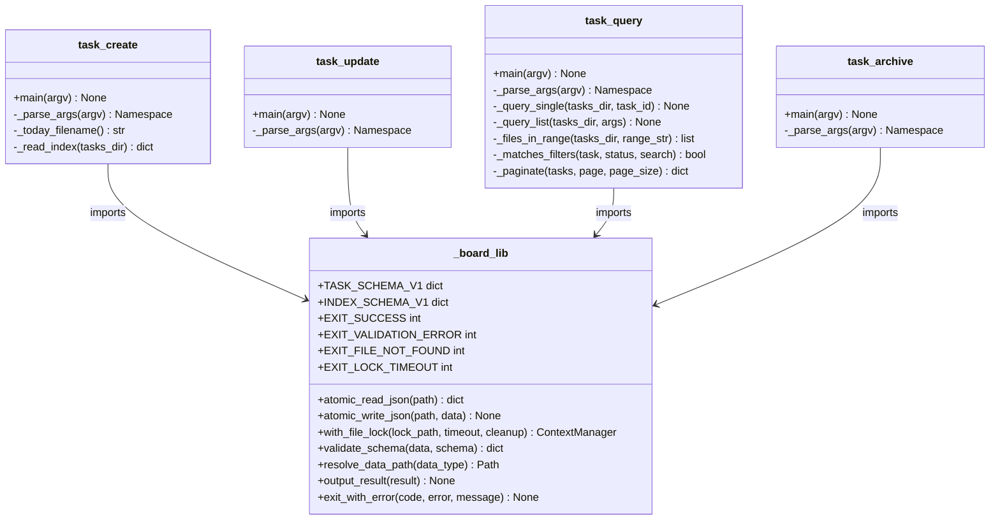
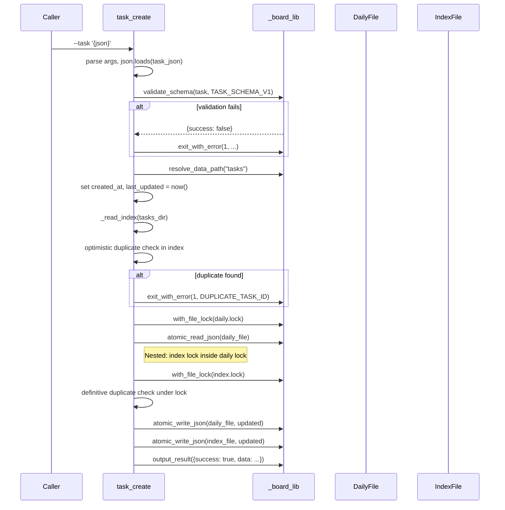
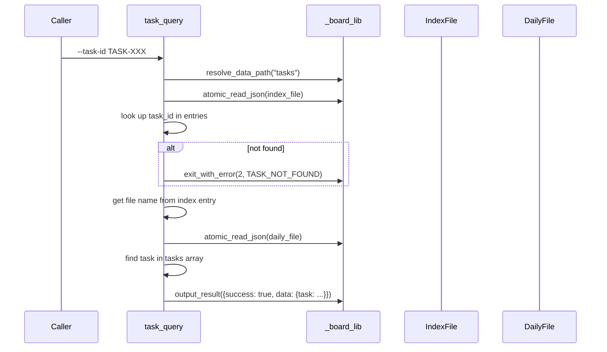
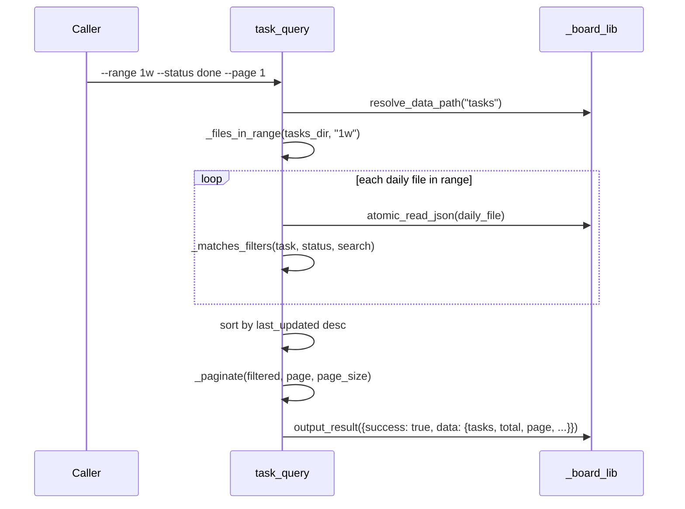

# Technical Design: Task CRUD Scripts

> Feature ID: FEATURE-055-B
> Version: v1.0
> Status: Draft
> Last Updated: 04-03-2026

## Version History

| Version | Date | Description |
|---------|------|-------------|
| v1.0 | 04-03-2026 | Initial design |

## Related Documents

- [Specification](x-ipe-docs/requirements/EPIC-055/FEATURE-055-B/specification.md)
- [Board Shared Library Design](x-ipe-docs/requirements/EPIC-055/FEATURE-055-A/technical-design.md)
- [Board Shared Library Implementation](.github/skills/x-ipe-tool-task-board-manager/scripts/_board_lib.py)

---

# Part 1 — Agent-Facing Summary

## Overview

Four standalone CLI Python scripts for managing task data as JSON files. Each script uses argparse, imports `_board_lib.py`, and follows the established pattern from `x-ipe-tool-x-ipe-app-interactor/scripts/`.

- **program_type:** cli
- **tech_stack:** ["Python"]

## Key Components Implemented

| Component | File Path | Responsibility | Tags |
|-----------|-----------|---------------|------|
| task_create | `.github/skills/x-ipe-tool-task-board-manager/scripts/task_create.py` | Create task in daily file + update index | `[task] [create] [crud] [cli]` |
| task_update | `.github/skills/x-ipe-tool-task-board-manager/scripts/task_update.py` | Partial-merge update of task fields | `[task] [update] [crud] [cli]` |
| task_query | `.github/skills/x-ipe-tool-task-board-manager/scripts/task_query.py` | Query tasks with filters, pagination, or single ID lookup | `[task] [query] [crud] [cli]` |
| task_archive | `.github/skills/x-ipe-tool-task-board-manager/scripts/task_archive.py` | Archive daily file + remove from index | `[task] [archive] [crud] [cli]` |

## Dependencies

| Dependency | Type | Purpose |
|-----------|------|---------|
| `_board_lib.py` | Internal (FEATURE-055-A) | Atomic I/O, locking, validation, schemas, output, exit codes |
| Python 3.10+ stdlib | External | argparse, datetime, json, pathlib, sys |

## Usage Example

```bash
# Create a task
python3 task_create.py --task '{"task_id": "TASK-1064", "task_type": "Feature Refinement", "description": "Refine FEATURE-055-B", "role": "Drift", "status": "in_progress", "output_links": [], "next_task": "x-ipe-task-based-technical-design"}'

# Update a task
python3 task_update.py --task-id TASK-1064 --updates '{"status": "done", "output_links": ["spec.md"]}'

# Query tasks (filtered list)
python3 task_query.py --range 1w --status done --page 1 --page-size 10

# Query single task
python3 task_query.py --task-id TASK-1064

# Archive old tasks
python3 task_archive.py --date 2026-03-01
```

## Data Model

### Daily File: `tasks-YYYY-MM-DD.json`

```json
{
  "_version": "1.0",
  "tasks": [
    {
      "task_id": "TASK-1064",
      "task_type": "Feature Refinement",
      "description": "Refine FEATURE-055-B",
      "role": "Drift",
      "status": "done",
      "created_at": "2026-04-03T06:10:00Z",
      "last_updated": "2026-04-03T06:15:00Z",
      "output_links": ["spec.md"],
      "next_task": "x-ipe-task-based-technical-design"
    }
  ]
}
```

### Index File: `tasks-index.json`

```json
{
  "_version": "1.0",
  "version": "1.0",
  "entries": {
    "TASK-1064": {
      "file": "tasks-2026-04-03.json",
      "status": "done",
      "last_updated": "2026-04-03T06:15:00Z"
    }
  }
}
```

---

# Part 2 — Implementation Guide

## Architecture

All four scripts share the same structure:

```
.github/skills/x-ipe-tool-task-board-manager/scripts/
├── _board_lib.py          # Shared library (FEATURE-055-A) — DO NOT MODIFY
├── task_create.py         # Create operation
├── task_update.py         # Update operation
├── task_query.py          # Query operation (list + single)
├── task_archive.py        # Archive operation
```

## Class Diagram



## Sequence Diagrams

### Create Flow



### Query Flow (Single by ID)



### Query Flow (Filtered List)



## Function Specifications

### task_create.py

| Function | Signature | Purpose |
|----------|-----------|---------|
| `main(argv)` | `(list[str] \| None) -> None` | Entry point: parse args → validate → create task → update index |
| `_parse_args(argv)` | `(list[str] \| None) -> Namespace` | Parse `--task` (required JSON string), `--lock-timeout` (default 10) |
| `_today_filename()` | `() -> str` | Return `tasks-YYYY-MM-DD.json` for today's UTC date |
| `_read_index(tasks_dir)` | `(Path) -> dict` | Read or initialize index with `{"_version": "1.0", "version": "1.0", "entries": {}}` |

**Algorithm:**
1. Parse `--task` JSON string → dict
2. Strip `created_at` and `last_updated` if caller provided them (system-managed)
3. Set `created_at = last_updated = datetime.now(timezone.utc).isoformat()`
4. Validate against TASK_SCHEMA_V1 (timestamps already set)
5. Bootstrap `tasks/` directory (mkdir if missing)
6. Read index (optimistic) → check task_id not in entries
7. Lock daily file → read daily → **nested:** lock index → definitive dup check → write daily → write index → release index → release daily
8. Output success with task_id and file name

### task_update.py

| Function | Signature | Purpose |
|----------|-----------|---------|
| `main(argv)` | `(list[str] \| None) -> None` | Entry point: parse args → look up → validate → merge → write |
| `_parse_args(argv)` | `(list[str] \| None) -> Namespace` | Parse `--task-id` (required), `--updates` (required JSON), `--lock-timeout` |
**Algorithm:**
1. Parse `--task-id` and `--updates` JSON
2. Strip auto-managed `last_updated` from updates; reject empty updates
3. Reject if updates contain `task_id` or `created_at` (immutable fields)
4. Validate update fields: check each key exists in TASK_SCHEMA_V1 and type matches
5. Read index → find file for task_id (exit 2 if not found)
6. Lock daily file → read → find task by task_id (inline loop) → merge updates → set `last_updated = now()` → **nested:** lock index → write daily → re-read index → update status and last_updated → write index → release index → release daily
7. Output success with task_id and list of updated fields

### task_query.py

| Function | Signature | Purpose |
|----------|-----------|---------|
| `main(argv)` | `(list[str] \| None) -> None` | Entry point: parse args → route to single or list mode |
| `_parse_args(argv)` | `(list[str] \| None) -> Namespace` | Parse `--task-id`, `--range`, `--status`, `--search`, `--page`, `--page-size` |
| `_query_single(tasks_dir, task_id)` | `(Path, str) -> None` | Query single task by ID via index lookup |
| `_query_list(tasks_dir, args)` | `(Path, Namespace) -> None` | Query tasks with filters, sorting, and pagination |
| `_files_in_range(tasks_dir, range_str)` | `(Path, str) -> list[Path]` | List non-archived daily files within date range, sorted by date desc |
| `_matches_filters(task, status, search)` | `(dict, str \| None, str \| None) -> bool` | Check if task matches status and search filters |
| `_paginate(tasks, page, page_size)` | `(list, int, int) -> dict` | Slice list and compute pagination metadata |

**Algorithm (single mode — `--task-id` provided):**
1. Read index → look up file → read daily file → find task → output single task

**Algorithm (list mode — no `--task-id`):**
1. Compute date cutoff from `--range` (default 1w: 7 days, 1m: 30 days, all: no cutoff)
2. List daily files matching `tasks-YYYY-MM-DD.json` glob (skip `*.archived.json`)
3. Filter files by date (parse date from filename, compare to cutoff)
4. Load each file → extract tasks → apply status/search filters
5. Sort all matching tasks by `last_updated` descending
6. Paginate → output with metadata

### task_archive.py

| Function | Signature | Purpose |
|----------|-----------|---------|
| `main(argv)` | `(list[str] \| None) -> None` | Entry point: parse args → rename file → update index |
| `_parse_args(argv)` | `(list[str] \| None) -> Namespace` | Parse `--date` (required YYYY-MM-DD), `--lock-timeout` |

**Algorithm:**
1. Parse `--date` → validate format → construct `tasks-{date}.json` filename
2. Check file exists (exit 2 if not)
3. Check `*.archived.json` doesn't already exist (exit 1 if it does)
4. Lock daily file → read tasks → get all task_ids → **nested:** lock index → rename file to `.archived.json` → remove all task_ids from index → write index → release index → release daily
5. Output success with archived file name, count of tasks removed, and list of task_ids

## Schemas

### Daily File Schema

```python
DAILY_FILE_SCHEMA = {
    "_version": "1.0",       # metadata, always "1.0"
    "tasks": list             # array of task dicts conforming to TASK_SCHEMA_V1
}
```

This is an internal convention, not a _board_lib schema constant. Scripts construct this structure directly.

### Index File Schema

Uses `INDEX_SCHEMA_V1` from `_board_lib.py`:
- `version`: str — schema version ("1.0")
- `entries`: dict — maps task_id → `{"file": str, "status": str, "last_updated": str}`

### Validation Rules

| Field | Create | Update |
|-------|--------|--------|
| task_id | Required, must be unique | Immutable (reject changes) |
| task_type | Required | Mutable |
| description | Required | Mutable |
| role | Required | Mutable |
| status | Required | Mutable |
| created_at | Auto-set by script | Immutable (reject changes) |
| last_updated | Auto-set by script | Auto-set by script |
| output_links | Required (can be `[]`) | Mutable |
| next_task | Required (can be `""`) | Mutable |

## Lock Strategy

```
Operation          Locks (in order)
─────────────────  ──────────────────────────────
task_create        1. tasks-YYYY-MM-DD.json.lock  2. tasks-index.json.lock
task_update        1. tasks-YYYY-MM-DD.json.lock  2. tasks-index.json.lock
task_query         (no locks — read-only)
task_archive       1. tasks-YYYY-MM-DD.json.lock  2. tasks-index.json.lock
```

Lock ordering prevents deadlocks: always daily file first, then index. Locks are **nested** (index lock acquired while daily lock is still held); both are released before output.

## Error Handling

| Error Code | Constant | When |
|-----------|----------|------|
| 0 | EXIT_SUCCESS | Operation completed successfully |
| 1 | EXIT_VALIDATION_ERROR | Schema validation, duplicate ID, immutable field, already archived |
| 2 | EXIT_FILE_NOT_FOUND | Task not in index, daily file missing |
| 3 | EXIT_LOCK_TIMEOUT | Could not acquire lock within timeout |

All errors output JSON to stderr: `{"success": false, "error": "ERROR_CODE", "message": "Human-readable detail"}`

## Date Range Computation

```python
def _files_in_range(tasks_dir: Path, range_str: str) -> list[Path]:
    """List non-archived daily files within date range."""
    today = datetime.now(timezone.utc).date()
    cutoff = {
        "1w": today - timedelta(days=7),
        "1m": today - timedelta(days=30),
        "all": None,
    }.get(range_str)

    files = sorted(tasks_dir.glob("tasks-*.json"), reverse=True)
    result = []
    for f in files:
        if f.name.endswith(".archived.json"):
            continue
        # Parse date from filename: tasks-YYYY-MM-DD.json
        date_str = f.stem.replace("tasks-", "")
        try:
            file_date = datetime.strptime(date_str, "%Y-%m-%d").date()
        except ValueError:
            continue  # skip malformed filenames
        if cutoff is None or file_date >= cutoff:
            result.append(f)
    return result
```

## Implementation Steps

| Step | Script | Description | ACs Covered |
|------|--------|-------------|-------------|
| 1 | task_create.py | Implement create with schema validation, duplicate check, daily file append, index update | AC-055B-01a–h, 06a, 06c, 07a–e, 08a–b |
| 2 | task_update.py | Implement partial merge update with immutable field protection | AC-055B-02a–f, 06b, 07a–e, 08a–b |
| 3 | task_query.py | Implement filtered list + single ID lookup with pagination | AC-055B-03a–h, 04a–c, 07a–e |
| 4 | task_archive.py | Implement file rename + index cleanup | AC-055B-05a–d, 06d, 07a–e, 08a–b |

Order: create first (needed to populate test data), then update, query, archive.

## Testing Strategy

- Test location: `tests/test_task_crud.py`
- Pattern: class-based with pytest, `tmp_path` fixture for isolated file operations
- Each script tested via `main(argv=[...])` with captured stdout/stderr
- Mock `datetime.now()` for deterministic timestamps
- Test classes: `TestTaskCreate`, `TestTaskUpdate`, `TestTaskQueryList`, `TestTaskQueryById`, `TestTaskArchive`, `TestIndexManagement`, `TestCLIInterface`, `TestAtomicityLocking`

---

## Design Change Log

| Date | Change | Reason |
|------|--------|--------|
| 04-03-2026 | Initial design | FEATURE-055-B technical design |
