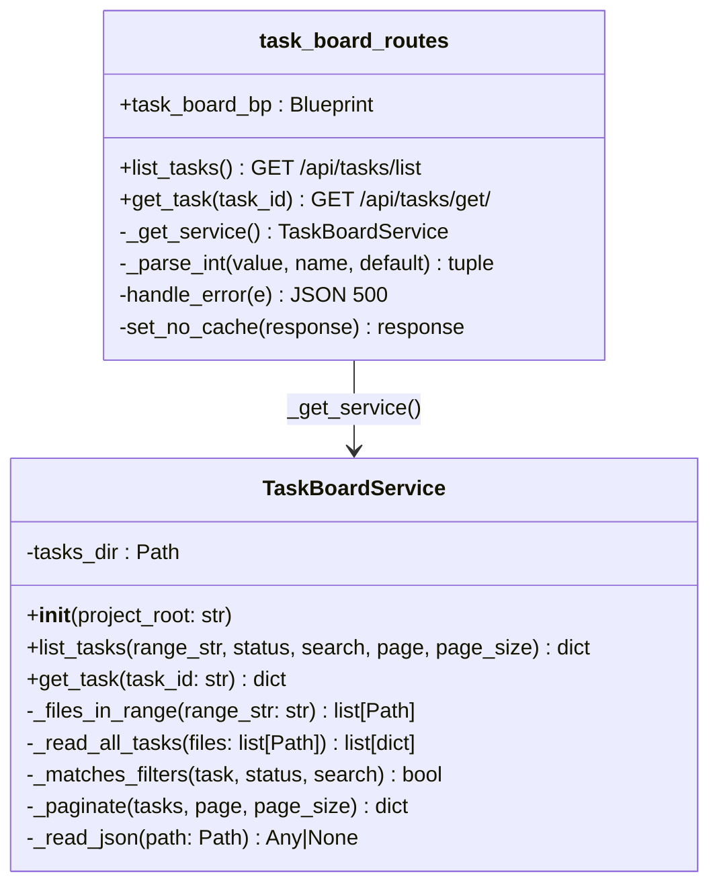
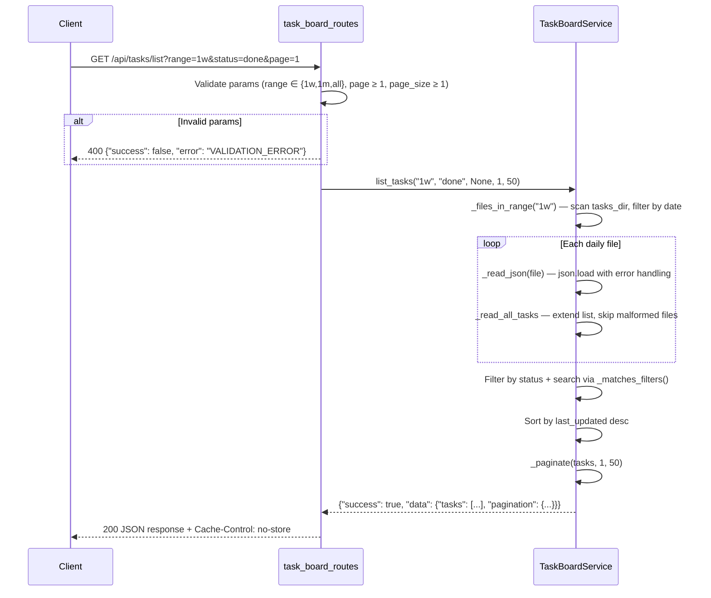
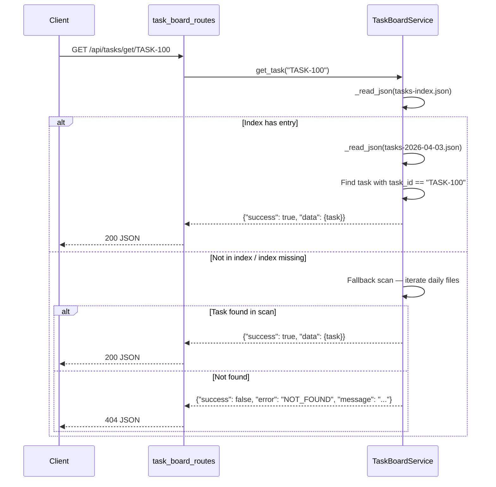

# Technical Design: FEATURE-055-C — Task Board API

> Feature ID: FEATURE-055-C
> Version: v1.0
> Status: Designed
> Last Updated: 04-03-2026
> Program Type: backend
> Tech Stack: Python/Flask, pytest

## Version History

| Version | Date | Description |
|---------|------|-------------|
| v1.0 | 04-03-2026 | Initial design |

## Related Documents

- [Specification](x-ipe-docs/requirements/EPIC-055/FEATURE-055-C/specification.md)
- [Board Shared Library](x-ipe-docs/requirements/EPIC-055/FEATURE-055-A/technical-design.md)
- [Task CRUD Scripts](x-ipe-docs/requirements/EPIC-055/FEATURE-055-B/technical-design.md)

---

# Part 1 — Agent-Facing Summary

## What This Feature Does

Adds a read-only Flask API for querying task data. Two endpoints — list (with filtering, search, pagination) and get-by-ID — consumed by the Task Board Web Page (FEATURE-057-A). Follows the existing blueprint + service-layer pattern used by `workflow_routes.py`.

## Key Components Implemented

| Component | File | Tags | Purpose |
|-----------|------|------|---------|
| TaskBoardBlueprint | `src/x_ipe/routes/task_board_routes.py` | `flask, blueprint, api, tasks, routes` | Route definitions, parameter validation, error handling |
| TaskBoardService | `src/x_ipe/services/task_board_service.py` | `service, tasks, query, filter, pagination` | Business logic: read daily files, filter, sort, paginate |
| Blueprint Registration | `src/x_ipe/app.py` | `registration, blueprint` | Register task_board_bp in _register_blueprints() |
| Tests | `tests/test_task_board_api.py` | `pytest, flask, test-client, api` | Route + service tests using Flask test client |

## Usage Example

```bash
# List tasks with defaults (range=1w, page=1, page_size=50)
curl http://127.0.0.1:5050/api/tasks/list

# List with filters
curl "http://127.0.0.1:5050/api/tasks/list?range=1m&status=in_progress&search=drift&page=1&page_size=20"

# Get single task by ID
curl http://127.0.0.1:5050/api/tasks/get/TASK-1050
```

**Response (list):**
```json
{
  "success": true,
  "data": {
    "tasks": [
      {"task_id": "TASK-1050", "task_type": "Feature Refinement", "description": "...", "role": "Drift", "status": "done", "created_at": "2026-04-03T10:00:00Z", "last_updated": "2026-04-03T12:00:00Z", "output_links": [], "next_task": "..."}
    ],
    "pagination": {"total": 1, "page": 1, "page_size": 50, "total_pages": 1}
  }
}
```

**Response (get):**
```json
{
  "success": true,
  "data": {"task_id": "TASK-1050", "...": "..."}
}
```

## Data Model

No new data models. Reads existing structures:
- **Daily files:** `x-ipe-docs/planning/tasks/tasks-YYYY-MM-DD.json` — array of task objects
- **Index file:** `x-ipe-docs/planning/tasks/tasks-index.json` — `{"_version": "1.0", "entries": {"TASK-ID": {"file": "...", "status": "...", "last_updated": "..."}}}`
- **Task schema:** TASK_SCHEMA_V1 from `_board_lib.py` (9 fields)

## Dependencies

| Dependency | Type | What's Used |
|------------|------|-------------|
| Flask | External | Blueprint, jsonify, request, current_app |
| `x_ipe_tracing` | Internal | `@x_ipe_tracing()` decorator |

---

# Part 2 — Implementation Guide

## Class Diagram



## Sequence Diagram — List Tasks



## Sequence Diagram — Get Task



## Function Specifications

### task_board_routes.py

| Function | Signature | Purpose |
|----------|-----------|---------|
| `_get_service()` | `() → TaskBoardService` | Instantiate service with `current_app.config.get('PROJECT_ROOT', os.getcwd())` |
| `_parse_int(value, name, default)` | `(str\|None, str, int) → tuple[int\|None, str\|None]` | Parse integer query param; returns (value, error_message) |
| `handle_error(e)` | `(Exception) → tuple[Response, int]` | Blueprint errorhandler — log + return 500 JSON |
| `set_no_cache(response)` | `(Response) → Response` | after_request hook — set `Cache-Control: no-store` |
| `list_tasks()` | `() → tuple[Response, int]` | Parse query params, validate, call service, return JSON |
| `get_task(task_id)` | `(str) → tuple[Response, int]` | Call service.get_task(), return 200 or 404 |

**Parameter Validation (list_tasks):**
- `range`: must be in `{"1w", "1m", "all"}`, default `"1w"`
- `page`: must be int ≥ 1, default `1`
- `page_size`: must be int ≥ 1, default `50`
- `status`: optional string, no validation (pass-through)
- `search`: optional string, no validation (pass-through)
- On invalid: return 400 with `VALIDATION_ERROR`

### task_board_service.py

| Function | Signature | Returns | Purpose |
|----------|-----------|---------|---------|
| `__init__` | `(project_root: str)` | None | Store project_root, compute tasks_dir as `Path(project_root) / "x-ipe-docs" / "planning" / "tasks"` |
| `list_tasks` | `(range_str="1w", status=None, search=None, page=1, page_size=50)` | `dict` | Full query pipeline: files → read → filter → sort → paginate |
| `get_task` | `(task_id: str)` | `dict` | Index lookup → file read → find task; fallback scan if index missing |
| `_files_in_range` | `(range_str: str)` | `list[Path]` | Scan tasks_dir, parse dates from filenames, filter by cutoff (*.archived.json excluded by pattern) |
| `_read_all_tasks` | `(files: list[Path])` | `list[dict]` | Read each file via `_read_json`, extend task list, skip malformed |
| `_matches_filters` | `(task: dict, status: str\|None, search: str\|None)` | `bool` | Status exact match + search substring (case-insensitive) across task_id, task_type, description, role |
| `_paginate` | `(tasks: list, page: int, page_size: int)` | `dict` | Slice + metadata: total, page, page_size, total_pages (min 1) |
| `_read_json` | `(path: Path)` | `Any\|None` | Read and parse JSON file via `json.load`; returns None on OSError, JSONDecodeError, or TypeError |

**Service reads JSON directly** (no `_board_lib` import needed):
The service uses standard `json.load` with error handling instead of importing `_board_lib` via `sys.path`. This avoids the sys.path hack used by CLI scripts and keeps the Flask service layer clean. The service computes `tasks_dir` directly from `project_root`.

**Graceful degradation:**
- If `tasks_dir` doesn't exist → return empty list with pagination metadata
- If a daily file is malformed → log warning, skip it, continue
- If index file is missing for get_task → scan daily files as fallback

## Error Handling

| Error | HTTP | Response |
|-------|------|----------|
| Invalid range/page/page_size | 400 | `{"success": false, "error": "VALIDATION_ERROR", "message": "..."}` |
| Task not found | 404 | `{"success": false, "error": "NOT_FOUND", "message": "Task '{id}' not found"}` |
| Unhandled exception | 500 | `{"success": false, "error": "INTERNAL_ERROR", "message": "..."}` |

## Registration Changes

**src/x_ipe/app.py** — add to `_register_blueprints()`:
```python
from x_ipe.routes.task_board_routes import task_board_bp
app.register_blueprint(task_board_bp)
```

**src/x_ipe/routes/__init__.py** — no change needed (workflow_bp and others imported directly in app.py, not through __init__.py).

## AC Coverage Map

| AC Group | ACs | Covered By |
|----------|-----|------------|
| 01: List Basic | 01a–01d | list_tasks route + service.list_tasks |
| 02: List Filtering | 02a–02f | service._files_in_range + _matches_filters |
| 03: List Pagination | 03a–03d | service._paginate |
| 04: Get Endpoint | 04a–04c | get_task route + service.get_task |
| 05: Error Handling | 05a–05d | Route param validation + errorhandler |
| 06: Blueprint | 06a–06c | Registration in app.py + after_request hook |
| 07: Service Layer | 07a–07e | TaskBoardService methods |

All 29 ACs mapped. 0 contradictions. 0 unresolved questions.

## Design Change Log

| Date | Change | Reason |
|------|--------|--------|
| 04-03-2026 | Initial design | FEATURE-055-C created |
| 04-03-2026 | Service uses json.load directly | Avoids sys.path hack; cleaner Flask integration |
