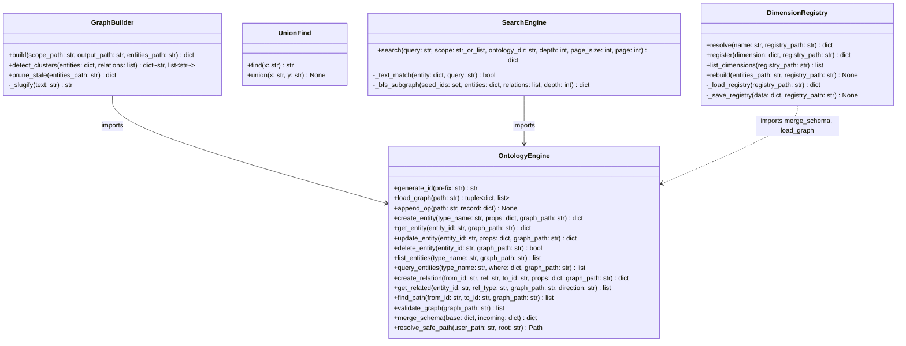
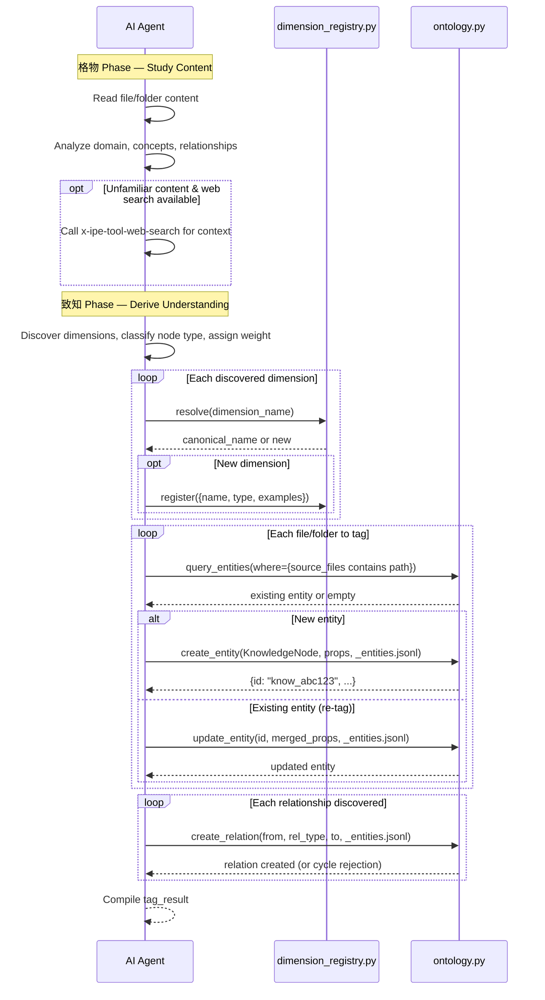
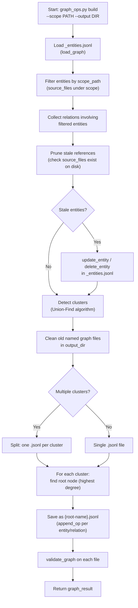
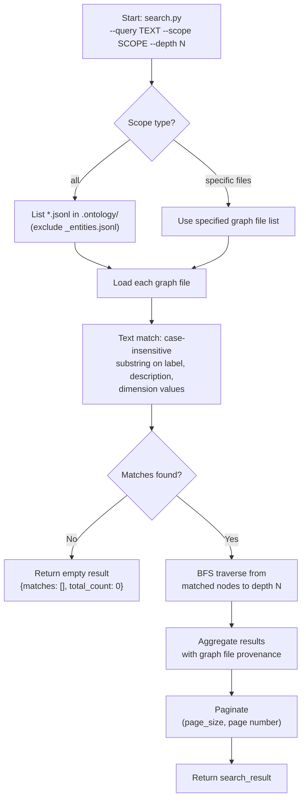

# Technical Design: Ontology Tool Skill (x-ipe-tool-ontology)

> Feature ID: FEATURE-058-A | Version: v1.0 | Last Updated: 2026-04-08

---

## Part 1: Agent-Facing Summary

> **Purpose:** Quick reference for AI agents navigating large projects.
> **📌 AI Coders:** Focus on this section for implementation context.

### Key Components Implemented

| Component | Responsibility | Scope/Impact | Tags |
|-----------|----------------|--------------|------|
| `SKILL.md` | Skill definition — 3 operations (tag, build_graph, search) orchestrated by AI agent | Entry point for all ontology operations | #ontology #skill #tool #kb |
| `ontology.py` | Core entity engine — CRUD, relations, JSONL event sourcing, validation, ID generation | Foundation module imported by all other scripts | #ontology #engine #crud #jsonl #entity #relation |
| `graph_ops.py` | Graph building — cluster detection (Union-Find), auto-split, stale pruning, full rebuild | Transforms master entity store into named knowledge graphs | #ontology #graph #cluster #split #prune |
| `search.py` | Search — text matching, BFS traversal, cross-graph search, pagination | Knowledge discovery across multiple graph files | #ontology #search #bfs #discovery #pagination |
| `dimension_registry.py` | Dimension registry — alias resolution, registration, schema evolution, rebuild | Maintains canonical dimension taxonomy with thread-safe access | #ontology #dimension #registry #taxonomy #alias |

### Dependencies

| Dependency | Source | Design Link | Usage Description |
|------------|--------|-------------|-------------------|
| `ontology-1.0.4` | Research | [ontology.py](x-ipe-docs/ideas/103. Research-Ontology/ontology-1.0.4/scripts/ontology.py) | Design blueprint — API patterns referenced, NOT imported or copied |
| `x-ipe-tool-web-search` | Optional | N/A | Optional web research during 格物 phase for unfamiliar content |
| `x-ipe-tool-kb-librarian` | FEATURE-058-D | [SKILL.md](.github/skills/x-ipe-tool-kb-librarian/SKILL.md) | Downstream consumer — calls ontology skill during intake processing |
| Python 3.10+ | System | N/A | Runtime for all scripts (stdlib only — no external packages) |

### Major Flow

1. **Tag (Operation A):** AI agent reads content (格物) → discovers dimensions & classifies nodes (致知) → resolves aliases via `dimension_registry.py` → creates entities/relations via `ontology.py` → appends to `_entities.jsonl`
2. **Build Graph (Operation B):** `graph_ops.py` loads entities from `_entities.jsonl` → filters by scope path → prunes stale references → detects clusters (Union-Find) → saves per-cluster JSONL files to `.ontology/`
3. **Search (Operation C):** `search.py` loads named graph files → text-matches query against labels/descriptions/dimensions → BFS-traverses matched nodes → aggregates results with graph provenance → paginates

### Usage Example

```bash
# Operation A: Tag a KB folder (AI agent orchestrates 格物→致知, then calls scripts)

# Step 1: Resolve dimension alias
python3 .github/skills/x-ipe-tool-ontology/scripts/dimension_registry.py resolve \
  --name "tech-stack" \
  --registry x-ipe-docs/knowledge-base/.ontology/.dimension-registry.json
# → {"canonical": "technology", "dimension": {"type": "multi-value", "examples": [...], "aliases": ["tech-stack"]}}

# Step 2: Create entity
python3 .github/skills/x-ipe-tool-ontology/scripts/ontology.py create \
  --type KnowledgeNode \
  --props '{"label":"JWT Auth Patterns","node_type":"concept","description":"Authentication patterns using JSON Web Tokens...","dimensions":{"technology":["JWT","OAuth2"],"domain":["security","backend"],"abstraction":"pattern"},"source_files":["x-ipe-docs/knowledge-base/security/jwt-auth.md"],"weight":7}' \
  --graph x-ipe-docs/knowledge-base/.ontology/_entities.jsonl
# → {"id": "know_abc123de", "type": "KnowledgeNode", ...}

# Step 3: Create relation
python3 .github/skills/x-ipe-tool-ontology/scripts/ontology.py relate \
  --from know_abc123de --rel depends_on --to know_xyz789ab \
  --graph x-ipe-docs/knowledge-base/.ontology/_entities.jsonl
# → {"from": "know_abc123de", "rel": "depends_on", "to": "know_xyz789ab"}

# Operation B: Build graphs from tagged entities
python3 .github/skills/x-ipe-tool-ontology/scripts/graph_ops.py build \
  --scope x-ipe-docs/knowledge-base/ \
  --output x-ipe-docs/knowledge-base/.ontology/
# → {"graphs_created": [{"file": "authentication.jsonl", "nodes": 12, "edges": 18}], ...}

# Operation C: Search across all graphs
python3 .github/skills/x-ipe-tool-ontology/scripts/search.py \
  --query "authentication" --scope all --ontology-dir x-ipe-docs/knowledge-base/.ontology/ --depth 3
# → {"matches": [...], "subgraph": {"nodes": [...], "edges": [...]}, "total_count": 5}
```

---

## Part 2: Implementation Guide

> **Purpose:** Human-readable details for developers.
> **📌 Emphasis on visual diagrams for comprehension.**

### Architecture Overview

```
.github/skills/x-ipe-tool-ontology/
├── SKILL.md                          # Skill definition (3 operations)
├── scripts/
│   ├── ontology.py                   # Core entity engine (~450 lines)
│   ├── graph_ops.py                  # Graph building & cluster ops (~250 lines)
│   ├── search.py                     # Text + BFS search (~200 lines)
│   └── dimension_registry.py         # Dimension registry management (~150 lines)
└── references/
    └── dimension-guidelines.md       # Dimension naming guidance for AI agents

x-ipe-docs/knowledge-base/.ontology/  # Runtime data folder (created on first use)
├── .dimension-registry.json          # Dimension taxonomy (aliases, types, examples)
├── _entities.jsonl                   # Master entity store (append-only, source of truth)
├── {cluster-root-name}.jsonl         # Named graph files (generated by graph_ops.py)
└── ...
```

**Storage Architecture — Master Entity Store Pattern:**

The `_entities.jsonl` file is the single source of truth for all entities and relations. Named graph files (e.g., `authentication.jsonl`) are derived views generated by `graph_ops.py build`. This pattern ensures:
- Entity CRUD always targets one file (simple, no scatter)
- Graph recreation is always a full rebuild from master store (BR-6)
- Named graphs can be regenerated at any time without data loss

### Class Diagram



### Workflow Diagrams

#### Operation A: Knowledge Tagging (AI Agent-Driven)



#### Operation B: Graph Creation (Automated)



#### Operation C: Knowledge Search (Automated)



### Data Models

#### KnowledgeNode Entity

```json
{
    "id": "know_abc123de",
    "type": "KnowledgeNode",
    "properties": {
        "label": "JWT Authentication Patterns",
        "node_type": "concept",
        "description": "Authentication patterns using JSON Web Tokens for stateless API auth...",
        "dimensions": {
            "technology": ["JWT", "OAuth2"],
            "domain": ["security", "backend"],
            "abstraction": "pattern",
            "audience": ["developers"]
        },
        "source_files": [
            "x-ipe-docs/knowledge-base/security/jwt-auth.md"
        ],
        "weight": 7
    },
    "created": "2026-04-08T10:30:00+00:00",
    "updated": "2026-04-08T10:30:00+00:00"
}
```

**Property Rules:**

| Property | Type | Required | Constraints |
|----------|------|----------|-------------|
| `label` | string | ✅ | Human-readable name for the knowledge node |
| `node_type` | string | ✅ | One of: `concept`, `entity`, `document` |
| `description` | string | ❌ | Brief summary of the knowledge content |
| `dimensions` | object | ❌ | Keys are canonical dimension names; values are string or string[] |
| `source_files` | string[] | ✅ | Project-root-relative paths to source files |
| `weight` | number | ❌ | 1-10 (AI-assigned importance; default: 5) |

#### Relation Types

```python
ALLOWED_RELATIONS = {
    "related_to",     # bidirectional topical overlap
    "depends_on",     # acyclic — understanding one requires the other
    "is_type_of",     # taxonomy/classification hierarchy
    "part_of",        # composition — component of a larger topic
    "described_by",   # explanatory — one provides detail for the other
}

ACYCLIC_RELATIONS = {"depends_on"}  # DFS cycle detection applied
```

**Relation stored in JSONL as:**

```json
{
    "from": "know_abc123de",
    "rel": "depends_on",
    "to": "know_xyz789ab",
    "properties": {}
}
```

#### JSONL Event Format (Append-Only)

```jsonl
{"op":"create","entity":{"id":"know_abc123","type":"KnowledgeNode","properties":{...},"created":"2026-04-08T10:30:00+00:00","updated":"2026-04-08T10:30:00+00:00"},"timestamp":"2026-04-08T10:30:00+00:00"}
{"op":"update","id":"know_abc123","properties":{"weight":8,"description":"Updated..."},"timestamp":"2026-04-08T10:31:00+00:00"}
{"op":"relate","from":"know_abc123","rel":"depends_on","to":"know_def456","properties":{},"timestamp":"2026-04-08T10:32:00+00:00"}
{"op":"unrelate","from":"know_abc123","rel":"depends_on","to":"know_def456","timestamp":"2026-04-08T10:33:00+00:00"}
{"op":"delete","id":"know_abc123","timestamp":"2026-04-08T10:34:00+00:00"}
```

**Replay rules:** Lines are replayed sequentially. `create` initializes entity. `update` merges properties. `delete` removes entity. `relate`/`unrelate` add/remove edges. Partial last lines (crash recovery) are skipped with a warning.

#### Dimension Registry Format

```json
{
    "version": "1.0",
    "dimensions": {
        "technology": {
            "type": "multi-value",
            "examples": ["Python", "JavaScript", "JWT", "OAuth2"],
            "aliases": ["tech", "technologies", "tech-stack"]
        },
        "domain": {
            "type": "multi-value",
            "examples": ["security", "backend", "frontend"],
            "aliases": ["area", "field"]
        },
        "abstraction": {
            "type": "single-value",
            "examples": ["pattern", "implementation", "specification"],
            "aliases": ["abstraction-level"]
        },
        "audience": {
            "type": "multi-value",
            "examples": ["developers", "architects", "beginners"],
            "aliases": ["target-audience", "who"]
        }
    }
}
```

### Module Specifications

#### Module 1: `ontology.py` (~450 lines)

**Purpose:** Core entity engine — CRUD operations, relations, JSONL event sourcing, graph validation, ID generation. Inspired by ontology-1.0.4 but purpose-built for KB context.

**Key Design Decisions:**
- Entity ID prefix: always `know_` + 8 hex chars (not type-based like ontology-1.0.4)
- Fixed entity type: `KnowledgeNode` only (no arbitrary types — YAGNI)
- Validation: hardcoded KB rules (not external YAML schema — KISS)
- Acyclicity: DFS-based cycle detection on `depends_on` relations only
- Thread safety: `fcntl.flock` for file write operations
- Error handling: JSON error output to stdout with exit code 1

**Public API (all functions — module level):**

| Function | Purpose |
|----------|---------|
| `generate_id(prefix="know")` | Generate `know_{uuid_hex[:8]}` entity ID |
| `resolve_safe_path(user_path, root, must_exist, label)` | Validate path within project root |
| `load_graph(path)` → `(entities_dict, relations_list)` | Replay JSONL events to current state |
| `append_op(path, record)` | Append JSON event line (creates parent dirs) |
| `create_entity(type_name, properties, graph_path, entity_id)` | Create entity with validation |
| `get_entity(entity_id, graph_path)` | Fetch entity by ID |
| `update_entity(entity_id, properties, graph_path)` | Merge properties into existing entity |
| `delete_entity(entity_id, graph_path)` | Soft delete (append delete event) |
| `list_entities(type_name, graph_path)` | List all entities, optionally filtered by type |
| `query_entities(type_name, where, graph_path)` | Filter entities by type + property predicates |
| `create_relation(from_id, rel_type, to_id, properties, graph_path)` | Create relation with cycle check |
| `get_related(entity_id, rel_type, graph_path, direction)` | Get related entities (outgoing/incoming/both) |
| `find_path(from_id, to_id, graph_path)` | BFS shortest path between two entities |
| `validate_graph(graph_path)` | Validate KB constraints; return error list |
| `merge_schema(base, incoming)` | Deep-merge two dicts (dedup lists) |

**CLI Interface:**

```bash
python3 ontology.py create --type KnowledgeNode --props JSON --graph PATH
python3 ontology.py get --id ID --graph PATH
python3 ontology.py update --id ID --props JSON --graph PATH
python3 ontology.py delete --id ID --graph PATH
python3 ontology.py list [--type TYPE] --graph PATH
python3 ontology.py query --type TYPE --where JSON --graph PATH
python3 ontology.py relate --from ID --rel TYPE --to ID [--props JSON] --graph PATH
python3 ontology.py related --id ID [--rel TYPE] [--dir outgoing|incoming|both] --graph PATH
python3 ontology.py find-path --from ID --to ID --graph PATH
python3 ontology.py validate --graph PATH
python3 ontology.py load --graph PATH
```

**Validation Rules (Hardcoded):**
- Required properties: `label`, `node_type`, `source_files`
- Valid `node_type`: `concept`, `entity`, `document`
- Valid relation types: `related_to`, `depends_on`, `is_type_of`, `part_of`, `described_by`
- `depends_on` must be acyclic (DFS cycle check before appending)
- `weight` range: 1-10 (if provided; default 5)
- Entity ID must match `know_[a-f0-9]{8}` pattern

#### Module 2: `graph_ops.py` (~250 lines)

**Purpose:** Graph construction from master entity store, cluster detection, auto-split, stale reference pruning.

**Key Design Decisions:**
- Cluster detection: Union-Find algorithm — O(n·α(n)), near-linear
- Root node: entity with highest degree (most edges) within each cluster
- Full rebuild: always regenerate from `_entities.jsonl` (never incremental — BR-6)
- Stale pruning: check each `source_files` path exists on disk; update/delete accordingly
- Clean before rebuild: remove existing named `.jsonl` graphs in output dir before creating new ones (prevent orphaned files); never removes `_entities.jsonl` or `.dimension-registry.json`

**CLI Interface:**

```bash
python3 graph_ops.py build --scope PATH --output PATH [--entities PATH]
python3 graph_ops.py prune --entities PATH
```

**Build Flow:**
1. Load `_entities.jsonl` → all entities and relations
2. Filter entities whose `source_files` contain paths under `scope_path`
3. Collect relations where both `from` and `to` are in filtered set
4. Run `prune_stale()` — check file existence, update/delete entities
5. Run `detect_clusters()` — Union-Find connected components
6. Clean old named `.jsonl` files in output dir
7. For each cluster: find root node (highest degree), save as `{root-label-slugified}.jsonl`
8. Run `validate_graph()` on each output file
9. Output JSON summary

#### Module 3: `search.py` (~200 lines)

**Purpose:** Text matching, BFS subgraph extraction, cross-graph search with pagination.

**Key Design Decisions:**
- Text matching: case-insensitive substring match on `label`, `description`, and all `dimensions` values
- BFS default depth: 3 (configurable via `--depth`)
- Cross-graph: load each named graph file independently, merge results with provenance (which `.jsonl` file)
- Scope `"all"`: list all `.jsonl` files in `.ontology/` excluding `_entities.jsonl`
- Pagination: offset-based, default page_size=20

**CLI Interface:**

```bash
python3 search.py --query TEXT --scope all|FILE[,FILE,...] --ontology-dir PATH [--depth N] [--page-size N] [--page N]
```

**Output Format:**

```json
{
    "matches": [
        {
            "entity": {"id": "know_abc123", "properties": {...}},
            "score": 1.0,
            "provenance": "authentication.jsonl",
            "match_fields": ["label", "dimensions.technology"]
        }
    ],
    "subgraph": {
        "nodes": ["know_abc123", "know_def456"],
        "edges": [{"from": "know_abc123", "rel": "depends_on", "to": "know_def456"}]
    },
    "total_count": 5,
    "page": 1,
    "page_size": 20
}
```

#### Module 4: `dimension_registry.py` (~150 lines)

**Purpose:** Dimension taxonomy management — alias resolution, registration, listing, recovery rebuild.

**Key Design Decisions:**
- File locking: `fcntl.flock` for concurrent access safety (per concurrency memory)
- Auto-create: create `.dimension-registry.json` on first `resolve`/`register` call if missing
- Alias resolution: check all dimensions' `aliases` arrays for match → return canonical name
- Rebuild: reconstruct registry from all entities' `dimensions` in `_entities.jsonl` (corruption recovery)
- Merge: `merge_schema()` from `ontology.py` for deep merging examples/aliases

**CLI Interface:**

```bash
python3 dimension_registry.py resolve --name NAME --registry PATH
python3 dimension_registry.py register --dimension JSON --registry PATH
python3 dimension_registry.py list --registry PATH
python3 dimension_registry.py rebuild --entities PATH --registry PATH
```

**Resolve Output:**

```json
{"canonical": "technology", "dimension": {"type": "multi-value", "examples": ["Python"], "aliases": ["tech-stack"]}}
```

```json
{"canonical": null, "candidates": ["technology", "domain"]}
```

### SKILL.md Operations Contract

The SKILL.md defines the AI agent's interaction protocol for each operation:

| Operation | Agent Role | Script Calls | Input | Output |
|-----------|-----------|-------------|-------|--------|
| `tag` | AI does 格物→致知 content analysis, then calls scripts for data ops | `dimension_registry.py resolve/register` → `ontology.py create/update/relate` | File or folder path | `tag_result` with entity IDs, dimensions, relations |
| `build_graph` | Agent invokes single automated script | `graph_ops.py build` | Scope path, output dir | `graph_result` with created graph files |
| `search` | Agent invokes single automated script | `search.py` | Query, scope, depth | `search_result` with matches, subgraph, provenance |

**Tag Result Output Format (AC-058A-07):**

```json
{
    "entities_created": [
        {"id": "know_abc123de", "label": "JWT Auth Patterns", "node_type": "concept"}
    ],
    "entities_updated": [
        {"id": "know_xyz789ab", "label": "OAuth2 Spec", "changes": ["dimensions.technology", "description"]}
    ],
    "dimensions_discovered": ["technology", "audience"],
    "relations_created": [
        {"from": "know_abc123de", "rel": "depends_on", "to": "know_xyz789ab"}
    ],
    "per_file_status": [
        {"file": "security/jwt-auth.md", "status": "created", "entity_id": "know_abc123de"},
        {"file": "security/oauth2-spec.md", "status": "updated", "entity_id": "know_xyz789ab"},
        {"file": "security/empty.md", "status": "error", "entity_id": null, "error": "File is empty"}
    ]
}
```

The AI agent compiles this result after all script calls complete. Partial failures (per-file errors) do not block other files — each file is processed independently (AC-058A-07c).

**Key SKILL.md Sections:**
- **Operation A instructions** must detail the 格物→致知 methodology: read content → analyze deeply → discover dimensions → classify node type → assign weight → create entities → discover relations
- **Folder vs file decision logic:** If all files in a folder share the same topic → create one folder-level node; if diverse → create per-file nodes
- **Relation discovery guidance:** Instructions for identifying which of the 5 relation types applies based on content relationships
- **Error handling:** Each operation guards preconditions (e.g., "No entities found — run tag first" for build_graph on empty scope)

### Edge Cases & Error Handling

| Scenario | Expected Behavior |
|----------|-------------------|
| Empty folder (no files to tag) | Return empty result: `{entities_created: [], dimensions_discovered: []}` |
| File with no discernible topic | Create node with `node_type: "document"`, label from filename, minimal dimensions |
| Duplicate tagging of same file | `query_entities()` finds existing → `update_entity()` merges dimensions, refreshes description |
| File deleted between tag and graph build | `prune_stale()` detects → delete entity if no valid `source_files` remain |
| `.dimension-registry.json` corrupted | `rebuild()` reconstructs from entities' dimensions; logs warning |
| All nodes disconnected (no edges) | Each node → single-node cluster → individual `.jsonl` file |
| Circular `depends_on` detected | `create_relation()` rejects with error; all other relations proceed |
| Cross-graph search with no matches | Return `{matches: [], subgraph: {nodes: [], edges: []}, total_count: 0}` |
| JSONL partial/corrupted last line | `load_graph()` skips invalid line; logs warning |
| Graph path doesn't exist yet | `load_graph()` returns empty state; `append_op()` creates file + parent dirs on first write |
| Concurrent dimension registry writes | `fcntl.flock` ensures exclusive file access |
| `build` with existing named graphs | Old `.jsonl` files cleaned before writing new clusters |
| Path traversal attack in user path | `resolve_safe_path()` rejects paths outside project root |

### Implementation Steps

1. **`ontology.py`** — Core engine (build first — all other modules depend on it)
   - Implement `generate_id()`, `resolve_safe_path()`
   - Implement JSONL I/O: `append_op()`, `load_graph()` with crash recovery
   - Implement entity CRUD: `create_entity()` through `query_entities()`
   - Implement relations: `create_relation()` with DFS cycle detection, `get_related()`, `find_path()`
   - Implement validation: `validate_graph()` with hardcoded KB rules
   - Implement utility: `merge_schema()`
   - Implement CLI with argparse (subcommands)
   - Unit tests for each operation

2. **`dimension_registry.py`** — Dimension management
   - Implement registry I/O with `fcntl.flock`
   - Implement `resolve()` — alias lookup → canonical name
   - Implement `register()` — add/merge new dimension
   - Implement `list_all()`, `rebuild()`
   - Implement CLI with argparse
   - Unit tests for alias resolution, concurrent access

3. **`graph_ops.py`** — Graph building
   - Implement Union-Find for cluster detection
   - Implement `prune_stale()` — file existence checks
   - Implement `build()` — full pipeline: load → filter → prune → cluster → clean → save → validate
   - Implement root node selection (highest degree)
   - Implement CLI with argparse
   - Unit tests for cluster detection, stale pruning, root selection

4. **`search.py`** — Search engine
   - Implement `text_match()` — case-insensitive on label, description, dimensions
   - Implement `bfs_subgraph()` — BFS from matched nodes
   - Implement `search()` — cross-graph orchestration with provenance
   - Implement pagination
   - Implement CLI with argparse
   - Unit tests for search, BFS traversal, pagination, multi-graph

5. **`SKILL.md`** — Skill definition
   - Define 3 operations with full input/output contracts
   - Write 格物→致知 methodology instructions for AI agent
   - Document folder-vs-file decision logic
   - Document relation type selection guidance
   - Add dimension naming guidelines in `references/dimension-guidelines.md`

---

## Design Change Log

| Date | Phase | Change Summary |
|------|-------|----------------|
| 2026-04-08 | Initial Design | Initial technical design for FEATURE-058-A. Designed 4-module architecture (ontology.py, graph_ops.py, search.py, dimension_registry.py) with master entity store pattern (_entities.jsonl) and named graph derived views. All Python stdlib — no external dependencies. |
