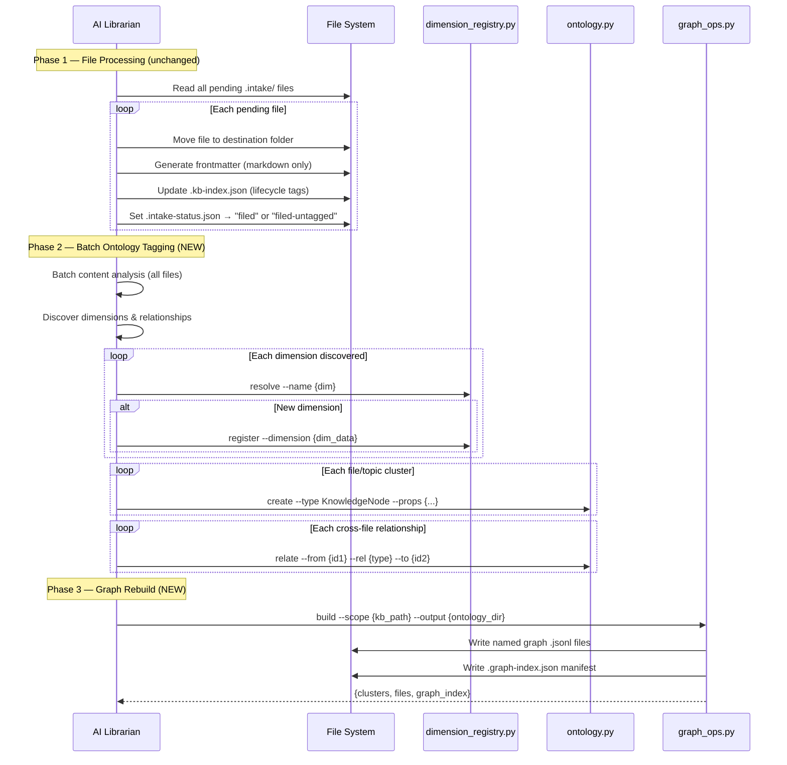
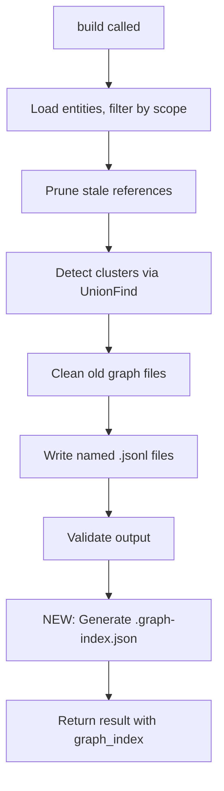
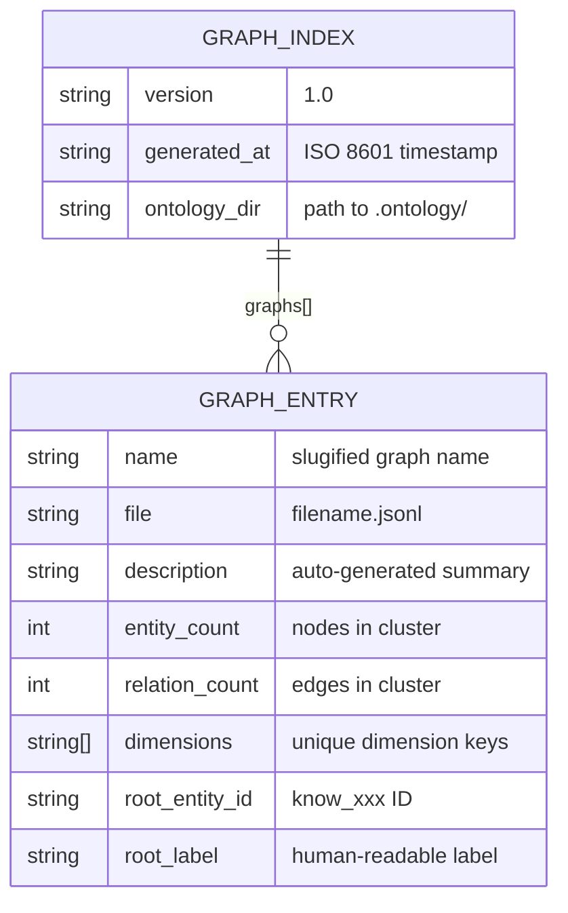

# Technical Design: KB Librarian Ontology Integration

> Feature ID: FEATURE-058-D | Version: v1.0 | Last Updated: 2026-04-08

---

## Part 1: Agent-Facing Summary

> **Purpose:** Quick reference for AI agents navigating large projects.
> **📌 AI Coders:** Focus on this section for implementation context.

### Technical Scope

- [x] Backend (Python CLI scripts)
- [ ] Frontend
- [ ] Full Stack

### Key Components Implemented

| Component | Responsibility | Scope/Impact | Tags |
|-----------|----------------|--------------|------|
| `graph_ops.py` (modified) | Add `.graph-index.json` manifest generation to `build()` | Graph build output | #ontology #graph #manifest |
| `ontology.py` (modified) | Add `retag` CLI subcommand | Entity re-tagging workflow | #ontology #cli #retag |
| `x-ipe-tool-kb-librarian/SKILL.md` (modified) | Update organize_intake with ontology tagging steps, skill contract | AI agent instructions | #librarian #skill #integration |

### Dependencies

| Dependency | Source | Design Link | Usage Description |
|------------|--------|-------------|-------------------|
| `ontology.py` | FEATURE-058-A | [technical-design.md](x-ipe-docs/requirements/EPIC-058/FEATURE-058-A/technical-design.md) | Entity CRUD, relation management, graph validation |
| `dimension_registry.py` | FEATURE-058-A | [technical-design.md](x-ipe-docs/requirements/EPIC-058/FEATURE-058-A/technical-design.md) | Dimension alias resolution and registration |
| `graph_ops.py` | FEATURE-058-A | [technical-design.md](x-ipe-docs/requirements/EPIC-058/FEATURE-058-A/technical-design.md) | Graph clustering and named file generation |
| `kb_set_entry.py` | Foundation | N/A | Metadata index entry management in `.kb-index.json` |

### Major Flow

1. AI Librarian reads all pending `.intake/` files → batch content analysis
2. For each file: move to destination, assign lifecycle tags to `.kb-index.json` (unchanged)
3. **NEW:** Batch ontology tagging — discover dimensions, create `KnowledgeNode` entities, create inter-file relations
4. **NEW:** If tagging fails for a file → mark `filed-untagged` in `.intake-status.json`
5. **NEW:** After batch completes → trigger `graph_ops.py build` for affected scope → generate `.graph-index.json`
6. Print terminal summary with tagging counts

### Usage Example

```bash
# Ontology tagging is triggered automatically during organize_intake.
# The AI Librarian follows SKILL.md instructions which now include:

# Step 1: Dimension resolution
python3 .github/skills/x-ipe-tool-ontology/scripts/dimension_registry.py resolve \
  --name "technology" \
  --registry x-ipe-docs/knowledge-base/.ontology/.dimension-registry.json

# Step 2: Entity creation
python3 .github/skills/x-ipe-tool-ontology/scripts/ontology.py create \
  --type KnowledgeNode \
  --props '{"label":"JWT Auth","node_type":"concept","source_files":["x-ipe-docs/knowledge-base/security/jwt-auth.md"],"dimensions":{"technology":["JWT","Python"],"domain":["security"]},"weight":7}' \
  --graph x-ipe-docs/knowledge-base/.ontology/_entities.jsonl

# Step 3: Relation creation
python3 .github/skills/x-ipe-tool-ontology/scripts/ontology.py relate \
  --from know_a1b2c3d4 --rel depends_on --to know_e5f6g7h8 \
  --graph x-ipe-docs/knowledge-base/.ontology/_entities.jsonl

# Step 4: Graph rebuild (after batch)
python3 .github/skills/x-ipe-tool-ontology/scripts/graph_ops.py build \
  --scope x-ipe-docs/knowledge-base/ \
  --output x-ipe-docs/knowledge-base/.ontology/ \
  --entities x-ipe-docs/knowledge-base/.ontology/_entities.jsonl

# Manual re-tag (for filed-untagged files)
python3 .github/skills/x-ipe-tool-ontology/scripts/ontology.py retag \
  --scope x-ipe-docs/knowledge-base/ \
  --ontology-dir x-ipe-docs/knowledge-base/.ontology/ \
  --intake-status x-ipe-docs/knowledge-base/.intake/.intake-status.json
```

---

## Part 2: Implementation Guide

> **Purpose:** Human-readable details for developers.
> **📌 Emphasis on visual diagrams for comprehension.**

### Workflow Diagram



### Component Changes

#### 1. `graph_ops.py` — Add `.graph-index.json` Generation

**Change scope:** Modify `build()` function to generate `.graph-index.json` after writing graph files.



**`.graph-index.json` schema:**

```json
{
  "version": "1.0",
  "generated_at": "2026-04-08T10:00:00+00:00",
  "ontology_dir": "x-ipe-docs/knowledge-base/.ontology/",
  "graphs": [
    {
      "name": "jwt-authentication",
      "file": "jwt-authentication.jsonl",
      "description": "Knowledge graph covering JWT authentication patterns, token management, and related security concepts",
      "entity_count": 12,
      "relation_count": 8,
      "dimensions": ["technology", "domain", "abstraction"],
      "root_entity_id": "know_a1b2c3d4",
      "root_label": "JWT Authentication"
    }
  ]
}
```

**Implementation details:**

- The `description` field is auto-generated from the root entity's label + connected entity labels (concatenated into a brief summary sentence).
- The `dimensions` field is the unique set of dimension keys across all entities in that cluster.
- The manifest is written atomically (write to temp file, then rename) to prevent corruption.
- The manifest is regenerated in full on every build (not incremental) — consistent with BR-5.

**New private function:**

```python
def _generate_graph_index(
    output_path: str,
    cluster_files: list[dict],
    entities: dict,
    relations: list,
) -> dict:
    """Generate .graph-index.json manifest from build results."""
```

Parameters:
- `output_path`: Directory containing graph files (`.ontology/`)
- `cluster_files`: List of `{"file", "root", "root_label", "entity_count", "relation_count"}` from build
- `entities`: Full entity dict (reserved for future use; current implementation reads cluster data from disk)
- `relations`: Full relations list (reserved for future use; current implementation reads from disk)

Returns: The manifest dict (also written to `{output_path}/.graph-index.json`)

#### 2. `ontology.py` — Add `retag` Subcommand

**Change scope:** Add a new argparse subcommand to the existing CLI.

```
python3 ontology.py retag \
  --scope PATH \
  --ontology-dir PATH \
  --intake-status PATH
```

**Arguments:**

| Arg | Required | Description |
|-----|----------|-------------|
| `--scope` | Yes | KB folder path to scan for untagged files |
| `--ontology-dir` | Yes | Path to `.ontology/` directory |
| `--intake-status` | Yes | Path to `.intake-status.json` |

**Behavior:**

1. Read `.intake-status.json`
2. Filter entries where `status == "filed-untagged"` AND `destination` starts with `--scope`
3. If none found → output `{"retagged": 0, "files": []}` and exit 0
4. For each untagged file:
   a. Verify file exists at `destination` path
   b. Create `KnowledgeNode` entity (or update if entity with matching `source_files` already exists)
   c. If successful → update status to `"filed"` in `.intake-status.json`
   d. If failed → keep as `"filed-untagged"`, add to errors list
5. Output result:

```json
{
  "retagged": 3,
  "failed": 1,
  "files": [
    {"file": "jwt-auth.md", "entity_id": "know_a1b2c3d4", "status": "tagged"},
    {"file": "broken.md", "status": "failed", "error": "File not found"}
  ]
}
```

**Important:** The `retag` subcommand does NOT perform batch content analysis or graph rebuild — those are the AI agent's responsibility. The subcommand handles entity creation and status updates. The AI agent reads file content, discovers dimensions, and decides relations before calling `retag` or the individual `create`/`relate` commands. However, `retag` provides a convenience mode: it reads the file, creates a minimal entity with `label` derived from filename and `source_files` set to the file path. The AI agent can then `update` the entity with richer properties after deeper analysis.

#### 3. `x-ipe-tool-kb-librarian/SKILL.md` — Integration Updates

**Changes to organize_intake operation:**

The SKILL.md is an AI agent instruction document. The changes add new steps to the existing `organize_intake` operation:

**A. New Skill Contract Section** (add after Skill Details):

```markdown
## Skill Dependencies

### Ontology Tool Contract

| Aspect | Detail |
|--------|--------|
| Skill | `x-ipe-tool-ontology` |
| Reads | `KnowledgeNode` entities from `_entities.jsonl` |
| Writes | `KnowledgeNode` entities, relations, dimension registry |
| Preconditions | Files exist in intake folder or KB folder |
| Postconditions | All successfully processed files have `KnowledgeNode` entities with dimensions |
| Graceful Degradation | If ontology tool fails, files are moved but marked `filed-untagged` |
```

**B. Updated organize_intake Steps** (modify existing step sequence):

After the existing per-file processing loop (move, frontmatter, lifecycle tags), add:

```markdown
### Phase 2: Ontology Tagging (batch)

4. **Batch Content Analysis:**
   - Read content of ALL newly filed files
   - Analyze domain concepts, relationships, topics across the batch
   - Discover tagging dimensions dynamically (not predefined)
   - Identify cross-file relationships (dependency, topical overlap, composition)

5. **Dimension Resolution & Entity Creation:**
   - For each discovered dimension: call `dimension_registry.py resolve` → `register` if new
   - For each file or topic cluster:
     - Folder-level: if all files share topic → single KnowledgeNode for folder
     - File-level: if diverse topics → individual KnowledgeNode per file
     - Call `ontology.py create` with full properties
   - For each cross-file relationship: call `ontology.py relate`
   - If ontology call fails for a file: update .intake-status.json → "filed-untagged", log error

6. **Graph Rebuild:**
   - Identify which graphs are affected (match source_files paths to existing graph scope)
   - Call `graph_ops.py build` with affected scope path
   - .graph-index.json is auto-generated by the build operation
```

**C. Updated Terminal Summary Format:**

```
"{N} files processed → {folder1}/ ({count1}), {folder2}/ ({count2}) | {tagged} tagged, {untagged} untagged"
```

**D. New `filed-untagged` Status:**

Add to the intake status values documentation:

| Status | Meaning |
|--------|---------|
| `pending` | File awaiting processing |
| `processing` | Currently being processed |
| `filed` | Moved to destination and ontology-tagged |
| `filed-untagged` | Moved to destination but ontology tagging failed |

### Data Model: `.graph-index.json`



### Data Model: `.intake-status.json` (extended)

```json
{
  "jwt-auth.md": {
    "status": "filed",
    "destination": "x-ipe-docs/knowledge-base/security/jwt-auth.md"
  },
  "broken-file.md": {
    "status": "filed-untagged",
    "destination": "x-ipe-docs/knowledge-base/misc/broken-file.md",
    "error": "ontology.py create failed: invalid node_type"
  }
}
```

The `error` field is added ONLY when status is `filed-untagged` — provides diagnostic info for the `retag` operation.

### Implementation Steps

#### Step 1: Extend `graph_ops.py` with `.graph-index.json`

1. Add `_generate_graph_index()` private function
2. Call it at the end of `build()` after writing cluster JSONL files
3. Write `.graph-index.json` to `output_path` using atomic write (temp + rename)
4. Include `graph_index` in the build return dict
5. Add tests for manifest generation, stale entry cleanup, empty graph case

**Files changed:**
- `.github/skills/x-ipe-tool-ontology/scripts/graph_ops.py`

#### Step 2: Add `retag` subcommand to `ontology.py`

1. Add `retag` subparser with `--scope`, `--ontology-dir`, `--intake-status` args
2. Implement `retag_files()` function:
   - Read `.intake-status.json`
   - Filter `filed-untagged` entries within scope
   - For each: create minimal entity or update existing
   - Update status to `filed` on success
   - Write updated `.intake-status.json` atomically
3. Add tests for retag (happy path, no untagged files, file not found, partial failure)

**Files changed:**
- `.github/skills/x-ipe-tool-ontology/scripts/ontology.py`

#### Step 3: Update KB Librarian SKILL.md

1. Add "Skill Dependencies" section with ontology contract
2. Add Phase 2 (ontology tagging) steps to organize_intake operation
3. Add `filed-untagged` status to intake status documentation
4. Update terminal summary format documentation
5. Add error handling instructions for ontology failures

**Files changed:**
- `.github/skills/x-ipe-tool-kb-librarian/SKILL.md`

### Edge Cases & Error Handling

| Scenario | Expected Behavior |
|----------|-------------------|
| Ontology script not found | Log structured error, mark file `filed-untagged`, continue |
| `_entities.jsonl` doesn't exist yet | First tagging creates it (ontology.py handles this) |
| `.dimension-registry.json` corrupt | Log error, create entities without dimension normalization |
| All files in batch fail tagging | All `filed-untagged`, skip graph rebuild, log batch summary |
| Graph rebuild fails | File statuses remain `filed` (not reverted), log graph error |
| `retag` called with non-existent intake-status | Exit with error JSON: `{"error": "intake-status file not found"}` |
| `retag` finds existing entity for file | Call `update` instead of `create` (check via `query --where source_files`) |
| `.graph-index.json` manually deleted | Regenerated on next `build` call |
| Empty cluster (all entities pruned) | No graph file written, no entry in `.graph-index.json` |

### File Layout After Integration

```
x-ipe-docs/knowledge-base/
├── .intake/
│   ├── .intake-status.json          # Extended with "filed-untagged" status
│   └── (pending files)
├── .ontology/
│   ├── _entities.jsonl              # Master entity store (unchanged)
│   ├── .dimension-registry.json     # Dimension taxonomy (unchanged)
│   ├── .graph-index.json            # NEW: Graph manifest
│   ├── jwt-authentication.jsonl     # Named graph (unchanged)
│   └── python-patterns.jsonl        # Named graph (unchanged)
├── security/
│   ├── .kb-index.json               # Lifecycle metadata (unchanged)
│   └── jwt-auth.md                  # Filed KB content
└── patterns/
    ├── .kb-index.json
    └── python-patterns.md
```

---

## Design Change Log

| Date | Phase | Change Summary |
|------|-------|----------------|
| 2026-04-08 | Initial Design | Initial technical design for KB Librarian ontology integration |
