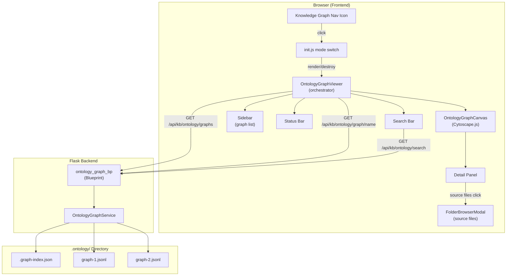
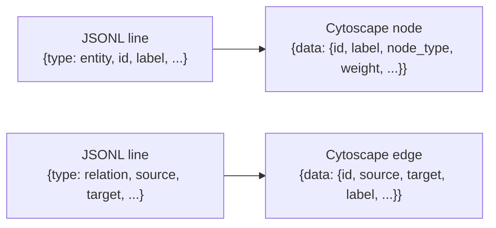
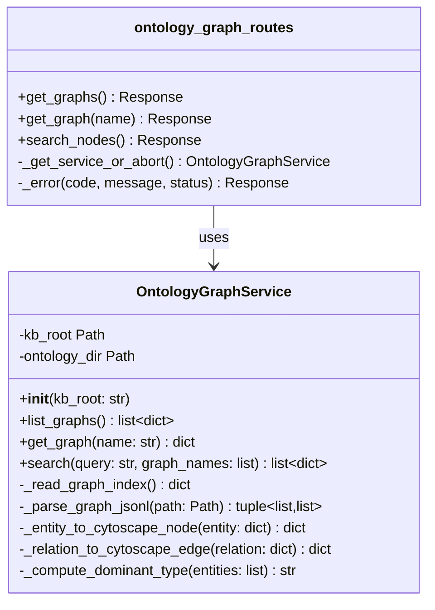
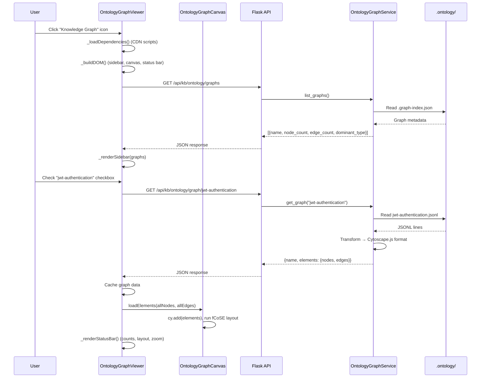
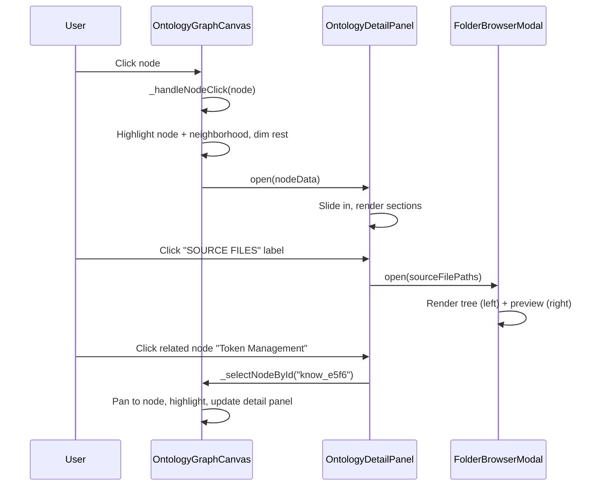
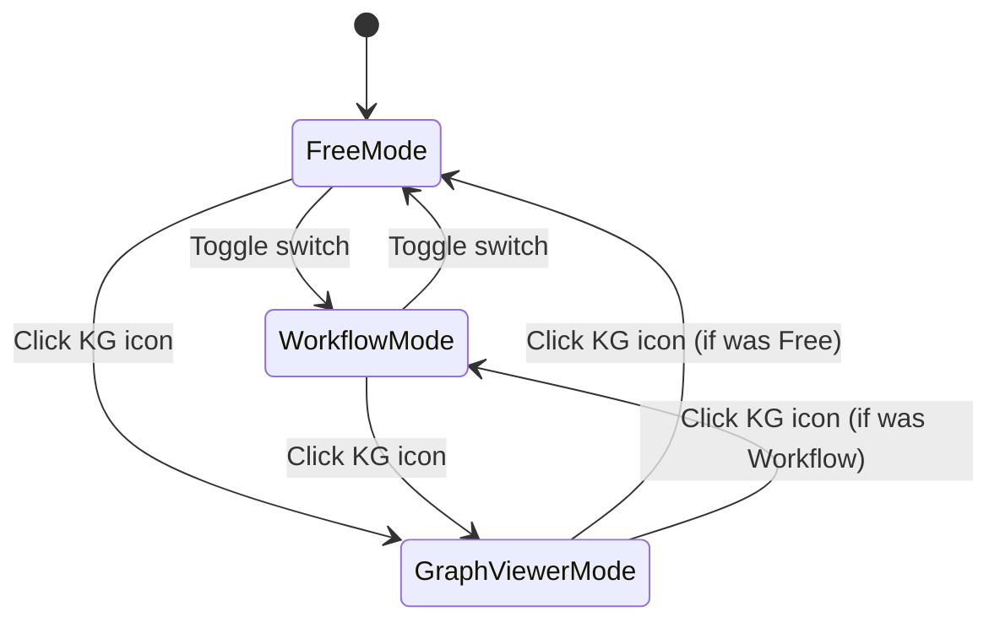

# Technical Design: Ontology Graph Viewer UI

> Feature ID: FEATURE-058-E | Version: v1.0 | Last Updated: 2026-04-09

## Version History

| Version | Date | Description |
|---------|------|-------------|
| v1.0 | 2026-04-09 | Initial technical design |

---

## Part 1: Agent-Facing Summary

> **Purpose:** Quick reference for AI agents navigating large projects.
> **📌 AI Coders:** Focus on this section for implementation context.

### Scope

**Program type:** fullstack
**Tech stack:** Python/Flask, JavaScript/Vanilla, HTML/CSS, Cytoscape.js (CDN)

This feature adds an interactive knowledge graph viewer to the X-IPE Flask application. It includes:
- **Backend:** A Flask blueprint with 3 API endpoints that read ontology graph data from `.ontology/` and transform it to Cytoscape.js JSON format.
- **Frontend:** A JavaScript-driven viewer with Cytoscape.js (5 plugins, CDN-loaded), a graph collection sidebar, a slide-out detail panel, and zoom/layout controls.
- **Integration:** A new nav icon in the header that switches the main content area to the graph viewer (same pattern as Workflow mode).

### Key Components Implemented

| Component | Responsibility | Scope/Impact | Tags |
|-----------|----------------|--------------|------|
| `ontology_graph_routes.py` | Flask blueprint with API endpoints for graph list, graph data, and search | Backend API layer — 3 GET endpoints under `/api/kb/ontology/` | #flask #api #ontology #backend |
| `ontology_graph_service.py` | Service class that reads `.ontology/` JSONL files, transforms to Cytoscape.js format, and performs text search | Data access and transformation layer | #service #jsonl #cytoscape #search |
| `ontology-graph-viewer.js` | Main orchestrator: mode switching, sidebar rendering, API calls, search, scope pills, status bar | Frontend entrypoint — coordinates all UI sub-components | #frontend #viewer #orchestrator |
| `ontology-graph-canvas.js` | Cytoscape.js instance management: rendering, layouts, context menus, tooltips, minimap, zoom, node interaction, detail panel | Graph visualization core — all Cytoscape.js integration | #cytoscape #canvas #layouts #interaction |
| `ontology-graph-viewer.css` | All styles for the graph viewer: sidebar, canvas, detail panel, status bar, modals | Visual presentation layer | #css #styling #ui |
| `index.html` (modified) | New "Knowledge Graph" nav icon in header menu bar | Navigation entry point | #nav #integration |
| `init.js` (modified) | Click handler for Knowledge Graph icon — mode switching logic | Mode transition management | #init #mode-switch |
| `app.py` (modified) | Register `ontology_graph_bp` blueprint | App startup integration | #flask #blueprint |

### Dependencies

| Dependency | Source | Design Link | Usage Description |
|------------|--------|-------------|-------------------|
| `graph_ops.py` | FEATURE-058-A | [technical-design.md](x-ipe-docs/requirements/EPIC-058/FEATURE-058-A/technical-design.md) | Produces `.ontology/` graph JSONL files and `.graph-index.json` manifest that the API reads |
| ~~`search.py`~~ | ~~FEATURE-058-A~~ | N/A | ~~Removed:~~ Search is self-contained in `OntologyGraphService._compute_relevance()` — no external dependency |
| KB Librarian | FEATURE-058-D | [technical-design.md](x-ipe-docs/requirements/EPIC-058/FEATURE-058-D/technical-design.md) | Triggers ontology tagging during `.intake/` processing, populating `.ontology/` |
| `kb_service.py` | Foundation | N/A | Provides `KB_ROOT_DIR` path and file reading utilities |
| ~~`FolderBrowserModal`~~ | ~~Foundation~~ | N/A | ~~Deferred:~~ Source file modal integration planned but not wired in v1.0 |
| `FilePreviewRenderer` | Foundation (CR-008) | N/A | Renders markdown/YAML/text in preview panels |
| Cytoscape.js 3.30.4 | CDN | [unpkg.com](https://unpkg.com/cytoscape@3.30.4/) | Core graph rendering library |
| layout-base 2.0.1 | CDN | [unpkg.com](https://unpkg.com/layout-base@2.0.1/) | Required by cose-base (fcose dependency chain) |
| cose-base 2.2.0 | CDN | [unpkg.com](https://unpkg.com/cose-base@2.2.0/) | Required by cytoscape-fcose (must load after layout-base) |
| cytoscape-fcose 2.2.0 | CDN | [unpkg.com](https://unpkg.com/cytoscape-fcose@2.2.0/) | Force-directed layout algorithm |
| cytoscape-dagre 2.5.0 + dagre 0.8.5 | CDN | [unpkg.com](https://unpkg.com/cytoscape-dagre@2.5.0/) | Hierarchical layout algorithm |
| cytoscape-cxtmenu 3.5.0 | CDN | [unpkg.com](https://unpkg.com/cytoscape-cxtmenu@3.5.0/) | Radial context menus |
| cytoscape-navigator 2.0.2 | CDN | [unpkg.com](https://unpkg.com/cytoscape-navigator@2.0.2/) | Minimap navigator (NOT v2.0.4 — returns 404) |
| tippy.js 6.3.7 + @popperjs/core 2.11.8 | CDN | [unpkg.com](https://unpkg.com/tippy.js@6.3.7/) | Rich tooltips on node hover |

### Major Flow

1. User clicks "Knowledge Graph" icon in header → `init.js` hides sidebar/header, calls `OntologyGraphViewer.render(container)`
2. Viewer calls `GET /api/kb/ontology/graphs` → Flask route calls `OntologyGraphService.list_graphs()` → reads `.graph-index.json` → returns graph list
3. Viewer renders sidebar with graph checkboxes → user selects graphs
4. For each selected graph, viewer calls `GET /api/kb/ontology/graph/<name>` → service reads `.jsonl`, transforms to Cytoscape.js elements → returns nodes + edges
5. Viewer passes elements to `OntologyGraphCanvas` → Cytoscape.js renders with fCoSE layout (default)
6. User interacts: click node → highlight neighborhood + open detail panel; switch layout → re-run algorithm; search → `GET /api/kb/ontology/search` → highlight matching nodes
7. User clicks KG icon again → `OntologyGraphViewer.destroy()`, restore previous mode

### Usage Example

```python
# Backend: API usage
from x_ipe.services.ontology_graph_service import OntologyGraphService

svc = OntologyGraphService(kb_root="/path/to/knowledge-base")
graphs = svc.list_graphs()
# [{"name": "jwt-authentication", "node_count": 12, "edge_count": 18, "dominant_type": "concept"}]

elements = svc.get_graph("jwt-authentication")
# {"name": "jwt-authentication", "elements": {"nodes": [{"data": {"id": "know_a1b2", "label": "JWT Auth", "node_type": "concept", ...}}],
#  "edges": [{"data": {"source": "know_a1b2", "target": "know_c3d4", "label": "depends_on"}}]}}

results = svc.search("authentication", graph_names=["jwt-authentication"])
# [{"node_id": "know_a1b2", "label": "JWT Auth", "graph": "jwt-authentication", "relevance": 1.0}]
```

```javascript
// Frontend: Viewer lifecycle
const viewer = new OntologyGraphViewer();
viewer.render(document.getElementById('content-body'));  // Enter graph mode
// ... user interacts ...
viewer.destroy();  // Exit graph mode, cleanup
```

### Post-Implementation Notes (v1.0)

> Added during feature closing to document critical implementation details discovered during acceptance testing.

**CDN Loading Chain:** Phase 1 loads cytoscape + dagre + @popperjs/core + `layout-base@2.0.1` in parallel. Phase 1b loads `cose-base@2.2.0` sequentially (depends on layout-base). Phase 2 loads fcose + dagre + cxtmenu + navigator + tippy.js in parallel. Phase 3 registers plugins with `cytoscape.use()`.

**Element Format:** The API returns `{nodes: [...], edges: [...]}` but Cytoscape.js `addElements()` expects a flat array. `_loadGraph()` flattens the response and tags each element with `_graph: name` data property for selective removal via `[_graph = "name"]` selector.

**Tooltips:** `node.popperRef()` requires the `cytoscape-popper` extension (not loaded). Tooltips use a manual approach: create a `position: fixed` dummy div at the node's `renderedPosition()`, pass it to `tippy()` with `showOnCreate: true`.

**Layout animations:** All three layouts run with `animate: false` for performance. fCoSE uses `nodeRepulsion: 8000`, `idealEdgeLength: 120`. Dagre uses `rankSep: 60`, `nodeSep: 40`. Concentric uses `minNodeSpacing: 60`.

**Deferred features (v1.0):** Source file browser modal (AC-058E-07), Pin/Unpin nodes (AC-058E-05f/g), Canvas context menu (AC-058E-05i), Keyboard shortcuts ESC/slash (AC-058E-06e/09d), Status bar zoom %/layout name (AC-058E-13c/d).

**Known limitation:** `dominant_type` in `list_graphs()` response always returns `'concept'` (stub implementation).

---

## Part 2: Implementation Guide

> **Purpose:** Human-readable details for developers.
> **📌 Emphasis on visual diagrams for comprehension.**

### Architecture Overview



### API Specification

#### GET /api/kb/ontology/graphs

List all available ontology graphs.

**Response (200):**
```json
{
  "graphs": [
    {
      "name": "jwt-authentication",
      "file_path": ".ontology/jwt-authentication.jsonl",
      "node_count": 12,
      "edge_count": 18,
      "dominant_type": "concept"
    }
  ]
}
```

**Response (404) — no .ontology/ folder:**
```json
{ "error": "ONTOLOGY_NOT_FOUND", "message": "No .ontology/ directory found in knowledge base" }
```

#### GET /api/kb/ontology/graph/\<name\>

Get Cytoscape.js-formatted elements for a specific graph.

**Response (200):**
```json
{
  "name": "jwt-authentication",
  "elements": {
    "nodes": [
      {
        "data": {
          "id": "know_a1b2c3d4",
          "label": "JWT Authentication",
          "node_type": "concept",
          "weight": 8,
          "description": "JSON Web Token authentication pattern...",
          "dimensions": {
            "topic": ["authentication", "security"],
            "abstraction": ["pattern"],
            "technology": ["Flask", "JWT"],
            "audience": ["developer"]
          },
          "source_files": ["security/jwt-guide.md", "api/auth-flow.md"],
          "metadata": {
            "connections": 5,
            "created": "2026-04-05",
            "updated": "2026-04-07"
          },
          "cluster": "cluster-0"
        }
      }
    ],
    "edges": [
      {
        "data": {
          "id": "e_know_a1b2c3d4_know_e5f6g7h8",
          "source": "know_a1b2c3d4",
          "target": "know_e5f6g7h8",
          "relation_type": "depends_on",
          "label": "depends_on"
        }
      }
    ]
  }
}
```

**Response (404):**
```json
{ "error": "GRAPH_NOT_FOUND", "message": "Graph 'unknown-graph' not found" }
```

#### GET /api/kb/ontology/search?q=\<query\>&graphs=\<comma-separated\>

Search nodes across selected graphs.

**Query Parameters:**
| Param | Required | Description |
|-------|----------|-------------|
| `q` | Yes | Search query (case-insensitive) |
| `graphs` | No | Comma-separated graph names to scope search. If omitted, searches all graphs. |

**Response (200):**
```json
{
  "results": [
    {
      "node_id": "know_a1b2c3d4",
      "label": "JWT Authentication",
      "graph": "jwt-authentication",
      "relevance": 1.0
    }
  ]
}
```

### Data Transformation: JSONL → Cytoscape.js

The `.ontology/*.jsonl` files contain event-sourced entity/relation data. Each line is a JSON object:

```
{"type": "entity", "id": "know_a1b2", "label": "JWT Auth", "node_type": "concept", "properties": {...}}
{"type": "relation", "source": "know_a1b2", "target": "know_c3d4", "relation_type": "depends_on"}
```

The service transforms these to Cytoscape.js element format:



**Entity → Node mapping:**
| JSONL Field | Cytoscape data Field |
|-------------|---------------------|
| `id` | `id` |
| `label` | `label` |
| `node_type` | `node_type` |
| `properties.weight` (or default 1) | `weight` |
| `properties.description` | `description` |
| `properties.dimensions` | `dimensions` |
| `properties.source_files` | `source_files` |
| cluster assignment (from graph name) | `cluster` |

**Relation → Edge mapping:**
| JSONL Field | Cytoscape data Field |
|-------------|---------------------|
| `source` + `_` + `target` | `id` (synthetic) |
| `source` | `source` |
| `target` | `target` |
| `relation_type` | `relation_type`, `label` |

### Frontend Component Architecture

```mermaid
classDiagram
    class OntologyGraphViewer {
        -container HTMLElement
        -canvas OntologyGraphCanvas
        -sidebarEl HTMLElement
        -statusBarEl HTMLElement
        -searchInput HTMLElement
        -selectedGraphs Set~string~
        -graphDataCache Map~string,Object~
        -searchDebounceTimer number
        +render(container) void
        +destroy() void
        -_loadDependencies() Promise
        -_buildDOM() void
        -_renderSidebar(graphs) void
        -_renderScopePills() void
        -_renderStatusBar() void
        -_handleGraphToggle(name, checked) void
        -_handleSelectAll(checked) void
        -_handleSearch(query) void
        -_updateCanvas() void
        -_fetchGraphList() Promise
        -_fetchGraphData(name) Promise
        -_fetchSearch(query, graphs) Promise
    }

    class OntologyGraphCanvas {
        -cy CytoscapeInstance
        -detailPanel OntologyDetailPanel
        -navigatorInstance Object
        -currentLayout string
        +init(container) void
        +loadElements(nodes, edges) void
        +setLayout(type) void
        +highlightNodes(ids) void
        +clearHighlight() void
        +getZoomPercent() number
        +getNodeCount() number
        +getEdgeCount() number
        +fitView() void
        +destroy() void
        -_createCytoscapeInstance(container) void
        -_setupStyles() Array
        -_setupNodeContextMenu() void
        -_setupCanvasContextMenu() void
        -_setupTooltips() void
        -_setupNavigator(navContainer) void
        -_setupZoomControls(zoomContainer) void
        -_handleNodeClick(node) void
        -_handleCanvasClick() void
        -_selectNodeById(id) void
    }

    class OntologyDetailPanel {
        -panelEl HTMLElement
        -isOpen boolean
        -currentNodeId string
        +open(nodeData) void
        +close() void
        -_buildPanelDOM() HTMLElement
        -_renderHeader(nodeData) void
        -_renderDescription(desc) void
        -_renderDimensions(dims) void
        -_renderSourceFiles(files) void
        -_renderRelatedNodes(related) void
        -_renderMetadata(meta) void
        -_handleSourceFilesClick(files) void
        -_handleRelatedNodeClick(nodeId) void
    }

    OntologyGraphViewer --> OntologyGraphCanvas : creates & manages
    OntologyGraphCanvas --> OntologyDetailPanel : creates & manages
    OntologyDetailPanel ..> FolderBrowserModal : opens on source files click
```



### Backend Class Diagram



### Workflow Sequence: Graph Loading



### Workflow Sequence: Node Interaction



### Mode Switching Integration

The Knowledge Graph view is activated via a nav icon, similar to Workflow mode but as a separate view state.



**Implementation in init.js:**
- Track `previousMode` (free/workflow) before entering graph viewer
- On KG icon click: save current mode, hide sidebar/header, call `viewer.render(container)`
- On KG icon click again: call `viewer.destroy()`, restore `previousMode`
- On workflow/free toggle while in graph mode: exit graph mode first, then toggle

### CDN Script Loading Strategy

Scripts are loaded **dynamically** (not in `base.html`) since they're only needed when the graph viewer is active. This avoids penalizing page loads that don't use the viewer.

**Loading order (respecting dependencies):**

```
Phase 1 (parallel): cytoscape.min.js, dagre.min.js, @popperjs/core
Phase 2 (parallel, after Phase 1): cytoscape-fcose, cytoscape-dagre, cytoscape-cxtmenu, cytoscape-navigator, tippy-bundle
Phase 3 (after Phase 2): Register plugins with cytoscape.use()
```

**Google Fonts** for Cartographic Light theme (Syne, Outfit, JetBrains Mono) are loaded via CSS `@import` in the viewer stylesheet — only fetched when the stylesheet is applied.

### File Structure

```
src/x_ipe/
├── routes/
│   └── ontology_graph_routes.py          # NEW: Blueprint + 3 endpoints (~150 lines)
├── services/
│   └── ontology_graph_service.py         # NEW: Graph data service (~250 lines)
├── static/
│   ├── css/
│   │   └── ontology-graph-viewer.css     # NEW: All viewer styles (~450 lines)
│   └── js/
│       └── features/
│           ├── ontology-graph-viewer.js  # NEW: Orchestrator (~500 lines)
│           └── ontology-graph-canvas.js  # NEW: Cytoscape.js core (~600 lines)
├── templates/
│   └── index.html                        # MODIFIED: Add KG nav icon
└── app.py                                # MODIFIED: Register blueprint
```

**Module sizes respect the 800-line threshold.** The frontend is split into two modules:
- `ontology-graph-viewer.js` (~500 lines): Orchestrator, sidebar, search, scope, status bar, API client, CDN loading
- `ontology-graph-canvas.js` (~600 lines): Cytoscape.js instance, layouts, context menus, tooltips, navigator, zoom, detail panel (inline — `OntologyDetailPanel` class defined within this file)

### Cytoscape.js Stylesheet (Node/Edge Styling)

```javascript
const cytoscapeStyles = [
    // Node base style
    { selector: 'node', style: {
        'shape': 'ellipse',
        'label': 'data(label)',
        'width': 'mapData(weight, 1, 10, 32, 72)',
        'height': 'mapData(weight, 1, 10, 32, 72)',
        'font-size': '11px',
        'font-family': 'Outfit, sans-serif',
        'text-valign': 'bottom',
        'text-margin-y': 6,
        'border-width': 2,
        'border-opacity': 0.3,
    }},
    // Node type colors
    { selector: 'node[node_type="concept"]', style: {
        'background-color': '#10b981', 'border-color': '#059669'
    }},
    { selector: 'node[node_type="document"]', style: {
        'background-color': '#3b82f6', 'border-color': '#2563eb'
    }},
    { selector: 'node[node_type="entity"]', style: {
        'background-color': '#f59e0b', 'border-color': '#d97706'
    }},
    { selector: 'node[node_type="dimension"]', style: {
        'background-color': '#8b5cf6', 'border-color': '#7c3aed'
    }},
    // Edge style
    { selector: 'edge', style: {
        'width': 1.5,
        'line-color': '#94a3b8',
        'target-arrow-color': '#94a3b8',
        'target-arrow-shape': 'triangle',
        'curve-style': 'bezier',
        'label': 'data(label)',
        'font-size': '9px',
        'text-rotation': 'autorotate',
        'text-opacity': 0.7,
    }},
    // Highlighted state
    { selector: '.highlighted', style: {
        'border-width': 4,
        'shadow-blur': 20,
        'shadow-opacity': 0.3,
        'z-index': 10,
    }},
    // Dimmed state
    { selector: '.dimmed', style: {
        'opacity': 0.15,
    }},
];
```

### Layout Configurations

| Layout | Algorithm | Key Config | Animation |
|--------|-----------|------------|-----------|
| Force-Directed (default) | fCoSE | quality=default, nodeRepulsion=5500, gravity=0.25, idealEdgeLength: cluster-aware (120/200) | 800ms |
| Hierarchical | Dagre | rankDir=TB, nodeSep=60, rankSep=80 | 600ms |
| Radial | Concentric | concentric=node.data('weight'), levelWidth=2, minNodeSpacing=50 | 600ms |

### Implementation Steps

**Step 1: Backend — Service & Routes**
1. Create `src/x_ipe/services/ontology_graph_service.py` with `OntologyGraphService` class
2. Implement `list_graphs()` reading `.graph-index.json`
3. Implement `get_graph(name)` parsing JSONL → Cytoscape.js JSON
4. Implement `search(query, graph_names)` with case-insensitive label/description matching
5. Create `src/x_ipe/routes/ontology_graph_routes.py` with 3 endpoints
6. Register blueprint in `app.py` `_register_blueprints()`

**Step 2: Frontend — Viewer Orchestrator**
1. Create `ontology-graph-viewer.js` with `OntologyGraphViewer` class
2. Implement dynamic CDN loading (`_loadDependencies()`)
3. Implement DOM construction (`_buildDOM()`) — sidebar, canvas container, status bar, search bar
4. Implement sidebar rendering with graph checkboxes, Select All, legend
5. Implement scope pills management
6. Implement search with 300ms debounce
7. Implement status bar with reactive updates

**Step 3: Frontend — Canvas & Interactions**
1. Create `ontology-graph-canvas.js` with `OntologyGraphCanvas` class
2. Implement Cytoscape.js instance creation with stylesheet
3. Implement 3 layout configurations and switching
4. Implement node click → highlight neighborhood + open detail panel
5. Implement hover tooltips (Tippy.js)
6. Implement radial context menus (cxtmenu) for nodes and canvas
7. Implement minimap navigator
8. Implement zoom controls with status bar sync
9. Implement `OntologyDetailPanel` inline class — slide-in panel with all sections
10. Implement source file label click → `FolderBrowserModal`
11. Implement related node click → select and pan to node

**Step 4: Integration — Mode Switching**
1. Add Knowledge Graph nav icon to `index.html`
2. Add click handler in `init.js` with previous-mode tracking
3. Handle transitions: Free↔GraphViewer, Workflow↔GraphViewer
4. Ensure cleanup on mode exit (`viewer.destroy()`)

**Step 5: Styles**
1. Create `ontology-graph-viewer.css` with Cartographic Light theme
2. Import Google Fonts (Syne, Outfit, JetBrains Mono) via `@import`
3. Style sidebar (260px), detail panel (340px), status bar (36px), layout picker, zoom controls, minimap
4. Style glass-morphism effects (backdrop-filter: blur)
5. Style scope pills, search bar, legend

**Step 6: Loading & Empty States**
1. Implement loading spinner during CDN loading and API fetches
2. Implement empty state when no `.ontology/` folder or no graphs
3. Implement error state when API fails

### Edge Cases & Error Handling

| Scenario | Component | Handling |
|----------|-----------|----------|
| No `.ontology/` folder | Service → API | Return 404 `ONTOLOGY_NOT_FOUND`; frontend shows empty state illustration |
| Empty `.ontology/` (no JSONL files) | Service | Return empty `graphs: []`; frontend shows "No graphs available" |
| JSONL parse error on a line | Service | Skip malformed lines, log warning, continue parsing |
| Graph file not found | Service → API | Return 404 `GRAPH_NOT_FOUND` |
| Duplicate entity IDs across graphs | Viewer | Deduplicate by ID when merging; keep first occurrence, combine edges |
| CDN script fails to load | Viewer | Show error: "Failed to load graph visualization library" with retry button |
| Search returns no results | Canvas | Dim all nodes, status bar shows "No matches" |
| Large graph (500+ nodes) | Canvas | Cytoscape.js handles natively; layout may take up to 2s |
| Browser resize | Canvas | Listen for `resize` event, call `cy.resize()` + `cy.fit()` |
| Rapid graph toggling | Viewer | Debounce canvas updates by 200ms |
| Source file doesn't exist | Detail Panel | Show path as text (not clickable) |
| API timeout/network error | Viewer | Show error toast, keep previous state |

### Mockup Reference

All frontend UI specifications are derived from the linked mockup:
[ontology-graph-viewer-v1.html](x-ipe-docs/requirements/EPIC-058/FEATURE-058-E/mockups/ontology-graph-viewer-v1.html)

The mockup is the **source of truth** for:
- Layout proportions (sidebar 260px, detail panel 340px, status bar 36px)
- Color palette (slate-50 through slate-900, emerald/blue/amber/violet accents)
- Typography (Syne display, Outfit body, JetBrains Mono monospace)
- Glass-morphism effects (layout picker, minimap)
- Node styling (circles, color by type, weight-based sizing)
- Interaction patterns (highlight, dim, context menus, tooltips)
- All element positions and spacing

**Excluded from mockup** (belongs to FEATURE-058-F):
- AI Agent Terminal overlay
- "Search with AI Agent" button functionality

---

## Design Change Log

| Date | Phase | Change Summary |
|------|-------|----------------|
| 2026-04-09 | Initial Design | Initial technical design created. Fullstack architecture with Flask blueprint (3 API endpoints), OntologyGraphService, and 2 frontend JS modules (viewer orchestrator + canvas). CDN-loaded Cytoscape.js with 5 plugins. |
