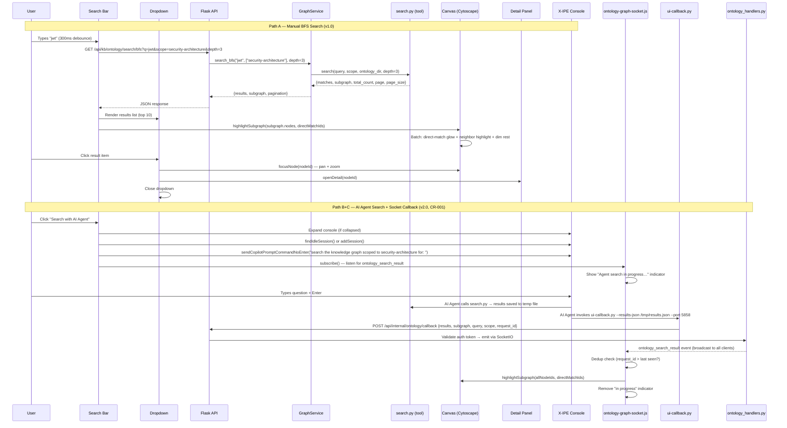
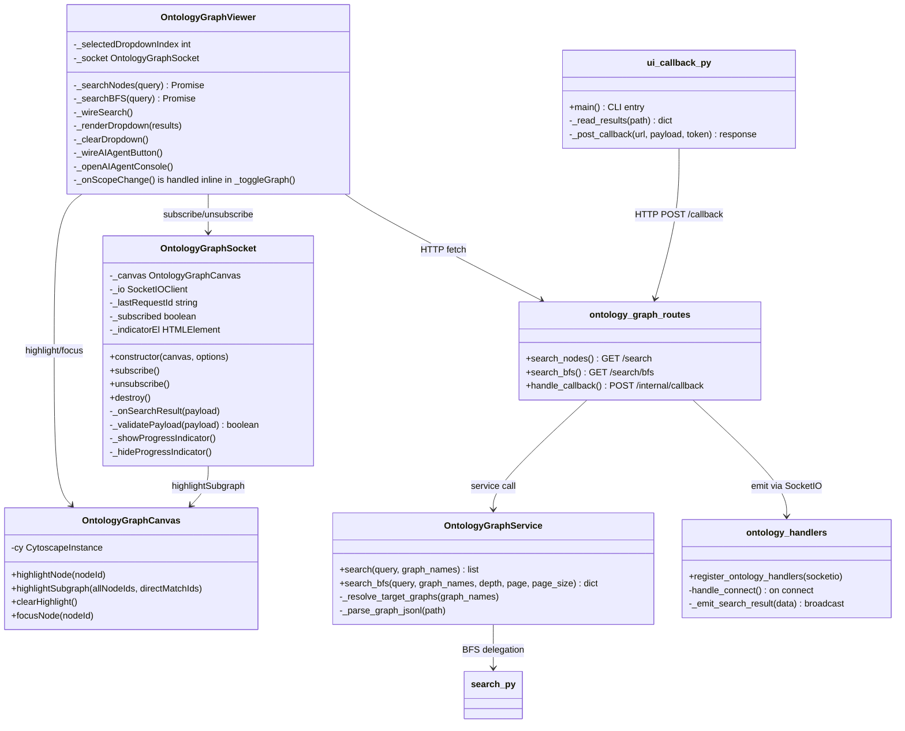

# Technical Design: Graph Search & AI Agent Integration

> Feature ID: FEATURE-058-F
> Version: v2.0
> Status: Designed
> Last Updated: 04-13-2026
> Specification: [specification.md](x-ipe-docs/requirements/EPIC-058/FEATURE-058-F/specification.md)

## Version History

| Version | Date | Description |
|---------|------|-------------|
| v1.0 | 04-09-2026 | Initial technical design |
| v2.0 | 04-13-2026 | [CR-001](./CR-001.md): Added socket callback architecture — new `ontology_handlers.py`, `ontology-graph-socket.js`, `ui-callback.py`, internal callback endpoint. Covers AC-058F-09/10/11. |

---

# Part 1: Agent-Facing Summary

## What This Feature Does

FEATURE-058-F upgrades the Ontology Graph Viewer's search from simple text matching to BFS graph traversal and adds an AI Agent Console bridge. When a user searches for "JWT", instead of just finding the JWT node, the BFS search discovers JWT + Token Management + Auth Middleware + OAuth2 Protocol — the entire knowledge neighborhood within 3 hops. Results appear in a dropdown list AND as highlighted nodes on the canvas. A "Search with AI Agent" button opens the X-IPE Console pre-scoped to the selected graphs.

## Key Components Implemented

| Component | File | Tags | Purpose |
|-----------|------|------|---------|
| BFS Search Route | `src/x_ipe/routes/ontology_graph_routes.py` | `api, bfs-search, endpoint, ontology` | New `/api/kb/ontology/search/bfs` endpoint |
| BFS Search Service | `src/x_ipe/services/ontology_graph_service.py` | `service, bfs, graph-traversal, search` | `search_bfs()` method wrapping ontology tool's `search.py` |
| Search Dropdown | `src/x_ipe/static/js/features/ontology-graph-viewer.js` | `frontend, dropdown, search-results, keyboard-nav` | Dropdown list with results, keyboard nav, click-to-navigate |
| Canvas Highlighting | `src/x_ipe/static/js/features/ontology-graph-canvas.js` | `frontend, cytoscape, highlight, subgraph, dimming` | `highlightSubgraph()` for multi-tier highlighting |
| AI Agent Button | `src/x_ipe/static/js/features/ontology-graph-viewer.js` | `frontend, console, ai-agent, terminal` | Button → Console pre-fill with graph scope |
| Search Styles | `src/x_ipe/static/css/ontology-graph-viewer.css` | `css, dropdown, highlight, ai-button` | Dropdown, AI button, direct-match glow styles |
| BFS Search Tests | `tests/test_ontology_graph_viewer.py` | `test, bfs, api, search` | API + service tests for BFS endpoint |
| Ontology Socket Handler | `src/x_ipe/handlers/ontology_handlers.py` | `socket, handler, callback, ontology, socketio` | *(CR-001)* SocketIO handler: internal callback endpoint receiver + broadcast emitter |
| Socket Listener Module | `src/x_ipe/static/js/features/ontology-graph-socket.js` | `frontend, socket, listener, realtime, callback` | *(CR-001)* Frontend SocketIO listener: subscribe, receive, dedup, render agent results |
| UI Callback Script | `.github/skills/x-ipe-tool-ontology/scripts/ui-callback.py` | `script, callback, socketio, agent, cli` | *(CR-001)* CLI script: reads search results → HTTP POST to internal callback endpoint |
| Internal Callback Endpoint | `src/x_ipe/routes/ontology_graph_routes.py` | `api, internal, callback, socket-bridge` | *(CR-001)* `POST /api/internal/ontology/callback` receives results and triggers SocketIO emit |

## Dependencies

| Dependency | Type | Status | Notes |
|-----------|------|--------|-------|
| FEATURE-058-A (Ontology Tool Skill) | Internal | ✅ Complete | Provides `search.py` with `_bfs_subgraph()` |
| FEATURE-058-E (Graph Viewer UI) | Internal | ✅ Complete | Provides canvas, sidebar, search bar shell |
| `window.terminalManager` | Internal | ✅ Available | Console session API (used by action-execution-modal) |
| Cytoscape.js 3.30.4 | External | ✅ Loaded | `cy.batch()`, CSS classes, `animate()` |
| ontology tool `search.py` | Internal | ✅ Available | `.github/skills/x-ipe-tool-ontology/scripts/search.py` |
| Flask-SocketIO 5.6.0+ | External | ✅ In pyproject.toml | *(CR-001)* SocketIO server-side emit for `ontology_search_result` |
| python-socketio 5.16.0+ | External | ✅ In pyproject.toml | *(CR-001)* Used by `ui-callback.py` (HTTP POST alternative chosen instead) |
| Socket.IO JS client | External | ✅ Loaded by Console | *(CR-001)* Frontend `io()` instance reused from existing terminal socket connection |

## Major Flow

```
Path A — Manual BFS Search (v1.0, unchanged):
  User types query → 300ms debounce → GET /api/kb/ontology/search/bfs
      → Service calls search.py (BFS depth=3)
      → Returns {results, subgraph, pagination}
      → Frontend: render dropdown + highlight canvas subgraph

Path B — AI Agent Search (v1.0, unchanged):
  User clicks "Search with AI Agent"
      → Expand Console panel (if collapsed)
      → Find idle session or create new
      → Pre-fill: "search the knowledge graph scoped to [graphs] for: "
      → User types question, presses Enter → AI handles via Console

Path C — AI Agent Socket Callback (v2.0, CR-001):
  User clicks "Search with AI Agent"
      → (Path B actions) + subscribe ontology-graph-socket listener
      → Show "Agent search in progress…" indicator
      → AI Agent calls search.py → results ready
      → AI Agent calls ui-callback.py --results-json <path> --port 5858
      → ui-callback.py POSTs to http://localhost:5858/api/internal/ontology/callback
      → Flask validates auth token, emits ontology_search_result via SocketIO
      → Frontend listener receives event → dedup check (request_id)
      → canvas.highlightSubgraph(allNodeIds, directMatchIds)
      → Remove "in progress" indicator
```

## Usage Example

```javascript
// Frontend: BFS search with subgraph highlighting (Path A — manual)
const resp = await fetch('/api/kb/ontology/search/bfs?q=jwt&scope=security-architecture&depth=3&page=1&page_size=20');
const { results, subgraph, pagination } = await resp.json();

canvas.highlightSubgraph(
  subgraph.nodes,                           // all BFS-expanded node IDs
  results.map(r => r.node_id)               // direct match node IDs (stronger glow)
);
```

```javascript
// Frontend: Socket listener for AI Agent results (Path C — CR-001)
import { OntologyGraphSocket } from './ontology-graph-socket.js';

const socket = new OntologyGraphSocket(canvas, { port: 5858 });
socket.subscribe();       // listen for ontology_search_result events
// ... later, when viewer closes:
socket.unsubscribe();     // tear down listener (AC-058F-10e)
```

```bash
# API: BFS search endpoint (Path A)
curl "http://localhost:5858/api/kb/ontology/search/bfs?q=authentication&scope=all&depth=3&page=1&page_size=20"

# CLI: ui-callback.py pushes results to graph viewer (Path C — CR-001)
python3 .github/skills/x-ipe-tool-ontology/scripts/ui-callback.py \
  --results-json /tmp/search_results.json \
  --port 5858 \
  --token "$X_IPE_INTERNAL_TOKEN"
```

---

# Part 2: Implementation Guide

## Workflow Diagram



## Component Architecture



## Implementation Steps

### Step 1: Backend — BFS Search Service Method

**File:** `src/x_ipe/services/ontology_graph_service.py`

Add `search_bfs()` method that delegates to the ontology tool's `search.py`:

```python
def search_bfs(
    self,
    query: str,
    graph_names: list[str] | None = None,
    depth: int = 3,
    page: int = 1,
    page_size: int = 20,
) -> dict:
```

**Integration approach:** Import and call the `search()` function from `.github/skills/x-ipe-tool-ontology/scripts/search.py` directly. The function accepts `ontology_dir` as a parameter, which maps to `self._ontology_dir`.

**Scope resolution:** Convert `graph_names` list to comma-separated scope string (or `"all"` if None).

**Response transformation:** Map the `search.py` output format to the API response format:

| `search.py` field | API response field |
|---|---|
| `matches[].entity.id` | `results[].node_id` |
| `matches[].entity.properties.label` | `results[].label` |
| `matches[].entity.properties.node_type` | `results[].node_type` |
| `matches[].provenance` (strip `.jsonl`) | `results[].graph` |
| `matches[].score` | `results[].relevance` |
| `matches[].match_fields` | `results[].match_fields` |
| `subgraph.nodes` | `subgraph.nodes` (pass through) |
| `subgraph.edges` | `subgraph.edges` (pass through) |
| `total_count`, `page`, `page_size` | `pagination.total`, `.page`, `.page_size` |

### Step 2: Backend — BFS Search Route

**File:** `src/x_ipe/routes/ontology_graph_routes.py`

New endpoint:

```
GET /api/kb/ontology/search/bfs?q=<query>&scope=<graphs>&depth=<int>&page=<int>&page_size=<int>
```

| Parameter | Type | Default | Description |
|-----------|------|---------|-------------|
| `q` | string | (required) | Search query |
| `scope` | string | `"all"` | Comma-separated graph names or `"all"` |
| `depth` | int | `3` | BFS traversal depth (1-5) |
| `page` | int | `1` | Page number (1-based) |
| `page_size` | int | `20` | Results per page (max 100) |

**Response (200):**
```json
{
  "results": [
    {
      "node_id": "ent-jwt-auth",
      "label": "JWT Authentication",
      "node_type": "concept",
      "graph": "security-architecture",
      "relevance": 1.0,
      "match_fields": ["label"]
    }
  ],
  "subgraph": {
    "nodes": ["ent-jwt-auth", "ent-token-mgmt", "ent-oauth2"],
    "edges": [
      {"from": "ent-jwt-auth", "rel": "depends_on", "to": "ent-oauth2"}
    ]
  },
  "pagination": {
    "page": 1,
    "page_size": 20,
    "total": 5,
    "total_pages": 1
  }
}
```

**Error responses:**
- `400` — Missing `q` parameter
- `404` — `ONTOLOGY_NOT_FOUND` (no `.ontology/` directory)
- `500` — Internal error

**Validation:** Clamp `depth` to range [1, 5], `page_size` to range [1, 100], `page` to minimum 1.

### Step 3: Frontend — Search Dropdown Component

**File:** `src/x_ipe/static/js/features/ontology-graph-viewer.js`

**Modifications to existing `_buildDOM()`:**
1. Add a dropdown container (`<div class="ogv-search-dropdown">`) after the search input
2. Add the "Search with AI Agent" button with a vertical divider

**New private methods:**

- `_searchBFS(query)` — Calls `/api/kb/ontology/search/bfs` with query + scope from selected graphs + depth=3. Returns parsed JSON.
- `_renderDropdown(results)` — Creates dropdown HTML. Each item: colored type dot, label, graph name in muted text, relevance bar. Max 10 visible items. Wires click handlers.
- `_clearDropdown()` — Removes dropdown and resets `_selectedDropdownIndex`.
- `_handleDropdownKeyboard(event)` — ArrowDown/Up to navigate, Enter to select, Escape to close.

**Modify `_wireSearch()`:**
- Replace `this._searchNodes(query)` call with `this._searchBFS(query)`
- On results: call `_renderDropdown(results.results)` AND `this.canvas.highlightSubgraph(results.subgraph.nodes, results.results.map(r => r.node_id))`
- On empty query: call `_clearDropdown()` AND `this.canvas.clearHighlight()`
- Wire `keydown` on search input for dropdown keyboard nav

**Dropdown item click handler:**
```
1. canvas.focusNode(nodeId) — pan + zoom to node
2. this._onNodeSelect(nodeId) — open detail panel
3. _clearDropdown() — close dropdown
```

### Step 4: Frontend — Canvas Subgraph Highlighting

**File:** `src/x_ipe/static/js/features/ontology-graph-canvas.js`

**New method: `highlightSubgraph(allNodeIds, directMatchIds)`**

```javascript
highlightSubgraph(allNodeIds, directMatchIds) {
    if (!this.cy) return;
    const allSet = new Set(allNodeIds);
    const directSet = new Set(directMatchIds);

    this.cy.batch(() => {
        // Reset all
        this.cy.elements().removeClass('highlighted dimmed direct-match bfs-neighbor');
        // Dim everything
        this.cy.elements().addClass('dimmed');
        // Un-dim subgraph nodes and their connecting edges
        allNodeIds.forEach(id => {
            const node = this.cy.getElementById(id);
            if (node && !node.empty()) {
                node.removeClass('dimmed');
                if (directSet.has(id)) {
                    node.addClass('direct-match');
                } else {
                    node.addClass('bfs-neighbor');
                }
            }
        });
        // Un-dim edges where BOTH endpoints are in the subgraph
        this.cy.edges().forEach(edge => {
            if (allSet.has(edge.source().id()) && allSet.has(edge.target().id())) {
                edge.removeClass('dimmed').addClass('highlighted');
            }
        });
    });
}
```

**New Cytoscape stylesheet entries:**

```javascript
// Direct match: strong emerald glow ring
{
    selector: 'node.direct-match',
    style: {
        'border-width': 5,
        'border-color': '#10b981',
        'border-opacity': 1,
        'z-index': 20,
    }
},
// BFS neighbor: full opacity, subtle border
{
    selector: 'node.bfs-neighbor',
    style: {
        'border-width': 3,
        'border-color': '#94a3b8',
        'z-index': 10,
    }
}
```

### Step 5: Frontend — AI Agent Console Button

**File:** `src/x_ipe/static/js/features/ontology-graph-viewer.js`

**Add to `_buildDOM()` — after search input, before canvas:**
- Vertical divider element
- "Search with AI Agent" button with terminal SVG icon
- Per mockup: violet gradient border, 12px font, hover glow

**New method: `_wireAIAgentButton()`**
- Wire click handler on the AI Agent button

**New method: `_openAIAgentConsole()`**
```
1. Get selected graphs from scope
2. If none selected → show toast "Select graphs first", return
3. Build command: "search the knowledge graph scoped to {graphs} for: "
4. Get window.terminalManager
5. If not available → show toast "Console not available", return
6. Expand console panel if collapsed
7. Find idle session or create new
8. sendCopilotPromptCommandNoEnter(command)
```

This follows the exact pattern from `action-execution-modal.js` lines 910-935.

### Step 6: Frontend — Scope-Change Search Re-run

**File:** `src/x_ipe/static/js/features/ontology-graph-viewer.js`

**Modify `_toggleGraph()` (existing method) or scope-change handler:**
- After updating scope, check if search input has a non-empty query
- If yes: debounce (300ms) and re-run `_searchBFS(query)` with updated scope
- Update dropdown and canvas highlighting

### Step 7: Frontend — Status Bar Search Updates

**File:** `src/x_ipe/static/js/features/ontology-graph-viewer.js`

**Add `_updateSearchStatus()` method (separate from `_updateStats()`):**
- When search active: show `Search: N matches · M related` in status bar
- When search cleared: remove the search indicator

### Step 8: CSS Styles

**File:** `src/x_ipe/static/css/ontology-graph-viewer.css`

**New styles:**

```css
/* Search dropdown */
.ogv-search-dropdown { ... }           /* Absolute positioned below search bar */
.ogv-search-dropdown-item { ... }      /* Row with type dot, label, graph, relevance */
.ogv-search-dropdown-item--selected { ... }  /* Keyboard nav highlight */
.ogv-search-dropdown-empty { ... }     /* "No results" state */

/* AI Agent button */
.ogv-ai-agent-btn { ... }             /* Violet gradient border, terminal icon */
.ogv-ai-agent-btn:hover { ... }       /* Stronger gradient, box shadow */
.ogv-search-divider { ... }           /* Vertical divider between search and button */

/* Status bar search indicator */
.ogv-status-search { ... }            /* Search: N matches · M related */
```

### Step 9: Backend — Ontology Socket Handler *(CR-001)*

**File:** `src/x_ipe/handlers/ontology_handlers.py` *(NEW)*

> **800-line rule:** New standalone module — follows the `register_X_handlers(socketio)` pattern from `terminal_handlers.py` (223 lines) and `voice_handlers.py` (~184 lines). This module will be ~80-100 lines.

**Registration function:**

```python
from flask import request
from x_ipe.tracing import x_ipe_tracing

def register_ontology_handlers(socketio):
    """Register SocketIO handlers for ontology graph search callbacks."""

    @socketio.on('connect', namespace='/ontology')
    @x_ipe_tracing()
    def handle_connect():
        sid = request.sid
        print(f"[Ontology] Client connected: {sid}")

    @socketio.on('disconnect', namespace='/ontology')
    def handle_disconnect():
        sid = request.sid
        print(f"[Ontology] Client disconnected: {sid}")
```

**Key design decisions:**
- Uses `/ontology` namespace to isolate from terminal/voice handlers
- No room-based isolation (per-port broadcast per spec)
- The `emit_search_result()` function is called by the route handler (Step 10), not directly by socket events
- No `socket_to_session` mapping needed — broadcast model

**Integration with app.py:**
```python
# In _register_handlers():
from x_ipe.handlers import register_ontology_handlers
register_ontology_handlers(socketio)
```

**Update `src/x_ipe/handlers/__init__.py`:**
```python
from .ontology_handlers import register_ontology_handlers

__all__ = [
    'register_terminal_handlers',
    'register_voice_handlers',
    'register_ontology_handlers',  # CR-001
    'socket_to_session',
    'socket_to_voice_session',
]
```

### Step 10: Backend — Internal Callback Endpoint *(CR-001)*

**File:** `src/x_ipe/routes/ontology_graph_routes.py` *(MODIFY — add ~50 lines; total ~165 lines, within 800-line limit)*

**New endpoint:**

```
POST /api/internal/ontology/callback
```

**Request body:**
```json
{
  "results": [
    { "node_id": "...", "label": "...", "node_type": "...", "graph": "...", "relevance": 0.85 }
  ],
  "subgraph": {
    "nodes": ["id1", "id2"],
    "edges": [{ "from": "id1", "rel": "depends_on", "to": "id2" }]
  },
  "query": "authentication",
  "scope": "security-architecture",
  "request_id": "550e8400-e29b-41d4-a716-446655440000"
}
```

**Headers:**
```
Authorization: Bearer <internal_token>
Content-Type: application/json
```

**Response:**
- `200 OK` — `{ "status": "emitted", "request_id": "..." }` — event successfully emitted via SocketIO
- `401 Unauthorized` — `{ "error": "UNAUTHORIZED", "message": "Invalid internal token" }` — AC-058F-09f
- `400 Bad Request` — `{ "error": "INVALID_PAYLOAD", "message": "..." }` — missing required fields

**Implementation:**

```python
@ontology_graph_bp.route('/api/internal/ontology/callback', methods=['POST'])
@x_ipe_tracing()
def handle_ontology_callback():
    """POST /api/internal/ontology/callback — Receive AI Agent search results and broadcast via SocketIO."""
    # 1. Validate auth token
    auth_header = request.headers.get('Authorization', '')
    expected_token = current_app.config.get('INTERNAL_AUTH_TOKEN', '')
    if not expected_token or not auth_header.startswith('Bearer ') or auth_header[7:] != expected_token:
        return _error('UNAUTHORIZED', 'Invalid internal token', 401)

    # 2. Parse and validate payload
    data = request.get_json(silent=True)
    if not data or 'results' not in data or 'subgraph' not in data:
        return _error('INVALID_PAYLOAD', 'Missing required fields: results, subgraph', 400)

    # 3. Emit via SocketIO (broadcast — no room targeting)
    socketio = current_app.extensions.get('socketio')
    if socketio:
        socketio.emit('ontology_search_result', {
            'results': data['results'],
            'subgraph': data['subgraph'],
            'query': data.get('query', ''),
            'scope': data.get('scope', ''),
            'request_id': data.get('request_id', ''),
        }, namespace='/ontology')

    return jsonify({'status': 'emitted', 'request_id': data.get('request_id', '')})
```

**Auth token source:** `INTERNAL_AUTH_TOKEN` loaded from:
1. Environment variable `X_IPE_INTERNAL_TOKEN` (highest priority)
2. `.x-ipe.yaml` → `server.internal_token` (fallback)
3. If neither set → log warning at startup, endpoint returns 401 for all requests

### Step 11: Frontend — Socket Listener Module *(CR-001)*

**File:** `src/x_ipe/static/js/features/ontology-graph-socket.js` *(NEW)*

> **800-line rule:** `ontology-graph-viewer.js` is already 1249 lines. Socket listener functionality MUST be in a separate module. Estimated size: ~120-150 lines.

**Class: `OntologyGraphSocket`**

```javascript
/**
 * Socket listener for AI Agent search results (CR-001).
 * Subscribes to ontology_search_result events and updates the canvas.
 */
export class OntologyGraphSocket {
    /**
     * @param {OntologyGraphCanvas} canvas — canvas instance for highlightSubgraph()
     * @param {Object} options — { port: 5858, indicatorContainer: HTMLElement }
     */
    constructor(canvas, options = {}) {
        this._canvas = canvas;
        this._port = options.port || 5858;
        this._indicatorContainer = options.indicatorContainer || null;
        this._io = null;
        this._subscribed = false;
        this._lastRequestId = null;
        this._indicatorEl = null;
        this._indicatorTimeout = null;
    }

    /**
     * Subscribe to ontology_search_result events.
     * Creates/reuses the Socket.IO connection on /ontology namespace.
     * AC-058F-10a: Called when "Search with AI Agent" is clicked.
     */
    subscribe() {
        if (this._subscribed) return;

        // Reuse existing io() instance or create new on /ontology namespace
        if (!this._io) {
            this._io = io(`http://localhost:${this._port}/ontology`, {
                reconnection: true,
                reconnectionDelay: 1000,
                reconnectionDelayMax: 5000,   // AC-058F-10f: reconnect within 5s
                reconnectionAttempts: 10,
            });
        }

        this._io.on('ontology_search_result', (payload) => this._onSearchResult(payload));
        this._io.on('connect_error', (err) => {
            console.warn('[OntologySocket] Connection error:', err.message);
            this._hideProgressIndicator();
        });

        this._subscribed = true;
        this._showProgressIndicator(); // AC-058F-10g
    }

    /**
     * Unsubscribe and clean up.
     * AC-058F-10e: Called when viewer is closed/destroyed.
     */
    unsubscribe() {
        if (!this._subscribed) return;
        if (this._io) {
            this._io.off('ontology_search_result');
            this._io.off('connect_error');
        }
        this._hideProgressIndicator();
        this._subscribed = false;
    }

    /** Full teardown — disconnect socket. */
    destroy() {
        this.unsubscribe();
        if (this._io) {
            this._io.disconnect();
            this._io = null;
        }
        this._lastRequestId = null;
    }

    /**
     * Handle incoming search result event.
     * AC-058F-10b: Highlight results on canvas.
     * AC-058F-10d: Replace previous highlighting.
     * AC-058F-10h: Dedup via request_id.
     * AC-058F-09e: Validate payload.
     */
    _onSearchResult(payload) {
        // Validate payload (AC-058F-09e)
        if (!this._validatePayload(payload)) {
            console.debug('[OntologySocket] Malformed payload — ignoring', payload);
            return;
        }

        // Dedup check (AC-058F-10h)
        const requestId = payload.request_id || '';
        if (this._lastRequestId && requestId && requestId <= this._lastRequestId) {
            console.debug('[OntologySocket] Out-of-order result — discarding', requestId);
            return;
        }
        this._lastRequestId = requestId;

        // Extract node IDs for highlighting
        const allNodeIds = (payload.subgraph?.nodes || []).map(
            n => typeof n === 'string' ? n : n?.data?.id
        ).filter(Boolean);
        const directMatchIds = (payload.results || []).map(r => r.node_id).filter(Boolean);

        // AC-058F-10d: Clear previous + apply new
        // AC-058F-10c: highlightSubgraph silently ignores node IDs not in canvas
        this._canvas.highlightSubgraph(allNodeIds, directMatchIds);

        this._hideProgressIndicator();
    }

    /** Validate that required fields exist (AC-058F-09e). */
    _validatePayload(payload) {
        return payload
            && Array.isArray(payload.results)
            && payload.subgraph != null
            && typeof payload.subgraph === 'object';
    }

    /** Show "Agent search in progress…" indicator (AC-058F-10g). */
    _showProgressIndicator() {
        if (!this._indicatorContainer || this._indicatorEl) return;
        this._indicatorTimeout = setTimeout(() => {
            this._indicatorEl = document.createElement('span');
            this._indicatorEl.className = 'ogv-agent-progress';
            this._indicatorEl.textContent = 'Agent search in progress…';
            this._indicatorContainer.appendChild(this._indicatorEl);
        }, 3000); // Show after 3s delay per AC-058F-10g
    }

    /** Remove progress indicator. */
    _hideProgressIndicator() {
        if (this._indicatorTimeout) {
            clearTimeout(this._indicatorTimeout);
            this._indicatorTimeout = null;
        }
        if (this._indicatorEl) {
            this._indicatorEl.remove();
            this._indicatorEl = null;
        }
    }
}
```

**Integration with `ontology-graph-viewer.js`:**

Modify `_openAIAgentConsole()` to initialize and subscribe the socket:

```javascript
// In OntologyGraphViewer constructor or init():
this._socket = null;

// In _openAIAgentConsole() — after console setup:
if (!this._socket) {
    this._socket = new OntologyGraphSocket(this.canvas, {
        port: 5858,
        indicatorContainer: this._searchBarArea,
    });
}
this._socket.subscribe();

// In destroy() or close handler:
if (this._socket) {
    this._socket.destroy();
    this._socket = null;
}
```

### Step 12: CLI — UI Callback Script *(CR-001)*

**File:** `.github/skills/x-ipe-tool-ontology/scripts/ui-callback.py` *(NEW)*

> Estimated size: ~100-120 lines. Standalone CLI script — no Flask dependency. Uses only `requests` and `json` from stdlib/common packages.

**CLI interface:**

```
python3 ui-callback.py --results-json <path> [--port 5858] [--token <token>]
```

| Argument | Required | Default | Description |
|----------|----------|---------|-------------|
| `--results-json` | Yes | — | Path to JSON file with search results (output from `search.py`) |
| `--port` | No | `5858` | Flask server port |
| `--token` | No | `$X_IPE_INTERNAL_TOKEN` | Internal auth token |

**Implementation:**

```python
#!/usr/bin/env python3
"""UI Callback: Push AI Agent search results to the KB Graph Viewer via SocketIO.

Called by the AI Agent after search.py completes. Reads the results file and
POSTs to the Flask server's internal callback endpoint, which emits the data
via SocketIO to all connected graph viewer clients.

AC-058F-11a: Read results file → POST to callback endpoint
AC-058F-11b: Validate --results-json; exit non-zero on error
AC-058F-11c: Retry once on connection failure; never block
AC-058F-11d: Log timestamp, query, result count, emit status
"""
import argparse
import json
import os
import sys
import uuid
from datetime import datetime

def _log(level, msg):
    ts = datetime.now().strftime('%Y-%m-%d %H:%M:%S')
    print(f"[ui-callback] [{ts}] [{level}] {msg}")

def _read_results(path):
    """Read and parse search results JSON file."""
    with open(path, 'r') as f:
        return json.load(f)

def _post_callback(url, payload, token, max_retries=1):
    """POST results to internal callback endpoint with retry."""
    import requests  # lazy import — only used if called

    headers = {
        'Content-Type': 'application/json',
        'Authorization': f'Bearer {token}',
    }

    for attempt in range(max_retries + 1):
        try:
            resp = requests.post(url, json=payload, headers=headers, timeout=10)
            return resp
        except requests.ConnectionError as e:
            if attempt < max_retries:
                _log('WARN', f'Connection failed (attempt {attempt+1}), retrying...')
            else:
                _log('WARN', f'Server unreachable after {max_retries+1} attempts: {e}')
                return None
        except requests.Timeout:
            _log('WARN', f'Request timed out (attempt {attempt+1})')
            if attempt >= max_retries:
                return None

def main():
    parser = argparse.ArgumentParser(description='Push search results to Graph Viewer UI')
    parser.add_argument('--results-json', required=True, help='Path to search results JSON file')
    parser.add_argument('--port', type=int, default=5858, help='Flask server port (default: 5858)')
    parser.add_argument('--token', default=None, help='Internal auth token (default: $X_IPE_INTERNAL_TOKEN)')
    args = parser.parse_args()

    # Resolve token (AC-058F-11b)
    token = args.token or os.environ.get('X_IPE_INTERNAL_TOKEN', '')
    if not token:
        _log('ERROR', 'No auth token provided (--token or $X_IPE_INTERNAL_TOKEN)')
        sys.exit(1)

    # Read results (AC-058F-11a)
    try:
        data = _read_results(args.results_json)
    except (FileNotFoundError, json.JSONDecodeError) as e:
        _log('ERROR', f'Failed to read results file: {e}')
        sys.exit(1)

    # Build payload
    request_id = str(uuid.uuid4())
    payload = {
        'results': data.get('results', []),
        'subgraph': data.get('subgraph', {}),
        'query': data.get('query', ''),
        'scope': data.get('scope', ''),
        'request_id': request_id,
    }

    result_count = len(payload['results'])
    query_summary = (payload['query'][:50] + '...') if len(payload['query']) > 50 else payload['query']

    # POST to callback endpoint (AC-058F-11c: retry once)
    url = f'http://localhost:{args.port}/api/internal/ontology/callback'
    resp = _post_callback(url, payload, token, max_retries=1)

    # Log outcome (AC-058F-11d)
    if resp and resp.status_code == 200:
        _log('INFO', f'query="{query_summary}" results={result_count} request_id={request_id} status=SUCCESS')
    elif resp:
        _log('WARN', f'query="{query_summary}" results={result_count} request_id={request_id} status=FAIL http={resp.status_code}')
        sys.exit(1)
    else:
        _log('WARN', f'query="{query_summary}" results={result_count} request_id={request_id} status=FAIL (unreachable)')
        sys.exit(1)

if __name__ == '__main__':
    main()
```

**Data transformation note:** The `ui-callback.py` expects its `--results-json` input to already be in API response format (matching `search_bfs()` output: `{ results, subgraph, query, scope }`). The AI Agent is responsible for saving search results in this format before calling `ui-callback.py`.

### Step 13: Backend — App Registration *(CR-001)*

**File:** `src/x_ipe/app.py` *(MODIFY — add ~4 lines)*

**Changes:**

1. Import and register ontology handlers:
```python
# In _register_handlers() function:
def _register_handlers():
    """Register all WebSocket handlers."""
    from x_ipe.handlers import register_terminal_handlers, register_voice_handlers, register_ontology_handlers

    register_terminal_handlers(socketio)
    register_voice_handlers(socketio)
    register_ontology_handlers(socketio)  # CR-001
```

2. Load internal auth token at app startup:
```python
# In create_app() or config section:
app.config['INTERNAL_AUTH_TOKEN'] = os.environ.get(
    'X_IPE_INTERNAL_TOKEN',
    x_ipe_config.get('server', {}).get('internal_token', '')
)
```

### Step 14: Frontend — Viewer Integration *(CR-001)*

**File:** `src/x_ipe/static/js/features/ontology-graph-viewer.js` *(MODIFY — add ~15 lines)*

**Changes:**

1. Import the socket module at top of file:
```javascript
import { OntologyGraphSocket } from './ontology-graph-socket.js';
```

2. Add `_socket` property initialization in constructor:
```javascript
this._socket = null;
```

3. Modify `_openAIAgentConsole()` — add socket subscription after console setup:
```javascript
// After sendCopilotPromptCommandNoEnter(command):
if (!this._socket) {
    this._socket = new OntologyGraphSocket(this.canvas, {
        port: 5858,
        indicatorContainer: this._dom.searchArea,
    });
}
this._socket.subscribe();
```

4. Add cleanup in `destroy()` method:
```javascript
if (this._socket) {
    this._socket.destroy();
    this._socket = null;
}
```

### Step 15: CSS — Socket Indicator Styles *(CR-001)*

**File:** `src/x_ipe/static/css/ontology-graph-viewer.css` *(MODIFY — add ~15 lines)*

```css
/* Agent search progress indicator (AC-058F-10g) */
.ogv-agent-progress {
    display: inline-flex;
    align-items: center;
    gap: 6px;
    font-family: 'JetBrains Mono', monospace;
    font-size: 11px;
    color: #8b5cf6;
    padding: 2px 8px;
    background: rgba(139, 92, 246, 0.1);
    border-radius: 4px;
    animation: ogv-pulse 1.5s ease-in-out infinite;
}

@keyframes ogv-pulse {
    0%, 100% { opacity: 0.7; }
    50% { opacity: 1; }
}
```

## `search.py` Import Strategy

The `search.py` module lives in `.github/skills/x-ipe-tool-ontology/scripts/search.py`. To call it from the Flask service:

```python
import importlib.util
import os
import sys

def _import_ontology_search():
    """Dynamically import search module from ontology tool skill."""
    project_root = os.path.dirname(os.path.dirname(os.path.dirname(os.path.dirname(os.path.abspath(__file__)))))
    # ontology.py must be importable first (search.py depends on `from ontology import ...`)
    ontology_path = os.path.join(
        project_root, '.github', 'skills', 'x-ipe-tool-ontology', 'scripts', 'ontology.py'
    )
    ont_spec = importlib.util.spec_from_file_location('ontology', ontology_path)
    ont_mod = importlib.util.module_from_spec(ont_spec)
    sys.modules['ontology'] = ont_mod
    ont_spec.loader.exec_module(ont_mod)

    search_path = os.path.join(
        project_root, '.github', 'skills', 'x-ipe-tool-ontology', 'scripts', 'search.py'
    )
    spec = importlib.util.spec_from_file_location('ontology_search', search_path)
    mod = importlib.util.module_from_spec(spec)
    spec.loader.exec_module(mod)
    return mod
```

Cache the imported module at service-init time (not per-request) for performance.

## Testing Strategy

| Test Category | Count | Framework | Coverage |
|---------------|-------|-----------|----------|
| API endpoint tests | ~8 | pytest | AC-058F-01 (all 7 ACs), parameter validation |
| Service method tests | ~5 | pytest | search_bfs() transformation, scope handling |
| Frontend dropdown tests | ~6 | Browser (Chrome DevTools) | AC-058F-02 (rendering, keyboard, click) |
| Canvas highlight tests | ~4 | Browser (Chrome DevTools) | AC-058F-03 (subgraph, direct-match, clear) |
| AI Agent button tests | ~4 | Browser (Chrome DevTools) | AC-058F-04 (click, disabled, console pre-fill) |
| Scope awareness tests | ~3 | Browser (Chrome DevTools) | AC-058F-06 (re-run on scope change) |
| Internal callback endpoint tests | ~4 | pytest | *(CR-001)* AC-058F-09a/09b/09d/09f — auth validation, emit, silent drop |
| Socket listener unit tests | ~6 | vitest (JS) | *(CR-001)* AC-058F-10a/10b/10c/10d/10e/10h — subscribe, render, cleanup, dedup |
| Frontend integration tests | ~3 | Browser (Chrome DevTools) | *(CR-001)* AC-058F-10f/10g — reconnection, progress indicator |
| ui-callback.py CLI tests | ~4 | pytest | *(CR-001)* AC-058F-11a/11b/11c/11d — file read, error exit, retry, logging |
| Payload validation tests | ~2 | vitest + pytest | *(CR-001)* AC-058F-09c/09e — format match, malformed reject |

**program_type:** `fullstack`
**tech_stack:** `["Python/Flask", "JavaScript/Vanilla", "HTML/CSS", "pytest", "vitest", "Flask-SocketIO"]`

---

## AC Traceability Matrix *(CR-001)*

| AC ID | Component(s) | Step(s) | Test Category |
|-------|-------------|---------|---------------|
| AC-058F-09a | ontology_handlers.py | Step 9 | Internal callback endpoint tests |
| AC-058F-09b | ontology_handlers.py, ontology_graph_routes.py | Steps 9, 10 | Internal callback endpoint tests |
| AC-058F-09c | ontology_graph_routes.py, ontology-graph-socket.js | Steps 10, 11 | Payload validation tests |
| AC-058F-09d | ontology_handlers.py | Step 9 | Internal callback endpoint tests |
| AC-058F-09e | ontology-graph-socket.js | Step 11 | Payload validation tests |
| AC-058F-09f | ontology_graph_routes.py | Step 10 | Internal callback endpoint tests |
| AC-058F-10a | ontology-graph-socket.js, ontology-graph-viewer.js | Steps 11, 14 | Socket listener unit tests |
| AC-058F-10b | ontology-graph-socket.js | Step 11 | Socket listener unit tests |
| AC-058F-10c | ontology-graph-socket.js | Step 11 | Socket listener unit tests |
| AC-058F-10d | ontology-graph-socket.js | Step 11 | Socket listener unit tests |
| AC-058F-10e | ontology-graph-socket.js, ontology-graph-viewer.js | Steps 11, 14 | Socket listener unit tests |
| AC-058F-10f | ontology-graph-socket.js | Step 11 | Frontend integration tests |
| AC-058F-10g | ontology-graph-socket.js, ontology-graph-viewer.css | Steps 11, 15 | Frontend integration tests |
| AC-058F-10h | ontology-graph-socket.js | Step 11 | Socket listener unit tests |
| AC-058F-11a | ui-callback.py | Step 12 | ui-callback.py CLI tests |
| AC-058F-11b | ui-callback.py | Step 12 | ui-callback.py CLI tests |
| AC-058F-11c | ui-callback.py | Step 12 | ui-callback.py CLI tests |
| AC-058F-11d | ui-callback.py | Step 12 | ui-callback.py CLI tests |

---

## Design Change Log

| Date | Version | Change | Reason |
|------|---------|--------|--------|
| 04-09-2026 | v1.0 | Initial design | FEATURE-058-F technical design |
| 04-13-2026 | v2.0 | CR-001: Added Steps 9-15 (ontology_handlers.py, internal callback endpoint, ontology-graph-socket.js, ui-callback.py, app.py registration, viewer integration, CSS indicator). Updated Part 1 components/deps/flow/usage. Updated class diagram and sequence diagram. Added AC traceability matrix. | Socket callback from AI Agent to Graph Viewer (CR-001) |
