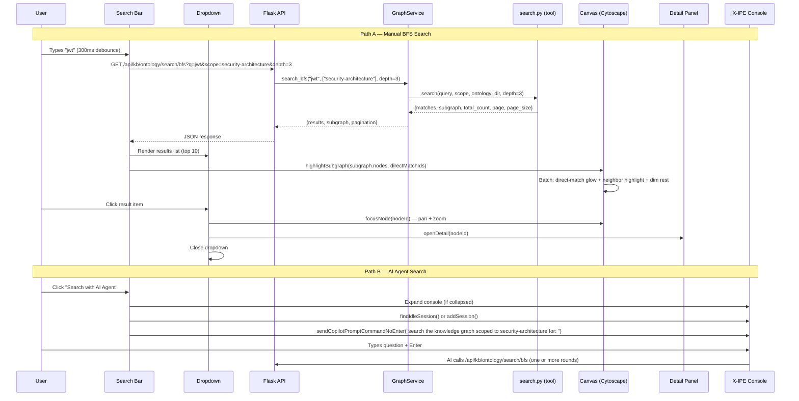
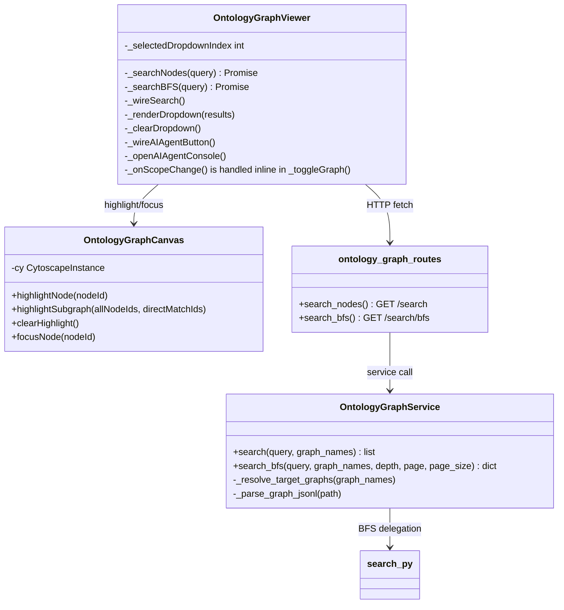

# Technical Design: Graph Search & AI Agent Integration

> Feature ID: FEATURE-058-F
> Version: v1.0
> Status: Designed
> Last Updated: 04-09-2026
> Specification: [specification.md](x-ipe-docs/requirements/EPIC-058/FEATURE-058-F/specification.md)

## Version History

| Version | Date | Description |
|---------|------|-------------|
| v1.0 | 04-09-2026 | Initial technical design |

---

# Part 1: Agent-Facing Summary

## What This Feature Does

FEATURE-058-F upgrades the Ontology Graph Viewer's search from simple text matching to BFS graph traversal and adds an AI Agent Console bridge. When a user searches for "JWT", instead of just finding the JWT node, the BFS search discovers JWT + Token Management + Auth Middleware + OAuth2 Protocol — the entire knowledge neighborhood within 3 hops. Results appear in a dropdown list AND as highlighted nodes on the canvas. A "Search with AI Agent" button opens the X-IPE Console pre-scoped to the selected graphs.

## Key Components Implemented

| Component | File | Tags | Purpose |
|-----------|------|------|---------|
| BFS Search Route | `src/x_ipe/routes/ontology_graph_routes.py` | `api, bfs-search, endpoint, ontology` | New `/api/kb/ontology/search/bfs` endpoint |
| BFS Search Service | `src/x_ipe/services/ontology_graph_service.py` | `service, bfs, graph-traversal, search` | `search_bfs()` method wrapping ontology tool's `search.py` |
| Search Dropdown | `src/x_ipe/static/js/features/ontology-graph-viewer.js` | `frontend, dropdown, search-results, keyboard-nav` | Dropdown list with results, keyboard nav, click-to-navigate |
| Canvas Highlighting | `src/x_ipe/static/js/features/ontology-graph-canvas.js` | `frontend, cytoscape, highlight, subgraph, dimming` | `highlightSubgraph()` for multi-tier highlighting |
| AI Agent Button | `src/x_ipe/static/js/features/ontology-graph-viewer.js` | `frontend, console, ai-agent, terminal` | Button → Console pre-fill with graph scope |
| Search Styles | `src/x_ipe/static/css/ontology-graph-viewer.css` | `css, dropdown, highlight, ai-button` | Dropdown, AI button, direct-match glow styles |
| BFS Search Tests | `tests/test_ontology_graph_viewer.py` | `test, bfs, api, search` | API + service tests for BFS endpoint |

## Dependencies

| Dependency | Type | Status | Notes |
|-----------|------|--------|-------|
| FEATURE-058-A (Ontology Tool Skill) | Internal | ✅ Complete | Provides `search.py` with `_bfs_subgraph()` |
| FEATURE-058-E (Graph Viewer UI) | Internal | ✅ Complete | Provides canvas, sidebar, search bar shell |
| `window.terminalManager` | Internal | ✅ Available | Console session API (used by action-execution-modal) |
| Cytoscape.js 3.30.4 | External | ✅ Loaded | `cy.batch()`, CSS classes, `animate()` |
| ontology tool `search.py` | Internal | ✅ Available | `.github/skills/x-ipe-tool-ontology/scripts/search.py` |

## Major Flow

```
User types query → 300ms debounce → GET /api/kb/ontology/search/bfs
    → Service calls search.py (BFS depth=3)
    → Returns {results, subgraph, pagination}
    → Frontend: render dropdown + highlight canvas subgraph

User clicks "Search with AI Agent"
    → Expand Console panel (if collapsed)
    → Find idle session or create new
    → Pre-fill: "search the knowledge graph scoped to [graphs] for: "
    → User types question, presses Enter → AI handles via Console
```

## Usage Example

```javascript
// Frontend: BFS search with subgraph highlighting
const resp = await fetch('/api/kb/ontology/search/bfs?q=jwt&scope=security-architecture&depth=3&page=1&page_size=20');
const { results, subgraph, pagination } = await resp.json();

// results: [{node_id, label, graph, relevance, node_type, match_fields}, ...]
// subgraph: {nodes: ["n1","n2","n3"], edges: [{from,rel,to}, ...]}
// pagination: {page: 1, page_size: 20, total: 5, total_pages: 1}

// Highlight on canvas
canvas.highlightSubgraph(
  subgraph.nodes,                           // all BFS-expanded node IDs
  results.map(r => r.node_id)               // direct match node IDs (stronger glow)
);
```

```bash
# API: BFS search endpoint
curl "http://localhost:5858/api/kb/ontology/search/bfs?q=authentication&scope=all&depth=3&page=1&page_size=20"
```

---

# Part 2: Implementation Guide

## Workflow Diagram



## Component Architecture



## Implementation Steps

### Step 1: Backend — BFS Search Service Method

**File:** `src/x_ipe/services/ontology_graph_service.py`

Add `search_bfs()` method that delegates to the ontology tool's `search.py`:

```python
def search_bfs(
    self,
    query: str,
    graph_names: list[str] | None = None,
    depth: int = 3,
    page: int = 1,
    page_size: int = 20,
) -> dict:
```

**Integration approach:** Import and call the `search()` function from `.github/skills/x-ipe-tool-ontology/scripts/search.py` directly. The function accepts `ontology_dir` as a parameter, which maps to `self._ontology_dir`.

**Scope resolution:** Convert `graph_names` list to comma-separated scope string (or `"all"` if None).

**Response transformation:** Map the `search.py` output format to the API response format:

| `search.py` field | API response field |
|---|---|
| `matches[].entity.id` | `results[].node_id` |
| `matches[].entity.properties.label` | `results[].label` |
| `matches[].entity.properties.node_type` | `results[].node_type` |
| `matches[].provenance` (strip `.jsonl`) | `results[].graph` |
| `matches[].score` | `results[].relevance` |
| `matches[].match_fields` | `results[].match_fields` |
| `subgraph.nodes` | `subgraph.nodes` (pass through) |
| `subgraph.edges` | `subgraph.edges` (pass through) |
| `total_count`, `page`, `page_size` | `pagination.total`, `.page`, `.page_size` |

### Step 2: Backend — BFS Search Route

**File:** `src/x_ipe/routes/ontology_graph_routes.py`

New endpoint:

```
GET /api/kb/ontology/search/bfs?q=<query>&scope=<graphs>&depth=<int>&page=<int>&page_size=<int>
```

| Parameter | Type | Default | Description |
|-----------|------|---------|-------------|
| `q` | string | (required) | Search query |
| `scope` | string | `"all"` | Comma-separated graph names or `"all"` |
| `depth` | int | `3` | BFS traversal depth (1-5) |
| `page` | int | `1` | Page number (1-based) |
| `page_size` | int | `20` | Results per page (max 100) |

**Response (200):**
```json
{
  "results": [
    {
      "node_id": "ent-jwt-auth",
      "label": "JWT Authentication",
      "node_type": "concept",
      "graph": "security-architecture",
      "relevance": 1.0,
      "match_fields": ["label"]
    }
  ],
  "subgraph": {
    "nodes": ["ent-jwt-auth", "ent-token-mgmt", "ent-oauth2"],
    "edges": [
      {"from": "ent-jwt-auth", "rel": "depends_on", "to": "ent-oauth2"}
    ]
  },
  "pagination": {
    "page": 1,
    "page_size": 20,
    "total": 5,
    "total_pages": 1
  }
}
```

**Error responses:**
- `400` — Missing `q` parameter
- `404` — `ONTOLOGY_NOT_FOUND` (no `.ontology/` directory)
- `500` — Internal error

**Validation:** Clamp `depth` to range [1, 5], `page_size` to range [1, 100], `page` to minimum 1.

### Step 3: Frontend — Search Dropdown Component

**File:** `src/x_ipe/static/js/features/ontology-graph-viewer.js`

**Modifications to existing `_buildDOM()`:**
1. Add a dropdown container (`<div class="ogv-search-dropdown">`) after the search input
2. Add the "Search with AI Agent" button with a vertical divider

**New private methods:**

- `_searchBFS(query)` — Calls `/api/kb/ontology/search/bfs` with query + scope from selected graphs + depth=3. Returns parsed JSON.
- `_renderDropdown(results)` — Creates dropdown HTML. Each item: colored type dot, label, graph name in muted text, relevance bar. Max 10 visible items. Wires click handlers.
- `_clearDropdown()` — Removes dropdown and resets `_selectedDropdownIndex`.
- `_handleDropdownKeyboard(event)` — ArrowDown/Up to navigate, Enter to select, Escape to close.

**Modify `_wireSearch()`:**
- Replace `this._searchNodes(query)` call with `this._searchBFS(query)`
- On results: call `_renderDropdown(results.results)` AND `this.canvas.highlightSubgraph(results.subgraph.nodes, results.results.map(r => r.node_id))`
- On empty query: call `_clearDropdown()` AND `this.canvas.clearHighlight()`
- Wire `keydown` on search input for dropdown keyboard nav

**Dropdown item click handler:**
```
1. canvas.focusNode(nodeId) — pan + zoom to node
2. this._onNodeSelect(nodeId) — open detail panel
3. _clearDropdown() — close dropdown
```

### Step 4: Frontend — Canvas Subgraph Highlighting

**File:** `src/x_ipe/static/js/features/ontology-graph-canvas.js`

**New method: `highlightSubgraph(allNodeIds, directMatchIds)`**

```javascript
highlightSubgraph(allNodeIds, directMatchIds) {
    if (!this.cy) return;
    const allSet = new Set(allNodeIds);
    const directSet = new Set(directMatchIds);

    this.cy.batch(() => {
        // Reset all
        this.cy.elements().removeClass('highlighted dimmed direct-match bfs-neighbor');
        // Dim everything
        this.cy.elements().addClass('dimmed');
        // Un-dim subgraph nodes and their connecting edges
        allNodeIds.forEach(id => {
            const node = this.cy.getElementById(id);
            if (node && !node.empty()) {
                node.removeClass('dimmed');
                if (directSet.has(id)) {
                    node.addClass('direct-match');
                } else {
                    node.addClass('bfs-neighbor');
                }
            }
        });
        // Un-dim edges where BOTH endpoints are in the subgraph
        this.cy.edges().forEach(edge => {
            if (allSet.has(edge.source().id()) && allSet.has(edge.target().id())) {
                edge.removeClass('dimmed').addClass('highlighted');
            }
        });
    });
}
```

**New Cytoscape stylesheet entries:**

```javascript
// Direct match: strong emerald glow ring
{
    selector: 'node.direct-match',
    style: {
        'border-width': 5,
        'border-color': '#10b981',
        'border-opacity': 1,
        'z-index': 20,
    }
},
// BFS neighbor: full opacity, subtle border
{
    selector: 'node.bfs-neighbor',
    style: {
        'border-width': 3,
        'border-color': '#94a3b8',
        'z-index': 10,
    }
}
```

### Step 5: Frontend — AI Agent Console Button

**File:** `src/x_ipe/static/js/features/ontology-graph-viewer.js`

**Add to `_buildDOM()` — after search input, before canvas:**
- Vertical divider element
- "Search with AI Agent" button with terminal SVG icon
- Per mockup: violet gradient border, 12px font, hover glow

**New method: `_wireAIAgentButton()`**
- Wire click handler on the AI Agent button

**New method: `_openAIAgentConsole()`**
```
1. Get selected graphs from scope
2. If none selected → show toast "Select graphs first", return
3. Build command: "search the knowledge graph scoped to {graphs} for: "
4. Get window.terminalManager
5. If not available → show toast "Console not available", return
6. Expand console panel if collapsed
7. Find idle session or create new
8. sendCopilotPromptCommandNoEnter(command)
```

This follows the exact pattern from `action-execution-modal.js` lines 910-935.

### Step 6: Frontend — Scope-Change Search Re-run

**File:** `src/x_ipe/static/js/features/ontology-graph-viewer.js`

**Modify `_toggleGraph()` (existing method) or scope-change handler:**
- After updating scope, check if search input has a non-empty query
- If yes: debounce (300ms) and re-run `_searchBFS(query)` with updated scope
- Update dropdown and canvas highlighting

### Step 7: Frontend — Status Bar Search Updates

**File:** `src/x_ipe/static/js/features/ontology-graph-viewer.js`

**Add `_updateSearchStatus()` method (separate from `_updateStats()`):**
- When search active: show `Search: N matches · M related` in status bar
- When search cleared: remove the search indicator

### Step 8: CSS Styles

**File:** `src/x_ipe/static/css/ontology-graph-viewer.css`

**New styles:**

```css
/* Search dropdown */
.ogv-search-dropdown { ... }           /* Absolute positioned below search bar */
.ogv-search-dropdown-item { ... }      /* Row with type dot, label, graph, relevance */
.ogv-search-dropdown-item--selected { ... }  /* Keyboard nav highlight */
.ogv-search-dropdown-empty { ... }     /* "No results" state */

/* AI Agent button */
.ogv-ai-agent-btn { ... }             /* Violet gradient border, terminal icon */
.ogv-ai-agent-btn:hover { ... }       /* Stronger gradient, box shadow */
.ogv-search-divider { ... }           /* Vertical divider between search and button */

/* Status bar search indicator */
.ogv-status-search { ... }            /* Search: N matches · M related */
```

## Edge Cases & Error Handling

| Scenario | Handling |
|----------|----------|
| `search.py` module import fails | `search_bfs()` catches ImportError, returns 500 with descriptive error |
| BFS returns 0 results | Dropdown shows "No results found"; canvas clears highlight |
| Very large subgraph (>100 nodes) | Canvas renders all; dropdown shows top 10 direct matches only |
| Scope changes while search in flight | Cancel pending fetch (AbortController), re-issue with new scope |
| Console `terminalManager` is null | Show toast "Console not available"; log warning |
| User clicks dropdown item for deselected graph | Filter stale results client-side before rendering |
| Concurrent rapid search queries | 300ms debounce + AbortController ensures only latest query renders |
| `depth` parameter out of range | API clamps to [1, 5]; no error returned |

## `search.py` Import Strategy

The `search.py` module lives in `.github/skills/x-ipe-tool-ontology/scripts/search.py`. To call it from the Flask service:

```python
import importlib.util
import os
import sys

def _import_ontology_search():
    """Dynamically import search module from ontology tool skill."""
    project_root = os.path.dirname(os.path.dirname(os.path.dirname(os.path.dirname(os.path.abspath(__file__)))))
    # ontology.py must be importable first (search.py depends on `from ontology import ...`)
    ontology_path = os.path.join(
        project_root, '.github', 'skills', 'x-ipe-tool-ontology', 'scripts', 'ontology.py'
    )
    ont_spec = importlib.util.spec_from_file_location('ontology', ontology_path)
    ont_mod = importlib.util.module_from_spec(ont_spec)
    sys.modules['ontology'] = ont_mod
    ont_spec.loader.exec_module(ont_mod)

    search_path = os.path.join(
        project_root, '.github', 'skills', 'x-ipe-tool-ontology', 'scripts', 'search.py'
    )
    spec = importlib.util.spec_from_file_location('ontology_search', search_path)
    mod = importlib.util.module_from_spec(spec)
    spec.loader.exec_module(mod)
    return mod
```

Cache the imported module at service-init time (not per-request) for performance.

## Testing Strategy

| Test Category | Count | Framework | Coverage |
|---------------|-------|-----------|----------|
| API endpoint tests | ~8 | pytest | AC-058F-01 (all 7 ACs), parameter validation |
| Service method tests | ~5 | pytest | search_bfs() transformation, scope handling |
| Frontend dropdown tests | ~6 | Browser (Chrome DevTools) | AC-058F-02 (rendering, keyboard, click) |
| Canvas highlight tests | ~4 | Browser (Chrome DevTools) | AC-058F-03 (subgraph, direct-match, clear) |
| AI Agent button tests | ~4 | Browser (Chrome DevTools) | AC-058F-04 (click, disabled, console pre-fill) |
| Scope awareness tests | ~3 | Browser (Chrome DevTools) | AC-058F-06 (re-run on scope change) |

**program_type:** `fullstack`
**tech_stack:** `["Python/Flask", "JavaScript/Vanilla", "HTML/CSS", "pytest"]`

---

## Design Change Log

| Date | Version | Change | Reason |
|------|---------|--------|--------|
| 04-09-2026 | v1.0 | Initial design | FEATURE-058-F technical design |
