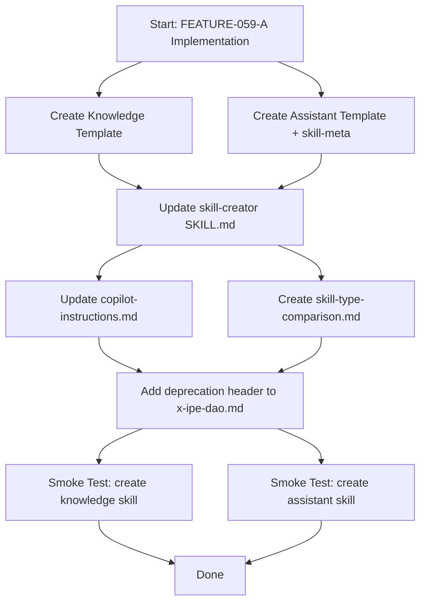
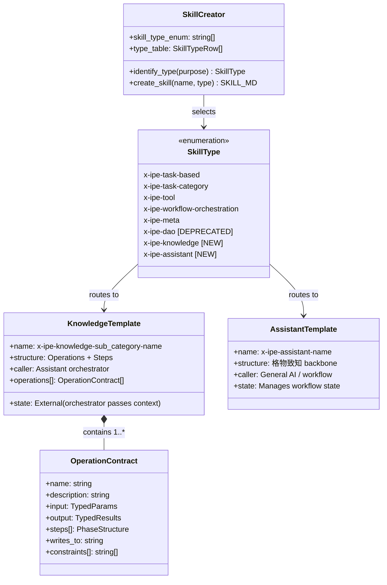

# Technical Design: Knowledge & Assistant Skill Type Infrastructure

> Feature ID: FEATURE-059-A | Version: v1.0 | Last Updated: 2026-04-15

---

## Part 1: Agent-Facing Summary

> **Purpose:** Quick reference for AI agents navigating large projects.
> **📌 AI Coders:** Focus on this section for implementation context.

### Key Components Implemented

| Component | Responsibility | Scope/Impact | Tags |
|-----------|----------------|--------------|------|
| `x-ipe-knowledge.md` | Knowledge skill template (Operations + Steps with phases inside) | New skill type for all `x-ipe-knowledge-*` skills | #skill-template #knowledge #operations |
| `x-ipe-assistant.md` | Assistant skill template (格物致知 backbone, DAO rename) | New skill type replacing `x-ipe-dao` | #skill-template #assistant #orchestration |
| `skill-meta-x-ipe-assistant.md` | Skill-meta template for assistant type | Companion metadata for assistant skills | #skill-meta #assistant |
| `skill-creator SKILL.md update` | Add knowledge + assistant types, deprecate dao | Type enum, table, selection logic | #skill-creator #type-system |
| `copilot-instructions.md update` | Auto-discovery for assistant + knowledge coordination note | Custom instructions for agents | #auto-discovery #custom-instructions |
| `skill-type-comparison.md` | Reference doc comparing all 4 active skill types | Developer guidance | #documentation #reference |

### Dependencies

| Dependency | Source | Design Link | Usage Description |
|------------|--------|-------------|-------------------|
| `x-ipe-meta-skill-creator` | EPIC-044 | [SKILL.md](.github/skills/x-ipe-meta-skill-creator/SKILL.md) | Base skill to extend with new types |
| `x-ipe-dao.md` template | Foundation | [x-ipe-dao.md](.github/skills/x-ipe-meta-skill-creator/templates/x-ipe-dao.md) | Source for assistant template (rename) |
| `copilot-instructions.md` | EPIC-041 | [copilot-instructions.md](.github/copilot-instructions.md) | Auto-discovery patterns to update |

### Major Flow

1. **Template creation:** Create `x-ipe-knowledge.md` (Operations + Steps hybrid) and `x-ipe-assistant.md` (dao rename) in `templates/`
2. **Skill-creator update:** Add "knowledge" and "assistant" to type enum, table, and selection logic. Mark "dao" as deprecated alias → redirects to "assistant"
3. **Custom instructions update:** Add `x-ipe-assistant-*` to scan patterns. Add note that `x-ipe-knowledge-*` are coordinated by the Knowledge Librarian assistant
4. **Reference doc:** Create `skill-type-comparison.md` covering all types

### Usage Example

```yaml
# Agent creating a new knowledge skill
input:
  skill_name: "extractor-web"
  skill_type: x-ipe-knowledge        # NEW — routes to x-ipe-knowledge.md template
  user_request: "Extract raw knowledge from web sources via Chrome DevTools"

# Agent creating a new assistant skill
input:
  skill_name: "knowledge-librarian-DAO"
  skill_type: x-ipe-assistant         # NEW — routes to x-ipe-assistant.md template
  user_request: "Coordinate knowledge pipeline using 格物致知 methodology"

# Agent selecting deprecated "dao" type
input:
  skill_name: "user-representative"
  skill_type: x-ipe-dao               # DEPRECATED — warns, redirects to x-ipe-assistant
```

---

## Part 2: Implementation Guide

> **Purpose:** Human-readable details for developers.
> **📌 Emphasis on visual diagrams for comprehension.**

### Workflow Diagram



### Class Diagram — Skill Type System



### Deliverable Details

#### D1: Knowledge Skill Template (`x-ipe-knowledge.md`)

**Location:** `.github/skills/x-ipe-meta-skill-creator/templates/x-ipe-knowledge.md`

**Structure — Hybrid Operations + Phases:**

Each knowledge skill defines named **Operations** as its primary structure. Inside each operation, the familiar phase backbone (博学之→笃行之) provides internal cognitive flow. This enables the assistant orchestrator to call operations independently while each operation maintains structured reasoning.

```markdown
# Template skeleton (simplified):

---
name: x-ipe-knowledge-{sub-category}-{name}
description: {What it does}. Triggers on operations like "{op1}", "{op2}".
---

# {Skill Name — Knowledge Skill}

## Purpose
## Important Notes
  - "Operations are stateless services — the assistant orchestrator passes full context per call"
  - "Each operation MUST define typed input/output contracts"
## About
  - Key Concepts: Operation Contract, Stateless Service, writes_to discipline
## When to Use

## Operations

### Operation: {operation_name}

> **Contract:**
> - Input: {typed params}
> - Output: {typed results}
> - Writes To: {path}
> - Constraints: {list}

#### 博学之 — Study Broadly
  {Gather context from input params}
#### 审问之 — Inquire Thoroughly
  {Validate assumptions, check constraints}
#### 慎思之 — Think Carefully
  {Core processing logic}
#### 明辨之 — Discern Clearly
  {Quality check, validate output}
#### 笃行之 — Practice Earnestly
  {Write output, return results}

### Operation: {next_operation}
  ...

## Output Result
## Definition of Done
## Error Handling
```

**Key design decisions:**
- Operations are the top-level sections (not phases)
- Phases are nested INSIDE each operation as sub-sections
- Each operation has a clear contract block before the phases
- `writes_to` field is mandatory per operation — enables the orchestrator to predict side effects
- Template includes one fully worked example operation and one skeleton

#### D2: Assistant Skill Template (`x-ipe-assistant.md` + `skill-meta-x-ipe-assistant.md`)

**Location:** `.github/skills/x-ipe-meta-skill-creator/templates/x-ipe-assistant.md`

**Approach:** Direct copy of `x-ipe-dao.md` (429 lines) with namespace substitution:
- `x-ipe-dao-{name}` → `x-ipe-assistant-{name}`
- Title references: "Human Representative Skill" → "Assistant Skill"
- Frontmatter `name:` pattern updated
- Internal cross-references updated

Same approach for `skill-meta-x-ipe-assistant.md` from `skill-meta-x-ipe-dao.md` (141 lines).

**No structural changes** — the 格物致知 backbone, disposition model, bounded output, and human shadow concepts all carry over unchanged.

#### D3: Skill Creator SKILL.md Update

**Location:** `.github/skills/x-ipe-meta-skill-creator/SKILL.md` (500 lines)

**Changes:**

1. **Type table** (line ~33-40) — Add 2 new rows:

| Type | Purpose | Naming Convention | SKILL.md Template | skill-meta.md Template |
|------|---------|-------------------|-------------------|------------------------|
| x-ipe-knowledge | Knowledge pipeline services (Operations + Steps) | `x-ipe-knowledge-{sub-category}-{name}` | x-ipe-knowledge.md | skill-meta-x-ipe-knowledge.md |
| x-ipe-assistant | Assistant/orchestrator skills (replaces x-ipe-dao) | `x-ipe-assistant-{name}` | x-ipe-assistant.md | skill-meta-x-ipe-assistant.md |

2. **Type enum** (line ~68) — Add to enum:
```yaml
skill_type: ... | x-ipe-knowledge | x-ipe-assistant
```

3. **Type selection logic** (step_1, line ~132-149) — Add items 10-11:
```
10. IF Knowledge pipeline service (Operations + Steps, called by assistant) → x-ipe-knowledge:
    - SKILL.md: templates/x-ipe-knowledge.md
    - skill-meta.md: templates/skill-meta-x-ipe-knowledge.md
11. IF Assistant/orchestrator skill (格物致知 backbone) → x-ipe-assistant:
    - SKILL.md: templates/x-ipe-assistant.md
    - skill-meta.md: templates/skill-meta-x-ipe-assistant.md
```

4. **DAO deprecation** — Update item 8:
```
8. IF Human representative skill (道 backbone as CORE) → x-ipe-dao:
   ⚠️ DEPRECATED: "dao" type is deprecated. Use "assistant" instead.
   - Automatically redirects to x-ipe-assistant template
   - SKILL.md: templates/x-ipe-assistant.md
   - skill-meta.md: templates/skill-meta-x-ipe-assistant.md
```

5. **Count update** — "All 8 skill types have complete templates"

**Estimated impact:** ~30 lines added, ~10 lines modified. Stays well within 500-line limit.

#### D4: Custom Instructions Update

**Location:** `.github/copilot-instructions.md`

**Changes to auto-discovery section (line ~90-96):**

```markdown
## Task-Based Skills Auto-Discovery

BLOCKING: Do NOT maintain a hardcoded registry. Skills are auto-discovered.

**Discovery rule:**
1. If the skills attachment is available in context, use it for matching (no filesystem scan needed)
2. Otherwise, scan `.github/skills/x-ipe-task-based-*/SKILL.md` and `.github/skills/x-ipe-assistant-*/SKILL.md`
3. Each skill's `description` contains trigger keywords for request matching

**Request matching:** Match user request against trigger keywords in each skill's description (e.g., "fix bug" → `x-ipe-task-based-bug-fix`, "implement feature" → `x-ipe-task-based-code-implementation`).

> **Note:** `x-ipe-knowledge-*` skills are NOT directly task-matched. They are coordinated by the Knowledge Librarian assistant (`x-ipe-assistant-knowledge-librarian-DAO`). Do not include them in auto-discovery scan patterns.
```

**Estimated impact:** ~5 lines modified/added.

#### D5: Skill Type Comparison Document

**Location:** `.github/skills/x-ipe-meta-skill-creator/references/skill-type-comparison.md`

**Content structure:**

```markdown
# Skill Type Comparison Reference

## Quick Comparison

| Skill Type | Structure | Caller | State Model | When to Use |
|---|---|---|---|---|
| task-based | Phase backbone (博学之→笃行之) | Human / workflow | Internal — skill owns state | User-facing workflows |
| tool | Scripts + Operations | Any skill / agent | Stateless — caller manages | Utility operations |
| knowledge | Operations + Steps (phases inside) | Assistant orchestrator | External — orchestrator passes context | Knowledge pipeline services |
| assistant | 格物致知 backbone | General AI / workflow | Manages workflow state | Coordination & orchestration |
| dao ⚠️ | DEPRECATED → use assistant | — | — | — |

## Detailed Type Descriptions

### task-based (x-ipe-task-based-*)
### tool (x-ipe-tool-*)
### knowledge (x-ipe-knowledge-*)
### assistant (x-ipe-assistant-*)
### dao — DEPRECATED
```

Each section includes: structural overview, invocation model, state management, when-to-use, example skill name, and naming convention.

#### D6: DAO Deprecation Header

**Location:** `.github/skills/x-ipe-meta-skill-creator/templates/x-ipe-dao.md`

**Change:** Add deprecation notice at top of file:

```markdown
> ⚠️ **DEPRECATED:** The `x-ipe-dao` skill type is deprecated. Use `x-ipe-assistant` instead.
> See [x-ipe-assistant.md](.github/skills/x-ipe-meta-skill-creator/templates/x-ipe-assistant.md) for the replacement template.
> Existing `x-ipe-dao-*` skills continue to work but should be migrated to `x-ipe-assistant-*` namespace.
```

### Implementation Steps

1. **Templates (D1, D2):** Create `x-ipe-knowledge.md` and `x-ipe-assistant.md` + `skill-meta-x-ipe-assistant.md` in candidate folder first (`x-ipe-docs/skill-meta/x-ipe-meta-skill-creator/candidate/templates/`)
2. **Skill-creator update (D3):** Edit SKILL.md in candidate folder — add types, update enum, update selection logic
3. **Custom instructions (D4):** Update `.github/copilot-instructions.md` — add assistant scan, knowledge coordination note
4. **Comparison doc (D5):** Create `skill-type-comparison.md` in candidate references
5. **DAO deprecation (D6):** Add deprecation header to existing `x-ipe-dao.md`
6. **Validation:** Merge candidates to production, run smoke tests

### Edge Cases & Error Handling

| Scenario | Expected Behavior |
|----------|-------------------|
| Agent selects "dao" type | Warning displayed, redirected to "assistant" template |
| Knowledge skill with no operations | Template includes comment: "At least one operation required" |
| Existing `x-ipe-dao-*` skills scanned | Still discovered via backward-compatible pattern |
| skill-meta template for knowledge | SKILL.md references skill-meta-x-ipe-knowledge.md template (added via CR-001) |

### AC-to-Component Traceability

| AC Group | Component(s) |
|----------|-------------|
| AC-059A-01 (Knowledge Template) | D1: `x-ipe-knowledge.md` |
| AC-059A-02 (Assistant Template) | D2: `x-ipe-assistant.md` + `skill-meta-x-ipe-assistant.md` |
| AC-059A-03 (Skill Creator Update) | D3: SKILL.md changes |
| AC-059A-04 (Custom Instructions) | D4: `copilot-instructions.md` |
| AC-059A-05 (Comparison Doc) | D5: `skill-type-comparison.md` |
| AC-059A-06 (DAO Deprecation) | D3 + D6: SKILL.md deprecation logic + `x-ipe-dao.md` header |
| AC-059A-07 (Smoke Tests) | All components — end-to-end validation |

---

## Design Change Log

| Date | Phase | Change Summary |
|------|-------|----------------|
| 2026-04-15 | Initial Design | Initial technical design created for FEATURE-059-A. 6 deliverables: knowledge template, assistant template, skill-creator update, custom instructions update, comparison doc, DAO deprecation. Program type: skills. |
| 2026-04-16 | CR-001 | Added skill-meta-x-ipe-knowledge.md template. Updated D3 type table (N/A → template path), selection logic, and edge cases. |
