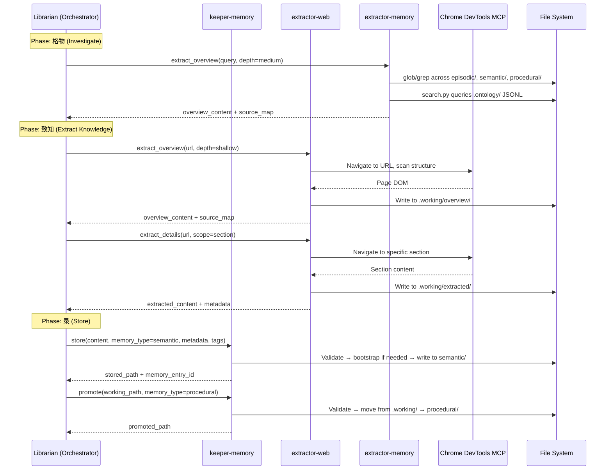
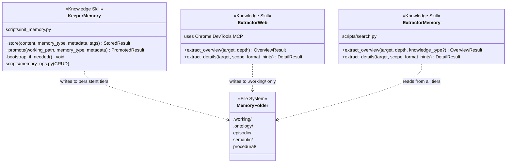

# Technical Design: Layer 1 — Core Skills (Keeper + Extractors)

> Feature ID: FEATURE-059-B | Version: v1.0 | Last Updated: 2026-04-16

---

## Part 1: Agent-Facing Summary

> **Purpose:** Quick reference for AI agents navigating large projects.
> **📌 AI Coders:** Focus on this section for implementation context.

### Key Components Implemented

| Component | Responsibility | Scope/Impact | Tags |
|-----------|----------------|--------------|------|
| `x-ipe-knowledge-keeper-memory` | Unified write gatekeeper for persistent memory (store + promote) | All knowledge writes go through this skill | #knowledge #keeper #memory #write #persistence |
| `x-ipe-knowledge-extractor-web` | Extract knowledge from web sources via Chrome DevTools MCP | Web-based knowledge acquisition | #knowledge #extractor #web #chrome-devtools |
| `x-ipe-knowledge-extractor-memory` | Search and retrieve existing knowledge from persistent memory | Read-only memory access + ontology search | #knowledge #extractor #memory #search #ontology |
| `init_memory.py` | Bootstrap memory folder structure on first use | Self-contained idempotent setup | #bootstrap #memory #init |
| `memory_ops.py` | File-level CRUD for memory entries (create, read, update, delete, list) | Handles content files only; ontology registration deferred to ontology-builder (059-C) | #memory #crud #file-ops |
| `search.py` | Ontology search (absorbs x-ipe-tool-ontology search) | JSONL entity/relation search | #ontology #search #jsonl |
| x-ipe-tool-ontology retirement | Deprecation of old ontology tool | Migration pointer to new skills | #deprecation #ontology #migration |

### Dependencies

| Dependency | Source | Design Link | Usage Description |
|------------|--------|-------------|-------------------|
| `x-ipe-knowledge` template | FEATURE-059-A | [technical-design.md](x-ipe-docs/requirements/EPIC-059/FEATURE-059-A/technical-design.md) | Template for all 3 SKILL.md files — Operations+Steps hybrid pattern |
| `x-ipe-meta-skill-creator` | Foundation | [SKILL.md](.github/skills/x-ipe-meta-skill-creator/SKILL.md) | Skill creation workflow — candidate → production merge |
| Chrome DevTools MCP | External | N/A | Runtime dependency for extractor-web browser navigation |
| `x-ipe-tool-ontology/scripts/search.py` | Existing | [SKILL.md](.github/skills/x-ipe-tool-ontology/SKILL.md) | Reference implementation — search.py logic migrated to extractor-memory |

### Major Flow

1. **Keeper-Memory Store:** Orchestrator calls `store(content, memory_type, metadata, tags)` → keeper validates memory_type → bootstraps folders if missing → writes to target tier → returns `stored_path` + `memory_entry_id`
2. **Keeper-Memory Promote:** Orchestrator calls `promote(working_path, memory_type, metadata)` → keeper validates path exists in `.working/` → moves to target tier → returns `promoted_path`
3. **Extractor-Web Overview:** Orchestrator calls `extract_overview(target_url, depth)` → skill navigates via Chrome DevTools MCP → scans page structure → writes to `.working/overview/` → returns `overview_content` + `source_map`
4. **Extractor-Web Details:** Orchestrator calls `extract_details(target_url, scope, format_hints)` → navigates to specific section → extracts per scope → writes to `.working/extracted/` → returns content + metadata
5. **Extractor-Memory Overview:** Orchestrator calls `extract_overview(query, depth, knowledge_type?)` → searches memory tiers via glob/grep → if depth=medium, also queries ontology via `scripts/search.py` → returns compiled results (read-only)
6. **Extractor-Memory Details:** Orchestrator calls `extract_details(target, scope, format_hints)` → reads file content per scope → applies format hints → returns content + metadata (read-only)

### Usage Example

```yaml
# Orchestrator (Librarian) calling keeper-memory store
operation: store
context:
  content: "Flask uses Jinja2 templating engine..."
  memory_type: semantic
  metadata:
    source: "https://flask.palletsprojects.com"
    extracted_by: "x-ipe-knowledge-extractor-web"
    date: "2026-04-16"
  tags: ["flask", "python", "web-framework", "templating"]
# Returns: { stored_path: "x-ipe-docs/memory/semantic/flask-jinja2-templating.md", memory_entry_id: "sem-20260416-001" }

# Orchestrator calling extractor-memory overview
operation: extract_overview
context:
  target: "flask authentication"
  depth: medium
  knowledge_type: semantic
# Returns: { overview_content: "Found 3 entries...", source_map: [{path: "semantic/flask-auth.md", ...}] }
```

---

## Part 2: Implementation Guide

> **Purpose:** Human-readable details for developers.
> **📌 Emphasis on visual diagrams for comprehension.**

### Deliverables

| ID | Deliverable | Type | Path | ACs Covered |
|----|-------------|------|------|-------------|
| D1 | keeper-memory SKILL.md | Knowledge Skill | `.github/skills/x-ipe-knowledge-keeper-memory/SKILL.md` | AC-059B-01, 02, 09 |
| D2 | keeper-memory init_memory.py | Python Script | `.github/skills/x-ipe-knowledge-keeper-memory/scripts/init_memory.py` | AC-059B-03 |
| D2b | keeper-memory memory_ops.py | Python Script | `.github/skills/x-ipe-knowledge-keeper-memory/scripts/memory_ops.py` | AC-059B-01, 02 |
| D3 | extractor-web SKILL.md | Knowledge Skill | `.github/skills/x-ipe-knowledge-extractor-web/SKILL.md` | AC-059B-04, 05, 09 |
| D4 | extractor-memory SKILL.md | Knowledge Skill | `.github/skills/x-ipe-knowledge-extractor-memory/SKILL.md` | AC-059B-06, 07, 09 |
| D5 | extractor-memory search.py | Python Script | `.github/skills/x-ipe-knowledge-extractor-memory/scripts/search.py` | AC-059B-06b, 09d |
| D6 | x-ipe-tool-ontology deprecation | Edit | `.github/skills/x-ipe-tool-ontology/SKILL.md` | AC-059B-08a |
| D7 | copilot-instructions.md update | Edit | `.github/copilot-instructions.md` | AC-059B-08b |

### Workflow Diagram — Orchestrator ↔ Skills



### Class Diagram — Skill Structure



### D1: keeper-memory SKILL.md

**Structure** (following x-ipe-knowledge template):

- **Operations:** `store`, `promote`
- **Scripts:** `scripts/init_memory.py` (bootstrap)
- **writes_to discipline:** Only skill that writes to persistent tiers

**Store operation contract:**
```yaml
operation: store
input:
  content: string | structured   # The knowledge content to persist
  memory_type: episodic | semantic | procedural
  metadata: dict                 # source, extracted_by, date, etc.
  tags: string[]                 # Searchable tags
output:
  stored_path: string            # Full path where content was written
  memory_entry_id: string        # Unique ID for this entry
writes_to: x-ipe-docs/memory/{memory_type}/
delegates_to: scripts/memory_ops.py create
constraints:
  - memory_type must be one of: episodic, semantic, procedural
  - Bootstrap folders if target doesn't exist (call init_memory.py logic)
  - Generate memory_entry_id as: {type_prefix}-{YYYYMMDD}-{sequence}
  - Derive filename slug from title (lowercase, hyphenated, max 60 chars)
  - Write content file to target folder
  - Return stored_path + memory_entry_id (ontology registration handled by ontology-builder in 059-C)
```

**Promote operation contract:**
```yaml
operation: promote
input:
  working_path: string           # Path within .working/
  memory_type: episodic | semantic | procedural
  metadata: dict                 # Additional metadata for promotion
output:
  promoted_path: string          # New location in persistent tier
writes_to: x-ipe-docs/memory/{memory_type}/
delegates_to: scripts/memory_ops.py promote
constraints:
  - working_path must exist and be within .working/
  - Target folder bootstrapped if missing
  - Original file removed from .working/ after successful move
  - Returns promoted_path (ontology registration handled by ontology-builder in 059-C)
```

> **Note on SKILL.md operations vs scripts:** The SKILL.md `store` and `promote` operations define the cognitive flow (phases 博学之→笃行之) that the agent follows. The actual file I/O is performed by `scripts/memory_ops.py`. Additional CRUD operations (read, update, delete, list) are available directly via the script for programmatic use by other skills or the orchestrator, without needing a full SKILL.md operation wrapper.

### D2: init_memory.py + memory_ops.py

**init_memory.py — Idempotent bootstrap script** that creates the full memory folder structure:

```
x-ipe-docs/memory/
├── .working/
├── .ontology/
│   ├── schema/
│   │   └── class-registry.jsonl       (empty file if not exists)
│   ├── instances/
│   │   ├── _index.json                (empty {} if not exists)
│   │   └── _relations.001.jsonl       (empty file if not exists)
│   └── vocabulary/
│       └── _index.json                (empty {} if not exists)
├── episodic/
├── semantic/
└── procedural/
```

**Key behaviors:**
- Creates only missing folders/files
- Never overwrites existing content
- Creates empty index files (`_index.json` as `{}`, `.jsonl` files as empty)
- Can be called from keeper-memory operations or standalone via `python3 init_memory.py`

**memory_ops.py — Full CRUD for memory entries:**

Provides the script-level implementation that keeper-memory SKILL.md operations delegate to. The SKILL.md defines the cognitive flow (phases); the script does the actual file I/O.

**Reference implementation:** Follows patterns from `x-ipe-tool-kb-librarian` for CRUD operations. `memory_ops.py` handles **file I/O only** — writing, reading, moving, and deleting content files in the memory folder structure. Ontology registration (creating `KnowledgeNode` entities in `_entities.jsonl`) and relationship maintenance are the responsibility of **ontology-builder** (059-C) and **ontology-synthesizer** (059-D) respectively, which run as downstream steps after keeper-memory stores files.

| Command | Purpose | Example |
|---------|---------|---------|
| `create` | Write new entry to a memory tier | `python3 memory_ops.py create --type semantic --content FILE --title "Flask Jinja2 Templating" --tags '["flask","python","templating"]' --metadata '{"source":"https://..."}'` |
| `read` | Read a memory entry by ID or path | `python3 memory_ops.py read --id sem-20260416-001 --memory-dir x-ipe-docs/memory` |
| `update` | Update content or metadata of existing entry | `python3 memory_ops.py update --id sem-20260416-001 --metadata '{"reviewed":true}' --memory-dir x-ipe-docs/memory` |
| `delete` | Remove a memory entry | `python3 memory_ops.py delete --id sem-20260416-001 --memory-dir x-ipe-docs/memory` |
| `list` | List entries in a memory tier | `python3 memory_ops.py list --type semantic [--tags flask] --memory-dir x-ipe-docs/memory` |
| `promote` | Move entry from .working/ to persistent tier | `python3 memory_ops.py promote --path .working/draft.md --type procedural --title "OAuth2 Token Refresh" --memory-dir x-ipe-docs/memory` |

**File naming convention — meaningful slugs, not IDs:**
```
x-ipe-docs/memory/semantic/
├── flask-jinja2-templating.md        # Meaningful slug name
├── oauth2-token-refresh-pattern.md
└── react-hooks-best-practices.md

x-ipe-docs/memory/episodic/
├── user-preference-dark-mode.md
└── lesson-learned-api-rate-limiting.md

x-ipe-docs/memory/procedural/
├── x-ipe-workflow-mode-user-manual/  # Sub-folders for large knowledge items
│   └── ...
└── git-rebase-workflow.md
```

**Separation of concerns — file ops vs ontology:**
- **memory_ops.py (this feature, 059-B):** Content file CRUD — write `.md` files, generate slugs, manage `.working/` staging
- **ontology-builder (059-C):** Registers each memory file as a `KnowledgeNode` entity in `.ontology/_entities.jsonl` with dimensions, source_files, etc.
- **ontology-synthesizer (059-D):** Builds and maintains relationships between entities

This means after `memory_ops.py create` writes a file, the orchestrator (or DAO) will later invoke ontology-builder to register the entity. Until 059-C is built, files exist without ontology entries — which is acceptable since `extractor-memory` can still find them via glob/grep on the file system.

**Key behaviors:**
- `create`: Generates `memory_entry_id` as `{type_prefix}-{YYYYMMDD}-{sequence}`, derives filename slug from title, writes content file to target tier folder
- `read`: Reads content file by ID (scans filenames/frontmatter) or by direct file path
- `update`: Modifies content file; updates frontmatter timestamp
- `delete`: Removes content file from disk
- `list`: Scans tier folder via glob, supports `--tags` filter (reads frontmatter)
- `promote`: Moves file from `.working/` to target tier folder
- All commands call `init_memory.py` logic internally if folders don't exist
- Filename slug generated from title: lowercase, hyphenated, max 60 chars (e.g., "Flask Jinja2 Templating" → `flask-jinja2-templating.md`)

### D3: extractor-web SKILL.md

**Structure:**
- **Operations:** `extract_overview`, `extract_details`
- **writes_to:** `.working/overview/` and `.working/extracted/` only
- **Runtime dependency:** Chrome DevTools MCP tools (navigate_page, take_snapshot, evaluate_script, etc.)

**extract_overview contract:**
```yaml
operation: extract_overview
input:
  target: string                 # URL to extract from
  depth: shallow | medium        # shallow=headings only, medium=headings+summaries
output:
  overview_content: string       # Structured overview of page content
  source_map: object[]           # [{section, url_fragment, content_type, estimated_size}]
writes_to: x-ipe-docs/memory/.working/overview/
constraints:
  - Uses Chrome DevTools MCP for navigation
  - On error (unreachable URL), returns error with diagnostics, cleans up partial files
```

**extract_details contract:**
```yaml
operation: extract_details
input:
  target: string                 # URL
  scope: full | section | specific
  format_hints: string?          # e.g., "extract tables as JSON", "code blocks only"
output:
  extracted_content: string      # The extracted content
  metadata: dict                 # {title, date, author, url, structure_context}
writes_to: x-ipe-docs/memory/.working/extracted/
constraints:
  - scope=full: entire page; section: specific heading; specific: targeted by format_hints
  - All output in .working/ only — never write to persistent tiers
```

### D4: extractor-memory SKILL.md

**Structure:**
- **Operations:** `extract_overview`, `extract_details`
- **Scripts:** `scripts/search.py` (ontology search, migrated from x-ipe-tool-ontology)
- **writes_to:** None (read-only)

**extract_overview contract:**
```yaml
operation: extract_overview
input:
  target: string                 # Query string or path
  depth: shallow | medium        # shallow=glob/grep, medium=glob/grep+ontology
  knowledge_type: episodic | semantic | procedural | null  # optional filter
output:
  overview_content: string       # Summary of matches
  source_map: object[]           # [{path, relevance, memory_tier, snippet}]
writes_to: null                  # READ-ONLY
constraints:
  - shallow: glob/grep across memory tiers
  - medium: also queries .ontology/ via scripts/search.py
  - knowledge_type filter restricts search to single tier
  - Empty results return empty set with message, not error
```

**extract_details contract:**
```yaml
operation: extract_details
input:
  target: string                 # File path or query
  scope: full | section | specific
  format_hints: string?          # Output format preference
output:
  extracted_content: string      # The retrieved content
  metadata: dict                 # {file_size, last_modified, memory_tier}
writes_to: null                  # READ-ONLY
constraints:
  - Read-only — never modify any file
  - scope=full: entire file; section: matching heading/section; specific: per format_hints
```

### D5: search.py (Ontology Search)

**Migrated from** `x-ipe-tool-ontology/scripts/search.py` (236 lines). Adapted for the new memory folder structure:

**Key changes from original:**
| Aspect | Old (x-ipe-tool-ontology) | New (extractor-memory) |
|--------|---------------------------|------------------------|
| Data location | `x-ipe-docs/knowledge-base/.ontology/` | `x-ipe-docs/memory/.ontology/` |
| Entity file | `_entities.jsonl` | `instances/{class}/*.jsonl` |
| Relations | Single graph file | `instances/_relations.*.jsonl` (chunked) |
| Entry point | `search.py --ontology-dir PATH` | `search.py --memory-dir PATH` |
| Graph loading | `ontology.py load` | Standalone — no dependency on ontology.py |

**Capabilities to preserve:**
- Text matching on entity labels, descriptions, dimensions/tags
- BFS subgraph extraction from seed entities
- Cross-file pagination
- Chunked relation file traversal (iterate `_relations.001.jsonl`, `_relations.002.jsonl`, ...)

**CLI interface:**
```bash
python3 search.py --query "flask auth" --memory-dir x-ipe-docs/memory \
    [--depth 1] [--page-size 20] [--page 1] [--class-filter concept]
```

### D6 & D7: Retirement & Instruction Updates

**D6 — x-ipe-tool-ontology deprecation:**
Add deprecation header to top of SKILL.md:
```markdown
> ⚠️ **RETIRED** — This skill is retired as of FEATURE-059-B.
> - **Search functionality** → use `x-ipe-knowledge-extractor-memory` (scripts/search.py)
> - **Build/CRUD operations** → will be replaced by knowledge skills in FEATURE-059-C/D
> - Do NOT use this skill for new work.
```

**D7 — copilot-instructions.md:**
Update any reference to `x-ipe-tool-ontology` for knowledge search to point to `x-ipe-knowledge-extractor-memory`.

### Implementation Steps

1. **D1 + D2:** Create keeper-memory skill via x-ipe-meta-skill-creator (SKILL.md + scripts/init_memory.py + scripts/memory_ops.py)
2. **D3:** Create extractor-web skill via x-ipe-meta-skill-creator (SKILL.md only — Chrome DevTools is runtime)
3. **D4 + D5:** Create extractor-memory skill via x-ipe-meta-skill-creator (SKILL.md + scripts/search.py)
4. **D6:** Add deprecation header to x-ipe-tool-ontology/SKILL.md
5. **D7:** Update copilot-instructions.md ontology search reference

**Order rationale:** D1+D2 first because other skills reference keeper-memory's folder structure. D3 and D4+D5 are independent. D6+D7 last as cleanup.

### Edge Cases & Error Handling

| Scenario | Component | Handling |
|----------|-----------|----------|
| Invalid memory_type in store | keeper-memory | Reject with error listing valid types; no file written |
| Non-existent working_path in promote | keeper-memory | Return error with message; no side effects |
| Missing memory folder on store/promote | keeper-memory | Auto-bootstrap via init_memory.py logic, then complete |
| Unreachable URL | extractor-web | Return error with diagnostics; clean up partial .working/ files |
| Empty search results | extractor-memory | Return empty result set with descriptive message (not error) |
| Missing .ontology/ folder | extractor-memory | Return empty results for ontology portion; grep results still returned |
| Chunked relation files | extractor-memory search.py | Iterate all `_relations.*.jsonl` files in numeric order |

### AC-to-Deliverable Traceability

| AC Group | Deliverable(s) | Notes |
|----------|----------------|-------|
| AC-059B-01 (Store) | D1 | store operation in SKILL.md |
| AC-059B-02 (Promote) | D1 | promote operation in SKILL.md |
| AC-059B-03 (Bootstrap) | D2 | init_memory.py script |
| AC-059B-04 (Web Overview) | D3 | extract_overview in SKILL.md |
| AC-059B-05 (Web Details) | D3 | extract_details in SKILL.md |
| AC-059B-06 (Memory Overview) | D4, D5 | extract_overview + search.py |
| AC-059B-07 (Memory Details) | D4 | extract_details in SKILL.md |
| AC-059B-08 (Retirement) | D6, D7 | Deprecation header + instruction update |
| AC-059B-09 (Template Compliance) | D1, D3, D4 | All SKILL.md follow x-ipe-knowledge template |

---

## Design Change Log

| Date | Phase | Change Summary |
|------|-------|----------------|
| 2026-04-16 | Initial Design | Initial technical design for FEATURE-059-B: 3 knowledge skills (keeper-memory, extractor-web, extractor-memory), 2 scripts (init_memory.py, search.py), ontology tool retirement. 7 deliverables total. |
| 2026-04-16 | Technical Design | Added memory_ops.py (D2b) — full CRUD script for keeper-memory (create, read, update, delete, list, promote). References x-ipe-tool-kb-librarian CRUD patterns. File naming uses meaningful slugs from title instead of IDs. |
| 2026-04-16 | Design Revision | Dropped `.memory-index.json` — ontology handles metadata. Further refined: `memory_ops.py` is file-only CRUD; ontology entity registration deferred to ontology-builder (059-C) and ontology-synthesizer (059-D). Clean separation of concerns. |
