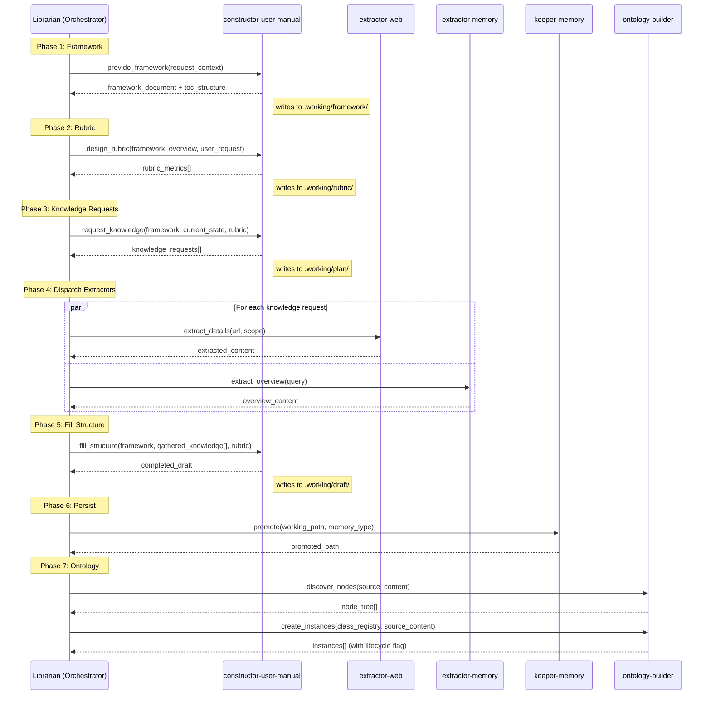
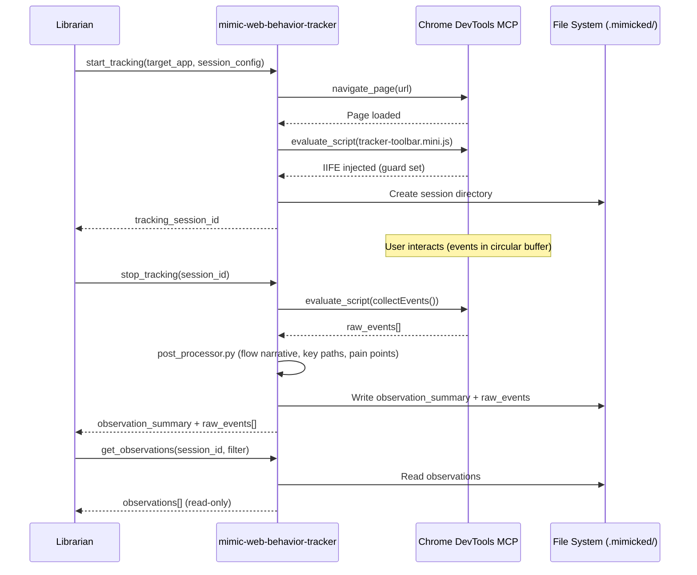
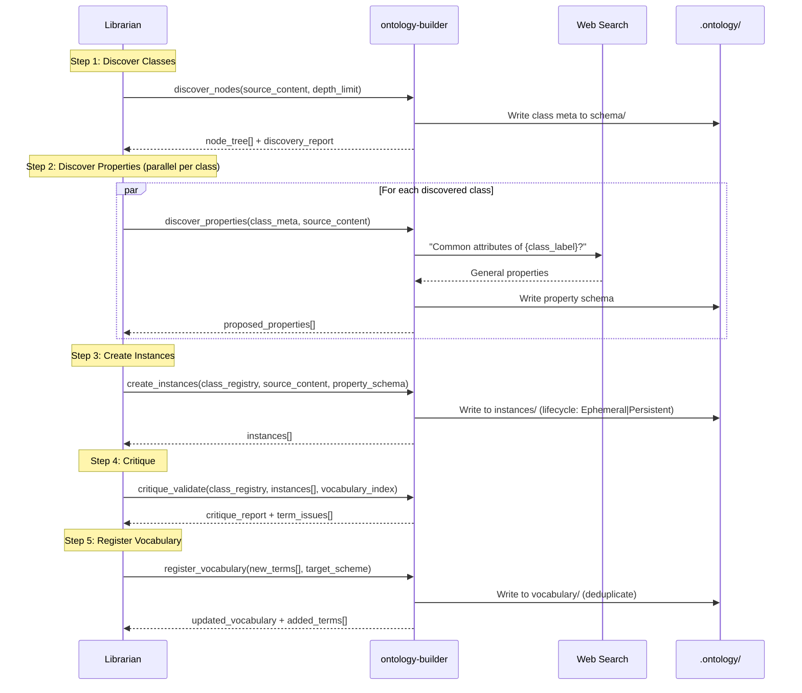
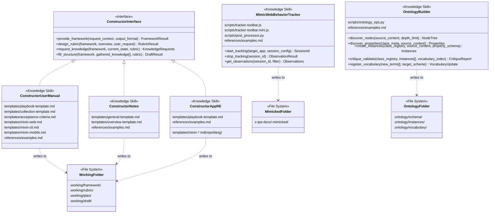

# Technical Design: Layer 2 — Domain Skills (Constructors + Mimic + Ontology-Builder)

> Feature ID: FEATURE-059-C | Version: v1.0 | Last Updated: 2026-04-16

---

## Part 1: Agent-Facing Summary

> **Purpose:** Quick reference for AI agents navigating large projects.
> **📌 AI Coders:** Focus on this section for implementation context.

### Key Components Implemented

| Component | Responsibility | Scope/Impact | Tags |
|-----------|----------------|--------------|------|
| `x-ipe-knowledge-constructor-user-manual` | Domain expert for user manual construction (4 ops: framework, rubric, request_knowledge, fill_structure) | Absorbs `x-ipe-tool-knowledge-extraction-user-manual` | #knowledge #constructor #user-manual #domain-expert |
| `x-ipe-knowledge-constructor-notes` | Domain expert for knowledge notes construction (same 4-op interface) | Absorbs `x-ipe-tool-knowledge-extraction-notes` | #knowledge #constructor #notes #domain-expert |
| `x-ipe-knowledge-constructor-app-reverse-engineering` | Domain expert for RE reports (same 4-op interface, delegates to `x-ipe-tool-rev-eng-*`) | Absorbs `x-ipe-tool-knowledge-extraction-application-reverse-engineering` | #knowledge #constructor #reverse-engineering #domain-expert |
| `x-ipe-knowledge-mimic-web-behavior-tracker` | Observe & record user behavior on websites via Chrome DevTools MCP | Absorbs `x-ipe-tool-learning-behavior-tracker-for-web`, writes to `x-ipe-docs/.mimicked/` | #knowledge #mimic #behavior-tracker #chrome-devtools |
| `x-ipe-knowledge-ontology-builder` | Discover classes, properties, instances from knowledge; register in `.ontology/` | Absorbs build ops from retired `x-ipe-tool-ontology`, writes directly to `.ontology/` with `lifecycle` flag | #knowledge #ontology #builder #graph |
| Deprecation headers (×4) | Add migration pointers to old tool skills | 4 old skills get deprecation banners | #deprecation #migration |

### Dependencies

| Dependency | Source | Design Link | Usage Description |
|------------|--------|-------------|-------------------|
| `x-ipe-knowledge` template | FEATURE-059-A | [technical-design.md](x-ipe-docs/requirements/EPIC-059/FEATURE-059-A/technical-design.md) | Template for all 5 SKILL.md files — Operations+Steps hybrid pattern |
| `x-ipe-knowledge-keeper-memory` | FEATURE-059-B | [technical-design.md](x-ipe-docs/requirements/EPIC-059/FEATURE-059-B/technical-design.md) | Constructors reference keeper-memory for promotion. Ontology-builder doesn't depend on it |
| `x-ipe-knowledge-extractor-web` | FEATURE-059-B | [technical-design.md](x-ipe-docs/requirements/EPIC-059/FEATURE-059-B/technical-design.md) | Constructors reference as `suggested_extractor` in `request_knowledge` output |
| `x-ipe-knowledge-extractor-memory` | FEATURE-059-B | [technical-design.md](x-ipe-docs/requirements/EPIC-059/FEATURE-059-B/technical-design.md) | Constructors reference as `suggested_extractor` in `request_knowledge` output |
| `x-ipe-meta-skill-creator` | Foundation | [SKILL.md](.github/skills/x-ipe-meta-skill-creator/SKILL.md) | Skill creation workflow — candidate → production merge |
| `x-ipe-tool-rev-eng-*` (8 sub-skills) | Existing | [SKILL.md](.github/skills/x-ipe-tool-rev-eng-api-contract-extraction/SKILL.md) | Referenced by constructor-app-RE for section-level extraction |
| `x-ipe-tool-learning-behavior-tracker-for-web` | Existing | [SKILL.md](.github/skills/x-ipe-tool-learning-behavior-tracker-for-web/SKILL.md) | Source for mimic migration — scripts/, IIFE, post-processor |
| `x-ipe-tool-ontology/scripts/ontology.py` | Existing | [SKILL.md](.github/skills/x-ipe-tool-ontology/SKILL.md) | Reference for JSONL format, entity CRUD patterns, validation logic |
| Chrome DevTools MCP | External | N/A | Runtime dependency for mimic (navigate_page, evaluate_script) |

### Major Flow

**Constructor Workflow (all 3 constructors share this):**
1. Librarian calls `provide_framework(request_context)` → constructor loads domain template → returns `framework_document` + `toc_structure` → written to `.working/framework/`
2. Librarian calls `design_rubric(framework, overview, user_request)` → constructor defines measurable criteria → returns `rubric_metrics[]` → written to `.working/rubric/`
3. Librarian calls `request_knowledge(framework, current_state, rubric)` → constructor identifies gaps → returns `knowledge_requests[]` (with `suggested_extractor`) → written to `.working/plan/`
4. Librarian dispatches extractors for each knowledge request → gathers knowledge
5. Librarian calls `fill_structure(framework, gathered_knowledge[], rubric)` → constructor maps knowledge to sections → returns `completed_draft` → written to `.working/draft/`
6. Librarian calls `keeper-memory.promote()` to persist the draft

**Mimic Workflow:**
1. Librarian calls `start_tracking(target_app, session_config)` → mimic navigates via Chrome DevTools → injects IIFE → returns `tracking_session_id` → session data in `x-ipe-docs/.mimicked/`
2. User interacts with the website (events captured in circular buffer)
3. Librarian calls `stop_tracking(session_id)` → events collected → post-processed → `observation_summary` + `raw_events[]` written to `x-ipe-docs/.mimicked/`
4. Librarian calls `get_observations(session_id, filter)` → read-only retrieval of observations

**Ontology-Builder Workflow:**
1. Librarian calls `discover_nodes(source_content, depth_limit)` → builder scans knowledge → returns `node_tree[]` → writes class meta to `.ontology/schema/`
2. Librarian dispatches parallel sub-agents: each calls `discover_properties(class_meta, source_content)` → web search + context analysis → returns `proposed_properties[]` → writes to `.ontology/schema/`
3. Librarian calls `create_instances(class_registry, source_content, property_schema)` → builder fills properties → writes instances to `.ontology/instances/` with `lifecycle` flag
4. Librarian calls `critique_validate(class_registry, instances[], vocabulary_index)` → sub-agent reviews → returns `critique_report` + `term_issues[]`
5. Librarian calls `register_vocabulary(new_terms[], target_scheme)` → builder adds terms to `.ontology/vocabulary/`

### Usage Example

```yaml
# Librarian calling constructor-user-manual.provide_framework
operation: provide_framework
context:
  request_context:
    app_name: "MyFlaskApp"
    app_type: "web"
    user_goal: "Create comprehensive user manual"
  output_format: "manual"
# Returns:
#   framework_document: { sections: [Overview, Getting Started, Features, ...], template: "user-manual-web" }
#   toc_structure: [{ id: "01", title: "Overview", stubs: [...] }, ...]

# Librarian calling constructor-user-manual.request_knowledge
operation: request_knowledge
context:
  framework: { ... }  # from provide_framework
  current_state: { filled_sections: ["01.Overview"], empty: ["02.Getting Started", "03.Features"] }
  rubric: { ... }  # from design_rubric
# Returns:
#   knowledge_requests:
#     - { target_section: "02", what_needed: "Setup instructions with prerequisites", suggested_extractor: "extractor-web" }
#     - { target_section: "03", what_needed: "List of app features from source code", suggested_extractor: "extractor-memory" }

# Librarian calling ontology-builder.create_instances
operation: create_instances
context:
  class_registry: [{ id: "web-framework", label: "WebFramework", ... }]
  source_content: "x-ipe-docs/memory/semantic/flask-jinja2-templating.md"
  property_schema: [{ name: "language", kind: "literal", range: "string" }, ...]
# Returns:
#   instances:
#     - { id: "inst-001", class: "web-framework", label: "Flask", language: "Python", lifecycle: "Persistent", synthesize_id: null, synthesize_message: null }
```

---

## Part 2: Implementation Guide

> **Purpose:** Human-readable details for developers.
> **📌 Emphasis on visual diagrams for comprehension.**

### Deliverables

| ID | Deliverable | Type | Path | ACs Covered |
|----|-------------|------|------|-------------|
| D1 | constructor-user-manual SKILL.md | Knowledge Skill | `.github/skills/x-ipe-knowledge-constructor-user-manual/SKILL.md` | AC-059C-01a, 02, 03, 04, 15 |
| D1t | constructor-user-manual templates/ | Templates | `.github/skills/x-ipe-knowledge-constructor-user-manual/templates/` | AC-059C-05a |
| D1r | constructor-user-manual references/ | Examples | `.github/skills/x-ipe-knowledge-constructor-user-manual/references/examples.md` | AC-059C-05d |
| D2 | constructor-notes SKILL.md | Knowledge Skill | `.github/skills/x-ipe-knowledge-constructor-notes/SKILL.md` | AC-059C-01b, 02, 03, 04, 15 |
| D2t | constructor-notes templates/ | Templates | `.github/skills/x-ipe-knowledge-constructor-notes/templates/` | AC-059C-05b |
| D2r | constructor-notes references/ | Examples | `.github/skills/x-ipe-knowledge-constructor-notes/references/examples.md` | AC-059C-05d |
| D3 | constructor-app-RE SKILL.md | Knowledge Skill | `.github/skills/x-ipe-knowledge-constructor-app-reverse-engineering/SKILL.md` | AC-059C-01c, 02, 03, 04, 15 |
| D3t | constructor-app-RE templates/ | Templates | `.github/skills/x-ipe-knowledge-constructor-app-reverse-engineering/templates/` | AC-059C-05c |
| D3r | constructor-app-RE references/ | Examples | `.github/skills/x-ipe-knowledge-constructor-app-reverse-engineering/references/examples.md` | AC-059C-05d |
| D4 | mimic-web-behavior-tracker SKILL.md | Knowledge Skill | `.github/skills/x-ipe-knowledge-mimic-web-behavior-tracker/SKILL.md` | AC-059C-06, 07, 08, 15 |
| D4s | mimic scripts/ | Python + JS | `.github/skills/x-ipe-knowledge-mimic-web-behavior-tracker/scripts/` | AC-059C-06, 07, 15d |
| D4r | mimic references/ | Examples | `.github/skills/x-ipe-knowledge-mimic-web-behavior-tracker/references/examples.md` | AC-059C-05d equivalent |
| D5 | ontology-builder SKILL.md | Knowledge Skill | `.github/skills/x-ipe-knowledge-ontology-builder/SKILL.md` | AC-059C-09–14, 15 |
| D5s | ontology-builder scripts/ | Python | `.github/skills/x-ipe-knowledge-ontology-builder/scripts/` | AC-059C-09c, 11, 13, 14, 15e |
| D5r | ontology-builder references/ | Examples | `.github/skills/x-ipe-knowledge-ontology-builder/references/examples.md` | AC-059C-05d equivalent |
| D6 | Deprecation: knowledge-extraction-user-manual | Edit | `.github/skills/x-ipe-tool-knowledge-extraction-user-manual/SKILL.md` | AC-059C-16a |
| D7 | Deprecation: knowledge-extraction-notes | Edit | `.github/skills/x-ipe-tool-knowledge-extraction-notes/SKILL.md` | AC-059C-16b |
| D8 | Deprecation: knowledge-extraction-app-RE | Edit | `.github/skills/x-ipe-tool-knowledge-extraction-application-reverse-engineering/SKILL.md` | AC-059C-16c |
| D9 | Deprecation: learning-behavior-tracker | Edit | `.github/skills/x-ipe-tool-learning-behavior-tracker-for-web/SKILL.md` | AC-059C-16d |

### Workflow Diagram — Librarian ↔ Domain Skills



### Workflow Diagram — Mimic Tracking Session



### Workflow Diagram — Ontology-Builder Pipeline



### Class Diagram — Skill Structure



---

### D1–D3: Constructor Skills (Shared 4-Operation Interface)

All three constructors implement the same 4-operation interface with domain-specific templates. The SKILL.md structure is identical — only the domain content differs.

**Common SKILL.md structure (x-ipe-knowledge template):**

```
SKILL.md
├── Purpose
├── Important Notes
├── About (domain description)
├── When to Use
├── Input Parameters (per-operation)
├── Definition of Ready
├── Operations
│   ├── Operation 1: provide_framework
│   │   ├── Contract (input/output/writes_to/constraints)
│   │   └── Steps (博学之→笃行之 backbone)
│   ├── Operation 2: design_rubric
│   ├── Operation 3: request_knowledge
│   └── Operation 4: fill_structure
├── Output Result
├── Definition of Done
├── Error Handling
└── Examples → references/examples.md
```

**Operation contracts (shared across all 3 constructors):**

```yaml
operation: provide_framework
input:
  request_context: dict          # {app_name, app_type, user_goal, source_paths[]}
  output_format: string          # Domain-specific format hint
output:
  framework_document: dict       # Complete structural outline
  toc_structure: object[]        # [{id, title, stubs, depth}]
writes_to: x-ipe-docs/memory/.working/framework/
constraints:
  - Load domain template from templates/ folder
  - Adapt template to request context (e.g., CLI app → add Commands section)
  - Return framework with section stubs (placeholder content)
```

```yaml
operation: design_rubric
input:
  framework: dict                # From provide_framework
  overview: string               # Overview/summary of the target app
  user_request: string           # Original user goal/emphasis
output:
  rubric_metrics: object[]       # [{section_id, criteria, weight, threshold}]
  acceptance_criteria: object[]  # [{section_id, checks[]}]
writes_to: x-ipe-docs/memory/.working/rubric/
constraints:
  - Per-section completeness criteria (measurable)
  - Per-section accuracy criteria
  - Weight by user emphasis (higher weight = higher priority for extraction)
```

```yaml
operation: request_knowledge
input:
  framework: dict                # From provide_framework
  current_state: dict            # {filled_sections[], empty_sections[], partial_sections[]}
  rubric: dict                   # From design_rubric
output:
  knowledge_requests: object[]   # [{target_section, what_needed, suggested_extractor, priority}]
writes_to: x-ipe-docs/memory/.working/plan/
constraints:
  - Walk framework sections, compare to current_state
  - For each gap, generate specific request (not vague)
  - suggested_extractor: "extractor-web" or "extractor-memory"
  - Prioritize by rubric weight (high-weight gaps first)
  - Return empty array if no gaps
```

```yaml
operation: fill_structure
input:
  framework: dict                # From provide_framework
  gathered_knowledge: object[]   # [{section_id, content, source, metadata}]
  rubric: dict                   # From design_rubric
output:
  completed_draft: string        # Full document mapped to framework
writes_to: x-ipe-docs/memory/.working/draft/
constraints:
  - Map gathered knowledge to framework sections
  - Mark incomplete sections with [INCOMPLETE: reason]
  - Validate against rubric criteria
  - Do NOT write to persistent memory (keeper-memory handles promotion)
```

#### D1: constructor-user-manual — Domain Specifics

**Domain template structure:** User manual with 8 standard sections:
1. Overview / Introduction
2. Getting Started (prerequisites, installation, first-use)
3. Core Features / Functionality
4. UI Walkthrough (web) / Commands (CLI) / Screens (mobile)
5. API Reference (if applicable)
6. Configuration & Customization
7. Troubleshooting & FAQ
8. Appendix / Glossary

**templates/ folder** — migrate and adapt from `x-ipe-tool-knowledge-extraction-user-manual/templates/`:

| File | Source | Adaptation |
|------|--------|------------|
| `playbook-template.md` | `x-ipe-tool-knowledge-extraction-user-manual/templates/playbook-template.md` | Rewrite as `provide_framework` input template. Keep 8-section layout |
| `collection-template.md` | Same source path | Rewrite as `request_knowledge` prompt templates per section |
| `acceptance-criteria.md` | Same source path | Rewrite as `design_rubric` criteria definitions per section |
| `mixin-web.md` | Same source path | App-type overlay for web apps (adds UI Walkthrough section) |
| `mixin-cli.md` | Same source path | App-type overlay for CLI apps (adds Commands section) |
| `mixin-mobile.md` | Same source path | App-type overlay for mobile apps (adds Screens section) |

#### D2: constructor-notes — Domain Specifics

**Domain template structure:** General knowledge notes with flexible hierarchy:
1. Overview (linked table of contents)
2. Key Insights / Main Sections (numbered: 01–99)
3. Sub-sections (nested: 0101–0199)
4. References (source URLs per section)

**templates/ folder** — migrate and adapt from `x-ipe-tool-knowledge-extraction-notes/templates/`:

| File | Source | Adaptation |
|------|--------|------------|
| `general-template.md` | `x-ipe-tool-knowledge-extraction-notes/templates/general-template.md` | Rewrite as `provide_framework` flexible template with numbered sections |
| `overview-template.md` | Same source path | Rewrite as overview generation template for `fill_structure` |

#### D3: constructor-app-reverse-engineering — Domain Specifics

**Domain template structure:** Reverse engineering report with 8 sections delegated to sub-skills:
1. Architecture Recovery → `x-ipe-tool-rev-eng-architecture-recovery`
2. API Contract Extraction → `x-ipe-tool-rev-eng-api-contract-extraction`
3. ... (6 more sections mapped to their respective sub-skills)

**templates/ folder** — migrate and adapt from `x-ipe-tool-knowledge-extraction-application-reverse-engineering/templates/`:

| File | Source | Adaptation |
|------|--------|------------|
| `playbook-template.md` | `x-ipe-tool-knowledge-extraction-application-reverse-engineering/templates/playbook-template.md` | Rewrite as `provide_framework` template mapping sections → sub-skills |
| `mixin-*.md` (all 10) | Same source folder (mixin-go, mixin-python, mixin-javascript, mixin-typescript, mixin-java, mixin-single-module, mixin-multi-module, mixin-monorepo, mixin-microservices) | Keep as-is — these are repo-type × language-type overlays for `provide_framework` adaptation |

**Key difference from other constructors:** The `request_knowledge` operation generates requests that may specify `x-ipe-tool-rev-eng-*` sub-skills as the extraction mechanism (not just extractor-web/extractor-memory). The Librarian dispatches to the appropriate sub-skill.

---

### D4: mimic-web-behavior-tracker

**Migration from `x-ipe-tool-learning-behavior-tracker-for-web`:**

The existing behavior tracker is a tool skill with 4 operations (inject, collect, stop, post_process). The new knowledge skill restructures into 3 operations (start_tracking, stop_tracking, get_observations) following the knowledge skill template.

**Folder structure:**
```
.github/skills/x-ipe-knowledge-mimic-web-behavior-tracker/
├── SKILL.md                    # Knowledge skill template (Operations+Steps)
├── scripts/
│   ├── tracker-toolbar.js      # Migrated from old skill — readable source
│   ├── tracker-toolbar.mini.js # Migrated from old skill — injection target
│   └── post_processor.py       # Migrated from old skill — generates flow narrative
└── references/
    └── examples.md             # Worked examples for each operation
```

**Operation contracts:**

```yaml
operation: start_tracking
input:
  target_app: string             # URL to track
  session_config:
    pii_whitelist: string[]      # CSS selectors to reveal (default: [])
    buffer_capacity: int         # Max events (default: 10000)
    purpose: string              # Tracking purpose (≤200 words, required)
output:
  tracking_session_id: string    # Unique session identifier
writes_to: x-ipe-docs/.mimicked/
constraints:
  - Navigate via Chrome DevTools MCP (navigate_page)
  - Inject tracker-toolbar.mini.js via evaluate_script
  - IIFE guard: window.__xipeBehaviorTrackerInjected prevents double injection
  - If guard already set → return existing session ID (no error)
  - PII masking: mask-everything default, whitelist opt-in, passwords NEVER revealed
  - Create session directory: x-ipe-docs/.mimicked/{session_id}/
```

```yaml
operation: stop_tracking
input:
  tracking_session_id: string
output:
  observation_summary: dict      # {flow_narrative, key_paths[], pain_points[], ai_annotations[]}
  raw_events: object[]           # Structured event records
writes_to: x-ipe-docs/.mimicked/
constraints:
  - Collect events via evaluate_script (call collectEvents on IIFE)
  - Run post_processor.py to generate observation_summary
  - Write summary + events to x-ipe-docs/.mimicked/{session_id}/
  - If session_id not found → error: SESSION_NOT_FOUND
```

```yaml
operation: get_observations
input:
  tracking_session_id: string
  filter: dict?                  # Optional: {event_type, time_range, element_selector}
output:
  observations: object[]
writes_to: null                  # READ-ONLY
constraints:
  - Read from x-ipe-docs/.mimicked/{session_id}/
  - Apply filter criteria if provided
  - If session_id not found → error: SESSION_NOT_FOUND
```

**Script migration notes:**
- `tracker-toolbar.js` / `tracker-toolbar.mini.js` — Copy as-is from old skill. The JavaScript IIFE is browser-injected and doesn't depend on skill namespace.
- `post_processor.py` — Copy from old skill. Adjust import paths if needed. The processor generates flow narrative, key paths, pain points, and AI annotations from raw events.
- Old `track_behavior.py` — NOT migrated. Its orchestration logic is now handled by the SKILL.md operation steps.

---

### D5: ontology-builder

**New skill that absorbs build/CRUD capabilities from retired `x-ipe-tool-ontology`.**

**Folder structure:**
```
.github/skills/x-ipe-knowledge-ontology-builder/
├── SKILL.md                    # Knowledge skill template (5 operations)
├── scripts/
│   └── ontology_ops.py         # JSONL write utilities (entity, class, vocabulary)
└── references/
    └── examples.md             # Worked examples for each operation
```

**ontology_ops.py — New script for ontology writes:**

This script provides low-level JSONL operations for the ontology-builder SKILL.md to delegate to. It draws patterns from the existing `x-ipe-tool-ontology/scripts/ontology.py` (825 lines) but is simplified to handle only the operations the builder needs.

| Command | Purpose | Target File |
|---------|---------|-------------|
| `register_class` | Add/update class meta entry | `.ontology/schema/class-registry.jsonl` |
| `add_properties` | Add property definitions to a class | `.ontology/schema/class-registry.jsonl` (properties field) |
| `create_instance` | Create entity instance with properties + lifecycle | `.ontology/instances/instance.NNN.jsonl` |
| `add_vocabulary` | Add term to vocabulary scheme | `.ontology/vocabulary/{scheme}.json` |
| `validate_terms` | Check terms against vocabulary index | `.ontology/vocabulary/` (read-only) |

**Key design decisions:**

1. **Direct writes to `.ontology/`** — Unlike constructors that write to `.working/`, ontology-builder writes directly to `.ontology/` because ontology data IS the persistent structure. There's no "staging" for ontology entries.

2. **Lifecycle flag** — Every entity instance includes a `lifecycle` field:
   - `"Ephemeral"` — entity references `.working/` content (may be cleaned up)
   - `"Persistent"` — entity references persistent memory (`semantic/`, `procedural/`, `episodic/`)
   
   The builder determines lifecycle by inspecting `source_files[]` paths:
   ```python
   def determine_lifecycle(source_files: list[str]) -> str:
       for path in source_files:
           if ".working/" in path:
               return "Ephemeral"
       return "Persistent"
   ```

3. **Synthesize tracking** — Every class meta and instance record includes two fields for ontology-synthesizer traceability:
   - `synthesize_id` — ISO-8601 timestamp of the last synthesizer run (e.g., `"20260416T031759Z"`). Set by ontology-synthesizer when it processes the record. `null` means never synthesized.
   - `synthesize_message` — Free-text reason/purpose for the synthesize run (e.g., `"Initial relationship discovery for Flask ecosystem"`). Helps determine whether a re-run is needed (if the purpose has changed or new source content was added).
   
   The builder sets both fields to `null` on creation. The synthesizer (FEATURE-059-D) populates them on each run.

4. **JSONL append-only format** — Follows existing pattern from `ontology.py`:
   ```jsonl
   {"op":"create","type":"KnowledgeNode","id":"web-framework","ts":"2026-04-16T...","props":{"label":"WebFramework","description":"Web application frameworks","source_files":["semantic/flask.md"],"weight":5,"lifecycle":"Persistent","synthesize_id":null,"synthesize_message":null}}
   ```

5. **Chunk management** — `ontology_ops.py` handles instance chunk rotation. When `instance.NNN.jsonl` exceeds 5000 lines, the script creates `instance.{NNN+1}.jsonl` and updates `_index.json`.

6. **Vocabulary deduplication** — `add_vocabulary` checks existing terms before adding. Uses `broader`/`narrower` hierarchy from SKOS-like structure.

---

#### Complete Meta Field Reference

**JSONL Event Envelope** (wrapper for all records):

| Field | Type | Description |
|-------|------|-------------|
| `op` | `"create" \| "update" \| "delete"` | Event-sourcing operation type |
| `type` | `string` | Entity type (e.g., `"KnowledgeNode"`) |
| `id` | `string` | Unique record identifier. Classes use kebab-case slug of the label (e.g., `"web-framework"`). Instances use `"inst-"` prefix with sequential number (e.g., `"inst-001"`) |
| `ts` | `ISO-8601` | Timestamp of this event |
| `props` | `object` | Record properties (see below) |

**Class Meta** (in `.ontology/schema/class-registry.jsonl`):

| Field | Type | Required | Set By | Description |
|-------|------|----------|--------|-------------|
| `label` | `string` | ✅ | Builder | Human-readable class name (e.g., `"WebFramework"`) |
| `description` | `string` | ✅ | Builder | What this class represents |
| `source_files` | `string[]` | ✅ | Builder | Paths to source knowledge files |
| `weight` | `int (1–10)` | ❌ (default: 5) | Builder | Importance score |
| `parent` | `string \| null` | ❌ | Builder | Parent class ID (for hierarchy) |
| `properties` | `object[]` | ❌ | Builder | Property schema definitions `[{name, kind, range, cardinality, vocabulary_scheme?}]` |
| `lifecycle` | `"Ephemeral" \| "Persistent"` | ✅ | Builder | Derived from `source_files` paths |
| `synthesize_id` | `ISO-8601 \| null` | ✅ | Synthesizer | Timestamp of last synthesizer run (`null` = never synthesized) |
| `synthesize_message` | `string \| null` | ✅ | Synthesizer | Purpose/reason for the synthesize run (`null` = never synthesized) |

**Instance Data** (in `.ontology/instances/instance.NNN.jsonl`):

| Field | Type | Required | Set By | Description |
|-------|------|----------|--------|-------------|
| `label` | `string` | ✅ | Builder | Human-readable instance name (e.g., `"Flask"`) |
| `class` | `string` | ✅ | Builder | Class ID reference — kebab-case slug (e.g., `"web-framework"`) |
| `source_files` | `string[]` | ✅ | Builder | Paths to source knowledge files |
| `lifecycle` | `"Ephemeral" \| "Persistent"` | ✅ | Builder | Derived from `source_files` paths |
| `synthesize_id` | `ISO-8601 \| null` | ✅ | Synthesizer | Timestamp of last synthesizer run (`null` = never synthesized) |
| `synthesize_message` | `string \| null` | ✅ | Synthesizer | Purpose/reason for the synthesize run (`null` = never synthesized) |
| `{prop_name}` | `varies` | ❌ | Builder | Dynamic properties from class property schema (e.g., `language: "Python"`) — `null` if N/A |

**Vocabulary Term** (in `.ontology/vocabulary/{scheme}.json`):

| Field | Type | Required | Set By | Description |
|-------|------|----------|--------|-------------|
| `label` | `string` | ✅ | Builder | Canonical term label |
| `broader` | `string \| null` | ❌ | Builder | Parent term (SKOS hierarchy) |
| `narrower` | `string[]` | ❌ | Builder | Child terms (SKOS hierarchy) |

**Operation contracts:**

```yaml
operation: discover_nodes
input:
  source_content: string[]       # Paths to semantic/procedural memory files
  depth_limit: int               # Max hierarchy depth (default: 3)
output:
  node_tree: object[]            # [{label, description, source_files[], parent?, children[]}]
  discovery_report: string       # Summary of what was found
writes_to: x-ipe-docs/memory/.ontology/schema/
delegates_to: scripts/ontology_ops.py register_class
constraints:
  - Breadth-first scan of source content
  - Identify top-level classes/concepts (nouns, domain terms)
  - For each class, create meta entry via register_class
  - Depth-limited to avoid over-fragmentation
```

```yaml
operation: discover_properties
input:
  class_meta: dict               # {id, label, description, source_files[]}
  source_content: string[]       # Content to analyze
  web_search_template: string    # "What are common attributes of a {class_label}?"
output:
  proposed_properties: object[]  # [{name, kind, range, cardinality, vocabulary_scheme?}]
  search_results: string         # Raw web search findings
writes_to: x-ipe-docs/memory/.ontology/schema/
delegates_to: scripts/ontology_ops.py add_properties
constraints:
  - Step 1: Web search for general attributes (configurable template)
  - Step 2: Context-specific analysis from source content
  - Step 3: Propose property schema
  - Vocabulary-linked properties must reference existing scheme
```

```yaml
operation: create_instances
input:
  class_registry: object[]       # [{id, label, properties[]}]
  source_content: string[]       # Memory file paths
  property_schema: object[]      # From discover_properties
output:
  instances: object[]            # [{id, class, label, props, lifecycle}]
writes_to: x-ipe-docs/memory/.ontology/instances/
delegates_to: scripts/ontology_ops.py create_instance
constraints:
  - For each entity found in source, create instance
  - Fill all properties (null if N/A)
  - Set lifecycle based on source_files paths (Ephemeral if .working/, else Persistent)
  - Handle chunk rotation if instance file exceeds 5000 lines
```

```yaml
operation: critique_validate
input:
  class_registry: object[]
  instances: object[]
  vocabulary_index: dict         # From .ontology/vocabulary/
output:
  critique_report: dict          # {accuracy_score, completeness_score, suggestions[]}
  term_issues: object[]          # [{term, issue, suggestion}]
writes_to: x-ipe-docs/memory/.ontology/  # Feedback file only
constraints:
  - Sub-agent reviews property accuracy
  - Check term consistency with vocabulary
  - Flag unknown terms → suggest register_vocabulary
  - Provide constructive feedback (not just errors)
```

```yaml
operation: register_vocabulary
input:
  new_terms: object[]            # [{label, broader?, narrower?[], scheme}]
  target_scheme: string          # e.g., "technology", "domain-concepts"
output:
  updated_vocabulary: dict       # Updated scheme contents
  added_terms: string[]          # Labels of newly added terms
writes_to: x-ipe-docs/memory/.ontology/vocabulary/
delegates_to: scripts/ontology_ops.py add_vocabulary
constraints:
  - Deduplicate: skip terms already in scheme
  - Maintain broader/narrower hierarchy
  - If scheme file doesn't exist, create it
```

---

### D6–D9: Deprecation Headers

Each old skill gets a deprecation banner at the top of its SKILL.md, following the same pattern used for `x-ipe-tool-ontology` in 059-B.

**Template:**
```markdown
---
name: {old-skill-name}
description: "⚠️ DEPRECATED — Migrated to {new-skill-name} (FEATURE-059-C). Use the new knowledge skill instead."
---

> **⚠️ DEPRECATED:** This skill has been superseded by [`{new-skill-name}`](.github/skills/{new-skill-name}/SKILL.md).
> Migrate to the new skill for continued support.
```

**Mapping:**

| Old Skill | New Skill | Deliverable |
|-----------|-----------|-------------|
| `x-ipe-tool-knowledge-extraction-user-manual` | `x-ipe-knowledge-constructor-user-manual` | D6 |
| `x-ipe-tool-knowledge-extraction-notes` | `x-ipe-knowledge-constructor-notes` | D7 |
| `x-ipe-tool-knowledge-extraction-application-reverse-engineering` | `x-ipe-knowledge-constructor-app-reverse-engineering` | D8 |
| `x-ipe-tool-learning-behavior-tracker-for-web` | `x-ipe-knowledge-mimic-web-behavior-tracker` | D9 |

---

### Implementation Notes

**program_type:** `skills` — All deliverables are agent skill definitions (SKILL.md, templates, prompt engineering). Python scripts in D4s and D5s are supporting utilities.

**tech_stack:** `["Markdown/SKILL.md", "Python", "JavaScript (IIFE)"]`

**Skill creation workflow:**
1. All 5 skills created via `x-ipe-meta-skill-creator` (candidate → validate → merge)
2. Candidate files go to `x-ipe-docs/skill-meta/{skill-name}/candidate/`
3. After validation, merge to `.github/skills/{skill-name}/`
4. Each skill gets a `skill-meta.md` in `x-ipe-docs/skill-meta/{skill-name}/`

**Constructor template migration:** Templates are ADAPTED, not copy-pasted. The old templates were designed for a different operation model (direct extraction). The new templates support the 4-operation constructor pattern:
- `playbook-template.md` → `provide_framework` structural input
- `collection-template.md` → `request_knowledge` prompt patterns
- `acceptance-criteria.md` → `design_rubric` criteria definitions
- `mixin-*.md` → `provide_framework` adaptation overlays (these can stay mostly as-is)

**Mimic script migration:** `tracker-toolbar.js`, `tracker-toolbar.mini.js`, and `post_processor.py` are copied from the old skill with minimal changes. The JavaScript IIFE is browser-injected and namespace-independent. `track_behavior.py` is NOT migrated — its orchestration logic is replaced by the SKILL.md operation steps.

**Ontology JSONL format** — Follows existing `ontology.py` event-sourcing pattern:
```jsonl
{"op":"create","type":"KnowledgeNode","id":"web-framework","ts":"ISO-8601","props":{"label":"WebFramework","description":"Web application frameworks","source_files":["semantic/flask.md"],"weight":5,"lifecycle":"Persistent","synthesize_id":null,"synthesize_message":null}}
{"op":"update","type":"KnowledgeNode","id":"web-framework","ts":"ISO-8601","props":{"synthesize_id":"20260416T031759Z","synthesize_message":"Initial relationship discovery"}}
```
The `lifecycle`, `synthesize_id`, and `synthesize_message` fields are added to the `props` alongside existing fields (`label`, `source_files`, `weight`, etc.). Builder sets `synthesize_id`/`synthesize_message` to `null`; the synthesizer (059-D) populates them.

---

### Design Change Log

| Version | Date | Changes |
|---------|------|---------|
| v1.0 | 2026-04-16 | Initial design |
| v1.1 | 2026-04-16 | Added `synthesize_id` and `synthesize_message` fields to class meta and instance data; added Complete Meta Field Reference tables |
