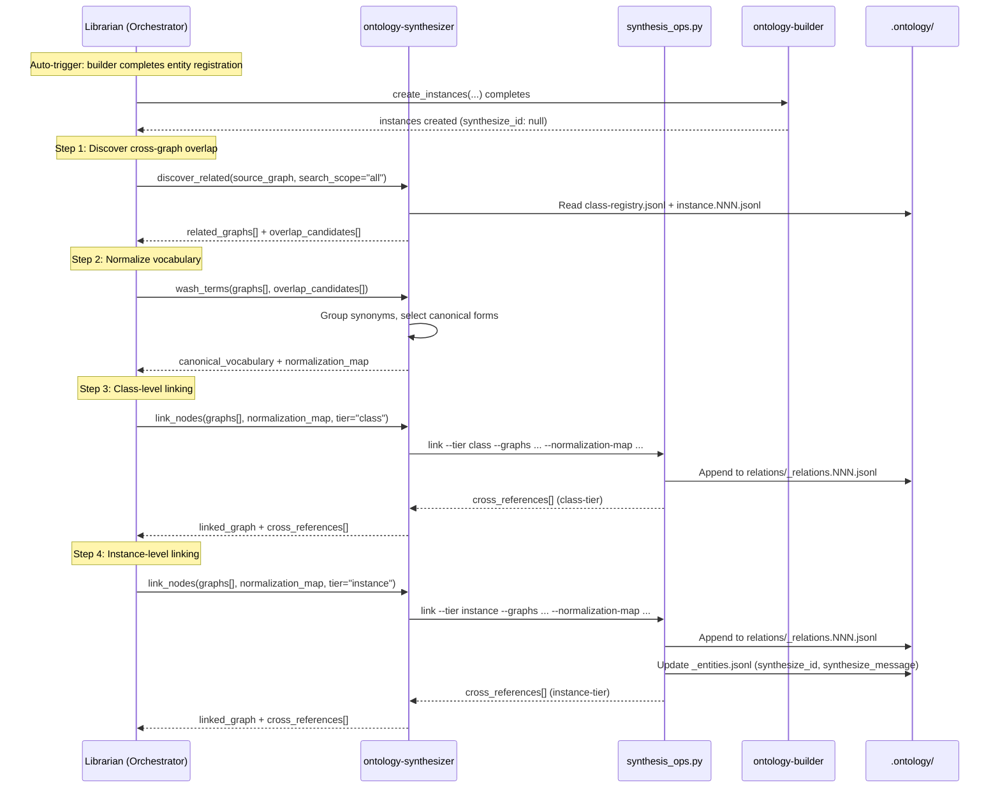
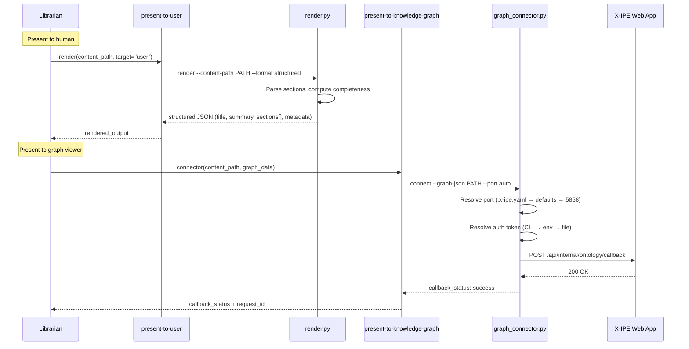
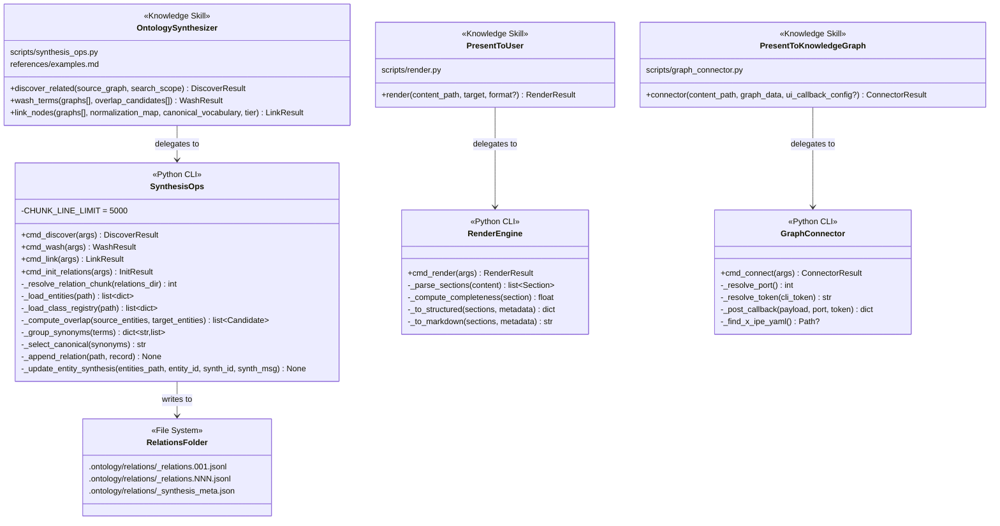
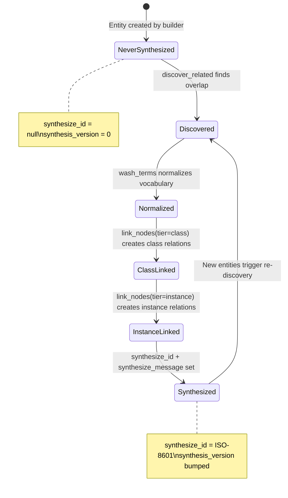

# Technical Design: Layer 3 — Integration Skills (Ontology Synthesizer + Presenters)

> Feature ID: FEATURE-059-D | Version: v1.0 | Last Updated: 2026-04-16

---

## Part 1: Agent-Facing Summary

> **Purpose:** Quick reference for AI agents navigating large projects.
> **📌 AI Coders:** Focus on this section for implementation context.

### Key Components Implemented

| Component | Responsibility | Scope/Impact | Tags |
|-----------|----------------|--------------|------|
| `x-ipe-knowledge-ontology-synthesizer` | Cross-graph integration: discover related graphs, normalize vocabulary, link nodes (class-tier → instance-tier) | Creates `_relations.NNN.jsonl` in `.ontology/relations/`, updates entity `synthesize_id`/`synthesize_message` | #knowledge #ontology #synthesizer #cross-graph #relations #vocabulary |
| `x-ipe-knowledge-present-to-user` | Render constructed knowledge as structured summary for human consumption | Read-only; outputs JSON or Markdown | #knowledge #presenter #render #summary |
| `x-ipe-knowledge-present-to-knowledge-graph` | Push ontology graph data to X-IPE web app via Socket.IO callback | HTTP POST to `/api/internal/ontology/callback` | #knowledge #presenter #graph #socket-io #connector |
| `synthesis_ops.py` | CLI engine for synthesizer JSONL operations (discover, wash, link, init) | `.ontology/relations/` write path | #script #synthesis #jsonl #relations |
| `render.py` | CLI engine for rendering knowledge files to structured output | Read-only; stdout output | #script #render #knowledge |
| `graph_connector.py` | CLI engine for posting graph data to X-IPE web app with port/auth resolution | HTTP POST with retry | #script #connector #port-resolution |

### Dependencies

| Dependency | Source | Design Link | Usage Description |
|------------|--------|-------------|-------------------|
| `x-ipe-knowledge` template | FEATURE-059-A | [technical-design.md](x-ipe-docs/requirements/EPIC-059/FEATURE-059-A/technical-design.md) | Template for all 3 SKILL.md files — Operations+Steps hybrid pattern |
| `x-ipe-knowledge-ontology-builder` | FEATURE-059-C | [technical-design.md](x-ipe-docs/requirements/EPIC-059/FEATURE-059-C/technical-design.md) | Creates entities/classes that synthesizer integrates. Defines JSONL format, `synthesize_id`/`synthesize_message` fields, chunk management |
| `ontology_ops.py` | FEATURE-059-C | [ontology_ops.py](.github/skills/x-ipe-knowledge-ontology-builder/scripts/ontology_ops.py) | Reference for JSONL helpers (`_append_jsonl`, `_resolve_chunk`, `_count_lines`, `_slugify`). Synthesizer's `synthesis_ops.py` reuses the same patterns |
| `x-ipe-knowledge-keeper-memory` | FEATURE-059-B | [technical-design.md](x-ipe-docs/requirements/EPIC-059/FEATURE-059-B/technical-design.md) | Presenter reads knowledge files stored by keeper |
| `x-ipe-tool-ontology/scripts/ui-callback.py` | FEATURE-058-F | [ui-callback.py](.github/skills/x-ipe-tool-ontology/scripts/ui-callback.py) | Reference for `graph_connector.py` — payload format, auth resolution, retry pattern |
| `x-ipe-meta-skill-creator` | Foundation | [SKILL.md](.github/skills/x-ipe-meta-skill-creator/SKILL.md) | Skill creation workflow — candidate → production merge |
| PyYAML | External | N/A | Port resolution reads `.x-ipe.yaml` configuration files |

### Major Flow

**Synthesizer Pipeline (Librarian-orchestrated):**
1. Librarian calls `discover_related(source_graph, search_scope)` → synthesizer scans for overlapping entities → returns `related_graphs[]` + `overlap_candidates[]`
2. Librarian calls `wash_terms(graphs[], overlap_candidates[])` → normalizes vocabulary → returns `canonical_vocabulary` + `normalization_map`
3. Librarian calls `link_nodes(graphs[], normalization_map, canonical_vocabulary, tier="class")` → creates class-level cross-domain relationships → returns `linked_graph` + `cross_references[]`
4. Librarian calls `link_nodes(graphs[], normalization_map, canonical_vocabulary, tier="instance")` → creates instance-level relationships constrained by class links → vocabulary translation applied → returns `linked_graph` + `cross_references[]`
5. After each `link_nodes` run: entity `synthesize_id`/`synthesize_message` updated, `synthesis_version` bumped

**Auto-trigger:** After ontology-builder registers new entities, the Librarian dispatches `discover_related` automatically (the builder completion is the trigger event for the Librarian to call the synthesizer).

**Present-to-User:**
1. Librarian calls `render(content_path, target="user")` → reads knowledge file → parses sections → returns structured summary (JSON default, Markdown if requested)

**Present-to-Knowledge-Graph:**
1. Librarian calls `connector(content_path, graph_data)` → resolves port from `.x-ipe.yaml` → resolves auth token → POSTs to `/api/internal/ontology/callback` → retries once on failure

### Usage Example

```yaml
# Librarian calling ontology-synthesizer.discover_related
operation: discover_related
context:
  source_graph: "x-ipe-docs/memory/.ontology/instances/instance.001.jsonl"
  search_scope: "all"
# Returns:
#   related_graphs: ["x-ipe-docs/memory/.ontology/instances/instance.002.jsonl"]
#   overlap_candidates:
#     - { source_id: "web-framework", target_id: "web-app-framework", graph_source: "instance.001", graph_target: "instance.002", confidence_score: 0.85 }

# Librarian calling ontology-synthesizer.wash_terms
operation: wash_terms
context:
  graphs: ["instance.001.jsonl", "instance.002.jsonl"]
  overlap_candidates: [{ source_id: "web-framework", target_id: "web-app-framework", ... }]
# Returns:
#   canonical_vocabulary: [{ label: "WebFramework", id: "web-framework" }]
#   normalization_map:
#     - { original_term: "web-app-framework", canonical_term: "web-framework", source_graph: "instance.002", confidence: 0.9 }

# Librarian calling ontology-synthesizer.link_nodes (class-tier)
operation: link_nodes
context:
  graphs: ["instance.001.jsonl", "instance.002.jsonl"]
  normalization_map: [...]
  canonical_vocabulary: [...]
  tier: "class"
# Returns:
#   linked_graph: { nodes: [...], edges: [...] }
#   cross_references:
#     - { from_id: "web-framework", to_id: "web-app-framework", relation_type: "related_to", source_graph: "instance.001", target_graph: "instance.002", synthesis_version: 1 }

# Librarian calling present-to-user.render
operation: render
context:
  content_path: "x-ipe-docs/memory/semantic/flask-jinja2-templating.md"
  target: "user"
# Returns:
#   rendered_output: { title: "Flask Jinja2 Templating", summary: "...", sections: [...], metadata: {...} }

# Librarian calling present-to-knowledge-graph.connector
operation: connector
context:
  content_path: "x-ipe-docs/memory/.ontology/instances/instance.001.jsonl"
  graph_data: { nodes: [{id: "web-framework", label: "WebFramework"}], edges: [{from: "web-framework", to: "flask", type: "has_instance"}] }
# Returns:
#   callback_status: "success"
#   request_id: "abc-123"
```

---

## Part 2: Implementation Guide

> **Purpose:** Human-readable details for developers.
> **📌 Emphasis on visual diagrams for comprehension.**

### Deliverables

| ID | Deliverable | Type | Path | ACs Covered |
|----|-------------|------|------|-------------|
| D1 | ontology-synthesizer SKILL.md | Knowledge Skill | `.github/skills/x-ipe-knowledge-ontology-synthesizer/SKILL.md` | AC-059D-01 through 07 |
| D1s | synthesis_ops.py | Python Script | `.github/skills/x-ipe-knowledge-ontology-synthesizer/scripts/synthesis_ops.py` | AC-059D-01, 02, 03, 04, 05, 06, 07 |
| D1r | synthesizer references/ | Examples | `.github/skills/x-ipe-knowledge-ontology-synthesizer/references/examples.md` | AC-059D cross-linking scenarios |
| D2 | present-to-user SKILL.md | Knowledge Skill | `.github/skills/x-ipe-knowledge-present-to-user/SKILL.md` | AC-059D-08 |
| D2s | render.py | Python Script | `.github/skills/x-ipe-knowledge-present-to-user/scripts/render.py` | AC-059D-08 |
| D3 | present-to-knowledge-graph SKILL.md | Knowledge Skill | `.github/skills/x-ipe-knowledge-present-to-knowledge-graph/SKILL.md` | AC-059D-09, 10 |
| D3s | graph_connector.py | Python Script | `.github/skills/x-ipe-knowledge-present-to-knowledge-graph/scripts/graph_connector.py` | AC-059D-09, 10 |

### Workflow Diagram — Synthesizer Pipeline



### Workflow Diagram — Presenter Skills



### Class Diagram — Skill & Script Structure



### State Diagram — Synthesis Version Lifecycle



---

### D1: ontology-synthesizer

**Folder structure:**
```
.github/skills/x-ipe-knowledge-ontology-synthesizer/
├── SKILL.md                    # Knowledge skill template (3 operations)
├── scripts/
│   └── synthesis_ops.py        # CLI engine: discover, wash, link, init_relations
└── references/
    └── examples.md             # Cross-graph linking scenarios
```

**synthesis_ops.py — CLI Commands:**

| Command | Purpose | Reads From | Writes To |
|---------|---------|------------|-----------|
| `discover` | Scan for cross-graph overlap | `.ontology/schema/class-registry.jsonl`, `.ontology/instances/instance.NNN.jsonl` | stdout (JSON result) |
| `wash` | Normalize vocabulary terms | stdin or `--candidates-json` file | stdout (JSON result) |
| `link` | Create cross-domain relations | `.ontology/schema/`, `.ontology/instances/`, `--normalization-map` | `.ontology/relations/_relations.NNN.jsonl`, `.ontology/instances/` (entity updates) |
| `init_relations` | Bootstrap empty relations file | `.ontology/relations/` | `.ontology/relations/_relations.001.jsonl` |

**synthesis_ops.py — Design Details:**

The script follows the same patterns as `ontology_ops.py` (412 lines):
- Same `_append_jsonl()` helper with `fcntl` file locking
- Same JSONL event-sourcing envelope: `{op, type, id, ts, props}`
- Same `CHUNK_LINE_LIMIT = 5000` for relation chunk rotation
- Same `_count_lines()` / `_resolve_chunk()` pattern for chunk management
- JSON to stdout on success; JSON to stderr + exit 1 on error

**Estimated size:** ~500 lines (within 800-line threshold).

#### discover command

```
python3 synthesis_ops.py discover \
  --ontology-dir PATH \
  --source-graph PATH \
  --search-scope "all" | "GRAPH_PATH[,GRAPH_PATH,...]"
```

**Algorithm:**
1. Load source graph: read class-registry.jsonl and/or instance files to extract entity labels + class IDs
2. For each target graph in scope:
   - Load target entities (same approach)
   - Compare source labels/class IDs against target labels/class IDs (case-insensitive, slug-normalized)
   - For each overlap: create `overlap_candidate` with `{source_id, target_id, graph_source, graph_target, confidence_score}`
   - Confidence score: 1.0 for exact match, 0.8 for slug-match (different casing), 0.6 for substring overlap
3. Return `{related_graphs: [...], overlap_candidates: [...]}`

**Data flow:**
```
.ontology/schema/class-registry.jsonl  ──→ [discover] ──→ stdout JSON
.ontology/instances/instance.NNN.jsonl ──↗
```

#### wash command

```
python3 synthesis_ops.py wash \
  --ontology-dir PATH \
  --candidates-json PATH_OR_STDIN
```

**Algorithm:**
1. Load overlap candidates from input
2. Collect all entity labels from involved graphs
3. Group synonyms using:
   - Case-insensitive match ("flask" = "Flask" = "FLASK")
   - Slug normalization ("web-framework" = "WebFramework" = "web_framework")
   - Abbreviation expansion if detectable ("JS" ↔ "JavaScript" — uses a small built-in abbreviation table)
4. For each synonym group, select canonical form:
   - Prefer most descriptive (longest non-abbreviation)
   - If tied, prefer title case
5. Preserve SKOS broader/narrower hierarchy from vocabulary files
6. Return `{canonical_vocabulary: [...], normalization_map: [...]}`

Each `normalization_map` entry: `{original_term, canonical_term, source_graph, confidence}`

#### link command

```
python3 synthesis_ops.py link \
  --ontology-dir PATH \
  --tier "class" | "instance" \
  --normalization-map-json PATH \
  --canonical-vocab-json PATH \
  --graphs GRAPH_PATH[,GRAPH_PATH,...] \
  [--dry-run]
```

**Algorithm (class tier):**
1. Load normalization map and canonical vocabulary
2. For each pair of graphs:
   - Load class labels from both graphs
   - Apply normalization map to both sides
   - For each matching canonical class across graphs: create `related_to` relation
3. Before writing: check existing relations for duplicates (same from_id + to_id + relation_type) → skip duplicates
4. Append new relations to `_relations.NNN.jsonl` using chunk rotation
5. Bump `synthesis_version` in `_synthesis_meta.json`
6. Return `{linked_graph, cross_references[]}`

**Algorithm (instance tier):**
1. Load existing class-level relations
2. For each class-level relation: identify instances of both linked classes
3. Apply normalization map to instance labels (vocabulary translation)
4. Match instances by normalized labels/properties
5. Create instance-level relations only between instances whose classes are linked (BR-1 enforcement)
6. Append to `_relations.NNN.jsonl`
7. For each processed entity: append `update` event to source entity file with `synthesize_id` (ISO-8601 timestamp) and `synthesize_message`
8. Update `_synthesis_meta.json`: bump `synthesis_version`, record `synthesized_with` graphs
9. Return `{linked_graph, cross_references[]}`

**Relation record format:**
```jsonl
{"op":"create","type":"Relation","id":"rel-001","ts":"2026-04-16T04:00:00Z","props":{"from_id":"web-framework","to_id":"web-app-framework","relation_type":"related_to","source_graph":"instance.001","target_graph":"instance.002","synthesis_version":1,"synthesized_with":["instance.001.jsonl","instance.002.jsonl"]}}
```

**Entity synthesis update format:**
```jsonl
{"op":"update","type":"KnowledgeNode","id":"web-framework","ts":"2026-04-16T04:00:00Z","props":{"synthesize_id":"2026-04-16T04:00:00Z","synthesize_message":"Cross-domain linking: WebFramework ↔ WebAppFramework"}}
```

#### init_relations command

```
python3 synthesis_ops.py init_relations --ontology-dir PATH
```

- If `_relations.001.jsonl` does not exist → create empty file
- If it exists → exit 0, print "Relations already initialized"

#### Chunk rotation and metadata

**`_relations.NNN.jsonl`** — Same chunk rotation as `instance.NNN.jsonl`:
- Max 5000 records per chunk
- New chunk created when current exceeds limit
- `_resolve_relation_chunk()` mirrors `_resolve_chunk()` from `ontology_ops.py`

**`_synthesis_meta.json`** — Per-relations-folder metadata:
```json
{
  "synthesis_version": 3,
  "last_run": "2026-04-16T04:00:00Z",
  "synthesized_with": ["instance.001.jsonl", "instance.002.jsonl"],
  "total_relations": 47
}
```

**Relation ID generation:** Sequential `rel-NNN` format (same pattern as `inst-NNN` in `ontology_ops.py`). Scans existing chunks for highest `rel-` ID and increments. Uses file locking to prevent race conditions.

#### Folder structure impact on .ontology/

```
.ontology/
├── schema/
│   └── class-registry.jsonl      # Read by synthesizer (discover)
├── instances/
│   ├── instance.001.jsonl         # Read by synthesizer (discover), written to (synthesis updates)
│   ├── instance.NNN.jsonl
│   └── _index.json
├── vocabulary/
│   ├── {scheme}.json              # Read by synthesizer (wash)
│   └── _index.json
└── relations/                     # NEW — created by synthesizer
    ├── _relations.001.jsonl       # Chunked relation records
    ├── _relations.NNN.jsonl
    └── _synthesis_meta.json       # Version + audit metadata
```

---

### D2: present-to-user

**Folder structure:**
```
.github/skills/x-ipe-knowledge-present-to-user/
├── SKILL.md                    # Knowledge skill template (1 operation: render)
└── scripts/
    └── render.py               # CLI engine for knowledge rendering
```

**render.py — CLI Interface:**

```
python3 render.py render \
  --content-path PATH \
  --format "structured" | "markdown"
```

**Algorithm:**
1. Read file at `content_path`; exit with `CONTENT_NOT_FOUND` if missing
2. Parse content into sections by Markdown headers (`## heading`)
3. For each section:
   - Extract heading, content text
   - Count `[INCOMPLETE: ...]` markers
   - Compute `completeness` percentage: `(total_chars - incomplete_chars) / total_chars`
   - If incomplete markers found, flag section with `warnings[]`
4. Build metadata: file path, total sections, overall completeness, generation timestamp
5. If format is `structured` (default):
   ```json
   {
     "title": "Flask Jinja2 Templating",
     "summary": "First 200 chars or first paragraph...",
     "sections": [
       { "heading": "Overview", "content": "...", "completeness": 100 },
       { "heading": "Setup", "content": "...", "completeness": 75, "warnings": ["INCOMPLETE: missing prerequisites"] }
     ],
     "metadata": { "source_path": "...", "total_sections": 5, "overall_completeness": 87, "generated_at": "ISO-8601" }
   }
   ```
6. If format is `markdown`: convert the same data to Markdown with section headers and a summary preamble

**Estimated size:** ~150 lines.

**Edge cases:**
- Empty file → `{title: "Empty", summary: "", sections: [], metadata: {overall_completeness: 0}}`
- Binary or non-UTF-8 file → error `INVALID_CONTENT_FORMAT`
- File with no Markdown headers → treat entire content as a single untitled section

---

### D3: present-to-knowledge-graph

**Folder structure:**
```
.github/skills/x-ipe-knowledge-present-to-knowledge-graph/
├── SKILL.md                    # Knowledge skill template (1 operation: connector)
└── scripts/
    └── graph_connector.py      # CLI engine for graph push + port resolution
```

**graph_connector.py — CLI Interface:**

```
python3 graph_connector.py connect \
  --graph-json PATH \
  [--port PORT | --port auto] \
  [--token TOKEN] \
  [--query QUERY_STRING] \
  [--scope SCOPE_STRING]
```

**Port Resolution Algorithm (`_resolve_port`):**

```python
def _resolve_port(cli_port: int | None) -> int:
    """Resolve server port: CLI flag → .x-ipe.yaml → defaults → 5858."""
    if cli_port is not None and cli_port != 0:
        return cli_port

    # 1. Search upward from CWD for .x-ipe.yaml
    project_yaml = _find_x_ipe_yaml()
    if project_yaml:
        port = _read_port_from_yaml(project_yaml)
        if port is not None:
            return port

    # 2. Fallback to defaults file
    defaults_path = Path(__file__).resolve().parents[3] / "src" / "x_ipe" / "defaults" / ".x-ipe.yaml"
    if defaults_path.exists():
        port = _read_port_from_yaml(defaults_path)
        if port is not None:
            return port

    # 3. Hardcoded default
    return 5858
```

**`_find_x_ipe_yaml()`:** Walks from CWD upward to git root (finds `.git/`), checking for `.x-ipe.yaml` at each level. Returns first found path or None.

**`_read_port_from_yaml(path)`:** Uses `yaml.safe_load()` to parse file, extracts `server.port` as integer. Returns None if key missing or value is not a valid integer (logs warning for non-integer).

**Auth Token Resolution (`_resolve_token`):** Identical chain to `ui-callback.py`:
1. CLI `--token` flag
2. `$X_IPE_INTERNAL_TOKEN` environment variable
3. `instance/.internal_token` file (relative to project root)
4. If none found → exit with `AUTH_TOKEN_NOT_FOUND` error

**HTTP POST:** Same pattern as `ui-callback.py` lines 28–42:
- URL: `http://localhost:{port}/api/internal/ontology/callback`
- Headers: `Content-Type: application/json`, `Authorization: Bearer {token}`
- Payload: `{results, subgraph, query, scope, request_id}`
- Timeout: 10 seconds per attempt
- Retry: max 2 attempts, 1-second delay between
- On success: print status to stdout, exit 0
- On failure after retries: print error to stderr, exit 1 (but `connector` operation returns `callback_status: "failed"` rather than raising)

**Estimated size:** ~200 lines.

---

### Implementation Steps

1. **Create ontology-synthesizer skill** via `x-ipe-meta-skill-creator`:
   - SKILL.md with 3 operations (discover_related, wash_terms, link_nodes)
   - `scripts/synthesis_ops.py` (~500 lines): discover, wash, link, init_relations commands
   - `references/examples.md`: cross-linking scenarios
   - Candidate path: `x-ipe-docs/skill-meta/x-ipe-knowledge-ontology-synthesizer/candidate/`

2. **Create present-to-user skill** via `x-ipe-meta-skill-creator`:
   - SKILL.md with 1 operation (render)
   - `scripts/render.py` (~150 lines): render command
   - Candidate path: `x-ipe-docs/skill-meta/x-ipe-knowledge-present-to-user/candidate/`

3. **Create present-to-knowledge-graph skill** via `x-ipe-meta-skill-creator`:
   - SKILL.md with 1 operation (connector)
   - `scripts/graph_connector.py` (~200 lines): connect command with port/auth resolution
   - Candidate path: `x-ipe-docs/skill-meta/x-ipe-knowledge-present-to-knowledge-graph/candidate/`

4. **Bootstrap relations folder**: `init_relations` command creates `.ontology/relations/_relations.001.jsonl` and `_synthesis_meta.json`

5. **Validate all 3 skills** via skill-creator validation step, then merge to production `.github/skills/`

### Edge Cases & Error Handling

| Scenario | Script | Expected Behavior |
|----------|--------|-------------------|
| No overlapping entities found | `synthesis_ops.py discover` | Returns `{related_graphs: [], overlap_candidates: []}`, exit 0 |
| Terms differ only in case | `synthesis_ops.py wash` | Normalizes to most common form; title case if frequency equal |
| No class-level relations for instance linking | `synthesis_ops.py link --tier instance` | Returns `{cross_references: []}`, logs "No class-level relationships found" |
| Duplicate relation (same from/to/type) | `synthesis_ops.py link` | Skips duplicate, logs "Relation already exists", exit 0 |
| Corrupted JSONL line in relations file | `synthesis_ops.py link` | Skips corrupted line, logs warning, continues with new chunk |
| Chunk exceeds 5000 records | `synthesis_ops.py link` | Creates `_relations.{N+1}.jsonl`, continues appending |
| `_relations.001.jsonl` already exists | `synthesis_ops.py init_relations` | Exit 0, prints "Relations already initialized" |
| Content file not found | `render.py` | Exit 1 with `CONTENT_NOT_FOUND` error |
| Empty content file | `render.py` | Returns `{title: "Empty", sections: [], completeness: 0}` |
| `.x-ipe.yaml` has non-integer port | `graph_connector.py` | Falls back to defaults file, logs warning |
| Server unreachable after 2 attempts | `graph_connector.py` | Exit 1 with error; operation returns `callback_status: "failed"` |
| Auth token not found anywhere | `graph_connector.py` | Exit 1 with `AUTH_TOKEN_NOT_FOUND` |

### AC Coverage Matrix

| Deliverable | ACs Covered |
|-------------|-------------|
| D1 (synthesizer SKILL.md) | AC-059D-01a–f, 02a–e, 03a–d, 04a–d, 05a–e, 06a–d, 07a–c |
| D1s (synthesis_ops.py) | AC-059D-01a–d,f, 02a–d, 03a–d, 04a–d, 05a–e, 06a–d, 07a–c |
| D2 (present-to-user SKILL.md) | AC-059D-08a–e |
| D2s (render.py) | AC-059D-08a–e |
| D3 (present-to-knowledge-graph SKILL.md) | AC-059D-09a–h, 10a–d |
| D3s (graph_connector.py) | AC-059D-09b–h, 10a–d |

**Integration ACs (require running system):**
- AC-059D-01e (auto-trigger after builder completes) — tested at Librarian integration level
- AC-059D-09a, 09e (actual HTTP POST to running X-IPE app) — tested via integration test with live server

---

### Design Change Log

| Date | Phase | Change Summary |
|------|-------|----------------|
| 2026-04-16 | Initial Design | Initial technical design for 3 Layer 3 integration skills |
