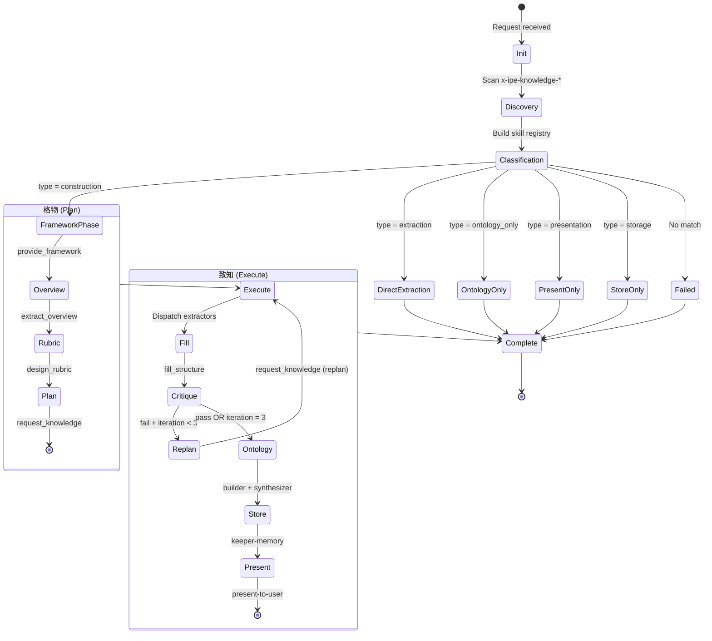
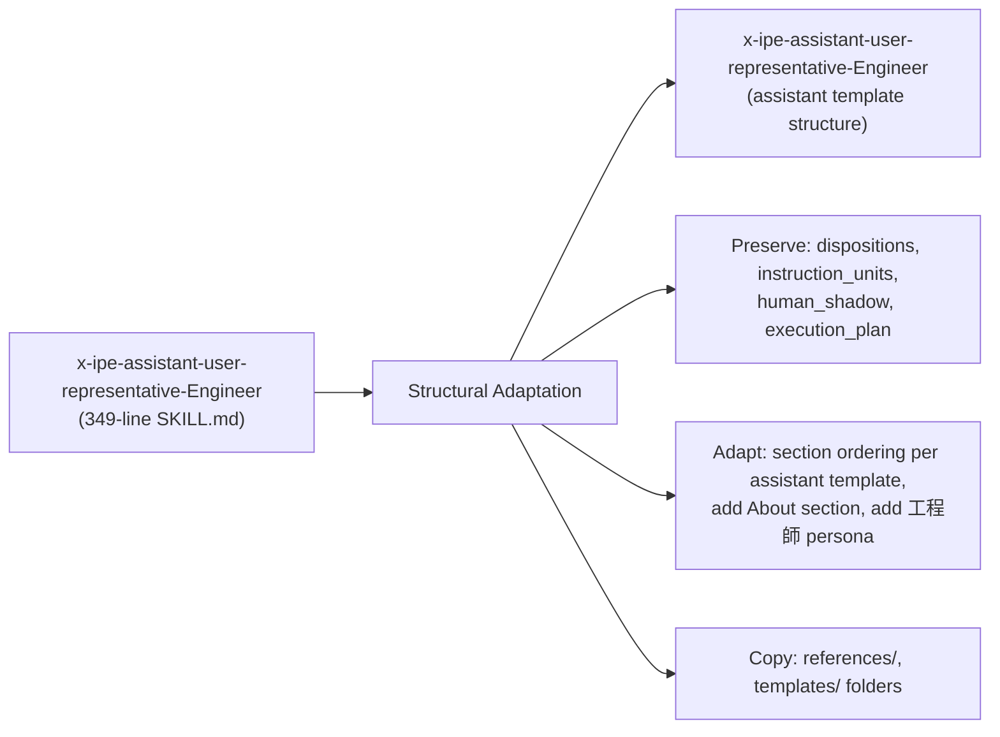

# Technical Design: Layer 4 — Orchestrator (Knowledge Librarian + User Representative Migration)

> Feature ID: FEATURE-059-E | Version: v1.0 | Last Updated: 04-20-2026

---

## Part 1: Agent-Facing Summary

> **Purpose:** Quick reference for AI agents navigating large projects.
> **📌 AI Coders:** Focus on this section for implementation context.

### Key Components Implemented

| Component | Responsibility | Scope/Impact | Tags |
|-----------|----------------|--------------|------|
| `x-ipe-assistant-knowledge-librarian-DAO` | Central orchestrator for knowledge pipeline via 格物致知 workflow | All knowledge operations: extraction, construction, ontology, storage, presentation | #assistant #librarian #orchestrator #格物致知 #knowledge-pipeline |
| `x-ipe-assistant-user-representative-Engineer` | Migrated human representative under assistant namespace | All DAO call sites across all skills | #assistant #user-representative #migration #工程師 |
| Skill Discovery Engine | Runtime discovery of `x-ipe-knowledge-*` skills via glob | Librarian initialization | #discovery #glob #knowledge-skills |
| Semantic Router | Request classification and constructor selection | Librarian input init phase | #classification #routing #semantic |
| Critique Loop Engine | Sub-agent rubric evaluation with max-3-iteration guard | 致知 Phase 3 | #critique #rubric #iteration-guard |
| Pipeline State Tracker | Step-by-step execution tracking with partial-failure support | Full pipeline | #pipeline #state #error-handling |

### Dependencies

| Dependency | Source | Design Link | Usage Description |
|------------|--------|-------------|-------------------|
| `x-ipe-knowledge-constructor-*` (3 skills) | FEATURE-059-C | [technical-design.md](x-ipe-docs/requirements/EPIC-059/FEATURE-059-C/technical-design.md) | Constructors provide framework, rubric, knowledge requests, and fill structure |
| `x-ipe-knowledge-extractor-web` | FEATURE-059-B | [technical-design.md](x-ipe-docs/requirements/EPIC-059/FEATURE-059-B/technical-design.md) | Web extraction for gathering knowledge from URLs |
| `x-ipe-knowledge-extractor-memory` | FEATURE-059-B | [technical-design.md](x-ipe-docs/requirements/EPIC-059/FEATURE-059-B/technical-design.md) | Memory retrieval for existing knowledge |
| `x-ipe-knowledge-keeper-memory` | FEATURE-059-B | [technical-design.md](x-ipe-docs/requirements/EPIC-059/FEATURE-059-B/technical-design.md) | Persistent storage via store/promote operations |
| `x-ipe-knowledge-ontology-builder` | FEATURE-059-C | [technical-design.md](x-ipe-docs/requirements/EPIC-059/FEATURE-059-C/technical-design.md) | Entity discovery and registration in .ontology/ |
| `x-ipe-knowledge-ontology-synthesizer` | FEATURE-059-D | [technical-design.md](x-ipe-docs/requirements/EPIC-059/FEATURE-059-D/technical-design.md) | Cross-graph linking (discover → wash → link) |
| `x-ipe-knowledge-present-to-user` | FEATURE-059-D | [technical-design.md](x-ipe-docs/requirements/EPIC-059/FEATURE-059-D/technical-design.md) | Render knowledge as structured output |
| `x-ipe-knowledge-present-to-knowledge-graph` | FEATURE-059-D | [technical-design.md](x-ipe-docs/requirements/EPIC-059/FEATURE-059-D/technical-design.md) | Push ontology to frontend graph viewer |
| `x-ipe-meta-skill-creator` | FEATURE-059-A | [specification.md](x-ipe-docs/requirements/EPIC-059/FEATURE-059-A/specification.md) | Creates assistant skill structure |
| `x-ipe-assistant-user-representative-Engineer` | Existing | [SKILL.md](.github/skills/x-ipe-assistant-user-representative-Engineer/SKILL.md) | Source skill for E.2 migration |
| `x-ipe-assistant` template | FEATURE-059-A | [template](x-ipe-docs/requirements/EPIC-059/FEATURE-059-A/specification.md) | Skill structure template |

### Major Flow

1. **Request → Classify → Route**: Incoming knowledge request → Librarian classifies type (construction/extraction/ontology_only/presentation/storage) → routes to best-matching skill
2. **格物 Phase (Plan)**: Constructor provides framework → Extractor gathers overview → Constructor designs rubric → Constructor requests knowledge
3. **致知 Phase (Execute)**: Extractors fulfill requests → Constructor fills draft → Sub-agent critiques against rubric → Loop (max 3) → Ontology processing → Store → Present
4. **Fallback**: Direct skill invocation always available if Librarian is unavailable

### Usage Example

```yaml
# Librarian invoked by an agent for user manual construction
input:
  request: "Build a user manual for the X-IPE web application"
  output_format: "markdown"

# Librarian internally:
# 1. Discovers skills: [constructor-user-manual, constructor-notes, constructor-app-reverse-engineering, ...]
# 2. Classifies: request_type = "construction"
# 3. Routes: best_match = "x-ipe-knowledge-constructor-user-manual" (semantic match on "user manual")
# 4. 格物: framework → overview → rubric → plan
# 5. 致知: extract → fill → critique (pass on iteration 1) → ontology → store → present

output:
  pipeline_status: "success"
  pipeline_summary: "User manual constructed in 1 iteration, 12 entities registered, stored to procedural/"
  stored_path: "x-ipe-docs/memory/procedural/x-ipe-web-application-user-manual.md"
  presented_output: { format: "markdown", content: "..." }
```

```yaml
# Pure ontology request (no constructor)
input:
  request: "Discover and link ontology graphs for python-frameworks and web-development"
  request_type_override: "ontology_only"

# Librarian routes directly to synthesizer: discover → wash → link
output:
  pipeline_status: "success"
  pipeline_summary: "3 cross-graph relations created, 5 terms normalized"
  ontology_result: { relations_created: 3, terms_normalized: 5 }
```

---

## Part 2: Implementation Guide

> **Purpose:** Human-readable details for developers.

### E.1 — Knowledge Librarian DAO

#### Architecture Overview

The Librarian is an `x-ipe-assistant` type skill — a SKILL.md with orchestration procedure (not scripts). It coordinates knowledge skills by invoking their operations with properly typed context. The 格物致知 workflow is implemented as a state machine within the SKILL.md execution procedure.



#### Skill Discovery Design

```
Discovery Algorithm:
1. Glob: .github/skills/x-ipe-knowledge-*/SKILL.md
2. For each SKILL.md found:
   a. Read YAML frontmatter → extract name, description
   b. Categorize by name prefix:
      - x-ipe-knowledge-extractor-*   → extractors[]
      - x-ipe-knowledge-constructor-* → constructors[]
      - x-ipe-knowledge-keeper-*      → keepers[]
      - x-ipe-knowledge-present-*     → presenters[]
      - x-ipe-knowledge-ontology-*    → ontology[]
      - x-ipe-knowledge-mimic-*       → mimics[]
3. Build discovered_skills registry (cached per pipeline execution)
```

No hardcoded skill names. Registry is built fresh each invocation.

#### Semantic Request Classification

```
Classification Algorithm:
1. Parse request text
2. Check request_type_override — if provided, skip classification
3. Check target_constructor — if provided, set type = "construction" and skip routing
4. For type detection:
   a. Does request mention construction verbs (build, create, construct, write)?
      → Check if it also implies a domain (manual, notes, reverse-eng)
      → type = "construction"
   b. Does request mention extraction verbs (extract, get, fetch, find)?
      → type = "extraction"
   c. Does request mention ontology verbs (discover, link, synthesize, normalize)?
      → type = "ontology_only"
   d. Does request mention presentation verbs (render, summarize, show, present)?
      → type = "presentation"
   e. Does request mention storage verbs (store, save, promote, persist)?
      → type = "storage"
   f. No match → type = "classification_failed"

Constructor Routing (when type = "construction"):
1. For each constructor in discovered_skills.constructors[]:
   a. Compare request content against constructor description (semantic similarity)
   b. Score based on:
      - Domain keyword overlap (e.g., "user manual" matches constructor-user-manual)
      - Operation relevance (constructor operations match request intent)
2. Select highest-scoring constructor
3. On tie → alphabetical first match, log tie-breaking
4. On zero matches → classification_failed
```

#### Critique Loop State Machine

```
critique_state = {
  iteration_count: 0,
  max_iterations: 3,  # from input or default
  last_critique: null,
  status: "pending"    # pending | passing | partial_quality
}

Loop:
  1. Invoke critique sub-agent with (draft, rubric_metrics)
     - Sub-agent MUST use premium model (claude-opus-4.6)
  2. Receive critique_result: { verdict: pass|fail, gaps[], scores{} }
  3. IF verdict == "pass":
       status = "passing" → exit loop
  4. ELIF iteration_count >= max_iterations:
       status = "partial_quality" → log warning → exit loop
  5. ELSE:
       iteration_count++
       Return to 格物.4 (request_knowledge for gap sections only)
       Re-execute 致知.1 (extract) and 致知.2 (fill) for gaps
       Continue loop
```

#### Pipeline State Tracker

Each pipeline execution tracks step status for graceful degradation:

```yaml
pipeline_state:
  session_id: "librarian-{timestamp}"
  request_type: "construction | extraction | ontology_only | ..."
  steps:
    - name: "discovery"
      status: "done | failed | skipped"
      output_ref: "discovered_skills registry"
    - name: "classification"
      status: "done | failed"
      output_ref: "request_type + selected_constructor"
    - name: "格物.1_framework"
      status: "done | failed | skipped"
      output_ref: ".working/session-{ts}/framework/"
    - name: "格物.2_overview"
      status: "done | failed | skipped"
      output_ref: ".working/session-{ts}/overview/"
    - name: "格物.3_rubric"
      status: "done | failed | skipped"
      output_ref: ".working/session-{ts}/rubric/"
    - name: "格物.4_plan"
      status: "done | failed | skipped"
      output_ref: ".working/session-{ts}/plan/"
    - name: "致知.1_execute"
      status: "done | failed | skipped"
      output_ref: "gathered_knowledge[]"
    - name: "致知.2_fill"
      status: "done | failed | skipped"
      output_ref: ".working/session-{ts}/draft/"
    - name: "致知.3_critique"
      status: "done | failed | skipped"
      output_ref: "critique_result, iteration_count"
    - name: "致知.4_ontology"
      status: "done | failed | skipped"
      output_ref: "ontology_result"
    - name: "致知.5_store"
      status: "done | failed | skipped"
      output_ref: "stored_path"
    - name: "致知.6_present"
      status: "done | failed | skipped"
      output_ref: "presented_output"
  pipeline_status: "success | partial | failed"
```

Error handling: if step N fails, log error, mark as "failed", and continue to step N+1 where possible. Pipeline returns `partial` with completed vs failed step list.

#### SKILL.md Structure

The Librarian SKILL.md follows the `x-ipe-assistant` template:

```
SKILL.md sections:
├── Frontmatter (name, description)
├── Purpose (3 objectives)
├── Important Notes (BLOCKING rules)
├── About (格物致知 backbone explanation)
├── When to Use (triggers / not_for)
├── Input Parameters
│   ├── request: string (the knowledge task)
│   ├── request_type_override: optional (skip classification)
│   ├── target_constructor: optional (skip routing)
│   ├── max_iterations: int, default 3
│   ├── output_format: structured | markdown | graph
│   └── session_context: optional (task_id, feature_id, etc.)
├── Input Initialization
├── Definition of Ready
├── Execution Flow (phase table)
├── Execution Procedure
│   ├── Phase 0: 礼 — Greet (announce identity)
│   ├── Phase 1: 格物 — Investigate
│   │   ├── Step 1.1: Discover Skills (glob scan)
│   │   ├── Step 1.2: Classify Request (semantic analysis)
│   │   ├── Step 1.3: Provide Framework (→ constructor)
│   │   ├── Step 1.4: Gather Overview (→ extractor)
│   │   ├── Step 1.5: Design Rubric (→ constructor)
│   │   └── Step 1.6: Plan Knowledge Requests (→ constructor)
│   ├── Phase 2: 致知 — Reach Understanding
│   │   ├── Step 2.1: Execute Extraction (→ extractors)
│   │   ├── Step 2.2: Fill Structure (→ constructor)
│   │   ├── Step 2.3: Critique Against Rubric (→ sub-agent)
│   │   ├── Step 2.4: Process Ontology (→ builder + synthesizer)
│   │   ├── Step 2.5: Store Results (→ keeper-memory)
│   │   └── Step 2.6: Present Output (→ present-to-user + graph)
│   ├── Phase 3: 录 — Record (semantic log)
│   └── Phase 4: 示 — Present (return pipeline_summary)
├── Output Result (pipeline_summary, status, paths)
├── Definition of Done
├── Error Handling
├── References
└── Examples
```

#### Working Directory Isolation

Each pipeline execution creates a session subfolder:

```
x-ipe-docs/memory/.working/
└── librarian-2026-04-20T071834/
    ├── framework/        # 格物.1 output
    ├── overview/         # 格物.2 output
    ├── rubric/           # 格物.3 output
    ├── plan/             # 格物.4 output
    ├── extracted/        # 致知.1 output
    ├── draft/            # 致知.2 output
    └── critique/         # 致知.3 output
```

Session ID format: `librarian-{ISO-8601-timestamp}`.

---

### E.2 — User Representative Migration

#### Migration Approach

The migration adapts the existing `x-ipe-assistant-user-representative-Engineer` to the `x-ipe-assistant` template structure. Functionality is preserved; the structural container changes.



#### Structural Mapping

| Old Section (DAO) | New Section (Assistant) | Change |
|---|---|---|
| Frontmatter `name: x-ipe-dao-...` | Frontmatter `name: x-ipe-assistant-...` | Rename |
| Purpose | Purpose | Preserve content |
| Important Notes | Important Notes | Preserve + add Best-Model note |
| *(missing)* | About | **New**: add 格物致知 backbone explanation + Key Concepts |
| When to Use | When to Use | Preserve triggers, update name references |
| Input Parameters | Input Parameters | Preserve structure |
| Definition of Ready | Definition of Ready | Preserve |
| Execution Flow | Execution Flow | Preserve phase table |
| Execution Procedure | Execution Procedure | Preserve all phases (礼→格物→致知→录→示) |
| Output Result | Output Result | Preserve `instruction_units[]` + `execution_plan` |
| Definition of Done | Definition of Done | Preserve |
| Error Handling | Error Handling | Preserve |
| References | References | Preserve, copy files |
| Examples | Examples | Preserve, update skill name references |

#### Folder Structure

```
.github/skills/x-ipe-assistant-user-representative-Engineer/
├── SKILL.md                    # Adapted from x-ipe-assistant-user-representative-Engineer
├── references/
│   ├── dao-disposition-guidelines.md    # Copied
│   ├── dao-log-format.md               # Copied
│   ├── dao-phases-and-output-format.md  # Copied
│   ├── engineering-workflow.md          # Copied
│   └── examples.md                     # Copied, name refs updated
└── templates/                           # Copied
```

#### Backward Compatibility

During transition, the old `x-ipe-assistant-user-representative-Engineer` continues to exist. FEATURE-059-F handles its deprecation and removal. In this feature:
- New code should reference `x-ipe-assistant-user-representative-Engineer`
- Old references continue to work (resolved by custom instructions auto-discovery of both `x-ipe-dao-*` and `x-ipe-assistant-*`)

---

### Implementation Steps

| Step | Component | Tasks |
|------|-----------|-------|
| 1 | E.1 Librarian SKILL.md | Create `.github/skills/x-ipe-assistant-knowledge-librarian-DAO/SKILL.md` via `x-ipe-meta-skill-creator` (assistant type). Implement full 格物致知 procedure with discovery, classification, critique loop, pipeline tracking. |
| 2 | E.1 Librarian references | Create `references/examples.md` with worked examples (construction, extraction, ontology_only). Create `references/pipeline-state-format.md` documenting pipeline_state schema. |
| 3 | E.2 User Rep SKILL.md | Create `.github/skills/x-ipe-assistant-user-representative-Engineer/SKILL.md` by adapting existing DAO SKILL.md to assistant template. Add About section, 工程師 persona, Best-Model note. |
| 4 | E.2 User Rep references | Copy `references/` and `templates/` from old skill. Update internal name references. |

### Edge Cases & Error Handling

| Scenario | Expected Behavior |
|----------|-------------------|
| Zero knowledge skills discovered | `discovered_skills` is empty; Librarian returns `classification_failed` with error "No knowledge skills found" |
| Constructor's `provide_framework` fails | Pipeline step marked "failed", skip to 致知 with empty framework — constructor's `fill_structure` will produce all-INCOMPLETE draft |
| Extractor times out during 致知.1 | Log timeout, pass partial `gathered_knowledge` to fill_structure |
| Critique sub-agent unavailable | Skip critique loop, proceed with draft as-is, log warning, mark `critique` step as "failed" |
| Request matches `ontology_only` but no graphs exist | Synthesizer's `discover_related` returns empty — pipeline returns success with empty synthesis result |
| Multiple pipelines run concurrently | Each gets unique `.working/librarian-{ts}/` subfolder — no interference |

---

## Design Change Log

| Date | Phase | Change Summary |
|------|-------|----------------|
| 04-20-2026 | Initial Design | Initial technical design for FEATURE-059-E. Two deliverables: E.1 Knowledge Librarian DAO (格物致知 orchestrator) and E.2 User Representative migration to assistant namespace. |
