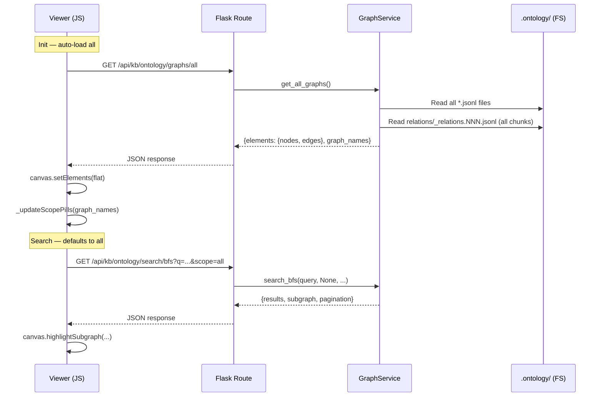

# Technical Design: Layer 5 — Integration, Migration & Deprecation

> Feature ID: FEATURE-059-F | Version: v1.0 | Last Updated: 2026-04-20

---

## Part 1: Agent-Facing Summary

### Key Components Implemented

| Component | Responsibility | Scope/Impact | Tags |
|-----------|---------------|--------------|------|
| F1: DAO Skill Removal | Delete old `x-ipe-assistant-user-representative-Engineer` folder and its skill-meta | `.github/skills/`, `x-ipe-docs/skill-meta/` | #migration #skills #deletion |
| F2: Skill Reference Migration | Replace old DAO name with `x-ipe-assistant-user-representative-Engineer` in 24 skill SKILL.md files | `.github/skills/*/SKILL.md` | #migration #text-replace #skills |
| F3: Instructions Migration | Replace old DAO name in copilot-instructions and resource templates | `.github/copilot-instructions.md`, `src/x_ipe/resources/` | #migration #text-replace #instructions |
| F4: Graph Viewer Sidebar Removal | Remove graph-list + select-all from sidebar, keep legend as floating overlay | `src/x_ipe/static/js/features/ontology-graph-viewer.js`, `src/x_ipe/static/css/ontology-graph-viewer.css` | #frontend #ui #graph-viewer |
| F5: Graph Auto-Load | Replace checkbox-driven graph selection with auto-load-all on init | `src/x_ipe/static/js/features/ontology-graph-viewer.js` | #frontend #graph-viewer #auto-load |
| F6: Cross-Graph Relations Backend | Read `_relations.NNN.jsonl` chunks and serve as Cytoscape edges | `src/x_ipe/services/ontology_graph_service.py` | #backend #service #relations |
| F7: Unified Graph Endpoint | New `/api/kb/ontology/graphs/all` returning merged nodes + edges | `src/x_ipe/routes/ontology_graph_routes.py`, `src/x_ipe/services/ontology_graph_service.py` | #backend #api #endpoint |
| F8: Synthesizer Metadata in Nodes | Include `synthesize_id`/`synthesize_message` in Cytoscape node data | `src/x_ipe/services/ontology_graph_service.py` | #backend #node-data #synthesizer |
| F9: Test Updates | Update existing tests + add tests for new endpoint and relations loading | `tests/test_ontology_graph_viewer.py` | #testing #pytest |

### Dependencies

| Dependency | Source | Design Link | Usage Description |
|-----------|--------|-------------|-------------------|
| FEATURE-059-E | `x-ipe-assistant-user-representative-Engineer` | [059-E spec](x-ipe-docs/requirements/EPIC-059/FEATURE-059-E/specification.md) | Replacement skill that old DAO references migrate to |
| FEATURE-059-D | `x-ipe-knowledge-ontology-synthesizer` | [059-D tech design](x-ipe-docs/requirements/EPIC-059/FEATURE-059-D/technical-design.md) | Defines `_relations.NNN.jsonl` format and `synthesize_id`/`synthesize_message` fields |
| FEATURE-059-C | `x-ipe-knowledge-ontology-builder` | [059-C spec](x-ipe-docs/requirements/EPIC-059/FEATURE-059-C/specification.md) | Defines JSONL event format (`_entities.jsonl`) and entity structure |
| FEATURE-058-E/F | Ontology graph viewer | N/A | Existing viewer code being modified (JS, CSS, routes, service) |
| Cytoscape.js | CDN | External | Graph rendering library used by canvas |

### Major Flow

**Workstream A — Migration (F1 + F2 + F3):**
1. Delete `.github/skills/x-ipe-assistant-user-representative-Engineer/` folder entirely
2. Delete `x-ipe-docs/skill-meta/x-ipe-assistant-user-representative-Engineer/` folder entirely
3. In each of the 24 skill SKILL.md files, replace `x-ipe-assistant-user-representative-Engineer` → `x-ipe-assistant-user-representative-Engineer`
4. Same replacement in `.github/copilot-instructions.md` and all `src/x_ipe/resources/` files containing the old name

**Workstream B — Web App UI (F4 + F5 + F6 + F7 + F8 + F9):**
1. Backend: Add `get_all_graphs()` method to `OntologyGraphService` that merges all graph JSONL files + all `_relations.NNN.jsonl` chunks into unified Cytoscape elements
2. Backend: Add `/api/kb/ontology/graphs/all` route calling `get_all_graphs()`
3. Backend: Extend `_entity_to_cytoscape_node()` to include `synthesize_id`/`synthesize_message`
4. Frontend: Remove sidebar graph-list HTML + JS handlers; reposition legend as floating canvas overlay
5. Frontend: On init, call `/api/kb/ontology/graphs/all` and `canvas.setElements()` directly
6. Frontend: Default search scope to all graphs (remove graph_names filtering from UI)
7. CSS: Change grid from `260px 1fr` to `1fr`, update canvas grid-column, reposition legend
8. Tests: Update existing tests, add tests for `get_all_graphs()` and `/api/kb/ontology/graphs/all`

### Usage Example

```python
# Backend — new unified endpoint
svc = OntologyGraphService(kb_root="/path/to/knowledge-base")
result = svc.get_all_graphs()
# Returns: {
#   "elements": {
#     "nodes": [{"data": {"id": "...", "synthesize_id": "...", ...}}, ...],
#     "edges": [{"data": {"source": "...", "target": "...", ...}}, ...]
#   }
# }
```

```javascript
// Frontend — auto-load replaces checkbox selection
async _initAutoLoad() {
    const resp = await fetch('/api/kb/ontology/graphs/all');
    const data = await resp.json();
    const flat = [...data.elements.nodes, ...data.elements.edges];
    this.canvas.setElements(flat);
    this._updateScopePills(data.graph_names);
}
```

---

## Part 2: Implementation Guide

### 2.1 Workstream A: Migration (F1 + F2 + F3)

This workstream is purely file deletion + text replacement. No logic changes.

#### F1: DAO Skill Removal

**Delete these directories:**
- `.github/skills/x-ipe-assistant-user-representative-Engineer/` (SKILL.md, references/5 files, templates/1 file)
- `x-ipe-docs/skill-meta/x-ipe-assistant-user-representative-Engineer/` (skill-meta.md, candidate/)

#### F2: Skill SKILL.md Reference Migration

**Target files** (24 files in `.github/skills/*/SKILL.md`):

All skill files that reference `x-ipe-assistant-user-representative-Engineer`. The replacement is a direct string substitution:
- Old: `x-ipe-assistant-user-representative-Engineer`
- New: `x-ipe-assistant-user-representative-Engineer`

The replacement preserves context — the old name appears in:
- `interaction_mode` guidance paragraphs (e.g., "call `x-ipe-assistant-user-representative-Engineer` to get the answer")
- Phase step actions (e.g., "Invoke x-ipe-assistant-user-representative-Engineer with:")
- Notes and anti-pattern tables

No structural changes needed — only the skill name string changes.

#### F3: Instructions Migration

**Files and occurrence counts:**

| File | Occurrences | Context |
|------|------------|---------|
| `.github/copilot-instructions.md` | 1 | Line 103 — interaction_mode note |
| `src/x_ipe/resources/copilot-instructions-en-no-dao.md` | 1 | Same note as copilot-instructions |
| `src/x_ipe/resources/copilot-instructions-zh.md` | ~6 | Chinese version — DAO workflow references |
| `src/x_ipe/resources/templates/instructions-template.md` | 6 | Full DAO-first workflow (must change to new name) |
| `src/x_ipe/resources/templates/instructions-template-no-dao.md` | 1 | interaction_mode note |

Same direct string substitution: `x-ipe-assistant-user-representative-Engineer` → `x-ipe-assistant-user-representative-Engineer`.

#### Migration Verification

After all replacements, run:
```bash
grep -r "x-ipe-assistant-user-representative-Engineer" .github/ src/ x-ipe-docs/
```
Expected: zero results.

---

### 2.2 Workstream B: Web App UI (F4–F9)

#### Workflow Diagram



#### F4: Graph Viewer Sidebar Removal

**File: `src/x_ipe/static/js/features/ontology-graph-viewer.js`**

**HTML Changes (in `render()` method, ~line 143):**

Remove from the sidebar:
- The `ogv-sidebar-header` div (ONTOLOGY title)
- The `ogv-section-header` "GRAPH COLLECTIONS"
- The `ogv-select-all` div
- The `ogv-graph-list` div

Keep:
- The `ogv-legend` div — but move it outside `.ogv-sidebar` to become a floating overlay on the canvas area

The resulting DOM structure replaces the sidebar with just the legend overlay:

```html
<!-- Sidebar REMOVED -->

<!-- Legend (floating overlay on canvas) -->
<div class="ogv-legend-overlay">
    <div class="ogv-legend-items">
        <div class="ogv-legend-item"><span class="ogv-type-badge ogv-type-badge--concept"></span>Concept</div>
        <div class="ogv-legend-item"><span class="ogv-type-badge ogv-type-badge--document"></span>Document</div>
        <div class="ogv-legend-item"><span class="ogv-type-badge ogv-type-badge--entity"></span>Entity</div>
        <div class="ogv-legend-item"><span class="ogv-type-badge ogv-type-badge--dimension"></span>Dimension</div>
    </div>
</div>
```

**JS Methods to Remove:**
- `_renderGraphList()` — no longer needed (no checkbox list)
- `_updateGraphListCheckboxes()` — no longer needed
- Select-all checkbox handler (`ogv-select-all-cb` change listener)
- Individual graph checkbox handlers in `_renderGraphList()`

**JS Methods to Modify:**
- `_toggleGraph(name, selected)` — remove (no manual toggle)
- `_selectAll(selected)` — remove (no select-all)
- `_loadGraphIndex()` — replace with auto-load (see F5)
- `_renderScopePills()` — keep, but populate from `graph_names` in unified response

#### F5: Graph Auto-Load

**File: `src/x_ipe/static/js/features/ontology-graph-viewer.js`**

Replace the current init flow:
```
render() → _loadGraphIndex() → _renderGraphList() → user checks boxes → _toggleGraph() → _loadGraph()
```

With:
```
render() → _autoLoadAll() → canvas.setElements() → _updateScopePills()
```

New method `_autoLoadAll()`:
```javascript
async _autoLoadAll() {
    try {
        const resp = await fetch('/api/kb/ontology/graphs/all');
        if (!resp.ok) {
            this._showEmptyState();
            return;
        }
        const data = await resp.json();
        if (!data.elements || (!data.elements.nodes.length && !data.elements.edges.length)) {
            this._showEmptyState();
            return;
        }
        const flat = [
            ...data.elements.nodes,
            ...data.elements.edges,
        ];
        this.canvas.setElements(flat);
        // Populate _graphIndex for scope pills
        this._graphIndex = (data.graph_names || []).map(n => ({ name: n }));
        this._selectedGraphs = new Set(data.graph_names || []);
        this._renderScopePills();
        this._updateStatusBar(data.elements.nodes.length, data.elements.edges.length);
    } catch (err) {
        console.error('[OGV] auto-load failed:', err);
        this._showEmptyState();
    }
}
```

The `_showEmptyState()` method displays a message on the canvas area when no graphs exist.

**Search scope change:** The `_searchBFS()` method currently reads `_selectedGraphs` to build the `scope` parameter. After this change, `_selectedGraphs` contains all graphs by default, so `scope=all` is the natural default. Scope pills still allow narrowing — clicking the ✕ on a scope pill removes that graph from `_selectedGraphs` and calls `canvas.removeGraphElements(name)` to hide it from the canvas. Search scope follows `_selectedGraphs` so search narrows too. Clicking the "+" pill re-adds a removed graph.

#### F6: Cross-Graph Relations Backend

**File: `src/x_ipe/services/ontology_graph_service.py`**

Add new method `_load_cross_graph_relations()`:

```python
def _load_cross_graph_relations(self) -> list[dict]:
    """Read all _relations.NNN.jsonl chunks from .ontology/relations/ directory.

    Returns list of Cytoscape edge dicts.
    """
    relations_dir = self._ontology_dir / 'relations'
    if not relations_dir.is_dir():
        return []

    edges = []
    # Sort by chunk number to maintain order
    chunks = sorted(relations_dir.glob('_relations.*.jsonl'))
    for chunk_path in chunks:
        try:
            with open(chunk_path) as f:
                for line in f:
                    line = line.strip()
                    if not line:
                        continue
                    try:
                        record = json.loads(line)
                    except json.JSONDecodeError:
                        continue
                    # 059-D synthesizer format: op, type, id, ts, props
                    # props contains: from_id, to_id, relation_type, synthesis_version, synthesized_with
                    if record.get('op') in ('create', 'link'):
                        props = record.get('props', {})
                        from_id = props.get('from_id', '')
                        to_id = props.get('to_id', '')
                        rel_type = props.get('relation_type', 'related_to')
                        if from_id and to_id:
                            edges.append({
                                'data': {
                                    'id': f'xr_{from_id}_{to_id}',
                                    'source': from_id,
                                    'target': to_id,
                                    'relation_type': rel_type,
                                    'label': rel_type,
                                    'cross_graph': True,
                                    'synthesis_version': props.get('synthesis_version', ''),
                                }
                            })
        except OSError:
            continue
    return edges
```

Key design decisions:
- Edge IDs prefixed with `xr_` to distinguish from intra-graph edges (`e_`)
- `cross_graph: True` flag enables frontend to style cross-graph edges differently (e.g., dashed)
- Malformed lines skipped (same pattern as existing `_parse_graph_jsonl`)
- Reads all chunks sorted by filename to maintain append order

#### F7: Unified Graph Endpoint

**File: `src/x_ipe/services/ontology_graph_service.py`**

Add new method `get_all_graphs()`:

```python
def get_all_graphs(self) -> dict:
    """Get merged Cytoscape elements from all graphs + cross-graph relations.

    Returns dict with 'elements' (nodes + edges) and 'graph_names'.
    """
    if not self.has_ontology:
        return {'elements': {'nodes': [], 'edges': []}, 'graph_names': []}

    index = self._read_graph_index()
    all_nodes = []
    all_edges = []
    graph_names = []

    for g in index.get('graphs', []):
        name = g.get('name', '')
        if not name:
            continue
        graph_names.append(name)
        graph_path = self._ontology_dir / f'{name}.jsonl'
        if not graph_path.is_file():
            continue
        entities, relations = self._parse_graph_jsonl(graph_path)
        for e in entities:
            node = self._entity_to_cytoscape_node(e)
            node['data']['_graph'] = name  # tag with source graph
            all_nodes.append(node)
        for r in relations:
            edge = self._relation_to_cytoscape_edge(r)
            edge['data']['_graph'] = name
            all_edges.append(edge)

    # Add cross-graph relations from _relations.NNN.jsonl
    cross_edges = self._load_cross_graph_relations()
    all_edges.extend(cross_edges)

    return {
        'elements': {
            'nodes': all_nodes,
            'edges': all_edges,
        },
        'graph_names': graph_names,
    }
```

**File: `src/x_ipe/routes/ontology_graph_routes.py`**

Add new route:

```python
@ontology_graph_bp.route('/api/kb/ontology/graphs/all', methods=['GET'])
@x_ipe_tracing()
def get_all_graphs():
    """GET /api/kb/ontology/graphs/all — Merged Cytoscape elements from all graphs."""
    svc = _get_service_or_abort()
    try:
        if not svc.has_ontology:
            return _error('ONTOLOGY_NOT_FOUND', 'No .ontology/ directory found', 404)
        result = svc.get_all_graphs()
        return jsonify(result)
    except Exception as exc:
        return _error('INTERNAL_ERROR', str(exc), 500)
```

**Important:** Place this route BEFORE the `/api/kb/ontology/graph/<name>` route to avoid Flask matching `all` as a graph name.

#### F7b: Individual Graph Endpoint — Include Cross-Graph Relations

**File: `src/x_ipe/routes/ontology_graph_routes.py`** (existing route) and **`src/x_ipe/services/ontology_graph_service.py`**

Modify existing `get_graph(name)` to also include cross-graph relations relevant to that graph:

```python
def get_graph(self, name: str) -> dict | None:
    graph_path = self._ontology_dir / f'{name}.jsonl'
    if not graph_path.is_file():
        return None

    entities, relations = self._parse_graph_jsonl(graph_path)
    nodes = [self._entity_to_cytoscape_node(e) for e in entities]
    edges = [self._relation_to_cytoscape_edge(r) for r in relations]

    # NEW: Include cross-graph relations that touch entities in this graph
    entity_ids = {e.get('id', '') for e in entities}
    cross_edges = self._load_cross_graph_relations()
    for edge in cross_edges:
        src = edge['data']['source']
        tgt = edge['data']['target']
        if src in entity_ids or tgt in entity_ids:
            edges.append(edge)

    return {
        'name': name,
        'elements': {'nodes': nodes, 'edges': edges},
    }
```

This satisfies AC-059F-07a: when `/api/kb/ontology/graph/<name>` is called, the response includes edges from `_relations.NNN.jsonl` that connect entities in the requested graph.

#### F8: Synthesizer Metadata in Nodes

**File: `src/x_ipe/services/ontology_graph_service.py`**

Modify `_entity_to_cytoscape_node()` to include synthesizer fields:

```python
def _entity_to_cytoscape_node(self, entity: dict) -> dict:
    props = entity.get('properties', {})
    eid = entity.get('id', '')
    return {
        'data': {
            'id': eid,
            'label': props.get('label', eid),
            'node_type': props.get('node_type', 'entity'),
            'weight': props.get('weight', 1),
            'description': props.get('description', ''),
            'dimensions': props.get('dimensions', {}),
            'source_files': props.get('source_files', []),
            'synthesize_id': props.get('synthesize_id', ''),       # NEW
            'synthesize_message': props.get('synthesize_message', ''),  # NEW
            'metadata': {
                'connections': 0,
                'created': entity.get('created', ''),
                'updated': entity.get('updated', ''),
            },
        },
    }
```

#### F4 (CSS): Layout Changes

**File: `src/x_ipe/static/css/ontology-graph-viewer.css`**

| Change | Before | After |
|--------|--------|-------|
| Grid layout | `grid-template-columns: 260px 1fr` | `grid-template-columns: 1fr` |
| Grid rows | `grid-template-rows: 56px 1fr 36px` | Unchanged — 3 rows (topbar, canvas, status bar) |
| Sidebar styles | `.ogv-sidebar { grid-row: 1/4; width: 260px; ... }` | Remove entire `.ogv-sidebar` block + all child selectors |
| Canvas column | `.ogv-canvas-area { grid-column: 2; }` | `.ogv-canvas-area { grid-column: 1; }` |
| Topbar column | `.ogv-topbar { grid-column: 2; }` | `.ogv-topbar { grid-column: 1; }` |
| Status bar column | `.ogv-status-bar { grid-column: 2; }` | `.ogv-status-bar { grid-column: 1; }` |
| Legend | Inside sidebar (flex column child) | Floating overlay inside `.ogv-canvas-area` (see below) |

**New legend overlay styles:**

```css
.ogv-legend-overlay {
    position: absolute;
    bottom: 12px;
    left: 12px;
    background: rgba(255, 255, 255, 0.92);
    border: 1px solid #e2e8f0;
    border-radius: 8px;
    padding: 10px 14px;
    z-index: 10;
    backdrop-filter: blur(4px);
    box-shadow: 0 1px 4px rgba(0, 0, 0, 0.06);
}

.ogv-legend-overlay .ogv-legend-items {
    display: flex;
    gap: 12px;            /* horizontal layout */
    flex-direction: row;   /* compact single row */
}
```

The legend becomes a compact horizontal pill in the bottom-left of the canvas, semi-transparent so it doesn't obscure content.

#### F4 (CSS): Cross-Graph Edge Styling

```css
/* Cross-graph relation edges — dashed, distinct color */
/* Applied via Cytoscape stylesheet in ontology-graph-canvas.js */
```

In `ontology-graph-canvas.js` `_getStylesheet()`, add:

```javascript
{
    selector: 'edge[cross_graph]',
    style: {
        'line-style': 'dashed',
        'line-dash-pattern': [6, 3],
        'line-color': '#8b5cf6',       // purple — distinguishable from default edge color
        'target-arrow-color': '#8b5cf6',
    }
}
```

#### F9: Test Updates

**File: `tests/test_ontology_graph_viewer.py`**

**New tests to add:**

| Test | Category | Description |
|------|----------|-------------|
| `test_get_all_graphs_returns_merged_elements` | Service | All graphs merged, includes nodes + intra-graph edges |
| `test_get_all_graphs_includes_cross_graph_relations` | Service | Relations from `_relations.NNN.jsonl` included as edges |
| `test_get_all_graphs_multiple_chunks` | Service | Multiple chunk files (001, 002) all merged |
| `test_get_all_graphs_empty_ontology` | Service | Returns empty elements + empty graph_names |
| `test_get_all_graphs_no_relations_dir` | Service | No `relations/` dir → no cross-graph edges, still returns graph data |
| `test_get_all_graphs_malformed_relation_lines` | Service | Malformed JSONL lines skipped |
| `test_get_all_graphs_graph_tag` | Service | Each node/edge has `_graph` attribute |
| `test_get_all_graphs_synthesize_fields` | Service | Nodes include `synthesize_id`/`synthesize_message` |
| `test_api_get_all_graphs_200` | API | GET `/api/kb/ontology/graphs/all` returns 200 |
| `test_api_get_all_graphs_no_ontology_404` | API | Returns 404 when no .ontology/ |
| `test_cross_graph_edge_format` | Service | Edge has `xr_` prefix, `cross_graph: True`, `synthesis_version` |

**Existing tests to modify:**
- `test_entity_to_cytoscape_node` — verify `synthesize_id`/`synthesize_message` present in output
- Tests that assert on grid-column positions or sidebar HTML (if any frontend tests reference sidebar)

**Test fixtures needed:**
- Create `.ontology/relations/` directory with `_relations.001.jsonl` containing sample relation records in 059-D event envelope format

---

### 2.3 Implementation Order

| Step | Component | Files | AC Coverage |
|------|-----------|-------|-------------|
| 1 | F6: Cross-graph relations method | `ontology_graph_service.py` | AC-059F-07a,b,c |
| 2 | F8: Synthesizer metadata | `ontology_graph_service.py` | AC-059F-08b |
| 3 | F7: Unified endpoint + individual graph update | `ontology_graph_service.py`, `ontology_graph_routes.py` | AC-059F-07a, 08a,c |
| 4 | F9: Backend tests | `test_ontology_graph_viewer.py` | AC-059F-10d |
| 5 | F4: Sidebar removal (JS + CSS) | `ontology-graph-viewer.js`, `ontology-graph-viewer.css` | AC-059F-05a,b,c |
| 6 | F5: Auto-load + search defaults | `ontology-graph-viewer.js` | AC-059F-05d, 06a,b,c, 09a,b,c |
| 7 | F4: Cross-graph edge styling | `ontology-graph-canvas.js` | AC-059F-07d |
| 8 | Regression: topbar, detail panel, SocketIO | `ontology-graph-viewer.js`, `ontology-graph-canvas.js`, `ontology-graph-socket.js` | AC-059F-10a,b,c |
| 9 | F1: Delete old DAO folder | `.github/skills/x-ipe-assistant-user-representative-Engineer/` | AC-059F-01a,b,c |
| 10 | F2: Skill reference migration | 24 × `.github/skills/*/SKILL.md` | AC-059F-02a,b,c |
| 11 | F3: Instructions migration | copilot-instructions + src/ templates | AC-059F-03a,b,c, 04a,b |
| 12 | Verification | `grep` scan | NFR-1 |

---

### 2.4 Edge Cases & Error Handling

| Edge Case | Component | Handling |
|-----------|-----------|----------|
| No `.ontology/` directory | F7 (service) | `get_all_graphs()` returns empty elements + empty graph_names |
| No `relations/` directory | F6 (service) | `_load_cross_graph_relations()` returns empty list |
| Malformed JSONL in relation chunks | F6 (service) | Skip line, continue processing (same as `_parse_graph_jsonl`) |
| Relation references missing entity | F6 (service) | Edge included — Cytoscape handles disconnected edges gracefully |
| Empty `.graph-index.json` | F7 (service) | Returns empty elements |
| No graphs returned from `/graphs/all` | F5 (viewer) | Show empty-state message on canvas |
| `synthesize_id`/`synthesize_message` absent | F8 (service) | Default to empty string `''` |
| Route ordering conflict (`all` vs `<name>`) | F7 (route) | Register `/graphs/all` before `/graph/<name>` |

---

### 2.5 Data Model: Cross-Graph Relation Record

The `_relations.NNN.jsonl` files use the 059-D event-sourcing envelope:

```jsonl
{"op": "create", "type": "relation", "id": "rel-001", "ts": "2026-04-20T...", "props": {"from_id": "entity-a", "to_id": "entity-b", "relation_type": "related_to", "synthesis_version": "v1", "synthesized_with": "graph-x ↔ graph-y"}}
```

Transformed to Cytoscape edge:
```json
{
  "data": {
    "id": "xr_entity-a_entity-b",
    "source": "entity-a",
    "target": "entity-b",
    "relation_type": "related_to",
    "label": "related_to",
    "cross_graph": true,
    "synthesis_version": "v1"
  }
}
```

---

### 2.6 Program Type & Tech Stack

```yaml
program_type: "fullstack"
tech_stack:
  - "Python/Flask"          # backend service + routes
  - "JavaScript/Vanilla"    # frontend viewer
  - "HTML/CSS"              # viewer layout + styling
  - "Cytoscape.js"          # graph rendering
  - "pytest"                # backend tests
  - "Markdown"              # skill files (text replacement)
```

---

## Design Change Log

| Date | Phase | Change Summary |
|------|-------|----------------|
| 2026-04-20 | Technical Design | Initial design covering two workstreams: (A) DAO skill removal + reference migration across 24 skill files, copilot-instructions, and resource templates; (B) Web app UI changes — sidebar removal with floating legend overlay, auto-load-all behavior, cross-graph `_relations.NNN.jsonl` support in backend service, new unified `/api/kb/ontology/graphs/all` endpoint, synthesizer metadata in nodes, and Cytoscape cross-graph edge styling. |
