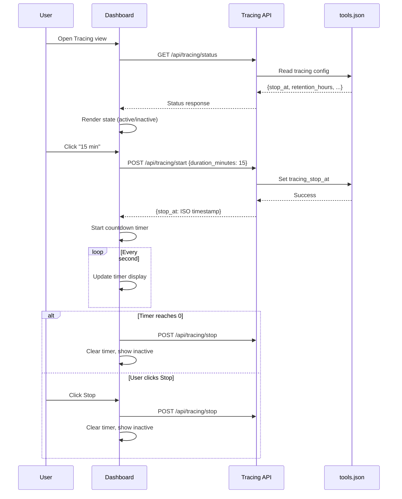
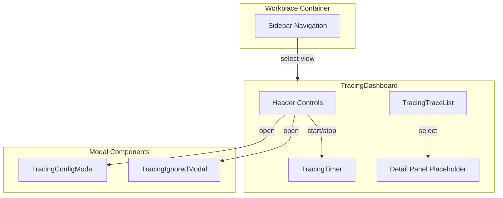
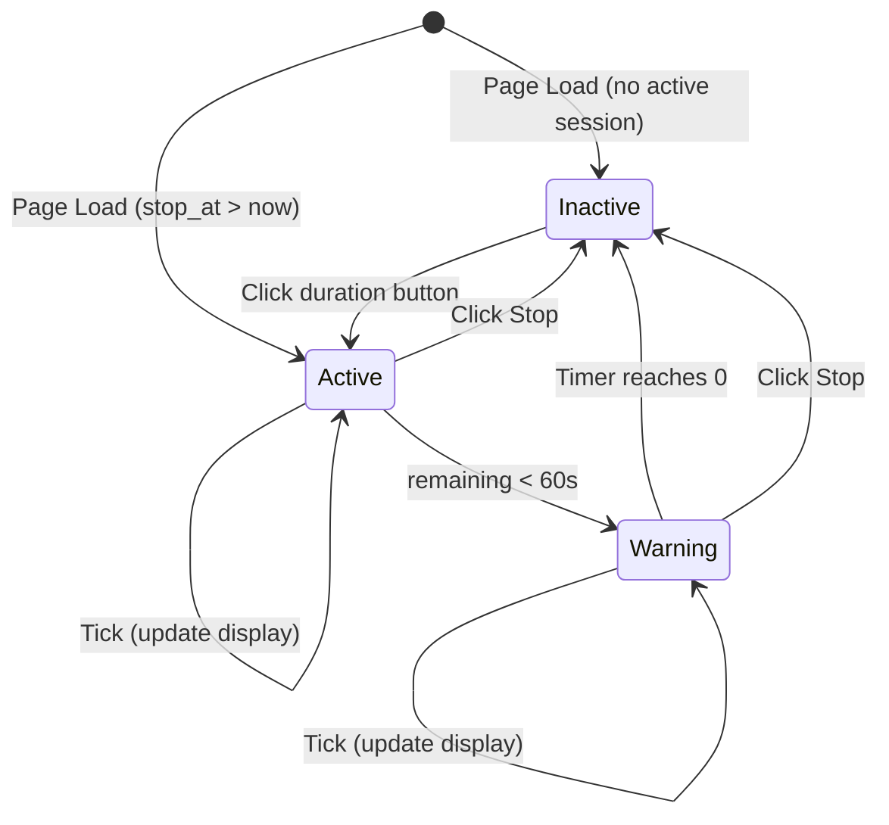

# Technical Design: Tracing Dashboard UI

> Feature ID: FEATURE-023-B | Version: v1.0 | Last Updated: 02-01-2026

---

## Version History

| Version | Date | Description |
|---------|------|-------------|
| v1.0 | 02-01-2026 | Initial design |

---

## Part 1: Agent-Facing Summary

> **Purpose:** Quick reference for AI agents navigating large projects.
> **📌 AI Coders:** Focus on this section for implementation context.

### Key Components Implemented

| Component | Responsibility | Scope/Impact | Tags |
|-----------|----------------|--------------|------|
| `TracingDashboard` | Main dashboard view component | New Workplace view | #frontend #tracing #dashboard |
| `TracingTimer` | Countdown timer with state | Timer display and logic | #frontend #timer #state |
| `TracingTraceList` | Sidebar trace list component | Browse/select traces | #frontend #list #selection |
| `TracingConfigModal` | Settings configuration modal | Config management | #frontend #modal #settings |
| `TracingIgnoredModal` | Ignored APIs modal | API exclusion management | #frontend #modal #settings |
| `tracing-dashboard.js` | Frontend module | All UI logic ~400 lines | #javascript #module |
| `tracing-dashboard.css` | Styling | Dashboard styles | #css #styling |

### Dependencies

| Dependency | Source | Design Link | Usage Description |
|------------|--------|-------------|-------------------|
| `TracingService` | FEATURE-023-A | [technical-design.md](../FEATURE-023-A/technical-design.md) | Backend tracing control and log retrieval |
| `tracing_routes.py` | FEATURE-023-A | [technical-design.md](../FEATURE-023-A/technical-design.md) | REST API endpoints for tracing |
| `workplace.js` | FEATURE-008 | [technical-design.md](../FEATURE-008/technical-design.md) | Workplace view registration pattern |

### Major Flow

1. User clicks "Tracing" in Workplace sidebar → Dashboard loads
2. Dashboard calls `GET /api/tracing/status` → Renders current state
3. User clicks duration button → `POST /api/tracing/start` → Timer starts
4. Timer counts down every second → Auto-stops at zero
5. User clicks Stop → `POST /api/tracing/stop` → Timer clears
6. Trace list polls `GET /api/tracing/logs` → Updates sidebar

### Usage Example

```javascript
// Initialize tracing dashboard in Workplace
const tracing = new TracingDashboard(containerElement);
tracing.init();

// Programmatic control (for testing)
await tracing.startTracing(15); // 15 minutes
await tracing.stopTracing();
const logs = await tracing.refreshTraceList();
```

---

## Part 2: Implementation Guide

> **Purpose:** Human-readable details for developers.
> **📌 Emphasis on visual diagrams for comprehension.

### Workflow Diagram



### Component Architecture



### File Structure

```
src/x_ipe/
├── static/
│   ├── js/
│   │   └── features/
│   │       └── tracing-dashboard.js  # NEW ~400 lines
│   └── css/
│       └── tracing-dashboard.css     # NEW ~200 lines
├── templates/
│   └── workplace.html                # MODIFY - add view template
└── routes/
    └── tracing_routes.py             # EXISTS - no changes needed
```

### Module: tracing-dashboard.js

**Class: TracingDashboard**

```javascript
class TracingDashboard {
    constructor(container) {
        this.container = container;
        this.timer = null;
        this.timerInterval = null;
        this.selectedTraceId = null;
        this.traceListPollInterval = null;
    }
    
    // Lifecycle
    async init() { }
    destroy() { }
    
    // API calls
    async fetchStatus() { }
    async startTracing(durationMinutes) { }
    async stopTracing() { }
    async fetchTraceLogs() { }
    async updateConfig(config) { }
    async updateIgnoredApis(patterns) { }
    
    // UI rendering
    render() { }
    renderHeader() { }
    renderTimer(stopAt) { }
    renderTraceList(traces) { }
    
    // Timer logic
    startCountdown(stopAt) { }
    stopCountdown() { }
    updateTimerDisplay() { }
    
    // Event handlers
    onDurationClick(minutes) { }
    onStopClick() { }
    onTraceSelect(traceId) { }
    onConfigClick() { }
    onIgnoredApisClick() { }
}
```

**Class: TracingConfigModal**

```javascript
class TracingConfigModal {
    constructor(onSave) {
        this.onSave = onSave;
    }
    
    open(currentConfig) { }
    close() { }
    render() { }
    handleSave() { }
}
```

**Class: TracingIgnoredModal**

```javascript
class TracingIgnoredModal {
    constructor(onSave) {
        this.onSave = onSave;
    }
    
    open(patterns) { }
    close() { }
    addPattern(pattern) { }
    removePattern(index) { }
    handleSave() { }
}
```

### API Integration

| Endpoint | Method | Request | Response | Usage |
|----------|--------|---------|----------|-------|
| `/api/tracing/status` | GET | - | `{enabled, stop_at, retention_hours, log_path, ignored_apis, active}` | Initial load, resume |
| `/api/tracing/start` | POST | `{duration_minutes: 3\|15\|30}` | `{stop_at: ISO}` | Start tracing |
| `/api/tracing/stop` | POST | - | `{success: true}` | Stop tracing |
| `/api/tracing/logs` | GET | - | `[{trace_id, api, timestamp, size, has_error}]` | List traces |
| `/api/tracing/config` | POST | `{retention_hours, log_path}` | `{success: true}` | Update config |

### Timer State Machine



### HTML Template Structure

```html
<!-- Tracing Dashboard View -->
<div id="tracing-dashboard" class="tracing-dashboard">
    <!-- Header -->
    <div class="tracing-header">
        <h2>Tracing</h2>
        <div class="tracing-controls">
            <button class="btn-config" title="Configuration">⚙️ Config</button>
            <button class="btn-ignored" title="Ignored APIs">🚫 Ignored APIs</button>
        </div>
        <div class="tracing-duration-buttons">
            <button class="btn-duration" data-minutes="3">3 min</button>
            <button class="btn-duration" data-minutes="15">15 min</button>
            <button class="btn-duration" data-minutes="30">30 min</button>
        </div>
        <div class="tracing-timer">
            <span class="timer-display">00:00</span>
            <button class="btn-stop" hidden>Stop</button>
        </div>
    </div>
    
    <!-- Main Content -->
    <div class="tracing-content">
        <!-- Left Sidebar: Trace List -->
        <div class="trace-list-sidebar">
            <div class="trace-list-header">
                <span>Traces</span>
                <button class="btn-refresh" title="Refresh">🔄</button>
            </div>
            <div class="trace-list-items">
                <!-- Populated by JS -->
            </div>
        </div>
        
        <!-- Right Panel: Detail (placeholder for FEATURE-023-C) -->
        <div class="trace-detail-panel">
            <div class="trace-detail-placeholder">
                Select a trace to view details
            </div>
        </div>
    </div>
</div>
```

### CSS Styling Guide

```css
/* Color variables matching X-IPE design system */
:root {
    --tracing-active: #22c55e;      /* Green - timer active */
    --tracing-warning: #eab308;     /* Yellow - timer < 1 min */
    --tracing-inactive: #9ca3af;    /* Gray - timer inactive */
    --tracing-error: #ef4444;       /* Red - error traces */
    --tracing-selected: #3b82f6;    /* Blue - selected item */
}

/* Timer states */
.timer-display.active { color: var(--tracing-active); }
.timer-display.warning { color: var(--tracing-warning); }
.timer-display.inactive { color: var(--tracing-inactive); }

/* Duration button states */
.btn-duration.selected {
    background: var(--tracing-active);
    color: white;
}

/* Trace list item states */
.trace-item.success::before { background: var(--tracing-active); }
.trace-item.error::before { background: var(--tracing-error); }
.trace-item.selected { background: var(--tracing-selected); color: white; }
```

### Implementation Steps

| Step | Task | Files | Estimated Lines |
|------|------|-------|-----------------|
| 1 | Create tracing-dashboard.css | `static/css/tracing-dashboard.css` | ~200 |
| 2 | Create TracingDashboard class | `static/js/features/tracing-dashboard.js` | ~250 |
| 3 | Create TracingConfigModal | `static/js/features/tracing-dashboard.js` | ~80 |
| 4 | Create TracingIgnoredModal | `static/js/features/tracing-dashboard.js` | ~80 |
| 5 | Register view in Workplace | `static/js/features/workplace.js` | ~20 |
| 6 | Add template section | `templates/workplace.html` | ~30 |

**Total new code:** ~660 lines

### Workplace Integration

**Adding new view to Workplace sidebar:**

```javascript
// In workplace.js - add to view registry
this.views = {
    'ideas': { ... },
    'tracing': {
        label: 'Tracing',
        icon: '📊',
        component: TracingDashboard,
        init: (container) => new TracingDashboard(container)
    }
};
```

### Edge Cases & Error Handling

| Scenario | Handling |
|----------|----------|
| API error on start | Show error toast, remain inactive |
| API error on stop | Show error toast, clear local timer anyway |
| Page refresh mid-timer | Fetch status, resume if stop_at > now |
| Network timeout | Show "Connection error", offer retry |
| Empty trace list | Show "No traces captured" message |
| Invalid duration | Validate on click, ignore invalid |

### Accessibility

| Feature | Implementation |
|---------|----------------|
| Screen reader | ARIA labels on timer, buttons |
| Keyboard nav | Tab order: duration → stop → config → ignored → list |
| Focus trap | Modals trap focus until closed |
| Color contrast | WCAG AA for all text/backgrounds |

---

## Design Decisions

| Decision | Choice | Rationale |
|----------|--------|-----------|
| Separate module | tracing-dashboard.js | workplace.js already 2684 lines, apply 800-line rule |
| Vanilla JS | No framework | Consistent with X-IPE codebase |
| Polling for traces | 5-second interval when active | Simple, reliable, low overhead |
| Timer in JS | setInterval | Sufficient accuracy for UX |
| Modals inline | Part of same module | Simple, tightly coupled to dashboard |

---

## Design Change Log

| Date | Phase | Change Summary |
|------|-------|----------------|
| 02-01-2026 | Initial Design | Initial technical design for Tracing Dashboard UI. Defines TracingDashboard, TracingTimer, modals. Integrates with existing tracing_routes.py API. |

---
