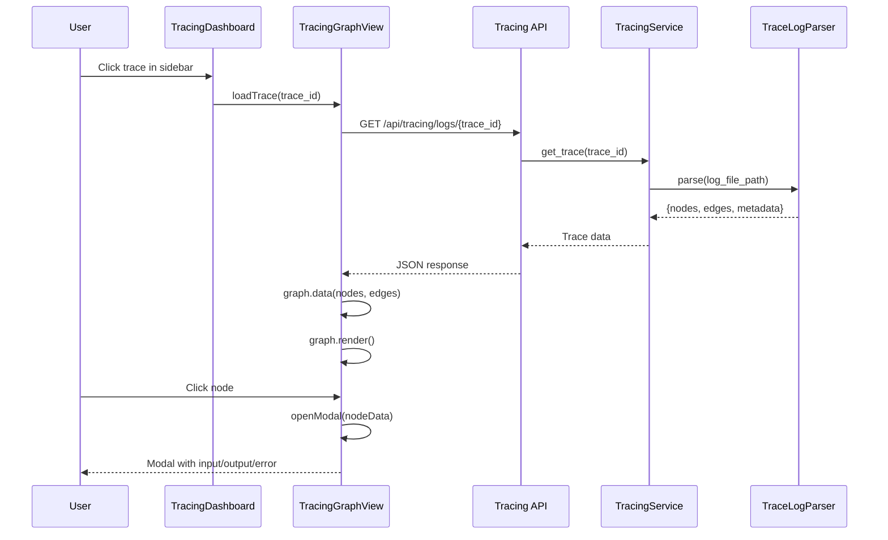
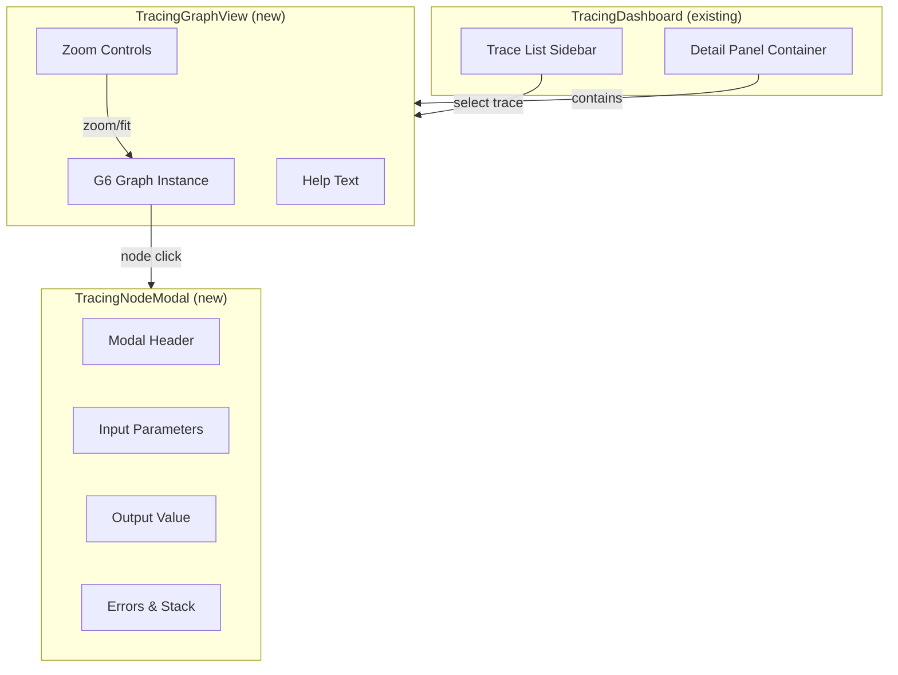

# Technical Design: Trace Viewer & DAG Visualization

> Feature ID: FEATURE-023-C | Version: v1.0 | Last Updated: 02-01-2026

---

## Version History

| Version | Date | Description |
|---------|------|-------------|
| v1.0 | 02-01-2026 | Initial design |

---

## Part 1: Agent-Facing Summary

> **Purpose:** Quick reference for AI agents navigating large projects.
> **📌 AI Coders:** Focus on this section for implementation context.

### Key Components Implemented

| Component | Responsibility | Scope/Impact | Tags |
|-----------|----------------|--------------|------|
| `TraceLogParser` | Parse trace log files into graph structure | Backend service | #backend #tracing #parser |
| `TracingService.get_trace()` | Fetch parsed trace data by ID | Service method | #backend #api #service |
| `GET /api/tracing/logs/{trace_id}` | API endpoint for trace graph data | New route | #api #rest #tracing |
| `TracingGraphView` | G6-based DAG visualization component | Frontend module | #frontend #g6 #visualization |
| `TracingNodeModal` | Detail modal for node inspection | Frontend component | #frontend #modal #ui |
| `tracing-graph.js` | Separate module for DAG rendering | New ~450 lines | #javascript #g6 #module |

### Dependencies

| Dependency | Source | Design Link | Usage Description |
|------------|--------|-------------|-------------------|
| `TracingService` | FEATURE-023-A | [technical-design.md](../FEATURE-023-A/technical-design.md) | Backend tracing service, log storage |
| `TracingDashboard` | FEATURE-023-B | [technical-design.md](../FEATURE-023-B/technical-design.md) | Parent dashboard component, trace selection |
| `G6 by AntV` | External | [g6.antv.vision](https://g6.antv.vision/) | Canvas-based graph rendering library |
| `tracing_routes.py` | FEATURE-023-A | [technical-design.md](../FEATURE-023-A/technical-design.md) | REST API blueprint |

### Major Flow

1. User selects trace from sidebar → Dashboard emits trace selection event
2. TracingGraphView receives trace_id → Calls `GET /api/tracing/logs/{trace_id}`
3. Backend parses log file → Returns nodes/edges structure
4. G6 graph renders DAG with dagre layout
5. User clicks node → TracingNodeModal opens with full details
6. User zooms/pans → G6 handles natively

### Usage Example

```javascript
// Initialize graph view in dashboard
const graphView = new TracingGraphView(detailPanelElement);
await graphView.loadTrace('550e8400-e29b-41d4-a716');

// Programmatic control (for testing)
graphView.zoomIn();
graphView.zoomOut();
graphView.fitToView();
graphView.destroy();
```

```python
# Backend trace parsing
service = TracingService("/path/to/project")
trace_data = service.get_trace("550e8400-e29b-41d4-a716")
# Returns: {"trace_id": "...", "nodes": [...], "edges": [...], ...}
```

---

## Part 2: Implementation Guide

> **Purpose:** Human-readable details for developers.
> **📌 Emphasis on visual diagrams for comprehension.

### Workflow Diagram



### Component Architecture



### File Structure

```
src/x_ipe/
├── static/
│   ├── js/
│   │   └── features/
│   │       ├── tracing-dashboard.js    # MODIFY - integrate graph view
│   │       └── tracing-graph.js        # NEW ~450 lines
│   └── css/
│       └── tracing-dashboard.css       # MODIFY - add graph/modal styles
├── services/
│   └── tracing_service.py              # MODIFY - add get_trace method
├── routes/
│   └── tracing_routes.py               # MODIFY - add logs/{trace_id} endpoint
└── tracing/
    └── parser.py                       # NEW ~150 lines - log file parser
```

### Backend: TraceLogParser

**Module:** `src/x_ipe/tracing/parser.py`

```python
class TraceLogParser:
    """
    Parse trace log files into graph structure for visualization.
    
    Handles the log format:
        [TRACE-START] trace_id | API | timestamp
        [INFO] → start_function: name | input_json
        [INFO] ← return_function: name | output_json | duration
        [ERROR] ← exception: name | error | duration
        [TRACE-END] trace_id | total_duration | status
    """
    
    def parse(self, filepath: Path) -> Dict[str, Any]:
        """
        Parse trace log file into visualization-ready structure.
        
        Returns:
            {
                "trace_id": "...",
                "api": "POST /api/orders",
                "timestamp": "2026-02-01T04:15:30Z",
                "total_time_ms": 287,
                "status": "success" | "error",
                "nodes": [
                    {
                        "id": "node-0",
                        "label": "POST /api/orders",
                        "timing": "287ms",
                        "status": "success",
                        "level": "API",
                        "input": "{...}",
                        "output": "{...}",
                        "error": null
                    },
                    ...
                ],
                "edges": [
                    {"source": "node-0", "target": "node-1"},
                    ...
                ]
            }
        """
```

**Parsing Algorithm:**

```python
def parse(self, filepath):
    nodes = []
    edges = []
    call_stack = []  # Track parent-child relationships
    node_counter = 0
    
    for line in filepath.read_text().splitlines():
        if "[TRACE-START]" in line:
            # Create root API node
            trace_id, api, timestamp = parse_start_line(line)
            nodes.append(make_root_node(node_counter, api))
            call_stack.append(node_counter)
            node_counter += 1
            
        elif "→ start_function:" in line:
            # Push new function onto stack
            func_name, input_json = parse_function_start(line)
            level = "DEBUG" if "[DEBUG]" in line else "INFO"
            
            parent_id = call_stack[-1] if call_stack else None
            nodes.append(make_function_node(node_counter, func_name, level, input_json))
            
            if parent_id is not None:
                edges.append({"source": f"node-{parent_id}", "target": f"node-{node_counter}"})
            
            call_stack.append(node_counter)
            node_counter += 1
            
        elif "← return_function:" in line:
            # Pop function, update with output and timing
            func_name, output_json, duration = parse_function_return(line)
            current_id = call_stack.pop()
            update_node_output(nodes[current_id], output_json, duration)
            
        elif "← exception:" in line:
            # Mark node as error
            func_name, error_info, duration = parse_exception(line)
            current_id = call_stack.pop()
            update_node_error(nodes[current_id], error_info, duration)
            
        elif "[TRACE-END]" in line:
            # Update root node timing and status
            trace_id, total_duration, status = parse_end_line(line)
            update_root_node(nodes[0], total_duration, status)
    
    return build_response(nodes, edges)
```

### Backend: TracingService Extension

**Add to `tracing_service.py`:**

```python
from x_ipe.tracing.parser import TraceLogParser

class TracingService:
    # ... existing methods ...
    
    def get_trace(self, trace_id: str) -> Optional[Dict[str, Any]]:
        """
        Get parsed trace data for visualization.
        
        Args:
            trace_id: The trace ID (UUID portion of filename)
            
        Returns:
            Parsed trace data with nodes and edges, or None if not found
        """
        config = self.get_config()
        log_path = self.project_root / config["log_path"]
        
        # Find file matching trace_id
        for filepath in log_path.glob(f"*{trace_id}*.log"):
            parser = TraceLogParser()
            return parser.parse(filepath)
        
        return None
```

### Backend: API Endpoint

**Add to `tracing_routes.py`:**

```python
@tracing_bp.route('/logs/<trace_id>', methods=['GET'])
def get_trace(trace_id):
    """
    GET /api/tracing/logs/{trace_id}
    
    Get parsed trace data for visualization.
    
    Response:
        {
            "trace_id": "550e8400-e29b-41d4",
            "api": "POST /api/orders",
            "timestamp": "2026-02-01T04:15:30Z",
            "total_time_ms": 287,
            "status": "success",
            "nodes": [...],
            "edges": [...]
        }
        
    Errors:
        404 - Trace not found
    """
    service = get_service()
    trace_data = service.get_trace(trace_id)
    
    if trace_data is None:
        return jsonify({"error": "Trace not found"}), 404
    
    return jsonify(trace_data)
```

### Frontend: TracingGraphView

**Module:** `src/x_ipe/static/js/features/tracing-graph.js`

```javascript
/**
 * FEATURE-023-C: Trace Viewer & DAG Visualization
 * G6-based graph rendering for trace visualization
 */

class TracingGraphView {
    constructor(container) {
        this.container = container;
        this.graph = null;
        this.modal = null;
        this.currentTraceId = null;
    }
    
    // -------------------------------------------------------------------------
    // Lifecycle
    // -------------------------------------------------------------------------
    
    async init() {
        this.render();
        this.initGraph();
        this.bindEvents();
    }
    
    destroy() {
        if (this.graph) {
            this.graph.destroy();
            this.graph = null;
        }
        if (this.modal) {
            this.modal.close();
        }
    }
    
    // -------------------------------------------------------------------------
    // API Methods
    // -------------------------------------------------------------------------
    
    async loadTrace(traceId) {
        if (!traceId) {
            this.showEmptyState();
            return;
        }
        
        this.currentTraceId = traceId;
        this.showLoading();
        
        try {
            const response = await fetch(`/api/tracing/logs/${traceId}`);
            if (!response.ok) {
                throw new Error('Trace not found');
            }
            
            const data = await response.json();
            this.renderGraph(data);
        } catch (error) {
            console.error('Error loading trace:', error);
            this.showError('Failed to load trace');
        }
    }
    
    // -------------------------------------------------------------------------
    // Graph Initialization
    // -------------------------------------------------------------------------
    
    initGraph() {
        const graphContainer = this.container.querySelector('.trace-graph-canvas');
        const width = graphContainer.clientWidth || 800;
        const height = graphContainer.clientHeight || 500;
        
        // Register custom trace node
        this.registerTraceNode();
        
        this.graph = new G6.Graph({
            container: graphContainer,
            width,
            height,
            fitView: true,
            fitViewPadding: 60,
            animate: true,
            modes: { 
                default: ['drag-canvas', 'zoom-canvas'] 
            },
            layout: { 
                type: 'dagre', 
                rankdir: 'LR', 
                nodesep: 40, 
                ranksep: 80 
            },
            defaultNode: { type: 'trace-node' },
            defaultEdge: {
                type: 'polyline',
                style: {
                    stroke: '#cbd5e1',
                    lineWidth: 2,
                    endArrow: { 
                        path: G6.Arrow.triangle(8, 10, 0), 
                        fill: '#cbd5e1' 
                    },
                    radius: 8
                }
            }
        });
        
        // Event handlers
        this.graph.on('node:click', (e) => this.onNodeClick(e));
        this.graph.on('node:mouseenter', (e) => this.onNodeHover(e, true));
        this.graph.on('node:mouseleave', (e) => this.onNodeHover(e, false));
    }
    
    registerTraceNode() {
        G6.registerNode('trace-node', {
            draw(cfg, group) {
                const isError = cfg.status === 'error';
                const statusColor = isError ? '#ef4444' : '#10b981';
                
                // Main rectangle
                const rect = group.addShape('rect', {
                    attrs: {
                        x: -70, y: -28,
                        width: 140, height: 56,
                        fill: '#ffffff',
                        stroke: statusColor,
                        lineWidth: 2,
                        radius: 8,
                        shadowColor: 'rgba(0,0,0,0.08)',
                        shadowBlur: 8,
                        shadowOffsetY: 2,
                        cursor: 'pointer'
                    },
                    name: 'node-rect'
                });
                
                // Status dot
                group.addShape('circle', {
                    attrs: { x: -55, y: -12, r: 4, fill: statusColor },
                    name: 'status-dot'
                });
                
                // Level badge
                const levelText = cfg.level || 'INFO';
                const levelColor = levelText === 'DEBUG' ? '#94a3b8' : 
                                   levelText === 'API' ? '#6366f1' : '#3b82f6';
                group.addShape('rect', {
                    attrs: { x: 20, y: -20, width: 40, height: 16, fill: '#f1f5f9', radius: 3 },
                    name: 'level-bg'
                });
                group.addShape('text', {
                    attrs: {
                        x: 40, y: -12,
                        text: levelText,
                        fontSize: 9,
                        fontWeight: 600,
                        fontFamily: 'JetBrains Mono, monospace',
                        fill: levelColor,
                        textAlign: 'center',
                        textBaseline: 'middle'
                    },
                    name: 'level-text'
                });
                
                // Function name (truncate if too long)
                let label = cfg.label || '';
                if (label.length > 18) {
                    label = label.substring(0, 15) + '...';
                }
                group.addShape('text', {
                    attrs: {
                        x: 0, y: 2,
                        text: label,
                        fontSize: 12,
                        fontWeight: 500,
                        fontFamily: 'JetBrains Mono, monospace',
                        fill: '#0f172a',
                        textAlign: 'center',
                        textBaseline: 'middle'
                    },
                    name: 'name-text'
                });
                
                // Timing
                group.addShape('text', {
                    attrs: {
                        x: 0, y: 18,
                        text: cfg.timing || '--',
                        fontSize: 11,
                        fontWeight: 600,
                        fontFamily: 'JetBrains Mono, monospace',
                        fill: '#64748b',
                        textAlign: 'center',
                        textBaseline: 'middle'
                    },
                    name: 'timing-text'
                });
                
                return rect;
            },
            setState(name, value, item) {
                const group = item.getContainer();
                const rect = group.find(e => e.get('name') === 'node-rect');
                if (name === 'hover') {
                    rect.attr('shadowBlur', value ? 16 : 8);
                    rect.attr('shadowColor', value ? 'rgba(99, 102, 241, 0.3)' : 'rgba(0,0,0,0.08)');
                }
            }
        }, 'single-node');
    }
    
    // -------------------------------------------------------------------------
    // Rendering
    // -------------------------------------------------------------------------
    
    render() {
        this.container.innerHTML = `
            <div class="trace-graph-header">
                <div class="trace-graph-info">
                    <span class="trace-id" id="graphTraceId">--</span>
                    <span class="trace-status" id="graphStatus">--</span>
                </div>
                <div class="trace-graph-stats">
                    <span><strong>Entry:</strong> <span id="graphApi">--</span></span>
                    <span><strong>Total:</strong> <span id="graphTotal">--</span></span>
                    <span><strong>Functions:</strong> <span id="graphCount">--</span></span>
                </div>
            </div>
            <div class="trace-graph-canvas" id="traceGraphCanvas"></div>
            <div class="trace-graph-footer">
                <span class="trace-graph-help">
                    Scroll to zoom • Drag to pan • Click node to see details
                </span>
                <div class="trace-graph-controls">
                    <button class="zoom-btn" id="zoomIn" title="Zoom In">+</button>
                    <button class="zoom-btn" id="zoomOut" title="Zoom Out">−</button>
                    <button class="zoom-btn" id="zoomFit" title="Fit to View">⤢</button>
                </div>
            </div>
        `;
    }
    
    renderGraph(data) {
        // Update header info
        this.container.querySelector('#graphTraceId').textContent = 
            data.trace_id.substring(0, 12) + '...';
        this.container.querySelector('#graphStatus').textContent = 
            data.status.toUpperCase();
        this.container.querySelector('#graphStatus').className = 
            `trace-status ${data.status}`;
        this.container.querySelector('#graphApi').textContent = data.api;
        this.container.querySelector('#graphTotal').textContent = 
            data.total_time_ms + 'ms';
        this.container.querySelector('#graphCount').textContent = 
            data.nodes.length;
        
        // Render graph
        this.graph.data({ nodes: data.nodes, edges: data.edges });
        this.graph.render();
        this.graph.fitView(60);
    }
    
    showEmptyState() {
        const canvas = this.container.querySelector('.trace-graph-canvas');
        if (canvas) {
            canvas.innerHTML = `
                <div class="trace-graph-empty">
                    <div class="empty-icon">📊</div>
                    <div>Select a trace to view</div>
                </div>
            `;
        }
    }
    
    showLoading() {
        const canvas = this.container.querySelector('.trace-graph-canvas');
        if (canvas) {
            canvas.innerHTML = `
                <div class="trace-graph-loading">
                    <div class="spinner"></div>
                    <div>Loading trace...</div>
                </div>
            `;
        }
    }
    
    showError(message) {
        const canvas = this.container.querySelector('.trace-graph-canvas');
        if (canvas) {
            canvas.innerHTML = `
                <div class="trace-graph-error">
                    <div class="error-icon">⚠️</div>
                    <div>${message}</div>
                </div>
            `;
        }
    }
    
    // -------------------------------------------------------------------------
    // Event Handlers
    // -------------------------------------------------------------------------
    
    bindEvents() {
        this.container.querySelector('#zoomIn').addEventListener('click', () => this.zoomIn());
        this.container.querySelector('#zoomOut').addEventListener('click', () => this.zoomOut());
        this.container.querySelector('#zoomFit').addEventListener('click', () => this.fitToView());
        
        // Resize handler
        window.addEventListener('resize', () => this.handleResize());
    }
    
    onNodeClick(e) {
        const nodeData = e.item.getModel();
        this.openModal(nodeData);
    }
    
    onNodeHover(e, isHover) {
        this.graph.setItemState(e.item, 'hover', isHover);
        const canvas = this.container.querySelector('.trace-graph-canvas');
        canvas.style.cursor = isHover ? 'pointer' : 'grab';
    }
    
    // -------------------------------------------------------------------------
    // Zoom Controls
    // -------------------------------------------------------------------------
    
    zoomIn() {
        if (this.graph) {
            const zoom = this.graph.getZoom();
            const center = this.getGraphCenter();
            this.graph.zoomTo(Math.min(zoom * 1.2, 4), center);
        }
    }
    
    zoomOut() {
        if (this.graph) {
            const zoom = this.graph.getZoom();
            const center = this.getGraphCenter();
            this.graph.zoomTo(Math.max(zoom / 1.2, 0.25), center);
        }
    }
    
    fitToView() {
        if (this.graph) {
            this.graph.fitView(60);
        }
    }
    
    getGraphCenter() {
        const canvas = this.container.querySelector('.trace-graph-canvas');
        return { x: canvas.clientWidth / 2, y: canvas.clientHeight / 2 };
    }
    
    handleResize() {
        if (this.graph) {
            const canvas = this.container.querySelector('.trace-graph-canvas');
            this.graph.changeSize(canvas.clientWidth, canvas.clientHeight);
            this.graph.fitView(60);
        }
    }
    
    // -------------------------------------------------------------------------
    // Modal
    // -------------------------------------------------------------------------
    
    openModal(nodeData) {
        if (this.modal) {
            this.modal.close();
        }
        this.modal = new TracingNodeModal(nodeData);
        this.modal.open();
    }
}
```

### Frontend: TracingNodeModal

**Add to `tracing-graph.js`:**

```javascript
class TracingNodeModal {
    constructor(nodeData) {
        this.nodeData = nodeData;
        this.overlay = null;
    }
    
    open() {
        this.render();
        this.bindEvents();
        document.body.appendChild(this.overlay);
        
        // Animate in
        requestAnimationFrame(() => {
            this.overlay.classList.add('active');
        });
    }
    
    render() {
        const isError = this.nodeData.status === 'error';
        const hasError = this.nodeData.error != null;
        
        this.overlay = document.createElement('div');
        this.overlay.className = 'tracing-node-modal-overlay';
        this.overlay.innerHTML = `
            <div class="tracing-node-modal">
                <div class="modal-header">
                    <div class="modal-title">
                        <span class="status-dot ${this.nodeData.status}"></span>
                        <h3>${this.escapeHtml(this.nodeData.label)}</h3>
                    </div>
                    <span class="modal-latency">${this.nodeData.timing || '--'}</span>
                    <button class="modal-close">&times;</button>
                </div>
                <div class="modal-body">
                    ${this.renderInputSection()}
                    ${this.renderOutputSection()}
                    ${this.renderErrorSection(hasError)}
                </div>
            </div>
        `;
    }
    
    renderInputSection() {
        const input = this.nodeData.input || '{}';
        return `
            <div class="modal-section">
                <div class="modal-section-header">
                    <span class="section-icon">📥</span>
                    <span class="section-title">Input Parameters</span>
                </div>
                <div class="code-block">
                    <pre>${this.formatJSON(input)}</pre>
                </div>
            </div>
        `;
    }
    
    renderOutputSection() {
        const output = this.nodeData.output || '{}';
        return `
            <div class="modal-section">
                <div class="modal-section-header">
                    <span class="section-icon">📤</span>
                    <span class="section-title">Output / Return Value</span>
                </div>
                <div class="code-block">
                    <pre>${this.formatJSON(output)}</pre>
                </div>
            </div>
        `;
    }
    
    renderErrorSection(hasError) {
        if (!hasError) {
            return `
                <div class="modal-section">
                    <div class="modal-section-header">
                        <span class="section-icon">⚠️</span>
                        <span class="section-title">Errors</span>
                    </div>
                    <div class="no-error">
                        <span>✓</span> No errors occurred
                    </div>
                </div>
            `;
        }
        
        const error = this.nodeData.error;
        const stackHtml = (error.stack || []).map(line => 
            `<div class="stack-line">at <span class="func">${this.escapeHtml(line.func)}</span> (<span class="file">${this.escapeHtml(line.file)}:${line.line}</span>)</div>`
        ).join('');
        
        return `
            <div class="modal-section error">
                <div class="modal-section-header">
                    <span class="section-icon">⚠️</span>
                    <span class="section-title">Errors</span>
                </div>
                <div class="error-block">
                    <div class="error-type">${this.escapeHtml(error.type)}</div>
                    <div class="error-message">${this.escapeHtml(error.message)}</div>
                    <div class="error-stack">
                        <div class="stack-title">Stack Trace</div>
                        ${stackHtml}
                    </div>
                </div>
            </div>
        `;
    }
    
    bindEvents() {
        this.overlay.querySelector('.modal-close').addEventListener('click', () => this.close());
        this.overlay.addEventListener('click', (e) => {
            if (e.target === this.overlay) this.close();
        });
        
        // ESC to close
        this.escHandler = (e) => {
            if (e.key === 'Escape') this.close();
        };
        document.addEventListener('keydown', this.escHandler);
    }
    
    close() {
        if (this.overlay) {
            this.overlay.classList.remove('active');
            setTimeout(() => {
                this.overlay.remove();
                this.overlay = null;
            }, 200);
        }
        if (this.escHandler) {
            document.removeEventListener('keydown', this.escHandler);
        }
    }
    
    formatJSON(jsonStr) {
        try {
            // Try to pretty-print if it's valid JSON
            const obj = JSON.parse(jsonStr);
            jsonStr = JSON.stringify(obj, null, 2);
        } catch (e) {
            // Keep original if not valid JSON
        }
        
        return this.escapeHtml(jsonStr)
            .replace(/"([^"]+)":/g, '<span class="json-key">"$1"</span>:')
            .replace(/: "([^"]+)"/g, ': <span class="json-string">"$1"</span>')
            .replace(/: (\d+\.?\d*)/g, ': <span class="json-number">$1</span>')
            .replace(/: (true|false)/g, ': <span class="json-boolean">$1</span>')
            .replace(/: (null)/g, ': <span class="json-null">$1</span>');
    }
    
    escapeHtml(text) {
        const div = document.createElement('div');
        div.textContent = text;
        return div.innerHTML;
    }
}

// Export
if (typeof window !== 'undefined') {
    window.TracingGraphView = TracingGraphView;
    window.TracingNodeModal = TracingNodeModal;
}
```

### CSS Additions

**Add to `tracing-dashboard.css`:**

```css
/* ========================================
   FEATURE-023-C: Trace Graph Visualization
   ======================================== */

/* Graph Header */
.trace-graph-header {
    display: flex;
    justify-content: space-between;
    align-items: center;
    padding: 12px 16px;
    background: var(--bg-primary);
    border-bottom: 1px solid var(--border-subtle);
}

.trace-graph-info {
    display: flex;
    align-items: center;
    gap: 12px;
}

.trace-graph-info .trace-id {
    font-family: 'JetBrains Mono', monospace;
    font-size: 12px;
    color: var(--text-muted);
}

.trace-graph-info .trace-status {
    padding: 4px 10px;
    border-radius: 4px;
    font-size: 11px;
    font-weight: 600;
    text-transform: uppercase;
}

.trace-status.success {
    background: var(--status-success-light);
    color: var(--status-success);
}

.trace-status.error {
    background: var(--status-error-light);
    color: var(--status-error);
}

.trace-graph-stats {
    display: flex;
    gap: 20px;
    font-size: 13px;
}

.trace-graph-stats strong {
    color: var(--text-muted);
}

/* Graph Canvas */
.trace-graph-canvas {
    flex: 1;
    position: relative;
    background: var(--bg-secondary);
    min-height: 400px;
}

/* Graph Footer */
.trace-graph-footer {
    display: flex;
    justify-content: space-between;
    align-items: center;
    padding: 8px 16px;
    background: var(--bg-primary);
    border-top: 1px solid var(--border-subtle);
}

.trace-graph-help {
    font-size: 12px;
    color: var(--text-muted);
}

.trace-graph-controls {
    display: flex;
    gap: 4px;
}

.trace-graph-controls .zoom-btn {
    width: 28px;
    height: 28px;
    border: 1px solid var(--border-default);
    border-radius: 4px;
    background: var(--bg-primary);
    cursor: pointer;
    font-size: 16px;
    display: flex;
    align-items: center;
    justify-content: center;
}

.trace-graph-controls .zoom-btn:hover {
    background: var(--bg-hover);
}

/* Empty/Loading/Error States */
.trace-graph-empty,
.trace-graph-loading,
.trace-graph-error {
    display: flex;
    flex-direction: column;
    align-items: center;
    justify-content: center;
    height: 100%;
    min-height: 400px;
    color: var(--text-muted);
    gap: 12px;
}

.trace-graph-empty .empty-icon,
.trace-graph-error .error-icon {
    font-size: 48px;
}

.trace-graph-loading .spinner {
    width: 32px;
    height: 32px;
    border: 3px solid var(--border-subtle);
    border-top-color: var(--accent-primary);
    border-radius: 50%;
    animation: spin 1s linear infinite;
}

@keyframes spin {
    to { transform: rotate(360deg); }
}

/* Node Modal */
.tracing-node-modal-overlay {
    position: fixed;
    top: 0;
    left: 0;
    right: 0;
    bottom: 0;
    background: rgba(0, 0, 0, 0.5);
    display: flex;
    align-items: center;
    justify-content: center;
    z-index: 1000;
    opacity: 0;
    transition: opacity 200ms;
}

.tracing-node-modal-overlay.active {
    opacity: 1;
}

.tracing-node-modal {
    background: var(--bg-primary);
    border-radius: 12px;
    box-shadow: var(--shadow-xl);
    width: 90%;
    max-width: 600px;
    max-height: 80vh;
    overflow: hidden;
    transform: scale(0.95);
    transition: transform 200ms;
}

.tracing-node-modal-overlay.active .tracing-node-modal {
    transform: scale(1);
}

.tracing-node-modal .modal-header {
    display: flex;
    align-items: center;
    padding: 16px 20px;
    border-bottom: 1px solid var(--border-subtle);
    gap: 12px;
}

.tracing-node-modal .modal-title {
    display: flex;
    align-items: center;
    gap: 10px;
    flex: 1;
}

.tracing-node-modal .modal-title h3 {
    font-family: 'JetBrains Mono', monospace;
    font-size: 14px;
    font-weight: 600;
    margin: 0;
}

.tracing-node-modal .status-dot {
    width: 10px;
    height: 10px;
    border-radius: 50%;
}

.tracing-node-modal .status-dot.success {
    background: var(--status-success);
}

.tracing-node-modal .status-dot.error {
    background: var(--status-error);
}

.tracing-node-modal .modal-latency {
    font-family: 'JetBrains Mono', monospace;
    font-size: 14px;
    font-weight: 600;
    color: var(--text-secondary);
}

.tracing-node-modal .modal-close {
    width: 32px;
    height: 32px;
    border: none;
    background: none;
    font-size: 24px;
    color: var(--text-muted);
    cursor: pointer;
    border-radius: 4px;
}

.tracing-node-modal .modal-close:hover {
    background: var(--bg-hover);
}

.tracing-node-modal .modal-body {
    padding: 20px;
    overflow-y: auto;
    max-height: calc(80vh - 70px);
}

.tracing-node-modal .modal-section {
    margin-bottom: 20px;
    padding-bottom: 20px;
    border-bottom: 1px solid var(--border-subtle);
}

.tracing-node-modal .modal-section:last-child {
    margin-bottom: 0;
    padding-bottom: 0;
    border-bottom: none;
}

.tracing-node-modal .modal-section-header {
    display: flex;
    align-items: center;
    gap: 8px;
    margin-bottom: 12px;
}

.tracing-node-modal .section-icon {
    font-size: 16px;
}

.tracing-node-modal .section-title {
    font-size: 13px;
    font-weight: 600;
    color: var(--text-secondary);
}

.tracing-node-modal .code-block {
    background: var(--bg-tertiary);
    border-radius: 8px;
    padding: 12px;
    overflow-x: auto;
}

.tracing-node-modal .code-block pre {
    margin: 0;
    font-family: 'JetBrains Mono', monospace;
    font-size: 12px;
    line-height: 1.5;
    white-space: pre-wrap;
}

/* JSON Syntax Highlighting */
.json-key { color: #6366f1; }
.json-string { color: #22c55e; }
.json-number { color: #f59e0b; }
.json-boolean { color: #ef4444; }
.json-null { color: #94a3b8; }

/* Error Section */
.tracing-node-modal .modal-section.error .section-title {
    color: var(--status-error);
}

.tracing-node-modal .no-error {
    color: var(--status-success);
    display: flex;
    align-items: center;
    gap: 8px;
}

.tracing-node-modal .error-block {
    background: var(--status-error-light);
    border: 1px solid var(--status-error);
    border-radius: 8px;
    padding: 12px;
}

.tracing-node-modal .error-type {
    font-family: 'JetBrains Mono', monospace;
    font-size: 13px;
    font-weight: 600;
    color: var(--status-error);
    margin-bottom: 4px;
}

.tracing-node-modal .error-message {
    font-size: 13px;
    color: var(--text-primary);
    margin-bottom: 12px;
}

.tracing-node-modal .error-stack {
    background: rgba(0, 0, 0, 0.05);
    border-radius: 4px;
    padding: 10px;
}

.tracing-node-modal .stack-title {
    font-size: 11px;
    font-weight: 600;
    color: var(--text-muted);
    margin-bottom: 8px;
    text-transform: uppercase;
}

.tracing-node-modal .stack-line {
    font-family: 'JetBrains Mono', monospace;
    font-size: 11px;
    color: var(--text-secondary);
    margin-bottom: 4px;
}

.tracing-node-modal .stack-line .func {
    color: var(--accent-primary);
}

.tracing-node-modal .stack-line .file {
    color: var(--text-muted);
}
```

### Integration: Dashboard ↔ Graph

**Modify `tracing-dashboard.js`:**

```javascript
// In TracingDashboard class

async init() {
    this.render();
    this.bindEvents();
    await this.fetchStatus();
    await this.refreshTraceList();
    this.startPolling();
    
    // NEW: Initialize graph view
    const detailPanel = this.container.querySelector('.trace-detail-panel');
    if (detailPanel) {
        this.graphView = new TracingGraphView(detailPanel);
        await this.graphView.init();
    }
}

destroy() {
    this.stopCountdown();
    this.stopPolling();
    
    // NEW: Destroy graph view
    if (this.graphView) {
        this.graphView.destroy();
    }
}

// Modify selectTrace method
async selectTrace(traceId) {
    this.selectedTraceId = traceId;
    
    // Update sidebar selection
    this.container.querySelectorAll('.trace-item').forEach(item => {
        item.classList.toggle('active', item.dataset.traceId === traceId);
    });
    
    // NEW: Load trace in graph view
    if (this.graphView) {
        await this.graphView.loadTrace(traceId);
    }
}
```

### Implementation Steps

| Step | Task | Files | Lines |
|------|------|-------|-------|
| 1 | Create TraceLogParser | `tracing/parser.py` | ~150 |
| 2 | Add get_trace to TracingService | `services/tracing_service.py` | ~30 |
| 3 | Add /logs/{trace_id} endpoint | `routes/tracing_routes.py` | ~25 |
| 4 | Create tracing-graph.js | `static/js/features/tracing-graph.js` | ~450 |
| 5 | Add CSS for graph/modal | `static/css/tracing-dashboard.css` | ~250 |
| 6 | Integrate graph in dashboard | `static/js/features/tracing-dashboard.js` | ~30 |
| 7 | Add G6 script tag | `templates/workplace.html` | ~5 |

**Total new code:** ~940 lines

### Edge Cases & Error Handling

| Scenario | Handling |
|----------|----------|
| Trace file not found | API returns 404, graph shows error state |
| Malformed log file | Parser returns partial data with warning |
| Empty trace (only API node) | Graph shows single node |
| Very large trace (100+ nodes) | Render with warning, performance may degrade |
| G6 library fails to load | Show error message, disable graph |
| Node click during loading | Ignore until load complete |

---

## Design Decisions

| Decision | Choice | Rationale |
|----------|--------|-----------|
| Separate module | tracing-graph.js | Keep graph logic isolated, tracing-dashboard.js at 753 lines |
| G6 by AntV | Same as mockup | Already proven in mockup, good dagre support |
| Modal over tooltip | Click for details | More space for JSON, easier to read |
| Backend parsing | TraceLogParser | Keeps frontend simple, enables future enhancements |
| CDN for G6 | unpkg.com | Quick setup, matches mockup approach |

---

## Design Change Log

| Date | Phase | Change Summary |
|------|-------|----------------|
| 02-01-2026 | Initial Design | Initial technical design for Trace Viewer & DAG Visualization. Defines TraceLogParser, TracingGraphView, TracingNodeModal. Adds /logs/{trace_id} API endpoint. ~940 lines new code. |

---
