# Technical Design: Application Action Tracing - Core

> Feature ID: FEATURE-023 | Version: v1.0 | Last Updated: 02-01-2026

---

## Version History

| Version | Date | Description |
|---------|------|-------------|
| v1.0 | 02-01-2026 | Initial design - Phase 1 Core Tracing for Python |

---

## Part 1: Agent-Facing Summary

> **Purpose:** Quick reference for AI agents navigating large projects.
> **📌 AI Coders:** Focus on this section for implementation context.

### Technical Scope

| Scope | In/Out |
|-------|--------|
| Python tracing decorator | ✅ In |
| TypeScript tracing decorator | ❌ Out (Phase 1b) |
| Trace context management | ✅ In |
| Log file writer | ✅ In |
| Sensitive data redaction | ✅ In |
| Tracing configuration API | ✅ In |
| Startup cleanup | ✅ In |
| UI Dashboard | ❌ Out (Phase 2) |

### Key Components Implemented

| Component | Responsibility | File | Tags |
|-----------|----------------|------|------|
| `x_ipe_tracing` | Decorator factory for function tracing | `src/x_ipe/tracing/decorator.py` | #tracing #decorator #core |
| `TraceContext` | Thread-safe context propagation | `src/x_ipe/tracing/context.py` | #tracing #context #async |
| `TraceBuffer` | In-memory trace entry buffer | `src/x_ipe/tracing/buffer.py` | #tracing #buffer #memory |
| `TraceLogWriter` | Write trace buffer to log files | `src/x_ipe/tracing/writer.py` | #tracing #logging #io |
| `Redactor` | Sensitive data redaction | `src/x_ipe/tracing/redactor.py` | #tracing #security #redaction |
| `TracingService` | Tracing configuration and lifecycle | `src/x_ipe/services/tracing_service.py` | #tracing #service #config |
| `tracing_routes` | REST API for tracing control | `src/x_ipe/routes/tracing_routes.py` | #tracing #api #routes |

### Module Structure

```
src/x_ipe/
├── tracing/                    # NEW: Tracing module (~500 lines total)
│   ├── __init__.py            # Exports: x_ipe_tracing, TraceContext
│   ├── decorator.py           # @x_ipe_tracing decorator (~150 lines)
│   ├── context.py             # TraceContext with contextvars (~100 lines)
│   ├── buffer.py              # TraceBuffer in-memory storage (~80 lines)
│   ├── writer.py              # TraceLogWriter file output (~100 lines)
│   └── redactor.py            # Redactor patterns (~70 lines)
├── services/
│   └── tracing_service.py     # NEW: TracingService (~150 lines)
└── routes/
    └── tracing_routes.py      # NEW: Blueprint routes (~100 lines)
```

### Dependencies

| Dependency | Source | Usage Description |
|------------|--------|-------------------|
| `ToolsConfigService` | FEATURE-011 | Read/write tracing config from tools.json |
| `Flask Blueprint` | Foundation | Register tracing API routes |
| `contextvars` | Python stdlib | Thread-safe context propagation |
| `uuid` | Python stdlib | Generate trace IDs |
| `functools.wraps` | Python stdlib | Preserve decorated function metadata |

### Major Flow

```
1. Request starts → TraceContext.start_trace() → Generate UUID trace ID
2. Decorated function called → @x_ipe_tracing logs entry to TraceBuffer
3. Function executes → nested calls inherit trace context
4. Function returns/throws → @x_ipe_tracing logs exit/error to TraceBuffer
5. Request ends → TraceContext.end_trace() → TraceLogWriter flushes to file
```

### Usage Example

```python
# Import the decorator
from x_ipe.tracing import x_ipe_tracing

# Apply to functions
@x_ipe_tracing(level="INFO")
def process_order(order_id: str, items: list) -> dict:
    validate_items(items)  # If decorated, will be traced as child
    return {"status": "processed", "order_id": order_id}

@x_ipe_tracing(level="INFO", redact=["password"])
def create_user(email: str, password: str) -> dict:
    # password will be logged as [REDACTED]
    return {"id": 123, "email": email}

@x_ipe_tracing(level="DEBUG")
def validate_items(items: list) -> bool:
    return all(item.get("quantity", 0) > 0 for item in items)
```

### Configuration (tools.json)

```json
{
  "tracing_enabled": false,
  "tracing_stop_at": null,
  "tracing_log_path": "instance/traces/",
  "tracing_retention_hours": 24,
  "tracing_ignored_apis": ["/api/health", "/api/ping"]
}
```

---

## Part 2: Implementation Guide

> **Purpose:** Human-readable details for developers.
> **📌 Emphasis on visual diagrams for comprehension.

### Architecture Overview


### Sequence Diagram: Complete Trace Flow

```mermaid
sequenceDiagram
    participant Client
    participant Flask
    participant TraceCtx as TraceContext
    participant Decorator as @x_ipe_tracing
    participant Buffer as TraceBuffer
    participant Writer as TraceLogWriter
    participant Disk
    
    Client->>Flask: POST /api/orders
    Flask->>TraceCtx: start_trace()
    TraceCtx->>TraceCtx: Generate UUID
    TraceCtx->>Buffer: Create buffer
    
    Flask->>Decorator: process_order()
    Decorator->>Buffer: Log entry (→ start_function)
    Decorator->>Decorator: Execute function
    
    Note over Decorator: Nested calls inherit context
    
    Decorator->>Buffer: Log exit (← return_function)
    Decorator-->>Flask: Return result
    
    Flask->>TraceCtx: end_trace()
    TraceCtx->>Writer: flush(buffer)
    Writer->>Disk: Write log file
    
    Flask-->>Client: 200 OK
```



### Data Models

#### TraceEntry

```python
@dataclass
class TraceEntry:
    """Single trace log entry."""
    timestamp: datetime
    trace_id: str
    level: str           # "INFO", "DEBUG", "ERROR"
    direction: str       # "→" (entry), "←" (exit)
    event_type: str      # "start_function", "return_function", "exception"
    function_name: str
    data: dict           # parameters or return value
    duration_ms: Optional[float]  # only for exit events
    depth: int           # nesting level (0 = root)
    parent_id: Optional[str]  # parent function call ID
```

#### TraceBuffer

```python
class TraceBuffer:
    """In-memory buffer for trace entries."""
    trace_id: str
    root_api: str        # e.g., "POST /api/orders"
    started_at: datetime
    entries: List[TraceEntry]
    max_size_bytes: int = 10 * 1024 * 1024  # 10MB limit
    
    def add(self, entry: TraceEntry) -> None: ...
    def to_log_string(self) -> str: ...
```

#### TracingConfig

```python
@dataclass
class TracingConfig:
    """Tracing configuration from tools.json."""
    enabled: bool = False
    stop_at: Optional[datetime] = None
    log_path: str = "instance/traces/"
    retention_hours: int = 24
    ignored_apis: List[str] = field(default_factory=list)
    
    def is_active(self) -> bool:
        """Check if tracing is currently active."""
        if self.enabled:
            return True
        if self.stop_at and datetime.utcnow() < self.stop_at:
            return True
        return False
```

### Log File Format

```
[TRACE-START] {trace_id} | {method} {path} | {iso_timestamp}
  [{level}] → start_function: {name} | {params_json}
    [{level}] → start_function: {nested_name} | {params_json}
    [{level}] ← return_function: {nested_name} | {return_json} | {duration}ms
  [{level}] ← return_function: {name} | {return_json} | {duration}ms
[TRACE-END] {trace_id} | {total_duration}ms | {status}
```

**Example:**
```
[TRACE-START] 550e8400-e29b | POST /api/orders | 2026-02-01T03:10:00.000Z
  [INFO] → start_function: process_order | {"order_id": "O001", "items": [...]}
    [DEBUG] → start_function: validate_items | {"items": [...]}
    [DEBUG] ← return_function: validate_items | {"valid": true} | 12ms
  [INFO] ← return_function: process_order | {"status": "success"} | 87ms
[TRACE-END] 550e8400-e29b | 87ms | SUCCESS
```

### API Endpoints

| Method | Endpoint | Request Body | Response |
|--------|----------|--------------|----------|
| GET | `/api/tracing/status` | - | `{"enabled": false, "stop_at": null, "retention_hours": 24}` |
| POST | `/api/tracing/start` | `{"duration_minutes": 3|15|30}` | `{"success": true, "stop_at": "ISO-timestamp"}` |
| POST | `/api/tracing/stop` | - | `{"success": true}` |
| GET | `/api/tracing/logs` | - | `[{"trace_id": "...", "api": "...", "timestamp": "...", "size": 1234}]` |
| GET | `/api/tracing/logs/{trace_id}` | - | Parsed trace data (for UI) |
| DELETE | `/api/tracing/logs` | - | `{"deleted": 5}` |

### Sensitive Data Redaction


**Redaction Patterns:**

| Pattern Type | Detection Logic | Replacement |
|--------------|-----------------|-------------|
| Password | `"password" in key.lower()` | `[REDACTED]` |
| Secret | `"secret" in key.lower()` | `[REDACTED]` |
| Token | `"token" in key.lower()` | `[REDACTED]` |
| API Key | `key.lower() in ["api_key", "apikey"]` | `[REDACTED]` |
| Credit Card | `re.match(r'^\d{16}$', str(value))` | `[REDACTED]` |
| JWT | `str(value).startswith("eyJ")` | `[REDACTED]` |
| Custom | `key in decorator.redact` | `[REDACTED]` |

### Implementation Steps

#### Step 1: Create Tracing Module Structure

```bash
mkdir -p src/x_ipe/tracing
touch src/x_ipe/tracing/__init__.py
touch src/x_ipe/tracing/decorator.py
touch src/x_ipe/tracing/context.py
touch src/x_ipe/tracing/buffer.py
touch src/x_ipe/tracing/writer.py
touch src/x_ipe/tracing/redactor.py
```

#### Step 2: Implement Redactor (~70 lines)

```python
# src/x_ipe/tracing/redactor.py
import re
from typing import Any, Dict, List, Set

REDACTED = "[REDACTED]"

SENSITIVE_KEYS = {"password", "secret", "token", "api_key", "apikey", "authorization"}
CREDIT_CARD_PATTERN = re.compile(r"^\d{16}$")
JWT_PREFIX = "eyJ"


class Redactor:
    def __init__(self, custom_fields: List[str] = None):
        self.custom_fields = set(f.lower() for f in (custom_fields or []))
    
    def redact(self, data: Any) -> Any:
        """Recursively redact sensitive data."""
        if isinstance(data, dict):
            return {k: self._redact_value(k, v) for k, v in data.items()}
        elif isinstance(data, list):
            return [self.redact(item) for item in data]
        return data
    
    def _redact_value(self, key: str, value: Any) -> Any:
        key_lower = key.lower()
        
        # Check field name patterns
        if any(pattern in key_lower for pattern in SENSITIVE_KEYS):
            return REDACTED
        if key_lower in self.custom_fields:
            return REDACTED
        
        # Check value patterns
        if isinstance(value, str):
            if CREDIT_CARD_PATTERN.match(value):
                return REDACTED
            if value.startswith(JWT_PREFIX):
                return REDACTED
        
        # Recurse for nested structures
        return self.redact(value)
```

#### Step 3: Implement TraceBuffer (~80 lines)

```python
# src/x_ipe/tracing/buffer.py
from dataclasses import dataclass, field
from datetime import datetime
from typing import List, Optional
import json

@dataclass
class TraceEntry:
    timestamp: datetime
    trace_id: str
    level: str
    direction: str
    event_type: str
    function_name: str
    data: dict
    duration_ms: Optional[float] = None
    depth: int = 0

class TraceBuffer:
    MAX_SIZE = 10 * 1024 * 1024  # 10MB
    
    def __init__(self, trace_id: str, root_api: str):
        self.trace_id = trace_id
        self.root_api = root_api
        self.started_at = datetime.utcnow()
        self.entries: List[TraceEntry] = []
        self._size = 0
    
    def add(self, entry: TraceEntry) -> None:
        entry_size = len(json.dumps(entry.data))
        if self._size + entry_size > self.MAX_SIZE:
            return  # Silently drop if buffer full
        self.entries.append(entry)
        self._size += entry_size
    
    def to_log_string(self, status: str, total_ms: float) -> str:
        lines = [f"[TRACE-START] {self.trace_id} | {self.root_api} | {self.started_at.isoformat()}Z"]
        for entry in self.entries:
            indent = "  " * (entry.depth + 1)
            data_str = json.dumps(entry.data, default=str)
            if entry.duration_ms is not None:
                lines.append(f"{indent}[{entry.level}] {entry.direction} {entry.event_type}: {entry.function_name} | {data_str} | {entry.duration_ms:.0f}ms")
            else:
                lines.append(f"{indent}[{entry.level}] {entry.direction} {entry.event_type}: {entry.function_name} | {data_str}")
        lines.append(f"[TRACE-END] {self.trace_id} | {total_ms:.0f}ms | {status}")
        return "\n".join(lines)
```

#### Step 4: Implement TraceContext (~100 lines)

```python
# src/x_ipe/tracing/context.py
from contextvars import ContextVar
from typing import Optional
import uuid

from .buffer import TraceBuffer

_trace_context: ContextVar[Optional['TraceContext']] = ContextVar('trace_context', default=None)

class TraceContext:
    def __init__(self, trace_id: str, root_api: str):
        self.trace_id = trace_id
        self.buffer = TraceBuffer(trace_id, root_api)
        self.depth = 0
        self._call_stack = []
    
    @classmethod
    def start_trace(cls, root_api: str) -> 'TraceContext':
        trace_id = str(uuid.uuid4())[:13]  # Short UUID for readability
        ctx = cls(trace_id, root_api)
        _trace_context.set(ctx)
        return ctx
    
    @classmethod
    def get_current(cls) -> Optional['TraceContext']:
        return _trace_context.get()
    
    @classmethod
    def end_trace(cls) -> Optional[TraceBuffer]:
        ctx = _trace_context.get()
        if ctx:
            _trace_context.set(None)
            return ctx.buffer
        return None
    
    def push_call(self, func_name: str) -> int:
        self._call_stack.append(func_name)
        depth = self.depth
        self.depth += 1
        return depth
    
    def pop_call(self) -> None:
        if self._call_stack:
            self._call_stack.pop()
            self.depth -= 1
```

#### Step 5: Implement Decorator (~150 lines)

```python
# src/x_ipe/tracing/decorator.py
import functools
import time
import asyncio
from datetime import datetime
from typing import Callable, List, Optional

from .context import TraceContext
from .buffer import TraceEntry
from .redactor import Redactor


def x_ipe_tracing(level: str = "INFO", redact: List[str] = None) -> Callable:
    """
    Decorator for automatic function tracing.
    
    Args:
        level: Log level - "INFO", "DEBUG", or "SKIP"
        redact: List of parameter names to redact
    
    Usage:
        @x_ipe_tracing(level="INFO", redact=["password"])
        def create_user(email: str, password: str) -> dict:
            ...
    """
    if level == "SKIP":
        return lambda fn: fn  # No-op decorator
    
    redactor = Redactor(redact or [])
    
    def decorator(func: Callable) -> Callable:
        @functools.wraps(func)
        def sync_wrapper(*args, **kwargs):
            ctx = TraceContext.get_current()
            if not ctx:
                return func(*args, **kwargs)  # No active trace
            
            return _trace_call(ctx, func, args, kwargs, level, redactor)
        
        @functools.wraps(func)
        async def async_wrapper(*args, **kwargs):
            ctx = TraceContext.get_current()
            if not ctx:
                return await func(*args, **kwargs)
            
            return await _trace_call_async(ctx, func, args, kwargs, level, redactor)
        
        if asyncio.iscoroutinefunction(func):
            return async_wrapper
        return sync_wrapper
    
    return decorator


def _trace_call(ctx: TraceContext, func: Callable, args, kwargs, level: str, redactor: Redactor):
    func_name = func.__name__
    depth = ctx.push_call(func_name)
    
    # Log entry
    params = _extract_params(func, args, kwargs)
    redacted_params = redactor.redact(params)
    ctx.buffer.add(TraceEntry(
        timestamp=datetime.utcnow(),
        trace_id=ctx.trace_id,
        level=level,
        direction="→",
        event_type="start_function",
        function_name=func_name,
        data=redacted_params,
        depth=depth
    ))
    
    start = time.perf_counter()
    try:
        result = func(*args, **kwargs)
        duration = (time.perf_counter() - start) * 1000
        
        # Log success
        redacted_result = redactor.redact({"return": result})
        ctx.buffer.add(TraceEntry(
            timestamp=datetime.utcnow(),
            trace_id=ctx.trace_id,
            level=level,
            direction="←",
            event_type="return_function",
            function_name=func_name,
            data=redacted_result,
            duration_ms=duration,
            depth=depth
        ))
        return result
    except Exception as e:
        duration = (time.perf_counter() - start) * 1000
        
        # Log error
        ctx.buffer.add(TraceEntry(
            timestamp=datetime.utcnow(),
            trace_id=ctx.trace_id,
            level="ERROR",
            direction="←",
            event_type="exception",
            function_name=func_name,
            data={"error": type(e).__name__, "message": str(e)},
            duration_ms=duration,
            depth=depth
        ))
        raise
    finally:
        ctx.pop_call()
```

#### Step 6: Implement TraceLogWriter (~100 lines)

```python
# src/x_ipe/tracing/writer.py
import os
from datetime import datetime
from pathlib import Path
from typing import Optional

from .buffer import TraceBuffer


class TraceLogWriter:
    def __init__(self, log_path: str = "instance/traces/"):
        self.log_path = Path(log_path)
    
    def write(self, buffer: TraceBuffer, status: str = "SUCCESS") -> Optional[str]:
        """Write trace buffer to log file."""
        self.log_path.mkdir(parents=True, exist_ok=True)
        
        total_ms = (datetime.utcnow() - buffer.started_at).total_seconds() * 1000
        content = buffer.to_log_string(status, total_ms)
        
        # Generate filename
        timestamp = buffer.started_at.strftime("%Y%m%d-%H%M%S")
        api_name = self._sanitize_api_name(buffer.root_api)
        filename = f"{timestamp}-{api_name}-{buffer.trace_id}.log"
        filepath = self.log_path / filename
        
        try:
            with open(filepath, 'w') as f:
                f.write(content)
            os.chmod(filepath, 0o600)  # Owner read/write only
            return str(filepath)
        except Exception as e:
            print(f"[TRACING] Failed to write log: {e}")
            return None
    
    def cleanup(self, retention_hours: int = 24) -> int:
        """Delete log files older than retention period."""
        if not self.log_path.exists():
            return 0
        
        deleted = 0
        cutoff = datetime.utcnow().timestamp() - (retention_hours * 3600)
        
        for filepath in self.log_path.glob("*.log"):
            if filepath.stat().st_mtime < cutoff:
                filepath.unlink()
                deleted += 1
        
        return deleted
    
    def _sanitize_api_name(self, api: str) -> str:
        """Convert 'POST /api/orders' to 'post-api-orders'."""
        return api.lower().replace(" ", "-").replace("/", "-").strip("-")
```

#### Step 7: Implement TracingService (~150 lines)

```python
# src/x_ipe/services/tracing_service.py
from datetime import datetime, timedelta
from typing import Dict, List, Any, Optional
from pathlib import Path

from x_ipe.services.tools_config_service import ToolsConfigService
from x_ipe.tracing.writer import TraceLogWriter


class TracingService:
    """Service for managing tracing configuration and lifecycle."""
    
    def __init__(self, project_root: str):
        self.project_root = Path(project_root)
        self.tools_config = ToolsConfigService(project_root)
    
    def get_config(self) -> Dict[str, Any]:
        """Get current tracing configuration."""
        config = self.tools_config.load()
        return {
            "enabled": config.get("tracing_enabled", False),
            "stop_at": config.get("tracing_stop_at"),
            "log_path": config.get("tracing_log_path", "instance/traces/"),
            "retention_hours": config.get("tracing_retention_hours", 24),
            "ignored_apis": config.get("tracing_ignored_apis", [])
        }
    
    def is_active(self) -> bool:
        """Check if tracing is currently active."""
        config = self.get_config()
        if config["enabled"]:
            return True
        if config["stop_at"]:
            stop_at = datetime.fromisoformat(config["stop_at"].replace("Z", "+00:00"))
            return datetime.utcnow() < stop_at.replace(tzinfo=None)
        return False
    
    def start(self, duration_minutes: int) -> Dict[str, Any]:
        """Start tracing for specified duration."""
        if duration_minutes not in [3, 15, 30]:
            raise ValueError("Duration must be 3, 15, or 30 minutes")
        
        stop_at = datetime.utcnow() + timedelta(minutes=duration_minutes)
        
        config = self.tools_config.load()
        config["tracing_stop_at"] = stop_at.isoformat() + "Z"
        self.tools_config.save(config)
        
        return {"success": True, "stop_at": config["tracing_stop_at"]}
    
    def stop(self) -> Dict[str, Any]:
        """Stop tracing immediately."""
        config = self.tools_config.load()
        config["tracing_stop_at"] = None
        config["tracing_enabled"] = False
        self.tools_config.save(config)
        return {"success": True}
    
    def list_logs(self) -> List[Dict[str, Any]]:
        """List all trace log files."""
        config = self.get_config()
        log_path = self.project_root / config["log_path"]
        
        if not log_path.exists():
            return []
        
        logs = []
        for filepath in sorted(log_path.glob("*.log"), reverse=True):
            # Parse filename: {timestamp}-{api}-{trace_id}.log
            parts = filepath.stem.split("-", 3)
            logs.append({
                "trace_id": parts[-1] if len(parts) > 2 else filepath.stem,
                "filename": filepath.name,
                "size": filepath.stat().st_size,
                "timestamp": datetime.fromtimestamp(filepath.stat().st_mtime).isoformat()
            })
        return logs
    
    def cleanup_on_startup(self) -> int:
        """Clean up old log files on backend startup."""
        config = self.get_config()
        writer = TraceLogWriter(str(self.project_root / config["log_path"]))
        return writer.cleanup(config["retention_hours"])
```

#### Step 8: Implement Routes (~100 lines)

```python
# src/x_ipe/routes/tracing_routes.py
from flask import Blueprint, request, jsonify, current_app

from x_ipe.services.tracing_service import TracingService


tracing_bp = Blueprint('tracing', __name__, url_prefix='/api/tracing')


def get_service() -> TracingService:
    return TracingService(current_app.config.get('PROJECT_ROOT', '.'))


@tracing_bp.route('/status', methods=['GET'])
def get_status():
    """GET /api/tracing/status - Get tracing configuration."""
    service = get_service()
    config = service.get_config()
    config["active"] = service.is_active()
    return jsonify(config)


@tracing_bp.route('/start', methods=['POST'])
def start_tracing():
    """POST /api/tracing/start - Start tracing for duration."""
    data = request.get_json() or {}
    duration = data.get('duration_minutes', 3)
    
    try:
        service = get_service()
        result = service.start(duration)
        return jsonify(result)
    except ValueError as e:
        return jsonify({"error": str(e)}), 400


@tracing_bp.route('/stop', methods=['POST'])
def stop_tracing():
    """POST /api/tracing/stop - Stop tracing immediately."""
    service = get_service()
    result = service.stop()
    return jsonify(result)


@tracing_bp.route('/logs', methods=['GET'])
def list_logs():
    """GET /api/tracing/logs - List trace log files."""
    service = get_service()
    logs = service.list_logs()
    return jsonify(logs)


@tracing_bp.route('/logs', methods=['DELETE'])
def delete_logs():
    """DELETE /api/tracing/logs - Delete all trace logs."""
    service = get_service()
    config = service.get_config()
    log_path = Path(current_app.config.get('PROJECT_ROOT', '.')) / config["log_path"]
    
    deleted = 0
    if log_path.exists():
        for f in log_path.glob("*.log"):
            f.unlink()
            deleted += 1
    
    return jsonify({"deleted": deleted})
```

#### Step 9: Register Blueprint in app.py

Add to `create_app()`:
```python
from x_ipe.routes.tracing_routes import tracing_bp
app.register_blueprint(tracing_bp)
```

#### Step 10: Add Startup Cleanup

In `create_app()`:
```python
# Cleanup old trace logs on startup
from x_ipe.services.tracing_service import TracingService
tracing_service = TracingService(project_root)
deleted = tracing_service.cleanup_on_startup()
if deleted > 0:
    print(f"[TRACING] Cleaned up {deleted} old trace log(s)")
```

### Edge Cases & Error Handling

| Scenario | Handling |
|----------|----------|
| No active trace context | Decorator executes function without logging |
| Buffer exceeds 10MB | New entries silently dropped |
| Circular reference in params | Use `json.dumps(data, default=str)` |
| Large return value (>1MB) | Truncate with `[Truncated: {size}]` |
| Log write fails | Log to console, don't crash |
| tools.json missing | Use default config values |
| Log directory doesn't exist | Create automatically |

### Testing Strategy

| Test Type | Coverage |
|-----------|----------|
| Unit Tests | Redactor, TraceBuffer, TraceContext |
| Integration Tests | Full trace lifecycle, file writing |
| API Tests | All /api/tracing/* endpoints |
| Edge Case Tests | Buffer overflow, circular refs, errors |

---

## Design Change Log

| Date | Phase | Change Summary |
|------|-------|----------------|
| 02-01-2026 | Initial Design | Initial technical design for Python tracing decorator, context management, log writing, and configuration API. TypeScript support deferred to Phase 1b. |

---
