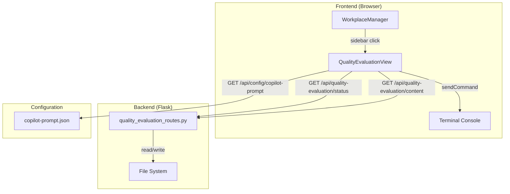
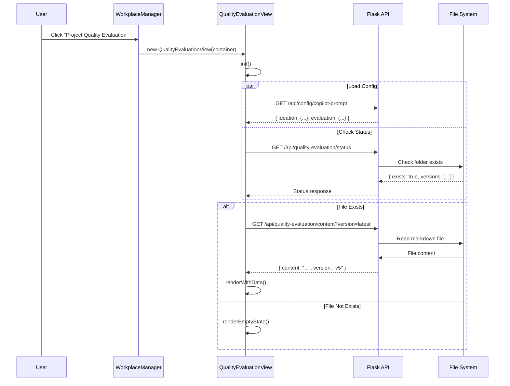
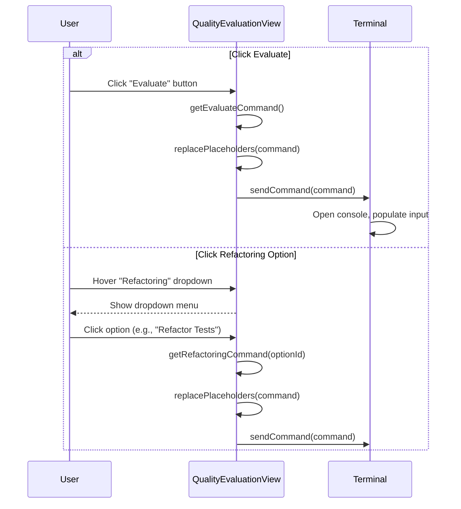

# Technical Design: Project Quality Evaluation UI

> Feature ID: FEATURE-024 | Version: v1.0 | Last Updated: 02-01-2026

## Version History

| Version | Date | Description |
|---------|------|-------------|
| v1.0 | 02-01-2026 | Initial design |

---

## Part 1: Agent-Facing Summary

> **Purpose:** Quick reference for AI agents navigating large projects.
> **📌 AI Coders:** Focus on this section for implementation context.

### Technical Scope

- [x] Frontend (JavaScript, HTML, CSS)
- [x] Backend (Python Flask routes)
- [ ] Database
- [ ] External Services

### Key Components Implemented

| Component | Responsibility | Scope/Impact | Tags |
|-----------|----------------|--------------|------|
| `QualityEvaluationView` | Main view controller for quality evaluation UI | New standalone module | #frontend #workplace #quality |
| `quality_evaluation_routes.py` | API endpoints for file operations | New route module | #backend #api #quality |
| `quality-evaluation.js` | Frontend JavaScript module | New file ~350 lines | #frontend #js #quality |
| `quality-evaluation.css` | Styles for quality evaluation view | New file ~200 lines | #frontend #css #quality |
| `copilot-prompt.json` update | Config restructure for prompts | Modify existing | #config #breaking-change |

### Dependencies

| Dependency | Source | Design Link | Usage Description |
|------------|--------|-------------|-------------------|
| `WorkplaceManager` | FEATURE-008 | [specification.md](../FEATURE-008/specification.md) | Integrates quality view into workplace sidebar |
| `Terminal.sendCommand()` | FEATURE-005 | N/A | Opens console with pre-populated Copilot prompt |
| `marked.js` | External | N/A | Markdown to HTML rendering for preview |
| `copilot-prompt.json` | Config | N/A | Dynamic prompt configuration source |

### Major Flow

1. User clicks "Project Quality Evaluation" in sidebar → `WorkplaceManager.showQualityEvaluation()` called
2. `QualityEvaluationView.init()` loads config from `/api/config/copilot-prompt` 
3. View checks for evaluation file via `/api/quality-evaluation/status`
4. If exists: Render action bar + version timeline + markdown preview
5. If not exists: Render empty state with CTA
6. Action clicks → Populate console with command from config → Open console

### Usage Example

```javascript
// In WorkplaceManager - Initialize quality evaluation view
if (this.currentView === 'qualityEvaluation') {
    const container = document.getElementById('workplace-content');
    this.qualityEvaluationView = new QualityEvaluationView(container);
    await this.qualityEvaluationView.init();
}

// In QualityEvaluationView - Execute action
handleEvaluateClick() {
    const command = this.config.evaluation.evaluate.command
        .replace('<evaluation-file>', this.currentFilePath);
    window.terminal.sendCommand(command);
}
```

---

## Part 2: Implementation Guide

> **Purpose:** Human-readable details for developers.
> **📌 Emphasis on visual diagrams for comprehension.

### Mockup Reference

**Linked Mockup:** [quality-evaluation.html](mockups/quality-evaluation.html)

**UI Components Derived from Mockup:**
- Action bar with Refactoring dropdown + Evaluate button (right-aligned)
- Version timeline as horizontal tabs (most recent on left)
- Markdown preview area with styled content
- Empty state with icon, text, and CTA button

### Architecture Overview



### Workflow Diagrams

#### Main View Load Flow



#### Action Execution Flow



### Data Models

#### Config Structure (copilot-prompt.json v2.0)

```json
{
  "version": "2.0",
  "ideation": {
    "prompts": [
      { "id": "...", "label": "...", "icon": "...", "command": "..." }
    ]
  },
  "evaluation": {
    "evaluate": {
      "label": "Evaluate Project Quality",
      "icon": "bi-clipboard-check",
      "command": "Evaluate project quality and generate report to <evaluation-file>"
    },
    "refactoring": [
      { "id": "refactor-all", "label": "Refactor All", "icon": "bi-arrow-repeat", "command": "..." },
      { "id": "refactor-requirements", "label": "Refactor Requirements", "icon": "bi-file-text", "command": "..." }
    ]
  },
  "placeholder": {
    "current-idea-file": "...",
    "evaluation-file": "x-ipe-docs/quality-evaluation/project-quality-evaluation.md"
  }
}
```

#### API Response: Status

```typescript
interface StatusResponse {
  exists: boolean;
  folder_path: string;  // "x-ipe-docs/quality-evaluation"
  versions: Version[];
}

interface Version {
  version: string;      // "v5"
  filename: string;     // "project-quality-evaluation-v5.md" or "project-quality-evaluation.md"
  date: string;         // "Feb 1, 2026"
  is_current: boolean;  // true for latest
}
```

#### API Response: Content

```typescript
interface ContentResponse {
  content: string;      // Raw markdown content
  version: string;      // "v5"
  filename: string;     // Filename being read
  path: string;         // Full relative path
}
```

### API Specification

#### Endpoints

| Method | Endpoint | Description |
|--------|----------|-------------|
| GET | `/api/quality-evaluation/status` | Get folder status and available versions |
| GET | `/api/quality-evaluation/content` | Get markdown content for specified version |

#### GET /api/quality-evaluation/status

**Response (folder exists):**
```json
{
  "exists": true,
  "folder_path": "x-ipe-docs/quality-evaluation",
  "versions": [
    { "version": "v5", "filename": "project-quality-evaluation.md", "date": "Feb 1, 2026", "is_current": true },
    { "version": "v4", "filename": "project-quality-evaluation-v4.md", "date": "Jan 31, 2026", "is_current": false }
  ]
}
```

**Response (folder doesn't exist):**
```json
{
  "exists": false,
  "folder_path": "x-ipe-docs/quality-evaluation",
  "versions": []
}
```

#### GET /api/quality-evaluation/content

**Query Parameters:**
- `version` (optional): Version to retrieve (e.g., "v5", "v4"). Default: latest

**Response:**
```json
{
  "content": "# Project Quality Evaluation\n...",
  "version": "v5",
  "filename": "project-quality-evaluation.md",
  "path": "x-ipe-docs/quality-evaluation/project-quality-evaluation.md"
}
```

### UI Component Structure

```
QualityEvaluationView
├── container (workplace-content)
│   ├── .quality-eval-view (main wrapper)
│   │   ├── .action-bar
│   │   │   ├── .action-bar-left (empty, spacer)
│   │   │   └── .action-bar-right
│   │   │       ├── .dropdown (Refactoring)
│   │   │       │   ├── .dropdown-trigger
│   │   │       │   └── .dropdown-menu
│   │   │       │       └── .dropdown-item (×N from config)
│   │   │       └── .btn-evaluate
│   │   ├── .version-timeline
│   │   │   └── .version-tab (×5 max)
│   │   └── .markdown-preview
│   │       └── .markdown-content (rendered HTML)
│   │
│   └── .empty-state (alternative when no file)
│       ├── .empty-icon
│       ├── .empty-title
│       ├── .empty-desc
│       └── .btn-empty-action
```

### CSS Variables (Quality Theme)

```css
:root {
  /* Quality evaluation accent colors */
  --quality-primary: #0d9488;
  --quality-primary-light: #14b8a6;
  --quality-primary-dark: #0f766e;
  --quality-bg: #f0fdfa;
  --quality-border: #99f6e4;
  
  /* Metric status colors */
  --status-good: #22c55e;
  --status-warn: #f59e0b;
  --status-bad: #ef4444;
}
```

### Implementation Steps

#### Step 1: Backend - Quality Evaluation Routes (~80 lines)

**File:** `src/x_ipe/routes/quality_evaluation_routes.py`

1. Create new route module with Blueprint
2. Implement `/api/quality-evaluation/status` endpoint
   - Check if `x-ipe-docs/quality-evaluation/` folder exists
   - Scan for versioned files
   - Parse version numbers and dates
   - Return sorted versions (newest first, max 5)
3. Implement `/api/quality-evaluation/content` endpoint
   - Accept `version` query parameter
   - Read appropriate markdown file
   - Return content and metadata
4. Register blueprint in `app.py`

#### Step 2: Config Migration - Update copilot-prompt.json

**File:** `x-ipe-docs/config/copilot-prompt.json`

1. Restructure from v1.0 to v2.0 format
2. Wrap existing prompts in `ideation.prompts[]`
3. Add `evaluation` section with default prompts
4. Add `evaluation-file` to placeholders
5. Update version to "2.0"

#### Step 3: Backend - Update Config API (~20 lines)

**File:** `src/x_ipe/routes/tools_routes.py` (or new config_routes.py)

1. Modify `/api/config/copilot-prompt` to return full v2.0 structure
2. Handle backward compatibility for v1.0 configs

#### Step 4: Frontend - Quality Evaluation CSS (~200 lines)

**File:** `src/x_ipe/static/css/quality-evaluation.css`

1. Create CSS file with quality theme variables
2. Style action bar, dropdown, buttons
3. Style version timeline tabs
4. Style markdown preview area
5. Style empty state

#### Step 5: Frontend - Quality Evaluation JavaScript (~350 lines)

**File:** `src/x_ipe/static/js/features/quality-evaluation.js`

1. Create `QualityEvaluationView` class
2. Implement `init()` - load config and status
3. Implement `render()` - build HTML structure
4. Implement `renderWithData()` - action bar + timeline + preview
5. Implement `renderEmptyState()` - empty state UI
6. Implement `loadVersionContent(version)` - fetch and display version
7. Implement `buildDropdownMenu()` - dynamic from config
8. Implement `handleAction(command)` - placeholder replacement + console
9. Implement event bindings for all interactions

#### Step 6: Frontend - WorkplaceManager Integration (~50 lines)

**File:** `src/x_ipe/static/js/features/workplace.js`

1. Add sidebar icon for Quality Evaluation (after Tracing)
2. Add `qualityEvaluationView` property
3. Update `render()` to include new sidebar icon
4. Add click handler for quality evaluation icon
5. Implement `showQualityEvaluation()` method
6. Update view state management

#### Step 7: Template Update (~5 lines)

**File:** `src/x_ipe/templates/base.html`

1. Add `<link>` for quality-evaluation.css
2. Add `<script>` for quality-evaluation.js

### Edge Cases & Error Handling

| Scenario | Expected Behavior | Implementation |
|----------|-------------------|----------------|
| Config file missing | Show action bar with hardcoded defaults | Fallback config in JS |
| Config file malformed | Log error, use defaults | try/catch with fallback |
| Folder doesn't exist | Show empty state | API returns `exists: false` |
| Markdown file corrupted | Display partial content with error | try/catch in markdown render |
| Network error on load | Show error message with retry button | Error state in UI |
| Console not available | Log warning, show tooltip | Check `window.terminal` exists |

### File Summary

| File | Type | Lines (est.) | Action |
|------|------|--------------|--------|
| `quality_evaluation_routes.py` | Python | ~80 | Create |
| `quality-evaluation.js` | JavaScript | ~350 | Create |
| `quality-evaluation.css` | CSS | ~200 | Create |
| `workplace.js` | JavaScript | ~50 | Modify |
| `copilot-prompt.json` | JSON | N/A | Modify |
| `base.html` | HTML | ~5 | Modify |

**Total new code:** ~630 lines
**Total modifications:** ~55 lines

---

## Design Change Log

| Date | Phase | Change Summary |
|------|-------|----------------|
| 02-01-2026 | Technical Design | Initial design created. Standalone module approach to avoid adding to 2700+ line workplace.js. Two new API endpoints, new JS/CSS modules, config migration to v2.0 format. |
