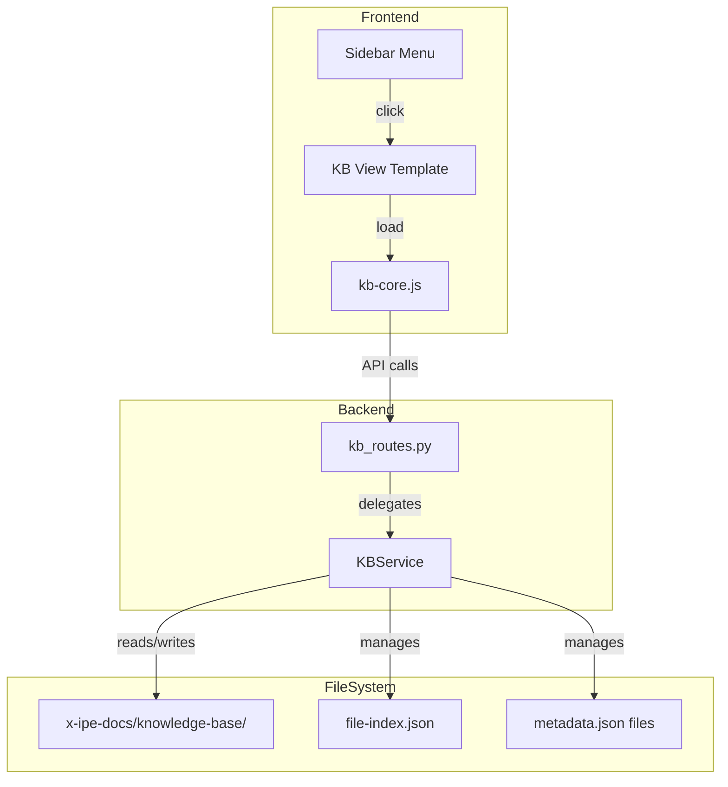
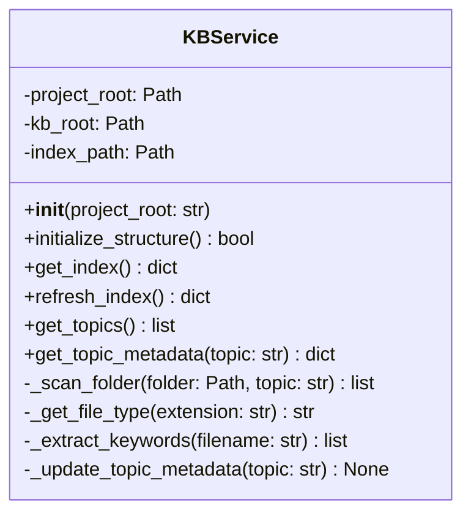
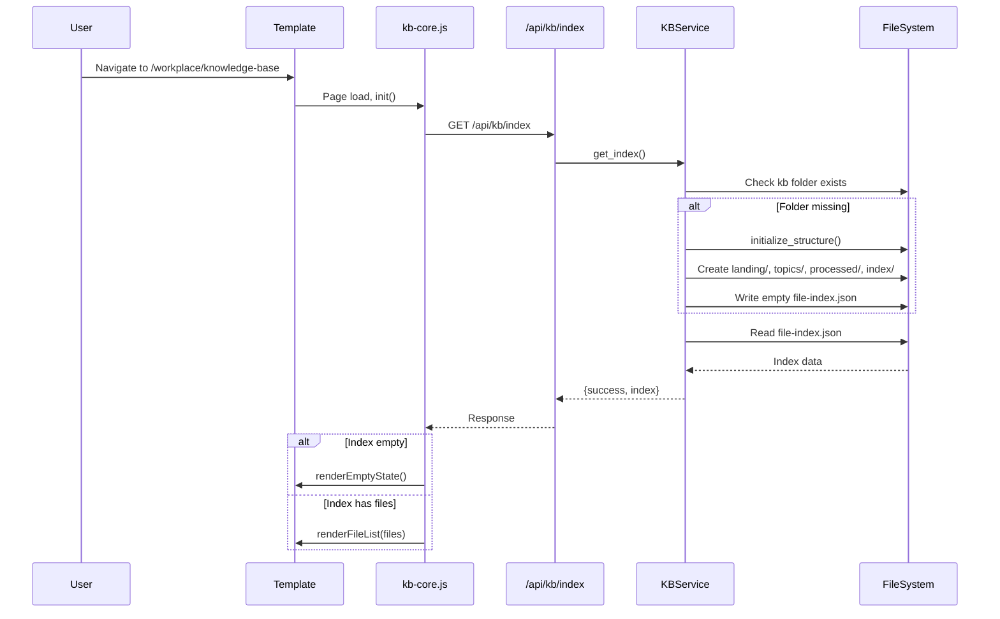
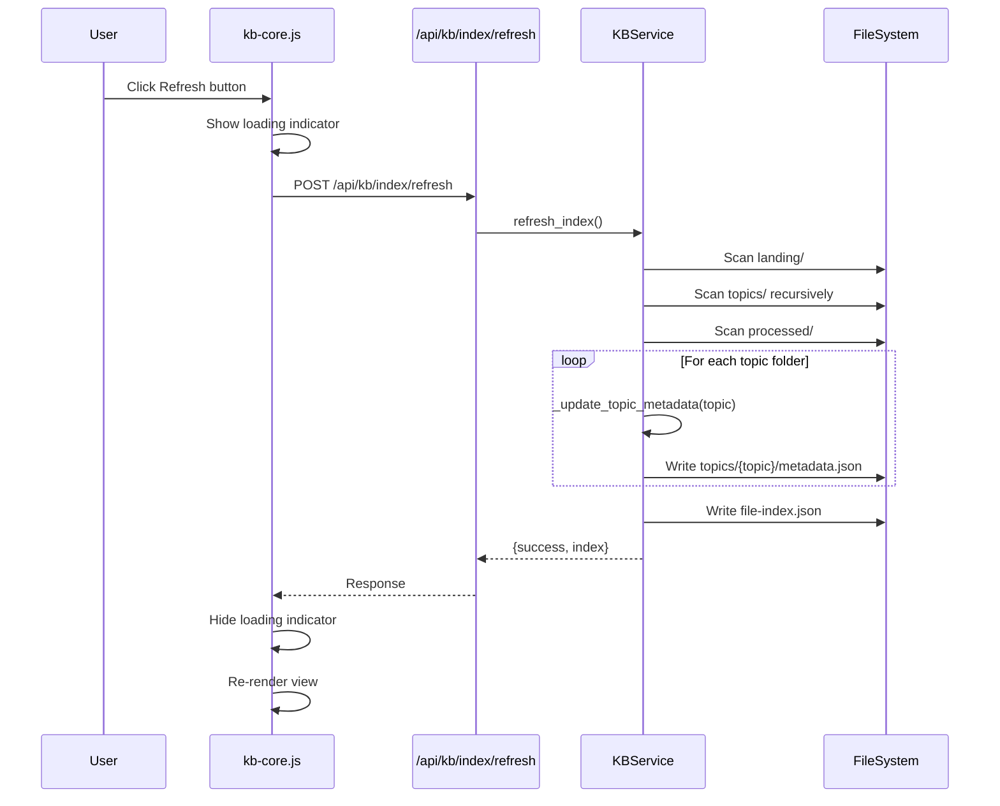

# Technical Design: KB Core Infrastructure

> Feature ID: FEATURE-025-A  
> Version: v1.0  
> Status: Designed  
> Last Updated: 02-05-2026

## Version History

| Version | Date | Author | Changes |
|---------|------|--------|---------|
| v1.0 | 02-05-2026 | Flux | Initial technical design |

---

# Part 1: Agent-Facing Summary

## Overview

FEATURE-025-A establishes the foundational infrastructure for the Knowledge Base system: folder structure, file index, metadata management, and sidebar integration. This is a **backend + frontend** feature.

## Technical Scope

- [x] Backend (Flask routes + service)
- [x] Frontend (sidebar integration, KB view)
- [ ] CLI
- [ ] Skill

## Key Components

| Component | Type | Location | Description | Tags |
|-----------|------|----------|-------------|------|
| `KBService` | Service | `src/x_ipe/services/kb_service.py` | Core KB operations: init, index, metadata | `kb, service, index, metadata` |
| `kb_routes` | Blueprint | `src/x_ipe/routes/kb_routes.py` | REST API endpoints for KB operations | `kb, api, routes, flask` |
| `knowledge-base.html` | Template | `src/x_ipe/templates/knowledge-base.html` | KB view page template | `kb, template, frontend` |
| `kb-core.js` | Module | `src/x_ipe/static/js/features/kb-core.js` | KB view initialization and sidebar integration | `kb, javascript, sidebar` |
| Sidebar entry | Config | `src/x_ipe/templates/includes/sidebar.html` | Menu item under Workplace | `sidebar, menu, navigation` |

## Dependencies

| Dependency | Type | Link | Notes |
|------------|------|------|-------|
| FEATURE-008 | Feature | [specification.md](../FEATURE-008/specification.md) | Workplace provides sidebar structure, template patterns |
| Flask | Library | - | Web framework, already installed |
| Bootstrap Icons | Library | - | Icon font, already included |

## Key Flow

```
User clicks "Knowledge Base" in sidebar
    → GET /workplace/knowledge-base (renders template)
    → JS initializes: GET /api/kb/index
        → KBService.get_index()
            → If folder missing: initialize_structure()
            → Return file-index.json contents
    → JS renders KB view (empty state or file list)
```

## Data Model

```python
# FileIndexEntry
{
    "path": "landing/document.pdf",      # Relative to knowledge-base/
    "name": "document.pdf",              # Filename
    "type": "pdf",                       # File type from extension
    "size": 1024567,                     # Bytes
    "topic": null,                       # Topic name or null if in landing
    "created_date": "2026-02-05T14:30:00Z",  # ISO 8601
    "keywords": ["document"]             # Extracted from filename
}

# FileIndex (file-index.json)
{
    "version": "1.0",
    "last_updated": "2026-02-05T15:00:00Z",
    "files": [FileIndexEntry, ...]
}

# TopicMetadata (topics/{name}/metadata.json)
{
    "name": "ai-research",
    "description": "",
    "file_count": 5,
    "last_updated": "2026-02-05T15:00:00Z",
    "tags": []
}
```

## Usage Example

```python
# Backend usage
from x_ipe.services import KBService

service = KBService(project_root)
service.initialize_structure()  # Creates folders if missing
index = service.get_index()     # Returns FileIndex dict
service.refresh_index()         # Rebuilds from file system

# Frontend: API calls
fetch('/api/kb/index')          # Get current index
fetch('/api/kb/index/refresh', {method: 'POST'})  # Rebuild index
```

---

# Part 2: Implementation Guide

## Architecture Overview



## Component Design

### 1. KBService (Backend Service)

**Location:** `src/x_ipe/services/kb_service.py`

**Rationale:** New standalone module because `ideas_service.py` is already 1045 lines (exceeds 800-line threshold).



**Key Methods:**

| Method | Input | Output | Description |
|--------|-------|--------|-------------|
| `initialize_structure()` | None | `bool` | Creates KB folder structure if missing |
| `get_index()` | None | `dict` | Returns current file-index.json contents |
| `refresh_index()` | None | `dict` | Rebuilds index from file system |
| `get_topics()` | None | `list` | Returns list of topic names |
| `get_topic_metadata(topic)` | `str` | `dict` | Returns topic's metadata.json contents |

### 2. KB Routes (API Blueprint)

**Location:** `src/x_ipe/routes/kb_routes.py`

| Endpoint | Method | Description | Response |
|----------|--------|-------------|----------|
| `/api/kb/index` | GET | Get current file index | `{success, index}` |
| `/api/kb/index/refresh` | POST | Rebuild index from FS | `{success, index}` |
| `/api/kb/topics` | GET | List all topics | `{success, topics}` |
| `/api/kb/topics/<name>` | GET | Get topic metadata | `{success, metadata}` |

### 3. KB View Template

**Location:** `src/x_ipe/templates/knowledge-base.html`

Based on `workplace.html` pattern:
- Extends `base.html`
- Same layout: top bar, sidebar, content area, terminal panel
- Top bar includes: title "Knowledge Base", Refresh button
- Content area: placeholder for KB view (file grid in future)

### 4. Frontend JavaScript

**Location:** `src/x_ipe/static/js/features/kb-core.js`

**Responsibilities:**
- Initialize KB view on page load
- Call `/api/kb/index` to get file index
- Render empty state or file list (basic for this feature)
- Handle Refresh button click

```javascript
// kb-core.js structure
class KBCore {
    constructor() { ... }
    async init() { ... }
    async loadIndex() { ... }
    async refreshIndex() { ... }
    renderEmptyState() { ... }
    renderFileList(files) { ... }
}
```

### 5. Sidebar Integration

**Location:** `src/x_ipe/templates/includes/sidebar.html`

Add "Knowledge Base" submenu item under Workplace section:

```html
<!-- Under Workplace section -->
<li class="sidebar-item">
    <a href="/workplace/knowledge-base" class="sidebar-link {{ 'active' if active_page == 'knowledge-base' }}">
        <i class="bi bi-archive"></i>
        <span>Knowledge Base</span>
    </a>
</li>
```

## Workflow Diagrams

### Initialization Flow



### Refresh Index Flow



## File Type Mapping

```python
FILE_TYPE_MAP = {
    # Documents
    '.pdf': 'pdf',
    '.md': 'markdown',
    '.markdown': 'markdown',
    '.txt': 'text',
    '.docx': 'docx',
    '.xlsx': 'xlsx',
    
    # Code
    '.py': 'python',
    '.js': 'javascript',
    '.ts': 'typescript',
    '.java': 'java',
    '.go': 'go',
    '.rs': 'rust',
    '.c': 'c',
    '.cpp': 'cpp',
    '.h': 'header',
    '.html': 'html',
    '.css': 'css',
    '.json': 'json',
    '.yaml': 'yaml',
    '.yml': 'yaml',
    
    # Images
    '.png': 'image',
    '.jpg': 'image',
    '.jpeg': 'image',
    '.gif': 'image',
    '.svg': 'image',
    '.webp': 'image',
}

def get_file_type(extension: str) -> str:
    return FILE_TYPE_MAP.get(extension.lower(), 'unknown')
```

## Implementation Steps

### Step 1: Create KBService

1. Create `src/x_ipe/services/kb_service.py`
2. Implement `KBService` class with all methods
3. Add to `src/x_ipe/services/__init__.py` exports

### Step 2: Create KB Routes

1. Create `src/x_ipe/routes/kb_routes.py`
2. Implement API endpoints
3. Register blueprint in `src/x_ipe/app.py`

### Step 3: Create KB Template

1. Copy `workplace.html` as base
2. Modify to `knowledge-base.html`
3. Update title, breadcrumb, top bar buttons

### Step 4: Create Frontend JS

1. Create `src/x_ipe/static/js/features/kb-core.js`
2. Implement `KBCore` class
3. Add initialization in template

### Step 5: Add Sidebar Entry

1. Edit `src/x_ipe/templates/includes/sidebar.html`
2. Add Knowledge Base menu item under Workplace section

### Step 6: Add Route Handler

1. Add route to `src/x_ipe/routes/main_routes.py`:
   ```python
   @main_bp.route('/workplace/knowledge-base')
   def knowledge_base():
       return render_template('knowledge-base.html', active_page='knowledge-base')
   ```

## Error Handling

| Scenario | Handling |
|----------|----------|
| KB folder creation fails | Log error, return `{success: false, error: "..."}` |
| Permission denied | Return 403 with error message |
| Invalid JSON in index | Log warning, recreate empty index |
| Topic folder without metadata | Auto-generate metadata on refresh |

## Testing Strategy

| Test Type | Coverage |
|-----------|----------|
| Unit Tests | KBService methods (init, index, refresh) |
| API Tests | All endpoints (success, error cases) |
| Integration | End-to-end: navigate → load → refresh |

## Non-Functional Considerations

- **Performance:** Index refresh scans file system; for 1000 files, target < 5s
- **Concurrency:** Simple last-write-wins for MVP (no file locking)
- **Error Recovery:** Auto-recreate corrupted index on next access

---

## Design Change Log

| Date | Change | Rationale |
|------|--------|-----------|
| 02-05-2026 | Initial design | Feature creation |
