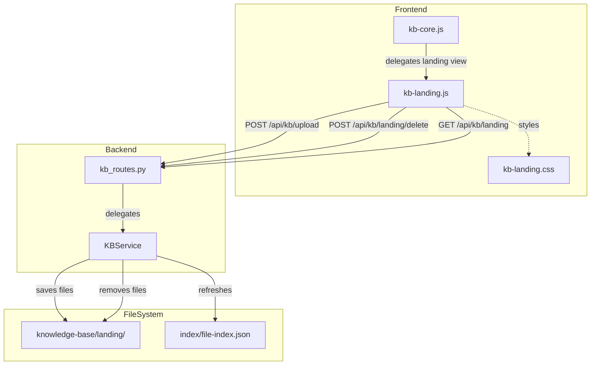
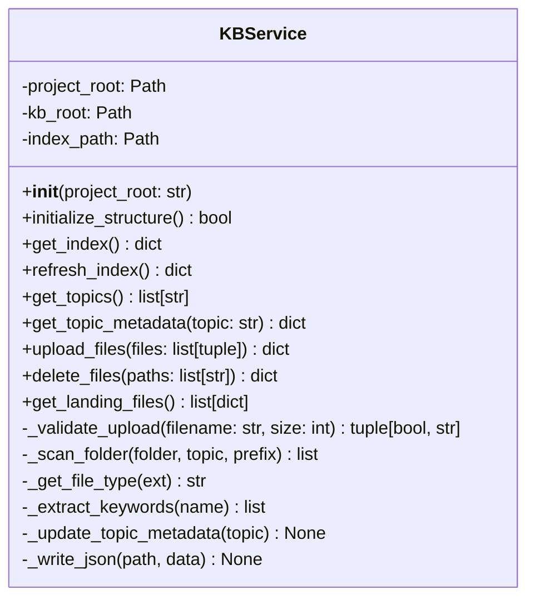
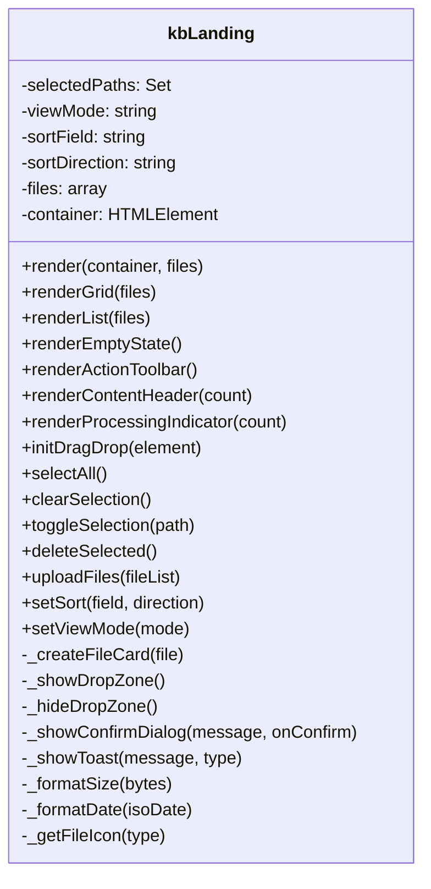
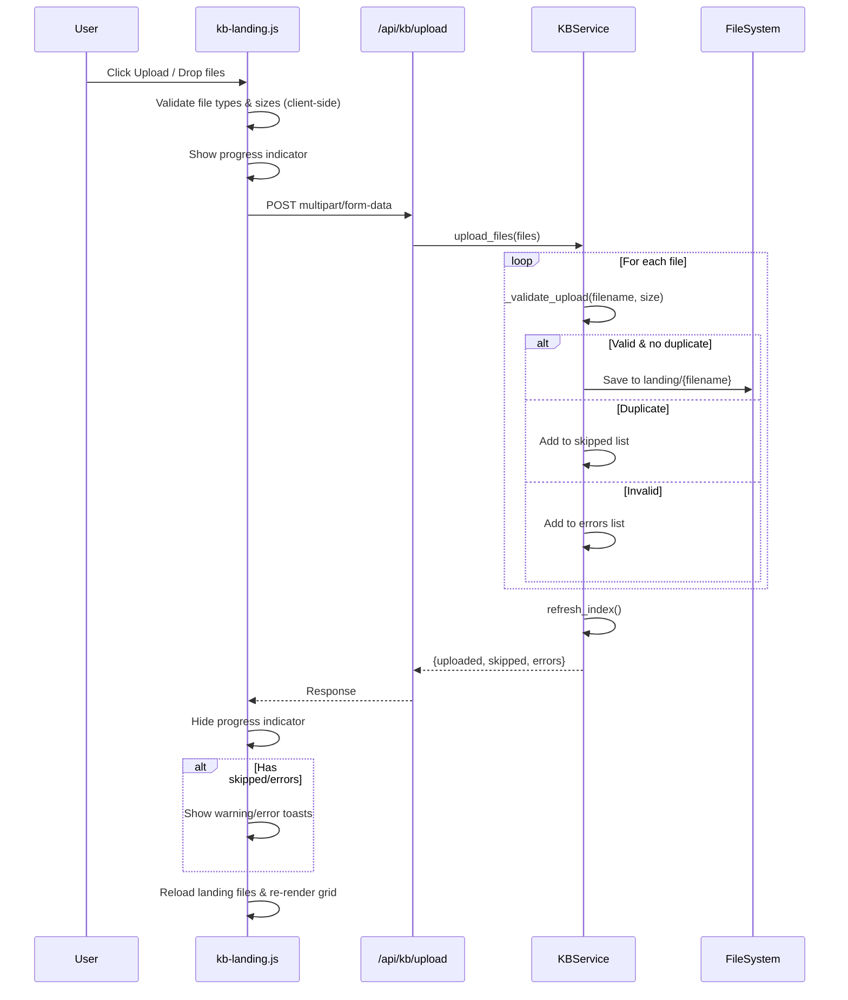
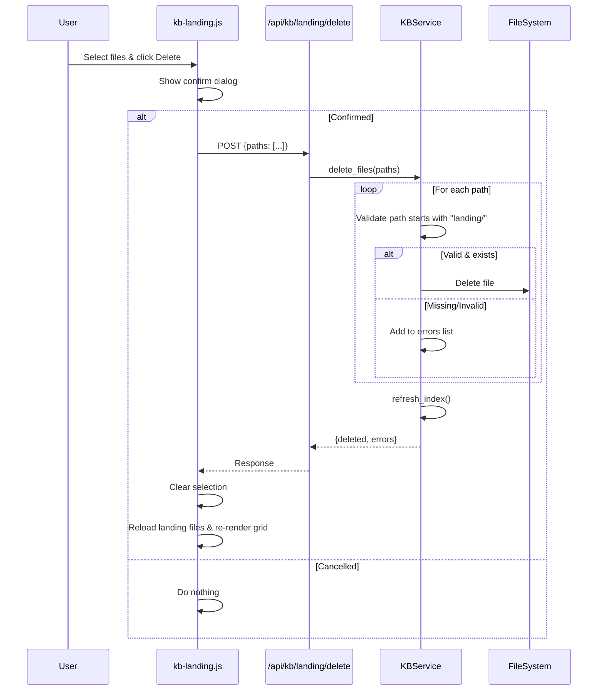
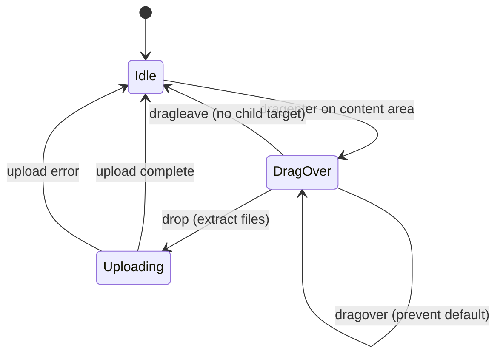

# Technical Design: KB Landing Zone

> Feature ID: FEATURE-025-B | Version: v1.0 | Last Updated: 02-11-2026

## Version History

| Version | Date | Author | Changes |
|---------|------|--------|---------|
| v1.0 | 02-11-2026 | Pulse | Initial technical design |

---

# Part 1: Agent-Facing Summary

## Overview

FEATURE-025-B adds file upload, drag-and-drop, a file grid with selection, and delete actions to the Knowledge Base landing zone. This is a **Full Stack** feature extending the existing KB Core Infrastructure (FEATURE-025-A).

## Technical Scope

- [x] Backend (Flask routes + KBService extensions)
- [x] Frontend (file grid, drag-drop, selection, actions)
- [ ] CLI
- [ ] Skill

## Key Components Implemented

| Component | Type | Location | Description | Tags |
|-----------|------|----------|-------------|------|
| `KBService` (extended) | Service | `src/x_ipe/services/kb_service.py` | Add `upload_files()`, `delete_files()`, `get_landing_files()` methods | `kb, service, upload, delete, landing` |
| `kb_routes` (extended) | Blueprint | `src/x_ipe/routes/kb_routes.py` | Add upload, delete, landing-list endpoints | `kb, api, routes, upload, delete` |
| `kb-landing.js` | Module | `src/x_ipe/static/js/features/kb-landing.js` | File grid, drag-drop, selection, actions UI | `kb, javascript, landing, grid, upload, dragdrop` |
| `kb-landing.css` | Stylesheet | `src/x_ipe/static/css/kb-landing.css` | Landing zone styles: file cards, drop zone, toolbar, processing indicator | `kb, css, landing, grid, cards` |

## Dependencies

| Dependency | Source | Design Link | Usage Description |
|------------|--------|-------------|-------------------|
| `KBService` | FEATURE-025-A | [technical-design.md](../FEATURE-025-A/technical-design.md) | Extends existing service with upload/delete methods. Uses `refresh_index()`, `get_index()`, `FILE_TYPE_MAP` |
| `kb_routes` | FEATURE-025-A | [technical-design.md](../FEATURE-025-A/technical-design.md) | Extends existing blueprint with new endpoints |
| `kb-core.js` | FEATURE-025-A | [technical-design.md](../FEATURE-025-A/technical-design.md) | Landing module integrates with core's `render()` method and replaces welcome view |
| `ideas_routes.py` | FEATURE-008 | — | Upload pattern reference (multipart form-data with `request.files.getlist`) |
| Flask | Library | — | `request.files`, `secure_filename` from werkzeug |
| Bootstrap Icons | Library | — | File type icons, action button icons |

## Major Flow

```
1. Upload: User clicks Upload / drags files → POST /api/kb/upload (multipart)
     → KBService.upload_files() validates, saves to landing/, refreshes index
     → Frontend re-renders file grid

2. Grid: On KB view load → GET /api/kb/landing → KBService.get_landing_files()
     → kb-landing.js renders file cards with checkboxes, action toolbar

3. Delete: User selects cards → clicks Delete → confirm dialog
     → POST /api/kb/landing/delete → KBService.delete_files()
     → Frontend re-renders file grid
```

## Usage Example

```python
# Backend: Upload files
from x_ipe.services.kb_service import KBService

service = KBService(project_root)
result = service.upload_files([
    ("document.pdf", b"<binary data>", 1024567)
])
# → {"uploaded": ["landing/document.pdf"], "skipped": [], "errors": []}

# Backend: Delete files
result = service.delete_files(["landing/document.pdf", "landing/notes.md"])
# → {"deleted": ["landing/document.pdf", "landing/notes.md"], "errors": []}

# Frontend: Render landing view
kbLanding.render(containerElement, indexData);
kbLanding.setSelectionCallback((selectedPaths) => { ... });
```

```javascript
// Frontend: Upload via drag-drop
kbLanding.initDragDrop(containerElement);
// User drops files → POST /api/kb/upload → grid re-renders

// Frontend: File grid with selection
kbLanding.renderGrid(landingFiles);
kbLanding.selectAll();
kbLanding.clearSelection();
kbLanding.deleteSelected();
```

---

# Part 2: Implementation Guide

## Architecture Overview



## Component Design

### 1. KBService Extensions (Backend)

**Location:** `src/x_ipe/services/kb_service.py` (extend existing — currently 378 lines, will be ~550 after additions, under 800-line threshold)



**New Methods:**

| Method | Input | Output | Description |
|--------|-------|--------|-------------|
| `upload_files(files)` | `list[tuple(filename, data, size)]` | `dict` | Validate, save to landing/, refresh index. Returns uploaded/skipped/errors |
| `delete_files(paths)` | `list[str]` | `dict` | Delete files from landing/, refresh index. Returns deleted/errors |
| `get_landing_files()` | None | `list[dict]` | Filter index for landing/ files only |
| `_validate_upload(filename, size)` | `str, int` | `tuple[bool, str]` | Check extension allowlist and 50MB size limit |

**Allowed Extensions Constant:**

```python
ALLOWED_EXTENSIONS = {
    # Documents
    '.pdf', '.md', '.markdown', '.txt', '.docx', '.xlsx',
    # Code
    '.py', '.js', '.ts', '.java', '.go', '.rs', '.c', '.cpp', '.h',
    '.html', '.css', '.json', '.yaml', '.yml',
    # Images
    '.png', '.jpg', '.jpeg', '.gif', '.svg', '.webp',
}

MAX_FILE_SIZE = 50 * 1024 * 1024  # 50MB
```

### 2. KB Routes Extensions (Backend API)

**Location:** `src/x_ipe/routes/kb_routes.py` (extend existing — currently 80 lines, will be ~160 after additions, well under 800)

| Endpoint | Method | Content-Type | Description | Response |
|----------|--------|-------------|-------------|----------|
| `/api/kb/upload` | POST | `multipart/form-data` | Upload file(s) to landing | `{uploaded, skipped, errors}` |
| `/api/kb/landing/delete` | POST | `application/json` | Delete file(s) from landing | `{deleted, errors}` |
| `/api/kb/landing` | GET | — | Get landing files only | `{files: [...]}` |

#### API Specification

**POST /api/kb/upload**

Request: `multipart/form-data`
- `files`: One or more files (required)
- `subfolder`: Optional subfolder name under landing/ (for folder uploads)

Response (200):
```json
{
  "uploaded": ["landing/document.pdf", "landing/notes.md"],
  "skipped": [{"file": "existing.pdf", "reason": "duplicate"}],
  "errors": [{"file": "huge.zip", "reason": "File exceeds 50MB limit"}]
}
```

Response (400):
```json
{
  "error": "No files provided"
}
```

**POST /api/kb/landing/delete**

Request: `application/json`
```json
{
  "paths": ["landing/document.pdf", "landing/notes.md"]
}
```

Response (200):
```json
{
  "deleted": ["landing/document.pdf", "landing/notes.md"],
  "errors": []
}
```

**GET /api/kb/landing**

Response (200):
```json
{
  "files": [
    {
      "path": "landing/document.pdf",
      "name": "document.pdf",
      "type": "pdf",
      "size": 1024567,
      "topic": null,
      "created_date": "2026-02-05T14:30:00Z",
      "keywords": ["document"]
    }
  ]
}
```

### 3. Frontend: kb-landing.js

**Location:** `src/x_ipe/static/js/features/kb-landing.js` (new standalone module)

**Rationale:** kb-core.js is 371 lines. Adding file grid, drag-drop, selection, and actions would exceed 800 lines combined. Separate module follows the 800-line threshold rule.

**Integration:** `kb-core.js` calls `kbLanding.render(container, files)` when displaying landing view. `kb-core.js` provides the container element and index data; `kb-landing.js` handles all landing-specific UI.



**State Management:**

```javascript
const kbLanding = {
    selectedPaths: new Set(),  // Currently selected file paths
    viewMode: 'grid',          // 'grid' or 'list'
    sortField: 'name',         // 'name', 'date', 'size', 'type'
    sortDirection: 'asc',      // 'asc' or 'desc'
    files: [],                 // Current landing file data
    container: null,           // DOM container element
};
```

### 4. Frontend: kb-landing.css

**Location:** `src/x_ipe/static/css/kb-landing.css` (new standalone file)

**Mockup-Derived Styles (from knowledge-base-v1.html):**

| CSS Class | Purpose | Mockup Reference |
|-----------|---------|-----------------|
| `.kb-file-grid` | CSS Grid container: `repeat(auto-fill, minmax(180px, 1fr))` | `.file-grid` in mockup |
| `.kb-file-card` | Card with elevated bg, subtle border, rounded corners | `.file-card` in mockup |
| `.kb-file-card:hover` | Scale up, border glow, cursor pointer | `.file-card:hover` in mockup |
| `.kb-file-card.selected` | Accent border, accent bg tint, visible checkbox | `.file-card.selected` in mockup |
| `.kb-file-card-checkbox` | Top-left corner, hidden by default, shown on hover/selected | `.file-card-checkbox` in mockup |
| `.kb-file-card-icon` | Centered icon with type-based color | `.file-card-icon` in mockup |
| `.kb-file-card-name` | Truncated filename | `.file-card-name` in mockup |
| `.kb-file-card-meta` | Size + date in muted text | `.file-card-meta` in mockup |
| `.kb-action-toolbar` | Horizontal bar with button groups and dividers | `.action-toolbar` in mockup |
| `.kb-content-header` | Title + status badge + action buttons | `.content-header` in mockup |
| `.kb-drop-zone` | Dashed border overlay, centered upload icon | `.upload-zone` in mockup |
| `.kb-drop-zone.drag-over` | Accent border, tinted background | `.upload-zone.drag-over` in mockup |
| `.kb-processing-indicator` | Spinner + text + cancel bar | `.processing-indicator` in mockup |
| `.kb-empty-state-landing` | Centered icon + title + subtitle for empty landing | `.empty-state` in mockup |

## Workflow Diagrams

### Upload Flow



### Delete Flow



### Drag-and-Drop Flow



## Mockup-to-Component Mapping

| Mockup Element | Component | CSS Class |
|----------------|-----------|-----------|
| Content header with title + badge + actions | `renderContentHeader()` | `.kb-content-header` |
| Action toolbar (Select All, Clear, Grid/List, Sort) | `renderActionToolbar()` | `.kb-action-toolbar` |
| Processing indicator bar | `renderProcessingIndicator()` | `.kb-processing-indicator` |
| File card grid | `renderGrid()` | `.kb-file-grid`, `.kb-file-card` |
| File card (icon, name, meta, checkbox) | `_createFileCard()` | `.kb-file-card-*` |
| Empty state with drop zone | `renderEmptyState()` | `.kb-empty-state-landing`, `.kb-drop-zone` |
| Upload button in top bar | Modified in `kb-core.js` render | existing top bar styles |

## Implementation Steps

### Step 1: Backend — Extend KBService

1. Add `ALLOWED_EXTENSIONS` and `MAX_FILE_SIZE` constants
2. Add `_validate_upload(filename, size)` private method
3. Add `upload_files(files)` method:
   - For each file: validate, check duplicate, save to landing/
   - Call `self.refresh_index()` at end
   - Return `{uploaded, skipped, errors}`
4. Add `delete_files(paths)` method:
   - Validate each path starts with `landing/`
   - Delete files, call `self.refresh_index()`
   - Return `{deleted, errors}`
5. Add `get_landing_files()` method:
   - Call `get_index()`, filter for paths starting with `landing/`

### Step 2: Backend — Extend kb_routes

1. Add `POST /api/kb/upload` endpoint:
   - Extract files from `request.files.getlist('files')`
   - Extract optional `subfolder` from form data
   - Call `service.upload_files()` passing `(filename, data, size)` tuples
2. Add `POST /api/kb/landing/delete` endpoint:
   - Parse JSON body with `paths` array
   - Call `service.delete_files(paths)`
3. Add `GET /api/kb/landing` endpoint:
   - Call `service.get_landing_files()`

### Step 3: Frontend — Create kb-landing.js

1. Create module with state: `selectedPaths`, `viewMode`, `sortField`, `files`
2. Implement `render(container, files)`:
   - Render content header, action toolbar, file grid
   - Bind event handlers for selection, sort, view toggle
3. Implement `renderGrid(files)` and `renderList(files)`
4. Implement `_createFileCard(file)` with checkbox, icon, name, meta
5. Implement `renderEmptyState()` with drop zone
6. Implement `initDragDrop(element)`:
   - Listen for `dragenter`, `dragover`, `dragleave`, `drop`
   - Show/hide drop zone overlay
   - On drop: extract files, call `uploadFiles()`
7. Implement `uploadFiles(fileList)`:
   - Build FormData, POST to `/api/kb/upload`
   - Show progress, handle response
8. Implement selection: `selectAll()`, `clearSelection()`, `toggleSelection(path)`
9. Implement `deleteSelected()`:
   - Show confirm dialog, POST to `/api/kb/landing/delete`

### Step 4: Frontend — Create kb-landing.css

1. Create styles derived from mockup (see CSS class table above)
2. Follow existing kb-core.css color variables and naming
3. Include hover, selected, drag-over states

### Step 5: Integration — Update kb-core.js

1. Import/reference `kbLanding` module
2. Modify `renderWelcome()` to call `kbLanding.render()` instead of inline HTML
3. Add Upload button to the sidebar header (next to Refresh)
4. Ensure tree view updates after upload/delete via callback

### Step 6: Template Update

1. Add `<script src="/static/js/features/kb-landing.js">` to knowledge-base.html
2. Add `<link href="/static/css/kb-landing.css">` to knowledge-base.html

## Edge Cases & Error Handling

| Scenario | Backend Handling | Frontend Handling |
|----------|-----------------|-------------------|
| File > 50MB | Return in `errors` list with reason | Show error toast, skip file |
| Unsupported extension | Return in `errors` list with reason | Show error toast, skip file |
| Duplicate filename | Return in `skipped` list with reason | Show warning toast |
| Empty file list | Return 400 "No files provided" | Disable Upload button / do nothing |
| Delete outside landing/ | Reject path, return error | Should not happen (UI only shows landing paths) |
| File already deleted from disk | Skip silently, return in errors | Show info toast |
| Network error during upload | N/A | Show error toast, retry option |
| Permission denied on write | Log error, return 500 | Show error toast |
| Very long filename | Preserve on disk | Truncate with `text-overflow: ellipsis`, full name in tooltip |
| Concurrent uploads | Last-write-wins (MVP) | Queue uploads sequentially |

## Testing Strategy

| Test Type | Coverage | Test Count Estimate |
|-----------|----------|---------------------|
| Unit: `upload_files()` | Valid upload, duplicate, invalid extension, oversize, subfolder | 8-10 |
| Unit: `delete_files()` | Valid delete, missing file, path outside landing, batch delete | 5-6 |
| Unit: `get_landing_files()` | Empty, with files, filters correctly | 3 |
| Unit: `_validate_upload()` | Each extension, size boundary, no extension | 5-6 |
| API: Upload endpoint | Multipart upload, no files, duplicate, invalid | 5-6 |
| API: Delete endpoint | Valid delete, empty paths, invalid paths | 3-4 |
| API: Landing endpoint | Empty, with files | 2 |
| Integration: Upload → index refresh | Upload file → verify in index | 2 |
| Tracing | @x_ipe_tracing on new methods | 2-3 |

**Total estimated: ~40 tests**

## Non-Functional Considerations

- **File Size:** Flask's `MAX_CONTENT_LENGTH` should be set to 50MB in app config
- **Performance:** File grid rendering for 100+ cards uses virtual scrolling only if needed (MVP: simple DOM rendering)
- **Concurrency:** Simple last-write-wins for index refresh (same as 025-A)
- **Security:** `secure_filename()` from werkzeug for sanitizing uploaded filenames; path validation prevents directory traversal

---

## Design Change Log

| Date | Phase | Change Summary |
|------|-------|----------------|
| 02-11-2026 | Initial Design | Initial technical design created. Extends FEATURE-025-A with upload, delete, grid, drag-drop. |
