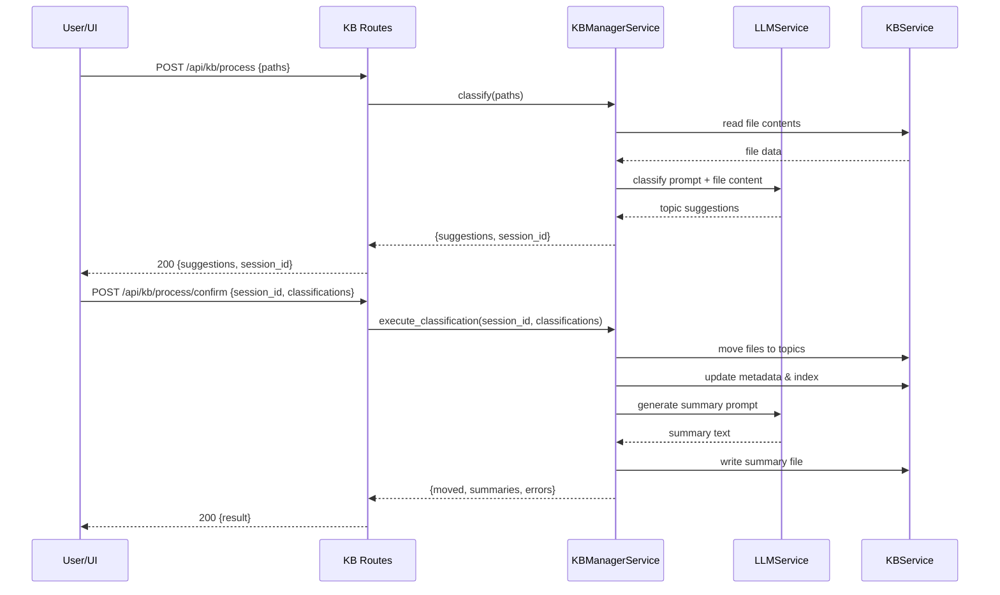
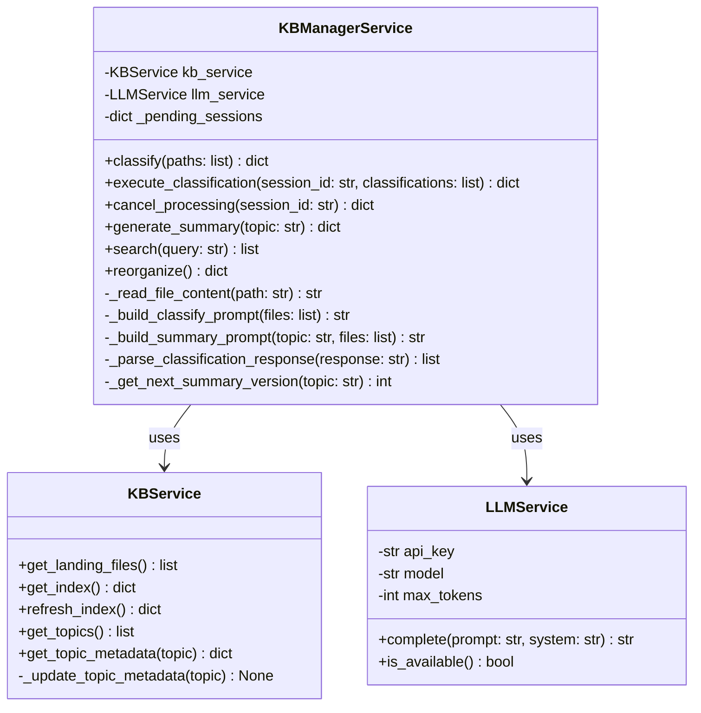

# Technical Design: KB Manager Skill

> Feature ID: FEATURE-025-C | Version: v1.0 | Last Updated: 02-12-2026

---

## Version History

| Version | Date | Description |
|---------|------|-------------|
| v1.0 | 02-12-2026 | Initial technical design |

---

## Part 1: Agent-Facing Summary

> **Purpose:** Quick reference for AI agents navigating large projects.
> **📌 AI Coders:** Focus on this section for implementation context.

### Key Components Implemented

| Component | Responsibility | Scope/Impact | Tags |
|-----------|----------------|--------------|------|
| `KBManagerService` | Orchestrates classification, summary generation, search, reorganization | New service (`services/kb_manager_service.py`) | #kb #ai #classification #summary #processing |
| `LLMService` | Wrapper around DashScope Generation API for text/chat completion | New service (`services/llm_service.py`) | #ai #llm #dashscope #qwen |
| `kb_routes.py` (extended) | New API endpoints: process, process/confirm, process/cancel, search, reorganize | Extends existing KB routes | #api #routes #kb |
| `kb-landing.js` (extended) | Process button, confirmation UI, cancel integration | Extends existing frontend | #frontend #kb #ui |
| `.github/skills/x-ipe-kb-manager/SKILL.md` | Copilot skill definition with trigger phrases | New skill folder | #skill #copilot #kb |

### Dependencies

| Dependency | Source | Design Link | Usage Description |
|------------|--------|-------------|-------------------|
| `KBService` | FEATURE-025-A | [technical-design.md](../FEATURE-025-A/technical-design.md) | Folder structure, index management, file operations, metadata |
| `KBService.get_landing_files()` | FEATURE-025-B | [technical-design.md](../FEATURE-025-B/technical-design.md) | List landing files for processing selection |
| `dashscope.Generation` | External (pyproject.toml) | [DashScope docs](https://help.aliyun.com/zh/dashscope/) | LLM API for classification and summarization |
| `ConfigService` | FEATURE-010 | config_service.py | Config discovery pattern (reused for LLM config) |
| Processing indicator | FEATURE-025-B | kb-landing.js | `_showProcessing()` / `_hideProcessing()` methods |

### Major Flow

1. User selects files in KB landing → clicks "Process" → `POST /api/kb/process` → `KBManagerService.classify()` → `LLMService.complete()` → returns suggestions
2. User reviews suggestions → confirms → `POST /api/kb/process/confirm` → `KBManagerService.execute_classification()` → files moved, metadata updated, summaries generated
3. User can cancel → `POST /api/kb/process/cancel` → clears pending state
4. Search: `GET /api/kb/search?q=query` → `KBManagerService.search()` → returns matching index entries

### Usage Example

```python
# Backend: Classification flow
from x_ipe.services.kb_manager_service import KBManagerService
from x_ipe.services.kb_service import KBService
from x_ipe.services.llm_service import LLMService

kb = KBService(project_root="/path/to/project")
llm = LLMService()  # Uses DASHSCOPE_API_KEY env var
manager = KBManagerService(kb_service=kb, llm_service=llm)

# Step 1: Classify
suggestions = manager.classify(["landing/api-guide.md", "landing/ml-notes.pdf"])
# => {"session_id": "uuid", "suggestions": [{"file": "api-guide.md", "topic": "api-design", "confidence": 0.85}, ...]}

# Step 2: Confirm (user accepts suggestions)
result = manager.execute_classification("session-uuid", suggestions["suggestions"])
# => {"moved": [...], "errors": [], "summaries_generated": ["api-design"]}

# Search
results = manager.search("API design patterns")
# => [{"name": "api-guide.md", "path": "topics/api-design/raw/api-guide.md", "topic": "api-design"}, ...]
```

```javascript
// Frontend: Process button click
async processSelected() {
    const paths = this.getSelectedPaths();
    this._showProcessing(`Processing ${paths.length} files...`);
    
    const resp = await fetch('/api/kb/process', {
        method: 'POST',
        headers: {'Content-Type': 'application/json'},
        body: JSON.stringify({ paths })
    });
    const { suggestions, session_id } = await resp.json();
    
    // Show confirmation dialog
    const confirmed = await this._showClassificationConfirm(suggestions);
    if (confirmed) {
        await fetch('/api/kb/process/confirm', {
            method: 'POST',
            headers: {'Content-Type': 'application/json'},
            body: JSON.stringify({ session_id, classifications: confirmed })
        });
    }
    this._hideProcessing();
    this._loadFiles();
}
```

---

## Part 2: Implementation Guide

> **Purpose:** Human-readable details for developers.

### Architecture Decision: Separate KBManagerService

**Rationale:** `KBService` is currently 504 lines. Adding classification, summarization, search, and reorganization (~300+ lines) would exceed the 800-line threshold. Per design principles, extract new functionality into `KBManagerService`.

**Boundary:**
- `KBService` — File I/O, index management, folder structure (FEATURE-025-A/B)
- `KBManagerService` — AI-powered processing, orchestration (FEATURE-025-C)
- `LLMService` — Generic LLM wrapper, reusable by other features

### Architecture Decision: LLMService with DashScope

**Rationale:** `dashscope` is already a project dependency (used by `VoiceInputService` for speech recognition). DashScope provides `Generation.call()` for Qwen models (text completion). No need to add OpenAI or other providers — YAGNI.

**API Key:** Uses `DASHSCOPE_API_KEY` environment variable (same pattern as voice input using `ALIBABA_SPEECH_API_KEY`).

### Workflow Diagram



### Class Diagram



### Data Models

#### Classification Session (in-memory)

```python
# Stored in KBManagerService._pending_sessions[session_id]
{
    "session_id": "uuid-string",
    "created_at": "2026-02-12T07:00:00Z",
    "status": "pending",  # pending | confirmed | cancelled
    "suggestions": [
        {
            "file": "api-guide.md",
            "path": "landing/api-guide.md",
            "suggested_topic": "api-design",
            "confidence": 0.85
        }
    ]
}
```

#### Summary File Format (`processed/{topic}/summary-vN.md`)

```markdown
# Topic: {topic-name}

> Generated: YYYY-MM-DD HH:MM:SS
> Version: vN
> Files: N files

## Files in this topic

- file1.md
- file2.pdf

## Key Concepts

{AI-generated summary of key concepts from the files}

## Notes

- Binary files not analyzed: image.png
```

### API Specification

#### POST /api/kb/process

**Request:**
```json
{
    "paths": ["landing/file1.md", "landing/file2.pdf"]
}
```

**Response (200):**
```json
{
    "session_id": "uuid-string",
    "suggestions": [
        {"file": "file1.md", "path": "landing/file1.md", "suggested_topic": "api-design", "confidence": 0.85},
        {"file": "file2.pdf", "path": "landing/file2.pdf", "suggested_topic": "machine-learning", "confidence": 0.72}
    ]
}
```

**Error (409):** Processing already in progress
**Error (400):** No valid paths provided

#### POST /api/kb/process/confirm

**Request:**
```json
{
    "session_id": "uuid-string",
    "classifications": [
        {"path": "landing/file1.md", "topic": "api-design"},
        {"path": "landing/file2.pdf", "topic": "machine-learning"}
    ]
}
```

**Response (200):**
```json
{
    "moved": [
        {"file": "file1.md", "from": "landing/file1.md", "to": "topics/api-design/raw/file1.md"}
    ],
    "errors": [],
    "summaries_generated": ["api-design", "machine-learning"]
}
```

**Error (404):** Session not found or expired

#### POST /api/kb/process/cancel

**Request:**
```json
{
    "session_id": "uuid-string"
}
```

**Response (200):**
```json
{
    "status": "cancelled"
}
```

#### GET /api/kb/search?q={query}

**Response (200):**
```json
{
    "query": "API design",
    "results": [
        {"name": "api-guide.md", "path": "topics/api-design/raw/api-guide.md", "topic": "api-design", "type": "document"}
    ],
    "total": 1
}
```

#### POST /api/kb/reorganize

**Request:**
```json
{}
```

**Response (200):**
```json
{
    "changes": [
        {"action": "merge", "from": "api", "to": "api-design", "files_moved": 3}
    ],
    "summary": "Merged 1 topic, reorganized 3 files"
}
```

### LLM Prompts

#### Classification Prompt

```
System: You are a knowledge base organizer. Classify files into topics based on their content.

User: Classify these files into topic categories. Return JSON array.

Files:
1. api-guide.md: {first 500 chars of content}
2. ml-notes.pdf: [Binary file - classify by filename]

Rules:
- Topic names must be kebab-case (lowercase, hyphens)
- Suggest existing topics when possible: {existing_topics}
- Each file gets exactly one topic
- Include confidence score 0.0-1.0

Response format:
[{"file": "filename", "topic": "topic-name", "confidence": 0.85}]
```

#### Summary Generation Prompt

```
System: You are a technical writer creating knowledge base summaries.

User: Create a concise summary of these files in the "{topic}" topic.

Files:
{file contents or "[Binary file]" for each}

Requirements:
- List key concepts and themes
- Note any binary files not analyzed
- Keep summary under 500 words
- Use markdown formatting
```

### Implementation Steps

#### 1. LLMService (`services/llm_service.py`) — ~60 lines

```python
class LLMService:
    """Generic LLM wrapper using DashScope Generation API."""
    
    DEFAULT_MODEL = "qwen-turbo"
    DEFAULT_MAX_TOKENS = 2000
    
    def __init__(self, api_key=None, model=None, max_tokens=None):
        self.api_key = api_key or os.environ.get('DASHSCOPE_API_KEY')
        self.model = model or self.DEFAULT_MODEL
        self.max_tokens = max_tokens or self.DEFAULT_MAX_TOKENS
    
    @x_ipe_tracing()
    def complete(self, prompt: str, system: str = "") -> str:
        """Call LLM and return text response."""
        # Uses dashscope.Generation.call()
    
    @x_ipe_tracing()
    def is_available(self) -> bool:
        """Check if API key is configured."""
        return bool(self.api_key)
```

#### 2. KBManagerService (`services/kb_manager_service.py`) — ~300 lines

- `__init__(kb_service, llm_service)` — inject dependencies
- `classify(paths)` — read files, build prompt, call LLM, parse response, store session
- `execute_classification(session_id, classifications)` — move files, update metadata, generate summaries
- `cancel_processing(session_id)` — clear pending session
- `generate_summary(topic)` — read topic files, call LLM, write versioned summary
- `search(query)` — case-insensitive search through file index
- `reorganize()` — analyze topics, suggest merges, execute on confirm
- `_read_file_content(path, max_bytes=1048576)` — read text content, detect binary
- `_build_classify_prompt(files)` — construct classification prompt
- `_build_summary_prompt(topic, files)` — construct summary prompt
- `_parse_classification_response(response)` — extract JSON from LLM response
- `_get_next_summary_version(topic)` — find highest vN, return N+1

#### 3. Route Extensions (`routes/kb_routes.py`) — ~80 lines added

- `POST /api/kb/process` — validate paths, call `manager.classify()`, return suggestions
- `POST /api/kb/process/confirm` — validate session, call `manager.execute_classification()`
- `POST /api/kb/process/cancel` — call `manager.cancel_processing()`
- `GET /api/kb/search` — validate query param, call `manager.search()`
- `POST /api/kb/reorganize` — call `manager.reorganize()`
- Wire `KBManagerService` via `current_app` context (same pattern as other services)

#### 4. Frontend Extensions (`kb-landing.js`) — ~60 lines added

- "Process" button in toolbar (next to Delete, visible when files selected)
- `processSelected()` — POST to process endpoint, show suggestions
- `_showClassificationConfirm(suggestions)` — inline confirmation UI (table of file→topic mappings with edit capability)
- Cancel button integration with `POST /api/kb/process/cancel`
- Wire cancel button in processing indicator to call cancel endpoint

#### 5. Copilot Skill (`.github/skills/x-ipe-kb-manager/SKILL.md`)

```yaml
---
name: x-ipe-kb-manager
description: Knowledge Base Manager - classify landing items, generate summaries, search knowledge base, reorganize topics. Triggers on "classify landing", "process knowledge", "search kb", "reorganize topics".
---
```

### Edge Cases & Error Handling

| Scenario | Handling |
|----------|----------|
| LLM unavailable (no API key) | `is_available()` returns False → classify falls back to "uncategorized" topic, skip summary generation |
| LLM returns invalid JSON | Regex extraction fallback, then "uncategorized" if still fails |
| File deleted between classify and confirm | Skip with warning in errors array, process remaining |
| Concurrent process requests | Check `_pending_sessions` for active sessions, return 409 |
| File >1MB | Truncate content to 1MB for LLM, note in summary |
| Binary/non-text file | Detect via extension + null byte check in first 8KB, classify by filename only |
| Duplicate filename in target topic | Append numeric suffix: `test.md` → `test-1.md` |
| Empty landing folder | Return empty suggestions list with message |
| Non-UTF8 encoding | Try utf-8, fall back to latin-1, then mark as binary |
| Session timeout | Sessions expire after 30 minutes (cleanup on access) |

### Service Initialization Pattern

```python
# Store KBManagerService on app context for session persistence
def _get_manager():
    """Get or create KBManagerService singleton on app context."""
    if not hasattr(current_app, '_kb_manager'):
        config = ConfigService().load()
        kb_service = KBService(config.project_root)
        llm_service = LLMService()
        current_app._kb_manager = KBManagerService(kb_service=kb_service, llm_service=llm_service)
    return current_app._kb_manager
```

**Note on state:** `_pending_sessions` must persist across requests. Store `KBManagerService` instance on `current_app` (Flask application context). For MVP this is acceptable since X-IPE runs as a single-process Flask app. No need for Redis/database session storage — YAGNI.

### File Reading Strategy

| Extension | Strategy |
|-----------|----------|
| `.md`, `.txt`, `.py`, `.js`, `.ts`, `.yaml`, `.json`, `.csv`, `.html`, `.css` | Read as UTF-8 text, truncate to 1MB |
| `.pdf` | Not supported in MVP (would need PyPDF2). Classify by filename. |
| Images (`.png`, `.jpg`, `.gif`, `.svg`) | Binary — classify by filename, note in summary |
| Other binary | Detect via null byte check in first 8KB, classify by filename |

**YAGNI note:** PDF text extraction deferred to future version. Current scope handles text-based files which are the primary use case for a code/docs knowledge base.

---

## Design Change Log

| Date | Phase | Change Summary |
|------|-------|----------------|
| 02-12-2026 | Initial Design | Initial technical design. Separate KBManagerService (800-line rule). LLMService with DashScope. Two-step classify→confirm flow. |
