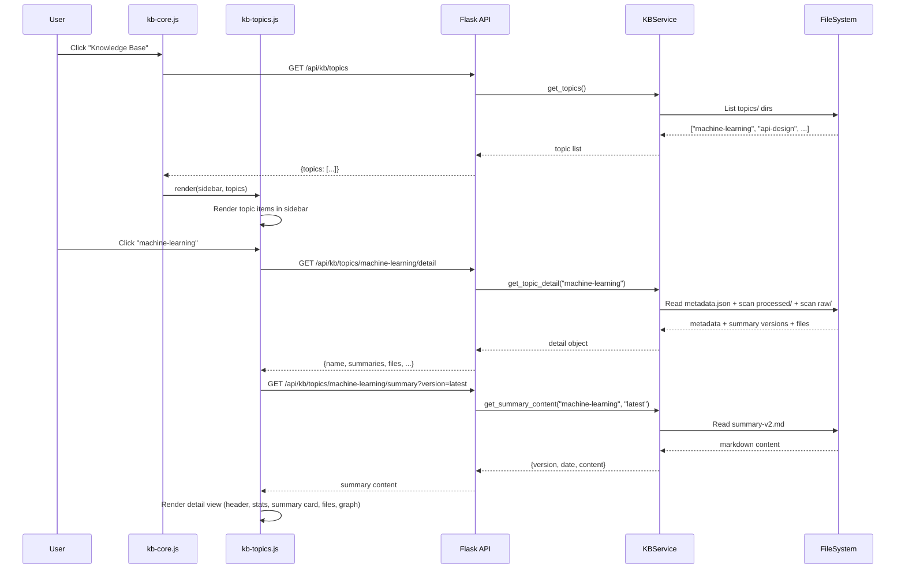
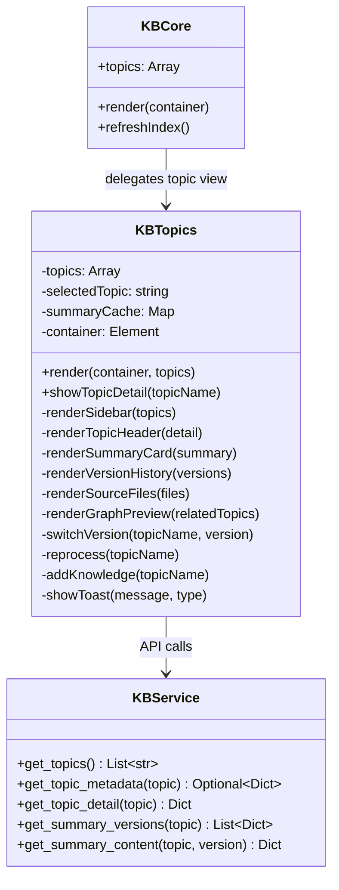

# Technical Design: KB Topics & Summaries

> Feature ID: FEATURE-025-D | Version: v1.0 | Last Updated: 02-12-2026

---

## Part 1: Agent-Facing Summary

> **Purpose:** Quick reference for AI agents navigating large projects.
> **📌 AI Coders:** Focus on this section for implementation context.

### Key Components Implemented

| Component | Responsibility | Scope/Impact | Tags |
|-----------|----------------|--------------|------|
| `KBTopics` (JS) | Topics sidebar + detail view rendering | New frontend module `kb-topics.js` | #kb #topics #frontend #sidebar #summary |
| `kb-topics.css` | Styling for topics view (sidebar, summary card, version history, source files, graph) | New CSS file | #kb #topics #css #design-system |
| `GET /api/kb/topics/<name>/detail` | Topic detail endpoint (metadata + summaries list + file list) | New route in `kb_routes.py` | #kb #api #topics #backend |
| `GET /api/kb/topics/<name>/summary` | Read summary content by version | New route in `kb_routes.py` | #kb #api #summary #backend |
| `KBService` extensions | `get_topic_detail()`, `get_summary_content()`, `get_summary_versions()` | Extend existing service | #kb #service #backend |

### Dependencies

| Dependency | Source | Design Link | Usage Description |
|------------|--------|-------------|-------------------|
| `KBService` | FEATURE-025-A | existing | Core KB service — topics list, metadata, file index |
| `KBManagerService` | FEATURE-025-C | existing | Reprocess trigger via `POST /api/kb/process` |
| `kb-core.js` | FEATURE-025-A | existing | View switching, index refresh, sidebar tree |
| `kb-landing.js` | FEATURE-025-B | existing | Landing view (co-exists, not replaced) |
| Bootstrap Icons | External | CDN | Icon library already loaded |

### Major Flow

1. User clicks "Knowledge Base" → `kbCore.render()` → loads index + topics
2. If topics exist → `kbTopics.render(sidebar, topics)` populates sidebar with topic items
3. User clicks topic → `kbTopics.showTopicDetail(topicName)` → fetches `GET /api/kb/topics/<name>/detail`
4. Detail response includes metadata + summary versions → renders header, stats, summary card, version history, source files, graph preview
5. Summary card loads latest `summary-vN.md` content via `GET /api/kb/topics/<name>/summary?version=latest`
6. User clicks version → fetches that version's content → swaps summary card body
7. "Reprocess" → `POST /api/kb/process` → loading state → refresh on completion
8. "Add Knowledge" → file upload dialog → `POST /api/kb/upload` with topic scope

### Usage Example

```javascript
// In kb-core.js — delegate to kbTopics when topics exist
if (this.topics.length > 0) {
    kbTopics.render(sidebarContainer, this.topics);
    kbTopics.showTopicDetail(this.topics[0].name);
}

// Topic detail loading
const detail = await fetch(`/api/kb/topics/${topicName}/detail`);
// { name, description, file_count, summary_count, last_updated, tags,
//   summaries: [{version: 2, date: "...", current: true}, ...],
//   files: [{name, path, size, type}, ...],
//   related_topics: ["api-design", "architecture"] }

// Summary content loading
const summary = await fetch(`/api/kb/topics/${topicName}/summary?version=2`);
// { version: 2, date: "...", content: "# Topic: machine-learning\n..." }
```

```python
# Backend — new service methods
detail = kb_service.get_topic_detail("machine-learning")
# Returns: {name, description, file_count, summary_count, last_updated,
#           summaries: [...], files: [...], related_topics: [...]}

content = kb_service.get_summary_content("machine-learning", version=2)
# Returns: {version: 2, date: "...", content: "markdown string"}
```

---

## Part 2: Implementation Guide

> **Purpose:** Human-readable details for developers.
> **📌 Emphasis on visual diagrams for comprehension.**

### Architecture Overview

This feature adds a **Topics & Summaries view** to the existing KB module. It introduces:
- 2 new backend API endpoints on the existing `kb_routes` blueprint
- 3 new methods on `KBService`
- 1 new frontend JS module (`kb-topics.js`) + 1 new CSS file (`kb-topics.css`)
- Integration with existing `kb-core.js` for view switching

### Workflow Diagram



### Class Diagram



### Data Models

#### Topic Detail Response (`GET /api/kb/topics/<name>/detail`)

```json
{
  "name": "machine-learning",
  "description": "AI/ML training documentation",
  "file_count": 8,
  "summary_count": 2,
  "last_updated": "2026-02-05T10:30:45Z",
  "tags": ["machine-learning", "deep-learning"],
  "summaries": [
    {"version": 2, "date": "2026-02-05T10:30:45Z", "current": true},
    {"version": 1, "date": "2026-02-03T08:15:00Z", "current": false}
  ],
  "files": [
    {"name": "research-paper-v2.pdf", "path": "topics/machine-learning/raw/research-paper-v2.pdf", "size": 2457600, "type": "pdf"},
    {"name": "neural-networks-guide.md", "path": "topics/machine-learning/raw/neural-networks-guide.md", "size": 159744, "type": "markdown"}
  ],
  "related_topics": ["api-design", "architecture", "best-practices"]
}
```

#### Summary Content Response (`GET /api/kb/topics/<name>/summary?version=N`)

```json
{
  "version": 2,
  "date": "2026-02-05T10:30:45Z",
  "content": "# Topic: machine-learning\n\n> Generated: 2026-02-05...\n\n## Overview\n..."
}
```

### API Specification

| Method | Endpoint | Description | Response |
|--------|----------|-------------|----------|
| GET | `/api/kb/topics/<name>/detail` | Full topic detail with summaries, files, related topics | 200: detail object / 404: topic not found |
| GET | `/api/kb/topics/<name>/summary` | Read summary content. Query: `version=N` or `version=latest` | 200: summary content / 404: topic or version not found |

### Backend Implementation Steps

#### Step 1: Add `get_summary_versions()` to KBService

```python
def get_summary_versions(self, topic: str) -> list[dict]:
    """Get list of summary versions for a topic, newest first."""
    processed_dir = self.KB_PATH / "processed" / topic
    if not processed_dir.exists():
        return []
    versions = []
    for f in processed_dir.glob("summary-v*.md"):
        match = re.match(r"summary-v(\d+)\.md", f.name)
        if match:
            ver = int(match.group(1))
            stat = f.stat()
            versions.append({
                "version": ver,
                "date": datetime.fromtimestamp(stat.st_mtime).isoformat() + "Z",
            })
    versions.sort(key=lambda v: v["version"], reverse=True)
    if versions:
        versions[0]["current"] = True
    for v in versions[1:]:
        v["current"] = False
    return versions[:5]  # BR-3: up to 5 most recent
```

#### Step 2: Add `get_summary_content()` to KBService

```python
def get_summary_content(self, topic: str, version: str = "latest") -> dict | None:
    """Read summary markdown content for a specific version."""
    processed_dir = self.KB_PATH / "processed" / topic
    if not processed_dir.exists():
        return None
    if version == "latest":
        versions = self.get_summary_versions(topic)
        if not versions:
            return None
        version = versions[0]["version"]
    else:
        version = int(version)
    filepath = processed_dir / f"summary-v{version}.md"
    if not filepath.exists():
        return None
    content = filepath.read_text(encoding="utf-8")
    stat = filepath.stat()
    return {
        "version": version,
        "date": datetime.fromtimestamp(stat.st_mtime).isoformat() + "Z",
        "content": content,
    }
```

#### Step 3: Add `get_topic_detail()` to KBService

```python
def get_topic_detail(self, topic: str) -> dict | None:
    """Get full topic detail: metadata + summaries + files + related topics."""
    metadata = self.get_topic_metadata(topic)
    if metadata is None:
        return None
    summaries = self.get_summary_versions(topic)
    # Get raw files under topics/{topic}/raw/
    raw_dir = self.KB_PATH / "topics" / topic / "raw"
    files = []
    if raw_dir.exists():
        for f in sorted(raw_dir.iterdir()):
            if f.is_file():
                files.append({
                    "name": f.name,
                    "path": f"topics/{topic}/raw/{f.name}",
                    "size": f.stat().st_size,
                    "type": self._get_file_type(f.name),
                })
    # Related topics: all other topics (simple for now; graph is Phase 2)
    all_topics = self.get_topics()
    related = [t for t in all_topics if t != topic]
    return {
        **metadata,
        "summary_count": len(summaries),
        "summaries": summaries,
        "files": files,
        "related_topics": related[:4],  # Limit to 4 for graph preview
    }
```

#### Step 4: Add API routes

```python
@kb_bp.route("/topics/<name>/detail", methods=["GET"])
@x_ipe_tracing
def get_topic_detail(name):
    kb = _get_kb_service()
    detail = kb.get_topic_detail(name)
    if detail is None:
        return jsonify({"error": f"Topic '{name}' not found"}), 404
    return jsonify(detail)

@kb_bp.route("/topics/<name>/summary", methods=["GET"])
@x_ipe_tracing
def get_topic_summary(name):
    kb = _get_kb_service()
    version = request.args.get("version", "latest")
    summary = kb.get_summary_content(name, version)
    if summary is None:
        return jsonify({"error": f"Summary not found for topic '{name}' version '{version}'"}), 404
    return jsonify(summary)
```

### Frontend Implementation Steps

#### Step 5: Create `kb-topics.css`

All styles derived from the approved mockup (`knowledge-base-processed-v1.html`). Key classes:

| CSS Class | Purpose | Source |
|-----------|---------|--------|
| `.kb-topic-item` | Topic sidebar item with icon, name, meta, badge | Mockup `.topic-item` |
| `.kb-topic-item.active` | Selected state with left accent border | Mockup `.topic-item.active` |
| `.kb-topic-icon.{type}` | Color-coded icons (ml=amber, api=blue, best=green, arch=purple) | Mockup `.topic-icon.*` |
| `.kb-content-header` | Detail header with title, badge, actions, stats row | Mockup `.content-header` |
| `.kb-stat-item` | Stats row item (icon box + value + label) | Mockup `.stat-item` |
| `.kb-summary-card` | Summary card container with header + body | Mockup `.summary-card` |
| `.kb-markdown-content` | Styled markdown rendering (h4 icons, lists, code, blockquotes, highlights) | Mockup `.markdown-content` |
| `.kb-version-history` | Version timeline with dots | Mockup `.version-history` |
| `.kb-version-item.current` | Current version highlight (accent border) | Mockup `.version-item.current` |
| `.kb-raw-file-item` | Source file row with icon, name, meta, hover actions | Mockup `.raw-file-item` |
| `.kb-raw-file-icon.{type}` | File type icons (pdf=red, md=purple, code=green) | Mockup `.raw-file-icon.*` |
| `.kb-graph-preview` | Knowledge graph container with SVG canvas | Mockup `.graph-preview` |
| `.kb-graph-node` | Graph nodes (center + peripheral) | Mockup `.graph-node.*` |
| `.kb-source-reference` | Source references section inside summary card | Mockup `.source-reference` |

Color mappings from mockup CSS variables (reuse existing or add to `:root`):
- Accent primary: `#7c6aef`, secondary: `#a78bfa`, warm: `#f59e0b`, success: `#10b981`, info: `#3b82f6`, danger: `#ef4444`

Responsive: `@media (max-width: 1200px)` → content body padding 24px → 16px.

#### Step 6: Create `kb-topics.js`

Module structure following existing `kb-landing.js` pattern:

```javascript
const kbTopics = {
    topics: [],
    selectedTopic: null,
    summaryCache: new Map(),  // Cache loaded summaries
    container: null,
    contentContainer: null,

    render(container, topics) {
        this.container = container;
        this.topics = topics;
        this._renderSidebar();
        if (topics.length > 0) {
            this.showTopicDetail(topics[0]);
        } else {
            this._renderEmptyState();
        }
    },

    async showTopicDetail(topicName) {
        this.selectedTopic = topicName;
        this._highlightSidebarItem(topicName);
        // Show loading state
        // Fetch detail
        const resp = await fetch(`/api/kb/topics/${encodeURIComponent(topicName)}/detail`);
        if (!resp.ok) { this._showToast("Failed to load topic", "error"); return; }
        const detail = await resp.json();
        // Load latest summary content
        const summaryResp = await fetch(`/api/kb/topics/${encodeURIComponent(topicName)}/summary?version=latest`);
        const summary = summaryResp.ok ? await summaryResp.json() : null;
        if (summary) this.summaryCache.set(`${topicName}-v${summary.version}`, summary);
        this._renderDetail(detail, summary);
    },

    async switchVersion(topicName, version) {
        const cacheKey = `${topicName}-v${version}`;
        let summary = this.summaryCache.get(cacheKey);
        if (!summary) {
            const resp = await fetch(`/api/kb/topics/${encodeURIComponent(topicName)}/summary?version=${version}`);
            if (!resp.ok) { this._showToast("Version not found", "error"); return; }
            summary = await resp.json();
            this.summaryCache.set(cacheKey, summary);
        }
        this._updateSummaryCard(summary);
        this._updateVersionHighlight(version);
    },

    async reprocess(topicName) {
        // Show loading spinner on summary card
        // POST /api/kb/process with topic files
        // On success: refresh detail view
    },

    // ... render methods for each section
};
```

#### Step 7: Integrate with `kb-core.js`

Modify `kbCore.render()` to delegate topic display:

```javascript
// In renderWelcome() or a new renderTopicsView():
if (this.topics.length > 0) {
    // Show topics sidebar + first topic detail
    kbTopics.render(contentArea, this.topics);
} else {
    // Fall through to landing view
    kbLanding.render(contentArea, landingFiles);
}
```

The topics view replaces the content panel when topics exist. Landing zone remains accessible via sidebar "Landing" item or a tab/toggle.

### Markdown Rendering

Summary markdown is rendered client-side. Use a simple approach:
1. Split content by lines, parse headings/lists/code/blockquotes
2. Apply `.kb-markdown-content` CSS classes matching mockup styles
3. Sanitize: strip `<script>`, `<iframe>`, `on*` attributes (XSS prevention)
4. Support: `h4` with icons, `p`, `ul/li`, `code`, `blockquote`, `.highlight` spans

No external markdown library needed — summaries follow a predictable structure generated by `KBManagerService.generate_summary()`.

### Edge Cases & Error Handling

| Scenario | Handling |
|----------|----------|
| No topics exist | Sidebar empty state: "No topics yet. Upload and classify files to create topics." |
| Topic has no summaries | Summary card shows empty state with "Reprocess" CTA |
| Summary fetch fails | Toast error, keep previous content |
| Reprocess fails (LLM error) | Toast error, remove loading spinner, keep existing summary |
| Rapid topic clicks | Cancel pending fetches via AbortController |
| Topic name with special chars | `encodeURIComponent()` in all API calls |
| Very long summary | Scrollable content body, no truncation |
| File index stale | Refresh index after reprocess/upload |

### Knowledge Graph Preview (Placeholder)

Per spec AC-7.x, the graph is a **static preview** for Phase 2:
- Central node = current topic (accent gradient)
- Up to 4 peripheral nodes = `related_topics` from detail response
- SVG connecting lines (dashed)
- "Expand" button = placeholder (no action, tooltip "Coming in Phase 2")
- Node colors rotate through: warm, success, info, danger

### Design Principles Applied

| Principle | Application |
|-----------|-------------|
| **KISS** | No external markdown library — summaries have predictable structure from `generate_summary()`. Simple inline parser suffices. No SPA router — topic switching is DOM swap. |
| **YAGNI** | Knowledge graph is placeholder only (Phase 2). No topic creation UI. No summary editing. No drag-drop reorder. Related topics derived from simple list, no graph DB. |
| **DRY** | Reuses existing `KBService` patterns (same factory, same error handling). CSS extends existing design system variables. `_showToast()` reuses `kb-landing.js` toast pattern. |

### File Structure Changes

```
src/x_ipe/
├── services/
│   └── kb_service.py          # +3 methods (~60 lines)
├── routes/
│   └── kb_routes.py           # +2 endpoints (~25 lines)
├── static/
│   ├── css/
│   │   └── kb-topics.css      # NEW (~350 lines, from mockup)
│   └── js/
│       └── features/
│           ├── kb-core.js     # Modified: add topics view integration (~20 lines)
│           └── kb-topics.js   # NEW (~400 lines)
└── templates/
    └── index.html             # Add kb-topics.css + kb-topics.js includes
```

### Implementation Order

1. Backend: `KBService` new methods (Step 1-3)
2. Backend: API routes (Step 4)
3. Frontend: CSS (Step 5)
4. Frontend: JS module (Step 6)
5. Integration: wire into `kb-core.js` (Step 7)
6. Manual testing: verify all ACs against mockup

---

## Design Change Log

| Date | Phase | Change Summary |
|------|-------|----------------|
| 02-12-2026 | Initial Design | Initial technical design created |
