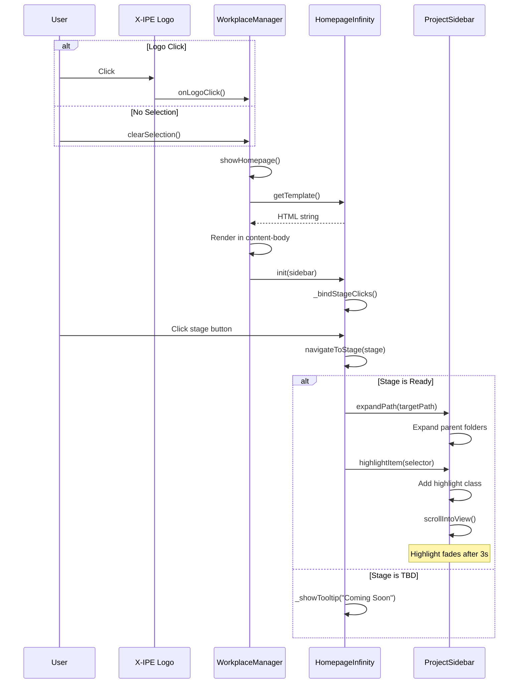
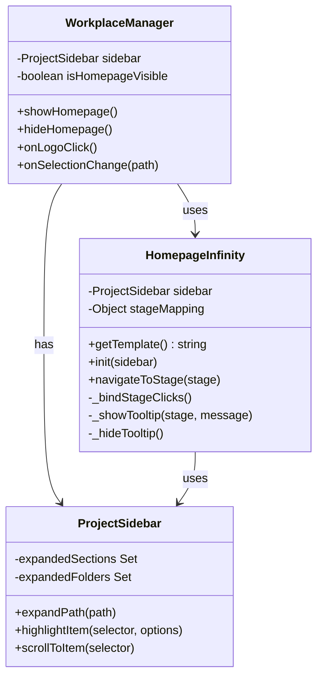

# Technical Design: Homepage Infinity Loop

> Feature ID: FEATURE-026  
> Version: v1.0  
> Status: Designed  
> Last Updated: 02-05-2026

---

## Version History

| Version | Date | Author | Changes |
|---------|------|--------|---------|
| v1.0 | 02-05-2026 | Echo | Initial design |

---

# Part 1: Agent-Facing Summary

## Technical Scope

| Scope | Included |
|-------|----------|
| Frontend | ✅ Yes - UI component, CSS, JS |
| Backend | ❌ No - No API needed |
| Database | ❌ No |
| Full Stack | ❌ No |

## Component Overview

| Component | File | Tags | Purpose |
|-----------|------|------|---------|
| HomepageInfinity | `homepage-infinity.js` | [homepage, infinity-loop, navigation, sidebar-integration] | Main JS class for homepage logic |
| Homepage CSS | `homepage-infinity.css` | [homepage, infinity-loop, styles] | Styling for infinity loop visualization |
| Homepage Template | `workplace.js` (inline) | [homepage, template] | HTML template rendered in content panel |

## Dependencies

| Dependency | Type | Link | Purpose |
|------------|------|------|---------|
| FEATURE-001 | Feature | [specification.md](../FEATURE-001/specification.md) | ProjectSidebar class for expand/scroll |
| workplace.js | Module | `src/x_ipe/static/js/features/workplace.js` | Content panel rendering |
| sidebar.js | Module | `src/x_ipe/static/js/features/sidebar.js` | Sidebar tree manipulation |

## Key Design Decisions

| Decision | Choice | Rationale |
|----------|--------|-----------|
| Rendering approach | SVG/CSS with PNG fallback | Matches mockup, scalable, no external deps |
| Module location | Standalone `homepage-infinity.js` | workplace.js already 2793 lines (>800 rule) |
| Sidebar integration | Use existing expand/scroll APIs | DRY - reuse ProjectSidebar methods |
| State management | Simple flag in WorkplaceManager | KISS - no complex state needed |

## Major Flow

```
User clicks X-IPE logo OR no file selected
    ↓
WorkplaceManager.showHomepage()
    ↓
Render homepage template in workplace-content-body
    ↓
HomepageInfinity.init() binds stage click handlers
    ↓
User clicks stage button
    ↓
HomepageInfinity.navigateToStage(stageName)
    ↓
ProjectSidebar.expandPath(targetPath) + highlightItem()
```

## Usage Example

```javascript
// In workplace.js - trigger homepage display
class WorkplaceManager {
    showHomepage() {
        const contentBody = document.getElementById('workplace-content-body');
        contentBody.innerHTML = HomepageInfinity.getTemplate();
        HomepageInfinity.init(this.sidebar);
    }
    
    // Called when logo clicked or no selection
    onLogoClick() {
        this.showHomepage();
    }
}

// In homepage-infinity.js
class HomepageInfinity {
    static init(sidebar) {
        this.sidebar = sidebar;
        this._bindStageClicks();
    }
    
    static navigateToStage(stage) {
        const target = this.stageMapping[stage];
        if (target.status === 'tbd') {
            this._showTooltip(stage, 'Coming Soon');
            return;
        }
        this.sidebar.expandPath(target.path);
        this.sidebar.highlightItem(target.selector, { duration: 3000 });
    }
}
```

---

# Part 2: Implementation Guide

## Workflow Diagram



## Class Diagram



## Stage-to-Sidebar Mapping

```javascript
const STAGE_MAPPING = {
    ideation: {
        path: 'workplace/ideation',
        section: 'workplace',
        selector: '[data-path="x-ipe-docs/ideas"]',
        label: 'Workplace → Ideation',
        status: 'ready'
    },
    requirement: {
        path: 'project/requirements',
        section: 'project',
        selector: '[data-path="x-ipe-docs/requirements"]',
        label: 'Project → Requirements',
        status: 'ready'
    },
    implementation: {
        path: 'project/features',
        section: 'project',
        selector: '[data-path="x-ipe-docs/requirements"]',
        label: 'Project → Features',
        status: 'ready'
    },
    deployment: {
        path: 'management/deployment',
        section: 'management',
        selector: null,
        label: 'Management → Deployment',
        status: 'tbd'
    },
    validation: {
        path: 'quality/report',
        section: 'quality',
        selector: '[data-section="quality-report"]',
        label: 'Quality → Project Quality Report',
        status: 'ready'
    },
    monitoring: {
        path: 'quality/tracing',
        section: 'quality',
        selector: '[data-section="behavior-tracing"]',
        label: 'Quality → Behavior Tracing',
        status: 'ready'
    },
    feedback: {
        path: 'feedback/uiux',
        section: 'feedback',
        selector: '[data-section="uiux-feedback"]',
        label: 'Feedback → UI/UX Feedback',
        status: 'ready'
    },
    planning: {
        path: 'management/planning',
        section: 'management',
        selector: '[data-path="x-ipe-docs/planning"]',
        label: 'Management → Planning',
        status: 'ready'
    }
};
```

## File Structure

```
src/x_ipe/static/
├── js/features/
│   ├── homepage-infinity.js    # NEW - Homepage component (~200 lines)
│   ├── workplace.js            # MODIFY - Add showHomepage(), onLogoClick()
│   └── sidebar.js              # MODIFY - Add expandPath(), highlightItem()
└── css/
    └── homepage-infinity.css   # NEW - Homepage styles (~150 lines)
```

## Implementation Steps

### Step 1: Create homepage-infinity.js

```javascript
/**
 * Homepage Infinity Loop
 * FEATURE-026: Interactive homepage with stage navigation
 */
class HomepageInfinity {
    static sidebar = null;
    static activeTooltip = null;
    
    static STAGE_MAPPING = { /* as defined above */ };
    
    /**
     * Get HTML template for homepage
     */
    static getTemplate() {
        return `
            <div class="homepage-infinity-container">
                <header class="homepage-header">
                    <h1>X-IPE</h1>
                    <p>AI-Powered Development Lifecycle</p>
                </header>
                
                <div class="infinity-loop-container">
                    <div class="infinity-loop">
                        <!-- SVG infinity path or PNG background -->
                        
                        
                        <!-- Stage buttons -->
                        ${this._renderStageButtons()}
                        
                        <!-- Labels -->
                        <span class="loop-label control">CONTROL</span>
                        <span class="loop-label transparency">TRANSPARENCY</span>
                    </div>
                </div>
                
                <footer class="homepage-legend">
                    <span>Control (What we decide)</span>
                    <span>Transparency (What we see)</span>
                </footer>
            </div>
        `;
    }
    
    static _renderStageButtons() {
        const stages = [
            { id: 'ideation', icon: '💡', label: 'IDEATION', pos: { left: '4.5%', top: '60%' }, theme: 'control' },
            { id: 'requirement', icon: '📋', label: 'REQUIREMENT', pos: { left: '12%', top: '12%' }, theme: 'control' },
            { id: 'implementation', icon: '⚙️', label: 'IMPLEMENT', pos: { left: '30%', top: '73%' }, theme: 'control' },
            { id: 'deployment', icon: '🚀', label: 'DEPLOY', pos: { left: '56%', top: '19%' }, theme: 'control' },
            { id: 'validation', icon: '✅', label: 'VALIDATION', pos: { left: '80%', top: '13%' }, theme: 'transparency' },
            { id: 'monitoring', icon: '📊', label: 'MONITORING', pos: { left: '85%', top: '65%' }, theme: 'transparency' },
            { id: 'feedback', icon: '💬', label: 'FEEDBACK', pos: { left: '58%', top: '70%' }, theme: 'transparency' },
            { id: 'planning', icon: '📅', label: 'PLANNING', pos: { left: '38%', top: '25%' }, theme: 'transparency' }
        ];
        
        return stages.map(s => {
            const mapping = this.STAGE_MAPPING[s.id];
            const isTbd = mapping.status === 'tbd';
            return `
                <button class="stage-btn ${s.theme} ${isTbd ? 'tbd' : ''}"
                        data-stage="${s.id}"
                        style="left: ${s.pos.left}; top: ${s.pos.top};"
                        ${isTbd ? 'data-tbd="true"' : ''}>
                    <span class="stage-icon">${s.icon}</span>
                    <span class="stage-label">${s.label}</span>
                    ${isTbd ? '<span class="tbd-badge">TBD</span>' : ''}
                </button>
            `;
        }).join('');
    }
    
    /**
     * Initialize homepage with sidebar reference
     */
    static init(sidebar) {
        this.sidebar = sidebar;
        this._bindStageClicks();
    }
    
    static _bindStageClicks() {
        document.querySelectorAll('.stage-btn').forEach(btn => {
            btn.addEventListener('click', (e) => {
                const stage = btn.dataset.stage;
                this.navigateToStage(stage);
            });
            
            // TBD tooltip on hover
            if (btn.dataset.tbd) {
                btn.addEventListener('mouseenter', () => {
                    this._showTooltip(btn, 'Coming Soon');
                });
                btn.addEventListener('mouseleave', () => {
                    this._hideTooltip();
                });
            }
        });
    }
    
    /**
     * Navigate to sidebar section for stage
     */
    static navigateToStage(stage) {
        const mapping = this.STAGE_MAPPING[stage];
        if (!mapping) return;
        
        if (mapping.status === 'tbd') {
            // Already handled by hover tooltip
            return;
        }
        
        // Expand sidebar section and folder path
        if (mapping.section) {
            this.sidebar.expandSection(mapping.section);
        }
        
        if (mapping.selector) {
            this.sidebar.highlightItem(mapping.selector, {
                duration: 3000,
                scrollIntoView: true
            });
        }
    }
    
    static _showTooltip(element, message) {
        this._hideTooltip();
        const tooltip = document.createElement('div');
        tooltip.className = 'homepage-tooltip';
        tooltip.textContent = message;
        element.appendChild(tooltip);
        this.activeTooltip = tooltip;
    }
    
    static _hideTooltip() {
        if (this.activeTooltip) {
            this.activeTooltip.remove();
            this.activeTooltip = null;
        }
    }
}

// Export for module usage
if (typeof module !== 'undefined') {
    module.exports = HomepageInfinity;
}
```

### Step 2: Add sidebar methods (sidebar.js)

Add these methods to `ProjectSidebar` class:

```javascript
/**
 * Expand a section by ID
 * @param {string} sectionId - Section identifier
 */
expandSection(sectionId) {
    const header = this.container.querySelector(`[data-section="${sectionId}"] .sidebar-section-header`);
    if (!header) return;
    
    const collapse = header.nextElementSibling;
    if (collapse && !collapse.classList.contains('show')) {
        new bootstrap.Collapse(collapse, { show: true });
        this.expandedSections.add(sectionId);
    }
}

/**
 * Highlight an item in the sidebar
 * @param {string} selector - CSS selector for the item
 * @param {Object} options - { duration: ms, scrollIntoView: boolean }
 */
highlightItem(selector, options = {}) {
    const { duration = 3000, scrollIntoView = true } = options;
    
    const item = this.container.querySelector(selector);
    if (!item) return;
    
    // Remove any existing highlights
    this.container.querySelectorAll('.sidebar-highlight').forEach(el => {
        el.classList.remove('sidebar-highlight');
    });
    
    // Add highlight
    item.classList.add('sidebar-highlight');
    
    // Scroll into view
    if (scrollIntoView) {
        item.scrollIntoView({ behavior: 'smooth', block: 'center' });
    }
    
    // Remove highlight after duration
    setTimeout(() => {
        item.classList.remove('sidebar-highlight');
    }, duration);
}
```

### Step 3: Add to workplace.js

Add homepage integration to `WorkplaceManager`:

```javascript
// Add to WorkplaceManager class

/**
 * Show homepage in content panel
 */
showHomepage() {
    this.isHomepageVisible = true;
    const contentBody = document.getElementById('workplace-content-body');
    contentBody.innerHTML = HomepageInfinity.getTemplate();
    HomepageInfinity.init(this.sidebar);
}

/**
 * Hide homepage (when file selected)
 */
hideHomepage() {
    this.isHomepageVisible = false;
    // Content will be replaced by file content
}

/**
 * Handle X-IPE logo click
 */
onLogoClick() {
    // Clear any selection
    this.sidebar.clearSelection();
    this.showHomepage();
}

/**
 * Handle selection change
 */
onSelectionChange(path) {
    if (path) {
        this.hideHomepage();
        // Load file content as normal
    } else {
        // No selection - show homepage
        this.showHomepage();
    }
}
```

### Step 4: Create homepage-infinity.css

```css
/* Homepage Infinity Loop Styles */
/* FEATURE-026 */

.homepage-infinity-container {
    display: flex;
    flex-direction: column;
    align-items: center;
    justify-content: center;
    min-height: 100%;
    padding: 2rem;
    background: var(--bg-primary, #0f172a);
}

.homepage-header {
    text-align: center;
    margin-bottom: 2rem;
}

.homepage-header h1 {
    font-family: 'Syne', sans-serif;
    font-size: 2rem;
    font-weight: 700;
    color: var(--text-primary, #ffffff);
    margin: 0;
}

.homepage-header p {
    font-family: 'DM Sans', sans-serif;
    font-size: 1rem;
    color: var(--text-secondary, #94a3b8);
    margin: 0.5rem 0 0;
}

.infinity-loop-container {
    position: relative;
    width: 100%;
    max-width: 900px;
}

.infinity-loop {
    position: relative;
    width: 100%;
    aspect-ratio: 2 / 1;
}

.infinity-bg {
    width: 100%;
    height: 100%;
    object-fit: contain;
}

/* Stage buttons */
.stage-btn {
    position: absolute;
    display: flex;
    flex-direction: column;
    align-items: center;
    gap: 0.25rem;
    padding: 0.5rem 0.75rem;
    border: none;
    border-radius: 8px;
    cursor: pointer;
    transition: transform 0.2s, box-shadow 0.2s;
    font-family: 'DM Sans', sans-serif;
}

.stage-btn.control {
    background: linear-gradient(135deg, #3b82f6 0%, #60a5fa 100%);
    color: #ffffff;
}

.stage-btn.transparency {
    background: linear-gradient(135deg, #8b5cf6 0%, #a78bfa 100%);
    color: #ffffff;
}

.stage-btn.tbd {
    background: #64748b;
    opacity: 0.7;
    cursor: not-allowed;
}

.stage-btn:hover:not(.tbd) {
    transform: scale(1.1);
    box-shadow: 0 0 20px rgba(96, 165, 250, 0.5);
}

.stage-btn.transparency:hover:not(.tbd) {
    box-shadow: 0 0 20px rgba(167, 139, 250, 0.5);
}

.stage-icon {
    font-size: 1.25rem;
}

.stage-label {
    font-size: 0.65rem;
    font-weight: 600;
    text-transform: uppercase;
}

.tbd-badge {
    position: absolute;
    top: -8px;
    right: -8px;
    background: #ef4444;
    color: white;
    font-size: 0.5rem;
    padding: 2px 4px;
    border-radius: 4px;
}

/* Loop labels */
.loop-label {
    position: absolute;
    font-family: 'Syne', sans-serif;
    font-size: 1.1rem;
    font-weight: 700;
    text-transform: uppercase;
    letter-spacing: 0.1em;
}

.loop-label.control {
    left: 20%;
    top: 45%;
    color: #60a5fa;
}

.loop-label.transparency {
    right: 15%;
    top: 45%;
    color: #a78bfa;
}

/* Legend */
.homepage-legend {
    display: flex;
    gap: 2rem;
    margin-top: 1.5rem;
    font-family: 'DM Sans', sans-serif;
    font-size: 0.75rem;
    color: var(--text-secondary, #94a3b8);
}

/* Tooltip */
.homepage-tooltip {
    position: absolute;
    bottom: 100%;
    left: 50%;
    transform: translateX(-50%);
    background: #1e293b;
    color: #ffffff;
    padding: 0.5rem 0.75rem;
    border-radius: 4px;
    font-size: 0.75rem;
    white-space: nowrap;
    margin-bottom: 0.5rem;
    z-index: 10;
}

/* Sidebar highlight */
.sidebar-highlight {
    background: rgba(34, 211, 238, 0.2) !important;
    border-left: 3px solid #22d3ee !important;
    animation: highlight-pulse 0.5s ease-in-out;
}

@keyframes highlight-pulse {
    0%, 100% { opacity: 1; }
    50% { opacity: 0.7; }
}

/* Responsive - hide on mobile */
@media (max-width: 768px) {
    .homepage-infinity-container {
        display: none;
    }
}
```

### Step 5: Bind Logo Click

In `init.js` or `workplace.js` initialization:

```javascript
// Bind X-IPE logo click to show homepage
document.querySelector('.navbar-brand').addEventListener('click', (e) => {
    e.preventDefault();
    workplaceManager.onLogoClick();
});

// Show homepage on initial load if no file selected
if (!workplaceManager.hasSelection()) {
    workplaceManager.showHomepage();
}
```

## SVG vs PNG Decision

**Approach:** Start with PNG background from mockup, evaluate SVG conversion.

1. **Phase 1 (MVP):** Use `Control&Transparency.png` as background
2. **Phase 2 (Optional):** Convert to SVG if:
   - Need dynamic theming
   - Bundle size becomes concern
   - Need animation along path

```javascript
// In homepage-infinity.js - PNG fallback
static getInfinityPath() {
    // Try SVG first
    const svgPath = '/static/images/infinity-loop.svg';
    const pngPath = '/api/file/content?path=x-ipe-docs%2Fideas%2FTBC008.%20Feature-Homepage%2FControl%26Transparency.png&raw=true';
    
    return `
        
    `;
}
```

## Testing Approach

| Test Type | What to Test |
|-----------|--------------|
| Unit | HomepageInfinity.getTemplate() returns valid HTML |
| Unit | HomepageInfinity.navigateToStage() calls sidebar methods |
| Integration | Logo click shows homepage |
| Integration | Stage click highlights correct sidebar item |
| Visual | Layout matches mockup on desktop |
| Responsive | Hidden on screens < 768px |

---

## Design Change Log

| Version | Date | Changes |
|---------|------|---------|
| v1.0 | 02-05-2026 | Initial design |

---

*Technical Design by Echo | TASK-201 | 02-05-2026*
