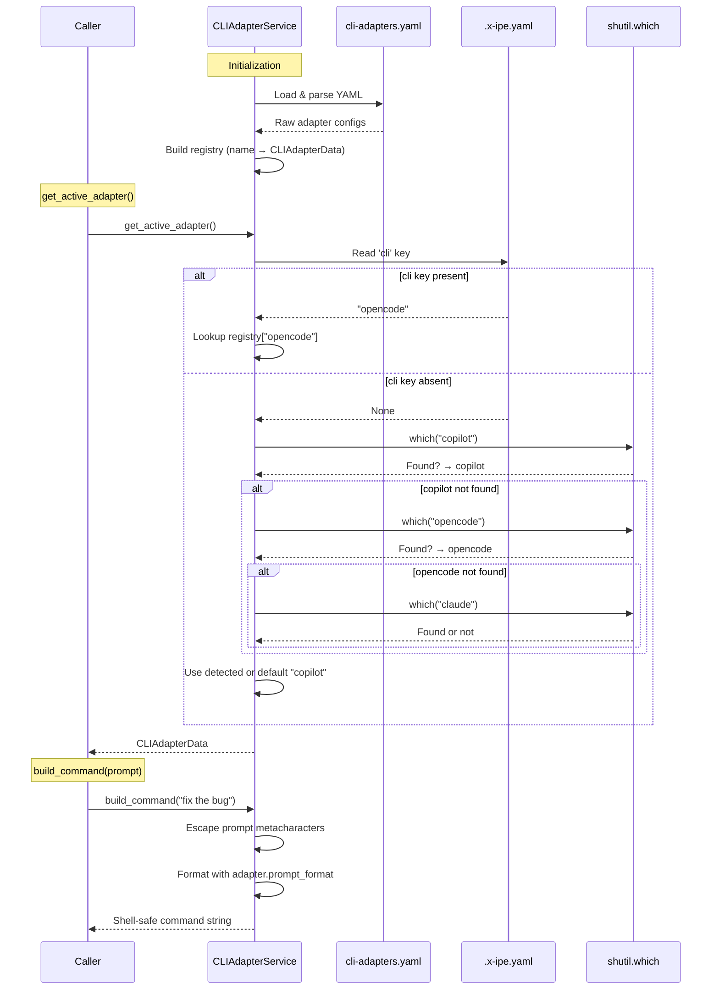
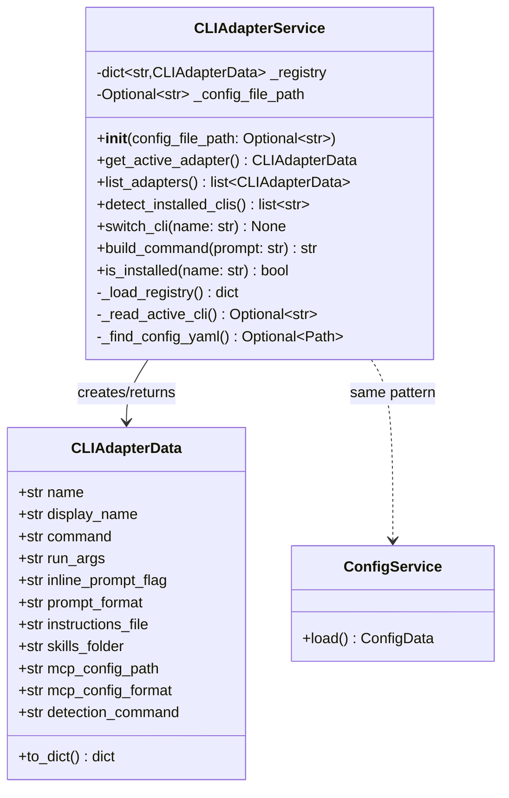

# Technical Design: CLI Adapter Registry & Service

> Feature ID: FEATURE-027-A | Version: v1.0 | Last Updated: 02-07-2026

---

## Version History

| Version | Date | Description |
|---------|------|-------------|
| v1.0 | 02-07-2026 | Initial technical design |

---

## Part 1: Agent-Facing Summary

> **Purpose:** Quick reference for AI agents navigating large projects.
> **📌 AI Coders:** Focus on this section for implementation context.

### Key Components Implemented

| Component | Responsibility | Scope/Impact | Tags |
|-----------|----------------|--------------|------|
| `CLIAdapterData` | Dataclass holding one adapter's config (command, paths, format) | Used by all CLI-related features | #cli #adapter #dataclass #config |
| `CLIAdapterService` | Load registry, detect CLIs, resolve active adapter, build commands | Core service for FEATURE-027-* | #cli #service #detection #registry |
| `cli-adapters.yaml` | YAML config defining all supported CLI adapters | Config-only extensibility; project-level overrides bundled default | #cli #yaml #config |
| `config_routes.py` | Flask Blueprint exposing `GET /api/config/cli-adapter` | Frontend consumption | #api #routes #config |

### Dependencies

| Dependency | Source | Design Link | Usage Description |
|------------|--------|-------------|-------------------|
| `ConfigService` | FEATURE-010 | `src/x_ipe/services/config_service.py` | Reads `.x-ipe.yaml` for active CLI key; provides pattern reference |
| `ConfigData` | FEATURE-010 | `src/x_ipe/services/config_service.py` | Dataclass pattern reference for `CLIAdapterData` |
| PyYAML | External | pyproject.toml | Already in deps — parses `cli-adapters.yaml` and `.x-ipe.yaml` |
| `shutil.which` | stdlib | — | CLI detection (faster than subprocess) |

### Major Flow

1. On service init → find `cli-adapters.yaml` (project `x-ipe-docs/config/` first, bundled `resources/config/` fallback) → build in-memory registry (dict of name → `CLIAdapterData`)
2. `get_active_adapter()` → read `.x-ipe.yaml` `cli` key → if present, look up registry → if absent, auto-detect → if none detected, default to `copilot`
3. `build_command(prompt)` → escape shell metacharacters → substitute into adapter's `prompt_format` → return safe command string
4. `GET /api/config/cli-adapter` → call `get_active_adapter()` + `is_installed()` → return JSON

### Usage Example

```python
from x_ipe.services.cli_adapter_service import CLIAdapterService

# Initialize (no Flask context needed)
service = CLIAdapterService()

# Get active adapter
adapter = service.get_active_adapter()
print(adapter.display_name)    # "GitHub Copilot CLI"
print(adapter.skills_folder)   # ".github/skills/"

# Build a command
cmd = service.build_command("fix the login bug")
# → 'copilot --allow-all-tools -i "fix the login bug"'

# List all adapters
all_adapters = service.list_adapters()

# Detect installed CLIs
installed = service.detect_installed_clis()
# → ["copilot", "claude-code"]

# Switch CLI
service.switch_cli("claude-code")
```

---

## Part 2: Implementation Guide

> **Purpose:** Human-readable details for developers.
> **📌 Emphasis on visual diagrams for comprehension.**

### Workflow Diagram



### Class Diagram



### Data Models

```python
@dataclass
class CLIAdapterData:
    """
    Immutable adapter configuration loaded from cli-adapters.yaml.
    
    FEATURE-027-A: CLI Adapter Registry & Service
    """
    name: str                  # e.g. "copilot"
    display_name: str          # e.g. "GitHub Copilot CLI"
    command: str               # e.g. "copilot"
    run_args: str              # e.g. "--allow-all-tools"
    inline_prompt_flag: str    # e.g. '-i'
    prompt_format: str         # e.g. '{command} {run_args} {inline_prompt_flag} "{escaped_prompt}"'
    instructions_file: str     # e.g. ".github/copilot-instructions.md"
    skills_folder: str         # e.g. ".github/skills/"
    mcp_config_path: str       # e.g. "~/.copilot/mcp-config.json"
    mcp_config_format: str     # e.g. "global"
    detection_command: str     # e.g. "copilot"

    @x_ipe_tracing()
    def to_dict(self) -> dict:
        """Convert to dictionary for API response."""
        return asdict(self)
```

### YAML Config Structure

**`src/x_ipe/resources/config/cli-adapters.yaml`:**

```yaml
adapters:
  copilot:
    display_name: "GitHub Copilot CLI"
    command: "copilot"
    run_args: "--allow-all-tools"
    inline_prompt_flag: "-i"
    prompt_format: '{command} {run_args} {inline_prompt_flag} "{escaped_prompt}"'
    instructions_file: ".github/copilot-instructions.md"
    skills_folder: ".github/skills/"
    mcp_config_path: "~/.copilot/mcp-config.json"
    mcp_config_format: "global"
    detection_command: "copilot"

  opencode:
    display_name: "OpenCode CLI"
    command: "opencode"
    run_args: ""
    inline_prompt_flag: "run"
    prompt_format: '{command} {inline_prompt_flag} "{escaped_prompt}"'
    instructions_file: ".opencode/instructions.md"
    skills_folder: ".opencode/skills/"
    mcp_config_path: "opencode.json"
    mcp_config_format: "project"
    detection_command: "opencode"

  claude-code:
    display_name: "Claude Code CLI"
    command: "claude"
    run_args: ""
    inline_prompt_flag: "-p"
    prompt_format: '{command} {inline_prompt_flag} "{escaped_prompt}"'
    instructions_file: ".claude/instructions.md"
    skills_folder: ".claude/skills/"
    mcp_config_path: ".mcp.json"
    mcp_config_format: "project"
    detection_command: "claude"
```

**Extended `.x-ipe.yaml`** (added `cli` key):

```yaml
version: 1
paths:
  project_root: "."
  x_ipe_app: "./x-ipe"
defaults:
  file_tree_scope: "project_root"
  terminal_cwd: "project_root"
cli: "copilot"   # ← new key (optional, auto-detected if absent)
```

### API Specification

#### GET /api/config/cli-adapter

**Response (200):**
```json
{
  "success": true,
  "adapter_name": "copilot",
  "display_name": "GitHub Copilot CLI",
  "command": "copilot",
  "prompt_format": "{command} {run_args} {inline_prompt_flag} \"{escaped_prompt}\"",
  "is_installed": true
}
```

### Service Implementation Outline

```python
"""
FEATURE-027-A: CLI Adapter Registry & Service

CLIAdapterData: Dataclass for adapter configuration.
CLIAdapterService: Load, query, detect, and manage CLI adapters.
"""
import os
import re
import shutil
import yaml
from pathlib import Path
from typing import Optional
from dataclasses import dataclass, asdict

from x_ipe.tracing import x_ipe_tracing

ADAPTERS_CONFIG_FILE = 'cli-adapters.yaml'
AUTO_DETECT_PRIORITY = ['copilot', 'opencode', 'claude-code']
DEFAULT_CLI = 'copilot'


class CLIAdapterService:
    """
    Service for loading and querying CLI adapter configurations.
    
    FEATURE-027-A: CLI Adapter Registry & Service
    
    Works both inside Flask context (API routes) and outside (CLI commands).
    Follows ConfigService pattern: load → query → return dataclass.
    """

    def __init__(self, config_file_path: Optional[str] = None):
        self._registry: dict[str, CLIAdapterData] = {}
        self._config_file_path = config_file_path
        self._load_registry()

    @x_ipe_tracing()
    def _load_registry(self):
        """Load adapters from cli-adapters.yaml bundled in package resources."""
        if self._config_file_path:
            yaml_path = Path(self._config_file_path)
        else:
            yaml_path = Path(__file__).parent.parent / 'resources' / 'config' / ADAPTERS_CONFIG_FILE
        
        with open(yaml_path, 'r', encoding='utf-8') as f:
            raw = yaml.safe_load(f)
        
        for name, config in raw.get('adapters', {}).items():
            self._registry[name] = CLIAdapterData(name=name, **config)

    @x_ipe_tracing()
    def get_active_adapter(self) -> CLIAdapterData:
        """Resolve and return the active CLI adapter."""
        active_name = self._read_active_cli()
        
        if active_name:
            if active_name not in self._registry:
                available = ', '.join(self._registry.keys())
                raise ValueError(
                    f"Unknown CLI adapter '{active_name}'. "
                    f"Available: {available}"
                )
            return self._registry[active_name]
        
        # Auto-detect
        for name in AUTO_DETECT_PRIORITY:
            if name in self._registry and self.is_installed(name):
                return self._registry[name]
        
        # Default fallback
        return self._registry[DEFAULT_CLI]

    @x_ipe_tracing()
    def list_adapters(self) -> list[CLIAdapterData]:
        """Return all registered adapters."""
        return list(self._registry.values())

    @x_ipe_tracing()
    def detect_installed_clis(self) -> list[str]:
        """Detect which CLIs are installed on the system."""
        installed = []
        for name, adapter in self._registry.items():
            if shutil.which(adapter.detection_command):
                installed.append(name)
        return installed

    @x_ipe_tracing()
    def is_installed(self, name: str) -> bool:
        """Check if a specific CLI is installed."""
        adapter = self._registry.get(name)
        if not adapter:
            return False
        return shutil.which(adapter.detection_command) is not None

    @x_ipe_tracing()
    def switch_cli(self, name: str) -> None:
        """Switch the active CLI in .x-ipe.yaml."""
        if name not in self._registry:
            available = ', '.join(self._registry.keys())
            raise ValueError(
                f"Unknown CLI adapter '{name}'. Available: {available}"
            )
        
        config_path = self._find_config_yaml()
        if not config_path:
            raise FileNotFoundError("No .x-ipe.yaml found")
        
        with open(config_path, 'r', encoding='utf-8') as f:
            config = yaml.safe_load(f) or {}
        
        config['cli'] = name
        
        with open(config_path, 'w', encoding='utf-8') as f:
            yaml.safe_dump(config, f, default_flow_style=False)

    @x_ipe_tracing()
    def build_command(self, prompt: str) -> str:
        """Build a shell-safe command string for the active adapter."""
        adapter = self.get_active_adapter()
        escaped = self._escape_prompt(prompt)
        return adapter.prompt_format.format(
            command=adapter.command,
            run_args=adapter.run_args,
            inline_prompt_flag=adapter.inline_prompt_flag,
            escaped_prompt=escaped,
        ).strip()

    @staticmethod
    def _escape_prompt(prompt: str) -> str:
        """Escape shell metacharacters in prompt text."""
        prompt = prompt.replace('\\', '\\\\')
        prompt = prompt.replace('"', '\\"')
        prompt = prompt.replace('$', '\\$')
        prompt = prompt.replace('`', '\\`')
        prompt = prompt.replace('\n', '\\n')
        return prompt

    def _read_active_cli(self) -> Optional[str]:
        """Read the 'cli' key from .x-ipe.yaml."""
        config_path = self._find_config_yaml()
        if not config_path:
            return None
        try:
            with open(config_path, 'r', encoding='utf-8') as f:
                config = yaml.safe_load(f)
            return config.get('cli') if config else None
        except (yaml.YAMLError, IOError):
            return None

    def _find_config_yaml(self) -> Optional[Path]:
        """Find .x-ipe.yaml by traversing up from cwd (reuses ConfigService logic)."""
        current = Path.cwd().resolve()
        for _ in range(20):
            candidate = current / '.x-ipe.yaml'
            if candidate.exists() and candidate.is_file():
                return candidate
            parent = current.parent
            if parent == current:
                break
            current = parent
        return None
```

### Route Implementation Outline

```python
"""
Config Routes Blueprint

FEATURE-027-A: CLI Adapter Registry & Service

Provides:
- GET /api/config/cli-adapter — Active CLI adapter info
"""
from flask import Blueprint, jsonify, current_app

from x_ipe.tracing import x_ipe_tracing

config_bp = Blueprint('config', __name__)


def get_cli_adapter_service():
    """Get CLI adapter service from app config."""
    return current_app.config.get('CLI_ADAPTER_SERVICE')


@config_bp.route('/api/config/cli-adapter', methods=['GET'])
@x_ipe_tracing()
def get_cli_adapter():
    """
    GET /api/config/cli-adapter

    Return the active CLI adapter configuration.
    """
    service = get_cli_adapter_service()
    if not service:
        return jsonify({'success': False, 'message': 'CLI adapter service not available'}), 503

    adapter = service.get_active_adapter()
    return jsonify({
        'success': True,
        'adapter_name': adapter.name,
        'display_name': adapter.display_name,
        'command': adapter.command,
        'prompt_format': adapter.prompt_format,
        'is_installed': service.is_installed(adapter.name),
    })
```

### Integration Points

**`app.py` changes** (in `_init_services`):

```python
# After ConfigService initialization (~line 121):
from x_ipe.services.cli_adapter_service import CLIAdapterService
cli_adapter_service = CLIAdapterService()
app.config['CLI_ADAPTER_SERVICE'] = cli_adapter_service
```

**`app.py` changes** (in `_register_blueprints`):

```python
from x_ipe.routes.config_routes import config_bp
app.register_blueprint(config_bp)
```

**`services/__init__.py` changes:**

```python
# CLI Adapter Service (FEATURE-027-A)
from .cli_adapter_service import CLIAdapterData, CLIAdapterService
```

**`routes/__init__.py` changes:**

```python
from .config_routes import config_bp
```

### Implementation Steps

1. **Config Layer:** Create `src/x_ipe/resources/config/cli-adapters.yaml` with 3 adapter definitions
2. **Data Model:** Create `CLIAdapterData` dataclass in `cli_adapter_service.py`
3. **Service Layer:** Create `CLIAdapterService` with load, query, detect, switch, build methods
4. **Route Layer:** Create `config_routes.py` with `GET /api/config/cli-adapter`
5. **Integration:** Wire service in `app.py` `_init_services`, register blueprint in `_register_blueprints`
6. **Exports:** Update `services/__init__.py` and `routes/__init__.py`

### Edge Cases & Error Handling

| Scenario | Expected Behavior |
|----------|------------------|
| `cli-adapters.yaml` missing | `FileNotFoundError` raised at service init — fail fast |
| `cli-adapters.yaml` malformed | `yaml.YAMLError` raised at service init — fail fast |
| Unknown `cli` value in `.x-ipe.yaml` | `ValueError` with list of available adapters |
| No `.x-ipe.yaml` found | Auto-detect → fallback to `copilot` (no error) |
| `shutil.which()` returns None | CLI marked as not installed; doesn't block selection |
| `.x-ipe.yaml` read-only for `switch_cli()` | `IOError` propagated with descriptive message |
| Prompt with `"`, `$`, `` ` ``, `\n` | `_escape_prompt()` escapes all metacharacters |
| Empty prompt string | Returns valid command with empty prompt section |

### File Summary

| File | Action | ~Lines |
|------|--------|--------|
| `src/x_ipe/resources/config/cli-adapters.yaml` | Create | ~40 |
| `x-ipe-docs/config/cli-adapters.yaml` | Create | ~40 |
| `src/x_ipe/services/cli_adapter_service.py` | Create | ~150 |
| `src/x_ipe/routes/config_routes.py` | Create | ~40 |
| `src/x_ipe/app.py` | Modify | +6 |
| `src/x_ipe/services/__init__.py` | Modify | +5 |
| `src/x_ipe/routes/__init__.py` | Modify | +2 |

---

## Design Change Log

| Date | Phase | Change Summary |
|------|-------|----------------|
| 02-07-2026 | Code Implementation | Added project-level config override: service checks `x-ipe-docs/config/cli-adapters.yaml` first, falls back to bundled `src/x_ipe/resources/config/cli-adapters.yaml`. Matches `tools.json` pattern. |
| 02-07-2026 | Initial Design | Initial technical design created. 4 components: CLIAdapterData dataclass, CLIAdapterService, cli-adapters.yaml config, config_routes.py blueprint. Follows ConfigService pattern with @x_ipe_tracing. |
