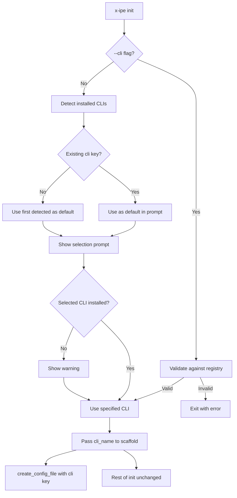

# Technical Design: CLI Init & Selection

> Feature ID: FEATURE-027-B | Version: v1.0 | Last Updated: 02-07-2026

---

## Version History

| Version | Date | Description |
|---------|------|-------------|
| v1.0 | 02-07-2026 | Initial technical design |

---

## Part 1: Agent-Facing Summary

> **Purpose:** Quick reference for AI agents navigating large projects.
> **📌 AI Coders:** Focus on this section for implementation context.

### Key Components Implemented

| Component | Responsibility | Scope/Impact | Tags |
|-----------|----------------|--------------|------|
| `init()` command update | Add `--cli` option, detection, selection prompt | Modifies existing CLI init flow | #cli #init #command |
| `ScaffoldManager.create_config_file()` update | Accept `cli_name` param to include in `.x-ipe.yaml` | Modifies existing scaffold | #scaffold #config |

### Dependencies

| Dependency | Source | Design Link | Usage Description |
|------------|--------|-------------|-------------------|
| `CLIAdapterService` | FEATURE-027-A | [technical-design.md](../FEATURE-027-A/technical-design.md) | `detect_installed_clis()`, `list_adapters()` for detection and selection |
| `ScaffoldManager` | Foundation | `src/x_ipe/core/scaffold.py` | Extended to accept CLI name for config file |
| Click | External | pyproject.toml | `click.prompt` with `click.Choice` for CLI selection |

### Major Flow

1. User runs `x-ipe init [--cli NAME]`
2. If `--cli` provided → validate against registry → use it
3. Else → detect installed CLIs → check existing `.x-ipe.yaml` `cli` key → present `click.prompt` with choices → user selects
4. Selected CLI name passed to `scaffold.create_config_file(cli_name=selected)`
5. Rest of init flow unchanged

### Usage Example

```bash
# Auto-detect and prompt
x-ipe init

# Non-interactive (CI/CD)
x-ipe init --cli opencode

# Dry run shows selection
x-ipe init --dry-run --cli claude-code
```

---

## Part 2: Implementation Guide

### Workflow Diagram



### Changes to `src/x_ipe/cli/main.py`

Add `--cli` option to init command and insert detection/selection logic before scaffold operations:

```python
@cli.command()
@click.option("--force", "-f", is_flag=True, help="Overwrite existing files.")
@click.option("--dry-run", "-n", is_flag=True, help="Show what would be done.")
@click.option("--no-skills", is_flag=True, help="Skip copying skills.")
@click.option("--no-mcp", is_flag=True, help="Skip MCP config merge.")
@click.option("--cli", "cli_name", default=None, help="CLI to use (copilot, opencode, claude-code).")
@click.pass_context
def init(ctx, force, dry_run, no_skills, no_mcp, cli_name):
    # ... existing preamble ...
    
    # CLI Detection & Selection (FEATURE-027-B)
    selected_cli = _resolve_cli_selection(project_root, cli_name)
    
    # ... existing scaffold operations ...
    # Pass selected_cli to create_config_file
    scaffold.create_config_file(cli_name=selected_cli)
```

New helper function:

```python
def _resolve_cli_selection(project_root: Path, cli_flag: Optional[str]) -> str:
    """Resolve CLI selection through flag, config, detection, or prompt."""
    from x_ipe.services.cli_adapter_service import CLIAdapterService
    
    service = CLIAdapterService()
    adapters = service.list_adapters()
    adapter_names = [a.name for a in adapters]
    
    # --cli flag: validate and return immediately
    if cli_flag:
        if cli_flag not in adapter_names:
            available = ', '.join(adapter_names)
            raise click.BadParameter(f"Unknown CLI '{cli_flag}'. Available: {available}")
        if not service.is_installed(cli_flag):
            click.echo(f"⚠ Warning: '{cli_flag}' is not installed on this system.")
        return cli_flag
    
    # Detect installed CLIs
    installed = service.detect_installed_clis()
    
    # Determine default
    existing_cli = _read_existing_cli(project_root)
    if existing_cli and existing_cli in adapter_names:
        default = existing_cli
    elif installed:
        default = installed[0]  # Priority order from detect
    else:
        click.echo("ℹ No supported CLI detected. Defaulting to copilot.")
        default = "copilot"
    
    # Show detected info
    if installed:
        display = ', '.join(installed)
        click.echo(f"Detected CLI(s): {display}")
    
    # Prompt
    selected = click.prompt(
        "Select CLI",
        type=click.Choice(adapter_names, case_sensitive=False),
        default=default,
    )
    
    if selected not in installed:
        click.echo(f"⚠ Warning: '{selected}' is not installed on this system.")
    
    return selected
```

### Changes to `src/x_ipe/core/scaffold.py`

Update `create_config_file()` signature to accept `cli_name`:

```python
def create_config_file(self, config_content: Optional[str] = None, cli_name: Optional[str] = None) -> None:
    # ... existing logic ...
    # Add cli key to default content if cli_name provided
    if cli_name:
        default_content += f"\ncli: \"{cli_name}\"\n"
```

### Implementation Steps

1. **scaffold.py:** Add `cli_name` parameter to `create_config_file()`, append `cli` key to YAML content
2. **main.py:** Add `--cli` option to `init` command, add `_resolve_cli_selection()` helper, add `_read_existing_cli()` helper
3. **main.py:** Replace `scaffold.create_config_file()` call with `scaffold.create_config_file(cli_name=selected_cli)`
4. **main.py:** Remove hardcoded `scaffold.copy_copilot_instructions()` call — replace with adapter-aware call (or keep for now, FEATURE-027-C handles translation)

### Edge Cases & Error Handling

| Scenario | Expected Behavior |
|----------|------------------|
| `--cli unknown` | `click.BadParameter` raised, lists available adapters |
| No CLIs installed | Notice displayed, copilot used as default |
| Existing `.x-ipe.yaml` with `cli: opencode` | opencode is default in prompt |
| `--dry-run` | Selection shown but not written to config |
| `--cli` + `--dry-run` | Both flags honored |

### File Summary

| File | Action | ~Lines Changed |
|------|--------|--------|
| `src/x_ipe/cli/main.py` | Modify | +50 |
| `src/x_ipe/core/scaffold.py` | Modify | +5 |

---

## Design Change Log

| Date | Phase | Change Summary |
|------|-------|----------------|
| 02-07-2026 | Initial Design | 2 files modified: init command gets --cli option + detection/selection flow; scaffold gets cli_name parameter for config file. |
