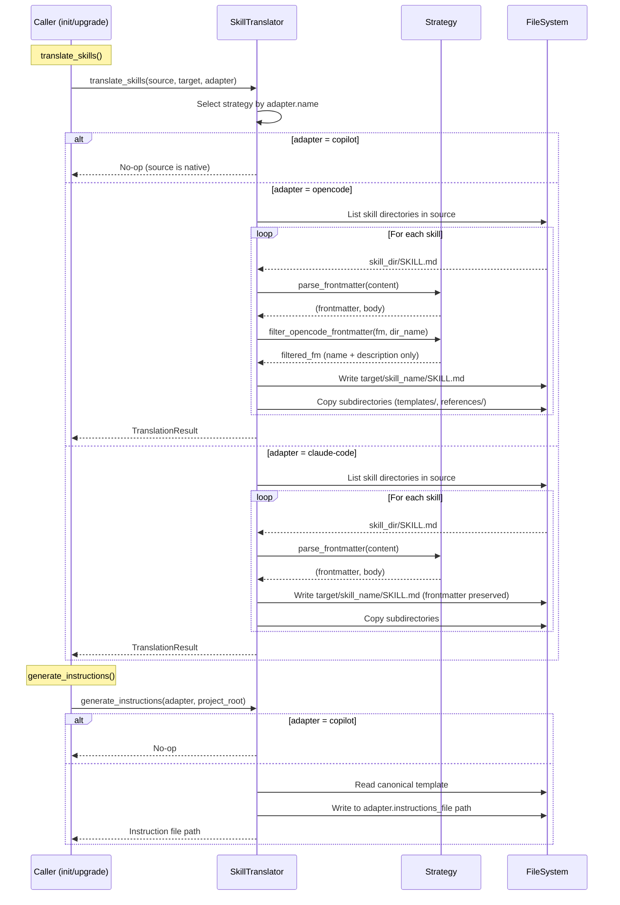
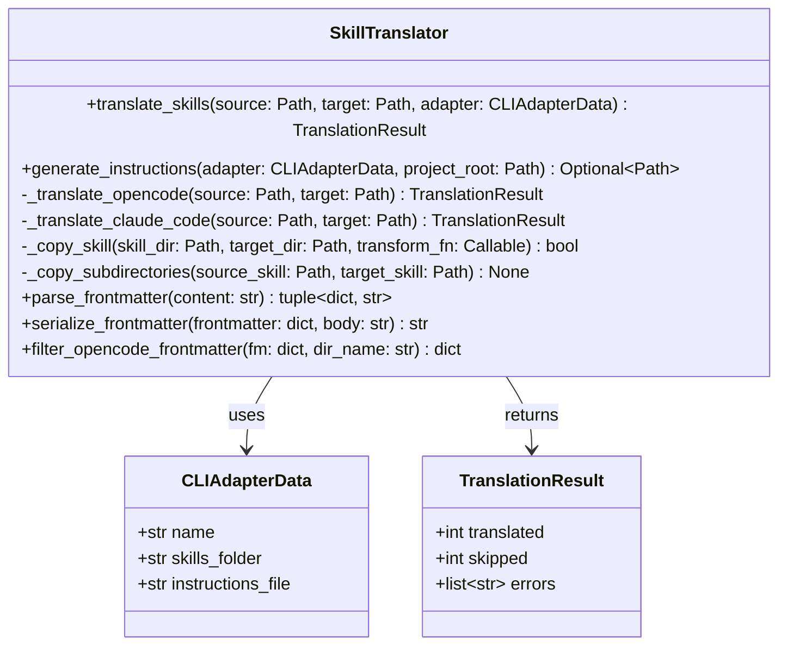

# Technical Design: Skill & Instruction Translation

> Feature ID: FEATURE-027-C | Version: v1.0 | Last Updated: 02-07-2026

---

## Version History

| Version | Date | Description |
|---------|------|-------------|
| v1.0 | 02-07-2026 | Initial technical design |

---

## Part 1: Agent-Facing Summary

> **Purpose:** Quick reference for AI agents navigating large projects.
> **📌 AI Coders:** Focus on this section for implementation context.

### Key Components Implemented

| Component | Responsibility | Scope/Impact | Tags |
|-----------|----------------|--------------|------|
| `SkillTranslator` | Translate canonical skills and generate instruction files for each CLI adapter | Core service for FEATURE-027-C; consumed by init/upgrade commands | #cli #skills #translation #service |
| `TranslationStrategy` | Per-adapter translation logic (no-op, filter, preserve) | Strategy functions dispatched by adapter name | #cli #strategy #frontmatter |
| `instructions-template.md` | Canonical instruction template for generating AGENTS.md / CLAUDE.md | Bundled resource template | #cli #instructions #template |

### Dependencies

| Dependency | Source | Design Link | Usage Description |
|------------|--------|-------------|-------------------|
| `CLIAdapterData` | FEATURE-027-A | [technical-design.md](../FEATURE-027-A/technical-design.md) | Provides `skills_folder`, `instructions_file`, and adapter `name` for strategy dispatch |
| `CLIAdapterService` | FEATURE-027-A | [technical-design.md](../FEATURE-027-A/technical-design.md) | Used to resolve active adapter when caller doesn't provide one |
| PyYAML | External | pyproject.toml | Parses SKILL.md frontmatter YAML blocks |
| `shutil` / `pathlib` | stdlib | — | Directory copying and path manipulation |

### Major Flow

1. Caller invokes `translate_skills(source_dir, target_dir, adapter)` → service checks adapter name → dispatches to strategy function
2. For `copilot` → no-op (return immediately, source is native format)
3. For `opencode` → iterate skills in source_dir → parse frontmatter → keep only `name`+`description` → write to `.opencode/skills/<name>/SKILL.md` + copy subdirs
4. For `claude-code` → iterate skills in source_dir → preserve frontmatter as-is → write to `.claude/skills/<name>/SKILL.md` + copy subdirs
5. `generate_instructions(adapter, project_root)` → read canonical template → write to adapter's `instructions_file` path (e.g., `AGENTS.md` or `CLAUDE.md`)

### Usage Example

```python
from x_ipe.services.skill_translator import SkillTranslator
from x_ipe.services.cli_adapter_service import CLIAdapterService

# Initialize
service = CLIAdapterService()
translator = SkillTranslator()

# Get adapter
adapter = service.get_active_adapter()

# Translate all skills
project_root = Path("/path/to/project")
source = project_root / ".github" / "skills"
target = project_root / adapter.skills_folder

result = translator.translate_skills(source, target, adapter)
# → TranslationResult(translated=46, skipped=0, errors=[])

# Generate instruction file
translator.generate_instructions(adapter, project_root)
# → Creates AGENTS.md or CLAUDE.md at project root
```

---

## Part 2: Implementation Guide

> **Purpose:** Human-readable details for developers.
> **📌 Emphasis on visual diagrams for comprehension.**

### Workflow Diagram



### Class Diagram



### Data Models

```python
@dataclass
class TranslationResult:
    """Result of a skill translation operation."""
    translated: int = 0
    skipped: int = 0
    errors: list[str] = field(default_factory=list)
```

### Service Implementation

**File:** `src/x_ipe/services/skill_translator.py`

```python
"""
FEATURE-027-C: Skill & Instruction Translation

SkillTranslator: Translate canonical X-IPE skills to CLI-specific formats.
"""
import logging
import shutil
import yaml
from dataclasses import dataclass, field
from pathlib import Path
from typing import Optional, Callable

from x_ipe.tracing import x_ipe_tracing

logger = logging.getLogger(__name__)

INSTRUCTIONS_TEMPLATE = 'instructions-template.md'


@dataclass
class TranslationResult:
    """Result of a skill translation operation."""
    translated: int = 0
    skipped: int = 0
    errors: list[str] = field(default_factory=list)


class SkillTranslator:
    """
    Translate canonical X-IPE skills to CLI-specific formats.

    FEATURE-027-C: Skill & Instruction Translation

    Works outside Flask context (CLI commands).
    Follows CLIAdapterService pattern: stateless methods, @x_ipe_tracing.
    """

    @x_ipe_tracing()
    def translate_skills(
        self,
        source: Path,
        target: Path,
        adapter,  # CLIAdapterData
    ) -> TranslationResult:
        """Translate all skills from source to target using adapter strategy."""
        if adapter.name == 'copilot':
            return TranslationResult()  # No-op

        if not source.exists() or not source.is_dir():
            logger.warning(f"Source skills directory not found: {source}")
            return TranslationResult()

        if adapter.name == 'opencode':
            return self._translate_opencode(source, target)
        elif adapter.name == 'claude-code':
            return self._translate_claude_code(source, target)
        else:
            # Unknown adapter — fall back to copy-as-is
            return self._translate_claude_code(source, target)

    @x_ipe_tracing()
    def generate_instructions(
        self,
        adapter,  # CLIAdapterData
        project_root: Path,
        template_path: Optional[Path] = None,
    ) -> Optional[Path]:
        """Generate CLI-specific instruction file from canonical template."""
        if adapter.name == 'copilot':
            return None  # No-op

        if template_path is None:
            template_path = (
                Path(__file__).parent.parent
                / 'resources' / 'templates' / INSTRUCTIONS_TEMPLATE
            )

        if not template_path.exists():
            logger.error(f"Instructions template not found: {template_path}")
            return None

        content = template_path.read_text(encoding='utf-8')
        target_path = project_root / adapter.instructions_file
        target_path.parent.mkdir(parents=True, exist_ok=True)
        target_path.write_text(content, encoding='utf-8')
        return target_path

    @x_ipe_tracing()
    def _translate_opencode(self, source: Path, target: Path) -> TranslationResult:
        """Translate skills for OpenCode: filter frontmatter to name+description."""
        return self._translate_with_strategy(
            source, target, self.filter_opencode_frontmatter
        )

    @x_ipe_tracing()
    def _translate_claude_code(self, source: Path, target: Path) -> TranslationResult:
        """Translate skills for Claude Code: preserve frontmatter as-is."""
        return self._translate_with_strategy(source, target, None)

    def _translate_with_strategy(
        self,
        source: Path,
        target: Path,
        transform_fn: Optional[Callable],
    ) -> TranslationResult:
        """Iterate skills and apply optional frontmatter transformation."""
        result = TranslationResult()

        for skill_dir in sorted(source.iterdir()):
            if not skill_dir.is_dir():
                continue

            skill_md = skill_dir / 'SKILL.md'
            if not skill_md.exists():
                continue

            try:
                self._copy_skill(skill_dir, target, transform_fn)
                result.translated += 1
            except Exception as e:
                msg = f"Failed to translate skill '{skill_dir.name}': {e}"
                logger.warning(msg)
                result.errors.append(msg)

        return result

    def _copy_skill(
        self,
        skill_dir: Path,
        target_base: Path,
        transform_fn: Optional[Callable],
    ) -> None:
        """Copy a single skill directory, optionally transforming frontmatter."""
        skill_name = skill_dir.name
        target_skill = target_base / skill_name
        target_skill.mkdir(parents=True, exist_ok=True)

        # Process SKILL.md
        skill_md = skill_dir / 'SKILL.md'
        content = skill_md.read_text(encoding='utf-8')

        if transform_fn:
            frontmatter, body = self.parse_frontmatter(content)
            transformed = transform_fn(frontmatter, skill_name)
            content = self.serialize_frontmatter(transformed, body)

        (target_skill / 'SKILL.md').write_text(content, encoding='utf-8')

        # Copy subdirectories and non-SKILL.md files
        self._copy_subdirectories(skill_dir, target_skill)

    def _copy_subdirectories(self, source_skill: Path, target_skill: Path) -> None:
        """Copy all files/subdirs except SKILL.md from source to target."""
        for item in source_skill.iterdir():
            if item.name == 'SKILL.md':
                continue
            dest = target_skill / item.name
            if item.is_dir():
                shutil.copytree(item, dest, dirs_exist_ok=True)
            else:
                shutil.copy2(item, dest)

    @staticmethod
    def parse_frontmatter(content: str) -> tuple[dict, str]:
        """Parse YAML frontmatter from markdown content."""
        if not content.startswith('---'):
            return {}, content

        parts = content.split('---', 2)
        if len(parts) < 3:
            return {}, content

        try:
            fm = yaml.safe_load(parts[1]) or {}
        except yaml.YAMLError:
            fm = {}

        body = parts[2]
        return fm, body

    @staticmethod
    def serialize_frontmatter(frontmatter: dict, body: str) -> str:
        """Serialize frontmatter dict + body back to markdown."""
        if not frontmatter:
            return body.lstrip('\n')

        fm_str = yaml.safe_dump(
            frontmatter, default_flow_style=False, allow_unicode=True
        ).strip()
        return f"---\n{fm_str}\n---{body}"

    @staticmethod
    def filter_opencode_frontmatter(frontmatter: dict, dir_name: str) -> dict:
        """Filter frontmatter to OpenCode-compatible fields (name + description)."""
        result = {}
        result['name'] = frontmatter.get('name', dir_name)
        if 'description' in frontmatter:
            result['description'] = frontmatter['description']
        return result
```

### Canonical Instructions Template

**File:** `src/x_ipe/resources/templates/instructions-template.md`

This file is a copy of `.github/copilot-instructions.md` used as the canonical template. During `generate_instructions()`, it's written to the adapter's `instructions_file` path:
- OpenCode → `AGENTS.md` at project root
- Claude Code → `CLAUDE.md` at project root

The template content is CLI-agnostic — it contains X-IPE workflow instructions that work across all CLIs.

### Frontmatter Translation Examples

**Source (canonical):**
```yaml
---
name: x-ipe-task-based-bug-fix
description: Diagnose and fix bugs in existing code.
---
```

**OpenCode output (filtered):**
```yaml
---
description: Diagnose and fix bugs in existing code.
name: x-ipe-task-based-bug-fix
---
```

**Claude Code output (preserved as-is):**
```yaml
---
name: x-ipe-task-based-bug-fix
description: Diagnose and fix bugs in existing code.
---
```

**Source with extra fields:**
```yaml
---
name: frontend-design
description: Create distinctive frontend interfaces.
extra_field: some_value
category: tool
---
```

**OpenCode output (extra fields dropped):**
```yaml
---
description: Create distinctive frontend interfaces.
name: frontend-design
---
```

**Claude Code output (all fields preserved):**
```yaml
---
name: frontend-design
description: Create distinctive frontend interfaces.
extra_field: some_value
category: tool
---
```

### Implementation Steps

1. **Service Layer:** Create `src/x_ipe/services/skill_translator.py` with `SkillTranslator` class and `TranslationResult` dataclass
2. **Template:** Create `src/x_ipe/resources/templates/instructions-template.md` (copy from `.github/copilot-instructions.md`)
3. **Exports:** Update `src/x_ipe/services/__init__.py` to export `SkillTranslator`, `TranslationResult`

### Edge Cases & Error Handling

| Scenario | Expected Behavior |
|----------|------------------|
| Copilot adapter selected | No-op — return empty `TranslationResult` |
| Source directory doesn't exist | Log warning, return empty result |
| Source directory is empty | No-op, return empty result |
| Skill has no `SKILL.md` | Skip directory silently |
| Skill has no frontmatter | For OpenCode: generate minimal `{name: dir_name}`. For Claude Code: copy body as-is |
| Skill has empty frontmatter | Same as no frontmatter |
| Skill has malformed YAML | Log warning, skip that skill, continue with others |
| Target directory already exists | Overwrite files (idempotent via `dirs_exist_ok=True`) |
| Instructions template missing | Log error, skip instruction generation |
| Skill contains non-markdown files | Copy all files regardless of type |
| Unknown adapter name | Fall back to Claude Code strategy (preserve as-is) |

### File Summary

| File | Action | ~Lines |
|------|--------|--------|
| `src/x_ipe/services/skill_translator.py` | Create | ~200 |
| `src/x_ipe/resources/templates/instructions-template.md` | Create | ~200 (copy of copilot-instructions.md) |
| `src/x_ipe/services/__init__.py` | Modify | +3 |

---

## Design Change Log

| Date | Phase | Change Summary |
|------|-------|----------------|
| 02-07-2026 | Initial Design | Initial technical design. 3 components: SkillTranslator service, TranslationResult dataclass, instructions-template.md. Strategy pattern for per-adapter translation. Follows CLIAdapterService pattern with @x_ipe_tracing. |
