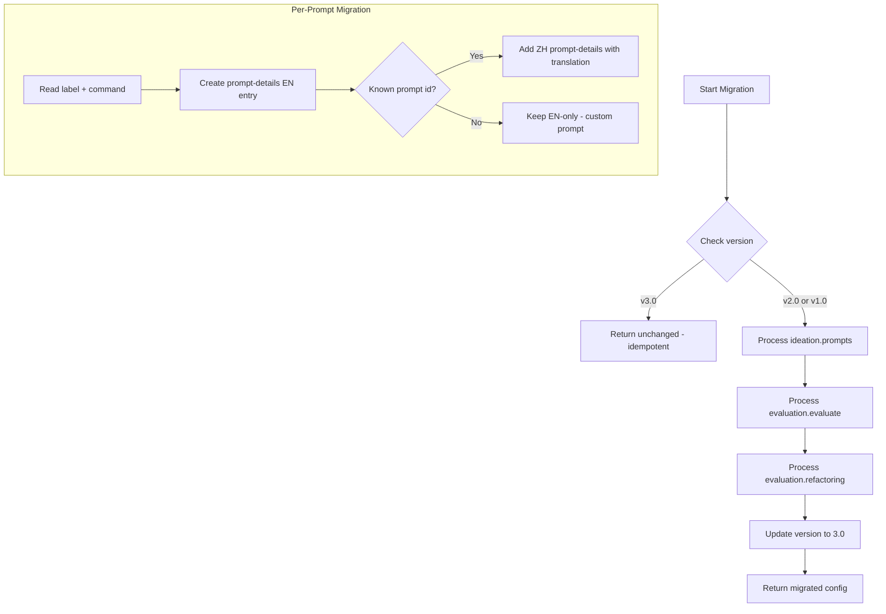
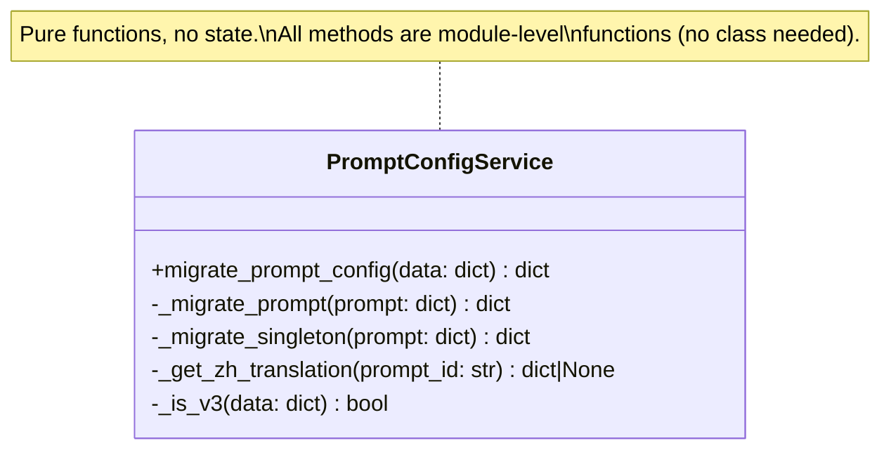

# Technical Design: Bilingual Prompt Schema & Migration

> Feature ID: FEATURE-028-A | Version: v1.0 | Last Updated: 02-11-2026

---

## Part 1: Agent-Facing Summary

> **Purpose:** Quick reference for AI agents navigating large projects.
> **📌 AI Coders:** Focus on this section for implementation context.

### Key Components Implemented

| Component | Responsibility | Scope/Impact | Tags |
|-----------|----------------|--------------|------|
| `copilot-prompt.json` (v3.0 template) | Bilingual prompt definitions | Package resource template | #config #bilingual #prompt #schema |
| `prompt_config_service.py` | v2.0→v3.0 migration utility | Migration logic for upgrade | #migration #service #prompt |
| `tools_routes.py` (modified) | Serve prompt config with backward compat | API route | #api #route #backward-compat |

### Dependencies

| Dependency | Source | Design Link | Usage Description |
|------------|--------|-------------|-------------------|
| `tools_routes.py` | Existing | - | Modified to handle both v2.0 and v3.0 formats |
| `scaffold.py` | Existing | - | `copy_config_files()` copies v3.0 template to project |

### Major Flow

1. Package ships v3.0 `copilot-prompt.json` template with `prompt-details[]` arrays containing EN + ZH entries
2. `x-ipe init` scaffolds the v3.0 template into `x-ipe-docs/config/copilot-prompt.json` (unchanged scaffolding flow)
3. `x-ipe upgrade` calls `migrate_prompt_config(data)` to convert existing v2.0 → v3.0
4. API route serves JSON as-is (no server-side filtering — client handles language selection)

### Usage Example

```python
from x_ipe.services.prompt_config_service import migrate_prompt_config

# Load existing v2.0 config
with open("x-ipe-docs/config/copilot-prompt.json") as f:
    data = json.load(f)

# Migrate to v3.0
migrated = migrate_prompt_config(data)
# migrated["version"] == "3.0"
# migrated["ideation"]["prompts"][0]["prompt-details"] == [
#   {"language": "en", "label": "Generate Architecture", "command": "..."},
#   {"language": "zh", "label": "生成架构图", "command": "..."}
# ]

# Write back
with open("x-ipe-docs/config/copilot-prompt.json", "w") as f:
    json.dump(migrated, f, indent=2, ensure_ascii=False)
```

---

## Part 2: Implementation Guide

> **Purpose:** Human-readable details for developers.
> **📌 Emphasis on visual diagrams for comprehension.**

### Workflow Diagram



### Class Diagram



### v3.0 JSON Schema

```json
{
  "version": "3.0",
  "ideation": {
    "prompts": [
      {
        "id": "generate-architecture",
        "icon": "bi-diagram-3",
        "prompt-details": [
          {
            "language": "en",
            "label": "Generate Architecture",
            "command": "Base on <current-idea-file> to generate layered architecture"
          },
          {
            "language": "zh",
            "label": "生成架构图",
            "command": "基于<current-idea-file>生成分层架构图"
          }
        ]
      }
    ]
  },
  "evaluation": {
    "evaluate": {
      "id": "evaluate",
      "icon": "bi-clipboard-check",
      "prompt-details": [
        {
          "language": "en",
          "label": "Evaluate Project Quality",
          "command": "Evaluate project quality and generate report"
        },
        {
          "language": "zh",
          "label": "评估项目质量",
          "command": "评估项目质量并生成报告"
        }
      ]
    },
    "refactoring": [
      {
        "id": "refactor-all",
        "icon": "bi-arrow-repeat",
        "prompt-details": [
          {
            "language": "en",
            "label": "Refactor All",
            "command": "Refactor all with reference to its code and <evaluation-file>"
          },
          {
            "language": "zh",
            "label": "全面重构",
            "command": "参照代码和<evaluation-file>进行全面重构"
          }
        ]
      }
    ]
  },
  "placeholder": {
    "current-idea-file": "Replaced with currently open file path",
    "evaluation-file": "x-ipe-docs/quality-evaluation/project-quality-evaluation.md"
  }
}
```

### Data Model: Prompt Object (v3.0)

```
prompt = {
  "id": string,           // language-neutral identifier (REQUIRED)
  "icon": string,         // Bootstrap icon class (REQUIRED)
  "prompt-details": [     // REQUIRED in v3.0
    {
      "language": "en" | "zh",
      "label": string,    // display text
      "command": string   // AI agent instruction (may contain <placeholders>)
    }
  ]
}
```

**Key constraints:**
- `label` does NOT exist at prompt level — only inside `prompt-details`
- `id` and `icon` are language-neutral, stay at prompt level
- `placeholder` section is language-neutral, unchanged

### Chinese Translations Table

| Prompt ID | EN Label | ZH Label | EN Command (summary) | ZH Command (summary) |
|-----------|----------|----------|---------------------|---------------------|
| generate-architecture | Generate Architecture | 生成架构图 | Base on \<current-idea-file\> to generate layered architecture | 基于\<current-idea-file\>生成分层架构图 |
| idea-reflection | Idea Reflection | 创意反思 | Extract key points... create sub-agent... give feedback | 提取\<current-idea-file\>中的关键点...创建子代理...给出反馈...改进 |
| generate-mockup | Generate Mockup | 生成原型 | Base on \<current-idea-file\> to generate mockups | 基于\<current-idea-file\>生成原型设计 |
| free-question | Free Collaboration | 自由协作 | Let's base on \<current-idea-file\> to collaborate | 基于\<current-idea-file\>进行协作，等待我的指示 |
| evaluate | Evaluate Project Quality | 评估项目质量 | Evaluate project quality and generate report | 评估项目质量并生成报告 |
| refactor-all | Refactor All | 全面重构 | Refactor all with reference to code and \<evaluation-file\> | 参照代码和\<evaluation-file\>进行全面重构 |
| refactor-requirements | Align Requirements to Features | 对齐需求与功能 | Update requirement docs to match feature spec | 更新需求文档以匹配当前功能规范 |
| refactor-features | Align Features to Code | 对齐功能与代码 | Update feature spec to match code | 更新功能规范以匹配当前代码实现 |
| refactor-tests | Align Tests to Code | 对齐测试与代码 | Update test cases to match code and \<evaluation-file\> | 更新测试用例以匹配当前代码实现，参照\<evaluation-file\> |
| refactor-tracing-tests | Align Tracing + Tests to Features | 对齐追踪与测试 | Update tracing decorators and tests | 更新追踪装饰器和测试以匹配当前功能规范 |
| refactor-code-tests | Refactor Code + Tracing + Tests | 重构代码+追踪+测试 | Refactor code and tests to match spec | 重构代码和测试以匹配当前功能规范，参照\<evaluation-file\> |

### Implementation Steps

1. **Service Layer:** Create `src/x_ipe/services/prompt_config_service.py`
   - `migrate_prompt_config(data: dict) -> dict` — main entry point
   - `_migrate_prompt(prompt: dict) -> dict` — wraps a single prompt's label/command into prompt-details
   - `_migrate_singleton(prompt: dict) -> dict` — handles evaluate singleton (adds `id` if missing)
   - `_get_zh_translation(prompt_id: str) -> dict | None` — returns `{label, command}` for known prompts
   - `ZH_TRANSLATIONS: dict` — static mapping of prompt_id → {label, command} for Chinese

2. **Resource Layer:** Update `src/x_ipe/resources/config/copilot-prompt.json`
   - Replace v2.0 content with v3.0 schema (full bilingual template)

3. **Route Layer:** No changes needed — `tools_routes.py` already serves JSON as-is

### Migration Logic (Pseudocode)

```python
def migrate_prompt_config(data: dict) -> dict:
    if data.get("version") == "3.0":
        return data  # idempotent

    result = copy.deepcopy(data)

    # Migrate ideation.prompts[]
    if "ideation" in result and "prompts" in result["ideation"]:
        result["ideation"]["prompts"] = [
            _migrate_prompt(p) for p in result["ideation"]["prompts"]
        ]

    # Migrate evaluation.evaluate (singleton)
    if "evaluation" in result and "evaluate" in result["evaluation"]:
        result["evaluation"]["evaluate"] = _migrate_singleton(
            result["evaluation"]["evaluate"]
        )

    # Migrate evaluation.refactoring[]
    if "evaluation" in result and "refactoring" in result["evaluation"]:
        result["evaluation"]["refactoring"] = [
            _migrate_prompt(p) for p in result["evaluation"]["refactoring"]
        ]

    # Handle v1.0 legacy (data.prompts → data.ideation.prompts)
    if "prompts" in result and "ideation" not in result:
        result["ideation"] = {"prompts": [
            _migrate_prompt(p) for p in result["prompts"]
        ]}
        del result["prompts"]

    result["version"] = "3.0"
    return result


def _migrate_prompt(prompt: dict) -> dict:
    if "prompt-details" in prompt:
        return prompt  # already migrated

    en_entry = {"language": "en", "label": prompt.pop("label"), "command": prompt.pop("command")}
    prompt["prompt-details"] = [en_entry]

    zh = _get_zh_translation(prompt.get("id", ""))
    if zh:
        prompt["prompt-details"].append({"language": "zh", **zh})

    return prompt
```

### Edge Cases & Error Handling

| Scenario | Expected Behavior |
|----------|-------------------|
| v3.0 file passed to migration | Return unchanged (idempotent) |
| v2.0 with user-added custom prompts | Wrap as EN-only (no ZH translation) |
| v1.0 legacy format (`data.prompts`) | Move to `data.ideation.prompts`, then migrate |
| `evaluate` singleton missing `id` | Add `"id": "evaluate"` during migration |
| Malformed JSON (non-dict) | Raise `ValueError` with clear message |
| Empty prompts array | Produce empty array with version bump |

### File Changes Summary

| File | Action | Description |
|------|--------|-------------|
| `src/x_ipe/services/prompt_config_service.py` | CREATE | Migration utility (~120 lines) |
| `src/x_ipe/resources/config/copilot-prompt.json` | UPDATE | Replace v2.0 with v3.0 bilingual template |
| `x-ipe-docs/config/copilot-prompt.json` | N/A | Migrated at upgrade time by FEATURE-028-B |

---

## Design Change Log

| Date | Phase | Change Summary |
|------|-------|----------------|
| 02-11-2026 | Initial Design | Initial technical design created. v3.0 schema with prompt-details array, migration utility as pure functions, Chinese translation table for all 11 known prompts. |
