# Technical Design: CLI Language Selection & Instructions

> Feature ID: FEATURE-028-B | Version: v1.0 | Last Updated: 02-11-2026

---

## Part 1: Agent-Facing Summary

> **Purpose:** Quick reference for AI agents navigating large projects.
> **📌 AI Coders:** Focus on this section for implementation context.

### Key Components Implemented

| Component | Responsibility | Scope/Impact | Tags |
|-----------|----------------|--------------|------|
| `main.py` (init command) | Add `--lang` option, language prompt | CLI init flow | #cli #init #language |
| `main.py` (upgrade command) | Add `--lang` option for language switching | CLI upgrade flow | #cli #upgrade #language |
| `scaffold.py` | Language-aware config + instructions extraction | Scaffolding | #scaffold #instructions #extraction |
| `copilot-instructions.md` (template) | Bilingual template with `---LANG:xx---` markers | Package resource | #template #bilingual #instructions |
| `prompt_config_service.py` | `extract_language_section()` utility | Reusable extraction | #utility #language #extraction |

### Dependencies

| Dependency | Source | Design Link | Usage Description |
|------------|--------|-------------|-------------------|
| `prompt_config_service.py` | FEATURE-028-A | [technical-design.md](../FEATURE-028-A/technical-design.md) | Reuse module for language extraction utility |
| `copilot-prompt.json` v3.0 | FEATURE-028-A | [technical-design.md](../FEATURE-028-A/technical-design.md) | Init scaffolds v3.0 template |
| `cli_adapter_service.py` | Existing | - | CLI adapter resolution for instructions path |
| `skill_translator.py` | Existing | - | Non-copilot CLI instructions generation |

### Major Flow

1. `x-ipe init` → CLI detection → **language prompt** → scaffold structure → extract language section from bilingual template → write instructions → create config with `language` key
2. `x-ipe upgrade --lang [zh]` → read current config → language prompt (or use inline value) → re-extract instructions → update `.x-ipe.yaml`

### Usage Example

```python
from x_ipe.services.prompt_config_service import extract_language_section

template = """
---LANG:en---
# English instructions content...

---LANG:zh---
# 中文指令内容...
"""

en_content = extract_language_section(template, "en")
# Returns: "# English instructions content..."

zh_content = extract_language_section(template, "zh")
# Returns: "# 中文指令内容..."
```

---

## Part 2: Implementation Guide

> **Purpose:** Human-readable details for developers.
> **📌 Emphasis on visual diagrams for comprehension.**

### Workflow Diagram — Init

```mermaid
sequenceDiagram
    participant U as User
    participant CLI as main.py (init)
    participant S as ScaffoldManager
    participant R as Resources

    U->>CLI: x-ipe init [--lang zh]
    CLI->>CLI: _resolve_cli_selection()
    CLI->>CLI: _resolve_language_selection(lang_arg)
    alt --lang provided
        CLI-->>CLI: Use provided language
    else interactive
        CLI->>U: Select language: English / 中文
        U-->>CLI: Selected language
    end
    CLI->>S: ScaffoldManager(project_root)
    CLI->>S: copy_copilot_instructions(cli_name, language)
    S->>R: Read bilingual template
    S->>S: extract_language_section(template, language)
    S->>S: Write extracted content to project
    CLI->>S: create_config_file(cli_name, language)
    S->>S: Write .x-ipe.yaml with language key
```



### Workflow Diagram — Upgrade --lang

```mermaid
sequenceDiagram
    participant U as User
    participant CLI as main.py (upgrade)
    participant S as ScaffoldManager
    participant C as .x-ipe.yaml

    U->>CLI: x-ipe upgrade --lang [zh]
    CLI->>C: Read current config
    alt --lang has value
        CLI-->>CLI: Use provided language
    else --lang without value
        CLI->>U: Select language: English / 中文
        U-->>CLI: Selected language
    end
    CLI->>S: copy_copilot_instructions(cli_name, language)
    Note over S: Force-overwrite X-IPE section
    CLI->>C: Update language key in .x-ipe.yaml
```



### CLI Commands Specification

#### `x-ipe init`

New option:
```
--lang <en|zh>    Language for instructions (default: interactive prompt)
```

Interactive prompt (when `--lang` not provided):
```
? Select language for copilot instructions:
❯ English (default)
  中文 (Chinese)
```

#### `x-ipe upgrade --lang`

New option:
```
--lang [<en|zh>]  Switch language. Without value: interactive prompt.
                  With value: direct selection.
```

### Language Extraction Utility

```python
def extract_language_section(template: str, language: str) -> str:
    """Extract content for a specific language from a bilingual template.
    
    Args:
        template: Full template with ---LANG:xx--- markers
        language: Target language code ("en" or "zh")
        
    Returns:
        Extracted content (without the marker line)
        
    Behavior:
        - Finds ---LANG:{language}--- marker
        - Returns content from after the marker to the next ---LANG: marker or EOF
        - If no markers found, returns full template (backward compat)
        - Strips leading/trailing whitespace from result
    """
    marker = f"---LANG:{language}---"
    lines = template.split("\n")
    
    collecting = False
    result = []
    for line in lines:
        if line.strip() == marker:
            collecting = True
            continue
        elif line.strip().startswith("---LANG:") and collecting:
            break
        elif collecting:
            result.append(line)
    
    if not result:
        # No marker found — return full template (backward compat)
        return template.strip()
    
    return "\n".join(result).strip()
```

### Bilingual Template Structure

The file `src/x_ipe/resources/copilot-instructions.md` will have this structure:

```markdown
---LANG:en---
# Copilot Instructions

## Before You Start
[... full EN instructions ...]

## Task-Based Skill Identification
[... EN skill matching ...]

---LANG:zh---
# Copilot 指令

## 开始之前
[... full ZH instructions ...]

## 任务技能匹配

### 中文关键词映射
以下中文关键词会匹配到对应的任务技能：
- "优化创意"、"头脑风暴"、"完善想法" → x-ipe-task-based-ideation-v2
- "修复缺陷"、"修复Bug" → x-ipe-task-based-bug-fix
- "实现功能"、"编写代码" → x-ipe-task-based-code-implementation
- "重构代码" → x-ipe-task-based-code-refactor
- "细化需求"、"详细规范" → x-ipe-task-based-feature-refinement
- "技术设计"、"架构设计" → x-ipe-task-based-technical-design
- "收集需求"、"需求分析" → x-ipe-task-based-requirement-gathering
- "分解功能" → x-ipe-task-based-feature-breakdown
[... etc ...]
```

### Implementation Steps

1. **Service Layer:** Add `extract_language_section()` to `src/x_ipe/services/prompt_config_service.py`
   - Pure function, no I/O, easily testable

2. **Resource Layer:** Update `src/x_ipe/resources/copilot-instructions.md`
   - Wrap existing EN content with `---LANG:en---` marker
   - Add `---LANG:zh---` section with full Chinese translation
   - ZH section includes skill keyword mapping table

3. **CLI Layer — Init:** Modify `src/x_ipe/cli/main.py`
   - Add `--lang` option to `init` command
   - Add `_resolve_language_selection(lang_arg)` helper (similar to `_resolve_cli_selection`)
   - Pass `language` to `scaffold.copy_copilot_instructions()` and `scaffold.create_config_file()`

4. **CLI Layer — Upgrade:** Modify `src/x_ipe/cli/main.py`
   - Add `--lang` option to `upgrade` command
   - When `--lang` is used: prompt for language, update `.x-ipe.yaml`, re-extract instructions

5. **Scaffold Layer:** Modify `src/x_ipe/core/scaffold.py`
   - `copy_copilot_instructions(cli_name, language="en")` — add language parameter
   - Use `extract_language_section()` before writing
   - `create_config_file(cli_name, language="en")` — add `language: "{language}"` to YAML content

### Edge Cases & Error Handling

| Scenario | Expected Behavior |
|----------|-------------------|
| `--lang xyz` (invalid) | `click.BadParameter: Invalid language 'xyz'. Supported: en, zh` |
| Template with no markers | Copy entire file as-is (backward compat) |
| `.x-ipe.yaml` missing during upgrade | Error: "Project not initialized. Run `x-ipe init` first." |
| Non-copilot CLI | Language extraction applies to generated instructions too |
| Existing instructions file | Merge behavior: overwrite X-IPE section, keep user content |

### File Changes Summary

| File | Action | Description |
|------|--------|-------------|
| `src/x_ipe/services/prompt_config_service.py` | UPDATE | Add `extract_language_section()` (~25 lines) |
| `src/x_ipe/resources/copilot-instructions.md` | UPDATE | Wrap with markers, add ZH section |
| `src/x_ipe/cli/main.py` | UPDATE | Add `--lang` to init/upgrade, add `_resolve_language_selection()` |
| `src/x_ipe/core/scaffold.py` | UPDATE | Add `language` param to `copy_copilot_instructions()` and `create_config_file()` |

---

## Design Change Log

| Date | Phase | Change Summary |
|------|-------|----------------|
| 02-11-2026 | Initial Design | Initial technical design. Language extraction utility, bilingual template with markers, --lang option for init/upgrade, scaffold modifications for language awareness. |
