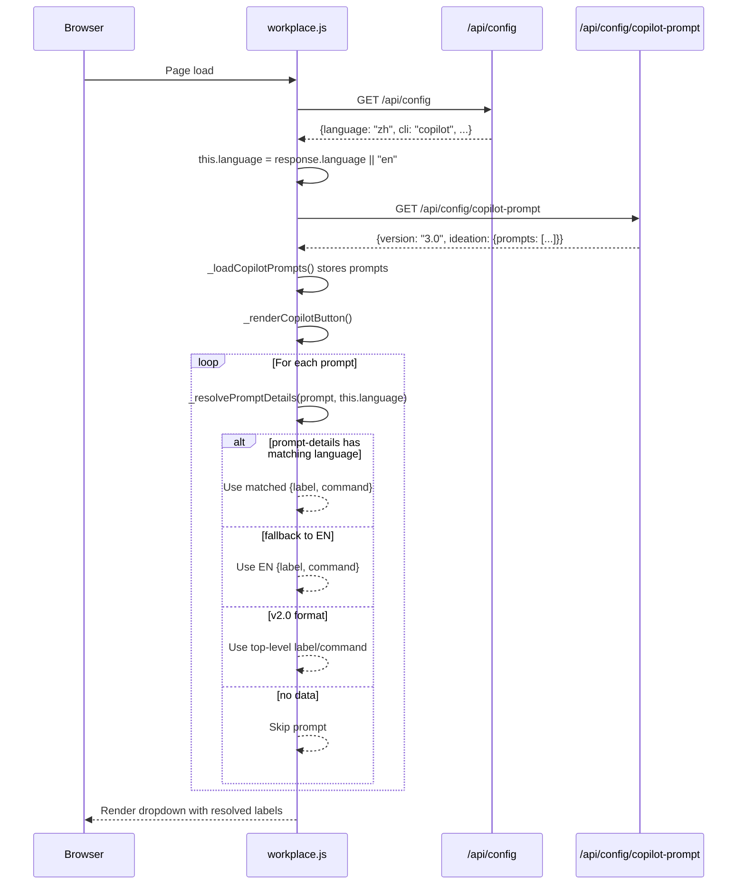
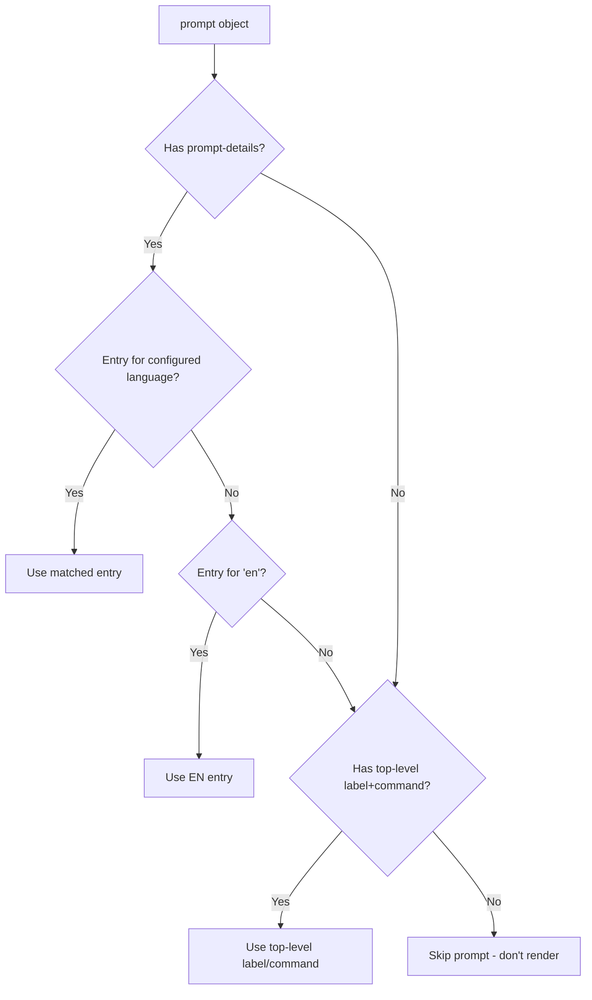

# Technical Design: Frontend Prompt Language Filtering

> Feature ID: FEATURE-028-C | Version: v1.0 | Last Updated: 02-11-2026

---

## Part 1: Agent-Facing Summary

> **Purpose:** Quick reference for AI agents navigating large projects.
> **📌 AI Coders:** Focus on this section for implementation context.

### Key Components Implemented

| Component | Responsibility | Scope/Impact | Tags |
|-----------|----------------|--------------|------|
| `workplace.js` (modified) | Language-aware prompt rendering + execution | Frontend prompt display | #frontend #prompt #language #filtering |

### Dependencies

| Dependency | Source | Design Link | Usage Description |
|------------|--------|-------------|-------------------|
| `copilot-prompt.json` v3.0 | FEATURE-028-A | [technical-design.md](../FEATURE-028-A/technical-design.md) | Provides `prompt-details` array to filter |
| `/api/config` | Existing | - | Serves `.x-ipe.yaml` including `language` field |
| FEATURE-028-B | FEATURE-028-B | [technical-design.md](../FEATURE-028-B/technical-design.md) | Stores `language` in `.x-ipe.yaml` |

### Major Flow

1. Page loads → `_loadCopilotPrompts()` fetches `/api/config/copilot-prompt` (full bilingual JSON)
2. Page also fetches `/api/config` → extracts `language` field (default: `"en"`)
3. `_renderCopilotButton()` calls `_resolvePromptDetails(prompt, language)` for each prompt
4. Helper returns `{label, command}` using fallback chain: `prompt-details[lang]` → `prompt-details["en"]` → top-level `label`/`command`
5. Button shows resolved `label`; click sends resolved `command`

### Usage Example

```javascript
// Inside Workplace class
_resolvePromptDetails(prompt, language) {
    if (prompt['prompt-details']) {
        const match = prompt['prompt-details'].find(d => d.language === language);
        if (match) return { label: match.label, command: match.command };
        const en = prompt['prompt-details'].find(d => d.language === 'en');
        if (en) return { label: en.label, command: en.command };
    }
    if (prompt.label && prompt.command) {
        return { label: prompt.label, command: prompt.command };
    }
    return null; // skip prompt
}
```

---

## Part 2: Implementation Guide

> **Purpose:** Human-readable details for developers.
> **📌 Emphasis on visual diagrams for comprehension.**

### Workflow Diagram



### Fallback Chain Flowchart



### Code Changes in `workplace.js`

#### 1. Add `_resolvePromptDetails()` method

```javascript
/**
 * Resolve label and command for a prompt based on configured language.
 * Fallback chain: prompt-details[lang] → prompt-details["en"] → top-level.
 * @param {Object} prompt - Prompt object (v2.0 or v3.0)
 * @param {string} language - Language code ("en", "zh")
 * @returns {{label: string, command: string}|null} Resolved details or null to skip
 */
_resolvePromptDetails(prompt, language) {
    if (prompt['prompt-details'] && Array.isArray(prompt['prompt-details'])) {
        const match = prompt['prompt-details'].find(d => d.language === language);
        if (match) return { label: match.label, command: match.command };
        
        const en = prompt['prompt-details'].find(d => d.language === 'en');
        if (en) return { label: en.label, command: en.command };
    }
    // v2.0 backward compat
    if (prompt.label && prompt.command) {
        return { label: prompt.label, command: prompt.command };
    }
    return null;
}
```

#### 2. Modify `_loadCopilotPrompts()` to also fetch language

```javascript
async _loadCopilotPrompts() {
    try {
        // Fetch language from config (may already be cached from settings load)
        const configResp = await fetch('/api/config');
        const configData = await configResp.json();
        this.language = configData.language || 'en';
        
        const response = await fetch('/api/config/copilot-prompt');
        const data = await response.json();
        this.copilotPrompts = data.ideation?.prompts || data.prompts || [];
    } catch (err) {
        console.warn('Failed to load copilot prompts:', err);
        this.copilotPrompts = [];
        this.language = 'en';
    }
}
```

#### 3. Modify `_renderCopilotButton()` to use resolved labels

In the prompt mapping loop, replace direct `prompt.label` access:

```javascript
// Before (v2.0):
// const label = prompt.label;
// After (v3.0 + fallback):
const resolved = this._resolvePromptDetails(prompt, this.language);
if (!resolved) return ''; // skip unresolvable prompts
const label = resolved.label;
```

#### 4. Modify `_handleCopilotPromptClick()` to use resolved command

```javascript
// Before (v2.0):
// const command = prompt.command;
// After (v3.0 + fallback):
const resolved = this._resolvePromptDetails(prompt, this.language);
if (!resolved) return;
const command = resolved.command;
```

### Implementation Steps

1. **Frontend:** Modify `src/x_ipe/static/js/features/workplace.js`
   - Add `this.language = 'en'` to constructor
   - Update `_loadCopilotPrompts()` to fetch `/api/config` and set `this.language`
   - Add `_resolvePromptDetails(prompt, language)` method
   - Update `_renderCopilotButton()` to use resolved labels
   - Update `_handleCopilotPromptClick()` to use resolved commands

2. **No API changes needed** — `/api/config` already serves `.x-ipe.yaml` contents which will include `language` after FEATURE-028-B adds it

### Edge Cases & Error Handling

| Scenario | Expected Behavior |
|----------|-------------------|
| v2.0 JSON (no prompt-details) | Fall through to top-level label/command — existing behavior preserved |
| v3.0 with only EN entries | Display EN for ZH users — graceful fallback |
| `/api/config` fails or returns no language | Default to `"en"` |
| prompt-details is empty array | `_resolvePromptDetails()` returns null → skip prompt |
| Mixed v2.0/v3.0 prompts in same file | Each handled independently by fallback chain |
| evaluate singleton (no id) | Works — resolution only needs prompt-details/label/command |

### File Changes Summary

| File | Action | Description |
|------|--------|-------------|
| `src/x_ipe/static/js/features/workplace.js` | UPDATE | Add language resolution (~40 lines of new/modified code) |

---

## Design Change Log

| Date | Phase | Change Summary |
|------|-------|----------------|
| 02-11-2026 | Initial Design | Initial technical design. Client-side language filtering with 3-level fallback chain. Single new helper method, minimal changes to existing render/click handlers. Zero new API calls (reuses /api/config). |
