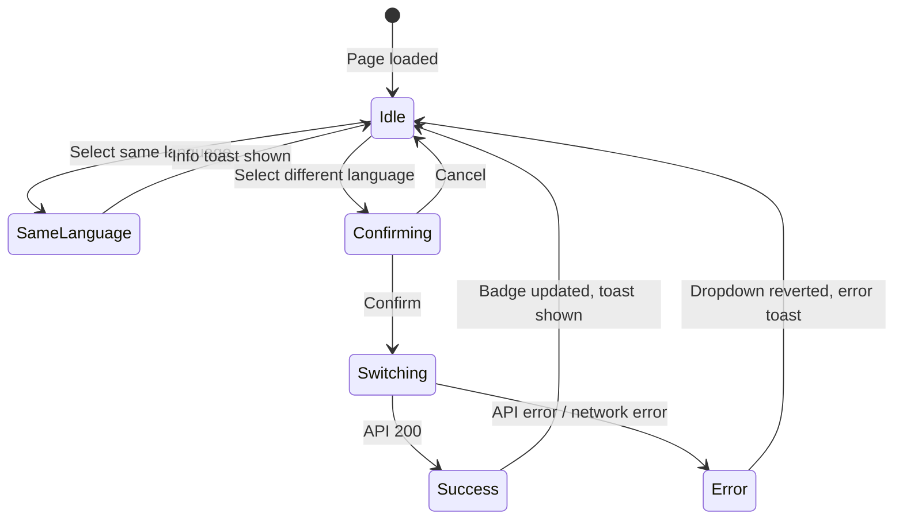
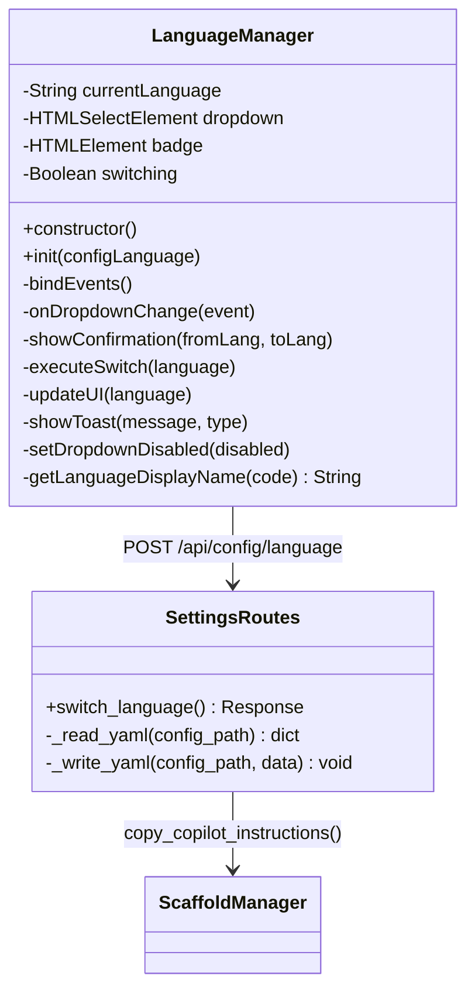

# Technical Design: Settings Language Switch (Web UI)

> Feature ID: FEATURE-028-D | Version: v1.0 | Last Updated: 2026-02-11

---

## Part 1: Agent-Facing Summary

> **Purpose:** Quick reference for AI agents navigating large projects.
> **📌 AI Coders:** Focus on this section for implementation context.

### Key Components Implemented

| Component | Responsibility | Scope/Impact | Tags |
|-----------|----------------|--------------|------|
| `POST /api/config/language` | Accept language switch requests, validate, call ScaffoldManager, update YAML | New route in `settings_routes.py` | #api #language #settings #backend |
| `LanguageManager` (JS) | Client-side language section: dropdown, confirmation, AJAX, toasts | Inline class in `settings.html` | #frontend #language #settings #javascript |
| Language card (HTML) | Render language dropdown card above Project Folders | New HTML section in `settings.html` | #frontend #html #settings |
| `ConfigData.language` | Expose `language` field from `.x-ipe.yaml` via config API | Add field to `config_service.py` | #config #backend #api |

### Dependencies

| Dependency | Source | Design Link | Usage Description |
|------------|--------|-------------|-------------------|
| `ScaffoldManager` | FEATURE-028-B | [technical-design.md](../FEATURE-028-B/technical-design.md) | `copy_copilot_instructions(cli_name, language)` for instruction extraction |
| `ConfigService` / `ConfigData` | FEATURE-010 | — | Extended to include `language` field |
| `SUPPORTED_LANGUAGES` | FEATURE-028-B | — | `['en', 'zh']` list from `cli/main.py`, duplicated as constant in route |
| `settings_routes.py` | FEATURE-006 | — | Blueprint for settings routes; new endpoint added here |
| `settings.html` | FEATURE-006 | — | Template extended with Language card section |

### Major Flow

1. Page loads → `ConfigManager.loadConfig()` returns config including `language` → `LanguageManager` sets dropdown to current value
2. User changes dropdown → same-language check → if different, show confirmation modal
3. User confirms → disable dropdown → `POST /api/config/language { "language": "zh" }`
4. Backend: validate → `ScaffoldManager.copy_copilot_instructions(cli, lang)` → update `.x-ipe.yaml` → return result
5. Frontend: update badge → re-enable dropdown → show success/error toast

### Usage Example

```python
# Backend — new endpoint in settings_routes.py
@settings_bp.route('/api/config/language', methods=['POST'])
def switch_language():
    data = request.get_json() or {}
    language = data.get('language')
    # validate → extract instructions → update yaml → respond
```

```javascript
// Frontend — LanguageManager in settings.html
const langMgr = new LanguageManager();
// Automatically binds dropdown change → confirmation → AJAX → toast
```

---

## Part 2: Implementation Guide

> **Purpose:** Human-readable details for developers.
> **📌 Emphasis on visual diagrams for comprehension.**

### Mockup Reference

Source of truth for UI design: [mockups/settings-language-v1.html](mockups/settings-language-v1.html)

The mockup defines 4 states: default card, confirmation dialog, success toast, same-language toast. The implementation MUST reproduce the mockup's layout, colors, and interactions.

### Workflow Diagram

```mermaid
sequenceDiagram
    participant U as User
    participant D as Dropdown (settings.html)
    participant LM as LanguageManager (JS)
    participant API as POST /api/config/language
    participant SM as ScaffoldManager
    participant FS as .x-ipe.yaml

    U->>D: Select different language
    D->>LM: change event
    LM->>LM: Same-language check
    alt Same language
        LM-->>U: Info toast "Already using X"
    else Different language
        LM->>U: Show confirmation modal
        U->>LM: Click "Proceed"
        LM->>D: Disable dropdown
        LM->>API: POST { "language": "zh" }
        API->>API: Validate language ∈ SUPPORTED
        API->>SM: copy_copilot_instructions(cli, lang)
        SM->>FS: Write instructions file
        SM-->>API: Success
        API->>FS: Update .x-ipe.yaml language field
        API-->>LM: { "success": true, "language": "zh" }
        LM->>D: Re-enable, update badge
        LM-->>U: Success toast
    end
```



### State Diagram



### Class Diagram



### API Specification

#### POST /api/config/language

**Request:**
```json
{
  "language": "zh"
}
```

**Response (200 — success):**
```json
{
  "success": true,
  "language": "zh",
  "message": "Language switched to zh"
}
```

**Response (400 — invalid language):**
```json
{
  "success": false,
  "error": "Unsupported language 'fr'. Supported: en, zh"
}
```

**Response (400 — missing field):**
```json
{
  "success": false,
  "error": "Missing required field: language"
}
```

**Response (500 — extraction failure):**
```json
{
  "success": false,
  "error": "Failed to extract instructions: [detail]"
}
```

### Implementation Steps

#### 1. Backend: Extend ConfigData with `language` field

Add `language` field to `ConfigData` in `config_service.py` so `GET /api/config` returns it:
- Add `language: str = "en"` field to `ConfigData` dataclass
- Parse `language` from raw YAML in `ConfigService._validate()` (default `"en"`)
- Add `language` to `ConfigData.to_dict()`

#### 2. Backend: Add `POST /api/config/language` endpoint

Add to `settings_routes.py`:
- Define `SUPPORTED_LANGUAGES = ['en', 'zh']`
- Validate language code against allowlist
- Read `.x-ipe.yaml` to get current config (cli name, etc.)
- Call `ScaffoldManager.copy_copilot_instructions(cli_name=cli, language=lang)` with `force=True`
- Only on success: update `.x-ipe.yaml` language field and write back
- Update `app.config['X_IPE_CONFIG']` by reloading config
- Return JSON response

**Atomicity pattern** (extract first, then update config):
```python
# 1. Extract instructions (may fail)
scaffold = ScaffoldManager(project_root, dry_run=False, force=True)
scaffold.copy_copilot_instructions(cli_name=cli_name, language=language)

# 2. Only if extraction succeeded, update YAML
config['language'] = language
with open(config_path, 'w') as f:
    yaml.dump(config, f, default_flow_style=False, allow_unicode=True)
```

#### 3. Frontend: Add Language card HTML

Insert before the Project Folders card in `settings.html`:
- Language card with globe icon (`bi-globe`), "Language" header, current language badge
- Dropdown `<select id="languageSelect">` with options `en`/`zh`
- Info note about instruction regeneration
- Confirmation modal `#languageConfirmModal` with from→to display
- Reuse existing toast container for success/error/info toasts

#### 4. Frontend: LanguageManager JavaScript class

Add inline `<script>` class in `settings.html` following `ConfigManager` pattern:
- `constructor()`: cache DOM elements, bind events
- `init(language)`: called by ConfigManager after config loads, sets dropdown + badge
- `onDropdownChange()`: same-language guard → confirmation modal → `executeSwitch()`
- `executeSwitch(lang)`: disable dropdown → `fetch('POST', '/api/config/language')` → update UI or revert
- `showToast(msg, type)`: reuse Bootstrap Toast API
- `getLanguageDisplayName(code)`: `{ en: 'English', zh: '中文' }`

#### 5. Frontend: Wire ConfigManager → LanguageManager

In `ConfigManager.loadConfig()`, after receiving config, call `languageManager.init(config.language || 'en')`.

### Edge Cases & Error Handling

| Scenario | Expected Behavior |
|----------|-------------------|
| No `.x-ipe.yaml` exists | Return 400: "Project not initialized" |
| Language code not in SUPPORTED_LANGUAGES | Return 400 with descriptive error |
| ScaffoldManager throws during extraction | Return 500, YAML unchanged (atomicity) |
| Network error during AJAX | Dropdown reverts, error toast shown |
| Same language selected | No-op, info toast, no API call |
| Concurrent requests (dropdown disabled) | Prevented by disabling dropdown during operation |
| Missing `language` in request body | Return 400: "Missing required field: language" |
| Config has no `language` field | Default to `"en"`, switching adds the field |

### CSS Additions

Minimal CSS additions to `settings.html` `<style>` block:
- `.language-icon-box`: emerald-tinted background for globe icon (matches mockup)
- `.language-badge`: styled badge for current language display
- `.select-loading`: `pointer-events: none; opacity: 0.55` for disabled state during switch

All other styling reuses existing `.settings-card`, `.card-header`, Bootstrap Modal/Toast classes.

---

## Design Change Log

| Date | Phase | Change Summary |
|------|-------|----------------|
| 2026-02-11 | Initial Design | Initial technical design. Full-stack: backend POST endpoint reusing ScaffoldManager, frontend LanguageManager class in settings.html with dropdown, confirmation modal, and toast feedback. ConfigData extended with language field. |
