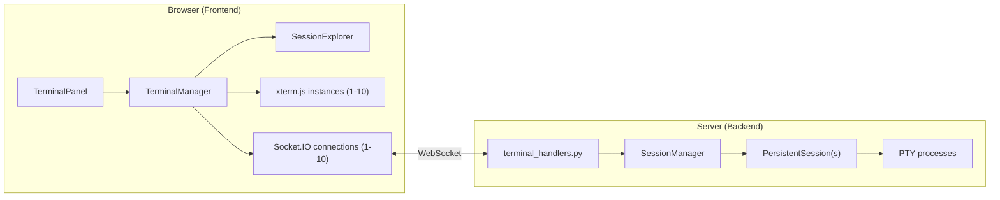
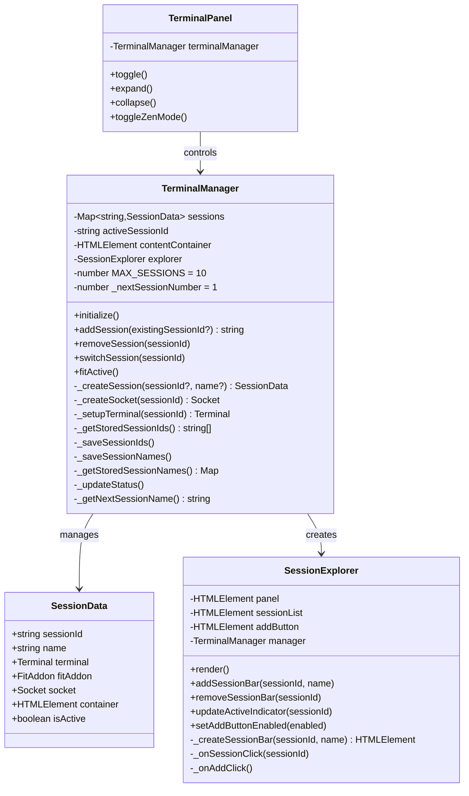
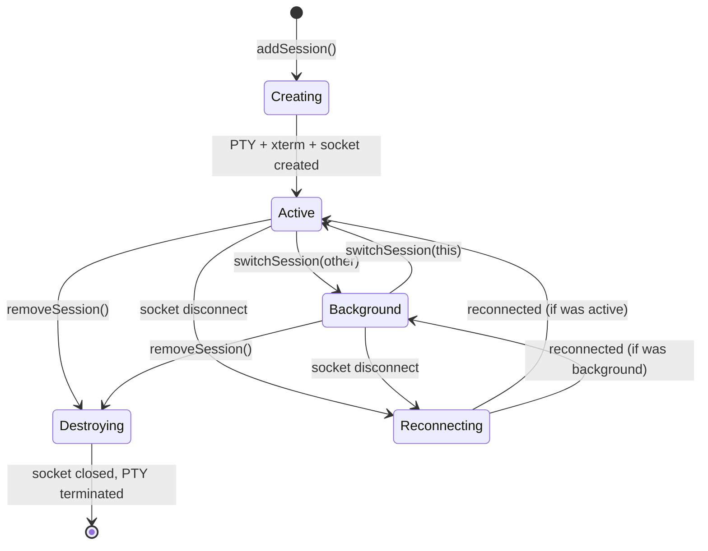
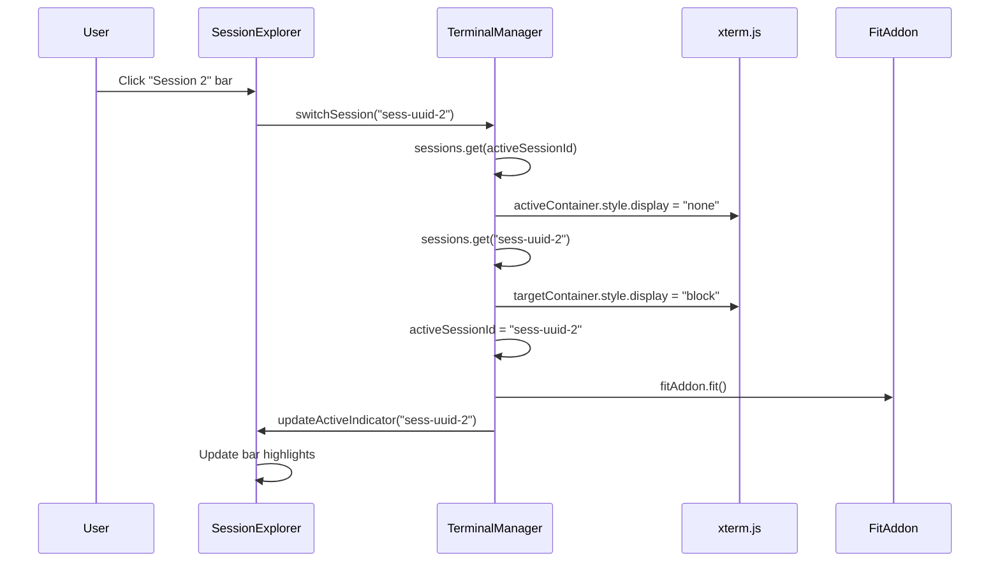

# Technical Design: Session Explorer Core

> Feature ID: FEATURE-029-A | Version: v1.0 | Last Updated: 2026-02-11

---

## Part 1: Agent-Facing Summary

> **Purpose:** Quick reference for AI agents navigating large projects.
> **📌 AI Coders:** Focus on this section for implementation context.

### Key Components Implemented

| Component | Responsibility | Scope/Impact | Tags |
|-----------|----------------|--------------|------|
| `SessionExplorer` | Renders session list, handles create/switch UI | New class in terminal.js | #session-explorer #frontend #ui |
| `TerminalManager` (refactored) | Session lifecycle: create, switch, track up to 10 sessions | Refactor from array-based (2 panes) to Map-based (10 sessions) | #terminal #session #refactor |
| `TerminalPanel` (modified) | Console panel states + explorer integration | Minor: pass explorer visibility on expand/zen | #terminal-panel #layout |
| `.session-explorer` CSS | Explorer panel layout + session bar styles | New styles in terminal.css | #css #explorer #layout |
| HTML template update | Replace `.terminal-panes` multi-pane with `.terminal-content` + `.session-explorer` | index.html modification | #html #template |
| Backend constant update | Raise MAX_TERMINALS if present | terminal_service.py minor change | #backend #config |

### Dependencies

| Dependency | Source | Design Link | Usage Description |
|------------|--------|-------------|-------------------|
| `SessionManager` | FEATURE-005 | [specification.md](../FEATURE-005/specification.md) | Backend PTY session management — reused without changes |
| `PersistentSession` | FEATURE-005 | [specification.md](../FEATURE-005/specification.md) | PTY wrapper with OutputBuffer — reused as-is |
| `OutputBuffer` | FEATURE-005 | [specification.md](../FEATURE-005/specification.md) | 10KB circular buffer for reconnection replay |
| `terminal_handlers.py` | FEATURE-005 | [specification.md](../FEATURE-005/specification.md) | Socket.IO event handlers — reused without changes |
| xterm.js 5.3.0 | External | - | Terminal emulator library, one instance per session |
| Socket.IO 4.x | External | - | WebSocket communication, one connection per session |

### Major Flow

1. **Console expand** → `TerminalManager.initialize()` → auto-create "Session 1" (PTY + xterm.js + Socket.IO) → render in explorer + terminal area
2. **Click "+"** → `TerminalManager.addSession()` → create PTY session → add to sessions Map → render session bar → set as active
3. **Click session bar** → `TerminalManager.switchSession(sessionId)` → hide active terminal (`display:none`) → show target terminal (`display:block`) → `fitAddon.fit()` → update explorer highlights
4. **Page reload** → read `terminal_session_ids` from localStorage → reconnect each via Socket.IO `attach` → buffer replay → restore session names

### Usage Example

```javascript
// After refactoring — new API surface
const manager = new TerminalManager('terminal-content');
manager.initialize(); // Auto-creates "Session 1", renders explorer

// Programmatic session creation
const sessionId = manager.addSession(); // Returns session UUID

// Switch to a session
manager.switchSession(sessionId);

// Access session data
const session = manager.sessions.get(sessionId);
console.log(session.name, session.isActive, session.terminal);

// Cleanup
manager.removeSession(sessionId);
```

---

## Part 2: Implementation Guide

> **Purpose:** Human-readable details for developers.
> **📌 Emphasis on visual diagrams for comprehension.**

### Linked Mockup

| Mockup | Path | Status |
|--------|------|--------|
| Console Explorer v1 | [mockups/console-explorer-v1.html](mockups/console-explorer-v1.html) | current — source of truth for visual design |

### Architecture Overview



### Class Diagram



### Session Lifecycle State Diagram



### Session Switch Sequence



### Data Model

```javascript
// SessionData — stored in TerminalManager.sessions Map
{
  sessionId: "uuid-string",       // From server via 'session_id' event
  name: "Session 1",              // User-visible name, default sequential
  terminal: Terminal,             // xterm.js instance
  fitAddon: FitAddon,             // FitAddon for this terminal
  socket: Socket,                 // Socket.IO connection
  container: HTMLElement,         // <div class="terminal-session-container">
  isActive: boolean               // true for active session
}

// localStorage keys
"terminal_session_ids"   // JSON array of session UUIDs (existing key, reused)
"terminal_session_names" // JSON object { sessionId: "name" } (new key)
```

### HTML Template Changes

**Current Structure (to be replaced):**
```html
<div class="terminal-panes" id="terminal-panes">
    <!-- Dynamically: .terminal-pane elements with .pane-splitter -->
</div>
```

**New Structure:**
```html
<div class="terminal-body" id="terminal-body">
    <div class="terminal-content" id="terminal-content">
        <!-- Dynamically: .terminal-session-container divs (one per session) -->
    </div>
    <div class="session-explorer" id="session-explorer">
        <div class="explorer-header">
            <span class="explorer-title">Sessions</span>
        </div>
        <div class="session-list" id="session-list">
            <!-- Dynamically: .session-bar divs -->
        </div>
        <button class="explorer-add-btn" id="explorer-add-btn" title="New Session">
            <i class="bi bi-plus-lg"></i>
        </button>
    </div>
</div>
```

**Session Bar HTML (generated by SessionExplorer):**
```html
<div class="session-bar" data-session-id="uuid" data-active="true">
    <span class="session-status-dot"></span>
    <span class="session-name">Session 1</span>
</div>
```

### CSS Design

```css
/* Terminal body — replaces .terminal-panes */
.terminal-body {
    display: flex;
    flex-direction: row;
    height: calc(100% - 36px);  /* minus header */
    overflow: hidden;
}

/* Main terminal area */
.terminal-content {
    flex: 1;
    position: relative;
    min-width: 0;
    overflow: hidden;
}

/* Individual session container */
.terminal-session-container {
    position: absolute;
    top: 0;
    left: 0;
    right: 0;
    bottom: 0;
    display: none;  /* hidden by default */
}
.terminal-session-container.active {
    display: block;
}

/* Session Explorer panel */
.session-explorer {
    width: 220px;
    min-width: 220px;
    max-width: 220px;
    display: flex;
    flex-direction: column;
    background: #252526;
    border-left: 1px solid #333;
}

.explorer-header {
    height: 32px;
    display: flex;
    align-items: center;
    padding: 0 12px;
    background: #2d2d2d;
    border-bottom: 1px solid #333;
    font-size: 11px;
    text-transform: uppercase;
    letter-spacing: 0.5px;
    color: #888;
}

.session-list {
    flex: 1;
    overflow-y: auto;
    padding: 4px 0;
}

/* Session bar */
.session-bar {
    display: flex;
    align-items: center;
    padding: 6px 12px;
    cursor: pointer;
    gap: 8px;
    font-size: 13px;
    color: #ccc;
    border-left: 3px solid transparent;
    transition: background-color 0.15s;
}
.session-bar:hover {
    background: #2a2d2e;
}
.session-bar[data-active="true"] {
    border-left-color: #4ec9b0;
    background: #37373d;
    color: #fff;
}

/* Status dot */
.session-status-dot {
    width: 8px;
    height: 8px;
    border-radius: 50%;
    background: #555;
    flex-shrink: 0;
}
.session-bar[data-active="true"] .session-status-dot {
    background: #4ec9b0;
}

/* Add button */
.explorer-add-btn {
    height: 36px;
    display: flex;
    align-items: center;
    justify-content: center;
    background: transparent;
    border: none;
    border-top: 1px solid #333;
    color: #888;
    cursor: pointer;
    font-size: 16px;
}
.explorer-add-btn:hover {
    background: #2a2d2e;
    color: #ccc;
}
.explorer-add-btn:disabled {
    opacity: 0.3;
    cursor: not-allowed;
}
```

### Implementation Steps

| # | Layer | Task | Files |
|---|-------|------|-------|
| 1 | **Backend** | Ensure no MAX_TERMINALS constant blocks >2 sessions. If exists, raise to 10 or remove. | `terminal_service.py` |
| 2 | **HTML** | Replace `.terminal-panes` with `.terminal-body` containing `.terminal-content` + `.session-explorer` | `index.html` |
| 3 | **CSS** | Add `.terminal-body`, `.terminal-content`, `.session-explorer`, `.session-bar` styles. Remove `.terminal-pane`, `.pane-splitter` styles. | `terminal.css` |
| 4 | **JS: SessionExplorer** | Create `SessionExplorer` class with `render()`, `addSessionBar()`, `removeSessionBar()`, `updateActiveIndicator()` | `terminal.js` |
| 5 | **JS: TerminalManager refactor** | Refactor from array-based (`terminals[]`, `sockets[]`, `sessionIds[]`) to `sessions` Map. Remove splitter logic. Change `addTerminal()` → `addSession()`, `setFocus()` → `switchSession()`. | `terminal.js` |
| 6 | **JS: Session creation** | In `addSession()`: create xterm.js + FitAddon + container, mount with `terminal.open()`, create Socket.IO, add to sessions Map, call `explorer.addSessionBar()`. | `terminal.js` |
| 7 | **JS: Session switching** | In `switchSession()`: toggle `.active` class on containers, call `fitAddon.fit()`, update `activeSessionId`, call `explorer.updateActiveIndicator()`. | `terminal.js` |
| 8 | **JS: Initialization** | In `initialize()`: restore sessions from localStorage or create "Session 1". Render explorer panel. | `terminal.js` |
| 9 | **JS: Session removal** | In `removeSession()`: close socket, terminal.dispose(), remove container, remove from Map. If last session, auto-create new. | `terminal.js` |
| 10 | **JS: Backward compat** | Preserve `sendCopilotRefineCommand()`, `sendCopilotPromptCommand()`, connection status update, zen mode. Relocate "+" button from header to explorer. | `terminal.js` |
| 11 | **Integration** | Verify TerminalPanel expand/collapse/zen works with new layout. Update `fitAll()` → `fitActive()`. | `terminal.js` |
| 12 | **Testing** | Manual verification: create 10 sessions, switch, reload, reconnect. Verify no output loss, correct indicators. | Browser |

### Refactoring Strategy: TerminalManager

**Before (array-based):**
```javascript
class TerminalManager {
    terminals = [];     // Terminal[]
    fitAddons = [];     // FitAddon[]
    sockets = [];       // Socket[]
    sessionIds = [];    // string[]
    activeIndex = -1;   // number
}
```

**After (Map-based):**
```javascript
class TerminalManager {
    sessions = new Map();   // Map<string, SessionData>
    activeSessionId = null; // string | null
    explorer = null;        // SessionExplorer
    _nextSessionNumber = 1; // sequential naming counter
}
```

**Method migration:**

| Before | After | Notes |
|--------|-------|-------|
| `addTerminal(sessionId?)` | `addSession(existingSessionId?)` | Returns sessionId instead of index |
| `closeTerminal(index)` | `removeSession(sessionId)` | By sessionId, not array index |
| `setFocus(index)` | `switchSession(sessionId)` | CSS display toggle, no pane focus |
| `fitAll()` | `fitActive()` | Only fit the active session terminal |
| `_createPane(index)` | `_createSessionContainer(sessionId)` | Absolute-positioned div, not flex pane |
| `_addSplitter()` | *(removed)* | No splitter in new layout |
| `_removeSplitter()` | *(removed)* | No splitter in new layout |
| `_reindexPanes()` | *(removed)* | Map-based, no indices |
| `_updateAddButton()` | `explorer.setAddButtonEnabled()` | Delegated to explorer |

### Edge Cases & Error Handling

| Scenario | Handling |
|----------|----------|
| PTY creation failure | Show error toast: "Failed to create session". Log error. Remove partial SessionData from Map. Re-enable "+" button. |
| Socket disconnect (one session) | Auto-reconnect per existing logic. Yellow status indicator for that session. Other sessions unaffected. |
| Page reload with 5 sessions | Read localStorage `terminal_session_ids` + `terminal_session_names`. For each: create xterm.js + socket, emit `attach` with stored sessionId. Server replays buffer if session alive (<1hr). If expired, server creates new session. |
| Rapid "+" clicks | Each `addSession()` call is synchronous DOM creation. Socket connections are async but independent. Map insertion is atomic. No race condition. |
| Browser WebSocket limit | Socket.IO uses WebSocket transport directly (no upgrade). Standard browser allows 6 concurrent WS per host in HTTP/1.1. If using HTTPS/HTTP2, limit is higher. With 10 sessions on localhost, this should work since most browsers allow more for localhost. Monitor in testing. |
| `terminal.open()` called twice | Guard: only call `open()` once per terminal. Use container presence as guard. |
| Active session dies | Terminal shows exit message. Session stays in explorer. User can delete or switch. |

### Key Technical Decisions

| Decision | Rationale |
|----------|-----------|
| Map over Array for sessions | UUID-keyed lookup is O(1); avoids re-indexing on removal; sessions have natural unique keys |
| CSS `display` toggle over DOM removal | xterm.js `terminal.open()` is one-time — cannot detach and reattach. CSS toggle is instant and preserves state |
| `position: absolute` for session containers | Prevents layout shift when switching; all containers overlap in same space |
| Separate Socket.IO per session (no multiplex) | Follows existing FEATURE-005 pattern; simpler error isolation; independent reconnection |
| Explorer as separate class | SRP: explorer handles UI rendering, TerminalManager handles session lifecycle |
| Relocate "+" to explorer | Semantically belongs with session list, not terminal header. Frees header space. |
| `fitActive()` instead of `fitAll()` | Only visible terminal can report correct dimensions; `display:none` terminals report 0×0 |

### Integration with TerminalPanel

The existing `TerminalPanel` class manages collapse/expand/zen states. Changes needed:

1. **expand()**: After expanding, call `manager.fitActive()` instead of `manager.fitAll()`
2. **collapse()**: No change needed — panel height becomes 36px, content hidden
3. **zen mode**: Hide explorer panel when entering zen mode (terminal takes full screen). Restore on exit.
4. **Resize handle**: After drag-resize, call `manager.fitActive()` instead of `manager.fitAll()`

### Files Changed Summary

| File | Change Scope | LOC Estimate |
|------|-------------|--------------|
| `src/x_ipe/static/js/terminal.js` | Major refactor: TerminalManager + new SessionExplorer class | ~400 lines changed |
| `src/x_ipe/templates/index.html` | Replace `.terminal-panes` with `.terminal-body` structure | ~15 lines |
| `src/x_ipe/static/css/terminal.css` | Add explorer styles, remove pane/splitter styles | ~80 lines added, ~30 removed |
| `src/x_ipe/services/terminal_service.py` | Optional: raise MAX_TERMINALS constant if exists | ~1 line |

---

## Design Change Log

| Date | Phase | Change Summary |
|------|-------|----------------|
| 2026-02-11 | Initial Design | Initial technical design for FEATURE-029-A. Refactors TerminalManager from array-based (2 panes) to Map-based (10 sessions) with new SessionExplorer class. Replaces split-pane layout with single-session view + right-side explorer panel. |
