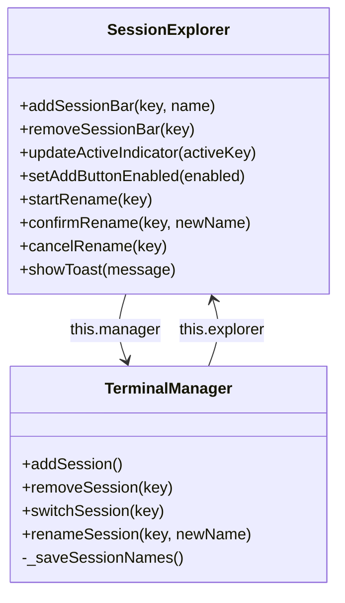

# Technical Design: Session Actions

> Feature ID: FEATURE-029-B
> Version: v1.0
> Status: Designed
> Last Updated: 02-12-2026

## Part 1: Agent-Facing Summary

### Technical Scope
- **Layer:** [Frontend]
- **Type:** Enhancement to existing SessionExplorer class
- **Files:** `terminal.js` (modify), `terminal.css` (add styles)
- **Dependencies:** FEATURE-029-A (SessionExplorer, TerminalManager.removeSession, _saveSessionNames)

### Architecture Reference
No architecture documents referenced. This is a UI-only enhancement to the existing SessionExplorer class within `terminal.js`.

### Key Design Decisions

| Decision | Choice | Rationale |
|----------|--------|-----------|
| Rename approach | DOM swap (span ↔ input) | Simplest approach, no library needed, instant |
| Action icon visibility | Always visible | Consistent with mockup, avoids hover-only discoverability issues |
| Toast implementation | Simple div with CSS animation | No toast library needed, lightweight, matches existing pattern |
| Delete confirmation | None | Per user decision in ideation (IDEA-021) |
| Event propagation | stopPropagation on action buttons | Prevents session switch when clicking rename/delete |

### Data Flow

```
Rename: Click ✎ → span→input swap → Enter/blur → update session.name → _saveSessionNames() → localStorage
Delete: Click 🗑 → removeSession(key) → socket.disconnect + terminal.dispose + container.remove → auto-recreate if last
Toast:  addSession() at limit → showToast("Maximum 10 sessions reached") → auto-dismiss 2.5s
```

### Component Diagram



---

## Part 2: Implementation Guide

### Step 1: Add `renameSession()` to TerminalManager

**File:** `src/x_ipe/static/js/terminal.js`
**Location:** After `removeSession()` method (~line 291)

Add method:
```javascript
renameSession(key, newName) {
    const session = this.sessions.get(key);
    if (!session) return;
    const trimmed = newName.trim();
    if (!trimmed) return; // no empty names
    session.name = trimmed;
    this._saveSessionNames();
}
```

### Step 2: Update `addSessionBar()` with Action Icons

**File:** `src/x_ipe/static/js/terminal.js`
**Location:** `SessionExplorer.addSessionBar()` method (~line 897)

Modify to add rename and delete buttons after the name span:

```javascript
addSessionBar(key, name) {
    const bar = document.createElement('div');
    bar.className = 'session-bar';
    bar.dataset.sessionKey = key;
    bar.dataset.active = 'false';

    const dot = document.createElement('span');
    dot.className = 'session-status-dot';

    const nameSpan = document.createElement('span');
    nameSpan.className = 'session-name';
    nameSpan.textContent = name;

    const renameBtn = document.createElement('button');
    renameBtn.className = 'session-action-btn rename-btn';
    renameBtn.title = 'Rename';
    renameBtn.innerHTML = '<i class="bi bi-pencil"></i>';
    renameBtn.addEventListener('click', (e) => {
        e.stopPropagation();
        this.startRename(key);
    });

    const deleteBtn = document.createElement('button');
    deleteBtn.className = 'session-action-btn delete-btn';
    deleteBtn.title = 'Delete';
    deleteBtn.innerHTML = '<i class="bi bi-trash"></i>';
    deleteBtn.addEventListener('click', (e) => {
        e.stopPropagation();
        this.manager.removeSession(key);
    });

    bar.appendChild(dot);
    bar.appendChild(nameSpan);
    bar.appendChild(renameBtn);
    bar.appendChild(deleteBtn);

    bar.addEventListener('click', () => {
        this.manager.switchSession(key);
    });

    this.listEl.appendChild(bar);
}
```

### Step 3: Add Rename Methods to SessionExplorer

**File:** `src/x_ipe/static/js/terminal.js`
**Location:** After `setAddButtonEnabled()` in SessionExplorer class

```javascript
startRename(key) {
    const bar = this.listEl.querySelector(`[data-session-key="${key}"]`);
    if (!bar) return;
    const nameSpan = bar.querySelector('.session-name');
    if (!nameSpan || nameSpan.tagName === 'INPUT') return; // already editing

    const input = document.createElement('input');
    input.type = 'text';
    input.className = 'session-name-input';
    input.value = nameSpan.textContent;
    const originalName = nameSpan.textContent;

    const confirm = () => {
        const newName = input.value.trim();
        if (newName && newName !== originalName) {
            this.manager.renameSession(key, newName);
        }
        const span = document.createElement('span');
        span.className = 'session-name';
        span.textContent = newName || originalName;
        input.replaceWith(span);
    };

    const cancel = () => {
        const span = document.createElement('span');
        span.className = 'session-name';
        span.textContent = originalName;
        input.replaceWith(span);
    };

    input.addEventListener('keydown', (e) => {
        if (e.key === 'Enter') { e.preventDefault(); confirm(); }
        if (e.key === 'Escape') { e.preventDefault(); cancel(); }
    });
    input.addEventListener('blur', () => confirm());

    nameSpan.replaceWith(input);
    input.focus();
    input.select();
}
```

### Step 4: Add Toast Method to SessionExplorer

**File:** `src/x_ipe/static/js/terminal.js`
**Location:** After rename methods in SessionExplorer class

```javascript
showToast(message) {
    const panel = document.getElementById('terminal-panel');
    if (!panel) return;
    let toast = panel.querySelector('.session-toast');
    if (!toast) {
        toast = document.createElement('div');
        toast.className = 'session-toast';
        toast.setAttribute('role', 'alert');
        panel.appendChild(toast);
    }
    toast.textContent = message;
    toast.classList.add('visible');
    setTimeout(() => toast.classList.remove('visible'), 2500);
}
```

### Step 5: Update `addSession()` to Show Toast at Limit

**File:** `src/x_ipe/static/js/terminal.js`
**Location:** `TerminalManager.addSession()` method, at the beginning

Add guard:
```javascript
if (this.sessions.size >= MAX_SESSIONS) {
    if (this.explorer) this.explorer.showToast('Maximum 10 sessions reached');
    return null;
}
```

### Step 6: Add CSS Styles

**File:** `src/x_ipe/static/css/terminal.css`
**Location:** After session explorer styles (after line ~336)

```css
/* FEATURE-029-B: Session Actions */

/* Action buttons in session bar */
.session-action-btn {
    background: transparent;
    border: none;
    color: #666;
    cursor: pointer;
    padding: 2px 4px;
    font-size: 12px;
    line-height: 1;
    flex-shrink: 0;
    opacity: 0.5;
    transition: opacity 0.15s, color 0.15s;
}
.session-action-btn:hover {
    opacity: 1;
    color: #ccc;
}
.session-action-btn.delete-btn:hover {
    color: #f44;
}

/* Inline rename input */
.session-name-input {
    flex: 1;
    background: #1e1e1e;
    border: 1px solid #4ec9b0;
    color: #fff;
    font-size: 13px;
    padding: 1px 4px;
    outline: none;
    min-width: 0;
}

/* Toast notification */
.session-toast {
    position: absolute;
    bottom: 8px;
    left: 50%;
    transform: translateX(-50%) translateY(20px);
    background: #333;
    color: #fff;
    padding: 6px 16px;
    border-radius: 4px;
    font-size: 12px;
    opacity: 0;
    pointer-events: none;
    transition: opacity 0.2s, transform 0.2s;
    z-index: 100;
}
.session-toast.visible {
    opacity: 1;
    transform: translateX(-50%) translateY(0);
}
```

### Implementation Order

| Order | Step | Description | Verify |
|-------|------|-------------|--------|
| 1 | Step 6 | CSS styles | Styles load without errors |
| 2 | Step 1 | renameSession() | Can call from console |
| 3 | Step 2 | Action icons in bars | Icons visible in explorer |
| 4 | Step 3 | Rename methods | Inline rename works |
| 5 | Step 4 | Toast method | showToast() works |
| 6 | Step 5 | Limit guard | Toast on limit |

### Design Change Log

| Date | Change | Reason |
|------|--------|--------|
| 02-12-2026 | Initial design | - |
