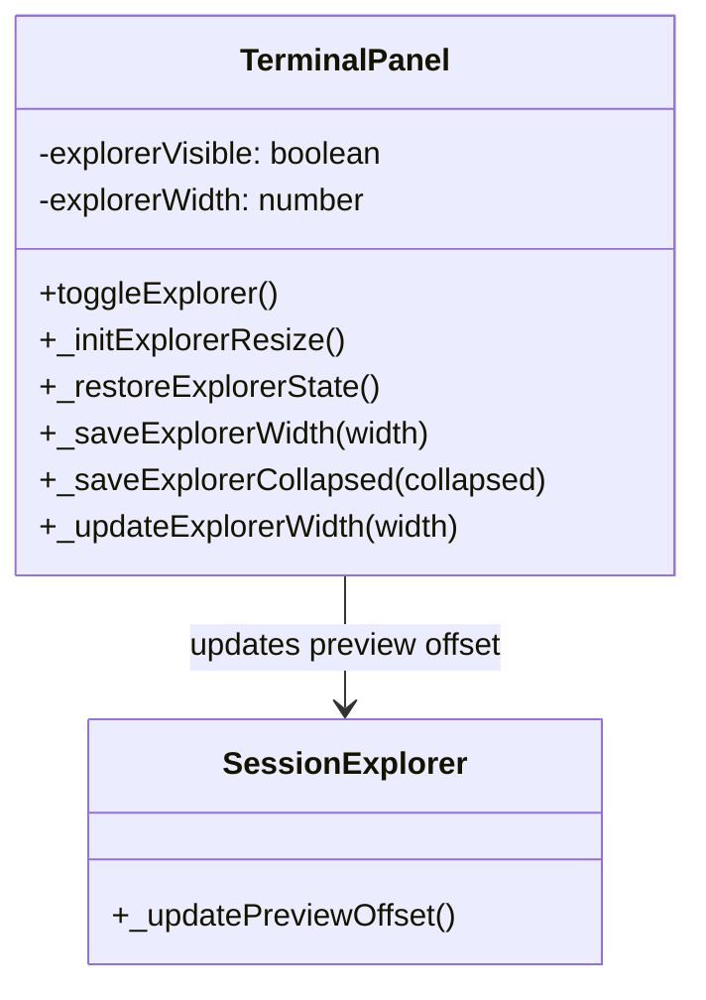
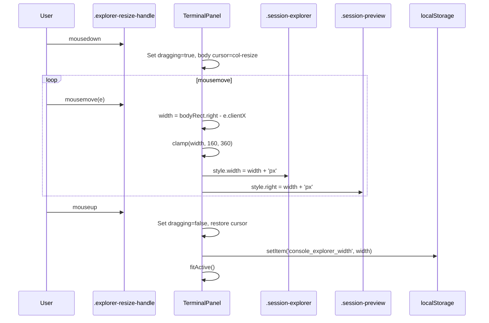
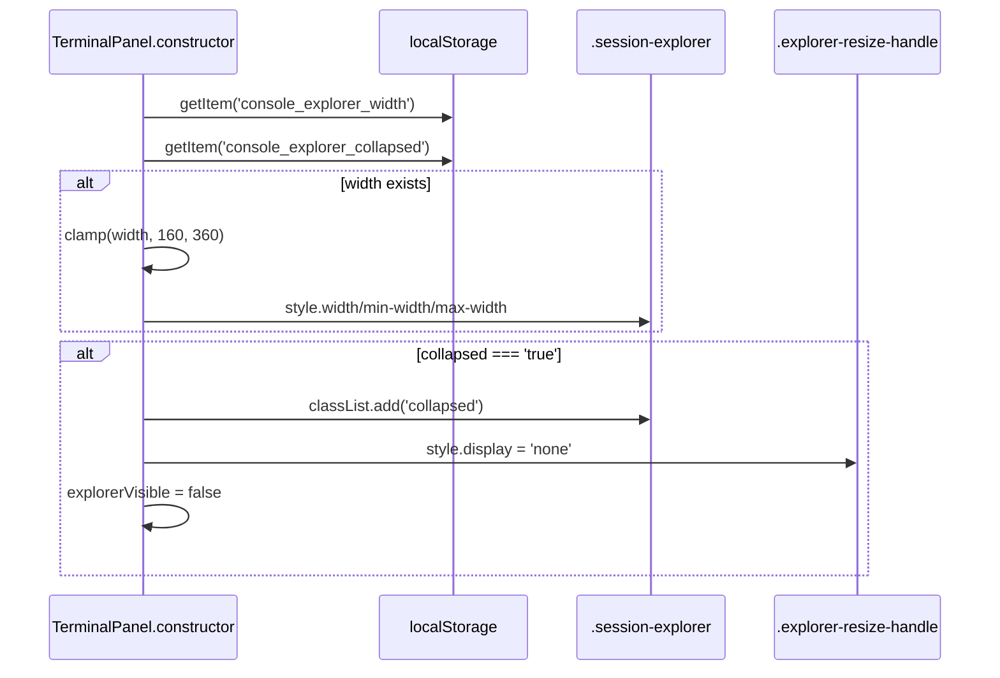

# Technical Design: Explorer UI Controls

> Feature ID: FEATURE-029-D
> Version: v1.0
> Last Updated: 02-12-2026

## Version History

| Version | Date | Description |
|---------|------|-------------|
| v1.0 | 02-12-2026 | Initial technical design |

---

# Part 1: Agent-Facing Summary

## Overview

Add drag-to-resize and localStorage persistence to the Console Session Explorer panel. The toggle/collapse mechanism (AC-1/AC-2) is already implemented in TASK-322. This design adds:

1. **Resize handle** — 5px drag handle between `.terminal-content` and `.session-explorer`
2. **Drag interaction** — mousedown/mousemove/mouseup to resize explorer width [160–360px]
3. **Persistence** — save/restore explorer width and collapsed state via localStorage
4. **Session name persistence** — already implemented via `_saveSessionNames()`/`_getStoredSessionNames()` (AC-15/AC-16 are satisfied by existing code)

## Key Components Implemented

| Component | File | Tags |
|-----------|------|------|
| Explorer resize handle (HTML) | `src/x_ipe/templates/index.html` | `[Frontend] [HTML] [Explorer] [Resize]` |
| Explorer resize handle (CSS) | `src/x_ipe/static/css/terminal.css` | `[Frontend] [CSS] [Explorer] [Resize] [DragHandle]` |
| Explorer drag resize (JS) | `src/x_ipe/static/js/terminal.js` → `TerminalPanel` | `[Frontend] [JS] [Explorer] [Resize] [Drag]` |
| Explorer persistence (JS) | `src/x_ipe/static/js/terminal.js` → `TerminalPanel` | `[Frontend] [JS] [Explorer] [Persistence] [localStorage]` |
| Preview offset sync (JS) | `src/x_ipe/static/js/terminal.js` → `SessionExplorer` | `[Frontend] [JS] [Preview] [Explorer] [Resize]` |

## Usage Example

```javascript
// On page load, TerminalPanel constructor restores explorer state:
const savedWidth = localStorage.getItem('console_explorer_width');
const savedCollapsed = localStorage.getItem('console_explorer_collapsed');
// Apply to explorer element

// Drag handle interaction:
// User mousedown on .explorer-resize-handle → track mousemove →
// compute width = bodyRect.right - e.clientX, clamp [160, 360] →
// apply to explorer element → on mouseup save to localStorage + fitActive()
```

## Dependencies

| Dependency | Type | Status |
|------------|------|--------|
| FEATURE-029-A (Session Explorer Core) | Internal | ✅ Complete |
| TASK-322 (Toggle + Collapse CSS/JS) | Internal | ✅ Complete |
| FEATURE-029-C (Hover Preview) | Internal | ✅ Complete |

---

# Part 2: Implementation Guide

## Architecture

The implementation adds a drag handle element and persistence logic to the existing terminal panel architecture. No new classes are introduced — all logic extends `TerminalPanel`.



## Workflow: Drag Resize



## Workflow: Page Load Restore



## Implementation Details

### 1. HTML: Add Resize Handle

**File:** `src/x_ipe/templates/index.html`

Insert a resize handle div between `.terminal-content` and `.session-explorer` inside `.terminal-body`:

```html
<div class="terminal-body" id="terminal-body">
    <div class="terminal-content" id="terminal-content">
        <!-- Session containers inserted dynamically -->
    </div>
    <div class="explorer-resize-handle" id="explorer-resize-handle"></div>  <!-- NEW -->
    <div class="session-explorer" id="session-explorer">
        ...
    </div>
</div>
```

### 2. CSS: Resize Handle Styles

**File:** `src/x_ipe/static/css/terminal.css`

Add after the Session Explorer section (~line 251, after `.session-explorer.collapsed`):

```css
/* Explorer resize handle */
.explorer-resize-handle {
    width: 5px;
    cursor: col-resize;
    background: #333;
    flex-shrink: 0;
    position: relative;
    transition: background 0.15s;
    z-index: 10;
}

.explorer-resize-handle:hover,
.explorer-resize-handle.dragging {
    background: rgba(78, 201, 176, 0.3);
}

.explorer-resize-handle::after {
    content: '';
    position: absolute;
    top: 50%;
    left: 50%;
    transform: translate(-50%, -50%);
    width: 2px;
    height: 24px;
    border-radius: 1px;
    background: #888;
    opacity: 0;
    transition: opacity 0.15s;
}

.explorer-resize-handle:hover::after {
    opacity: 1;
}
```

Also update `.session-explorer` to remove fixed min/max-width (allow dynamic width):

```css
.session-explorer {
    width: 220px;
    /* REMOVE min-width and max-width fixed values */
    flex-shrink: 0;
    ...
}
```

### 3. JavaScript: TerminalPanel Extensions

**File:** `src/x_ipe/static/js/terminal.js`

#### 3a. Constants (add near line 16)

```javascript
const EXPLORER_WIDTH_KEY = 'console_explorer_width';
const EXPLORER_COLLAPSED_KEY = 'console_explorer_collapsed';
const EXPLORER_DEFAULT_WIDTH = 220;
const EXPLORER_MIN_WIDTH = 160;
const EXPLORER_MAX_WIDTH = 360;
```

#### 3b. TerminalPanel Constructor — add state and restore

In the constructor (after `this.explorerVisible = true;`):

```javascript
this.explorerWidth = EXPLORER_DEFAULT_WIDTH;
this.explorerResizeHandle = document.getElementById('explorer-resize-handle');

// Restore persisted state
this._restoreExplorerState();
```

#### 3c. TerminalPanel._restoreExplorerState()

```javascript
_restoreExplorerState() {
    const explorer = document.getElementById('session-explorer');
    if (!explorer) return;

    // Restore width
    try {
        const savedWidth = localStorage.getItem(EXPLORER_WIDTH_KEY);
        if (savedWidth !== null) {
            const w = Math.max(EXPLORER_MIN_WIDTH, Math.min(EXPLORER_MAX_WIDTH, parseInt(savedWidth, 10)));
            if (!isNaN(w)) {
                this.explorerWidth = w;
                this._updateExplorerWidth(w);
            }
        }
    } catch (e) {}

    // Restore collapsed state
    try {
        const savedCollapsed = localStorage.getItem(EXPLORER_COLLAPSED_KEY);
        if (savedCollapsed === 'true') {
            this.explorerVisible = false;
            explorer.classList.add('collapsed');
            if (this.explorerResizeHandle) this.explorerResizeHandle.style.display = 'none';
        }
    } catch (e) {}
}
```

#### 3d. TerminalPanel._updateExplorerWidth(width)

Sets explorer width and syncs preview panel offset:

```javascript
_updateExplorerWidth(width) {
    const explorer = document.getElementById('session-explorer');
    if (!explorer) return;
    explorer.style.width = width + 'px';
    explorer.style.minWidth = width + 'px';
    explorer.style.maxWidth = width + 'px';

    // Sync preview panel offset
    const preview = document.querySelector('.session-preview');
    if (preview) {
        preview.style.right = width + 'px';
    }
}
```

#### 3e. TerminalPanel._initExplorerResize()

Called from `_bindEvents()`:

```javascript
_initExplorerResize() {
    const handle = this.explorerResizeHandle;
    if (!handle) return;

    handle.addEventListener('mousedown', (e) => {
        e.preventDefault();
        handle.classList.add('dragging');
        document.body.style.cursor = 'col-resize';
        document.body.style.userSelect = 'none';

        const body = document.getElementById('terminal-body');

        const onMove = (e) => {
            const bodyRect = body.getBoundingClientRect();
            const newWidth = bodyRect.right - e.clientX;
            const clamped = Math.max(EXPLORER_MIN_WIDTH, Math.min(EXPLORER_MAX_WIDTH, newWidth));
            this.explorerWidth = clamped;
            this._updateExplorerWidth(clamped);
        };

        const onUp = () => {
            document.removeEventListener('mousemove', onMove);
            document.removeEventListener('mouseup', onUp);
            handle.classList.remove('dragging');
            document.body.style.cursor = '';
            document.body.style.userSelect = '';
            this._saveExplorerWidth(this.explorerWidth);
            this.terminalManager.fitActive();
        };

        document.addEventListener('mousemove', onMove);
        document.addEventListener('mouseup', onUp);
    });
}
```

#### 3f. Persistence helpers

```javascript
_saveExplorerWidth(width) {
    try { localStorage.setItem(EXPLORER_WIDTH_KEY, String(width)); } catch (e) {}
}

_saveExplorerCollapsed(collapsed) {
    try { localStorage.setItem(EXPLORER_COLLAPSED_KEY, String(collapsed)); } catch (e) {}
}
```

#### 3g. Update toggleExplorer()

Modify existing `toggleExplorer()` to persist state and hide/show resize handle:

```javascript
toggleExplorer() {
    const explorer = document.getElementById('session-explorer');
    if (!explorer) return;
    this.explorerVisible = !this.explorerVisible;
    explorer.classList.toggle('collapsed', !this.explorerVisible);

    // Hide/show resize handle
    if (this.explorerResizeHandle) {
        this.explorerResizeHandle.style.display = this.explorerVisible ? '' : 'none';
    }

    // Persist collapsed state
    this._saveExplorerCollapsed(!this.explorerVisible);

    // Re-apply width when expanding
    if (this.explorerVisible) {
        this._updateExplorerWidth(this.explorerWidth);
    }

    setTimeout(() => this.terminalManager.fitActive(), 300);
}
```

### 4. Preview Offset Sync

The `_initPreviewContainer()` in SessionExplorer currently sets `style.right = '220px'` via CSS. After this change, the CSS rule `.session-preview { right: 220px; }` serves as the default. The `_updateExplorerWidth()` method dynamically updates `preview.style.right` to match the current explorer width.

When the preview is shown, it should also pick up the current width:

In `_showPreview()`, after `this._previewContainer.style.display = 'flex'`:

```javascript
// Sync preview offset with current explorer width
const explorer = document.getElementById('session-explorer');
if (explorer && !explorer.classList.contains('collapsed')) {
    this._previewContainer.style.right = explorer.style.width || '';
}
```

### 5. Session Name Persistence (AC-15/AC-16)

**Already implemented.** The existing `_saveSessionNames()` and `_getStoredSessionNames()` methods in `TerminalManager` use `localStorage` key `terminal_session_names` to persist UUID→name mappings. On reload, stored names are restored at line 153. The spec calls for key `console_session_names` but the existing `terminal_session_names` key serves the same purpose — no change needed to avoid breaking existing stored data.

## CSS Changes Summary

| What | Change |
|------|--------|
| `.session-explorer` | Remove `min-width: 220px; max-width: 220px;` to allow dynamic width. Keep `width: 220px` as CSS default. Add `flex-shrink: 0;` (already present via `min/max`). |
| `.session-explorer.collapsed` | No change (already transitions to 0). |
| `.explorer-resize-handle` | New rule — 5px, col-resize, accent hover, centered dot pseudo-element. |
| `.session-preview` | Default `right: 220px` stays; JS overrides dynamically. |

## Testing Considerations

1. **Drag resize** — verify width clamps to [160, 360], cursor changes, terminal re-fits
2. **Persistence** — set width, reload page, verify width restored
3. **Collapsed persistence** — toggle collapse, reload, verify collapsed state
4. **Edge cases** — localStorage unavailable, stored value out of range, rapid toggle
5. **Preview sync** — resize explorer, hover a session, verify preview aligns
6. **Mockup compliance** — handle styling matches mockup (5px, accent highlight, dot)

## Design Change Log

| Date | Change | Rationale |
|------|--------|-----------|
| 02-12-2026 | Initial design | FEATURE-029-D implementation |
