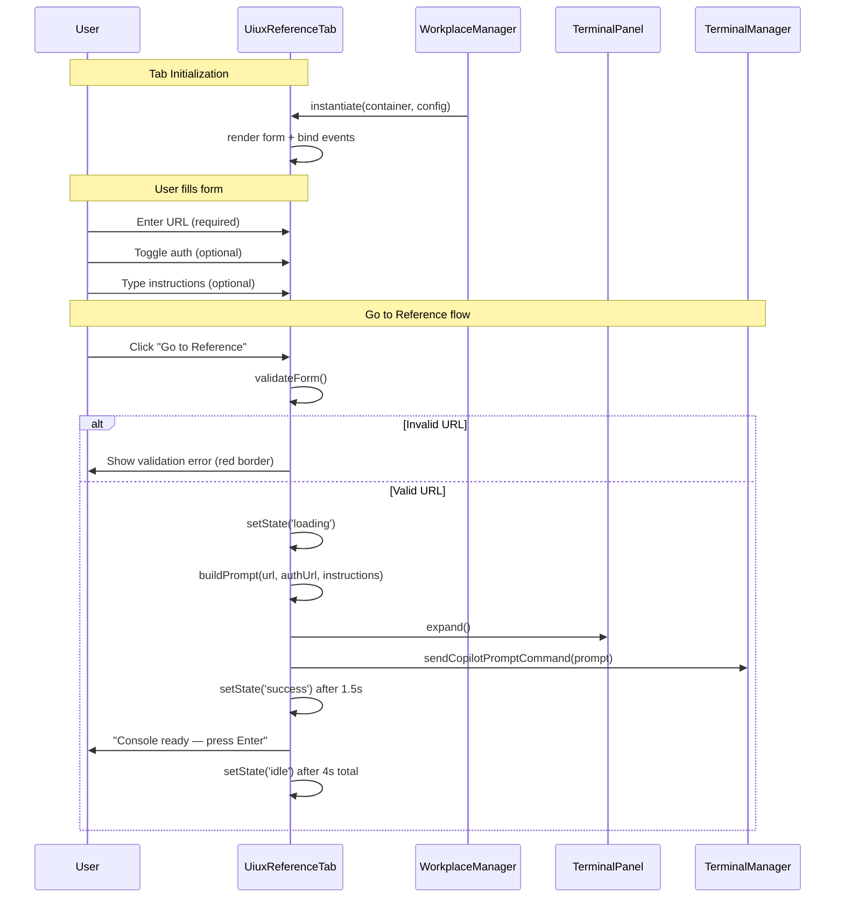
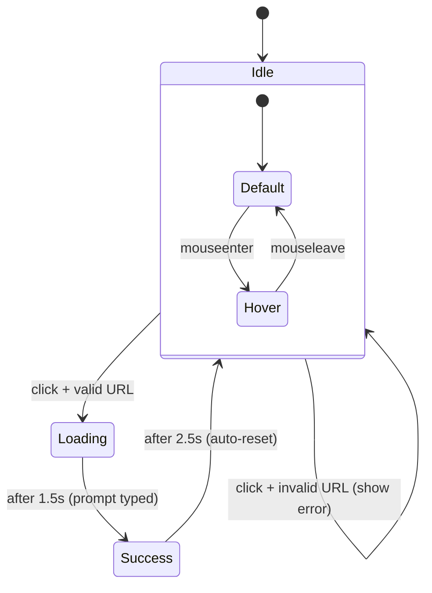
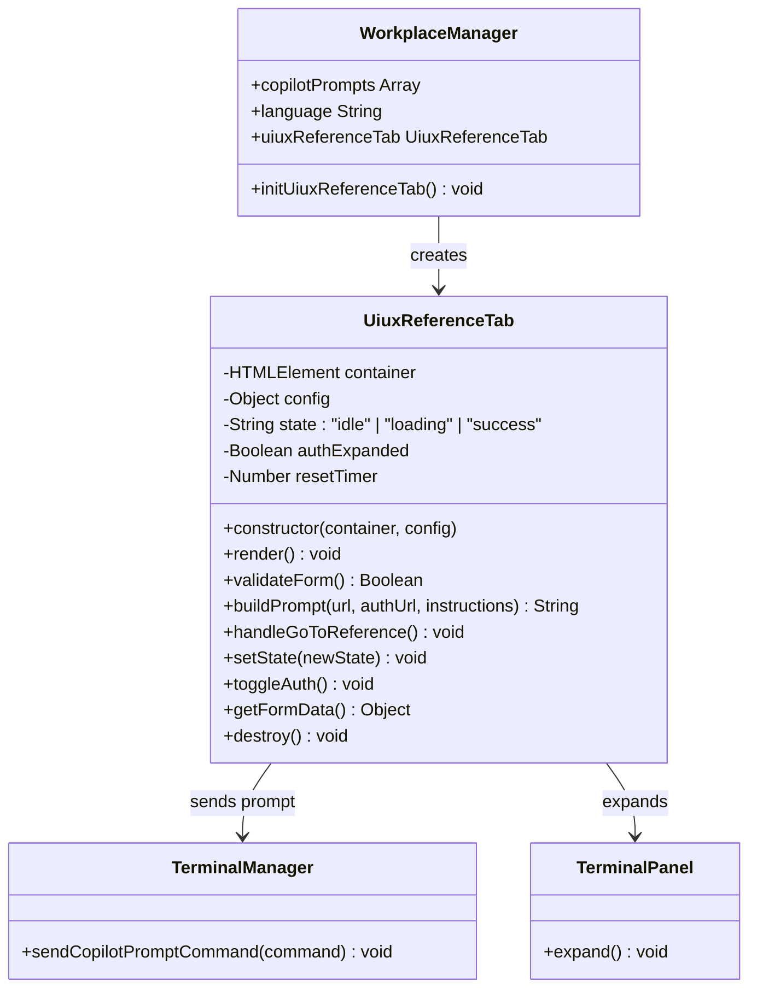

# Technical Design: UIUX Reference Tab & Console Integration

> Feature ID: FEATURE-030-A | Version: v1.0 | Last Updated: 02-13-2026

---

## Part 1: Agent-Facing Summary

> **Purpose:** Quick reference for AI agents navigating large projects.
> **📌 AI Coders:** Focus on this section for implementation context.

### Key Components Implemented

| Component | Responsibility | Scope/Impact | Tags |
|-----------|----------------|--------------|------|
| `uiux-reference-tab.js` | Tab UI, form state, validation, button state machine, console integration | Frontend feature module | #frontend #workplace #uiux-reference #tab |
| `uiux-reference-tab.css` | Styling for UIUX Reference tab — editorial light theme, animations | Frontend stylesheet | #frontend #css #uiux-reference #animations |
| `workplace.html` (modified) | Add third tab (UIUX Reference) to Workplace tab bar and tab pane container | Jinja2 template modification | #template #workplace #tab |
| `workplace.js` (modified) | Register UIUX Reference tab, load `copilot-prompt.json` `uiux-reference` prompt | Workplace manager integration | #frontend #workplace #integration |
| `copilot-prompt.json` (modified) | Add `uiux-reference` prompt template under `ideation.prompts` | Config file | #config #prompt #uiux-reference |

### Scope & Boundaries

**In Scope:**
- Third tab in Workplace idea creation panel (HTML + CSS + JS)
- URL input with validation, collapsible auth section, instructions textarea
- "Go to Reference" button with 3-state machine (idle → loading → success → idle)
- Console integration: find/create terminal session, auto-type prompt
- `copilot-prompt.json` entry for `uiux-reference` prompt
- Form state preservation across tab switches
- Flow preview section

**Out of Scope:**
- Agent skill execution (FEATURE-030-B)
- Toolbar injection (FEATURE-030-B)
- MCP server (FEATURE-033)
- Backend API changes (no new Flask routes needed)

### Dependencies

| Dependency | Source | Design Link | Usage Description |
|------------|--------|-------------|-------------------|
| `WorkplaceManager` | FEATURE-008 | workplace.js | Tab registration, Copilot prompt loading, panel layout |
| `TerminalManager` | FEATURE-005/029 | terminal-v2.js | `sendCopilotPromptCommand()` for auto-typing prompt into console |
| `terminalPanel` | FEATURE-005/029 | terminal-v2.js | `expand()` to show terminal panel before auto-typing |
| `copilot-prompt.json` | FEATURE-008 | `/api/config/copilot-prompt` | Load `uiux-reference` prompt template at runtime |
| Bootstrap 5 | External | getbootstrap.com | `data-bs-toggle="tab"` for tab switching, Bootstrap Icons |
| Google Fonts | External | fonts.googleapis.com | Fraunces (display serif) + Outfit (body sans) |

### Major Flow

1. **Tab Render:** Workplace loads → third tab "UIUX Reference" rendered with NEW badge → `UiuxReferenceTab` class instantiated
2. **Form Input:** User enters URL (required), optionally expands auth section + enters auth URL, optionally types extra instructions
3. **Go to Reference:** User clicks button → validation → button enters loading state → `window.terminalPanel.expand()` → `window.terminalManager.sendCopilotPromptCommand(prompt)` → button enters success state → auto-reset to idle after 4s
4. **Prompt Format:** `copilot execute uiux-reference --url {url} [--auth-url {auth_url}] [--extra "{instructions}"]`

### Usage Example

```javascript
// UiuxReferenceTab is auto-instantiated by WorkplaceManager
// No manual instantiation needed

// Internal flow (for reference):
const tab = new UiuxReferenceTab(containerElement, {
  copilotPrompts: workplaceManager.copilotPrompts,
  language: workplaceManager.language
});

// When user clicks "Go to Reference":
// 1. Validates URL
// 2. Builds prompt from copilot-prompt.json template
// 3. Expands terminal panel
// 4. Auto-types: "copilot execute uiux-reference --url https://example.com"
// 5. Button transitions: idle → loading (1.5s) → success (2.5s) → idle
```

```json
// copilot-prompt.json addition:
{
  "id": "uiux-reference",
  "icon": "bi-palette2",
  "prompt-details": [
    {
      "language": "en",
      "label": "UIUX Reference",
      "command": "copilot execute uiux-reference --url <target-url>"
    }
  ]
}
```

---

## Part 2: Implementation Guide

> **Purpose:** Human-readable details for developers.
> **📌 Emphasis on visual diagrams for comprehension.**

### Architecture Overview

```
┌─────────────────────────────────────────────────────────────┐
│  workplace.html (Jinja2 Template)                           │
│  ┌─────────────────────────────────────────────────────────┐│
│  │  Tab Bar: [Compose] [Upload] [UIUX Reference + NEW]    ││
│  │  ─────────────────────────────────────────────────────  ││
│  │  Tab Pane: #uiux-reference-pane                        ││
│  │  ┌───────────────────────────────────────────────────┐ ││
│  │  │  URL Input (required)                              │ ││
│  │  │  Auth Prerequisite (collapsible, optional)         │ ││
│  │  │  Extra Instructions (optional)                     │ ││
│  │  │  [Go to Reference] button (3-state)                │ ││
│  │  │  Flow Preview (4-step indicator)                   │ ││
│  │  └───────────────────────────────────────────────────┘ ││
│  └─────────────────────────────────────────────────────────┘│
└─────────────────────────────────────────────────────────────┘
        │                           │
        ▼                           ▼
  uiux-reference-tab.js      uiux-reference-tab.css
  (UiuxReferenceTab class)    (editorial light theme)
        │
        ▼
  ┌─────────────────┐    ┌──────────────────────┐
  │ terminalPanel    │    │ copilot-prompt.json  │
  │ .expand()        │    │ GET /api/config/     │
  └────────┬─────────┘    │ copilot-prompt       │
           │              └──────────────────────┘
           ▼
  ┌─────────────────┐
  │ terminalManager  │
  │ .sendCopilot     │
  │  PromptCommand() │
  └──────────────────┘
```

### Workflow Diagram



### State Diagram — Button State Machine



### Class Diagram



### Component Breakdown (Mockup-Derived)

Components derived from [uiux-reference-tab-v2.html](mockups/uiux-reference-tab-v2.html):

#### 1. Tab Button

```html
<button class="nav-link" id="uiux-reference-tab"
        data-bs-toggle="tab" data-bs-target="#uiux-reference-pane">
  <i class="bi bi-palette2"></i>
  <span>UIUX Reference</span>
  <span class="new-badge">NEW</span>
</button>
```

**CSS:** Active state uses `::after` underline (scaleX 0→1 animation). `.new-badge` has pulse-badge keyframe (opacity 0.4→1, 2.5s infinite).

#### 2. URL Input Group

```html
<div class="input-group uiux-ref-input-group">
  <label class="uiux-ref-label">TARGET PAGE URL</label>
  <div class="uiux-ref-input-wrapper">
    <i class="bi bi-globe2 uiux-ref-input-icon"></i>
    <input type="url" id="uiux-ref-url" class="uiux-ref-input"
           placeholder="https://example.com/page-to-reference" required>
  </div>
</div>
```

**CSS:** Input has 38px left padding for icon. Focus state: border `var(--accent)`, box-shadow `0 0 0 3px var(--accent-glow)`, background white. Error state: border `var(--danger)`.

#### 3. Auth Collapsible Section

```html
<div class="uiux-ref-auth-section">
  <button class="uiux-ref-auth-toggle" aria-expanded="false">
    <i class="bi bi-shield-lock"></i>
    <span>Authentication Prerequisite</span>
    <span class="uiux-ref-optional">(optional)</span>
    <i class="bi bi-chevron-right uiux-ref-chevron"></i>
  </button>
  <div class="uiux-ref-auth-content" hidden>
    <div class="uiux-ref-input-wrapper">
      <i class="bi bi-key uiux-ref-input-icon"></i>
      <input type="url" id="uiux-ref-auth-url" class="uiux-ref-input"
             placeholder="https://example.com/login">
    </div>
    <div class="uiux-ref-auth-hint">
      <i class="bi bi-info-circle"></i>
      <span>The agent will open this URL first so you can log in, then redirect to your target page.</span>
    </div>
  </div>
</div>
```

**CSS:** Chevron rotates 90° on `aria-expanded="true"` (300ms transition). Content slides in/out with `max-height` transition.

#### 4. Extra Instructions Textarea

```html
<div class="input-group uiux-ref-input-group">
  <label class="uiux-ref-label">
    EXTRA INSTRUCTIONS <span class="uiux-ref-optional">(optional)</span>
  </label>
  <textarea id="uiux-ref-instructions" class="uiux-ref-textarea"
            placeholder="e.g., Focus on the navigation bar and color palette..."
            maxlength="1000"></textarea>
  <div class="uiux-ref-char-count"><span>0</span>/1000</div>
</div>
```

**CSS:** `min-height: 76px`, `resize: vertical`, same focus styles as URL input.

#### 5. Go to Reference Button

```html
<button id="uiux-ref-go-btn" class="uiux-ref-btn" data-state="idle">
  <i class="bi bi-box-arrow-up-right uiux-ref-btn-icon"></i>
  <span class="uiux-ref-btn-text">Go to Reference</span>
</button>
```

**States (via `data-state` attribute):**

| State | Icon | Text | Background | Duration |
|-------|------|------|------------|----------|
| `idle` | `bi-box-arrow-up-right` | "Go to Reference" | `var(--accent)` | — |
| `loading` | spinner (CSS animation) | "Opening console..." | `var(--accent-light)` | 1.5s |
| `success` | `bi-check-lg` | "Console ready — press Enter" | `var(--emerald)` | 2.5s |

**CSS:** Full width, `border-radius: var(--radius-md)`, `padding: 14px`, `font-weight: 600`. Hover: `translateY(-1px)` + enhanced shadow. `pointer-events: none` during loading/success.

#### 6. Flow Preview

```html
<div class="uiux-ref-flow-preview">
  <div class="uiux-ref-flow-step">
    <i class="bi bi-link-45deg"></i><span>Enter URL</span>
  </div>
  <i class="bi bi-arrow-right uiux-ref-flow-arrow"></i>
  <div class="uiux-ref-flow-step">
    <i class="bi bi-terminal"></i><span>Console Opens</span>
  </div>
  <i class="bi bi-arrow-right uiux-ref-flow-arrow"></i>
  <div class="uiux-ref-flow-step">
    <i class="bi bi-cursor"></i><span>Agent Navigates</span>
  </div>
  <i class="bi bi-arrow-right uiux-ref-flow-arrow"></i>
  <div class="uiux-ref-flow-step">
    <i class="bi bi-hand-index"></i><span>Pick Elements</span>
  </div>
</div>
```

**CSS:** Flex row, `background: var(--accent-bg)`, `border-radius: var(--radius-lg)`, `padding: 14px 20px`. Steps and arrows equally spaced. Icons in accent color.

### CSS Architecture

**File:** `src/x_ipe/static/css/uiux-reference-tab.css`

All selectors prefixed with `.uiux-ref-` to avoid conflicts with existing Workplace styles. CSS variables from the mockup (defined in `:root`) are used for theming consistency. The page-level variables (`--bg-page`, `--bg-panel`, etc.) are already available from Workplace's existing CSS; only UIUX-Reference-specific variables need to be added if not present.

**Key animations (defined in the CSS file):**
- `@keyframes fadeSlideIn` — tab pane entrance (translateY 8px → 0, opacity 0 → 1, 350ms)
- `@keyframes pulse-badge` — NEW badge pulse (opacity 0.4 → 1, 2.5s infinite)
- `@keyframes spin` — loading spinner (rotate 360°, 0.8s linear infinite)

### JavaScript Architecture

**File:** `src/x_ipe/static/js/features/uiux-reference-tab.js`

**Class: `UiuxReferenceTab`**

```javascript
class UiuxReferenceTab {
  constructor(container, config) {
    this.container = container;           // #uiux-reference-pane element
    this.config = config;                  // { copilotPrompts, language }
    this.state = 'idle';                   // 'idle' | 'loading' | 'success'
    this.authExpanded = false;
    this.resetTimer = null;
    this._bindEvents();
  }

  // Render tab pane content (called once)
  render() { /* builds innerHTML from component templates above */ }

  // Validate URL field — returns true if valid http(s) URL
  validateForm() {
    const url = this.container.querySelector('#uiux-ref-url').value.trim();
    if (!url || !/^https?:\/\/.+/.test(url)) {
      this._showValidationError();
      return false;
    }
    return true;
  }

  // Build prompt string from copilot-prompt.json template + form values
  buildPrompt(url, authUrl, instructions) {
    // Find 'uiux-reference' prompt in copilotPrompts
    // Replace <target-url> placeholder with actual URL
    // Append --auth-url and --extra flags if provided
    // Fallback to hardcoded template if prompt not found
  }

  // Main action handler
  handleGoToReference() {
    if (this.state !== 'idle') return;
    if (!this.validateForm()) return;

    const { url, authUrl, instructions } = this.getFormData();
    const prompt = this.buildPrompt(url, authUrl, instructions);

    this.setState('loading');

    // Expand terminal and send prompt
    if (window.terminalPanel) window.terminalPanel.expand();
    if (window.terminalManager) {
      window.terminalManager.sendCopilotPromptCommand(prompt);
    }

    // Transition to success after 1.5s
    setTimeout(() => this.setState('success'), 1500);
  }

  // Button state machine
  setState(newState) {
    if (this.resetTimer) clearTimeout(this.resetTimer);
    this.state = newState;
    const btn = this.container.querySelector('#uiux-ref-go-btn');
    btn.dataset.state = newState;
    // Update icon + text based on state
    // If success, schedule reset to idle after 2.5s
    if (newState === 'success') {
      this.resetTimer = setTimeout(() => this.setState('idle'), 2500);
    }
  }

  // Toggle auth section expand/collapse
  toggleAuth() {
    this.authExpanded = !this.authExpanded;
    // Toggle aria-expanded, show/hide content, rotate chevron
  }

  // Get form values
  getFormData() {
    return {
      url: this.container.querySelector('#uiux-ref-url').value.trim(),
      authUrl: this.container.querySelector('#uiux-ref-auth-url')?.value.trim() || '',
      instructions: this.container.querySelector('#uiux-ref-instructions')?.value.trim() || ''
    };
  }

  // Cleanup
  destroy() {
    if (this.resetTimer) clearTimeout(this.resetTimer);
  }
}
```

### Config Change — copilot-prompt.json

Add to `ideation.prompts` array:

```json
{
  "id": "uiux-reference",
  "icon": "bi-palette2",
  "prompt-details": [
    {
      "language": "en",
      "label": "UIUX Reference",
      "command": "copilot execute uiux-reference --url <target-url>"
    },
    {
      "language": "zh",
      "label": "UIUX参考",
      "command": "copilot execute uiux-reference --url <target-url>"
    }
  ]
}
```

**Runtime:** `WorkplaceManager` already loads prompts via `GET /api/config/copilot-prompt` and passes them to the tab. The `buildPrompt()` method:
1. Finds the `uiux-reference` prompt by `id`
2. Resolves language-specific command
3. Replaces `<target-url>` with actual URL
4. Appends `--auth-url {authUrl}` if auth URL is provided
5. Appends `--extra "{instructions}"` if instructions provided (shell-escaped)
6. Falls back to hardcoded template if prompt not found in config

### Template Change — workplace.html

Add to the tab bar (after Upload tab button):

```html
<!-- UIUX Reference Tab (FEATURE-030-A) -->
<button class="nav-link" id="uiux-reference-tab"
        data-bs-toggle="tab" data-bs-target="#uiux-reference-pane"
        role="tab" aria-controls="uiux-reference-pane" aria-selected="false">
  <i class="bi bi-palette2"></i>
  <span>UIUX Reference</span>
  <span class="uiux-ref-new-badge">NEW</span>
</button>
```

Add to the tab content (after Upload pane):

```html
<!-- UIUX Reference Pane (FEATURE-030-A) -->
<div class="tab-pane fade" id="uiux-reference-pane" role="tabpanel"
     aria-labelledby="uiux-reference-tab">
  <!-- Content rendered by UiuxReferenceTab.render() -->
</div>
```

Add CSS/JS includes:

```html
<link rel="stylesheet" href="{{ url_for('static', filename='css/uiux-reference-tab.css') }}">
<script src="{{ url_for('static', filename='js/features/uiux-reference-tab.js') }}"></script>
```

### WorkplaceManager Integration

Add to `WorkplaceManager` class in `workplace.js`:

```javascript
// In constructor or init:
this.uiuxReferenceTab = null;

// After DOMContentLoaded and copilot prompts loaded:
initUiuxReferenceTab() {
  const pane = document.getElementById('uiux-reference-pane');
  if (pane) {
    this.uiuxReferenceTab = new UiuxReferenceTab(pane, {
      copilotPrompts: this.copilotPrompts,
      language: this.language
    });
    this.uiuxReferenceTab.render();
  }
}
```

### Implementation Steps

1. **Config:** Add `uiux-reference` prompt to `copilot-prompt.json`
2. **CSS:** Create `uiux-reference-tab.css` with all styles from mockup (colors, typography, animations, component styles). Use `.uiux-ref-` prefix namespace.
3. **JS:** Create `uiux-reference-tab.js` with `UiuxReferenceTab` class (form rendering, validation, state machine, auth toggle, console integration, character counter)
4. **Template:** Modify `workplace.html` — add tab button, tab pane, CSS/JS includes
5. **Integration:** Modify `workplace.js` — instantiate `UiuxReferenceTab` after prompts load
6. **Fonts:** Add Fraunces + Outfit Google Fonts link to `base.html` (or `workplace.html` if scoped)

### Edge Cases & Error Handling

| Scenario | Handling |
|----------|----------|
| No idle terminal session | `sendCopilotPromptCommand()` handles session creation internally (existing behavior) |
| Max sessions reached (10) | TerminalManager shows toast. Button resets to idle. |
| `copilot-prompt.json` missing `uiux-reference` key | Fallback to hardcoded: `"copilot execute uiux-reference --url <target-url>"` |
| Invalid URL (no http/https prefix) | Red border on input, button stays idle, no console action |
| Instructions > 1000 chars | Textarea has `maxlength="1000"`, character counter shows remaining |
| Shell-unsafe characters in `--extra` | Wrap value in double quotes, escape internal quotes: `--extra "user's \"quoted\" text"` |
| Rapid button clicks during loading/success | `if (this.state !== 'idle') return;` guard prevents re-entry |
| Tab switch during loading | Timer continues, button shows correct state on return. Form data preserved. |
| Browser offline | `sendCopilotPromptCommand` will fail silently. Button transitions to success regardless (prompt was typed, not executed). |

### File Summary

| File | Action | Description |
|------|--------|-------------|
| `src/x_ipe/static/css/uiux-reference-tab.css` | Create | All styles for UIUX Reference tab |
| `src/x_ipe/static/js/features/uiux-reference-tab.js` | Create | `UiuxReferenceTab` class |
| `src/x_ipe/templates/workplace.html` | Modify | Add tab button, tab pane, CSS/JS includes |
| `src/x_ipe/static/js/features/workplace.js` | Modify | Instantiate `UiuxReferenceTab` |
| `x-ipe-docs/config/copilot-prompt.json` | Modify | Add `uiux-reference` prompt |
| `src/x_ipe/templates/base.html` | Modify (if needed) | Add Google Fonts for Fraunces + Outfit |

---

## Design Change Log

| Date | Phase | Change Summary |
|------|-------|----------------|
| 02-13-2026 | Initial Design | Initial technical design created. Frontend-only feature: new tab in Workplace panel with form UI, 3-state button, and console integration via existing TerminalManager API. No new Flask routes needed. |
