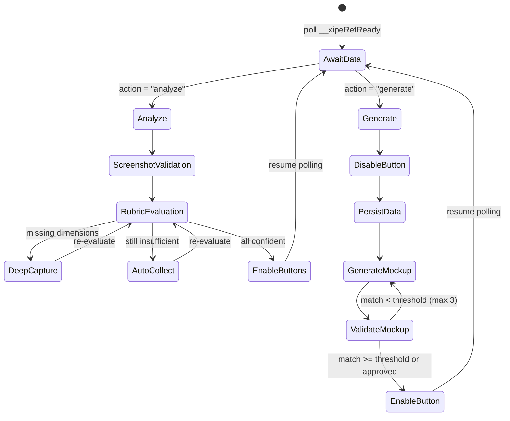
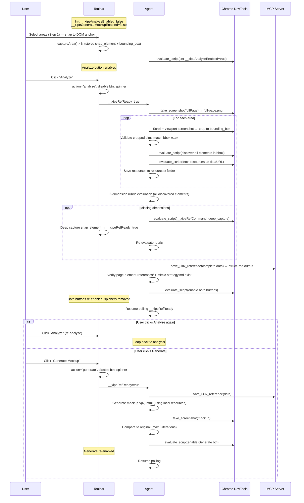

# Technical Design: Copy Design as Mockup Mode

> Feature ID: FEATURE-030-B-MOCKUP
> Version: v2.3
> Status: Designed
> Last Updated: 02-15-2026

## Version History

| Version | Date | Description | Change Request |
|---------|------|-------------|----------------|
| v2.0 | 02-14-2026 | Initial design — reference to parent FEATURE-030-B technical design | [CR-002](../FEATURE-030-B/CR-002.md) |
| v2.1 | 02-14-2026 | Button lifecycle, screenshot validation, decoupled analyze/generate, agent auto-collection | [CR-001](./CR-001.md) |
| v2.3 | 02-15-2026 | Area semantics (snap as anchor), exact area screenshots, element discovery, resource download, structured folder output | [CR-003](./CR-003.md) |

## Reference

This feature builds upon the parent design:

→ **[FEATURE-030-B Technical Design](../FEATURE-030-B/technical-design.md#24-mockup-mode-xipe-toolbar-mockupjs)**

Sections 2.4, 2.6, 2.7, 2.9 remain applicable for base functionality. This document covers the v2.1 enhancements.

---

## Part 1: Agent-Facing Summary

### Key Components Modified

| Component | Responsibility | Scope/Impact | Tags |
|-----------|----------------|--------------|------|
| `xipe-toolbar-mockup.js` | Mockup mode: button lifecycle, action signaling, processing animations, area data model | Modified: `renderAnalyze()`, `renderGenerate()`, `captureArea()` stores snap_element | #toolbar #mockup #buttons #lifecycle #area |
| `xipe-toolbar-core.js` | Core shell: global variables, deep capture, area data schema | Modified: add `__xipeAnalyzeEnabled`, `__xipeGenerateMockupEnabled` init; `areas[]` data store | #toolbar #core #globals #area |
| `SKILL.md` (uiux-reference) | Agent skill: area element discovery, exact screenshots, resource download, structured output | Modified: `process_mockup` operation — analyze flow rewritten for v2.3 | #skill #agent #workflow #area #resources |
| `toolbar.min.js` | Minified build output | Rebuilt after source changes | #build #minified |

### Dependencies

| Dependency | Source | Usage Description |
|------------|--------|-------------------|
| FEATURE-030-B v2.0 | Internal | Toolbar shell: `__xipeToast`, `__xipeRegisterMode`, `__xipeRefData`, `__xipeRefReady`, `__xipeRefCommand` |
| FEATURE-033 | Internal | MCP `save_uiux_reference` for data persistence |
| Chrome DevTools MCP | External | `evaluate_script`, `take_screenshot`, `take_snapshot`, `list_network_requests`, `get_network_request` |

### Major Flows

#### Flow 1: Button Lifecycle

```
1. Toolbar initializes → __xipeAnalyzeEnabled = false, __xipeGenerateMockupEnabled = false
2. Both buttons render as disabled
3. User selects components → buttons remain disabled (agent-controlled, not component-count-controlled)
4. Agent detects components via polling → sets __xipeAnalyzeEnabled = true
5. User clicks Analyze → button disables + spinner, __xipeRefReady = true, action = "analyze"
6. Agent processes → sets __xipeAnalyzeEnabled = true, __xipeGenerateMockupEnabled = true
7. User clicks Generate Mockup → button disables + spinner, __xipeRefReady = true, action = "generate"
8. Agent processes → sets __xipeGenerateMockupEnabled = true
```

#### Flow 2: Decoupled Analyze/Generate

```
1. Agent receives __xipeRefData with action = "analyze"
2. Agent runs analysis (rubric + validation + auto-collection)
3. Agent enables both buttons via evaluate_script
4. Agent resumes polling __xipeRefReady (does NOT auto-trigger generation)
5. Next signal:
   - action = "analyze" → re-analyze (loop back to step 2)
   - action = "generate" → proceed to mockup generation
6. After generation → re-enable Generate, resume polling
```

#### Flow 3: Exact Area Screenshots (v2.3)

```
1. Agent scrolls to ensure area bounding_box is in viewport
2. Agent takes viewport screenshot via take_screenshot()
3. Agent uses evaluate_script to crop canvas to exact bounding_box (x, y, width, height)
4. Validates: cropped dimensions match bounding_box within 1px
5. Saves cropped screenshot as screenshots/{area-id}.png
6. Does NOT use DOM element UID for screenshots
```

#### Flow 4: Area Element Discovery (v2.3)

```
1. Agent uses evaluate_script to enumerate ALL elements in page
2. For each element: getBoundingClientRect() → check intersection with area bounding_box
3. Include: elements fully inside, partially overlapping, position:absolute/fixed overlays
4. Classify each: img, svg, canvas, video, div, span, etc.
5. Extract: computed styles, tag, className, src attributes
6. Store as area.discovered_elements[] for rubric evaluation
```

#### Flow 5: Resource Download (v2.3)

```
1. From discovered_elements, extract resource URLs:
   - img.src, img.srcset
   - svg.outerHTML (inline)
   - canvas.toDataURL()
   - video.poster, video.src
   - computed background-image URLs
   - @font-face URLs from stylesheets
2. For each resource: evaluate_script with fetch() to download as data URL
3. Save to resources/ folder with naming: {area-id}-img-{N}.{ext}, {area-id}-svg-{N}.svg, etc.
4. Track downloaded paths for summarized-uiux-reference.md
```

#### Flow 6: Structured Folder Output (v2.3)

```
1. Take full-page screenshot → screenshots/full-page.png
2. Take per-area screenshot → screenshots/{area-id}.png
3. Call save_uiux_reference with complete data (full outer_html, computed_styles)
4. Service generates:
   - page-element-references/summarized-uiux-reference.md
   - page-element-references/resources/{area-id}-structure.html
   - page-element-references/resources/{area-id}-styles.css
   - mimic-strategy.md
5. Verify folder structure exists after save
```

### Usage Example

```javascript
// Toolbar-side: area data model (in __xipeRefData.areas[])
{
  id: 'area-1',
  selector: 'section.hero',          // snap_element selector (anchor)
  tag: 'SECTION',                    // snap_element tag
  bounding_box: { x: 0, y: 80, width: 1200, height: 400 },  // may differ from snap element
  instruction: 'Hero section with CTA button',
  screenshot_dataurl: '...',         // cropped to bounding_box
  html_css: { level: 'minimal', computed_styles: {...}, outer_html: '...' }
}

// Agent-side: area element discovery
evaluate_script(() => {
  const bbox = { x: 0, y: 80, width: 1200, height: 400 };
  const all = document.querySelectorAll('*');
  const discovered = [];
  for (const el of all) {
    const r = el.getBoundingClientRect();
    if (r.right > bbox.x && r.left < bbox.x + bbox.width &&
        r.bottom > bbox.y && r.top < bbox.y + bbox.height) {
      discovered.push({
        tag: el.tagName, selector: el.className,
        rect: { x: r.x, y: r.y, width: r.width, height: r.height }
      });
    }
  }
  return discovered;
});

// Agent-side: exact area screenshot (coordinate-based crop)
evaluate_script((bbox) => {
  return new Promise(resolve => {
    const canvas = document.createElement('canvas');
    canvas.width = bbox.width; canvas.height = bbox.height;
    // Use html2canvas or CDP Page.captureScreenshot with clip
    resolve(canvas.toDataURL('image/png'));
  });
}, { x: 0, y: 80, width: 1200, height: 400 });

// Agent-side: resource download via fetch
evaluate_script((url) => {
  return fetch(url).then(r => r.blob()).then(b => {
    return new Promise(resolve => {
      const reader = new FileReader();
      reader.onload = () => resolve(reader.result);
      reader.readAsDataURL(b);
    });
  });
}, 'https://github.githubassets.com/images/hero.png');

// Agent-side: enable buttons after analysis
evaluate_script(() => {
  window.__xipeAnalyzeEnabled = true;
  window.__xipeGenerateMockupEnabled = true;
});
```

---

## Part 2: Implementation Guide

### 2.1 Toolbar Changes: Global Variables

**File:** `src/x_ipe/static/js/injected/xipe-toolbar-core.js`

Add to the global initialization block (after existing `__xipeRefData`, `__xipeRefReady`, `__xipeRefCommand`):

```javascript
window.__xipeAnalyzeEnabled = false;
window.__xipeGenerateMockupEnabled = false;
```

These are simple booleans. The agent sets them via `evaluate_script`. The toolbar polls them to update button states.

### 2.2 Toolbar Changes: Button State Polling

**File:** `src/x_ipe/static/js/injected/xipe-toolbar-mockup.js`

Add a polling interval inside the `MockupModeInit` function that checks the global variables and updates button disabled states:

```javascript
// Poll agent-controlled button states every 500ms
const btnPollId = setInterval(() => {
  const analyzeBtn = container.querySelector('[data-xipe-analyze]');
  const generateBtn = container.querySelector('[data-xipe-generate]');
  if (analyzeBtn) {
    analyzeBtn.disabled = !window.__xipeAnalyzeEnabled;
    if (window.__xipeAnalyzeEnabled) {
      analyzeBtn.classList.remove('xipe-btn-processing');
    }
  }
  if (generateBtn) {
    generateBtn.disabled = !window.__xipeGenerateMockupEnabled;
    if (window.__xipeGenerateMockupEnabled) {
      generateBtn.classList.remove('xipe-btn-processing');
    }
  }
}, 500);
```

**Data attributes:** Add `data-xipe-analyze` to the Analyze button and `data-xipe-generate` to the Generate Mockup button for stable querySelector targeting.

### 2.3 Toolbar Changes: Analyze Button Handler

**File:** `src/x_ipe/static/js/injected/xipe-toolbar-mockup.js` — `renderAnalyze()` function (lines ~289-308)

Replace the current onclick handler:

```javascript
// Before (v2.0):
btn.onclick = () => {
  window.__xipeRefData.mode = 'mockup';
  window.__xipeRefReady = true;
  window.__xipeToast('Analyzing components...', 'progress');
};

// After (v2.1):
btn.setAttribute('data-xipe-analyze', '');
btn.disabled = !window.__xipeAnalyzeEnabled;
btn.onclick = () => {
  window.__xipeRefData.mode = 'mockup';
  window.__xipeRefData.action = 'analyze';
  window.__xipeAnalyzeEnabled = false;
  btn.disabled = true;
  btn.classList.add('xipe-btn-processing');
  window.__xipeRefReady = true;
  window.__xipeToast('Analyzing components...', 'progress');
};
```

### 2.4 Toolbar Changes: Generate Button Handler

**File:** `src/x_ipe/static/js/injected/xipe-toolbar-mockup.js` — `renderGenerate()` function (lines ~311-331)

Replace the current onclick handler:

```javascript
// Before (v2.0):
btn.onclick = () => {
  window.__xipeRefData.mode = 'mockup';
  window.__xipeRefReady = true;
  window.__xipeToast('Saving reference data...', 'progress');
};

// After (v2.1):
btn.setAttribute('data-xipe-generate', '');
btn.disabled = !window.__xipeGenerateMockupEnabled;
btn.onclick = () => {
  window.__xipeRefData.mode = 'mockup';
  window.__xipeRefData.action = 'generate';
  window.__xipeGenerateMockupEnabled = false;
  btn.disabled = true;
  btn.classList.add('xipe-btn-processing');
  window.__xipeRefReady = true;
  window.__xipeToast('Generating mockup...', 'progress');
};
```

### 2.5 Toolbar Changes: Processing Animation CSS

Add CSS class for button processing state. This goes inside the toolbar's style injection (in core or mockup module):

```css
.xipe-btn-processing {
  position: relative;
  pointer-events: none;
  opacity: 0.7;
}
.xipe-btn-processing::after {
  content: '';
  position: absolute;
  right: 8px;
  top: 50%;
  transform: translateY(-50%);
  width: 14px;
  height: 14px;
  border: 2px solid rgba(255,255,255,0.3);
  border-top-color: #fff;
  border-radius: 50%;
  animation: xipe-spin 0.6s linear infinite;
}
@keyframes xipe-spin {
  to { transform: translateY(-50%) rotate(360deg); }
}
```

### 2.6 Toolbar Changes: Action Field in __xipeRefData

The `action` field is a new string property on `__xipeRefData`. No schema change needed — it's just an additional property set before `__xipeRefReady = true`. The agent reads `result.action` to determine intent:

- `"analyze"` → run analysis cycle
- `"generate"` → run generation cycle

### 2.7 Agent Skill Changes: Decoupled process_mockup

**File:** `.github/skills/x-ipe-tool-uiux-reference/SKILL.md` — `process_mockup` operation

The operation is restructured into a state machine with two sub-operations:



#### Sub-operation: Analyze (v2.3)

```
1. Receive __xipeRefData with action = "analyze"
2. FULL-PAGE SCREENSHOT:
   - take_screenshot(fullPage: true, filePath: 'screenshots/full-page.png')
3. EXACT AREA SCREENSHOT (for each area):
   a. Scroll area.bounding_box into viewport
   b. Take viewport screenshot
   c. Crop to exact bounding_box coordinates (x, y, width, height)
   d. Validate cropped dimensions match within 1px
   e. Save as screenshots/{area-id}.png
4. AREA ELEMENT DISCOVERY (for each area):
   a. evaluate_script: enumerate ALL elements whose getBoundingClientRect()
      intersects area.bounding_box (not just snap element subtree)
   b. Classify: img, svg, canvas, video, dom
   c. Extract computed styles for all discovered elements
5. RESOURCE DOWNLOAD (for each area):
   a. From discovered elements, extract resource URLs
   b. Download each via evaluate_script fetch() (page-context, same-origin)
   c. Save to resources/ folder: {area-id}-img-{N}, {area-id}-svg-{N}, etc.
   d. Detect @font-face URLs from stylesheets
6. RUBRIC EVALUATION (6-dimension):
   a. Evaluate layout, typography, color, spacing, visual_effects, static_resources
      across ALL discovered elements (not just snap element)
   b. If any "missing": deep_capture via __xipeRefCommand (snap element)
   c. Re-evaluate with enriched data
7. STRUCTURED OUTPUT:
   a. Call save_uiux_reference with complete data (full outer_html, computed_styles)
   b. Verify page-element-references/ and mimic-strategy.md were created
   c. If missing, create manually from collected data
8. ENABLE BUTTONS:
   evaluate_script(() => {
     window.__xipeAnalyzeEnabled = true;
     window.__xipeGenerateMockupEnabled = true;
   })
9. RESUME POLLING __xipeRefReady (loop back to AwaitData)
```

#### Sub-operation: Generate

```
1. Receive __xipeRefData with action = "generate"
2. PERSIST: save_uiux_reference(data) — save before generation
3. GENERATE: create mockup with versioned filename
   - Scan existing files: mockup-v1.html, mockup-v2.html, ...
   - Determine next version number
   - Generate HTML/CSS mockup
4. VALIDATE: take screenshot of mockup, compare to original
   - If match < threshold: regenerate (max 3 iterations)
   - If 3 exhausted: ask user approval
5. RE-ENABLE:
   evaluate_script(() => {
     window.__xipeGenerateMockupEnabled = true;
   })
6. RESUME POLLING __xipeRefReady (loop back to AwaitData)
```

### 2.8 Agent Skill Changes: Exact Area Screenshots (v2.3)

The agent captures screenshots by coordinate-based cropping, NOT by DOM element UID:

```python
# Pseudocode for agent's exact area screenshot
for area in areas:
    bbox = area['bounding_box']  # {x, y, width, height}
    
    # Step 1: Scroll area into viewport
    evaluate_script(f"() => window.scrollTo({{ top: {bbox['y'] - 50}, behavior: 'instant' }})")
    
    # Step 2: Take viewport screenshot
    viewport_screenshot = take_screenshot()
    
    # Step 3: Crop to exact bounding_box via evaluate_script canvas crop
    # Or use CDP Page.captureScreenshot with clip parameter
    
    # Step 4: Validate dimensions match within 1px
    # Step 5: Save as screenshots/{area-id}.png
```

**Key principle:** Screenshot dimensions MUST match `bounding_box` exactly. The snap element UID is irrelevant for screenshots.

### 2.9 Agent Skill Changes: Area Element Discovery (v2.3)

During analysis, the agent discovers ALL DOM elements within each area's bounding_box:

```javascript
// evaluate_script injected into page
(bbox) => {
  const elements = document.querySelectorAll('*');
  const discovered = [];
  for (const el of elements) {
    if (el.closest('#xipe-toolbar-container')) continue;  // skip toolbar
    const rect = el.getBoundingClientRect();
    const intersects = (
      rect.right > bbox.x && rect.left < bbox.x + bbox.width &&
      rect.bottom > bbox.y && rect.top < bbox.y + bbox.height &&
      rect.width > 0 && rect.height > 0
    );
    if (intersects) {
      const styles = getComputedStyle(el);
      discovered.push({
        tag: el.tagName, id: el.id || null, classes: [...el.classList],
        rect: { x: rect.x, y: rect.y, width: rect.width, height: rect.height },
        type: el.tagName === 'IMG' ? 'image' : el.tagName === 'SVG' ? 'svg' :
              el.tagName === 'CANVAS' ? 'canvas' : el.tagName === 'VIDEO' ? 'video' : 'dom',
        src: el.src || null, srcset: el.srcset || null,
        backgroundImage: styles.backgroundImage !== 'none' ? styles.backgroundImage : null,
        computedStyles: { display: styles.display, position: styles.position,
          color: styles.color, backgroundColor: styles.backgroundColor,
          fontFamily: styles.fontFamily, fontSize: styles.fontSize, fontWeight: styles.fontWeight }
      });
    }
  }
  return discovered;
}
```

**Scope:** Captures ALL elements that visually appear within the bounding_box — siblings, overlapping absolutely-positioned elements, background layers.

### 2.10 Agent Skill Changes: Resource Download (v2.3)

After element discovery, the agent downloads static resources:

```javascript
// Download resource via page-context fetch (same-origin, avoids CORS)
evaluate_script((url) => {
  return fetch(url).then(r => r.blob()).then(b => new Promise(resolve => {
    const reader = new FileReader();
    reader.onload = () => resolve(reader.result);
    reader.readAsDataURL(b);
  })).catch(() => null);
}, resourceUrl);
```

**Resource types and naming:**
| Type | Source | Naming |
|------|--------|--------|
| Images | `` src, srcset, background-image | `{area-id}-img-{N}.{ext}` |
| SVGs | inline `<svg>` outerHTML, external src | `{area-id}-svg-{N}.svg` |
| Canvas | `<canvas>.toDataURL()` | `{area-id}-canvas-{N}.png` |
| Fonts | @font-face URLs from stylesheets | `{area-id}-font-{N}.woff2` |
| Video | `<video>` poster image | `{area-id}-poster-{N}.{ext}` |

**Font detection:** Query stylesheets for @font-face rules used by discovered elements:

```javascript
evaluate_script(() => {
  const fonts = [];
  for (const sheet of document.styleSheets) {
    try {
      for (const rule of sheet.cssRules) {
        if (rule instanceof CSSFontFaceRule) {
          fonts.push({ family: rule.style.getPropertyValue('font-family'),
                       src: rule.style.getPropertyValue('src') });
        }
      }
    } catch (e) { /* cross-origin — skip */ }
  }
  return fonts;
});
```

### 2.11 Versioned Mockup Files

Agent generates mockup files with auto-incrementing version suffix:

```
{idea_folder}/mockups/mockup-v1.html
{idea_folder}/mockups/mockup-v2.html
{idea_folder}/mockups/mockup-v3.html
```

Logic:
1. Scan `{idea_folder}/mockups/` for files matching `mockup-v*.html`
2. Extract version numbers, find max
3. New file = `mockup-v{max+1}.html`
4. If no existing files, start at `mockup-v1.html`

### 2.12 Build Impact

After toolbar source changes, rebuild minified output:

```bash
uv run python src/x_ipe/static/js/injected/build.py
```

This regenerates `toolbar.min.js` (and individual mode .min.js files) in the skill references directory.

### 2.13 Workflow Diagram: Complete Mockup Flow (v2.3)



### 2.14 Testing Strategy

| Test Category | Scope | Key Tests |
|---------------|-------|-----------|
| Unit: Button globals | Toolbar | `__xipeAnalyzeEnabled` / `__xipeGenerateMockupEnabled` init to `false` |
| Unit: Button polling | Toolbar | Buttons disable/enable based on global variable changes |
| Unit: Action field | Toolbar | Analyze click sets `action = "analyze"`, Generate sets `action = "generate"` |
| Unit: Processing CSS | Toolbar | `.xipe-btn-processing` class adds spinner, removes on re-enable |
| Unit: Area data model | Toolbar | `captureArea()` stores snap_element selector alongside bounding_box |
| Unit: Area ID format | Toolbar | Areas use `area-1`, `area-2` naming (not comp-XXX) |
| Skill: Exact screenshots | Agent | Screenshot cropped to bounding_box coordinates, not DOM element UID |
| Skill: Element discovery | Agent | All elements within bounding_box discovered (not just snap subtree) |
| Skill: Resource download | Agent | Images, SVGs, fonts downloaded to resources/ with correct naming |
| Skill: Structured output | Agent | page-element-references/, mimic-strategy.md, full-page.png generated |
| Skill: 6-dimension rubric | Agent | All 6 dimensions evaluated across discovered elements |
| Skill: Decoupled flow | Agent | After analysis, agent polls (no auto-trigger); respects action field |
| Skill: Versioned files | Agent | mockup-v1.html, mockup-v2.html naming, no overwrites |
| Integration: Full cycle | E2E | Select areas → Analyze (discover+download+structure) → Generate |

---

## Design Change Log

| Date | Version | Changes | CR |
|------|---------|---------|-----|
| 02-14-2026 | v2.0 | Initial design — reference to parent FEATURE-030-B | CR-002 |
| 02-14-2026 | v2.1 | Added: button lifecycle (2.1–2.5), action field (2.6), decoupled analyze/generate (2.7), screenshot validation (2.8), auto-collection (2.9), versioned files (2.10) | CR-001 |
| 02-15-2026 | v2.3 | Replaced: screenshot validation → exact area screenshots (2.8), auto-collection → area element discovery (2.9) + resource download (2.10). Updated: analyze sub-operation for v2.3 flow, sequence diagram (2.13), testing strategy (2.14). Added: structured folder output (Flow 6) | CR-003 |
