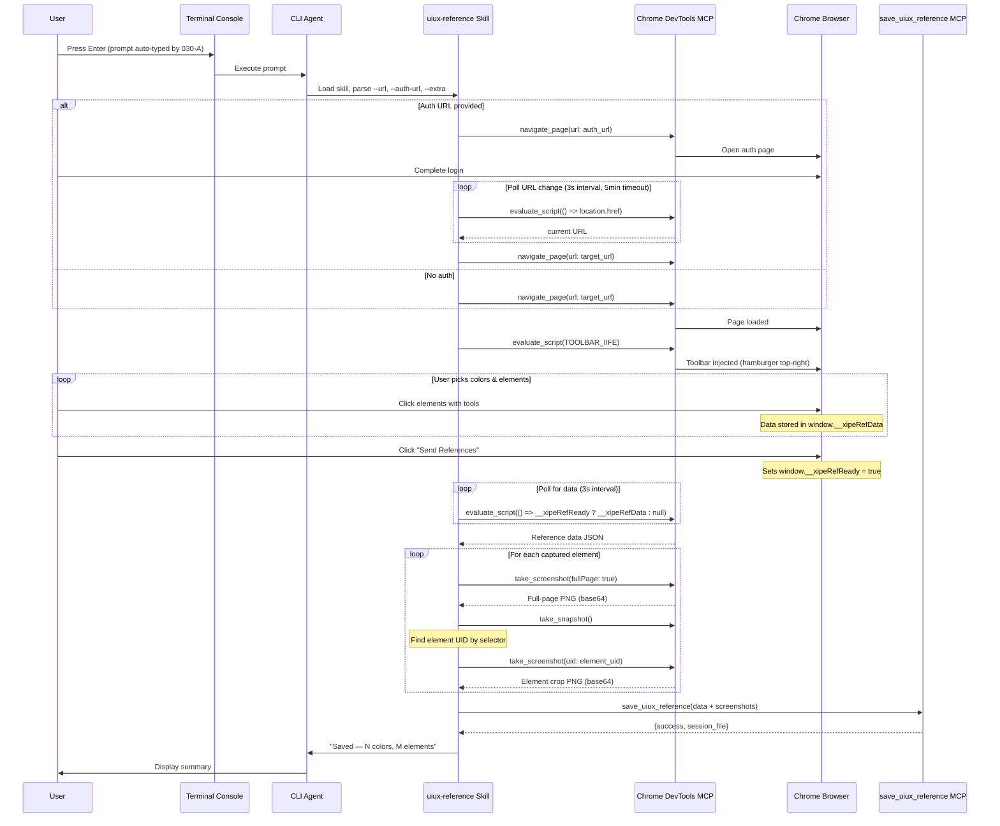
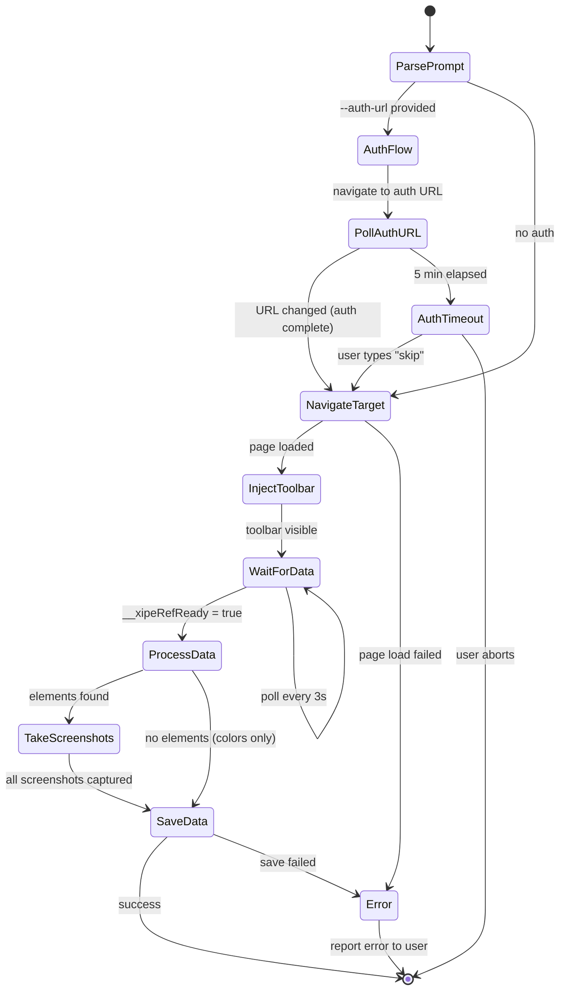
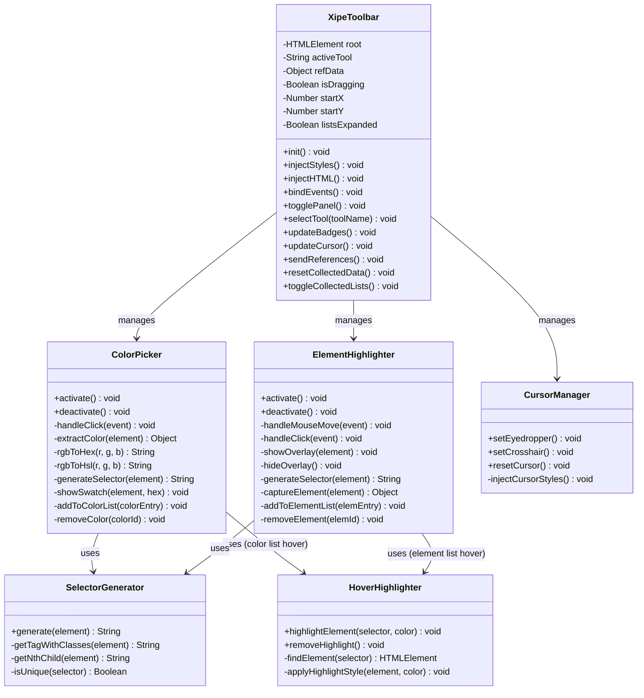
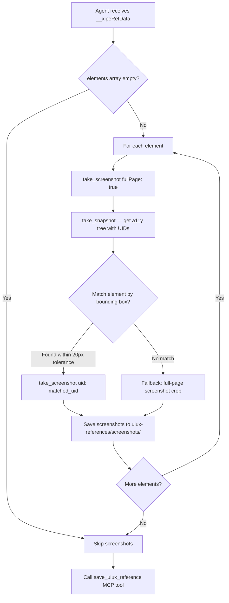

# Technical Design: UIUX Reference Agent Skill & Toolbar

> Feature ID: FEATURE-030-B | Version: v1.1 | Last Updated: 02-14-2026

---

## Part 1: Agent-Facing Summary

> **Purpose:** Quick reference for AI agents navigating large projects.
> **📌 AI Coders:** Focus on this section for implementation context.

### Key Components Implemented

| Component | Responsibility | Scope/Impact | Tags |
|-----------|----------------|--------------|------|
| `.github/skills/x-ipe-tool-uiux-reference/SKILL.md` | Agent skill definition — step-by-step procedure for the `uiux-reference` workflow | Existing skill file: update screenshot strategy (bounding-box UID matching) | #skill #agent #uiux-reference #chrome-devtools #cdp |
| `src/x_ipe/static/js/injected/xipe-toolbar.js` | Self-contained IIFE injected into target page via `evaluate_script` — toolbar UI, color picker, element highlighter, expandable lists, hover-highlight, post-send reset | Existing file: add CR-001 enhancements (eyedropper cursor, color/element lists, hover-highlight, reset) | #frontend #injection #toolbar #cdp #color-picker #highlighter |
| `.github/skills/x-ipe-tool-uiux-reference/references/toolbar-template.md` | Reference doc containing the toolbar IIFE source for the agent to inject | Existing file: update with new toolbar source after code changes | #skill #reference #toolbar #template |

### Scope & Boundaries

**In Scope:**
- Agent skill procedure: parse prompt → navigate → optional auth → inject toolbar → register callback → await "Send References" → receive data → save via MCP
- Toolbar IIFE (HTML + CSS + JS in a single `evaluate_script` call): hamburger toggle, panel with Color Picker + Element Highlighter tools, collected data summary, "Send References" button
- **CR-001 enhancements (v1.1):**
  - Eyedropper/crosshair cursor on `<body>` when tools are active (outside toolbar)
  - Expandable color list with swatch, hex, source selector, remove button
  - Expandable element list with tag pill, selector, dimensions, remove button
  - Hover-to-highlight: color entries highlight source element (rose), element entries highlight target (accent)
  - Improved screenshot accuracy: bounding-box-to-UID matching instead of CSS selector matching
  - Post-send reset: clear all collected data, badges, and lists after successful send
- CDP callback registration (`Runtime.addBinding`) with `evaluate_script` polling fallback
- Screenshot capture via Chrome DevTools MCP `take_screenshot`
- Data persistence via FEATURE-033 `save_uiux_reference` MCP tool

**Out of Scope:**
- Tab UI / console integration (FEATURE-030-A — already complete)
- MCP server / Flask endpoint (FEATURE-033 — already complete)
- Phase 2 tools: Element Commenter, Asset Extractor (FEATURE-031)
- Design system generation (FEATURE-032)

### Dependencies

| Dependency | Source | Design Link | Usage Description |
|------------|--------|-------------|-------------------|
| Chrome DevTools MCP | External | — | `navigate_page`, `evaluate_script`, `take_screenshot`, `take_snapshot` tools for browser automation |
| `save_uiux_reference` MCP tool | FEATURE-033 | [technical-design.md](../FEATURE-033/technical-design.md) | Persist reference data to idea folder via `POST /api/ideas/uiux-reference` |
| UIUX Reference Tab | FEATURE-030-A | [technical-design.md](../FEATURE-030-A/technical-design.md) | Provides entry point — auto-types `uiux-reference` prompt into console |
| `copilot-prompt.json` | FEATURE-030-A | — | Prompt template with `--url`, `--auth-url`, `--extra` parameters |

### Major Flow

1. **Parse Prompt:** Agent receives `copilot execute uiux-reference --url {url} [--auth-url {auth_url}] [--extra "{instructions}"]` → extracts parameters
2. **Navigate:** If `--auth-url` provided → `navigate_page(url: auth_url)` → poll for URL change → `navigate_page(url: target_url)`. Otherwise → `navigate_page(url: target_url)` directly.
3. **Inject Toolbar:** Call `evaluate_script` with the toolbar IIFE from `toolbar-template.md` → toolbar appears at top-right of page
4. **Await Callback:** Poll `evaluate_script(() => window.__xipeRefReady ? window.__xipeRefData : null)` every 3 seconds until data is returned (user clicks "Send References")
5. **Process Data:** Take screenshots for each captured element → construct Reference Data JSON (v1.0 schema) → call `save_uiux_reference` MCP tool
6. **Report:** Output summary to user: "{N} colors, {M} elements captured from {url}"

### Usage Example

```
# Agent receives this prompt from FEATURE-030-A console integration:
copilot execute uiux-reference --url https://stripe.com/pricing --extra "Focus on the pricing card colors and CTA buttons"

# Agent skill execution (pseudocode):
1. navigate_page(url: "https://stripe.com/pricing")
2. evaluate_script(TOOLBAR_IIFE)  # injects toolbar
3. # User interacts with Color Picker and Element Highlighter
4. # User clicks "Send References"
5. ref_data = evaluate_script(() => window.__xipeRefReady ? window.__xipeRefData : null)
6. # Agent takes screenshots for each element
7. save_uiux_reference({
     version: "1.0",
     source_url: "https://stripe.com/pricing",
     idea_folder: "018. Feature-UIUX Reference",
     timestamp: "2026-02-13T13:00:00Z",
     colors: [...],
     elements: [...]
   })
8. # Output: "Reference data saved — 4 colors, 2 elements captured"
```

---

## Part 2: Implementation Guide

> **Purpose:** Human-readable details for developers.
> **📌 Emphasis on visual diagrams for comprehension.**

### Architecture Overview

This feature consists of two deliverables that work together:

```
┌──────────────────────────────────────────────────────────────────────┐
│  Agent Skill (.github/skills/x-ipe-tool-uiux-reference/SKILL.md)   │
│  ────────────────────────────────────────────────────────────────    │
│  Step-by-step procedure the agent follows:                          │
│  1. Parse prompt args                                               │
│  2. Navigate to URL (with optional auth)                            │
│  3. Inject toolbar IIFE via evaluate_script                         │
│  4. Poll for user data via evaluate_script                          │
│  5. Take screenshots via take_screenshot                            │
│  6. Save data via save_uiux_reference MCP tool                     │
└───────────────────────┬──────────────────────────────────────────────┘
                        │ reads toolbar source from
                        ▼
┌──────────────────────────────────────────────────────────────────────┐
│  Toolbar IIFE (references/toolbar-template.md)                      │
│  ────────────────────────────────────────────────────────────────    │
│  Self-contained JS injected into target page:                       │
│  - Hamburger button (52×52px, draggable, top-right)                 │
│  - Panel (288px): Color Picker, Element Highlighter tools           │
│  - Eyedropper cursor (Color Picker) / Crosshair (Highlighter)      │
│  - Expandable color list (hover → rose highlight on source)         │
│  - Expandable element list (hover → accent highlight on target)     │
│  - Collected References summary with collapsible section            │
│  - "Send References" button → sets __xipeRefReady + resets all data │
│  - All data stored in window.__xipeRefData                          │
└──────────────────────────────────────────────────────────────────────┘
```

### End-to-End Workflow Diagram



### State Diagram — Skill Execution



### Component 1: Agent Skill (SKILL.md)

**File:** `.github/skills/x-ipe-tool-uiux-reference/SKILL.md`

This is a **tool skill** (not task-based) — it defines a procedure the agent follows when the user triggers the `uiux-reference` command.

#### Skill Metadata

```yaml
---
name: x-ipe-tool-uiux-reference
description: Execute UIUX reference workflow — open target URL via Chrome DevTools MCP, inject interactive toolbar, collect colors and elements, take screenshots, save reference data via save_uiux_reference MCP tool. Triggers on "uiux-reference", "execute uiux-reference".
---
```

#### Skill Procedure (Pseudocode)

```
PROCEDURE uiux-reference:

  INPUT:
    url: string (required)       # from --url flag
    auth_url: string (optional)  # from --auth-url flag
    extra: string (optional)     # from --extra flag
    idea_folder: string          # derived from prompt context or asked from user

  STEP 1 — Parse Prompt:
    Extract --url, --auth-url, --extra from prompt arguments.
    IF --url is missing → report error, STOP.
    IF idea_folder is unknown → ask user: "Which idea folder should I save to?"

  STEP 2 — Authentication (if --auth-url provided):
    CALL navigate_page(url: auth_url)
    WAIT for page load
    INFORM user: "Please log in. I'll detect when authentication completes."
    SET auth_start = now()
    LOOP every 3 seconds:
      current_url = evaluate_script(() => window.location.href)
      IF current_url domain != auth_url domain OR current_url path != auth_url path:
        AUTH COMPLETE → break
      IF elapsed > 5 minutes:
        ASK user: "Authentication timeout. Type 'skip' to proceed or 'retry'."
        IF skip → break
        IF retry → reset timer
    END LOOP

  STEP 3 — Navigate to Target:
    CALL navigate_page(url: target_url)
    WAIT for page load (30s timeout)
    IF load fails → report error, STOP

  STEP 4 — Inject Toolbar:
    READ toolbar IIFE source from references/toolbar-template.md
    CALL evaluate_script(function: TOOLBAR_IIFE)
    INFORM user: "Toolbar injected. Use Color Picker or Element Highlighter, then click 'Send References' when done."

  STEP 5 — Await User Data:
    LOOP every 3 seconds (max 30 minutes):
      result = evaluate_script(() => window.__xipeRefReady ? window.__xipeRefData : null)
      IF result is not null → DATA RECEIVED, break
    END LOOP
    IF timeout → INFORM user, STOP

  STEP 6 — Take Screenshots:
    FOR each element in result.elements:
      full_page_screenshot = take_screenshot(fullPage: true)
      snapshot = take_snapshot()
      # CR-001: Match element by bounding box instead of CSS selector
      element_uid = find UID in snapshot where:
        |node.x - element.bounding_box.x| <= 20 AND
        |node.y - element.bounding_box.y| <= 20 AND
        |node.width - element.bounding_box.width| <= 20 AND
        |node.height - element.bounding_box.height| <= 20
      IF element_uid found (smallest area difference if multiple matches):
        element_screenshot = take_screenshot(uid: element_uid)
      ELSE:
        LOG warning: "No snapshot match for element, using full-page screenshot"
      Encode screenshots as base64 with "base64:" prefix
      Attach to element.screenshots.full_page and element.screenshots.element_crop

  STEP 7 — Save via MCP:
    CONSTRUCT reference data JSON:
      version: "1.0"
      source_url: target_url
      auth_url: auth_url (if provided)
      timestamp: ISO 8601 now
      idea_folder: idea_folder
      colors: result.colors
      elements: result.elements (with screenshot data)
      design_tokens: result.design_tokens (if present)
    CALL save_uiux_reference(data)
    IF success:
      INFORM user: "Reference data saved — {N} colors, {M} elements from {url}. Session: {session_file}"
    ELSE:
      REPORT error from MCP response

END PROCEDURE
```

### Component 2: Toolbar IIFE (Injected JavaScript)

**File:** `src/x_ipe/static/js/injected/xipe-toolbar.js`
**Reference:** `.github/skills/x-ipe-tool-uiux-reference/references/toolbar-template.md`

The toolbar is a single self-contained IIFE that injects all HTML, CSS, and JS into the target page. The agent reads this code and passes it to `evaluate_script`.

#### Class Diagram



#### IIFE Structure

```javascript
// xipe-toolbar.js — Self-contained IIFE for injection via evaluate_script
(() => {
  // Guard: prevent double injection
  if (window.__xipeToolbarInjected) return;
  window.__xipeToolbarInjected = true;

  // ===== Data Store =====
  window.__xipeRefData = { colors: [], elements: [], design_tokens: null };
  window.__xipeRefReady = false;

  // ===== CSS Injection =====
  const style = document.createElement('style');
  style.textContent = `
    /* All styles from mockup injected-toolbar-v3.html */
    /* Prefixed with .xipe- to avoid conflicts */
    .xipe-toolbar { position: fixed; top: 20px; right: 20px; z-index: 2147483647; ... }
    .xipe-hamburger { width: 52px; height: 52px; ... }
    .xipe-panel { width: 288px; max-height: calc(100vh - 120px); overflow-y: auto; ... backdrop-filter: blur(24px); ... }
    .xipe-panel-header { position: sticky; top: 0; z-index: 1; ... }
    /* Eyedropper cursor (applied to body when Color Picker active) */
    .xipe-cursor-eyedropper { cursor: url('data:image/svg+xml,...') 2 30, crosshair; }
    .xipe-cursor-crosshair { cursor: crosshair; }
    /* Color list entries */
    .xipe-color-entry { display: flex; align-items: center; gap: 6px; padding: 4px 6px; border-radius: 6px; ... }
    .xipe-color-entry:hover { background: rgba(190,18,60,0.04); }
    .xipe-color-entry .xipe-remove-btn { opacity: 0; transition: opacity 0.15s; }
    .xipe-color-entry:hover .xipe-remove-btn { opacity: 1; }
    /* Element list entries */
    .xipe-elem-entry { display: flex; align-items: center; gap: 6px; padding: 4px 6px; border-radius: 6px; ... }
    .xipe-elem-entry:hover { background: rgba(55,48,163,0.04); }
    .xipe-elem-entry .xipe-remove-btn { opacity: 0; transition: opacity 0.15s; }
    .xipe-elem-entry:hover .xipe-remove-btn { opacity: 1; }
    /* Hover highlight applied to page elements */
    .xipe-hover-highlight-rose { box-shadow: 0 0 0 2px #be123c !important; transition: box-shadow 0.15s; }
    .xipe-hover-highlight-accent { box-shadow: 0 0 0 2px #3730a3 !important; transition: box-shadow 0.15s; }
    /* Collected references section toggle */
    .xipe-collected-chevron { transition: transform 0.2s ease; }
    .xipe-collected-chevron.collapsed { transform: rotate(180deg); }
    /* ... (full CSS from v3 mockup) ... */
  `;
  document.head.appendChild(style);

  // ===== Font Loading =====
  const fontLink = document.createElement('link');
  fontLink.rel = 'stylesheet';
  fontLink.href = 'https://fonts.googleapis.com/css2?family=Outfit:wght@300;400;500;600;700&family=Space+Mono:wght@400;700&display=swap';
  document.head.appendChild(fontLink);

  const iconLink = document.createElement('link');
  iconLink.rel = 'stylesheet';
  iconLink.href = 'https://cdn.jsdelivr.net/npm/bootstrap-icons@1.11.3/font/bootstrap-icons.min.css';
  document.head.appendChild(iconLink);

  // ===== HTML Injection =====
  const toolbar = document.createElement('div');
  toolbar.className = 'xipe-toolbar';
  toolbar.id = 'xipe-toolbar';
  toolbar.innerHTML = `
    <div class="xipe-hamburger" id="xipe-hamburger">
      <span class="xipe-logo">X-IPE</span>
      <span class="badge-count" id="xipe-badge">0</span>
    </div>
    <div class="xipe-panel" id="xipe-panel">
      <div class="xipe-panel-header">
        <div class="xipe-panel-title">
          <span class="logo-dot"></span> X-IPE Reference
        </div>
        <button class="xipe-panel-close" id="xipe-close">
          <i class="bi bi-x"></i>
        </button>
      </div>
      <div class="xipe-phase-sep">Phase 1 — Core</div>
      <div class="xipe-tools">
        <button class="xipe-tool-btn active" data-tool="color">
          <span class="xipe-tool-icon color-picker"><i class="bi bi-eyedropper"></i></span>
          <span class="xipe-tool-info">
            <span class="xipe-tool-name">Color Picker</span>
            <span class="xipe-tool-desc">Pick colors from page</span>
          </span>
          <span class="xipe-tool-badge" id="xipe-color-badge">0</span>
        </button>
        <button class="xipe-tool-btn" data-tool="highlight">
          <span class="xipe-tool-icon highlighter"><i class="bi bi-cursor-text"></i></span>
          <span class="xipe-tool-info">
            <span class="xipe-tool-name">Element Highlighter</span>
            <span class="xipe-tool-desc">Inspect & screenshot</span>
          </span>
          <span class="xipe-tool-badge" id="xipe-elem-badge">0</span>
        </button>
      </div>
      <div class="xipe-divider"></div>
      <div class="xipe-phase-sep">Phase 2 — Advanced</div>
      <div class="xipe-tools">
        <button class="xipe-tool-btn xipe-disabled" data-tool="comment" disabled>
          <span class="xipe-tool-icon commenter"><i class="bi bi-chat-left-text"></i></span>
          <span class="xipe-tool-info">
            <span class="xipe-tool-name">Element Commenter</span>
            <span class="xipe-tool-desc">Attach notes to elements</span>
          </span>
          <span class="xipe-tool-badge">—</span>
        </button>
        <button class="xipe-tool-btn xipe-disabled" data-tool="extract" disabled>
          <span class="xipe-tool-icon extractor"><i class="bi bi-box-arrow-down"></i></span>
          <span class="xipe-tool-info">
            <span class="xipe-tool-name">Asset Extractor</span>
            <span class="xipe-tool-desc">CSS, fonts, images</span>
          </span>
          <span class="xipe-tool-badge">—</span>
        </button>
      </div>
      <div class="xipe-collected">
        <div class="xipe-collected-header" id="xipe-collected-toggle">
          <div class="xipe-collected-title">Collected References</div>
          <i class="bi bi-chevron-up xipe-collected-chevron" id="xipe-chevron"></i>
        </div>
        <div class="xipe-collected-items" id="xipe-collected">
          <span class="xipe-collected-tag colors"><i class="bi bi-circle-fill"></i> <span id="xipe-color-count">0</span> colors</span>
          <span class="xipe-collected-tag elements"><i class="bi bi-circle-fill"></i> <span id="xipe-elem-count">0</span> elements</span>
        </div>
        <div class="xipe-color-list" id="xipe-color-list">
          <!-- Color entries added dynamically -->
        </div>
        <div class="xipe-elem-list" id="xipe-elem-list">
          <!-- Element entries added dynamically -->
        </div>
      </div>
      <button class="xipe-send-btn" id="xipe-send">
        <i class="bi bi-send-fill"></i> Send References
      </button>
    </div>
  `;
  document.body.appendChild(toolbar);

  // ===== Drag Hint =====
  const hint = document.createElement('div');
  hint.className = 'xipe-drag-hint';
  hint.innerHTML = '<i class="bi bi-arrows-move"></i> Drag to move toolbar';
  document.body.appendChild(hint);
  setTimeout(() => hint.remove(), 3500);

  // ===== Selector Generator =====
  function generateSelector(el) {
    if (el === document.body) return 'body';
    const parts = [];
    let current = el;
    while (current && current !== document.body) {
      let selector = current.tagName.toLowerCase();
      // Add meaningful classes (skip dynamic/generated ones)
      const classes = Array.from(current.classList)
        .filter(c => !c.match(/^(js-|_|ng-|css-|sc-|chakra-)/))
        .slice(0, 2);
      if (classes.length) selector += '.' + classes.join('.');
      // Add nth-child if selector is not unique among siblings
      const parent = current.parentElement;
      if (parent) {
        const siblings = Array.from(parent.children).filter(
          s => s.tagName === current.tagName
        );
        if (siblings.length > 1) {
          const idx = siblings.indexOf(current) + 1;
          selector += `:nth-child(${idx})`;
        }
      }
      parts.unshift(selector);
      current = current.parentElement;
    }
    parts.unshift('body');
    return parts.join(' > ');
  }

  // ===== Color Picker =====
  let colorPickerActive = true;
  let highlighterActive = false;
  let overlayEl = null;
  let labelEl = null;

  function handleColorClick(e) {
    if (!colorPickerActive) return;
    // Ignore clicks on toolbar itself
    if (e.target.closest('.xipe-toolbar')) return;
    e.preventDefault();
    e.stopPropagation();

    const el = e.target;
    const computed = window.getComputedStyle(el);
    const bgColor = computed.backgroundColor;
    const textColor = computed.color;
    // Prefer background color if not transparent, else use text color
    const colorStr = (bgColor && bgColor !== 'rgba(0, 0, 0, 0)' && bgColor !== 'transparent')
      ? bgColor : textColor;

    // Parse RGB
    const match = colorStr.match(/rgba?\((\d+),\s*(\d+),\s*(\d+)/);
    if (!match) return;
    const [, r, g, b] = match.map(Number);
    const hex = '#' + [r, g, b].map(v => v.toString(16).padStart(2, '0')).join('');

    // Convert to HSL
    const rN = r/255, gN = g/255, bN = b/255;
    const max = Math.max(rN, gN, bN), min = Math.min(rN, gN, bN);
    const l = (max + min) / 2;
    let h = 0, s = 0;
    if (max !== min) {
      const d = max - min;
      s = l > 0.5 ? d / (2 - max - min) : d / (max + min);
      if (max === rN) h = ((gN - bN) / d + (gN < bN ? 6 : 0)) / 6;
      else if (max === gN) h = ((bN - rN) / d + 2) / 6;
      else h = ((rN - gN) / d + 4) / 6;
    }
    const hsl = `${Math.round(h*360)}, ${Math.round(s*100)}%, ${Math.round(l*100)}%`;

    const colorId = `color-${String(window.__xipeRefData.colors.length + 1).padStart(3, '0')}`;
    window.__xipeRefData.colors.push({
      id: colorId,
      hex: hex,
      rgb: `${r}, ${g}, ${b}`,
      hsl: hsl,
      source_selector: generateSelector(el),
      context: ''
    });
    updateBadges();
    addColorEntry(colorId, hex, generateSelector(el));
    showSwatch(el, hex);
  }

  // ===== Color List Management (CR-001) =====
  function addColorEntry(id, hex, selector) {
    const list = document.getElementById('xipe-color-list');
    const entry = document.createElement('div');
    entry.className = 'xipe-color-entry';
    entry.dataset.colorId = id;
    entry.dataset.selector = selector;
    entry.innerHTML = `
      <span class="xipe-swatch-dot" style="background:${hex};width:16px;height:16px;border-radius:50%;flex-shrink:0;"></span>
      <span class="xipe-color-hex" style="font-family:'Space Mono',monospace;font-size:10px;">${hex}</span>
      <span class="xipe-color-selector" style="font-size:9px;color:#8e8e9f;overflow:hidden;text-overflow:ellipsis;white-space:nowrap;max-width:120px;">${selector}</span>
      <button class="xipe-remove-btn" title="Remove">×</button>
    `;
    // Hover-to-highlight source element
    entry.addEventListener('mouseenter', () => highlightPageElement(selector, 'rose'));
    entry.addEventListener('mouseleave', () => removePageHighlight());
    // Remove button
    entry.querySelector('.xipe-remove-btn').addEventListener('click', (e) => {
      e.stopPropagation();
      window.__xipeRefData.colors = window.__xipeRefData.colors.filter(c => c.id !== id);
      entry.remove();
      updateBadges();
    });
    list.appendChild(entry);
  }

  function showSwatch(el, hex) {
    const swatch = document.createElement('div');
    swatch.className = 'xipe-picked-swatch';
    swatch.innerHTML = `<span class="xipe-swatch-dot" style="background:${hex};"></span>${hex}`;
    swatch.style.cssText = `position:absolute;z-index:2147483646;`;
    const rect = el.getBoundingClientRect();
    swatch.style.top = (rect.bottom + window.scrollY + 4) + 'px';
    swatch.style.left = (rect.left + window.scrollX) + 'px';
    document.body.appendChild(swatch);
    setTimeout(() => swatch.remove(), 5000);
  }

  // ===== Element Highlighter =====
  function handleHighlightMove(e) {
    if (!highlighterActive) return;
    if (e.target.closest('.xipe-toolbar')) return;
    showOverlay(e.target);
  }

  function handleHighlightClick(e) {
    if (!highlighterActive) return;
    if (e.target.closest('.xipe-toolbar')) return;
    e.preventDefault();
    e.stopPropagation();

    const el = e.target;
    const rect = el.getBoundingClientRect();
    const elemId = `elem-${String(window.__xipeRefData.elements.length + 1).padStart(3, '0')}`;
    window.__xipeRefData.elements.push({
      id: elemId,
      selector: generateSelector(el),
      tag: el.tagName.toLowerCase(),
      bounding_box: {
        x: Math.round(rect.x),
        y: Math.round(rect.y),
        width: Math.round(rect.width),
        height: Math.round(rect.height)
      },
      screenshots: { full_page: null, element_crop: null },
      comment: null,
      extracted_assets: null
    });
    updateBadges();
    addElementEntry(elemId, el.tagName.toLowerCase(), generateSelector(el), rect);
  }

  // ===== Element List Management (CR-001) =====
  function addElementEntry(id, tag, selector, rect) {
    const list = document.getElementById('xipe-elem-list');
    const entry = document.createElement('div');
    entry.className = 'xipe-elem-entry';
    entry.dataset.elemId = id;
    entry.dataset.selector = selector;
    entry.innerHTML = `
      <span class="xipe-tag-pill" style="font-family:'Space Mono',monospace;font-size:9px;background:rgba(55,48,163,0.08);color:#3730a3;padding:2px 6px;border-radius:3px;">${tag}</span>
      <span class="xipe-elem-selector" style="font-size:9px;color:#4a4a5c;overflow:hidden;text-overflow:ellipsis;white-space:nowrap;max-width:120px;">${selector}</span>
      <span class="xipe-elem-dims" style="font-size:9px;color:#8e8e9f;">${Math.round(rect.width)}×${Math.round(rect.height)}</span>
      <button class="xipe-remove-btn" title="Remove">×</button>
    `;
    // Hover-to-highlight target element
    entry.addEventListener('mouseenter', () => highlightPageElement(selector, 'accent'));
    entry.addEventListener('mouseleave', () => removePageHighlight());
    // Remove button
    entry.querySelector('.xipe-remove-btn').addEventListener('click', (e) => {
      e.stopPropagation();
      window.__xipeRefData.elements = window.__xipeRefData.elements.filter(el => el.id !== id);
      entry.remove();
      updateBadges();
    });
    list.appendChild(entry);
  }

  function showOverlay(el) {
    hideOverlay();
    const rect = el.getBoundingClientRect();
    overlayEl = document.createElement('div');
    overlayEl.className = 'xipe-highlight-overlay';
    overlayEl.style.cssText = `
      position: fixed; top: ${rect.top}px; left: ${rect.left}px;
      width: ${rect.width}px; height: ${rect.height}px;
      pointer-events: none; z-index: 2147483646;
    `;
    labelEl = document.createElement('div');
    labelEl.className = 'xipe-selector-label';
    labelEl.textContent = generateSelector(el);
    labelEl.style.cssText = `
      position: fixed; top: ${rect.top - 24}px; left: ${rect.left}px;
      z-index: 2147483646; pointer-events: none;
    `;
    document.body.appendChild(overlayEl);
    document.body.appendChild(labelEl);
  }

  function hideOverlay() {
    if (overlayEl) { overlayEl.remove(); overlayEl = null; }
    if (labelEl) { labelEl.remove(); labelEl = null; }
  }

  // ===== Hover Highlight for List Entries (CR-001) =====
  let hoverHighlightEl = null;
  let hoverLabelEl = null;

  function highlightPageElement(selector, colorType) {
    removePageHighlight();
    try {
      const el = document.querySelector(selector);
      if (!el) return;
      const className = colorType === 'rose' ? 'xipe-hover-highlight-rose' : 'xipe-hover-highlight-accent';
      el.classList.add(className);
      hoverHighlightEl = { element: el, className };
      // For element highlights, also show selector label
      if (colorType === 'accent') {
        const rect = el.getBoundingClientRect();
        hoverLabelEl = document.createElement('div');
        hoverLabelEl.className = 'xipe-selector-label';
        hoverLabelEl.textContent = selector;
        hoverLabelEl.style.cssText = `position:fixed;top:${rect.top-24}px;left:${rect.left}px;z-index:2147483646;pointer-events:none;`;
        document.body.appendChild(hoverLabelEl);
      }
    } catch (e) { /* invalid selector — no-op */ }
  }

  function removePageHighlight() {
    if (hoverHighlightEl) {
      hoverHighlightEl.element.classList.remove(hoverHighlightEl.className);
      hoverHighlightEl = null;
    }
    if (hoverLabelEl) { hoverLabelEl.remove(); hoverLabelEl = null; }
  }

  // ===== Cursor Management (CR-001) =====
  function updateCursor() {
    document.body.classList.remove('xipe-cursor-eyedropper', 'xipe-cursor-crosshair');
    if (panel.classList.contains('visible')) {
      if (colorPickerActive) document.body.classList.add('xipe-cursor-eyedropper');
      else if (highlighterActive) document.body.classList.add('xipe-cursor-crosshair');
    }
  }

  // ===== Collected References Toggle (CR-001) =====
  let listsExpanded = true;
  document.getElementById('xipe-collected-toggle').addEventListener('click', () => {
    listsExpanded = !listsExpanded;
    const chevron = document.getElementById('xipe-chevron');
    const colorList = document.getElementById('xipe-color-list');
    const elemList = document.getElementById('xipe-elem-list');
    chevron.classList.toggle('collapsed', !listsExpanded);
    colorList.style.display = listsExpanded ? '' : 'none';
    elemList.style.display = listsExpanded ? '' : 'none';
  });

  // ===== Badge Updates =====
  function updateBadges() {
    const cc = window.__xipeRefData.colors.length;
    const ec = window.__xipeRefData.elements.length;
    document.getElementById('xipe-color-badge').textContent = cc;
    document.getElementById('xipe-elem-badge').textContent = ec;
    document.getElementById('xipe-color-count').textContent = cc;
    document.getElementById('xipe-elem-count').textContent = ec;
    document.getElementById('xipe-badge').textContent = cc + ec;
    // Update badge styling
    const cb = document.getElementById('xipe-color-badge');
    const eb = document.getElementById('xipe-elem-badge');
    cb.className = 'xipe-tool-badge' + (cc > 0 ? ' has-items' : '');
    eb.className = 'xipe-tool-badge' + (ec > 0 ? ' has-items' : '');
  }

  // ===== Tool Selection =====
  document.querySelectorAll('.xipe-tool-btn:not(.xipe-disabled)').forEach(btn => {
    btn.addEventListener('click', () => {
      document.querySelectorAll('.xipe-tool-btn').forEach(b => b.classList.remove('active'));
      btn.classList.add('active');
      const tool = btn.dataset.tool;
      colorPickerActive = tool === 'color';
      highlighterActive = tool === 'highlight';
      if (!highlighterActive) hideOverlay();
      updateCursor();  // CR-001: update cursor icon
    });
  });

  // ===== Panel Toggle =====
  const hamburger = document.getElementById('xipe-hamburger');
  const panel = document.getElementById('xipe-panel');
  hamburger.addEventListener('click', (e) => {
    if (e.detail === 0) return; // ignore non-click
    hamburger.style.display = 'none';
    panel.classList.add('visible');
    updateCursor();  // CR-001: apply cursor when panel opens
  });
  document.getElementById('xipe-close').addEventListener('click', () => {
    panel.classList.remove('visible');
    hamburger.style.display = 'flex';
    updateCursor();  // CR-001: remove cursor when panel closes
  });
  // Start expanded
  hamburger.style.display = 'none';
  panel.classList.add('visible');

  // ===== Drag =====
  let isDragging = false, dragStartX, dragStartY, toolbarStartTop, toolbarStartRight;
  hamburger.addEventListener('mousedown', (e) => {
    if (panel.classList.contains('visible')) return;
    isDragging = true;
    dragStartX = e.clientX; dragStartY = e.clientY;
    const rect = toolbar.getBoundingClientRect();
    toolbarStartTop = rect.top;
    toolbarStartRight = window.innerWidth - rect.right;
    hamburger.style.cursor = 'grabbing';
    e.preventDefault();
  });
  document.addEventListener('mousemove', (e) => {
    if (!isDragging) return;
    toolbar.style.top = (toolbarStartTop + e.clientY - dragStartY) + 'px';
    toolbar.style.right = (toolbarStartRight - (e.clientX - dragStartX)) + 'px';
  });
  document.addEventListener('mouseup', () => {
    if (isDragging) { isDragging = false; hamburger.style.cursor = 'grab'; }
  });

  // ===== Send References =====
  const sendBtn = document.getElementById('xipe-send');
  sendBtn.addEventListener('click', () => {
    const total = window.__xipeRefData.colors.length + window.__xipeRefData.elements.length;
    if (total === 0) {
      sendBtn.innerHTML = '<i class="bi bi-exclamation-circle"></i> No data collected';
      setTimeout(() => { sendBtn.innerHTML = '<i class="bi bi-send-fill"></i> Send References'; }, 2000);
      return;
    }
    sendBtn.innerHTML = '<i class="bi bi-arrow-repeat xipe-spin"></i> Sending...';
    sendBtn.disabled = true;
    setTimeout(() => {
      window.__xipeRefReady = true;
      sendBtn.innerHTML = '<i class="bi bi-check-circle-fill"></i> Sent to X-IPE!';
      sendBtn.style.background = '#059669';
      setTimeout(() => {
        // CR-001: Post-send reset — clear all collected data
        window.__xipeRefData.colors = [];
        window.__xipeRefData.elements = [];
        window.__xipeRefReady = false;
        // Clear DOM lists
        document.getElementById('xipe-color-list').innerHTML = '';
        document.getElementById('xipe-elem-list').innerHTML = '';
        // Reset badges and summary
        updateBadges();
        // Reset send button
        sendBtn.innerHTML = '<i class="bi bi-send-fill"></i> Send References';
        sendBtn.style.background = '';
        sendBtn.disabled = false;
      }, 2300);
    }, 1200);
  });

  // ===== Page Event Listeners =====
  document.addEventListener('click', handleColorClick, true);
  document.addEventListener('mousemove', handleHighlightMove, true);
  document.addEventListener('click', handleHighlightClick, true);
})();
```

**Key design decisions:**

| Decision | Rationale |
|----------|-----------|
| Single IIFE, no external dependencies (except CDN fonts/icons) | Must work on any website; no build step; injected via `evaluate_script` |
| `window.__xipeRefData` + `window.__xipeRefReady` globals | Simple communication contract between injected toolbar and agent polling |
| Polling via `evaluate_script` (not `Runtime.addBinding`) | Chrome DevTools MCP may not expose raw CDP `Runtime.addBinding`. Polling is reliable and works with all MCP implementations. If `addBinding` support is available, it can be used as an optimization. |
| CSS class prefix `.xipe-` | Prevents style conflicts with any target page |
| Capture-phase event listeners (`true` 3rd arg) | Ensures toolbar intercepts clicks before page handlers |
| Phase 2 tools rendered but disabled | Shows the roadmap to users; no functional code needed yet |
| Guard `if (window.__xipeToolbarInjected)` | Prevents double injection if agent re-runs `evaluate_script` |
| Eyedropper cursor via SVG data URI on `<body>` class (CR-001) | Applying cursor to `<body>` ensures it covers all page elements. SVG data URI avoids external asset dependency. Class-based approach makes it easy to toggle on/off. Toolbar panel has `cursor: default` override so toolbar interactions are unaffected. |
| Hover-highlight via CSS class toggle on page elements (CR-001) | Using `classList.add/remove` with `box-shadow` is lightweight, doesn't modify layout, and is easily reversible on `mouseleave`. No DOM insertion needed for the highlight effect. |
| Post-send reset clears both JS data and DOM (CR-001) | Resetting `window.__xipeRefData` arrays ensures the agent receives clean data on next send. Clearing DOM lists provides immediate visual feedback. Setting `__xipeRefReady = false` prevents agent from re-reading stale data. |
| Bounding-box UID matching for screenshots (CR-001) | CSS selectors generated by the toolbar use dynamic class names that may not match when the agent calls `document.querySelector()`. Matching by bounding box coordinates against the a11y tree snapshot is selector-independent and more reliable. |

#### Toolbar CSS (Key Styles from Mockup)

The full CSS is derived from `injected-toolbar-v3.html`. Key visual specifications:

| Element | Property | Value |
|---------|----------|-------|
| Hamburger | Size | 52×52px circle |
| Hamburger | Background | `linear-gradient(135deg, #3730a3 0%, #4f46e5 100%)` |
| Hamburger | Shadow | `0 4px 16px rgba(55,48,163,0.35)` |
| Panel | Width | 288px |
| Panel | Max-height | `calc(100vh - 120px)`, `overflow-y: auto` |
| Panel | Background | `rgba(255,255,255,0.94)` + `backdrop-filter: blur(24px)` |
| Panel | Border-radius | 14px |
| Panel header | Position | `sticky`, `top: 0`, `z-index: 1` |
| Tool button | Padding | 9px 10px |
| Tool icon | Size | 30×30px, 8px radius |
| Active tool | Background | `rgba(55,48,163,0.08)` |
| Send button | Background | `#047857` (emerald) |
| Highlight overlay | Border | `2px solid #3730a3`, pulsing glow |
| Selector label | Background | `#3730a3`, white text, Space Mono 10px |
| Swatch pill | Background | white, 1px border, Space Mono 10px hex |
| Eyedropper cursor | Type | SVG data URI, 32×32, hotspot (2, 30), fallback: `crosshair` |
| Crosshair cursor | Type | CSS `crosshair` |
| Color list entry | Layout | 16px swatch + hex (mono) + selector (truncated 120px) + × button |
| Element list entry | Layout | tag pill (accent bg) + selector (truncated 120px) + dims + × button |
| Hover highlight (rose) | Effect | `box-shadow: 0 0 0 2px #be123c` on source element |
| Hover highlight (accent) | Effect | `box-shadow: 0 0 0 2px #3730a3` on target element |
| Collected header chevron | Animation | `rotate(0deg)` ↔ `rotate(180deg)`, 0.2s ease |

### Component 3: Screenshot Capture Strategy (CR-001 Updated)

Screenshots are taken by the **agent** (server-side via Chrome DevTools MCP), not by the in-page JavaScript. The flow:



**Finding element UID by bounding box (CR-001-D):**

The previous approach used CSS selectors to find elements in the snapshot, but this fails when selectors contain dynamic class names that don't match the DOM at screenshot time.

**New approach (bounding-box matching):**
1. Agent receives element data with `bounding_box: {x, y, width, height}` from `window.__xipeRefData.elements`
2. Agent calls `take_snapshot()` to get the accessibility tree (each node has coordinates and a UID)
3. Agent iterates snapshot nodes, comparing each node's position/size against the element's bounding box
4. Match criteria: `|node.x - elem.x| <= 20 && |node.y - elem.y| <= 20 && |node.width - elem.width| <= 20 && |node.height - elem.height| <= 20`
5. If multiple matches, select the node with the smallest area difference
6. Use matched node's `uid` for `take_screenshot(uid: matched_uid)`
7. If no match within tolerance → fall back to full-page screenshot (agent can crop manually if needed)

This approach is **selector-independent** and works regardless of dynamic CSS class names, Shadow DOM, or other DOM mutation.

### File Summary

| File | Action | Description |
|------|--------|-------------|
| `.github/skills/x-ipe-tool-uiux-reference/SKILL.md` | Update | Update screenshot strategy to use bounding-box UID matching (CR-001-D) |
| `.github/skills/x-ipe-tool-uiux-reference/references/toolbar-template.md` | Update | Update toolbar IIFE source with all CR-001 enhancements |
| `src/x_ipe/static/js/injected/xipe-toolbar.js` | Update | Add eyedropper cursor, expandable lists, hover-highlight, remove buttons, post-send reset |

### Implementation Steps

1. **Update toolbar IIFE:** `src/x_ipe/static/js/injected/xipe-toolbar.js`
   - Add CSS for eyedropper cursor (SVG data URI), crosshair cursor, hover highlights, list entries, remove buttons, chevron toggle
   - Update panel width from 272px to 288px, add max-height + sticky header
   - Add `Collected References` header with chevron toggle
   - Add `xipe-color-list` and `xipe-elem-list` containers
   - Add `addColorEntry()`, `addElementEntry()` functions for dynamic list population
   - Add `highlightPageElement()`, `removePageHighlight()` for hover-to-highlight
   - Add `updateCursor()` for cursor management on tool/panel state changes
   - Update `sendReferences()` to reset all data, lists, badges after success animation
2. **Update toolbar-template.md:** Copy updated IIFE into the reference document
3. **Update SKILL.md:** Change screenshot strategy from CSS-selector-based to bounding-box-based UID matching
4. **Test manually:** Run `copilot execute uiux-reference --url https://example.com` and verify CR-001 features

### Edge Cases & Error Handling

| Scenario | Component | Expected Behavior |
|----------|-----------|-------------------|
| Target page has CSP blocking inline styles | Toolbar IIFE | `evaluate_script` runs in isolated world, bypasses CSP. Toolbar injection works. |
| Target page navigates (SPA route change) | Toolbar IIFE | Toolbar stays (it's in DOM). `position: fixed` keeps it visible. If full reload, agent detects and re-injects. |
| User clicks "Send" with 0 items | Toolbar IIFE | Show "No data collected" message for 2s, reset. Agent never receives data. |
| CDP connection drops | Agent skill | 3 retries with exponential backoff (2s, 4s, 8s). On failure, save any partial data already received. |
| Element selector not found in snapshot | Agent skill | Log warning, skip screenshot for that element. Continue with remaining elements. |
| Very large page (slow screenshots) | Agent skill | Extend screenshot timeout to 15s per capture. |
| Auth URL same domain as target | Agent skill | Monitor path change instead of domain change. |
| Polling timeout (30 min, no data sent) | Agent skill | Inform user: "Session timed out. Please click Send References or re-run the command." |
| Double injection (agent re-runs evaluate_script) | Toolbar IIFE | Guard: `if (window.__xipeToolbarInjected) return;` prevents duplicate toolbars. |
| CDN fonts/icons fail to load | Toolbar IIFE | Toolbar degrades gracefully — system fonts used, icons show as empty squares. Functionality unaffected. |
| Hover-highlight on removed DOM element (CR-001) | Toolbar IIFE | `document.querySelector(selector)` returns null → no highlight applied, no error. |
| Color/element list with 20+ entries (CR-001) | Toolbar IIFE | Panel scrolls via `max-height` + `overflow-y: auto`. Sticky header remains visible. No pagination needed. |
| User removes all items via × buttons (CR-001) | Toolbar IIFE | Badges show 0. Lists are empty. Send button works (sends empty arrays). |
| Element bounding box matches multiple snapshot nodes (CR-001) | Agent skill | Select node with smallest area difference. If no match within 20px tolerance, fall back to full-page screenshot. |
| Dynamic CSS classes in selector (CR-001) | Agent skill | Bounding-box UID matching is selector-independent — works regardless of class name mutations. |

---

## Design Change Log

| Date | Phase | Change Summary |
|------|-------|----------------|
| 02-13-2026 | Initial Design | Initial technical design: Agent skill procedure (SKILL.md) + Toolbar IIFE (xipe-toolbar.js) + screenshot capture strategy. Polling-based callback (evaluate_script) as primary mechanism for reliability across all MCP implementations. |
| 02-14-2026 | CR-001 Update (v1.1) | Added CR-001 enhancements: (A) eyedropper/crosshair cursor management via CSS classes on `<body>`, (B) expandable color list with swatch/hex/selector/remove and hover-to-highlight source element, (C) expandable element list with tag-pill/selector/dims/remove and hover-to-highlight target, (D) screenshot accuracy via bounding-box-to-UID matching (replaces CSS selector approach), (E) post-send reset of all collected data/lists/badges. Updated class diagram with HoverHighlighter and CursorManager. Panel width 272→288px, added max-height scroll + sticky header. |
